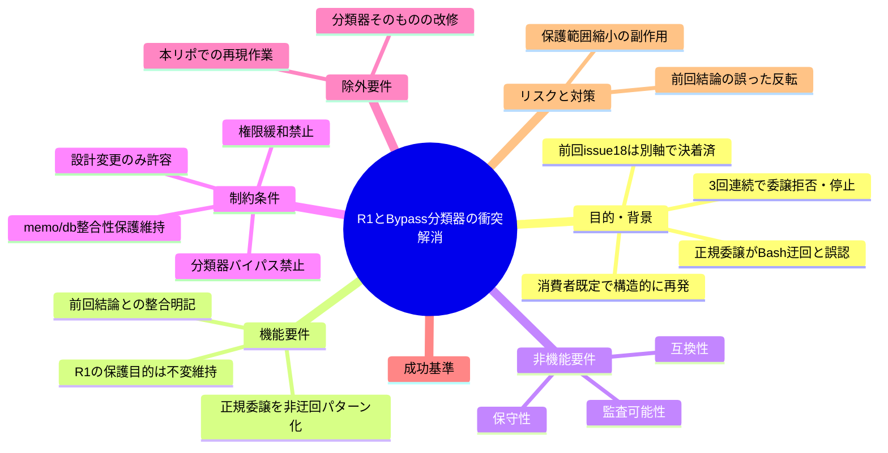
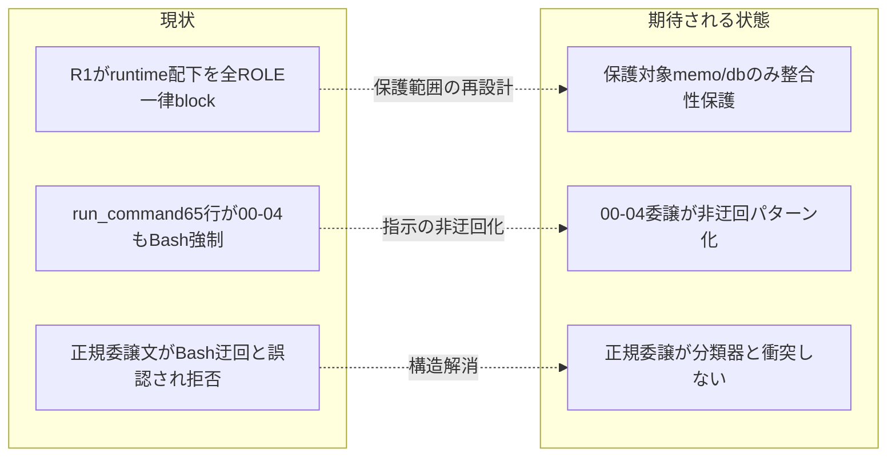

# 要求定義書: R1 の runtime/ 直接編集禁止（Bash heredoc 強制）と Auto Mode Bypass 分類器の構造的衝突の解消

**プロジェクト名**: R1 の runtime/ 直接編集禁止（Bash heredoc 強制）と Auto Mode Bypass 分類器の構造的衝突の解消
**作成日**: 2026 年 07 月 15 日
**最終更新**: 2026 年 07 月 15 日

> **重要**:
>
> - 要求定義書は、プロジェクトの全体像を把握するためのものです。詳細な技術仕様や実装方法は要件定義書以降で記載します。
> - **このドキュメントは常に更新**: 要求の変更や追加があった場合は、即座にこのドキュメントを更新してください。
> - **必須項目**: 「必須」と明記した項目は空欄・抽象語のみで提出しないこと。
>
> **用語**: [.agent-skill-chain/source/CONCEPTS.md §用語規約](../../../../.agent-skill-chain/source/CONCEPTS.md#用語規約) を参照。

---

## 要求定義の全体像

**注意**:

- マインドマップは全体像を把握するためのものです。詳細は各節に記載します。

---

## 1. 目的・背景

### 1.1 目的（必須）

正規の委譲作業が Bash 迂回パターンに該当しない形へ本フレームワーク設計を是正する。

### 1.2 背景

- **現状の課題**:
  - 本フレームワークを導入した別プロジェクトの Claude Code セッションで、orchestrator が「00〜04 等の作成・更新」をサブエージェントへ委譲しようとした際、Claude Code の **Auto Mode Bypass 分類器**により「`.agent-skill-chain/runtime/` へ Bash heredoc で直接書き込ませる＝Edit/Write 制限を回避する Bash 迂回パターン」として**3 回連続で拒否**され、orchestrator が作業を停止した（背景報告全文）。evidence_source: human_decision（他プロジェクト不具合報告 + orchestrator 一次診断）。
  - 一次情報で確認した構造的原因は次の 2 点である。
    - **R1（PreToolUse.sh）**: `.agent-skill-chain/runtime/` 配下への Edit/Write を、`IS_SUBAGENT` の値・ROLE に**一切関係なく一律 block** する。唯一の例外は `.agent-skill-chain/runtime/.gitignore` への**厳密パス一致のみ**。この block は `if [[ "$TOOL" == "Edit" || "$TOOL" == "Write" ]]` の内側にあり、ロール分岐を持たない（`PreToolUse.sh` 269〜274 行）。evidence_source: existing_code。
    - **run_command.md §Constraints（65 行目）**: 「`.agent-skill-chain/runtime/` 配下（memo・**00〜04 ドキュメント等**）へファイルを新規作成・編集する場合は、Bash ツール（heredoc 等）で直接作成すること。Edit/Write ツールはこの配下では使用できない」と明記。これは消費者環境で orchestrator が発行する**あらゆる**委譲文（00〜04 の作成・更新、memo 作成）に**一律で**適用される。evidence_source: existing_code。
  - この「Edit/Write が使えないので Bash heredoc で書け」という指示は、Auto Mode Bypass 分類器が検知する「Edit/Write 制限のある箇所への Bash 迂回」という攻撃シグネチャと**文面上区別がつかない**。したがって、**消費者環境の既定設定（`.agent-skill-chain/runtime/` を issue 配置場所とする）では、本フレームワークの正規委譲文そのものが分類器と構造的に衝突し続ける**と考えられる。evidence_source: existing_code（構造）+ human_decision（分類器の反応は報告事実であり本リポで独立再現不能）。

- **必要性**:
  - この衝突は言い回しの調整では解決できない（言い回しを変えて分類器を欺くことは禁止事項であり、また構造的原因が残る限り再発する）。**本フレームワーク自身の設計・ルールを変更**しない限り、既定設定の消費者は正規作業を進められない。
  - 一方で R1 には保護目的があり（後述）、単純に R1 を撤廃することはできない。**保護目的を維持したまま**衝突を解消する必要がある。

### 1.3 期待される効果（必須: 1 件以上）

- **効果 1**: 消費者環境の既定設定において、00〜04 の作成・更新を委譲する正規委譲文が、Auto Mode Bypass 分類器の「Bash 迂回」シグネチャに構造上該当しなくなる（○/×判定可能: 是正後の正規委譲手順が「Edit/Write 制限を Bash で回避する」という文面を必要としない）。
- **効果 2**: R1 が保護する対象（memo のタイムスタンプ整合性・workflow.db の書込整合性）は是正後も維持され、当該対象への Edit/Write は引き続き block される（○/×判定可能: memo・workflow.db への Edit/Write が是正後も拒否される）。
- **効果 3**: 前回 issue #18 の結論（R1 の全 ROLE 一律は保護目的を持つ意図的設計であり bug ではない）を覆さずに衝突が解消される（○/×判定可能: 是正が #18 の結論と矛盾しないことが文書で追跡可能）。

**現状と期待される状態の比較**:

---

## 2. 機能要件

### 2.1 既存機能の維持（該当する場合）

- R1 の保護目的の中核である **memo タイムスタンプ整合性**（`YYYYMMDD_HHMMSS_` プレフィックスをシステム時計へ固定）と **workflow.db 書込整合性**（書記 write-workflow-log.sh のみが書く）を、是正後も維持する。
- R2（orchestrator 限定 allowlist）・R3〜R6（Bash/scribe/sqlite3 判定）など R1 以外の enforcement 判定は変更しない（本 issue の対象外）。
- issue #18 で確定した「R1（全 ROLE path 軸）と R2（orchestrator 限定 role 軸）の非対称は意図的設計」という結論を維持する。

### 2.2 新規機能要件

- 消費者環境の既定設定で、**00〜04 の issue ドキュメントの作成・更新に用いる正規委譲手順**が、「Edit/Write 制限を Bash で回避する」という文面・構造を必要としない状態にする。
- 具体的な実現方式（R1 の保護範囲を 00〜04 について狭める／run_command.md の指示を非迂回化する／その他）は**設計フェーズ（design-feature）の重要判断**として ADR 形式で決定する。本要求定義では方式を確定せず、満たすべき制約と受け入れ基準のみを定義する。

---

## 3. 非機能要件

### 3.1 パフォーマンス

- enforcement hook（PreToolUse.sh）の実行コストを実質的に増加させないこと（判定分岐の追加は定数時間の範囲に留める）。

### 3.2 セキュリティ

- 是正は enforcement の中核セキュリティ強制ファイルに触れるため、**保護目的の後退を招かない**ことを最優先とする。memo タイムスタンプ偽装・workflow.db 直接書込という R1 が塞ぐ経路を、是正後に新たに開いてはならない。
- 分類器バイパス（言い回しで欺く）・権限緩和（ユーザーに設定を緩めさせる）・false positive の押し通しは**いずれも採用しない**。

### 3.3 互換性

- 既存消費者環境（既に `.agent-skill-chain/runtime/` を使用中）で、是正後も既存の memo・workflow.db・00〜04 が破損・不整合を起こさないこと。
- 本リポジトリ（issue 配置は `docs/maintainer/workflow/`＝runtime/ 外のため R1 非発火）の既存フローに退行を起こさないこと。

### 3.4 保守性

- R1 の判定ロジックと保護目的の対応（何を・なぜ守るか）を、是正後に enforcement 文書（DESIGN.md / README.md）と run_command.md で一貫して追跡できること。1 ファイル 1 責務・重複禁止の原則を維持する。

---

## 4. 制約条件

### 4.1 技術的制約

- **許容される解決の方向性は 1 つのみ**: 本フレームワーク自身の設計・ルール（PreToolUse.sh の R1 やその関連文書 run_command.md / DESIGN.md / README.md）を変更し、正規委譲がそもそも Bash 迂回パターンに該当しない形にすること。
- **禁止（絶対）**: (a) 委譲文の言い回しを変えて分類器を欺くこと、(b) ユーザーに Bash 権限設定を緩めるよう求めること、(c)「これは false positive だ」と説明して押し通すこと。これらはすべて対象外。
- R1 の保護目的（memo タイムスタンプ整合性・workflow.db 書込整合性）を後退させないこと。

### 4.2 既存システムとの互換性

- issue #18・commit 812cb49 で反映済みの記述（DESIGN.md の R1 非対称の意図、README.md、EVIDENCE_POLICY.md の調査規律）と矛盾する変更を行わないこと。是正が #18 の結論を反転させるものでないことを文書で明示すること。

### 4.3 移行期間・スケジュール

- 既存消費者環境へは `upgrade`（`.claude/hooks/` 再配備）を通じて反映される。配備済み hook と正本の乖離検知（`check-hook-drift.sh`）の運用に従う。移行手順の詳細化は設計フェーズで扱う。

---

## 5. 除外要件

- **Claude Code の Auto Mode Bypass 分類器そのものの改修・設定変更**は対象外（本フレームワーク側では制御できない外部要素）。
- **本リポジトリでの衝突の再現作業**は不要（本リポの issue は `docs/maintainer/workflow/` に置かれ R1 が発火しないため、衝突は再現しない）。是正対象は配布パッケージ（`.agent-skill-chain/source/`）である。
- R1 以外の enforcement 判定（R2〜R6）の変更。
- memo・workflow.db の書込手段そのものの変更（これらは Bash 経由が技術的に必須＝タイムスタンプ生成・DB ラッパーのため。本 issue の非迂回化対象は「技術的必然性のない 00〜04」に限る）。

---

## 6. 成功基準（必須: 1 件以上）

1. 消費者環境の既定設定（`.agent-skill-chain/runtime/` を issue 配置場所とする）で、00〜04 の作成・更新を委譲する正規委譲手順が、「Edit/Write 制限を Bash で回避する」という文面・構造を必要としない（○/× 判定可能）。
2. 是正後も、memo への Edit/Write（タイムスタンプ偽装経路）と workflow.db への Edit/Write（書記以外の直接書込経路）は引き続き block される（○/× 判定可能）。
3. 是正が issue #18 の結論（R1 の全 ROLE 一律は保護目的を持つ意図的設計）を反転させず、本 issue の論点（保護「範囲の広さ」）が #18 の論点（保護「目的の有無」）と別軸であることが成果物（00/01 および設計 ADR）で文書化されている（○/× 判定可能）。
4. 分類器バイパス・権限緩和・false positive 押し通しのいずれの手段も採用していない（設計・ルール変更のみである）（○/× 判定可能）。

---

## 7. リスクと対策

### 7.1 技術的リスク

- **リスク**: R1 の保護範囲を 00〜04 について狭める方式を採る場合、carve-out（例外パス）の判定が緩いと、悪意ある名前（`00_x.md` 等）で memo・db 相当の保護対象への書込を偽装される余地が生じうる。
  - **対策**: 是正方式の決定は設計フェーズの重要判断として ADR 化し、carve-out を採る場合は `.gitignore` 例外と同様の**厳密パス一致**による狭い許可に限定する等、バイパス面を増やさない設計を採る。evidence_source: existing_code（R1 の `.gitignore` 厳密一致例外 = PreToolUse.sh 270 行の既存パターン）。
- **リスク（CodeRabbit PR#92 指摘・対応済み）**: carve-out の basename 判定が文字列一致のみだと、doc 名（例 `00_要求定義.md`）の **symlink/hardlink** が実体として `memo/` 配下・`workflow.db*` を指す場合、**善意の通常 Edit/Write** が気づかず保護対象を破壊しうる（Bash 権限の有無に依らない。事前に仕込まれた symlink による事故シナリオ。権限昇格ではなく事故防止の問題）。当初レビューはこれを「Bash 権限があれば元々書込可能＝新規昇格なし」として残存リスク受容したが、事故防止の観点を見落とした誤判断であった。
  - **対策**: R5（scribe 経路）が既に用いる realpath 実体解決（`norm_path()`）と同型の解決を R1 carve-out にも適用し、実体が `/memo/`・`workflow.db*` を指す場合は block する（02_設計 ADR-4・03_実装計画 タスク6）。hardlink は `stat` のリンク数（`nlink>1`）で best-effort 検知する。回帰テスト（UC14・jq/nojq 両系統）で固定化。evidence_source: existing_code（PreToolUse.sh R5 `norm_path()` の既存パターン）+ human_decision（CodeRabbit 指摘の再評価による受容判断の是正）。
- **リスク**: 前回 issue #18 の結論を誤って「間違いだった」と反転させ、R1 の保護目的自体を否定してしまう。
  - **対策**: EVIDENCE_POLICY.md §「バグ/矛盾と結論づける前の関連ルール横断確認」に従い、#18 の結論（保護目的の有無＝Yes）と本 issue の論点（保護範囲の広さ）が**別軸**であることを一次情報で確認済み。R1 の保護目的は肯定したまま、その適用範囲のみを論点とする。evidence_source: existing_code（DESIGN.md 52〜53 行・commit 812cb49）。

### 7.2 スケジュールリスク

- **リスク**: 是正が enforcement 中核ファイルに及ぶため、レビュー・監査の負荷が高く、拙速な変更は退行を招く。
  - **対策**: 設計フェーズで review-docs ゲートを必須通過させ、opus ティアで設計・レビューを行う（MODEL_TIER_TABLE.md の「設計・レビュー・監査＝opus 固定」に従う）。

---

## 8. 参考資料

### プロジェクトドキュメント

- [.agent-skill-chain/source/enforcement/claude/PreToolUse.sh](../../../../.agent-skill-chain/source/enforcement/claude/PreToolUse.sh)（R1 実装・269〜274 行）
- [.agent-skill-chain/source/skills/agent/run_command.md](../../../../.agent-skill-chain/source/skills/agent/run_command.md)（§Constraints 65 行目・Bash 強制）
- [.agent-skill-chain/source/enforcement/DESIGN.md](../../../../.agent-skill-chain/source/enforcement/DESIGN.md)（R1 非対称の意図・52〜53 行）
- [.agent-skill-chain/source/enforcement/README.md](../../../../.agent-skill-chain/source/enforcement/README.md)
- [.agent-skill-chain/source/EVIDENCE_POLICY.md](../../../../.agent-skill-chain/source/EVIDENCE_POLICY.md)（調査規律）

### その他の参考資料

- commit 812cb49（issue #18 の結論反映・`docs: PreToolUse R1の意図的設計を明記し、バグ/矛盾断定前の調査規律を明文化`）
- 他プロジェクトからの不具合報告全文（本 issue 背景）

---

## 9. 次のステップ

この要求定義書の承認後、以下のドキュメントを作成します：

- **次**: [`01_要件定義.md`](./01_要件定義.md) - 要件定義フェーズ
