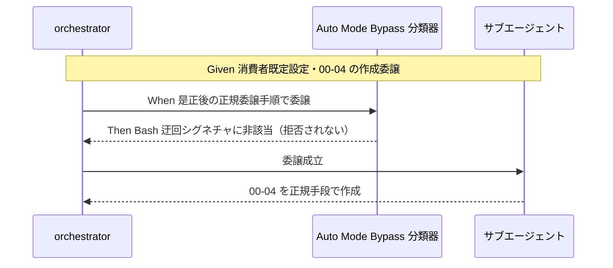

# 要件定義書: R1 の runtime/ 直接編集禁止（Bash heredoc 強制）と Auto Mode Bypass 分類器の構造的衝突の解消

**プロジェクト名**: R1 の runtime/ 直接編集禁止（Bash heredoc 強制）と Auto Mode Bypass 分類器の構造的衝突の解消
**作成日**: 2026 年 07 月 15 日
**最終更新**: 2026 年 07 月 15 日

> **重要**: **このドキュメントは常に更新**: 要件の変更や追加があった場合は、即座にこのドキュメントを更新してください。
>
> **用語**: [.agent-skill-chain/source/CONCEPTS.md §用語規約](../../../../.agent-skill-chain/source/CONCEPTS.md#用語規約) を参照。

---

## 1. 概要

### 1.1 システム概要

本フレームワーク（AGENTS.md skill chain）の enforcement 層 R1（PreToolUse.sh）は、`.agent-skill-chain/runtime/` 配下への Edit/Write を全 ROLE 一律で block する。あわせて run_command.md §Constraints（65 行目）が、consumer 環境で runtime/ 配下に 00〜04 等を作成・更新する際「Edit/Write は使えないので Bash heredoc で書け」と指示する。この 2 点により、正規委譲文が Claude Code の Auto Mode Bypass 分類器の「Edit/Write 制限への Bash 迂回」シグネチャと文面上一致し、消費者の既定設定で正規作業が構造的に拒否される。本件は、**R1 の保護目的（memo タイムスタンプ整合性・workflow.db 書込整合性）を維持したまま**、正規委譲が Bash 迂回パターンに該当しない設計へフレームワーク自身を是正することを要件とする。

### 1.2 用語集

| 用語 | 説明 |
| -------- | ------ |
| R1 | PreToolUse.sh 内の判定ルール。`.agent-skill-chain/runtime/` 配下への Edit/Write を全 ROLE 一律で block する（例外は `.gitignore` 厳密一致のみ）。path 軸のガード。 |
| R2 | PreToolUse.sh 内の判定ルール。orchestrator（main 限定・IS_SUBAGENT!=1）に allowlist 外ツールを拒否する。role 軸のガード。 |
| Auto Mode Bypass 分類器 | Claude Code 側の安全機構。委譲文が「Edit/Write 制限のある箇所へ Bash で書き込ませて回避する」パターンに該当すると委譲を拒否する。本フレームワークの制御外。 |
| Bash 迂回パターン | Edit/Write が制限された対象へ、Bash（heredoc/cp 等）で直接書き込ませることで制限を回避する操作シグネチャ。 |
| 保護範囲の広さ | R1 が「runtime/ 配下の全て」を対象とするか、「memo・workflow.db 等の整合性を要する対象のみ」に絞るか、という適用範囲の論点。本 issue の中心軸。 |
| issue #18 | 2026-07-13 に「R1（全 ROLE）と R2（orchestrator 限定）の非対称は意図的設計であり bug ではない」と結論づけてクローズ済みの先行 issue（commit 812cb49）。 |

---

## 2. 機能要件

### 2.1 ユーザーストーリー

#### ストーリー 1: 消費者環境の正規委譲が分類器に拒否されない

- **As a** 本フレームワークを既定設定（runtime/ を issue 配置場所とする）で導入した消費者環境の orchestrator
- **I want to** 00〜04 の作成・更新をサブエージェントへ委譲するとき、Auto Mode Bypass 分類器に「Bash 迂回」として拒否されないようにしたい
- **So that** 正規のワークフロー（要求定義・要件定義・設計・実装計画・実装）を停止せず遂行できる

**受け入れ基準**:

- 是正後の正規委譲手順が、「Edit/Write 制限を Bash で回避する」という文面・構造を必要としない。
- 00〜04 の作成・更新について、分類器の Bash 迂回シグネチャに構造上該当しない。

#### ストーリー 2: R1 の保護目的が維持される

- **As a** 本フレームワークの保守者（enforcement の正しさに責任を持つ）
- **I want to** 是正後も memo のタイムスタンプ整合性と workflow.db の書込整合性が守られることを保証したい
- **So that** timestamp 偽装や書記以外の DB 直接書込という R1 が塞いでいた経路が再び開かない

**受け入れ基準**:

- memo（`YYYYMMDD_HHMMSS_*.md`）への Edit/Write は是正後も block される。
- workflow.db（および -wal/-shm）への Edit/Write は是正後も block される。
- R2〜R6 の判定は変更されない。

#### ストーリー 3: 前回結論との整合が文書で追跡できる

- **As a** 将来この領域を調査する保守者・サブエージェント
- **I want to** 本 issue の是正が issue #18 の結論を反転させたものではないと明確に判別したい
- **So that** 「前回は間違っていた」という誤った再解釈や、調査規律（EVIDENCE_POLICY.md）違反の再発を防げる

**受け入れ基準**:

- 成果物（00/01 および設計 ADR）に、#18 の論点（保護「目的」の有無＝Yes）と本 issue の論点（保護「範囲」の広さ）が別軸であることが明記されている。
- R1 の保護目的そのものを否定する記述を含まない。

### 2.2 BDD ユースケース

#### ユースケース 1: 消費者環境での 00〜04 委譲

BDD シナリオは「是正後に満たすべき振る舞い」を記述する（実現方式は設計フェーズで確定するため、方式非依存で記述する）。

**シナリオ 1: 00〜04 の作成委譲が分類器に拒否されない**

```gherkin
Feature: 正規委譲の非迂回パターン化
  Scenario: 消費者環境で 00_要求定義.md の作成を委譲する
    Given 消費者環境が既定設定（.agent-skill-chain/runtime/ を issue 配置場所）である
    And orchestrator が 00_要求定義.md の作成をサブエージェントへ委譲する
    When 正規の委譲手順（是正後のフレームワーク定義）に従う
    Then 委譲文は「Edit/Write 制限を Bash で回避する」という構造を持たない
    And Auto Mode Bypass 分類器の Bash 迂回シグネチャに該当しない
```

**処理フロー**:



**シナリオ 2: memo・workflow.db の整合性保護は維持される**

```gherkin
Feature: 保護目的の維持
  Scenario: memo/workflow.db への Edit/Write は引き続き拒否される
    Given 是正が適用された環境である
    When 任意のロールが memo（YYYYMMDD_HHMMSS_*.md）または workflow.db へ Edit/Write する
    Then その操作は R1 相当のガードで block される
    And タイムスタンプ整合性・書記のみ書込という保護が保たれる
```

#### ユースケース 2: 調査規律の遵守（前回結論との整合）

**シナリオ 1: 別軸であることの文書化**

```gherkin
Feature: 前回結論との整合
  Scenario: issue #18 の結論を反転させない
    Given issue #18 が「R1 の全 ROLE 一律は保護目的を持つ意図的設計」と結論済みである
    When 本 issue の是正内容を成果物に記述する
    Then #18 の論点（保護目的の有無）と本 issue の論点（保護範囲の広さ）が別軸であると明記される
    And R1 の保護目的を否定する記述を含まない
```

### 2.3 ビジネスルール

- **BR-1（許容解のみ）**: 解決は「フレームワーク自身の設計・ルールを変更し、正規委譲が Bash 迂回パターンに該当しない形にする」ことに限る。分類器バイパス・権限緩和・false positive 押し通しは禁止。
- **BR-2（保護後退禁止）**: memo タイムスタンプ整合性・workflow.db 書込整合性の保護を後退させない。是正で新たなバイパス面を増やさない。
- **BR-3（範囲限定）**: 非迂回化の対象は「技術的必然性のない 00〜04 等の issue ドキュメント全般」に限る（具体的な basename 集合は design-feature で `.agent-skill-chain/runtime/templates/` 全体を突き合わせて確定する。「00〜04」は本要件定義における簡略表記であり、00〜04 の4件のみに限定する趣旨ではない）。memo・workflow.db は Bash 経由が技術的に必須（タイムスタンプ生成・DB ラッパー）のため対象外。
- **BR-4（方式は設計で決定）**: 具体的実現方式（R1 の保護範囲を 00〜04 について狭める／run_command.md の指示を非迂回化する／その他）は design-feature の重要判断として ADR で決定する。本要件では方式を確定しない。
- **BR-5（前回結論不反転）**: issue #18 の結論を反転させない。両者が別軸であることを文書化する。

---

## 3. 非機能要件

### 3.1 パフォーマンス要件

- PreToolUse.sh の判定分岐追加は定数時間の範囲に留め、hook 実行コストを実質的に増加させない。

### 3.2 セキュリティ要件

- 是正は enforcement 中核ファイルに触れるため、保護目的の後退を最優先で回避する。
- carve-out を採る場合は `.gitignore` 例外（PreToolUse.sh 270 行）と同様に厳密パス一致で狭く許可し、偽装（`00_x.md` 等の名前による保護対象への書込偽装）を招かない。

### 3.3 ユーザビリティ要件

- 是正後の正規委譲手順は、consumer 環境の orchestrator が特別な回避知識なしに遂行できる（分類器に拒否されない）こと。

### 3.4 可用性要件

- 既存消費者環境で `upgrade` により是正が反映されるまでの間も、既存の memo・workflow.db・00〜04 が破損しないこと（後方互換）。

---

## 4. 外部インターフェース要件

### 4.1 API 要件

- 該当なし（外部 API を新設しない）。是正は enforcement hook（PreToolUse.sh）と関連ルール文書（run_command.md / DESIGN.md / README.md）の変更に閉じる。

### 4.2 データ形式要件

- 00〜04 の frontmatter・ファイル名規約（`00_要求定義.md` 等の固定名）は変更しない。memo のファイル名規約（`YYYYMMDD_HHMMSS_` プレフィックス）も変更しない。

---

## 5. 制約事項

- **C-1**: 許容される解決の方向性は「フレームワーク自身の設計・ルール変更」のみ（BR-1）。
- **C-2**: R1 の保護目的（memo タイムスタンプ整合性・workflow.db 書込整合性）を維持する（BR-2）。
- **C-3**: issue #18・commit 812cb49 で反映済みの記述と矛盾しない（BR-5）。
- **C-4**: Claude Code の Auto Mode Bypass 分類器そのものは変更対象外（フレームワーク制御外）。
- **C-5**: 是正対象は配布パッケージ `.agent-skill-chain/source/` 側であり、本リポジトリでの衝突再現作業は不要（本リポ issue は `docs/maintainer/workflow/`＝runtime/ 外で R1 非発火）。
- **C-6**: 設計フェーズで review-docs ゲートを必須通過させ、設計・レビュー・監査は opus ティアで行う（MODEL_TIER_TABLE.md）。

---

## 6. 参考資料

### プロジェクトドキュメント

- [`00_要求定義.md`](./00_要求定義.md) - 要求定義
- [.agent-skill-chain/source/enforcement/claude/PreToolUse.sh](../../../../.agent-skill-chain/source/enforcement/claude/PreToolUse.sh)（R1 実装）
- [.agent-skill-chain/source/skills/agent/run_command.md](../../../../.agent-skill-chain/source/skills/agent/run_command.md)（§Constraints 65 行目）
- [.agent-skill-chain/source/enforcement/DESIGN.md](../../../../.agent-skill-chain/source/enforcement/DESIGN.md)（R1 非対称の意図）
- [.agent-skill-chain/source/EVIDENCE_POLICY.md](../../../../.agent-skill-chain/source/EVIDENCE_POLICY.md)（調査規律）

### その他の参考資料

- commit 812cb49（issue #18 の結論反映）
- 他プロジェクトからの不具合報告全文（本 issue 背景）

---

## 7. 前のステップ

この要件定義書は、以下のドキュメントを基に作成されています：

- **前**: [`00_要求定義.md`](./00_要求定義.md) - 要求定義フェーズ

---

## 8. 次のステップ

この要件定義書の承認後、以下のドキュメントを作成します：

- **次**: [`02_設計.md`](./02_設計.md) - 設計フェーズ
