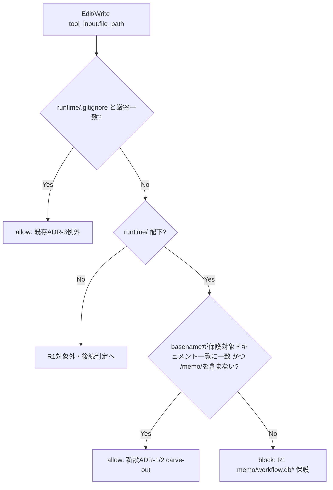
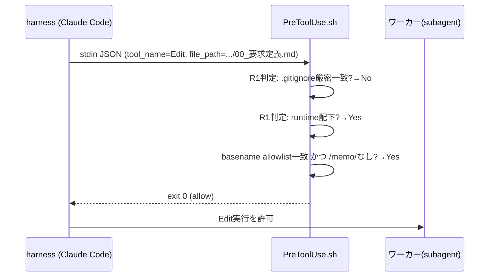
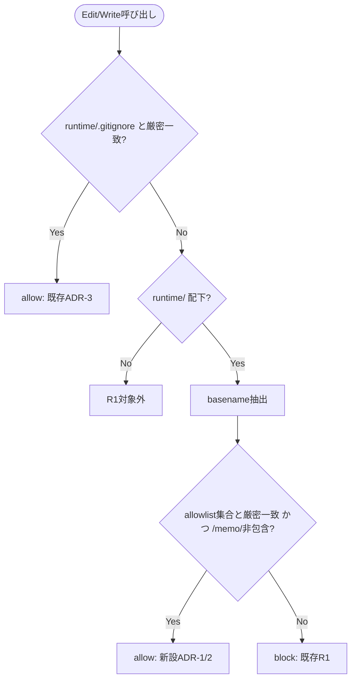

# 設計書: R1 の runtime/ 直接編集禁止（Bash heredoc 強制）と Auto Mode Bypass 分類器の構造的衝突の解消

**プロジェクト名**: R1 の runtime/ 直接編集禁止（Bash heredoc 強制）と Auto Mode Bypass 分類器の構造的衝突の解消
**作成日**: 2026 年 07 月 15 日
**最終更新**: 2026 年 07 月 15 日

> **重要**: **このドキュメントは常に更新**: 設計の変更や追加があった場合は、即座にこのドキュメントを更新してください。
>
> **用語**: [.agent-skill-chain/source/CONCEPTS.md §用語規約](../../../../.agent-skill-chain/source/CONCEPTS.md#用語規約) を参照。

---

## 1. 設計概要

### 1.1 設計方針

R1（PreToolUse.sh の `.agent-skill-chain/runtime/` 配下 Edit/Write 一律禁止）を、**保護が実際に必要な対象（memo・workflow.db）のみに絞った allowlist 方式**へ狭める。00〜04・90_issues.md 等の issue ドキュメントは Edit/Write を許可し、正規委譲が Bash 迂回パターンに構造上該当しない状態にする。

### 1.2 設計原則（本プロジェクトで適用するもの）

- **単一責務**: R1 の責務を「保護対象（timestamp 整合性・DB 書込整合性を要するファイル）のみを守る」に純化する。issue ドキュメントの編集可否は R1 の責務外とする。
- **明確な境界**: R1（path 軸・保護対象の carve-out）と R2〜R6（role 軸・ツール軸の判定）の境界は変更しない。本設計は R1 の**内部の適用範囲**のみを変更する。
- **AIフレンドリー設計**: 変更は `PreToolUse.sh` の該当ブロック（既存の R1 条件分岐）内に閉じ、既存の `.gitignore` 厳密パス一致例外（ADR-3・270 行）と同型の「厳密一致による狭い許可」パターンを踏襲する。新しい判定様式を持ち込まない。

---

## 2. アーキテクチャ設計

### 2.1 責務・境界・参照関係

#### 2.1.1 責務一覧

| コンポーネント | 責務（1 文） |
| -------------------- | -------------------- |
| `PreToolUse.sh` R1 ブロック | `.agent-skill-chain/runtime/` 配下への Edit/Write のうち、**保護対象（memo・workflow.db\*）のみ**を全 ROLE 一律で block する。issue ドキュメント（00〜04・90_issues.md）は allow する。 |
| `run_command.md` §Constraints（runtime/ 書き込み手段の記述） | 消費者環境の委譲文が、memo・workflow.db への書き込みと 00〜04 等ドキュメントへの書き込みを**区別して**指示する。 |
| `enforcement/DESIGN.md` §R1 非対称の意図記述 | R1 の保護範囲が「runtime/ 全体」ではなく「memo・workflow.db\*」に絞られたことを、issue #18 の結論（非対称は意図的設計）を否定せずに追記する。 |
| `enforcement/README.md` | R1 の carve-out（00〜04 allow）を「矯正するもの」節に反映する。 |
| `test/test-pretooluse-hook.sh` | R1 の新しい適用範囲（memo/workflow.db は block、00〜04 は allow）を単体テストで検証する。 |
| `test/e2e-claude-hook.sh` | `e2e_workflow_edit_blocked`（現状 00_要求定義.md への Edit を block と期待）を、新しい仕様（00 は allow・memo は block）に合わせて更新する。 |

#### 2.1.2 境界

- **入力**: PreToolUse hook が受け取る stdin JSON（`tool_name`・`tool_input.file_path` 等）。既存の R1 判定と同じ入力契約を使う（新規入力なし）。
- **出力**: exit 0（allow）/ exit 2（block）+ 案内メッセージ。既存の出力契約を変更しない。
- **他責務との境界**: R2（orchestrator allowlist）・R3〜R6（Bash/scribe/sqlite3 判定）は本設計の対象外。Auto Mode Bypass 分類器そのものの改修は対象外（フレームワーク制御外・要求定義 §除外要件）。

#### 2.1.3 参照関係

- `run_command.md §Constraints` → `PreToolUse.sh R1`（記述が実装と整合している必要がある）。
- `enforcement/DESIGN.md §R1 非対称の意図` → `PreToolUse.sh R1`（設計意図の記述と実装の対応）。
- `test/test-pretooluse-hook.sh` → `PreToolUse.sh`（隔離環境でのオーバーレイ経由・既存 UC9 と同型の呼び出し）。
- `test/e2e-claude-hook.sh` → 配線済み `.claude/hooks/PreToolUse.sh`（E2E 経由）。
- 循環参照なし。他 issue・他サービスとの参照境界は無し（本 issue は enforcement 正本 1 箇所に閉じる）。

### 2.2 システムアーキテクチャ

- **採用パターン**: 既存の allowlist（厳密パス一致による狭い許可）パターンの拡張。新規アーキテクチャパターンは導入しない。
- **根拠**: spec/06_設計判断の優先順位「1. 可読性 → 2. 単一責務」に従い、既存の `.gitignore` 例外（ADR-3）と同一の判定様式（厳密一致・basename 判定）を再利用することで、新しい判定ロジックを覚える負荷を増やさない。evidence_source: existing_code（PreToolUse.sh 270 行の既存パターン）。

#### 2.2.1 CQRS（Command/Query 分離）

該当なし（PreToolUse.sh は状態を持たない判定＝Query 相当の read-only 判定であり、状態変更を伴わない。本節は適用外）。

#### 2.2.2 アーキテクチャ図

### 2.3 コンポーネント構成

- `PreToolUse.sh` の R1 ブロック（既存 265〜275 行相当）に、basename 判定による carve-out を追加する。既存の `.gitignore` 厳密一致（ADR-3）はそのまま維持し、その次の判定として「保護対象ドキュメント basename の allowlist」を追加する。
- 判定順序: (1) `.gitignore` 厳密一致 → allow、(2) 保護対象ドキュメント basename allowlist 一致 かつ パスに `/memo/` を含まない → allow、(3) それ以外の `runtime/` 配下 → block（既存どおり）。

### 2.4 データフロー

イベント駆動は適用しない（hook は単一リクエスト内の同期判定であり、イベント発行は行わない）。

### 2.5 横断設計判断（ADR）

#### ADR-1: R1 の保護範囲を「memo・workflow.db\*」のみへ絞り、issue ドキュメントを allowlist で明示的に許可する

> **表記注記**: 本節・本ドキュメント各所で「00〜04」「00〜04・90_issues.md」は issue ドキュメント全般を指す簡略表記である。allowlist の**正本（厳密な10 basename の列挙）は ADR-2**にあり、他箇所での重複列挙は避ける。

- **コンテキスト**: 他プロジェクトの orchestrator が、00〜04 の委譲文を Bash heredoc 強制で発行した結果、Claude Code の Auto Mode Bypass 分類器に 3 回連続で拒否された（00_要求定義.md §1.2 背景）。一次情報調査（PreToolUse.sh 265〜274 行、run_command.md 65 行、DESIGN.md 52〜53 行）により、R1 の保護目的は memo タイムスタンプ整合性・workflow.db 書込整合性の 2 点に限定されるにもかかわらず、実装は `runtime/` 配下全体を一律 block していることを確認した（保護目的と保護範囲の不一致）。
- **検討した選択肢**:
  1. **R1 の対象を絞る（採用）**: basename allowlist で 00〜04・90_issues.md を明示的に許可し、それ以外（memo/\*\*・workflow.db\*）は現状どおり block する。
  2. **project 側 opt-in override（.agent-skill-chain/project/enforcement/claude/PreToolUse.sh 全体差し替え・系統D）**: 各消費者プロジェクトが個別にオーバーライドファイルを用意する。
  3. **run_command.md の文言のみ変更（hook は変更しない）**: 「Bash で書け」という指示文言を柔らかい表現に変え、分類器の検知を回避する。
  4. **何もしない（現状維持）**: 消費者は Bash 権限設定の緩和や個別 override で個々に回避する。
- **決定**: 選択肢 1（R1 の対象を絞る）を採用する。
- **根拠**:
  - **消費者既定設定での解決**: 00_要求定義.md の成功基準 1 は「消費者環境の**既定設定**で衝突が解消されること」を求める。選択肢 2（project opt-in）は各消費者が個別に override を書く前提であり、既定設定を直さない（既定は依然として壊れたまま）。既定を直せるのは選択肢 1 のみ。evidence_source: existing_code（00_要求定義.md §6 成功基準 1）。
  - **文言変更のみでは解決しない**: 背景報告（00_要求定義.md §1.2）によれば、orchestrator は「制約説明を委譲文から外し、サブが PreToolUse の拒否メッセージから自然に把握する」形でも再度拒否された。これは分類器が委譲文の**言い回し**ではなく、**実際にツール呼び出しが Edit/Write 拒否済みパスへ Bash で書き込む挙動そのもの**を検知していることを強く示唆する。したがって選択肢 3（文言のみ変更）は hook の実装自体を変えない限り再発する。evidence_source: human_decision（他プロジェクト不具合報告の 3 回目拒否の事実）。
  - **安全性の論拠（新たなリスクを生まないことの論証）**:
    (a) **orchestrator 自身の直接編集は増えない**: R2 は `ROLE=="orchestrator" && IS_SUBAGENT!="1"` のとき Edit/Write を allowlist 外として無条件に block する（PreToolUse.sh 285・304〜306 行）。この判定は R1 とは独立した if ブロックであり、R1 の carve-out の有無に関係なく効き続ける。したがって R1 を 00〜04 について緩めても、orchestrator が自ら 00〜04 を直接編集できるようにはならない。evidence_source: existing_code（PreToolUse.sh 277〜320 行）。
    (b) **subagent worker の実効的な書込能力は増えない**: 非 scribe の subagent worker（`IS_SUBAGENT=="1"`）は R3(b)（PreToolUse.sh 327 行のコメント）により Bash を allow されており、現状でも heredoc 等で 00〜04 の内容を完全に自由に書き換えられる（Edit/Write と等価な表現力）。R1 の carve-out は「同じ効果を得る手段が Bash から Edit/Write へ変わる／両方使えるようになる」だけであり、到達可能な権限の集合は拡大しない。evidence_source: existing_code（PreToolUse.sh 323〜330 行のコメント・DESIGN.md §R1 の非対称記述 52〜53 行）。
    (c) **保護対象（memo・workflow.db）は変更しない**: carve-out の allowlist は basename 完全一致（`00_要求定義.md`・`01_要件定義.md`・`02_設計.md`・`03_実装計画.md`・`04_review.md`・`90_issues.md`）かつパスに `/memo/` を含まないことを条件とする。memo ファイル（`YYYYMMDD_HHMMSS_*.md`）や `workflow.db`／`workflow.db-wal`／`workflow.db-shm` はこの basename 集合に含まれないため、引き続き block される。evidence_source: existing_code（allowlist 集合の定義自体が根拠）。
  - **前回 issue #18 との整合**: #18 の結論（R1 の全 ROLE 一律は意図的設計であり bug ではない）は、「R1 に保護目的があるか」という論点（Yes）を確定したものであり、「その保護目的達成に runtime/ 配下**全体**の block が必要か」という本 issue の論点（保護範囲の広さ）とは別軸である（EVIDENCE_POLICY.md §「バグ/矛盾と結論づける前の関連ルール横断確認」に従い確認済み・00_要求定義.md §1.2）。本 ADR は #18 の結論を否定せず、保護目的を維持したまま適用範囲を絞る**追加の洗練**として位置づける。
- **実装制約（review-docs ラウンド1で追加・必須）**: (a) の安全性論拠（orchestrator の Edit/Write は R2 が独立に block し続ける）は、**carve-out 判定がフォールスルー方式（`:` no-op）で実装されることに依存する**。既存の `.gitignore` 厳密一致例外（PreToolUse.sh 270〜271 行）は `allow()`（`exit 0` の早期終了）を呼ばず `:`（no-op）でフォールスルーしており、これにより後続の R2 判定が必ず評価される制御フローになっている。**新設の carve-out も同じくフォールスルー方式で実装しなければならない**。もし carve-out 判定を `allow()`（早期 `exit 0`）で実装した場合、`ROLE=orchestrator かつ IS_SUBAGENT!="1"`（main 自身）が doc basename を直接 Edit しようとした際に、R2 の評価に到達する前に `exit 0` してしまい、**orchestrator の直接編集が R2 を経由せず素通りする重大な退行**を招く。この制約は 03_実装計画タスク 1 の実装指示として明記し、対応する回帰テスト（タスク 4）で固定化する。evidence_source: existing_code（PreToolUse.sh 264〜321 行の制御フロー再トレースにより検証済み）。
  - **残存リスク（ROLE=unknown・要文書化）**: ADR-1(a)(b) の安全性論拠は「orchestrator（ROLE=orchestrator と識別済み）」「subagent worker（agent_id で識別済み）」の 2 ケースを扱うが、**AGENT_ROLE が orchestrator でも scribe でもない「unknown」（役割情報が正しく伝播しない、または hook を手動・非標準ハーネス経由で叩く場合）は R2 の block 条件（`ROLE=="orchestrator"`）にも該当せず、R3/R4/R5 の Bash 判定でも block される（PreToolUse.sh 330 行「(d) それ以外＝unknown/env-worker 等は従来どおり block」）**。現状、ROLE=unknown の場合 runtime/ 配下のいかなるファイルも Edit/Write も Bash も変更する手段が無い（完全に閉じている。既存 `uc5_unknown_role_workflow_blocked` テストが実証）。carve-out 導入後は、ROLE=unknown であっても doc basename への Edit/Write は新たに許可される。これは「役割検知が失敗した場合の防衛線」を doc ファイルに限って狭める変更であり、**低頻度だが実在する残存リスク**として受容する。根拠: DESIGN.md（`enforce on` 時 `AGENT_ROLE=orchestrator` が全実行に静的配線される）により、正規配備環境では ROLE は常に `orchestrator` または `scribe` のいずれかであり、「unknown」は主に手動実行・テスト・非標準ハーネスでのみ生じる（本番の主要攻撃面ではない）。memo・workflow.db\* の保護は ROLE に関わらず維持されるため、本残存リスクは保護目的の中核（タイムスタンプ整合性・DB 書込整合性）を損なわない。evidence_source: existing_code（PreToolUse.sh 323〜330 行・既存テスト uc5_unknown_role_workflow_blocked）+ human_decision（受容判断）。この残存リスクを黙示のまま narrowing するのではなく、本 ADR に明記し、対応する回帰テスト（タスク 4）で挙動を固定化する。
- **帰結**: `PreToolUse.sh` の R1 ブロックに、**フォールスルー方式（`:` no-op）の** basename allowlist 判定を追加する（03_実装計画 タスク 1）。`run_command.md §Constraints` の 65 行目を、memo・workflow.db は Bash 必須・00〜04 等は Edit/Write 可、と区別する記述に更新する（タスク 2）。`enforcement/DESIGN.md`・`README.md` に carve-out の記述（フォールスルー制約・ROLE=unknown 残存リスクを含む）を追記する（タスク 3）。`test/test-pretooluse-hook.sh`・`test/e2e-claude-hook.sh` に回帰テスト（UC3 の期待反転・UC8 ケース3 の期待反転・orchestrator 直接編集が引き続き block されることの確認・ROLE=unknown の新挙動固定化を含む）を追加・更新する（タスク 4・5）。既存配備済み環境への反映は `upgrade` 実行が必要（後述 §9.3 ロールアウト）。

#### ADR-2: allowlist は basename の厳密一致 + `/memo/` 非包含の組み合わせ判定とする（正規表現の緩いマッチは採らない）

- **コンテキスト**: carve-out の判定方式として、(i) basename 厳密一致、(ii) 拡張子 `.md` のみでの緩い判定、(iii) `00〜04` プレフィックスの数字のみでの前方一致、などが考えられる。
- **検討した選択肢**:
  1. **basename 厳密一致 + `/memo/` 非包含（採用）**: 固定集合との完全一致、かつパスが `/memo/` セグメントを含まないこと。
  2. **拡張子 `.md` のみで判定**: `runtime/` 配下の `*.md` を一律 allow する。
  3. **数字プレフィックスの前方一致**（例: `^0[0-4]_` にマッチすれば allow）。
- **決定**: 選択肢 1（basename 厳密一致 + `/memo/` 非包含）を採用する。
- **allowlist の固定集合（review-docs ラウンド1で網羅性を是正・確定）**: `{00_要求定義.md, 00_システム理解.md, 01_要件定義.md, 02_設計.md, 03_実装計画.md, 04_review.md, 05_最終確認チェックリスト.md, 90_issues.md, 99_PR.md, 99_PR_review.md}` の10 basename。
  - 初回ドラフトでは `00_要求定義.md, 01_要件定義.md, 02_設計.md, 03_実装計画.md, 04_review.md, 90_issues.md` の6件のみだったが、review-docs ラウンド1（敵対的観点4）で `.agent-skill-chain/runtime/templates/` 全体を突き合わせた結果、**RULES.md（§ドキュメント・26行目）・REVIEW_RULE.md（§フォーマットの正しさ・50行目）が document_id 必須対象として明示する「00/01/02/03/04/05/90」および「00_システム理解から作成するドキュメント」**、および **TEMPLATES.md の成果物表に掲載されている 99_PR.md・99_PR_review.md** が漏れていたことが判明し、4 件を追加した。evidence_source: existing_code（RULES.md 26行目・REVIEW_RULE.md 50行目・TEMPLATES.md 成果物表・`.agent-skill-chain/runtime/templates/` の実ファイル一覧突き合わせ）。
  - **`指摘対応/` 配下のテンプレート（`00_README.md`・`01_指摘一覧.md`・`02_対応方針.md`）は allowlist に含めない**: `create-pr-review-issue.md` の OUTPUT 定義を確認した結果、これらは別ファイルとして実体化されるのではなく、90_issues 用の `00_要求定義.md` 内のセクション（指摘一覧・対応方針案）として埋め込まれるため、basename としては既存の `00_要求定義.md` に包含される。evidence_source: existing_code（commands/create-pr-review-issue.md §OUTPUT・§参照）。
  - **`docs/` 配下・`github/` 配下・`agents/` 配下・`AGENTS_MERMAID_RULES.md` は対象外**: これらは issue ごとに `.agent-skill-chain/runtime/{issue}/` 直下へ実体化されるものではなく、システム仕様書・CI テンプレート等の別名前空間（`docs/`・`.github/`）に配置されるため、本 carve-out の対象範囲（issue ドキュメント）に該当しない。
- **`/memo/` 非包含判定の頑健性（review-docs ラウンド1で確認・敵対的観点5）**: `"/memo/"` という前後にスラッシュを要求する部分文字列判定は、偽装・lookalike パスに対して以下のとおり健全であることを確認した。
  - `.../mymemo/00_要求定義.md`（`memo` の前に文字がある） → `"/memo/"` は不一致 → basename が allowlist と一致すれば正しく allow される（誤って block しない）。
  - `.../memo2/00_要求定義.md`（`memo` の後に文字がある） → `"/memo/"` は不一致 → 同上、正しく allow される。
  - `.../memo/sub/00_要求定義.md`（実際に memo/ 配下） → `"/memo/"` が一致 → 正しく block される（保護対象の取りこぼしなし）。
  - 上記3ケースはいずれも文字列レベルで検証済みであり、追加の判定ロジックは不要と判断する。03_実装計画タスク4に確認用テストケースとして追加する。
- **根拠**: 選択肢 2 は `memo/*.md`（`YYYYMMDD_HHMMSS_*.md`）も `.md` である以上 allow してしまい、R1 の主保護対象（memo タイムスタンプ整合性）を破壊する。選択肢 3 は `00_なんとか.md` という偽装ファイル名を作られた場合に意図しない allow を招く余地がある（basename 完全一致より緩い）。選択肢 1 は既存の `.gitignore` 厳密パス一致例外（ADR-3・PreToolUse.sh 270 行）と同じ「厳密一致による狭い許可」という審査済みパターンを踏襲し、carve-out 自体が新たなバイパス面にならないようにする。evidence_source: existing_code（既存 ADR-3 パターンの踏襲）。
- **帰結**: 03_実装計画のタスク 1 で、basename 抽出（`${PATH_TARGET##*/}` 相当）→ 固定集合（10 basename）との厳密一致 → `/memo/` 非包含チェック、の 3 段判定として、**フォールスルー方式（ADR-1 実装制約）で**実装する。

#### ADR-3: 判定順序は既存 R1 ブロック内に閉じ、R2〜R6 の判定順序・分岐条件は変更しない

- **コンテキスト**: PreToolUse.sh は R1〜R6 まで複数の判定が順に並ぶ構造であり、他判定への影響を最小化する必要がある。
- **検討した選択肢**: (1) R1 ブロック内でのみ carve-out を追加（採用）。(2) R1 自体を撤廃し、R2〜R6 側で個別に runtime/ 保護を再実装する。
- **決定**: 選択肢 1。
- **根拠**: 選択肢 2 は保護ロジックを複数箇所に分散させ、1 ファイル 1 責務の原則（DESIGN.md §系統D の思想と同型）に反する。既存の判定順序（R1 が最初に評価される）を変えないことで、R2〜R6・scribe nonce 判定（C-4a/C-4b）・sqlite3 直接禁止（R6）への影響をゼロにする。evidence_source: existing_code（PreToolUse.sh 全体構造）。
- **帰結**: 変更は PreToolUse.sh の R1 ブロック（既存 264〜275 行相当）内のみに閉じる。他ブロックの diff はゼロを目標とする。

### 2.5.1 制約遵守の確認（01_要件定義.md との整合トレース・review-docs ラウンド1で追加）

本設計（ADR-1〜3）が 01_要件定義.md のビジネスルール（BR-1〜BR-5）・制約（C-1〜C-6）を満たすことを以下に確認する。

- **BR-1（許容解のみ）/ C-1**: 採用したのはフレームワーク自身の設計・ルール変更（PreToolUse.sh・run_command.md・DESIGN.md・README.md の更新）のみであり、分類器バイパス・権限緩和・false positive の押し通しはいずれも検討・採用していない（ADR-1 の検討した選択肢 2・3 を根拠とともに不採用としたとおり）。
- **BR-2（保護後退禁止）/ C-2**: memo・workflow.db\* は allowlist（10 basename）に含まれず、`/memo/` 非包含判定と合わせて保護は後退しない（ADR-2）。
- **BR-3（範囲限定）**: allowlist は「技術的必然性のない issue ドキュメント」のみに限定し、memo・workflow.db の書込手段（Bash 経由）は変更しない（ADR-2 の allowlist 定義・02_設計 §2.1.1 責務一覧）。
- **BR-4（方式は設計で決定）**: 本 02_設計で ADR-1〜3 として方式を確定した（要求定義段階では未確定のまま委ねられていた判断）。
- **BR-5（前回結論不反転）/ C-3**: ADR-1 の「前回 issue #18 との整合」節のとおり、#18 の結論（非対称は意図的設計）を否定せず、保護「範囲」を絞る追加の洗練として位置づけている。
- **C-4（分類器非改修）/ C-5（本リポでの再現不要）**: 本設計はいずれも遵守（対象は配布パッケージのみ、Auto Mode Bypass 分類器自体には触れない）。
- **C-6（review-docs 必須・opus ティア）**: 本レビュー自体が review-docs（opus ティア）として実施されている。

---

## 3. 機能設計

### 3.1 機能 1: R1 carve-out 判定（PreToolUse.sh）

#### 3.1.1 概要

`.agent-skill-chain/runtime/` 配下への Edit/Write を、保護対象（memo・workflow.db\*）のみに絞って block する。

#### 3.1.2 処理フロー

#### 3.1.3 入力・出力

- **入力**: `tool_name`（Edit/Write）、`tool_input.file_path`（正規化前のパス文字列）。
- **出力**: exit 0（allow）または exit 2（block）+ stderr 案内メッセージ。

#### 3.1.4 エラーハンドリング

- `file_path` が取得できない場合は既存の保守的方針（BR-4: 違反確証なしは reject しない）を維持し、R1 の carve-out 判定も同様にフェイルセーフ側（判定不能時は既存の block 側）に倒す。新規のエラーパスは追加しない。

### 3.2 機能 2: run_command.md §Constraints の区別記述

#### 3.2.1 概要

`.agent-skill-chain/runtime/` 配下への書き込み手段の指示を、「memo・workflow.db は Bash 必須」「00〜04・90_issues.md は Edit/Write 可」に区別する。

#### 3.2.2 処理フロー

該当なし（ドキュメント記述の更新のみ、実行時フローは持たない）。

#### 3.2.3 入力・出力

- **入力**: 03_実装計画のタスク 2（後述）。
- **出力**: 更新された `run_command.md §Constraints`（65 行目相当）。

#### 3.2.4 エラーハンドリング

該当なし。

---

## 4. データ設計

該当なし。本 issue はデータモデル・テーブルを新設・変更しない（PreToolUse.sh は状態を持たない判定スクリプトであり、workflow.db のスキーマにも影響しない）。

### 4.1 データモデル

該当なし。

### 4.2 データ構造

- **ALLOWED_DOC_BASENAMES**（新設の固定集合・PreToolUse.sh 内のシェル変数または case パターン）: `00_要求定義.md`, `00_システム理解.md`, `01_要件定義.md`, `02_設計.md`, `03_実装計画.md`, `04_review.md`, `05_最終確認チェックリスト.md`, `90_issues.md`, `99_PR.md`, `99_PR_review.md` の 10 basename（ADR-2 で `.agent-skill-chain/runtime/templates/` 全体との突き合わせにより確定）。将来のテンプレート追加（workflow/TEMPLATES.md）と同期させる必要がある（03_実装計画のリスク管理で言及）。

---

## 5. API 設計

該当なし。本 issue は外部 API を新設しない（enforcement hook のシェルスクリプト内部判定の変更に閉じる）。

### 5.1 API 一覧

該当なし。

### 5.2 API 詳細

該当なし。

---

## 6. テスト戦略

テスト戦略の観点定義は [RULES.md §テスト戦略必須要件](../../../../.agent-skill-chain/source/RULES.md#テスト戦略必須要件)、BDD 形式は [TEST_BDD_FORMAT.md](../../../../.agent-skill-chain/source/TEST_BDD_FORMAT.md) を参照。以下は対象ごとの割当のみ。

### 6.1 対象ごとのテスト割り当て

| 対象 | 単体 | 結合/API | E2E | クリティカル観点 | バリデーション観点 | 未達理由/補足 |
| --------------------------- | ----- | -------- | ----- | ---------------- | ------------------ | ------------- |
| PreToolUse.sh R1 carve-out（basename allowlist・10 basename） | ○ | × | ○ | 00〜05・90・99系 の doc basename への Edit/Write が allow されること | basename 厳密一致（前方一致・拡張子のみでの誤許可が無いこと） | 結合/API 該当なし（hook はシェルスクリプト単体・API 契約を持たない） |
| PreToolUse.sh R1 既存保護（memo・workflow.db\*） | ○ | × | ○ | memo・workflow.db・workflow.db-wal/-shm への Edit/Write が引き続き block されること | `.gitignore` 厳密一致例外が壊れていないこと（過剰マッチ防止の既存ケースが回帰しないこと） | 同上 |
| PreToolUse.sh R2 との独立性（フォールスルー制約） | ○ | × | × | orchestrator（main・非subagent）の doc basename への Edit/Write は carve-out 導入後も R2 により block され続けること | 該当なし | 結合/API・E2E は該当なし。carve-out のフォールスルー実装が R2 到達を妨げないことを単体で確認する（review-docs 敵対的観点1で追加） |
| PreToolUse.sh ROLE=unknown の新挙動 | ○ | × | × | ROLE=unknown + doc basename が新たに allow される一方、memo・workflow.dbは引き続き block されること | 該当なし | 残存リスクとして明示的に固定化するテスト（review-docs 敵対的観点3で追加） |
| e2e-claude-hook.sh（配線経由シナリオ） | × | × | ○ | 配線済み hook 経由でも 00 は allow・memo/db は block されること | 該当なし | 単体は test-pretooluse-hook.sh が担当するため e2e では重複させない |
| run_command.md / DESIGN.md / README.md の記述整合 | × | × | × | 記述と実装（R1 の新しい範囲）が矛盾しないこと | 該当なし | ドキュメント整合は人手レビュー（review-docs ゲート）で確認し、自動テスト対象外 |

### 6.2 監査・レビューでの確認（証跡）

- review-docs（実装前ドキュメントレビュー・implement-feature 着手前必須）で、本設計の ADR-1〜3 と 03_実装計画のタスク分解が整合しているかを確認する。
- verify-and-close（実装後）で、§6.1 の割当表と 03_実装計画のタスク別テスト観点・BDD が揃っていることを確認し、`test-pretooluse-hook.sh`・`e2e-claude-hook.sh` の実行結果を 04_review に記載する。

---

## 7. UI 設計

該当なし。本 issue に UI 要素はない。

### 7.1 画面遷移図

該当なし。

### 7.2 画面設計

該当なし。

---

## 8. セキュリティ設計

### 8.1 認証・認可

- R2（orchestrator allowlist）・scribe nonce 判定（C-4a/C-4b）は変更しない。本設計は R1 の適用範囲のみを変更し、認証・認可（role 軸の判定）には触れない。

### 8.2 データ保護

- memo タイムスタンプ整合性・workflow.db 書込整合性という R1 の保護目的は、ADR-1・ADR-2 の根拠で示したとおり後退させない。carve-out の allowlist は basename 厳密一致 + `/memo/` 非包含の組み合わせで、保護対象への偽装 allow を防ぐ（ADR-2）。

---

## 9. 非機能要件への対応

### 9.1 パフォーマンス

- 追加する判定は固定集合との文字列比較（basename 抽出 + case 文または配列照合）であり、定数時間。既存の `.gitignore` 厳密一致判定と同オーダーのコストであり、hook 実行コストの実質増加はない。

### 9.2 可用性

該当なし（本変更は可用性に影響しない静的判定ロジックの追加）。

### 9.3 ロールアウト・影響範囲（既存配備済み環境への波及）

- 本変更は正本 `.agent-skill-chain/source/enforcement/claude/PreToolUse.sh` のみを変更する。既に `.claude/hooks/` へ配備済みの消費者環境には、[enforcement/README.md §配備済み hook と正本の乖離検知](../../../../.agent-skill-chain/source/enforcement/README.md) の既存運用どおり、**`upgrade`（`agents-md upgrade` または `setup.sh` 再実行）を実行するまで自動反映されない**。乖離の有無は `scripts/check-hook-drift.sh` で read-only に確認できる（新規スクリプトは追加しない・既存運用に乗る）。
- 本リポジトリ自身（自己拡張・ドッグフーディング環境）は issue を `docs/maintainer/workflow/` に置き R1 が発火しないため、本変更による本リポの既存フローへの退行は無い。

---

## 10. 参考資料

### プロジェクトドキュメント

- [`01_要件定義.md`](./01_要件定義.md) - 要件定義
- [.agent-skill-chain/source/enforcement/claude/PreToolUse.sh](../../../../.agent-skill-chain/source/enforcement/claude/PreToolUse.sh)（R1 実装・265〜330 行）
- [.agent-skill-chain/source/skills/agent/run_command.md](../../../../.agent-skill-chain/source/skills/agent/run_command.md)（§Constraints 65 行目）
- [.agent-skill-chain/source/enforcement/DESIGN.md](../../../../.agent-skill-chain/source/enforcement/DESIGN.md)（R1 非対称の意図・52〜53 行）
- [.agent-skill-chain/source/enforcement/README.md](../../../../.agent-skill-chain/source/enforcement/README.md)（配備済み hook と正本の乖離検知）
- [test/test-pretooluse-hook.sh](../../../../test/test-pretooluse-hook.sh)（UC9 既存パターン）
- [test/e2e-claude-hook.sh](../../../../test/e2e-claude-hook.sh)（`e2e_workflow_edit_blocked`）

### その他の参考資料

- commit 812cb49（issue #18 の結論反映）
- 他プロジェクトからの不具合報告全文（本 issue 背景）

---

## 11. 前のステップ

この設計書は、以下のドキュメントを基に作成されています：

- **前**: [`01_要件定義.md`](./01_要件定義.md) - 要件定義フェーズ

---

## 12. 次のステップ

この設計書の承認後、以下のドキュメントを作成します：

- **次**: [`03_実装計画.md`](./03_実装計画.md) - 実装計画フェーズ
