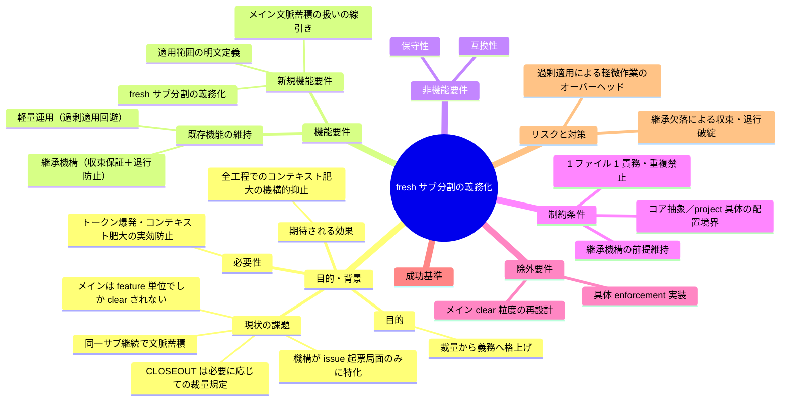
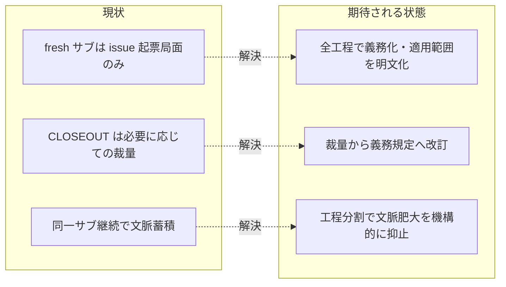

# 要求定義書: fresh サブ分割の義務化

**プロジェクト名**: fresh サブ分割の義務化
**作成日**: 2026 年 07 月 15 日
**最終更新**: 2026 年 07 月 15 日

> **重要**:
>
> - 要求定義書は、プロジェクトの全体像を把握するためのものです。詳細な技術仕様や実装方法は要件定義書以降で記載します。必要最低限の情報に収めることを心掛けてください。
> - **このドキュメントは常に更新**: 要求の変更や追加があった場合は、即座にこのドキュメントを更新してください。ドキュメントは「生きているドキュメント」として扱い、実装内容と常に同期させます。
> - **必須項目**: 以下の「必須」と明記した項目は空欄・抽象語のみ（例: 「{説明}」のまま）で提出しないこと。判定可能な形（目的は1文・成功基準は○/×で判定できる記載等）で記入すること。
>
> **用語**: [.agent-skill-chain/source/CONCEPTS.md §用語規約](../../../.agent-skill-chain/source/CONCEPTS.md#用語規約) を参照。

---

## 要求定義の全体像

**注意**:

- 上記の「プロジェクト名」は例です。実際のプロジェクト名に置き換えてください。
- マインドマップは全体像を把握するためのものです。主要なセクション名程度に留め、詳細は記載しないでください。

---

## 1. 目的・背景

### 1.1 目的（必須）

fresh サブ分割を裁量から義務へ格上げし、feature 内全工程のコンテキスト肥大を防ぐ。

### 1.2 背景

- **現状の課題**:
  - **機構の適用範囲が起票局面に限定**: [.agent-skill-chain/source/CONTEXT_EFFICIENCY.md §適用のスケーリング](../../../.agent-skill-chain/source/CONTEXT_EFFICIENCY.md#適用のスケーリング) の「fresh サブ構造化ハンドオフ」機構は **issue 起票局面（それも大規模一括起票時のみ）** に適用範囲が限定され、単一/少数 issue や設計・実装・レビュー局面では発動しない。
  - **CLOSEOUT の fresh サブ分割が裁量規定**: [.agent-skill-chain/source/CLOSEOUT.md §fresh サブ分割](../../../.agent-skill-chain/source/CLOSEOUT.md) は「工程は**必要に応じて** fresh なサブへ分割する」という裁量規定であり義務ではない。レビュー→修正の反復ループ等で同一サブを継続する運用が許容され、続けるほど文脈が蓄積する。
  - **心構えの一般化と具体機構の非一般化のギャップ**: [.agent-skill-chain/project/OPERATING_PRINCIPLES.md §(b)](../../../.agent-skill-chain/project/OPERATING_PRINCIPLES.md) では「トークン・コンテキストへの配慮」という心構えは全工程に一般化されたが、**具体機構（fresh サブ）は issue 起票局面のみに特化したまま**と明記されている。
  - **メイン（オーケストレータ）側の文脈蓄積**: メイン自身は [.agent-skill-chain/source/CLOSEOUT.md §clear 境界](../../../.agent-skill-chain/source/CLOSEOUT.md) により **feature 単位でしか /clear されない**。00→01→02→03→実装→レビュー（修正反復含む）という 1 feature 内の全フェーズ委譲は、サブが毎回フレッシュでもメイン側の文脈は蓄積し続ける。
  - **機械強制の不在**: [.agent-skill-chain/source/enforcement/README.md](../../../.agent-skill-chain/source/enforcement/README.md) により、fresh サブの収束保証・/clear 境界は **CI 非強制・人手監査**分類であり、機械強制がない。

- **必要性**:
  - サブエージェントを毎回新しく建ててトークン爆発・コンテキスト肥大を防ぐという当初の設計意図が、上記の適用範囲限定・裁量規定・機械強制不在により**実効を伴っていない**。意図と実装の乖離を埋める必要がある。
  - ユーザーから「サブエージェントは毎回新しく建てることでトークン爆発・コンテキスト肥大化を防ぎたいはずなのに、実際はそうなっていない」「fresh サブ分割を義務化することが重要」との指摘があり、規約変更の要求として本 issue を起票する。

### 1.3 期待される効果（必須: 1 件以上）

- **効果 1**: fresh サブ分割が裁量から義務へ改訂され、CLOSEOUT §fresh サブ分割 の規範表現が「必要に応じて」から義務規定へ変わったことが○/×で判定できる。
- **効果 2**: 義務が発火する工程（どの phase 遷移・どの反復局面で fresh サブが必須か）が明文で定義され、適用有無が判定可能になる。
- **効果 3**: 過剰適用回避（軽量作業への全機構強制の禁止）の免除条件が明記され、quick モード等の軽量運用が壊れないことが確認できる。

**現状と期待される状態の比較**:

---

## 2. 機能要件

### 2.1 既存機能の維持（該当する場合）

- **継承機構の維持**: fresh 分割時の**収束保証（却下済み指摘＋理由）**と**退行防止（must-preserve リスト）**の後続サブへの継承（[.agent-skill-chain/source/CLOSEOUT.md §fresh サブ分割](../../../.agent-skill-chain/source/CLOSEOUT.md)、[.agent-skill-chain/source/REVIEW_DUAL_LENS.md §6](../../../.agent-skill-chain/source/REVIEW_DUAL_LENS.md)）を、義務化後も前提として維持する。
- **停止耐性チェックポイントの維持**: phase 完了ごとの書記記録＋再開プロンプト更新（[.agent-skill-chain/source/CLOSEOUT.md §停止耐性チェックポイント](../../../.agent-skill-chain/source/CLOSEOUT.md)）を、fresh 分割義務の前提条件として維持する。
- **軽量運用の維持**: 単一/少数 issue・quick モードでの過剰適用回避（[.agent-skill-chain/source/CONTEXT_EFFICIENCY.md §適用のスケーリング](../../../.agent-skill-chain/source/CONTEXT_EFFICIENCY.md#適用のスケーリング)）を壊さない。

### 2.2 新規機能要件

- **fresh サブ分割の義務化**: CLOSEOUT §fresh サブ分割 の裁量表現（「必要に応じて」）を、規約中核における**義務規定**へ改訂する。義務規定の本文正本は CLOSEOUT §fresh サブ分割 の 1 か所に置き、AGENT_CONDUCT.md（advisory）は §0 読み替え規則により実行契約側（CLOSEOUT の義務）へ自動的に従うため本 issue では改訂しない（本文の正本配置は 02 設計 ADR-1 で確定する）。
- **適用範囲の明文定義**: 義務が発火する工程（例: フェーズ遷移時・レビュー↔修正の反復ループ時など、どの局面で新規サブが必須か）を、判定可能な形で定義する。
- **メイン文脈蓄積の扱いの線引き**: メイン（オーケストレータ）が feature 単位でしか /clear されないことに起因する文脈蓄積問題について、本 issue のスコープ内で扱う範囲と後続 issue へ委ねる範囲を明文で線引きする。

---

## 3. 非機能要件

### 3.1 パフォーマンス

- 義務化はトークン・コンテキスト消費の削減が目的であり、規約適用そのものが実行時オーバーヘッドを増やさないこと（過剰適用回避と両立させる）。

### 3.2 セキュリティ

- 本 issue は規約ドキュメント（実行契約）の変更であり、外部サービスへの書き込み・機密情報の取り扱いは伴わない。

### 3.3 互換性

- 消費者ランタイム・自己拡張ランタイムの双方で成立する抽象原則として記述し、具体値・具体運用は `.agent-skill-chain/project/` に委ねる（コア抽象／project 具体の配置境界を維持）。
- 既存の継承機構・軽量運用・enforcement 分類との整合を崩さない。

### 3.4 保守性

- 1 ファイル 1 責務・重複禁止を守り、義務規定の正本を 1 か所に置く。既存正本（CLOSEOUT / CONTEXT_EFFICIENCY / OPERATING_PRINCIPLES / REVIEW_DUAL_LENS）へはリンクで委譲し、本文を複製しない。

---

## 4. 制約条件

### 4.1 技術的制約

- **配置境界**: 抽象原則はコア `.agent-skill-chain/source/` に、具体値（発火する phase の一覧・免除条件の実値・enforcement のチェック実装等）は `.agent-skill-chain/project/` に置く（既存の配置境界パターンを踏襲）。
- **継承の前提**: fresh 分割で文脈をリセットしても収束保証と退行防止が保たれる継承機構が前提として成立していること（継承が失われる分割は義務の対象としない）。

### 4.2 既存システムとの互換性

- CONTEXT_EFFICIENCY §適用のスケーリング の軽量運用（単一/少数 issue へ全機構を強制しない）と矛盾しないこと。
- OPERATING_PRINCIPLES §(b) が述べる「心構えの一般化・具体機構は起票局面特化」の記述と整合するよう、具体機構の一般化に伴い当該記述も併せて見直すこと。

### 4.3 移行期間・スケジュール

- 規約ドキュメントの改訂であり、grandfather（発効日）による段階適用の要否は後続フェーズ（02 設計）で判断する。本 00 では即時の一括改訂を前提としない。

---

## 5. 除外要件

- **具体的な enforcement 実装**: 機械強制（audit.sh の新規チェック番号の新設・CI 配線等）の設計・実装は本 issue のスコープ外とし、後続フェーズ（02 設計・03 実装計画）または別 issue で扱う。本 00 では「機械強制が現状不在である」という課題認識の提示に留める。
- **メイン（オーケストレータ）の /clear 粒度そのものの再設計**: feature 単位 /clear の粒度変更・メイン文脈の中間圧縮機構の新設は、本 issue では扱わず、スコープ線引き（§2.2）の結果に応じて後続 issue へ委ねうる。
- **モデルティア選定・委譲パケット様式の変更**: 既存の委譲規約（run_command / MODEL_TIER_TABLE）の改変は本 issue の対象外。

---

## 6. 成功基準（必須: 1 件以上）

- **基準 1**: CLOSEOUT §fresh サブ分割 の「必要に応じて」という裁量表現が、義務規定へ改訂されている（○/×）。
- **基準 2**: fresh サブ分割義務が発火する工程・局面が、判定可能な形（どの phase 遷移・どの反復局面で必須か）で明文定義されている（○/×）。
- **基準 3**: 過剰適用回避の免除条件（quick モード・単一/少数 issue 等の軽量運用）が明記され、軽微作業に全機構が新規に強制されないことが確認できる（○/×）。
- **基準 4**: 継承機構（収束保証＋must-preserve 退行防止）が fresh 分割義務の前提として維持されることが明記されている（○/×）。
- **基準 5**: メイン文脈蓄積問題の扱いについて、本 issue のスコープ内/外の線引きが明文で示されている（○/×）。
- **基準 6**: コア抽象／project 具体の配置境界が守られ、具体値が `.agent-skill-chain/source/` に混入していない（○/×）。
- **基準 7**: 変更対象の各正本（CLOSEOUT / CONTEXT_EFFICIENCY / OPERATING_PRINCIPLES 等）が 1 ファイル 1 責務・重複禁止を維持し、本文の複製を発生させていない（○/×）。

---

## 7. リスクと対策

### 7.1 技術的リスク

- **リスク**: 義務化を機械的に全工程へ強制すると、軽微作業・quick モードにまで fresh サブ分割が波及し、かえってオーバーヘッド（サブ起動コスト・往復増）を招く（過剰適用）。
  - **対策**: §2.1 の軽量運用維持・§4.2 の CONTEXT_EFFICIENCY §適用のスケーリング との整合を必須とし、免除条件を明文化する（成功基準 3）。
- **リスク**: fresh 分割で文脈をリセットした結果、収束保証（却下指摘）・退行防止（must-preserve）の継承が漏れ、レビューの蒸し返し・退行が発生する。
  - **対策**: 継承機構の維持を前提条件として明記し（§2.1・§4.1）、継承が失われる分割を義務の対象外とする（成功基準 4）。

### 7.2 スケジュールリスク

- **リスク**: 規約中核ファイル（AGENT_CONDUCT / CLOSEOUT）の改訂は影響範囲が広く、関連正本（CONTEXT_EFFICIENCY / OPERATING_PRINCIPLES / enforcement）との整合確認に手戻りが生じうる。
  - **対策**: standard モードで要件定義・設計要点・レビューを経て、関連正本間の参照整合を review-docs ゲートで確認してから実装へ進む。

---

## 8. 参考資料

### プロジェクトドキュメント

- 既存プロジェクトの場合は、[`00_システム理解.md`](./00_システム理解.md) - システム理解を参照（本 issue では未作成）

### その他の参考資料

- [.agent-skill-chain/source/CONTEXT_EFFICIENCY.md](../../../.agent-skill-chain/source/CONTEXT_EFFICIENCY.md) - issue 起票時のコンテキスト効率（ISSUE_CREATION）の正本・§適用のスケーリング
- [.agent-skill-chain/source/CLOSEOUT.md](../../../.agent-skill-chain/source/CLOSEOUT.md) - §fresh サブ分割・§clear 境界・§停止耐性チェックポイント
- [.agent-skill-chain/project/OPERATING_PRINCIPLES.md](../../../.agent-skill-chain/project/OPERATING_PRINCIPLES.md) - §(b) リソース意識
- [.agent-skill-chain/source/REVIEW_DUAL_LENS.md](../../../.agent-skill-chain/source/REVIEW_DUAL_LENS.md) - §6 反復ループへの must-preserve 継承（退行検知）
- [.agent-skill-chain/source/enforcement/README.md](../../../.agent-skill-chain/source/enforcement/README.md) - 失敗条件と差し戻し（CI 強制・人手監査の分類）
- [.agent-skill-chain/source/AGENT_CONDUCT.md](../../../.agent-skill-chain/source/AGENT_CONDUCT.md) - オーケストレータ・サブエージェントの行動規範

---

## 9. 次のステップ

この要求定義書の承認後、以下のドキュメントを作成します：

- **次**: [`01_要件定義.md`](./01_要件定義.md) - 要件定義フェーズ
