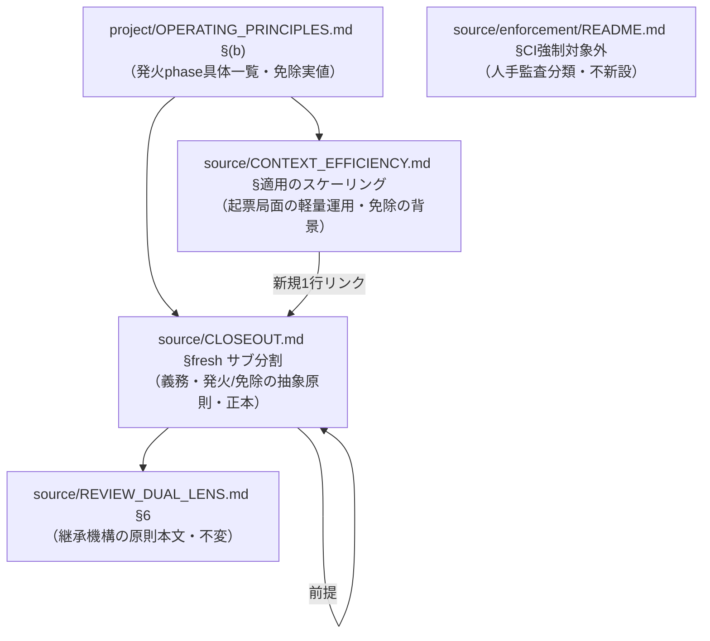
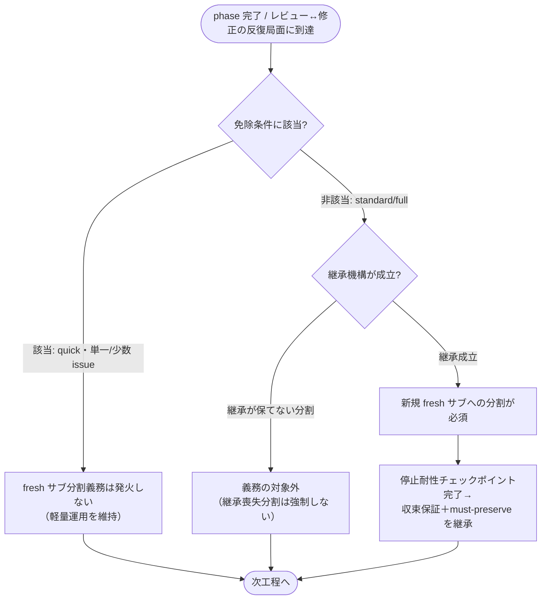

# 設計書: fresh サブ分割の義務化

**プロジェクト名**: fresh サブ分割の義務化
**作成日**: 2026 年 07 月 15 日
**最終更新**: 2026 年 07 月 15 日

> **重要**: **このドキュメントは常に更新**: 設計の変更や追加があった場合は、即座にこのドキュメントを更新してください。ドキュメントは「生きているドキュメント」として扱い、実装内容と常に同期させます。
>
> **用語**: [.agent-skill-chain/source/CONCEPTS.md §用語規約](../../../.agent-skill-chain/source/CONCEPTS.md#用語規約) を参照。

---

## 1. 設計概要

**必須**: 設計方針・原則は [.agent-skill-chain/source/spec/01\_設計原則.md](../../../.agent-skill-chain/source/spec/01_設計原則.md) を先に参照した上で、本プロジェクトに適用するものを選び記載する。

### 1.1 設計方針

本 issue の成果物は**規約ドキュメント（実行契約）の改訂**であり、実行時コード・データ・UI・API を新設しない。したがって本設計は「**どの正本ファイルを・どの規範表現へ・どの配置境界で改訂するか**」の契約（§5「改訂対象ファイルと改訂内容の契約」）と、その改訂を検証するドキュメント構造チェックのテスト観点（§6）を主眼とする。中核方針は、**fresh サブ分割の義務規定の正本を CLOSEOUT §fresh サブ分割 の 1 か所に確立し、具体値（発火 phase の一覧・免除の実値）を `.agent-skill-chain/project/` へ委譲する**ことで、1 ファイル 1 責務・重複禁止・コア抽象／project 具体の配置境界を維持することにある。

### 1.2 設計原則（本プロジェクトで適用するもの）

- **単一責務**: 義務規定の本文正本は CLOSEOUT §fresh サブ分割 の 1 モジュールに集約する。継承機構の原則本文（REVIEW_DUAL_LENS §6）・免除の背景（CONTEXT_EFFICIENCY §適用のスケーリング）・具体値（project）は各正本へ委譲し、複製しない（[01\_設計原則 §単一責務](../../../.agent-skill-chain/source/spec/01_設計原則.md#単一責務)）。
- **明確な境界**: 「抽象原則＝コア `.agent-skill-chain/source/`」「具体値＝`.agent-skill-chain/project/`」という既存の配置境界を、本改訂でも厳守する（[01\_設計原則 §明確な境界](../../../.agent-skill-chain/source/spec/01_設計原則.md#明確な境界)）。
- **AI フレンドリー設計**: 参照は 1 行リンクに留め、正本を 1 か所で辿れる浅い参照構造を保つ。新規ファイルの乱立を避ける（[01\_設計原則 §AIフレンドリー設計](../../../.agent-skill-chain/source/spec/01_設計原則.md#aiフレンドリー設計)）。
- **UNIX 哲学**: 既存の骨格（CLOSEOUT の欠落工程・停止耐性チェックポイント・継承機構）へ**直交追加**し、既存節を作り替えない。1 つのこと（規範強度の裁量→義務への格上げ）をうまくやる（[01\_設計原則 §UNIX哲学](../../../.agent-skill-chain/source/spec/01_設計原則.md#unix哲学)）。

---

## 2. アーキテクチャ設計

### 2.1 責務・境界・参照関係

#### 2.1.1 責務一覧

| コンポーネント（正本ファイル） | 本改訂での責務（1 文） |
| --- | --- |
| `.agent-skill-chain/source/CLOSEOUT.md §fresh サブ分割` | fresh サブ分割の**義務規定の抽象原則正本**（義務・発火工程の抽象条件・免除の抽象条件・継承前提）を 1 か所に持つ。 |
| `.agent-skill-chain/project/OPERATING_PRINCIPLES.md §(b)` | 上記抽象原則の**本リポ具体化**（発火する phase の具体一覧・免除の実値）を持ち、かつ「具体機構は起票局面特化」という旧記述を義務一般化に整合させる。 |
| `.agent-skill-chain/source/CONTEXT_EFFICIENCY.md §適用のスケーリング` | issue 起票局面の軽量運用（免除の背景）の正本。CLOSEOUT の一般義務との**整合参照**を持つ（本文は複製しない）。 |
| `.agent-skill-chain/source/REVIEW_DUAL_LENS.md §6` | 継承機構（収束保証＋must-preserve 退行防止）の原則本文の正本。CLOSEOUT からリンク委譲される（本改訂で**内容変更しない・参照先として維持**）。 |
| `.agent-skill-chain/source/enforcement/README.md §CI 強制対象外（人手監査）` | fresh サブの機械強制が不在で人手監査分類である事実の正本。義務化に整合する**最小の文言整合**のみ行い、新規 CI チェックは追加しない。 |

#### 2.1.2 境界

- **入力**: 01_要件定義.md のユーザーストーリー 1〜6・BDD ユースケース 1〜4・ビジネスルール BR-1〜BR-5。
- **出力**: 上記 5 正本ファイルへの改訂内容の契約（§5）と、その充足を判定するドキュメント構造チェックのテスト観点（§6）。**本 issue のフェーズは設計・実装計画までであり、正本ファイルの実改訂は実装フェーズ（implement-feature）の担当**（本 02/03 では改訂しない）。
- **他責務との境界（本 issue のスコープ外）**:
  - **具体的な enforcement 実装**（audit.sh の新規チェック番号新設・CI 配線・hook スクリプト）は扱わない（01 §5・BR-5）。本 issue は「機械強制が現状不在である」という課題認識の提示に留め、人手監査分類を維持する（ADR-3）。
  - **メイン（オーケストレータ）の feature 単位 /clear 粒度そのものの再設計**・メイン文脈の中間圧縮機構の新設は扱わない（01 ストーリー 5・§5 除外要件）。本 issue はスコープ線引きの**明文化**のみを行う。
  - **AGENT_CONDUCT.md 本文**は改訂しない（ADR-1: 義務規定の正本は CLOSEOUT に一元化し、advisory 文書へ二重定義しない）。

#### 2.1.3 参照関係

改訂後の参照の向き（呼び出し元 → 参照先）。循環参照を持たない。

- `OPERATING_PRINCIPLES.md §(b)`（project 具体）→ `CLOSEOUT.md §fresh サブ分割`（抽象原則正本）
- `OPERATING_PRINCIPLES.md §(b)` → `CONTEXT_EFFICIENCY.md §適用のスケーリング`（起票局面の機構の適用範囲）／`RULES.md §実行モード`（quick の免除実値の背景）
- `CLOSEOUT.md §fresh サブ分割` → `REVIEW_DUAL_LENS.md §6`（継承機構の原則本文へ委譲）／同ファイル `§停止耐性チェックポイント`（継承の前提条件）
- `CONTEXT_EFFICIENCY.md §適用のスケーリング` → `CLOSEOUT.md §fresh サブ分割`（一般義務の正本への整合参照。新規追加する 1 行リンク）
- `enforcement/README.md §CI 強制対象外` は参照先を増やさず、既存の分類記述の対象範囲に「fresh サブ分割義務」を含める文言整合のみ。

### 2.2 システムアーキテクチャ

- **採用パターン**: **正本一元化 + 配置境界委譲（コア抽象／project 具体）**。既存の CONTEXT_EFFICIENCY・CLOSEOUT・OPERATING_PRINCIPLES が採る「抽象原則はコア、具体値は project、原則本文は 1 か所・他はリンク委譲」というパターンを踏襲する。
- **根拠**: [spec/06\_設計判断の優先順位](../../../.agent-skill-chain/source/spec/06_設計判断の優先順位.md) の「仕様との整合性」「単一責務」「保守性」を優先し、既存の配置境界パターンと一貫させることで churn を最小化する（新パターンを発明しない）。

#### 2.2.1 CQRS（Command/Query 分離）

- 該当なし（実行時の状態変更・状態取得を伴わない規約ドキュメント改訂のため）。

#### 2.2.2 アーキテクチャ図

§2.1.3 のフロー図に集約（層構成を新設しないため本節は §2.1.3 を正とする）。

### 2.3 コンポーネント構成

§2.1.1 の 5 正本ファイルが各々単一責務を持つ。境界は「source（抽象・全消費者共通）／project（本リポ具体）」で明確に分離する。新規コンポーネント（新規ファイル）は原則追加しない（ADR-2 で project 具体を既存 OPERATING_PRINCIPLES §(b) へ集約）。

### 2.4 データフロー

- 該当なし（永続データ・イベント発行を伴わない）。規範の「読み取り経路」は §2.1.3 の参照関係で表現する。

### 2.5 横断設計判断（ADR）

本改訂の重要判断（配置境界・正本配置・スコープ・移行）を [EVIDENCE_POLICY.md](../../../.agent-skill-chain/source/EVIDENCE_POLICY.md) の ADR 形式で記録する。

#### ADR-1: 義務規定の正本配置（CLOSEOUT 一元化・AGENT_CONDUCT 不改訂）

- **コンテキスト**: 00 §2.2 は「規約中核（AGENT_CONDUCT / CLOSEOUT）における義務規定へ改訂」と述べる。義務規定の本文正本をどこに置くかを確定する必要がある。
- **検討した選択肢**: (A) CLOSEOUT §fresh サブ分割 のみを正本とし AGENT_CONDUCT は不改訂。(B) AGENT_CONDUCT と CLOSEOUT の両方に義務規定を記述。
- **決定**: (A) CLOSEOUT §fresh サブ分割 を単一正本とし、AGENT_CONDUCT.md 本文は改訂しない。
- **根拠**: AGENT_CONDUCT は自らを「**本ファイルが定める原則は advisory（勧告）であり、機構による直接強制は行わない**」「矛盾する場合は常に実行契約側（CLOSEOUT 等）が優先」と定義しており（evidence_source: existing_code — AGENT_CONDUCT.md 冒頭責務・§0 読み替え規則・機構的強制の非対象）、義務規定を advisory 文書へ置くと規範強度が実行契約より弱く読める矛盾を生む。BR-1 も「義務規定の正本は 1 か所（CLOSEOUT を中核）」と要求する（evidence_source: existing_code — 01 §2.3 BR-1）。二重記述は重複禁止（成功基準 7）に反する。
- **帰結**: 義務の本文は CLOSEOUT のみ。AGENT_CONDUCT の §0 読み替え規則により、advisory 側は実行契約（CLOSEOUT の義務）に自動的に従う。AGENT_CONDUCT への追記・改訂は行わない（スコープ削減）。

#### ADR-2: 発火条件・免除条件の抽象／具体の配置境界

- **コンテキスト**: 01 ストーリー 2・3・6 は「発火条件の抽象原則はコアに、発火 phase の具体一覧・免除の実値は project に」と要求する。project 側の置き場所を確定する必要がある。
- **検討した選択肢**: (A) 具体値を既存の `project/OPERATING_PRINCIPLES.md §(b)` に集約。(B) 新規ファイル `project/fresh-sub-split.md` を新設。
- **決定**: (A) 既存 `OPERATING_PRINCIPLES.md §(b)`（リソース＝トークン・コンテキスト意識）に集約する。
- **根拠**: §(b) は既に「具体機構（… fresh サブの構造化ハンドオフ）は … issue 起票局面に特化」と fresh サブの適用範囲そのものを扱っており（evidence_source: existing_code — OPERATING_PRINCIPLES.md §(b)）、発火 phase 一覧・免除実値は同一責務（リソース意識に基づく fresh サブの適用範囲）に属する。既存の source/project 境界パターン（CONTEXT_EFFICIENCY が具体値を project へ委譲）と一貫する（evidence_source: existing_code — CONTEXT_EFFICIENCY.md 各節末尾の委譲記述）。新規ファイル案 (B) は内容が小規模（phase 一覧＋免除の 1 対応表）で、AI フレンドリー設計（浅い構造・ファイル乱立回避）に反するため退ける。
- **帰結**: 抽象原則（義務・発火の抽象条件・免除の抽象条件）は CLOSEOUT に、具体値（本リポの発火 phase 一覧・quick／単一少数 issue への免除実値）は OPERATING_PRINCIPLES §(b) に置く。同時に §(b) の「起票局面特化」旧記述を義務一般化へ整合させる（ストーリー 6 の受け入れ基準を同時充足）。

#### ADR-3: 機械強制は新設せず人手監査分類を維持する

- **コンテキスト**: 00 §1.2 は「機械強制の不在」を課題として挙げるが、00 §5・BR-5 は具体的な enforcement 実装を本 issue のスコープ外とする。
- **検討した選択肢**: (A) 本 issue で機械強制（audit.sh 新規チェック）を実装しない。(B) 本 issue で新規 CI チェックを追加する。
- **決定**: (A)。enforcement/README §CI 強制対象外 の分類（人手監査）を維持し、文言整合のみ行う。新規チェック番号は新設しない。
- **根拠**: enforcement/README は「fresh サブの収束保証は実行コンテキスト依存のため CI で機械強制せず、PHASES 監査観点（人手レビュー）で担保する」と既に分類している（evidence_source: existing_code — enforcement/README.md §CI 強制対象外（人手監査））。00 §5・BR-5 が enforcement 実装をスコープ外と明示する（evidence_source: existing_code — 00 §5 / 01 §2.3 BR-5）。義務化と機械強制新設は独立に分離でき、後者を将来の別 issue に委ねることで本 issue の完了条件を判定可能に保てる。
- **帰結**: fresh サブ分割義務の遵守検証は review-docs／verify-and-close の人手監査（ドキュメント構造チェック）で担保する。機械強制の要否・実装は別 issue へ申し送る。

#### ADR-4: 移行方式（即時一括改訂・grandfather 不要）

- **コンテキスト**: 00 §4.3・01 §5 は grandfather（発効日）による段階適用の要否を設計フェーズで判断すると保留していた。
- **検討した選択肢**: (A) 即時一括改訂（grandfather なし）。(B) 発効日を設けて既存 issue に非遡及とする。
- **決定**: (A) 即時一括改訂。grandfather を設けない。
- **根拠**: grandfather 発効日は**新規の機械ゲート**（例: enforcement #34/#35 は `*_EFFECTIVE_FROM` を持つ）が既存 issue を遡及 FAIL させるのを防ぐために必要となる仕組みである（evidence_source: existing_code — enforcement 各ゲートの発効日設計・自己拡張ワークフロー.md §1 発効日）。本 issue は ADR-3 のとおり新規機械ゲートを追加しないため、遡及 FAIL の対象が発生せず grandfather は不要。規約文言の改訂は次回以降の実行に適用されれば足りる。
- **帰結**: 発効日 env・grandfather 記述を追加しない。改訂は次の command 実行から自然に適用される。

---

## 3. 機能設計

本 issue の「機能」は規約改訂の適用単位である。ユーザーストーリー 1〜6 に対応させる。

### 3.1 機能 1: fresh サブ分割の義務規定化（ストーリー 1・2）

#### 3.1.1 概要

CLOSEOUT §fresh サブ分割 の裁量表現「工程は**必要に応じて** fresh なサブへ分割する」を、義務規定（分割を必須とする規範表現）へ改訂し、義務が発火する工程を判定可能に明文化する。

#### 3.1.2 処理フロー

#### 3.1.3 入力・出力

- **入力**: 現行 CLOSEOUT §fresh サブ分割 の本文、実行モード（RULES §実行モード）、対象規模（単一/少数 or 大規模）。
- **出力**: 改訂後 CLOSEOUT §fresh サブ分割（義務規定＋発火工程の抽象条件＋免除の抽象条件）、および OPERATING_PRINCIPLES §(b) の発火 phase 具体一覧。

#### 3.1.4 エラーハンドリング（配置・重複の逸脱防止）

- 具体値（発火 phase の実一覧・免除の実値）が CLOSEOUT（source）本文に混入した場合は配置境界違反として review-docs で差し戻す（§6 のテスト観点で検出）。
- 継承機構・免除背景の本文を CLOSEOUT に複製した場合は重複禁止違反として差し戻す（リンク委譲へ是正）。

### 3.2 機能 2: 過剰適用回避（免除条件）と継承機構の前提維持（ストーリー 3・4）

#### 3.2.1 概要

quick モード・単一/少数 issue の軽量運用には義務を発火させない免除条件を明記し、CONTEXT_EFFICIENCY §適用のスケーリングと矛盾させない。あわせて、fresh 分割の前提として継承機構（収束保証＋must-preserve 退行防止）と停止耐性チェックポイントを維持し、継承が失われる分割は義務対象外とする。

#### 3.2.2 入力・出力

- **入力**: CONTEXT_EFFICIENCY §適用のスケーリング（軽量運用）、RULES §実行モード（quick）、REVIEW_DUAL_LENS §6（継承）、CLOSEOUT §停止耐性チェックポイント。
- **出力**: CLOSEOUT §fresh サブ分割 への免除の抽象条件・継承前提の明記（本文は複製せずリンク委譲）、OPERATING_PRINCIPLES §(b) への免除実値。

### 3.3 機能 3: メイン文脈蓄積問題のスコープ線引きと配置境界維持（ストーリー 5・6）

#### 3.3.1 概要

メイン（オーケストレータ）が feature 単位でしか /clear されないことに起因する文脈蓄積問題について、本 issue で扱う範囲（明文での線引きのみ）と扱わない範囲（/clear 粒度の再設計は除外要件）を明記する。あわせて配置境界・1 ファイル 1 責務を全改訂対象で維持し、OPERATING_PRINCIPLES §(b) の「起票局面特化」記述を義務一般化へ整合させる。

#### 3.3.2 入力・出力

- **入力**: CLOSEOUT §clear 境界、00 §5 除外要件、OPERATING_PRINCIPLES §(b) 現行本文。
- **出力**: CLOSEOUT §fresh サブ分割（またはその近傍）へのスコープ線引き 1 節、OPERATING_PRINCIPLES §(b) の整合改訂。

---

## 4. データ設計

- 該当なし（DB・データモデルを持たない規約ドキュメント改訂）。

---

## 5. API 設計 ＝ 改訂対象ファイルと改訂内容の契約

本 issue に実行時 API は存在しない。ここでは API 契約に相当するものとして、**改訂対象ファイル（インターフェース）ごとの改訂内容・配置区分・対応ストーリー・1 責務／重複禁止の維持方法**を契約として定義する。実改訂は実装フェーズ（03 のタスク）で行う。

### 5.1 改訂対象ファイル一覧

| 対象（正本ファイル） | 改訂内容 | 配置区分 | 対応ストーリー | 1 責務・重複禁止の維持 |
| --- | --- | --- | --- | --- |
| `source/CLOSEOUT.md §fresh サブ分割` | 裁量表現→義務規定へ改訂。発火工程の抽象条件・免除の抽象条件・継承前提・スコープ線引きを明記。 | コア抽象 | 1・2・3・4・5 | 義務本文の唯一の正本。継承本文・免除背景・具体値はリンク委譲し複製しない。 |
| `project/OPERATING_PRINCIPLES.md §(b)` | 発火 phase の具体一覧・免除の実値を追加。「起票局面特化」旧記述を義務一般化へ整合。 | project 具体 | 2・3・6 | 具体値の唯一の置き場所。抽象原則は CLOSEOUT を参照（複製しない）。 |
| `source/CONTEXT_EFFICIENCY.md §適用のスケーリング` | CLOSEOUT の一般義務への整合参照（1 行リンク）を追加。軽量運用の記述は不変。 | コア抽象 | 3 | 起票局面の軽量運用の正本を維持。一般義務本文を持ち込まない。 |
| `source/REVIEW_DUAL_LENS.md §6` | 変更しない（継承機構の原則本文の参照先として維持）。 | コア抽象 | 4 | 継承本文の唯一の正本。CLOSEOUT からのリンク先。 |
| `source/enforcement/README.md §CI 強制対象外（人手監査）` | 人手監査分類の対象に「fresh サブ分割義務」を含める最小文言整合。新規チェックは追加しない。 | コア抽象 | （課題認識の整合） | 分類記述の正本を維持。機械強制の実装は行わない（ADR-3）。 |

### 5.2 改訂の受理条件（契約の DONE）

- CLOSEOUT §fresh サブ分割 から裁量表現「必要に応じて」が除去され、義務規定の規範表現（例: 「必須とする／分割しなければならない」）に置換されている。
- 発火工程（phase 遷移・レビュー↔修正の反復ループ）の抽象条件が判定可能な形で記述され、発火 phase の具体一覧は project 側にある。
- 免除条件（quick・単一/少数 issue）が抽象条件として CLOSEOUT に、実値が project にあり、CONTEXT_EFFICIENCY §適用のスケーリングと矛盾しない。
- 継承機構・停止耐性チェックポイントが前提として明記され、継承本文は REVIEW_DUAL_LENS §6 へリンク委譲されている（複製なし）。
- メイン文脈蓄積問題のスコープ内/外が明記され、/clear 粒度再設計が除外要件として示されている。
- コア（source）に具体値が混入していない。各対象が 1 ファイル 1 責務・重複禁止を維持している。

---

## 6. テスト戦略

テスト観点の定義は [RULES.md のテスト戦略必須要件](../../../.agent-skill-chain/source/RULES.md#テスト戦略必須要件)、BDD 形式は [TEST_BDD_FORMAT.md](../../../.agent-skill-chain/source/TEST_BDD_FORMAT.md) を参照。本 issue の成果物は規約ドキュメントであり、テストは**ドキュメント構造チェック（grep／目視構造監査）**として review-docs・verify-and-close の人手監査で実施する（機械強制の新規実装は ADR-3 によりスコープ外）。各観点は 01 の BDD ユースケース／シナリオに 1:1 対応する。

### 6.1 対象ごとのテスト割り当て

| 対象 | 単体（構造チェック） | 結合/API | E2E | クリティカル観点 | バリデーション観点 | 未達理由/補足 |
| --- | --- | --- | --- | --- | --- | --- |
| CLOSEOUT §fresh サブ分割（義務化・UC1-S1） | ○ | × | × | 「必要に応じて」不在かつ義務表現の存在を grep で確認 | 規範表現が義務であること | 結合/E2E は実行時経路が無いため該当なし |
| 発火工程の明文化（UC1-S2） | ○ | × | × | 発火工程の抽象条件が CLOSEOUT に、具体 phase 一覧が project にある | 抽象/具体の分離 | 同上 |
| 免除条件（UC2-S1/S2） | ○ | × | × | 免除条件が明記され CONTEXT_EFFICIENCY §適用のスケーリングと矛盾しない／非免除で発火する | quick・単一/少数の免除実値 | 同上 |
| 継承機構の維持（UC3-S1/S2） | ○ | × | × | REVIEW_DUAL_LENS §6 へのリンク委譲・複製なし／継承喪失分割は対象外・停止耐性チェックポイント前提 | 継承リンク切れが無い | 同上 |
| スコープ線引きと配置境界（UC4-S1/S2） | ○ | × | × | スコープ内/外・/clear 粒度除外の明記／source に具体値混入なし・1 責務維持・OPERATING_PRINCIPLES §(b) 整合 | 具体値のコア非混入 | 同上 |

### 6.2 監査・レビューでの確認（証跡）

- 本設計 §5.2（受理条件）と §6.1 の割当が、03_実装計画のタスク別テスト観点・BDD と 1:1 対応していることを review-docs／verify-and-close で確認する。
- リンク委譲の妥当性（REVIEW_DUAL_LENS §6・CONTEXT_EFFICIENCY §適用のスケーリング・CLOSEOUT §停止耐性チェックポイントへの相対リンクが解決すること）を移動前に確認する。

---

## 7. UI 設計

- 該当なし（UI を持たない）。

---

## 8. セキュリティ設計

- 該当なし。外部サービスへの書き込み・機密情報の取り扱い・高リスク操作を伴わない規約ドキュメント改訂である（01 §3.2）。

---

## 9. 非機能要件への対応

### 9.1 パフォーマンス（過剰適用回避）

義務化はトークン・コンテキスト削減が目的であり、免除条件（§3.2）により軽量作業へ全機構が新規に強制されないことで、規約適用自体の実行時オーバーヘッド増を回避する（01 §3.1）。

### 9.2 可用性（汎用/固有境界）

抽象原則（CLOSEOUT）は project 具体化が存在しない消費者環境でも成立する。具体値は project へ委譲し、project が無い環境ではコアの抽象原則のみで判定可能に保つ（01 §3.4）。

---

## 10. 参考資料

### プロジェクトドキュメント

- [`01_要件定義.md`](./01_要件定義.md) - 要件定義
- [`00_要求定義.md`](./00_要求定義.md) - 要求定義

### その他の参考資料

- [.agent-skill-chain/source/CLOSEOUT.md](../../../.agent-skill-chain/source/CLOSEOUT.md) - §fresh サブ分割（改訂の中核）・§停止耐性チェックポイント・§clear 境界
- [.agent-skill-chain/source/CONTEXT_EFFICIENCY.md](../../../.agent-skill-chain/source/CONTEXT_EFFICIENCY.md) - §適用のスケーリング（免除の背景）
- [.agent-skill-chain/project/OPERATING_PRINCIPLES.md](../../../.agent-skill-chain/project/OPERATING_PRINCIPLES.md) - §(b) リソース意識（具体値の置き場所）
- [.agent-skill-chain/source/REVIEW_DUAL_LENS.md](../../../.agent-skill-chain/source/REVIEW_DUAL_LENS.md) - §6 反復ループへの must-preserve 継承
- [.agent-skill-chain/source/enforcement/README.md](../../../.agent-skill-chain/source/enforcement/README.md) - §CI 強制対象外（人手監査）
- [.agent-skill-chain/source/EVIDENCE_POLICY.md](../../../.agent-skill-chain/source/EVIDENCE_POLICY.md) - ADR 記録形式・evidence_source
- [.agent-skill-chain/source/spec/06\_設計判断の優先順位.md](../../../.agent-skill-chain/source/spec/06_設計判断の優先順位.md) - 設計判断の優先順位

---

## 11. 前のステップ

この設計書は、以下のドキュメントを基に作成されています：

- **前**: [`01_要件定義.md`](./01_要件定義.md) - 要件定義フェーズ

---

## 12. 次のステップ

この設計書の承認後、以下のドキュメントを作成します：

- **次**: [`03_実装計画.md`](./03_実装計画.md) - 実装計画フェーズ
