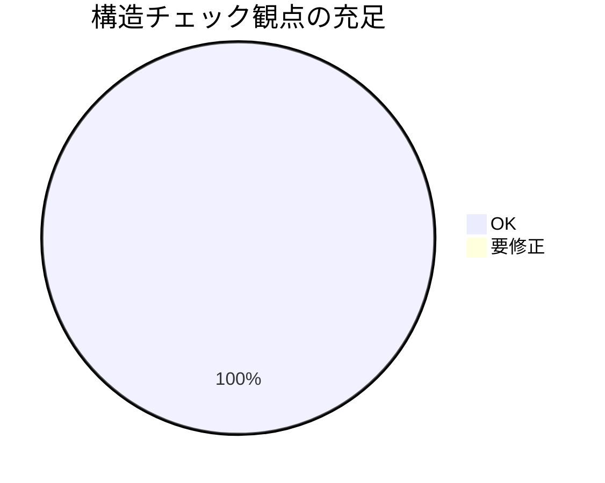

# レビュー書: fresh サブ分割の義務化

**プロジェクト名**: fresh サブ分割の義務化
**作成日**: 2026 年 07 月 15 日
**最終更新**: 2026 年 07 月 15 日

> **重要**: 本レビューは verify-and-close（レビューフェーズ）の成果物である。実装（commit `a1a6783`）で改訂された 4 ファイルの差分を独立に検証した結果を記載する。前工程（implement-feature・review-docs）の報告を鵜呑みにせず、改訂後の実ファイルを読んで自分で判定した。
>
> **用語**: [.agent-skill-chain/source/CONCEPTS.md §用語規約](../../../.agent-skill-chain/source/CONCEPTS.md#用語規約) を参照。

---

## 1. レビュー概要

### 1.1 レビュー目的（必須）

規約ドキュメント改訂（fresh サブ分割を裁量から義務へ格上げ）の正しさ・受け入れ基準充足・配置境界の設計妥当性を確認し、実装内容を品質保証する。

### 1.2 レビュー対象（必須）

- **実装範囲**: commit `a1a6783`（「feat: fresh サブ分割を裁量から義務へ格上げ（CLOSEOUT等4ファイル改訂）」）で改訂された 4 ファイル。
  - `.agent-skill-chain/source/CLOSEOUT.md` §fresh サブ分割（義務化・発火/免除の抽象条件・継承前提・対象範囲の境界）
  - `.agent-skill-chain/project/OPERATING_PRINCIPLES.md` §(b)（発火 phase 具体一覧・免除実値・起票局面特化記述の整合）
  - `.agent-skill-chain/source/CONTEXT_EFFICIENCY.md` §適用のスケーリング（一般義務への整合参照 1 行）
  - `.agent-skill-chain/source/enforcement/README.md` §CI 強制対象外（fresh サブ分割義務を人手監査分類へ整合）
- **レビュー期間**: 2026-07-15 ～ 2026-07-15
- **レビュー担当者**: verify-and-close サブエージェント（レビュー・監査ロール）

---

## 2. 実装内容の確認

### 2.1 実装完了タスク（または Issue）

| タスク名 | 実装内容 | 実装日 | 担当者 | ステータス（必須: 完了 または 要修正） |
| ------------ | ----------------- | -------- | ---------- | ------ |
| タスク1 CLOSEOUT 義務規定化 | 裁量表現を義務規定へ改訂し発火/免除/継承前提/対象範囲を抽象条件として追記 | 2026-07-15 | implement-feature | 完了 |
| タスク2 OPERATING_PRINCIPLES 具体化 | 発火 phase 具体一覧・免除実値を追加、起票局面特化記述を義務一般化へ整合 | 2026-07-15 | implement-feature | 完了 |
| タスク3 CONTEXT_EFFICIENCY 整合参照 | 一般義務への整合参照 1 行を追加（軽量運用本文は不変） | 2026-07-15 | implement-feature | 完了 |
| タスク4 enforcement/README 分類整合 | fresh サブ分割義務を人手監査分類へ整合（新規 CI チェックなし・別 issue 申し送り） | 2026-07-15 | implement-feature | 完了 |

### 2.2 実装内容の詳細

#### タスク 1: CLOSEOUT §fresh サブ分割 の義務規定化

- **実装内容**: 「必要に応じて fresh なサブへ分割する」を「工程は原則として fresh なサブへ分割することを**必須**とする。ただし §免除条件（抽象条件）に該当する軽量運用を除く」へ改訂。発火工程（抽象条件）・免除条件（抽象条件）・継承前提（義務化後も維持）・義務の対象範囲（境界）の 4 サブ節を追記。
- **変更ファイル**: `.agent-skill-chain/source/CLOSEOUT.md`（+22 行）
- **実装方法**: 抽象原則のみを本文に置き、具体一覧・実値・背景は project／CONTEXT_EFFICIENCY／REVIEW_DUAL_LENS へ 1 行リンク委譲。
- **確認事項**: 裁量語の残存不在・義務語の存在・VCS 機構名不混入・具体値不混入（下記 §4 で独立検証）。

#### タスク 2: OPERATING_PRINCIPLES §(b) の具体化と整合

- **実装内容**: 「発火する phase の具体一覧（本リポ）」「免除の実値（本リポ）」の 2 サブ節を追加。旧記述「具体機構（… fresh サブの構造化ハンドオフ）は引き続き issue 起票局面に特化」を、「fresh サブ**分割**義務は全工程へ一般化された。起票局面固有機構（索引化・スライス渡し・構造化ハンドオフ）はなお起票局面特化」旨へ整合改訂。
- **変更ファイル**: `.agent-skill-chain/project/OPERATING_PRINCIPLES.md`（+20/-1 行）
- **実装方法**: 具体値のみを project 側に置き、抽象原則は CLOSEOUT を参照。
- **確認事項**: 抽象原則本文の複製不在・具体値が project にのみ存在。

#### タスク 3: CONTEXT_EFFICIENCY §適用のスケーリング の整合参照追加

- **実装内容**: 「一般義務との関係」の 1 行 blockquote を追加（CLOSEOUT §fresh サブ分割 への参照。本節＝起票局面の軽量運用は免除の背景で矛盾しない旨）。既存の軽量運用本文は不変。
- **変更ファイル**: `.agent-skill-chain/source/CONTEXT_EFFICIENCY.md`（+2 行）
- **確認事項**: 追加が 1 行の整合参照に留まり本節の責務を越えていない。

#### タスク 4: enforcement/README §CI 強制対象外 の分類整合

- **実装内容**: 「fresh サブの収束保証は CI で機械強制せず PHASES 監査観点で担保」を、「fresh サブ**分割義務**およびその収束保証・退行防止継承は現状 CI で機械強制せず PHASES 監査観点（人手レビュー）で担保する（機械強制の要否・実装は別 issue へ申し送り）」へ整合。
- **変更ファイル**: `.agent-skill-chain/source/enforcement/README.md`（+1/-1 行）
- **確認事項**: audit.sh・subagent-guard に新規チェックが追加されていない（差分は分類テキストのみ）。

---

## 3. テスト結果の確認

### 3.1 単体テスト

本 issue の成果物は規約ドキュメント（実行契約）であり、実行時 API・DB・UI を持たない。03_実装計画 §単体テスト および 02_設計 の定義どおり、テストは「ドキュメント構造チェック（grep／目視構造監査）」で構成する。自動テストコード資産は本 issue では新規作成しない（機械強制の新設は 02 ADR-3 によりスコープ外）。したがって以下は構造チェックの実行結果である。

#### テスト実行結果（構造チェック・数値）

- **実行日**: 2026-07-15
- **チェック観点数**: 8（下表）
- **成功**: 8
- **失敗**: 0
- **スキップ**: 0

| # | 構造チェック観点 | 実行手段 | 結果 |
| - | ---------------- | -------- | ---- |
| 1 | CLOSEOUT §fresh サブ分割 に「必要に応じて」が残存しない | `grep '必要に応じて' CLOSEOUT.md` → 0 件 | OK |
| 2 | 同節に義務表現（必須）が存在 | `grep '必須'` → line 33/39 | OK |
| 3 | 発火工程の抽象条件が本文にあり具体 phase 一覧が無い | grep `00→01` → source に 0 件 / project に存在 | OK |
| 4 | 免除の抽象条件があり実値（`mode: quick` for fresh）が source に無い | grep → project にのみ存在 | OK |
| 5 | 継承本文が REVIEW_DUAL_LENS §6/§3 へリンク委譲され複製されない | 目視・リンク解決 | OK |
| 6 | CLOSEOUT 抽象原則本文に `worktree`・特定 VCS 機構名が無い | `grep -i worktree` → 0 件 | OK |
| 7 | 全相対リンク・アンカーが解決する | 見出し突合（§4.1） | OK |
| 8 | enforcement に新規 CI チェックが追加されていない | 差分検査 → 分類テキストのみ | OK |

#### テストカバレッジ

#### 失敗したテスト（該当する場合）

なし（失敗 0 件）。

### 3.2 統合テスト

該当なし（実行時経路・エンドポイントを持たない規約ドキュメント変更のため）。

### 3.3 E2E テスト

該当なし（実行時 E2E 経路が無い。受け入れは review-docs／本 verify-and-close のドキュメント監査で代替）。

---

## 4. コードレビュー

> 本 issue の実体はドキュメント改訂のため、「規約文書としての正しさ」をコードレビュー相当として扱う。改訂 4 ファイルの実差分（`git show a1a6783`）を読み、下記を独立に検証した。

### 4.1 コード品質（規約文書としての正しさ）

#### 構造・リンク

- **相対リンク・アンカー解決**: 改訂で新設/参照した全アンカーを実見出しと突合し、すべて解決を確認した。
  - CLOSEOUT `#免除条件抽象条件` → `### 免除条件（抽象条件）`（全角括弧はアンカーで除去）: 解決。
  - CLOSEOUT `#停止耐性チェックポイント`・`#clear-境界`: 対応見出し存在。
  - CLOSEOUT → `REVIEW_DUAL_LENS.md#6-反復ループへの-must-preserve-継承退行検知`・`#3-証跡要求`: 対応見出し `## 6 反復ループへの must-preserve 継承（退行検知）`・`## 3 証跡要求` 存在。
  - CLOSEOUT → `CONTEXT_EFFICIENCY.md#適用のスケーリング`: 見出し `## 適用のスケーリング` 存在。
  - OPERATING_PRINCIPLES（`.agent-skill-chain/project/`）→ `../source/CLOSEOUT.md#fresh-サブ分割`・`../source/CONTEXT_EFFICIENCY.md#適用のスケーリング`・`../source/RULES.md#実行モードquick--standard--full`: 相対パス実在・見出し `## fresh サブ分割`・`## 適用のスケーリング`・`### 実行モード（quick / standard / full）` 存在（全角括弧除去・スペース→ハイフン・`/`除去で `実行モードquick--standard--full` に一致）。
  - CONTEXT_EFFICIENCY → `CLOSEOUT.md#fresh-サブ分割`: 見出し存在。
  - リンク切れ 0 件。

#### コードレビュー観点

| 観点 | 確認内容（必須: 1 文） | 結果（必須: OK または 要修正） | コメント |
| -------------- | ---------------------- | -------- | -------- |
| 規範強度（義務化） | CLOSEOUT §fresh サブ分割 の裁量表現「必要に応じて」が消え義務表現「必須」が存在するか | OK | 全ファイル grep で「必要に応じて」0 件、line 33/39 に「必須」。 |
| transport 非依存（ADR-5） | CLOSEOUT 抽象原則本文に `worktree` 等特定 VCS 機構名が混入していないか | OK | `worktree` はファイル全体で 0 件。継承前提節は「実行環境に依存しない語」で記述し受け渡し機構を project へ委譲。 |
| 配置境界（具体値のコア非混入） | source（CLOSEOUT/CONTEXT_EFFICIENCY/enforcement）に発火 phase 実一覧・fresh 免除実値が混入していないか | OK | source に `00→01` 系列・fresh 免除の `mode: quick` 表記なし。具体値は project §(b)（line 19/28）にのみ存在。 |
| 重複禁止（本文複製なし） | 継承本文・免除背景本文が複製されず 1 行リンクで委譲されているか | OK | 継承→REVIEW_DUAL_LENS §6/§3、免除背景→CONTEXT_EFFICIENCY §適用のスケーリング へ委譲。複製なし。 |
| スコープ規律 | enforcement に新規 CI チェック（audit.sh/subagent-guard）が追加されていないか | OK | 差分は §CI 強制対象外 の分類テキスト整合のみ。新規チェック番号・hook なし。 |

**注記（誤検出の否定）**: `grep 'mode: quick'` は source の `enforcement/README.md`（#32/#34 ゲートの SKIP 条件）に既存ヒットするが、これは review-docs／GitHub Issue 起票ゲート固有の既存記述であり、本 issue の fresh サブ分割義務の免除実値ではない。fresh サブ分割義務の免除実値は project §(b) にのみ存在し、配置境界違反ではない。

### 4.2 指摘事項

指摘 0 件。独立検証（§4.1・§3.1）の全観点が OK に収束したため、再修正（該当ファイルの再改訂）は不要と判断した。

---

## 5. ドキュメントの確認

### 5.1 ドキュメント更新状況

| ドキュメント | 更新状況 | 確認者 | 確認日 |
| ------------------------------------ | ----------------- | -------- | ------ |
| [`00_要求定義.md`](./00_要求定義.md) | 更新済み | verify-and-close | 2026-07-15 |
| [`01_要件定義.md`](./01_要件定義.md) | 更新済み | verify-and-close | 2026-07-15 |
| [`02_設計.md`](./02_設計.md) | 更新済み | verify-and-close | 2026-07-15 |
| [`03_実装計画.md`](./03_実装計画.md) | 更新済み | verify-and-close | 2026-07-15 |

### 5.2 ドキュメントの整合性

- **実装と設計の整合性**: 整合している（02 §5 の改訂契約・03 各タスクの実装内容と実差分が一致）。
- **要件と実装の整合性**: 整合している（下記 §受け入れ基準の確認を参照）。
- **コメント**: 03 §横断整合検証（タスク5）で報告済みの「成功基準 1〜7 対応表」を、改訂後の実ファイルを読んで独立に再検証した。前工程の結論（全○）と一致した。

### 受け入れ基準の確認（00 §6 成功基準 1〜7・独立再検証）

> map-coverage: 前工程（implement-feature commit message の対応表）を鵜呑みにせず、改訂後の CLOSEOUT.md 等 4 ファイルと project を実読して自分で判定した。

| 基準 | 内容 | 独立検証の根拠 | 判定 |
| ---- | ---- | -------------- | ---- |
| 1 | CLOSEOUT §fresh サブ分割 の裁量表現→義務規定へ改訂 | grep「必要に応じて」0 件／CLOSEOUT line 33「原則として…必須とする」 | ○ |
| 2 | 発火工程が判定可能に明文定義（抽象=core・具体=project） | CLOSEOUT line 37-40（phase 遷移・反復ループの抽象条件＋具体は project 委譲）／project line 15-20（具体一覧） | ○ |
| 3 | 免除条件明記・軽量運用と無矛盾 | CLOSEOUT line 42-45／CONTEXT_EFFICIENCY line 61 整合参照／project line 22-31（quick・単一少数）。CONTEXT_EFFICIENCY 軽量運用本文は不変 | ○ |
| 4 | 継承機構を前提として維持・継承喪失分割は対象外 | CLOSEOUT line 47-51（義務化後も前提維持・継承喪失分割は対象外・停止耐性チェックポイント前提） | ○ |
| 5 | メイン文脈蓄積のスコープ線引き | CLOSEOUT line 53-55（対象＝サブ工程の分割／対象外＝メインの feature 単位 /clear 粒度）。除外判断は 00 §5・01 ストーリー 5 に残置し CLOSEOUT へ複製せず | ○ |
| 6 | 配置境界維持・source へ具体値混入なし | grep で source に発火 phase 実一覧・fresh 免除実値なし。具体値は project にのみ存在 | ○ |
| 7 | 1 ファイル 1 責務・重複禁止・本文複製なし | 継承本文→REVIEW_DUAL_LENS、免除背景→CONTEXT_EFFICIENCY へリンク委譲。複製なし | ○ |

7 基準すべて○。BDD シナリオ UC1-S1〜UC4-S2（計 8 本）は各基準・各タスクの構造チェック（§3.1）へ対応付けられ、テストコード化可能なものは grep 相当の構造チェックで検証済み（実行時 E2E は経路が無いためドキュメント監査で代替）。

---

## docs 更新

- 要否: 不要
- 対象: なし
- 理由: 本 issue の改訂対象は `.agent-skill-chain/source/`・`.agent-skill-chain/project/` の実行契約ドキュメント（配布パッケージの正本）であり、`docs/` 配下のシステム仕様書に記述された機能・画面・データ・API 仕様には影響しない。DOCS_RULES §継続追随ゲートに照らし、システム仕様書の更新を要する変更ではないため不要と判定した（evidence_source: existing_code — 改訂 4 ファイルはいずれも source/project 配下であり docs/ 仕様の対象外）。

---

## 9. 設計・境界の確認

> review-architecture の結果。設計原則 [.agent-skill-chain/source/spec/01_設計原則.md](../../../.agent-skill-chain/source/spec/01_設計原則.md) に照らして確認した。

### 9.1 設計の確認

- **設計原則の準拠**: 準拠。単一責務（spec/01 §単一責務）— CLOSEOUT は「クローズアウト欠落工程の抽象形正本」、OPERATING_PRINCIPLES は「本リポ固有の具体値」、CONTEXT_EFFICIENCY は「起票局面のコンテキスト効率」という各ファイルの責務を保ったまま改訂されている。UNIX 哲学（1 つのことをうまくやる・組み合わせ可能）に沿い、抽象原則と具体値をリンクで組み合わせる構成。
- **ディレクトリ構成**: 抽象原則＝コア `.agent-skill-chain/source/`、具体値＝`.agent-skill-chain/project/` の配置境界（既存パターン）を維持。
- **命名規則**: 既存の見出し・frontmatter（document_id 維持）・1 行リンク記法を踏襲。04_review の document_id は新規発行（`3910499a-...`）。

### 9.2 境界・依存の確認

- **責務の境界**: 明確。義務の抽象原則（発火/免除/継承前提/対象範囲）は CLOSEOUT の 1 か所に集約、発火 phase 具体一覧・免除実値は project、起票局面固有機構（索引化・スライス渡し・構造化ハンドオフ）は CONTEXT_EFFICIENCY に分離。fresh サブ**分割**義務（一般化）と起票局面固有機構（非一般化）を OPERATING_PRINCIPLES §(b) が明示的に区別しており、両者の混同を防ぐ設計になっている。
- **依存関係**: 循環なし。project → source（CLOSEOUT/CONTEXT_EFFICIENCY/RULES）への一方向参照。source 側は具体値を持たず project へ委譲する下向き委譲で、逆流依存なし。
- **指摘・推奨**: なし。

### 9.3 重要判断の根拠（evidence_source）

| 判断内容 | evidence_source | 備考（参照元・URL 等） |
| -------------------- | --------------- | ---------------------- |
| 裁量表現の除去・義務表現の存在 | existing_code | `git show a1a6783` 差分＋改訂後 CLOSEOUT.md line 33/39 の実読、`grep '必要に応じて'` 0 件 |
| 具体値のコア非混入（配置境界） | existing_code | source 3 ファイル・project OPERATING_PRINCIPLES の grep 突合（発火 phase 実一覧・fresh 免除実値の所在確認） |
| 相対リンク・アンカー全解決 | existing_code | 各対象ファイルの見出し grep と参照アンカーの機械的突合（リンク切れ 0） |
| enforcement 新規チェック不在（スコープ規律） | existing_code | `git show a1a6783 --stat`＝4 ファイルのみ、audit.sh/subagent-guard に差分なし |
| docs 更新不要 | existing_code | 改訂 4 ファイルが source/project 配下でありシステム仕様書の対象外 |

---

## 10. 課題と改善点

### 10.1 発見された課題

- なし（独立検証で指摘 0 件に収束）。

### 10.2 改善提案

- **申し送り（本 issue スコープ外）**: fresh サブ分割義務の機械強制（CI/audit チェックの新設要否）は 00 §5 除外要件・enforcement/README の「別 issue へ申し送り」の記載どおり、後続 issue で扱う。本 issue の完了判定には影響しない（メインへ提案として報告するに留め、サブは自ら起票しない）。

---

## 11. システム仕様書の更新

### 11.1 システム仕様書の確認結果

- 本 issue は実行契約ドキュメント（`.agent-skill-chain/`）の改訂であり、`docs/` 配下のシステム仕様書（機能・画面・データ・API）に対応する変更を伴わない。§docs 更新のとおり継続追随ゲートは更新不要判定（根拠付き）で軽量パス。

### 11.2 システム仕様書の更新状況

- 更新が不要な項目: システム概要・画面設計・データ設計・機能設計（いずれも本改訂の影響外）。

---

## 12. レビュー結果

### 12.1 総合評価

- **実装品質**: 良好（改訂契約 02 §5・03 各タスクと実差分が一致、規範強度の格上げが正確）。
- **テスト品質**: 良好（構造チェック 8 観点すべて OK、実行時経路が無いためドキュメント監査で網羅）。
- **ドキュメント品質**: 良好（配置境界・1 ファイル 1 責務・重複禁止・リンク解決すべて充足）。
- **総合評価**: PASS。

### 12.2 承認状況

- **レビュー承認者**: verify-and-close サブエージェント（レビュー・監査ロール）
- **承認日**: 2026-07-15
- **承認コメント**: 独立検証で 00 §6 成功基準 1〜7 の全○を再確認し、review-code 相当の 5 観点・review-architecture の設計/境界も逸脱なし。指摘 0 件に収束したため PASS とする。close 移動・PR 作成は本 command のスコープ外（進行役が別途実施）。

---

## 13. 参考資料

### 13.1 プロジェクトドキュメント

- [`00_要求定義.md`](./00_要求定義.md) - 要求定義
- [`01_要件定義.md`](./01_要件定義.md) - 要件定義
- [`02_設計.md`](./02_設計.md) - 設計
- [`03_実装計画.md`](./03_実装計画.md) - 実装計画

### 13.2 その他の参考資料

- [.agent-skill-chain/source/CLOSEOUT.md](../../../.agent-skill-chain/source/CLOSEOUT.md) - §fresh サブ分割（改訂対象・正本）
- [.agent-skill-chain/project/OPERATING_PRINCIPLES.md](../../../.agent-skill-chain/project/OPERATING_PRINCIPLES.md) - §(b)（具体値）
- [.agent-skill-chain/source/CONTEXT_EFFICIENCY.md](../../../.agent-skill-chain/source/CONTEXT_EFFICIENCY.md) - §適用のスケーリング
- [.agent-skill-chain/source/enforcement/README.md](../../../.agent-skill-chain/source/enforcement/README.md) - §CI 強制対象外

---

## 14. 前のステップ

このレビュー書は、以下のドキュメントを基に作成されています：

- **前**: [`03_実装計画.md`](./03_実装計画.md) - 実装計画フェーズ

---

## 15. 次のステップ

このレビュー書の承認後、以下のいずれかのステップに進みます：

- 外部設定が不要なため、issue/タスク完了。close 移動（`docs/maintainer/workflow/close/`）・PR 作成は進行役（メイン）が別途実施する。
