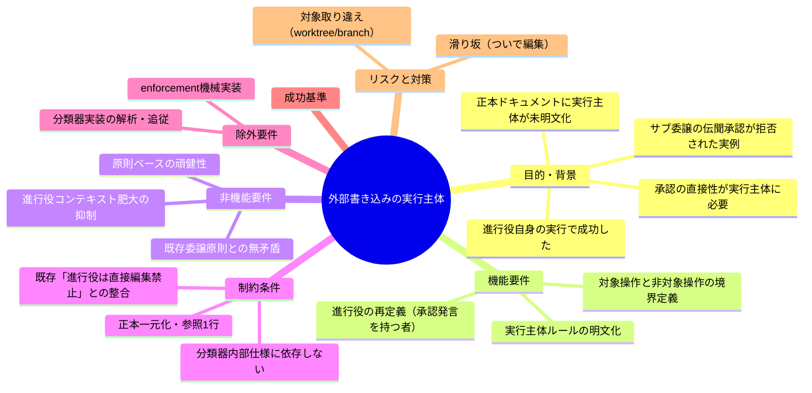
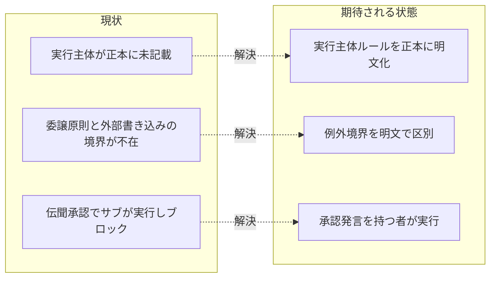

# 要求定義書: 外部サービス書き込み操作の実行主体明文化

**プロジェクト名**: 外部サービス書き込み操作の実行主体明文化
**作成日**: 2026 年 07 月 15 日
**最終更新**: 2026 年 07 月 15 日

> **重要**:
>
> - 要求定義書は、プロジェクトの全体像を把握するためのものです。詳細な技術仕様や実装方法は要件定義書以降で記載します。必要最低限の情報に収めることを心掛けてください。
> - **このドキュメントは常に更新**: 要求の変更や追加があった場合は、即座にこのドキュメントを更新してください。
>
> **用語**: [.agent-skill-chain/source/CONCEPTS.md §用語規約](../../../../.agent-skill-chain/source/CONCEPTS.md#用語規約) を参照。

---

## 要求定義の全体像

**注意**:

- マインドマップは全体像を把握するためのものです。主要なセクション名程度に留めます。

---

## 1. 目的・背景

### 1.1 目的（必須）

外部サービスへの書き込み操作の実行主体を正本に明文化する。

### 1.2 背景

- **現状の課題**:
  - 外部サービスへの書き込み操作（`gh issue create` / `git push` / `gh pr create` 等）を「誰が実行するか」が本フレームワークの正本ドキュメント（`skills/agent/run_command.md` 等）に明文化されておらず、運用者の記憶（メモリ [[feedback_orchestrator-direct-external-writes]]）にのみ依存している。
  - 既存の絶対規定「メイン（進行役）は実作業をせず必ずサブに委譲する」（[CORE.md §メインとサブの役割](../../../../.agent-skill-chain/source/boot/CORE.md)、[run_command.md §Execution Path Rule](../../../../.agent-skill-chain/source/skills/agent/run_command.md)）と、外部書き込みを進行役が実行する運用との**境界が正本上に存在しない**。読み手はこの2規定を矛盾と受け取り、どちらを優先すべきか判断できない。
  - **実例（一次情報）**: 2026-07-15、サブエージェントが「進行役（進行役）経由でユーザーが承認したと伝えられた」ことのみを根拠に `gh issue create` を実行しようとしたところ、Claude Code の Auto Mode Bypass 分類器に**サブ側で**ブロックされた。ユーザーの直接発言（AskUserQuestion への回答等）は進行役自身の会話にのみ存在したため、進行役自身が実行すると成功した。

- **必要性**:
  - ユーザーの直接の問い「github issue や commit、pull request の自動化は、必ず進行役が行うように強制すればよいのではないか」に対し、正本での回答（実行主体ルール）が必要。
  - ルールを「分類器仕様への適合」として書くと、分類器の内部仕様は非公開かつ変更されうるため脆弱になる（advisor 助言1）。「承認の直接性を実行主体に持たせる」という**原則**として正本に定着させる必要がある。

### 1.3 期待される効果（必須: 1 件以上）

- **効果 1**: 外部書き込み操作を委譲された者が伝聞承認のまま実行してブロックされる事故が、正本参照だけで未然に回避できるようになる（○/×: 正本に実行主体ルールが記載され、対象操作の実行主体が一意に判定できる）。
- **効果 2**: 既存の「進行役は直接編集禁止」規定と外部書き込み例外の**境界**が正本上で判定可能になり、「ついで編集」の滑り坂が正本の記述だけで否定できる（○/×: 例外が適用される操作範囲と適用されない操作が明文で区別されている）。
- **効果 3**: 「進行役」が並行セッション環境でも一意に定義され、どのエージェントが実行主体たりうるかが判定できる（○/×: 「承認したユーザー発言を自身の会話に持つエージェント」という定義が記載されている）。

**現状と期待される状態の比較**:

---

## 2. 機能要件

### 2.1 既存機能の維持（該当する場合）

- 「メイン（進行役）は実作業（コンテンツの作成・編集・設計・実装・レビュー）を行わず必ずサブに委譲する」絶対規定（CORE / run_command §Execution Path Rule）は**維持する**。本要求は content authorship の委譲原則を弱めない。
- 高リスク操作の事前ユーザー確認必須（[RULES.md §高リスク操作](../../../../.agent-skill-chain/source/RULES.md)）は維持する。

### 2.2 新規機能要件

- **実行主体ルールの明文化**: 外部サービスへの書き込み操作は、その操作を承認したユーザーの直接発言を自身の会話に持つエージェント（＝進行役）が実行する、という原則を正本（`run_command.md` を第一候補とする）へ記載する。
- **対象・非対象操作の境界定義**: どの操作が本ルールの対象か（例: `gh issue create` / `git push` / `gh pr create`）、どの操作が対象外か（例: `gh api` 等の読み取り専用、`gh pr merge --admin` 等の既承認済み操作、ローカル `git commit`）を列挙する。
- **「進行役」の定義**: 並行セッション環境を踏まえ、「進行役」を役割名ではなく「その操作を承認したユーザー発言を自身の会話に持つエージェント」として定義する。

---

## 3. 非機能要件

### 3.1 パフォーマンス

- 本要求はドキュメント（正本ルール）の追記であり実行時性能への影響はない。ただし進行役のコンテキスト肥大を抑えるため、実行分担（サブが実行直前まで準備し、進行役は最終確認と実行のみを担う）を要件で扱う（advisor 助言2）。

### 3.2 セキュリティ

- 承認の直接性を実行主体に持たせることで、伝聞承認による無自覚な外部公開を防ぐ。ルールは分類器の内部仕様に依存せず原則として記述し、緩和（分類器バイパス）を誘発しないこと。
- 対象取り違え（worktree / branch の誤り）による誤操作被害の集中を避けるため、実行前の対象検証を必須とする（advisor 助言2）。

### 3.3 互換性

- GitHub 非採用・到達不能環境、および並行セッション環境でも破綻しない記述とする（既存ゲートのフォールバック方針と整合）。

### 3.4 保守性

- 正本一元化（正本は1か所、参照は1行）に従い、`run_command.md` の既存 Constraints・Forbidden 群と重複せず、既存の「サブによる独断起票」禁止・「進行役は直接編集禁止」規定と相互参照で接続する。

---

## 4. 制約条件

### 4.1 技術的制約

- ルールは分類器の内部挙動（「実行主体の会話内のユーザー直接発言を見る」）への適合としてではなく、「承認の直接性を実行主体に持たせる」原則として書く（advisor 助言1）。分類器挙動は1事例からの推測であり内部仕様は非公開・変更されうる。
- 本 issue が変更対象とする既存規定を正確に引用・参照すること: [run_command.md §Forbidden「サブによる独断起票」](../../../../.agent-skill-chain/source/skills/agent/run_command.md)、[同 §Execution Path Rule / メイン直接編集の絶対禁止](../../../../.agent-skill-chain/source/skills/agent/run_command.md)、[CORE.md §メインとサブの役割](../../../../.agent-skill-chain/source/boot/CORE.md)、[RULES.md §高リスク操作](../../../../.agent-skill-chain/source/RULES.md)。

### 4.2 既存システムとの互換性

- 「進行役は直接 Edit 禁止・必ず委譲」との衝突が最大の論点（advisor 助言2）。外部書き込みは委譲原則の例外となるため、**例外の境界を明文化しないと「commit するついでに直接編集する」滑り坂**が生じる。例外はあくまで副作用アクション（外部書き込みコマンドの実行）に限り、コンテンツの作成・編集は対象外であることを明示する。

### 4.3 移行期間・スケジュール

- 本委譲のスコープは requirement-discovery（00・01 の作成と書記記録）まで。design-feature / verify-and-close / GitHub Issue 起票には進まない（本 issue の設計・実装は後続フェーズで別途行う）。

---

## 5. 除外要件

- Auto Mode Bypass 分類器の内部実装の解析・追従、分類器を回避する設定変更（Bash 権限の緩和等）は対象外（緩和誘発を避ける）。
- enforcement（PreToolUse hook 等）による本ルールの機械強制の実装は本フェーズの対象外（要件では「機械強制の要否」を論点として扱うに留める）。
- 他プロジェクト・消費者環境固有の運用具体化（settings.json 権限等）は対象外。

---

## 6. 成功基準（必須: 1 件以上）

- 正本ドキュメント（`run_command.md` を第一候補）に、外部書き込み操作の実行主体ルールが**原則ベース**（承認の直接性を実行主体に持たせる）で記載されている（○/×）。
- 対象操作（例: `gh issue create` / `git push` / `gh pr create`）と非対象操作（`gh api` 等読み取り専用 / `gh pr merge --admin` 等既承認済み / ローカル `git commit`）の境界が列挙され、実行主体が一意に判定できる（○/×）。
- 「進行役」が「その操作を承認したユーザー発言を自身の会話に持つエージェント」として定義されている（○/×）。
- 既存の「進行役は直接編集禁止」規定と本例外の境界（副作用アクションのみが例外、コンテンツ編集は対象外）が明文で区別され、既存規定と相互参照で接続されている（○/×）。
- `git commit`（ローカル）と push 以降（外部公開）の二段構えの採否、および実行専用フェーズ案の採否について、要件定義（01）で論点として明示的に扱われている（○/×）。

---

## 7. リスクと対策

### 7.1 技術的リスク

- **リスク**: ルールを分類器挙動への適合として書くと、分類器仕様変更で陳腐化する。
  - **対策**: 原則（承認の直接性）として記述し、分類器は根拠事例の脚注に留める。

- **リスク**: 誤操作被害の集中（進行役は複数 issue を並行統括するため worktree / branch 取り違えリスクが相対的に高い）。
  - **対策**: 外部書き込み実行前の対象（リポジトリ・ブランチ・worktree・issue 番号）検証を必須要件とする。

### 7.2 スケジュールリスク

- **リスク**: 例外境界の議論が発散し、既存の委譲原則・各ゲートと矛盾する記述を生む。
  - **対策**: 論点（二段構え／実行専用フェーズ案）は 01 で列挙し、確定は後続の設計フェーズへ委譲する。本フェーズは要求・要件の確定に限定する。

---

## 8. 参考資料

### プロジェクトドキュメント

- 新規テーマのため既存の `00_システム理解.md` は無し。

### その他の参考資料

- メモリ [[feedback_orchestrator-direct-external-writes]]（実例・伝聞承認拒否の一次記録）
- メモリ [[feedback_orchestrator-must-delegate]]（進行役は直接編集禁止・必ず委譲）
- メモリ [[feedback_autonomous-scope-means-through-pr]]（自走依頼は push・PR 作成まで事前承認、マージ除く）
- [.agent-skill-chain/source/skills/agent/run_command.md](../../../../.agent-skill-chain/source/skills/agent/run_command.md)
- [.agent-skill-chain/source/boot/CORE.md](../../../../.agent-skill-chain/source/boot/CORE.md)
- [.agent-skill-chain/source/RULES.md](../../../../.agent-skill-chain/source/RULES.md)

---

## 9. 次のステップ

この要求定義書の承認後、以下のドキュメントを作成します：

- **次**: [`01_要件定義.md`](./01_要件定義.md) - 要件定義フェーズ
