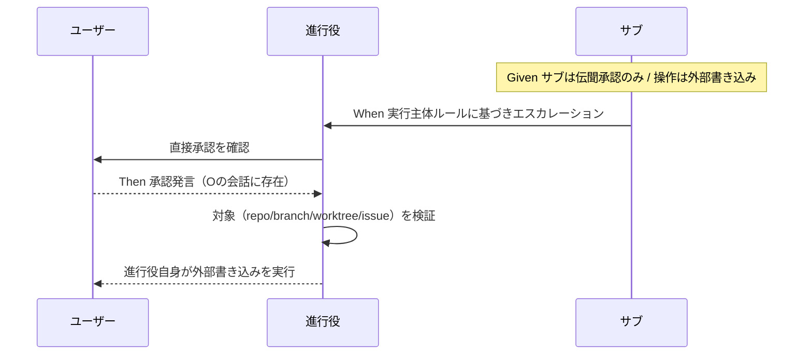

# 要件定義書: 外部サービス書き込み操作の実行主体明文化

**プロジェクト名**: 外部サービス書き込み操作の実行主体明文化
**作成日**: 2026 年 07 月 15 日
**最終更新**: 2026 年 07 月 15 日

> **重要**: **このドキュメントは常に更新**: 要件の変更や追加があった場合は、即座にこのドキュメントを更新してください。
>
> **用語**: [.agent-skill-chain/source/CONCEPTS.md §用語規約](../../../../.agent-skill-chain/source/CONCEPTS.md#用語規約) を参照。

---

## 1. 概要

### 1.1 システム概要

本フレームワークの正本ドキュメント（第一候補は `skills/agent/run_command.md`）に、外部サービスへの書き込み操作の**実行主体ルール**を明文化する。原則は「承認の直接性を実行主体に持たせる」＝当該操作を承認したユーザーの直接発言を自身の会話に持つエージェント（進行役）がその操作を実行する。既存の「メイン（進行役）は content authorship を必ずサブに委譲する」絶対規定は維持したまま、副作用アクション（外部書き込みコマンドの実行）のみを例外として境界を明文化する。詳細な記述位置・enforcement 化の要否は後続の設計フェーズで確定する。

### 1.2 用語集

| 用語 | 説明 |
| ---- | ---- |
| 進行役（オーケストレーター） | 役割名ではなく「その操作を承認したユーザーの直接発言を自身の会話に持つエージェント」。並行セッション環境では会話ごとに別個の進行役が成立する。 |
| 外部書き込み操作 | 外部サービス・公開リモートの状態を変える操作。例: `gh issue create` / `git push`（公開リモートへの push） / `gh pr create`。 |
| ローカル書き込み操作 | 作業ツリー内で完結し外部公開を伴わない操作。例: `git commit`（push しない限りローカル）。 |
| 読み取り専用操作 | 外部状態を変えない参照系操作。例: `gh api`（GET） / `gh issue view` / `git fetch`。 |
| 既承認済み操作 | 本リポジトリで別途スタンディング承認が確立している操作。例: `gh pr merge --admin`（メモリ [[feedback_admin-merge-standing-approval]]）。 |
| 伝聞承認（agent-relayed consent） | 実行主体の会話には無く、他エージェント（進行役）経由で「ユーザーが承認した」と伝えられただけの承認。 |
| content authorship | 設計・実装・レビュー・ドキュメントなど成果物の作成・編集。既存規定により必ずサブへ委譲される。 |

---

## 2. 機能要件

### 2.1 ユーザーストーリー

#### ストーリー 1: 実行主体ルールの明文化

- **As a** 本フレームワークの運用者（進行役・サブエージェント）
- **I want to** 外部書き込み操作を「誰が」実行するかを正本ドキュメントで判定したい
- **So that** 伝聞承認のまま実行してブロックされる事故を、正本参照だけで未然に避けられる

**受け入れ基準**:

- 正本（`run_command.md` を第一候補）に、外部書き込み操作は「その操作を承認したユーザーの直接発言を自身の会話に持つエージェントが実行する」という**原則**が記載されている。
- ルールは分類器の内部挙動への適合としてではなく原則として書かれ、分類器事例は根拠（脚注・Why）に留められている。

#### ストーリー 2: 対象・非対象操作の境界定義

- **As a** 委譲を受けたサブエージェント
- **I want to** どの操作が実行主体ルールの対象で、どれが自分で実行してよいかを列挙で知りたい
- **So that** 対象操作はエスカレーション、非対象操作は自分で実行、と迷わず判断できる

**受け入れ基準**:

- 対象操作（例: `gh issue create` / `git push` / `gh pr create`）が列挙されている。
- 非対象操作が区別して列挙されている: 読み取り専用（`gh api` 参照系 / `git fetch` 等）、既承認済み（`gh pr merge --admin`）、ローカル `git commit`。
- `git commit`（ローカル）と push 以降（外部公開）を分ける二段構え（「push 以降は進行役、commit まではサブ可」）の**採否**が明示されている（採用しない場合は理由）。

#### ストーリー 3: 「進行役」の一意な定義（並行セッション対応）

- **As a** 複数の進行役セッションが自律稼働する環境の運用者
- **I want to** 「進行役」を会話に紐づく形で定義したい
- **So that** どのエージェントが特定の操作の実行主体たりうるかを一意に判定できる

**受け入れ基準**:

- 「進行役」が役割名ではなく「その操作を承認したユーザー発言を自身の会話に持つエージェント」として定義されている。
- サブに承認が伝聞でしか無い場合、まず進行役自身の会話で直接確認を取ってから進行役自身が実行する、という手順が示されている。

#### ストーリー 4: 既存の直接編集禁止規定との境界明確化

- **As a** 進行役
- **I want to** 「外部書き込みは自分で実行する」例外が content authorship の委譲原則を侵さない境界を知りたい
- **So that** 「commit するついでに直接ファイルを編集する」滑り坂に陥らない

**受け入れ基準**:

- 例外は副作用アクション（外部書き込みコマンドの実行）に**限定**され、コンテンツの作成・編集は対象外である旨が明文化されている。
- 既存規定（[run_command.md §Execution Path Rule](../../../../.agent-skill-chain/source/skills/agent/run_command.md)・[同 §Forbidden「サブによる独断起票」](../../../../.agent-skill-chain/source/skills/agent/run_command.md)・[CORE.md §メインとサブの役割](../../../../.agent-skill-chain/source/boot/CORE.md)）と相互参照で接続され、矛盾ではなく例外関係として読める。

#### ストーリー 5: 誤操作防止（対象検証）と進行役負荷の抑制

- **As a** 複数 issue を並行統括する進行役
- **I want to** 外部書き込み実行前に対象（リポジトリ・ブランチ・worktree・issue 番号）を検証する手順と、実行分担を要件に持ちたい
- **So that** worktree / branch 取り違えによる誤操作被害を防ぎつつ、進行役のコンテキスト肥大を抑えられる

**受け入れ基準**:

- 外部書き込み実行前の対象検証（リポジトリ・ブランチ・worktree・issue 番号の確認）が必須手順として記載されている。
- サブが実行直前まで準備（コマンド文面・body・対象の確定）を行い、進行役は最終確認と実行のみを担う分担が緩和策として記載されている。

### 2.2 BDD ユースケース

#### ユースケース 1: 外部書き込み操作の実行主体判定

正本ルールに従い、外部書き込み操作を誰が実行するかを判定する。

**シナリオ 1: 伝聞承認しか持たないサブは実行しない**

```gherkin
Feature: 外部書き込み操作の実行主体判定
  Scenario: 伝聞承認のサブがgh issue createを実行しようとする
    Given サブエージェントは「進行役経由でユーザーが承認した」という伝聞承認のみを持つ
    And 実行しようとする操作は外部書き込み操作（gh issue create）である
    When 実行主体ルールを参照する
    Then サブは実行せず、進行役自身の会話での直接承認を得るようエスカレーションする
```

**処理フロー**:



**シナリオ 2: 承認発言を自身の会話に持つ進行役が実行する**

```gherkin
Feature: 外部書き込み操作の実行主体判定
  Scenario: 進行役が直接承認を持ちgit pushを実行する
    Given 進行役は当該操作を承認したユーザーの直接発言を自身の会話に持つ
    And 実行前に対象リポジトリ・ブランチ・worktreeを検証済みである
    When 外部書き込み操作（git push）を実行する
    Then 進行役自身がその操作を実行してよい（content authorshipの委譲原則は侵さない）
```

#### ユースケース 2: 対象・非対象操作の境界適用

操作を対象・非対象に分類し、適切な実行主体を割り当てる。

**シナリオ 1: 読み取り専用・既承認済み操作は本ルールの対象外**

```gherkin
Feature: 対象・非対象操作の境界適用
  Scenario: gh apiの参照とgh pr merge --adminは本ルールの対象外
    Given 操作が読み取り専用（gh api 参照系）または既承認済み（gh pr merge --admin）である
    When 実行主体ルールを参照する
    Then その操作は外部書き込み実行主体ルールの対象外として扱われる
    And 対象外である旨と根拠が正本に列挙されている
```

**シナリオ 2: ローカルcommitと外部公開pushの二段構えを論点として扱う**

```gherkin
Feature: 対象・非対象操作の境界適用
  Scenario: git commitとpushを同列にしない検討
    Given worktree内で作業するサブがgit commitを行う
    When 二段構え（commitまではサブ可・push以降は進行役）の採否を検討する
    Then 要件として二段構えの採否と理由が明記される
    And 決定はサブのcommit毎の進行役依頼という非効率を評価したうえで行われる
```

#### ユースケース 3: 実行方式の代替案検討（実行専用フェーズ）

進行役直実行を「例外」ではなく chain 上の正規ステップにする代替案を検討する。

**シナリオ 1: 実行専用フェーズ案の採否を要件で記録する**

```gherkin
Feature: 実行方式の代替案検討
  Scenario: 実行専用の薄いフェーズをchain上の正規stepとして定義する案
    Given 進行役直実行を例外として扱うと既存の委譲原則との境界管理が必要になる
    When 「実行専用フェーズをchain上の正規stepにする」代替案を検討する
    Then 要件として当該代替案の採否・利点・欠点が記録される
    And 確定は後続の設計フェーズ（design-feature）へ委譲される
```

### 2.3 ビジネスルール

- **BR-1（実行主体の原則）**: 外部書き込み操作は、その操作を承認したユーザーの直接発言を自身の会話に持つエージェント（進行役）が実行する。伝聞承認のみのエージェントは実行しない。
- **BR-2（例外の限定）**: 本例外は副作用アクション（外部書き込みコマンドの実行）に限る。設計・実装・レビュー・ドキュメント編集などの content authorship は従来どおり必ずサブへ委譲する（[run_command.md §Execution Path Rule](../../../../.agent-skill-chain/source/skills/agent/run_command.md) を弱めない）。
- **BR-3（対象外操作）**: 読み取り専用操作（`gh api` 参照系・`git fetch` 等）、既承認済み操作（`gh pr merge --admin`。[[feedback_admin-merge-standing-approval]]）、ローカル `git commit`（push しない限り）は本ルールの実行主体制約の対象外（原則サブ可）。ただし既承認済みの外部書き込み（remote branch 削除等）はランタイム分類器がスタンディング承認を参照せずブロックしうるため、ブロック時は進行役実行とする（設計フェーズで運用上の但し書きとして精緻化）。また高リスク操作の事前確認（[RULES.md §高リスク操作](../../../../.agent-skill-chain/source/RULES.md)）は引き続き適用される。
- **BR-4（対象検証）**: 外部書き込み実行前に、対象リポジトリ・ブランチ・worktree・issue 番号を検証する。並行統括による取り違えリスクを緩和する。
- **BR-5（記述の頑健性）**: ルールは分類器の内部仕様への適合としてではなく原則として記述する。分類器事例は Why / 脚注に留め、緩和（分類器バイパス・権限緩和）を誘発しない。
- **BR-6（正本一元化）**: 実行主体ルールの正本は1か所（第一候補 `run_command.md`）に置き、既存の関連規定とは参照1行で接続する。

---

## 3. 非機能要件

### 3.1 パフォーマンス要件

- ドキュメント追記であり実行時性能への影響はない。進行役のコンテキスト肥大は、サブが実行直前まで準備し進行役は最終確認と実行のみを担う分担で抑制する。

### 3.2 セキュリティ要件

- 承認の直接性を実行主体に持たせることで、伝聞承認による無自覚な外部公開を防ぐ。
- 記述が分類器バイパスや Bash 権限緩和を誘発しないこと（緩和は採用しない）。

### 3.3 ユーザビリティ要件

- 対象・非対象操作が列挙形式で、委譲を受けた側が即座に自己判定できること。
- 既存規定との関係が「矛盾」ではなく「例外」として一読で理解できること。

### 3.4 可用性要件

- GitHub 非採用・到達不能環境、並行セッション環境でも記述が破綻しないこと（既存ゲートのフォールバック方針と整合）。

---

## 4. 外部インターフェース要件

### 4.1 API 要件

- 対象とする外部書き込みコマンド系（**代表例**。網羅ではなく、抽象定義「外部状態を変え外部公開を伴う操作」が第一基準）: `gh issue create`、`gh pr create`、`git push`（公開リモート・`--force` 含む）、リポジトリ可視性変更・リリース公開等の外部公開操作。境界の詳細は設計フェーズで確定する。
- 対象外として明示する参照系: `gh api`（GET 等の読み取り）、`gh issue view`、`git fetch`。
- 既承認済みとして扱う: `gh pr merge --admin`（スタンディング承認により原則サブ可。ただしランタイム分類器はメモリ上の承認を参照しないため、ブロック時は進行役実行とする運用上の但し書きを設計フェーズで扱う）。

### 4.2 データ形式要件

- 正本への追記フォーマットは既存 `run_command.md` の Constraints / Forbidden 群のスタイル（箇条書き・相互参照リンク）に合わせる。正本の記述位置・見出しは設計フェーズで確定する。

---

## 5. 制約事項

- 本フェーズのスコープは 00・01 の作成と書記記録まで。design-feature / verify-and-close / GitHub Issue 起票には進まない。
- 変更対象の既存規定は正確に引用・参照する（[run_command.md](../../../../.agent-skill-chain/source/skills/agent/run_command.md) の §Execution Path Rule・§Forbidden「サブによる独断起票」、[CORE.md](../../../../.agent-skill-chain/source/boot/CORE.md)、[RULES.md §高リスク操作](../../../../.agent-skill-chain/source/RULES.md)）。
- 二段構え（commit / push）の採否と実行専用フェーズ案は、本要件で論点として明示し、最終確定は設計フェーズへ委譲する。
- enforcement による機械強制の実装は本フェーズ対象外（要否のみ論点化）。

---

## 6. 参考資料

### プロジェクトドキュメント

- [`00_要求定義.md`](./00_要求定義.md) - 要求定義

### その他の参考資料

- メモリ [[feedback_orchestrator-direct-external-writes]]（伝聞承認拒否の実例・一次記録）
- メモリ [[feedback_orchestrator-must-delegate]]（進行役は直接編集禁止・必ず委譲）
- メモリ [[feedback_autonomous-scope-means-through-pr]]（自走依頼の事前承認範囲）
- メモリ [[feedback_admin-merge-standing-approval]]（`gh pr merge --admin` のスタンディング承認）
- [.agent-skill-chain/source/skills/agent/run_command.md](../../../../.agent-skill-chain/source/skills/agent/run_command.md)
- [.agent-skill-chain/source/boot/CORE.md](../../../../.agent-skill-chain/source/boot/CORE.md)
- [.agent-skill-chain/source/RULES.md](../../../../.agent-skill-chain/source/RULES.md)

---

## 7. 前のステップ

この要件定義書は、以下のドキュメントを基に作成されています：

- **前**: [`00_要求定義.md`](./00_要求定義.md) - 要求定義フェーズ

---

## 8. 次のステップ

この要件定義書の承認後、以下のドキュメントを作成します：

- **次**: [`02_設計.md`](./02_設計.md) - 設計フェーズ
