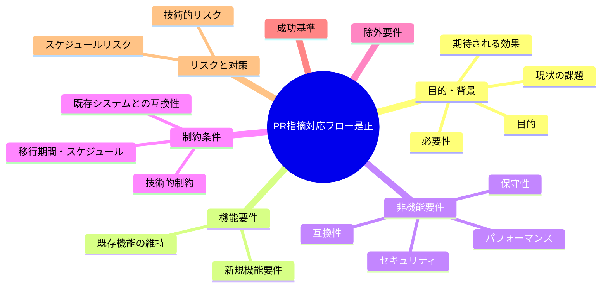
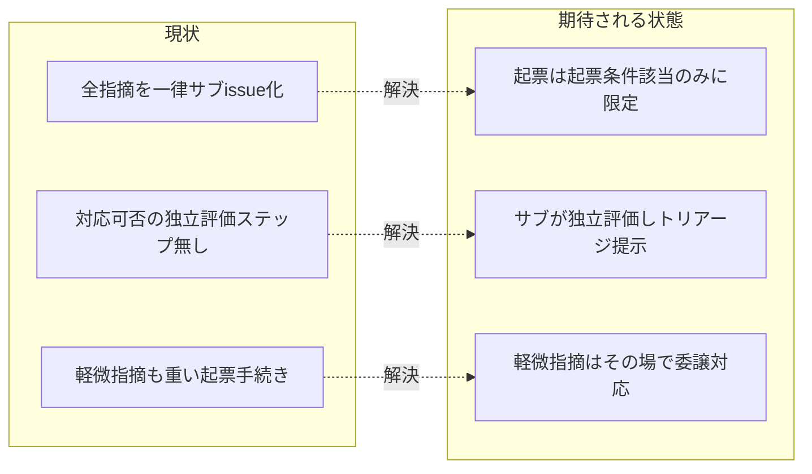

# 要求定義書: PR指摘対応フロー是正

**プロジェクト名**: PR指摘対応フロー是正
**作成日**: 2026年07月15日
**最終更新**: 2026年07月15日

> **重要**:
>
> - 要求定義書は、プロジェクトの全体像を把握するためのものです。詳細な技術仕様や実装方法は要件定義書以降で記載します。必要最低限の情報に収めることを心掛けてください。
> - **このドキュメントは常に更新**: 要求の変更や追加があった場合は、即座にこのドキュメントを更新してください。ドキュメントは「生きているドキュメント」として扱い、実装内容と常に同期させます。
> - **必須項目**: 以下の「必須」と明記した項目は空欄・抽象語のみ（例: 「{説明}」のまま）で提出しないこと。判定可能な形（目的は1文・成功基準は○/×で判定できる記載等）で記入すること。
>
> **用語**: [.agent-skill-chain/source/CONCEPTS.md §用語規約](../../../../.agent-skill-chain/source/CONCEPTS.md#用語規約) を参照。

---

## 要求定義の全体像

**注意**:

- 本 issue の対象は `create-pr-review-issue` コマンド（PR レビュー指摘対応）のフロー是正です。
- マインドマップは全体像を把握するためのものです。詳細は各セクションを参照してください。

---

## 1. 目的・背景

### 1.1 目的（必須）

軽微な PR 指摘は直接対応し、起票を非可逆的対応に限定するフローに是正する。

### 1.2 背景

- **現状の課題**:
  - 現行の `create-pr-review-issue` コマンドは、CodeRabbit 等 AI レビューアの指摘を受けると、軽微・非軽微を問わず**一律にサブ issue（`90_issues/{ディレクトリ名}/`）として起票**する設計になっている（`commands/create-pr-review-issue.md`・`workers/create-pr-review-issue/`）。
  - typo・lint・コメント修正など、その場で 1 コミットで直せる軽微な指摘まで起票してしまい、ディレクトリ作成・00 生成・監査・書記記録の重い手続きが指摘ごとに発生してオーバーヘッドが大きい。
  - 指摘の「対応可否」を実際に調査・評価するステップが明示されておらず、対応方針案の生成が起票を前提にした一方向フローになっている。

- **必要性**:
  - ユーザーが直接言及した一次情報:「issue 化までしなくてもいいものも issue 化してしまう。軽微であればそのまま対応していい」「サブ issue として新しく起票するのは、非可逆的に対応する必要があるものだけに限定し、軽微な指摘はサブエージェントの判断で対応するようにした方が効率的」。
  - 軽微指摘の即時対応と、非可逆的対応の起票分離により、レビュー指摘対応の効率を上げつつ品質ゲート（既存ルール・監査）との整合を保つ必要がある。

### 1.3 期待される効果（必須: 1 件以上）

- **効果 1**: 軽微な指摘が起票されずその場で対応され、起票件数が「非可逆的対応が必要な指摘」に限定される（○/×: 全指摘のうち起票条件チェックリストに該当しないものが起票されずに直接対応または見送りで処置されていれば○）。
- **効果 2**: 全指摘に処置（即時対応／起票／見送り）が漏れなく記録され、対応状況が追跡可能になる（○/×: 全指摘に disposition が付与されていれば○）。
- **効果 3**: 「非可逆」の主観判定を排し、操作可能な代理指標チェックリストで起票要否が機械的・再現的に判定される（○/×: 起票判定が主観語ではなくチェックリスト該当で説明されていれば○）。

**現状と期待される状態の比較**:

---

## 2. 機能要件

### 2.1 既存機能の維持（該当する場合）

- 指摘一覧の抽出（`ReviewFinding[]`）・出力フォーマット（`workers/create-pr-review-issue/OUTPUT_FORMAT.md`）は維持する。
- 非可逆的対応が必要な指摘に対するサブ issue 起票（`90_issues/{ディレクトリ名}/` へのディレクトリ決定・00 生成・監査・書記記録）は維持する。
- 「サブによる独断起票の禁止／Go は進行役」という既存ルール（`run_command.md` §Forbidden、CORE/PHASES）は維持し、本 issue はそれと整合する方向で改定する。

### 2.2 新規機能要件

- **3 ステップフローの導入**:
  1. **サブエージェントの独立技術評価**: 全指摘を確認・調査し、各指摘の対応可否と処置案を判断する（一括トリアージ）。
  2. **進行役の承認**: サブの判断を受け、進行役が最終的な対応方針（disposition）を決定する（一括承認）。
  3. **対応の実施**: 承認された方針に従い、対応方法を検討し実施する（実施は委譲で行う）。
- **三値トリアージ（disposition）**: 各指摘を「即時対応」「起票」「見送り（理由付き）」のいずれかに分類する。
- **起票条件チェックリスト**: 「非可逆」を直接の判定式に用いず、操作可能な代理指標に落とす。C1 仕様・受け入れ基準の変更を伴う／C2 設計判断（02_設計の修正）が必要／C3 PR スコープ外／C4 複数指摘に共通する根本原因がある／**C5 非可逆または破壊的な副作用を伴う・判定が不確実（データ削除・破壊的変更・上書き/マイグレーション・外部公開等の fail-safe）**。1 つでも該当したら起票（保守側デフォルト）。C5 は代理指標 C1〜C4 が原基準「非可逆／破壊的」を取りこぼさないための安全網。
- **記録の一本化**: 全指摘の disposition と根拠を、既存の 00_要求定義（指摘一覧）に一本化して記録する。

---

## 3. 非機能要件

### 3.1 パフォーマンス

- ステップ 1 を全指摘一括のトリアージ（表形式）にし、進行役は一括承認できること。承認往復が指摘数に単純比例して膨らまないこと。

### 3.2 セキュリティ

- セキュリティ関連の指摘は、軽微判定であっても記録・監査を必須とする（見過ごし・無記録での即時対応を認めない）。

### 3.3 互換性

- 既存の `create-pr-review-issue` の入力（pr_url・review_comments_raw・issue_dir_hint・parent_issue_id）と出力フォーマット（ReviewFinding[]）との互換を保つ。
- 既存ルール（CORE/PHASES/run_command.md）を再定義せず、コマンド側は正本を参照する形にする。

### 3.4 保守性

- コマンド側にルールを重複定義しない。フロー・disposition・起票条件チェックリストの記述は単一責務で、正本（CORE/PHASES/run_command.md）へは参照でつなぐ。

---

## 4. 制約条件

### 4.1 技術的制約

- 「その場で直接対応」の実施者は、進行役の**直接 Edit 禁止ルール**（`run_command.md` Execution Path Rule）に抵触しないよう、**委譲実行**であることを明記する（進行役が自らファイル編集しない）。
- 軽微判定はテスト実行をゲートとする。修正が既存テストを壊す場合は軽微判定を取り消し、起票側または再評価に回す。

### 4.2 既存システムとの互換性

- 「サブによる独断起票の禁止」（`run_command.md` §Forbidden）と整合させる。サブは独立評価・トリアージ案の提示に留め、起票・即時対応の Go 出しは進行役の承認を経る。
- 記録先は既存の 00_要求定義（指摘一覧）に一本化し、新たな記録面を増やさない。

### 4.3 移行期間・スケジュール

- 本 issue のスコープは requirement-discovery（00・01 の作成と書記記録）まで。設計（02）・実装（03 以降）は後続フェーズで行う。

---

## 5. 除外要件

- `create-pr-review-issue` 以外のコマンドのフロー改定は対象外。
- AI レビューア（CodeRabbit 等）からのコメント自動取得（GitHub MCP 連携）は対象外（現行どおり手動貼り付け前提）。
- 02_設計・03_実装計画・実装・verify-and-close・GitHub Issue 起票は本 issue のスコープ外（後続フェーズ）。

---

## 6. 成功基準（必須: 1 件以上）

- 全指摘に disposition（即時対応／起票／見送り）が漏れなく付与され、根拠とともに 00_要求定義（指摘一覧）へ記録されている（DoD）。
- 起票要否が「非可逆」の主観語ではなく、起票条件チェックリストの該当有無で判定・説明されている。1 つでも該当すれば起票側に倒している。
- ステップ 1 が全指摘一括トリアージ（表形式: 指摘／判定案／根拠）として提示され、進行役が一括承認する形になっている。
- 「即時対応」の実施が委譲実行として記述され、進行役の直接 Edit 禁止ルールに抵触していない。
- 軽微判定にテスト実行ゲートがあり、テストが壊れる場合は軽微判定を取り消す旨が要件化されている。
- セキュリティ指摘は軽微でも記録・監査必須、AI 誤検知は「見送り（理由付き）」として正式な処置カテゴリになっている。
- コマンド側は既存ルール（サブ独断起票禁止・Go は進行役）を再定義せず正本参照になっている。

---

## 7. リスクと対策

### 7.1 技術的リスク

- **リスク**: 「非可逆」を主観で判定すると人によってブレて起票要否が不安定になる。
  - **対策**: 「非可逆」を直接基準にせず操作可能な代理指標チェックリストへ落とし、1 つでも該当したら起票する保守側デフォルトを要件に含める。
- **リスク**: 個々は軽微でも複数ファイル横断・共通根本原因のケースを見落とし、局所修正が積み重なって設計が崩れる。
  - **対策**: 「複数指摘に共通する根本原因がある」を起票条件に含め、合算で起票側へ倒す。

### 7.2 スケジュールリスク

- **リスク**: 指摘 1 件ごとに 3 ステップ・承認往復を回すと、指摘数に比例してオーバーヘッドが膨らむ。
  - **対策**: ステップ 1 を全指摘一括トリアージ（表形式）にし、進行役が一括承認する設計とする。

---

## 8. 参考資料

### プロジェクトドキュメント

- 既存プロジェクトの場合は、[`00_システム理解.md`](./00_システム理解.md) - システム理解を参照（本 issue では未作成）

### その他の参考資料

- `.agent-skill-chain/source/commands/create-pr-review-issue.md`（改定対象コマンドの現行定義）
- `.agent-skill-chain/source/workers/create-pr-review-issue/`（README.md・OUTPUT_FORMAT.md・00_TEMPLATE_MAPPING.md）
- `.agent-skill-chain/source/scripts/create-pr-review-issue-dir.sh`（ディレクトリ決定・作成）
- `.agent-skill-chain/source/skills/agent/run_command.md`（Execution Path Rule／§Forbidden「サブによる独断起票」）
- `.agent-skill-chain/source/boot/CORE.md`・`.agent-skill-chain/source/workflow/PHASES.md`（起票・Go 判断の正本）

---

## 9. 次のステップ

この要求定義書の承認後、以下のドキュメントを作成します：

- **次**: [`01_要件定義.md`](./01_要件定義.md) - 要件定義フェーズ
