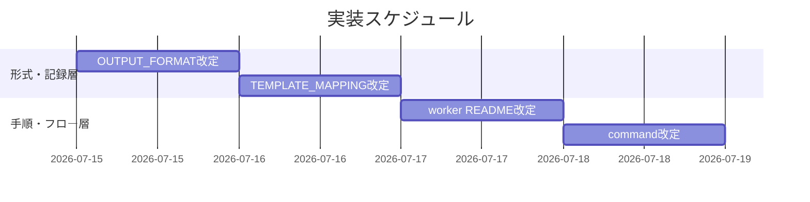
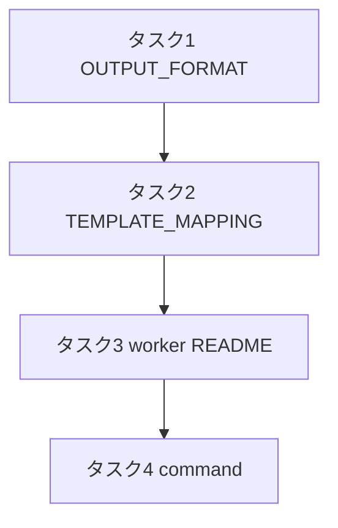

# 実装計画書: PR指摘対応フロー是正

**プロジェクト名**: PR指摘対応フロー是正
**作成日**: 2026年07月15日
**最終更新**: 2026年07月15日

> **重要**: **このドキュメントは常に更新**: 実装計画の変更、進捗状況の更新、バグの記録などがあった場合は、即座にこのドキュメントを更新してください。ドキュメントは「生きているドキュメント」として扱い、実装内容と常に同期させます。
> **必須項目**: 「必須」と明記した欄は空欄・抽象語のみで提出しないこと。テスト観点・BDD 仕様は具体ケースを 1 件以上記載すること。
>
> **用語**: [.agent-skill-chain/source/CONCEPTS.md §用語規約](../../../../.agent-skill-chain/source/CONCEPTS.md#用語規約) を参照。

---

## 1. 実装概要

### 1.1 実装方針（必須）

02_設計に従い、`create-pr-review-issue` のフローを是正するドキュメント 4 ファイルを**下位（データ形式）→上位（フロー）**の順に改定する。起票条件・disposition の定義は OUTPUT_FORMAT.md 1 か所を正本にし、他は参照でつなぐ。横断ルール（サブ独断起票禁止・Go は進行役・進行役の直接 Edit 禁止）は `run_command.md` §Forbidden / Execution Path Rule・CORE / PHASES を参照し**再定義しない**。既存の `ReviewFinding[]` 形式・コマンド入力・`create-pr-review-issue-dir.sh` は変更しない（互換維持）。

### 1.2 実装順序（必須: 1 件以上）

1. タスク1: OUTPUT_FORMAT.md（disposition・TriageRow・起票条件チェックリスト・見送り・security_flag の正本化）
2. タスク2: 00_TEMPLATE_MAPPING.md（disposition 記録の 00 一本化）
3. タスク3: worker README.md（3 ステップ手順・独立技術評価・即時対応の委譲実行・テストゲート）
4. タスク4: commands/create-pr-review-issue.md（3 ステップ chain・OUTPUT/DONE・ERROR/Forbidden・正本参照）



---

## 2. タスク分解

**用語**: [.agent-skill-chain/source/CONCEPTS.md §用語規約](../../../../.agent-skill-chain/source/CONCEPTS.md#用語規約) を参照。

**必須**: 各タスクには **「テスト観点」（2.x.3）** と **「単体テスト仕様（BDD）」（2.x.4）** を必ず記載する。テスト観点の定義は **02\_設計 §6** および **RULES のテスト戦略・[TEST_BDD_FORMAT.md](../../../../.agent-skill-chain/source/TEST_BDD_FORMAT.md)** を参照し、本ドキュメントでは**タスクごとの具体ケース**のみ記載する。

> 本改定はエージェント向けドキュメントであり、「単体テスト」は各ファイルの必須要素の存在検査（grep 等の目視／機械確認）、「結合」は 4 ファイル間の参照整合検査に相当する。テストコード例はドキュメント検査スクリプト（bash/grep）で示す。

### 2.1 タスク 1: OUTPUT_FORMAT.md へ disposition・起票条件チェックリストを正本化

#### 2.1.1 概要（必須）

`disposition`（三値）・`TriageRow`・起票条件チェックリスト（C1〜C5・保守側デフォルト。C5＝非可逆/破壊的副作用・判定不確実の fail-safe）・見送り理由必須・`security_flag` を OUTPUT_FORMAT.md の単一正本として追加する。

#### 2.1.2 実装内容（必須: 1 件以上）

- `Disposition` 列挙（即時対応／起票／見送り）と各実施経路の節を追加。
- `TriageRow`（finding_id / disposition_proposal / matched_criteria / rationale / security_flag / defer_reason）の表を追加。
- 起票条件チェックリスト **C1〜C5**（C5＝非可逆または破壊的な副作用・判定不確実の fail-safe）と「1 つでも該当したら起票（保守側デフォルト）」を明記。即時対応の許容ゲート（現 PR ブランチ 1 コミット・既存テスト green・diff 局所、C1〜C5 いずれも非該当）を併記。破壊的操作（≒非可逆）は C5、互換破壊の breaking change は C1 という振り分けも明記。
- 見送り（理由付き）＝ AI 誤検知等の正式カテゴリ、`defer_reason` 必須を明記。
- `security_flag=true` は軽微でも記録・監査必須、かつ一括承認に埋没させず個別承認とする旨を明記。
- テストが実行不能で green を確定できない場合の fail-safe（軽微判定取消→起票側/再評価）を明記。
- 既存の `ReviewFinding` 表・strategies は互換維持（削除しない。strategies は disposition/rationale と整合する説明に更新）。

#### 2.1.3 テスト観点（必須）

**参照**: 観点の定義は [02\_設計 §6](./02_設計.md) および [RULES のテスト戦略・TEST_BDD_FORMAT](../../../../.agent-skill-chain/source/RULES.md#テスト戦略必須要件) を参照。以下には**本タスクの具体ケース**のみ記載する。

##### 単体（本タスクの具体ケース・必須 1 件以上）

- 「即時対応／起票／見送り」の三値がすべて記載されている。
- 起票条件 C1〜C5（仕様・受け入れ基準変更／設計判断／PR スコープ外／共通根本原因／非可逆・破壊的副作用・判定不確実の fail-safe）と「1 つでも該当したら起票」が記載されている。
- 「非可逆」を判定式の語として用いず、該当項目名（C1〜C5）で説明する旨が記載されている（異常系: 主観語のみでの判定記述が無い）。C5 が非可逆・破壊的の取りこぼしを回収する fail-safe であることが記載されている。

##### 結合/API（本タスクの具体ケース・該当時は必須 1 件以上）

- `TriageRow` のフィールドが 00_TEMPLATE_MAPPING（タスク2）の記録列と 1 対 1 で対応する。

##### E2E/受け入れ（本タスクの具体ケース・未達時は理由記載）

- 実行系でないため E2E は該当なし（ドキュメント検査で代替）。

##### バリデーション（該当する場合の具体ケース）

- `disposition=見送り` のとき `defer_reason` 必須、`security_flag=true` のとき記録・監査必須、の不変条件が明記されている。

#### 2.1.4 単体テスト仕様（BDD）（必須）

**BDD 形式のテストケース（高レベル仕様）**:

```gherkin
Feature: OUTPUT_FORMAT に三値 disposition と起票条件チェックリストが正本化される
  Scenario: 三値と起票条件が定義される
    Given OUTPUT_FORMAT.md を改定した
    When ファイル内容を検査する
    Then 即時対応・起票・見送りの三値が定義されている
    And 起票条件 C1〜C5（C5=非可逆/破壊的・判定不確実の fail-safe）と「1つでも該当したら起票」が定義されている
    And 見送りは defer_reason 必須・security は軽微でも記録監査必須と明記されている
```

**テストコード例（必須: インラインコメントで Given/When/Then を明記）**

```bash
# Given: 改定後の OUTPUT_FORMAT.md
f=.agent-skill-chain/source/workers/create-pr-review-issue/OUTPUT_FORMAT.md
# When: 必須要素を grep で検査する
# Then: 三値・起票条件・保守側デフォルト・見送り理由必須・security が存在する
grep -q "即時対応" "$f" && grep -q "起票" "$f" && grep -q "見送り" "$f"
grep -q "起票条件" "$f" && grep -Eq "1 ?つでも該当" "$f"
grep -q "defer_reason" "$f" && grep -q "security_flag" "$f"
```

#### 2.1.5 依存関係

- なし（最下層。他タスクの前提となる）。

#### 2.1.6 見積もり

- **工数**: 1.0h
- **優先度**: 高

### 2.2 タスク 2: 00_TEMPLATE_MAPPING.md へ disposition 記録の一本化を追加

#### 2.2.1 概要（必須）

全指摘の disposition・根拠・進行役の一括承認記録を、既存 00_要求定義（指摘一覧）へ一本化して記録するマッピングを追加する。新たな記録面を増やさない。

#### 2.2.2 実装内容（必須: 1 件以上）

- 「## 2. 指摘一覧」テーブルへ **disposition／根拠／起票条件該当（matched_criteria）／security** 列を追加するマッピングを記載。
- 「## 3. 各指摘の対応方針（案）」を disposition 提案・根拠と整合する記述へ更新（案→承認後は確定 disposition を反映）。
- **進行役の一括承認ブロック**（承認者＝進行役・承認日時・承認方式＝一括／個別修正の別・個別修正した finding.id 一覧・`security_flag`/C5 該当の個別承認記録）を 00 に持たせるマッピングを追加。
- **記録面の所在**: この 00 は PR レビューバッチにつき 1 つ生成するトリアージ記録用 00 であり、全指摘の disposition の単一記録面であること、起票 0 件（全指摘が即時対応／見送り）でも監査可能性のため生成する旨を明記。
- 受け入れ基準に「全指摘に disposition が付与されている」「見送りは理由必須」「security は軽微でも記録」を含める旨を追加。

#### 2.2.3 テスト観点（必須）

**参照**: 観点の定義は [02\_設計 §6](./02_設計.md) および [RULES のテスト戦略・TEST_BDD_FORMAT](../../../../.agent-skill-chain/source/RULES.md#テスト戦略必須要件) を参照。以下には**本タスクの具体ケース**のみ記載する。

##### 単体（本タスクの具体ケース・必須 1 件以上）

- 指摘一覧への disposition／根拠列の追加マッピングが記載されている。
- 一括承認ブロック（承認者・日時・方式・個別修正一覧）のマッピングが記載されている。
- 新たな記録面（別ファイル）を作らず 00 に一本化する旨が記載されている（異常系: 別ファイルへの分散記録指示が無い）。

##### 結合/API（本タスクの具体ケース・該当時は必須 1 件以上）

- タスク1 の `TriageRow` フィールドと 00 記録列が 1 対 1 対応する。

##### E2E/受け入れ（本タスクの具体ケース・未達時は理由記載）

- 実行系でないため該当なし（ドキュメント検査で代替）。

##### バリデーション（該当する場合の具体ケース）

- 「全指摘に disposition 付与」が DoD／受け入れ基準として記述されている。

#### 2.2.4 単体テスト仕様（BDD）（必須）

**BDD 形式のテストケース（高レベル仕様）**:

```gherkin
Feature: disposition 記録が 00_要求定義（指摘一覧）へ一本化される
  Scenario: 指摘一覧に disposition と承認記録が集約される
    Given 00_TEMPLATE_MAPPING.md を改定した
    When ファイル内容を検査する
    Then 指摘一覧に disposition・根拠のマッピングがある
    And 進行役の一括承認ブロックのマッピングがある
    And 記録面を増やさず 00 に一本化する旨が記載されている
```

**テストコード例（必須: インラインコメントで Given/When/Then を明記）**

```bash
# Given: 改定後の 00_TEMPLATE_MAPPING.md
f=.agent-skill-chain/source/workers/create-pr-review-issue/00_TEMPLATE_MAPPING.md
# When: 記録一本化・承認ブロックの記述を検査する
# Then: disposition 記録と一括承認記録が 00 に集約される
grep -q "disposition" "$f" && grep -q "指摘一覧" "$f"
grep -Eq "一括承認|承認ブロック|承認者" "$f"
grep -Eq "一本化|記録面を増やさない" "$f"
```

#### 2.2.5 依存関係

- タスク1（TriageRow のフィールドを記録列に対応させるため）。



#### 2.2.6 見積もり

- **工数**: 1.0h
- **優先度**: 高

### 2.3 タスク 3: worker README.md を 3 ステップ手順へ是正

#### 2.3.1 概要（必須）

worker の PROCESS を、ステップ1（独立技術評価＝全指摘トリアージ表生成・起票条件チェック）と、承認後のステップ3（即時対応の委譲実行＋テストゲート・起票・見送り記録）を含む手順へ是正する。

#### 2.3.2 実装内容（必須: 1 件以上）

- PROCESS に「独立技術評価（トリアージ表生成）」ステップを追加し、サブは提案のみ・起票/即時対応を独断実行しない旨を明記（正本 `run_command.md` §Forbidden を参照）。
- 即時対応は**委譲実行**であること（進行役は直接 Edit しない。`run_command.md` Execution Path Rule 参照）を明記。
- 即時対応後の**テスト実行ゲート**（既存テスト green 維持。壊れたら軽微判定取消→起票側/再評価）を明記。
- 起票 disposition のみ既存起票フロー（ディレクトリ決定・00 生成）を用いる分岐を明記。
- 見送りは `defer_reason` を 00 に必須記録。
- 起票条件・disposition の定義は OUTPUT_FORMAT.md 参照でつなぐ（README で再定義しない）。

#### 2.3.3 テスト観点（必須）

**参照**: 観点の定義は [02\_設計 §6](./02_設計.md) および [RULES のテスト戦略・TEST_BDD_FORMAT](../../../../.agent-skill-chain/source/RULES.md#テスト戦略必須要件) を参照。以下には**本タスクの具体ケース**のみ記載する。

##### 単体（本タスクの具体ケース・必須 1 件以上）

- 「独立技術評価」「トリアージ表」ステップが PROCESS に記載されている。
- 「即時対応は委譲実行（進行役は直接 Edit しない）」が記載されている。
- 「テストが壊れる場合は軽微判定を取り消す」が記載されている（異常系ケースの記述）。

##### 結合/API（本タスクの具体ケース・該当時は必須 1 件以上）

- README が OUTPUT_FORMAT.md（起票条件・disposition）を参照し重複定義していない。

##### E2E/受け入れ（本タスクの具体ケース・未達時は理由記載）

- 実行系でないため該当なし（ドキュメント検査で代替）。

##### バリデーション（該当する場合の具体ケース）

- 起票 disposition 時のみ `create-pr-review-issue-dir.sh` を用いる分岐が記述されている（既存互換）。

#### 2.3.4 単体テスト仕様（BDD）（必須）

**BDD 形式のテストケース（高レベル仕様）**:

```gherkin
Feature: worker が独立技術評価と委譲実行の即時対応を手順化する
  Scenario: 3ステップの手順と委譲実行・テストゲートが記載される
    Given worker README.md を改定した
    When ファイル内容を検査する
    Then 独立技術評価（トリアージ表）ステップが記載されている
    And 即時対応が委譲実行であり進行役が直接Editしない旨が記載されている
    And テストが壊れる場合は軽微判定を取り消す旨が記載されている
```

**テストコード例（必須: インラインコメントで Given/When/Then を明記）**

```bash
# Given: 改定後の worker README.md
f=.agent-skill-chain/source/workers/create-pr-review-issue/README.md
# When: 3ステップ・委譲実行・テストゲートの記述を検査する
# Then: 独立技術評価・委譲実行・テスト取消が存在する
grep -Eq "独立技術評価|トリアージ" "$f"
grep -Eq "委譲実行" "$f" && grep -Eq "直接 ?Edit" "$f"
grep -Eq "テスト" "$f" && grep -Eq "取り消|取消" "$f"
```

#### 2.3.5 依存関係

- タスク1・タスク2（参照先の形式・記録先が確定していること）。

#### 2.3.6 見積もり

- **工数**: 1.0h
- **優先度**: 高

### 2.4 タスク 4: commands/create-pr-review-issue.md を 3 ステップ chain へ是正

#### 2.4.1 概要（必須）

command の PROCESS を 3 ステップフロー（独立技術評価 → 一括承認 → 委譲実行での対応実施）に是正し、OUTPUT/DONE に「全指摘 disposition 記録・一括承認記録」を含める。横断ルールは正本参照でつなぐ。

#### 2.4.2 実装内容（必須: 1 件以上）

- PROCESS を「1. 独立技術評価（トリアージ表生成, worker）／2. 進行役の一括承認（Go・承認記録）／3. 対応実施（即時対応＝委譲実行＋テストゲート・起票＝既存フロー・見送り＝理由記録）／その後 監査・write-workflow-log」へ更新。
- **委譲境界の明示**: 本 command はアクター境界を跨ぐため、「ステップ 1 はサブが実行しトリアージ表を進行役へ返却して一旦終了／ステップ 2 は進行役が承認（サブは自己承認しない）／ステップ 3 は進行役が承認後に改めてサブへ委譲」という受け渡し構造であることを PROCESS に明記する。サブがステップ 2 を自己完結して起票・修正まで走らせない（サブ独断起票禁止・Go は進行役の正本と整合）。
- サブ issue 化（起票）は**起票条件チェックリスト（C1〜C5）該当時のみ**に限定する旨を明記（OUTPUT_FORMAT 参照）。起票 0 件でもトリアージ記録 00 は生成する旨を明記。
- OUTPUT/DONE に「全指摘に disposition が付与され 00 に記録」「見送りは理由必須」「security は軽微でも記録・監査」を追加。
- ERROR/Forbidden に、サブ独断起票禁止・Go は進行役・進行役の直接 Edit 禁止を `run_command.md` §Forbidden / Execution Path Rule・CORE / PHASES 参照で明記（再定義しない）。
- 既存入力（pr_url 他）と `create-pr-review-issue-dir.sh` の互換維持を明記。

#### 2.4.3 テスト観点（必須）

**参照**: 観点の定義は [02\_設計 §6](./02_設計.md) および [RULES のテスト戦略・TEST_BDD_FORMAT](../../../../.agent-skill-chain/source/RULES.md#テスト戦略必須要件) を参照。以下には**本タスクの具体ケース**のみ記載する。

##### 単体（本タスクの具体ケース・必須 1 件以上）

- PROCESS に 3 ステップ（評価→承認→委譲実行での実施）が順序付きで記載されている。
- 「サブ issue 化は起票条件該当時のみ」が記載されている。
- DONE に「全指摘 disposition 記録」が含まれる。

##### 結合/API（本タスクの具体ケース・該当時は必須 1 件以上）

- command が worker README・OUTPUT_FORMAT を参照し、横断ルールは `run_command.md`・CORE・PHASES 参照で再定義していない。

##### E2E/受け入れ（本タスクの具体ケース・未達時は理由記載）

- 実行系でないため該当なし（4 ファイル整合のドキュメント検査で代替）。

##### バリデーション（該当する場合の具体ケース）

- 既存コマンド入力（pr_url・review_comments_raw・issue_dir_hint・parent_issue_id）が維持されている。

#### 2.4.4 単体テスト仕様（BDD）（必須）

**BDD 形式のテストケース（高レベル仕様）**:

```gherkin
Feature: command が3ステップフローと起票限定を定義する
  Scenario: 3ステップと起票条件限定・disposition記録が定義される
    Given commands/create-pr-review-issue.md を改定した
    When ファイル内容を検査する
    Then 独立技術評価・一括承認・委譲実行での対応実施の3ステップが記載されている
    And サブissue化は起票条件該当時のみに限定される旨が記載されている
    And 横断ルールは run_command 等の正本参照で再定義されていない
```

**テストコード例（必須: インラインコメントで Given/When/Then を明記）**

```bash
# Given: 改定後の command ファイル
f=.agent-skill-chain/source/commands/create-pr-review-issue.md
# When: 3ステップ・起票限定・正本参照を検査する
# Then: 各要素が存在する
grep -Eq "独立技術評価" "$f" && grep -Eq "一括承認" "$f" && grep -Eq "委譲実行" "$f"
grep -Eq "起票条件" "$f"
grep -Eq "run_command" "$f" && grep -Eq "Forbidden|Execution Path" "$f"
```

#### 2.4.5 依存関係

- タスク1・2・3（フロー定義が下位層の形式・手順を参照するため最後に確定）。

#### 2.4.6 見積もり

- **工数**: 1.0h
- **優先度**: 高

---

## テスト観点

- **構造検査（単体相当）**: 4 ファイルそれぞれに、三値 disposition・起票条件チェックリスト（C1〜C5・保守側デフォルト・C5 fail-safe）・即時対応＝委譲実行・テストゲート（実行不能時の fail-safe 含む）・見送り理由必須・security 記録必須かつ個別承認・記録一本化（PR バッチにつき 1 つのトリアージ記録 00）・横断ルールの正本参照、が漏れなく記述されていること。
- **整合検査（結合相当）**: OUTPUT_FORMAT（形式）→ TEMPLATE_MAPPING（記録）→ worker README（手順）→ command（フロー）の参照が一方向で循環せず、起票条件・disposition の定義が OUTPUT_FORMAT 1 か所に集約されていること（重複定義が無い）。
- **回帰**: `create-pr-review-issue-dir.sh` と `ReviewFinding[]` 形式・コマンド入力が本改定で変更されていないこと。
- 01 の BDD シナリオ 1〜6 と各タスク BDD の対応: S1 独立評価＝タスク3、S2/S3 起票条件＝タスク1、S4 見送り＝タスク1/2、S5 テスト取消＝タスク3、S6 security＝タスク1/2、記録一本化＝タスク2、3 ステップ＝タスク4。

---

## 単体テスト

各タスクの §2.x.4 の BDD（bash/grep によるドキュメント必須要素検査）を単体テストとする。実行コードを持たないため、テスト＝改定後ファイルに対する存在・整合検査であり、監査（review-docs）と verify-and-close 時に再実行して green（全 grep が該当）を確認する。

---

## BDD

BDD シナリオは各タスク §2.x.4 に Given/When/Then 形式で記載（[TEST_BDD_FORMAT.md](../../../../.agent-skill-chain/source/TEST_BDD_FORMAT.md) 準拠）。上位の受け入れシナリオは 01_要件定義 §2.2 のシナリオ 1〜6 を正本とし、本計画のタスクへ上記「テスト観点」の対応表でマップする。

---

## 3. 実装スケジュール

### 3.1 マイルストーン

| マイルストーン | 期日 | 成果物 |
| ------------------ | ------ | -------- |
| 形式・記録層確定 | Day1 | OUTPUT_FORMAT.md・00_TEMPLATE_MAPPING.md 改定 |
| 手順・フロー層確定 | Day2 | worker README.md・command 改定 |

### 3.2 実装フェーズ

#### フェーズ 1: 形式・記録層

- **期間**: Day1
- **タスク**: タスク1・タスク2

#### フェーズ 2: 手順・フロー層

- **期間**: Day2
- **タスク**: タスク3・タスク4

---

## 4. テスト計画

テスト観点・レベル・BDD 形式の定義は **02\_設計 §6** および **RULES のテスト戦略・TEST_BDD_FORMAT** を参照。本実装計画では各タスクの **§2.x.3（テスト観点）** にタスクごとの具体ケースを記載し、§2.x.4 に BDD 仕様を記載した。

### 4.1 テストの優先順位

- クリティカル: 起票条件チェックリストの正本化（タスク1）と記録一本化（タスク2）を厚く検査。
- 回帰: 既存 `ReviewFinding[]`・コマンド入力・`create-pr-review-issue-dir.sh` の非変更を必ず確認。

---

## 5. リスク管理

### 5.1 実装リスク

- **リスク**: 起票条件・disposition を複数ファイルに重複定義し、将来の変更で不整合が生じる。
  - **対策**: OUTPUT_FORMAT.md を単一正本にし、他は参照でつなぐ（ADR-1）。整合検査で重複が無いことを確認。
- **リスク**: command 側に横断ルール（Go は進行役・直接 Edit 禁止）を再掲し、正本と二重管理になる。
  - **対策**: `run_command.md` §Forbidden / Execution Path Rule・CORE / PHASES を参照でつなぎ再定義しない（ADR-3・整合検査）。
- **リスク**: 「即時対応」を進行役の直接編集と誤読され Execution Path Rule に抵触。
  - **対策**: 全該当箇所で「即時対応＝委譲実行（進行役は直接 Edit しない）」と明記（タスク3・4）。

---

## 6. 参考資料

### プロジェクトドキュメント

- [`02_設計.md`](./02_設計.md) - 設計
- [`01_要件定義.md`](./01_要件定義.md) - 要件定義

### その他の参考資料

- `.agent-skill-chain/source/commands/create-pr-review-issue.md`（改定対象）
- `.agent-skill-chain/source/workers/create-pr-review-issue/`（README.md・OUTPUT_FORMAT.md・00_TEMPLATE_MAPPING.md 改定対象）
- `.agent-skill-chain/source/skills/agent/run_command.md`（§Forbidden・Execution Path Rule・正本）
- `.agent-skill-chain/source/scripts/create-pr-review-issue-dir.sh`（本改定で変更しない・回帰確認対象）

---

## 7. 前のステップ

この実装計画書は、以下のドキュメントを基に作成されています：

- **前**: [`02_設計.md`](./02_設計.md) - 設計フェーズ

---

## 8. 次のステップ

この実装計画書の承認後、以下のいずれかのステップに進みます：

- **プロジェクトを複数の issue（またはタスク）に分割する場合**: [`90_issues.md`](./90_issues.md) - Issue 作成フェーズ
- **プロジェクトが 1 つの issue（またはタスク）である場合**: 実装フェーズ（execution）に直接進む

**用語**: [.agent-skill-chain/source/CONCEPTS.md §用語規約](../../../../.agent-skill-chain/source/CONCEPTS.md#用語規約) を参照。
