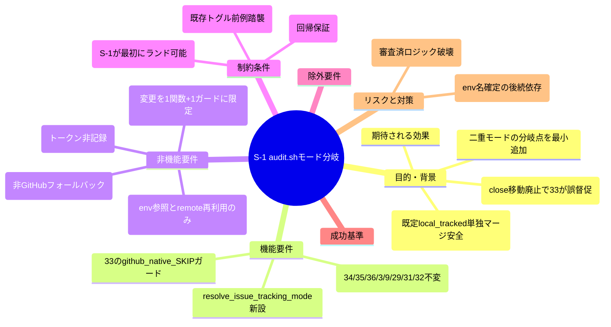
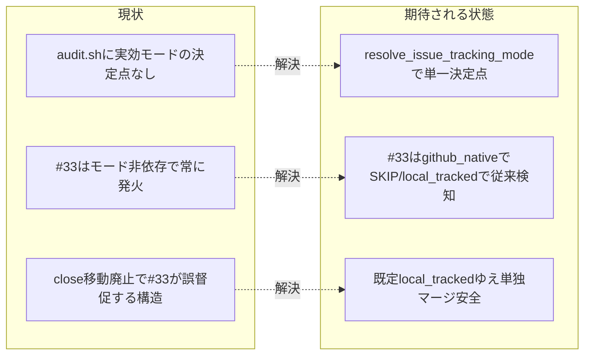

# 要求定義書: S-1 audit.sh モード分岐（resolve_issue_tracking_mode 新設＋#33 の github_native SKIP ガード）

**プロジェクト名**: S-1 audit.sh モード分岐（親: issue 運用ポリシーの GitHub Issue 中心への全面移行）
**作成日**: 2026 年 07 月 15 日
**最終更新**: 2026 年 07 月 15 日

> **重要**:
>
> - 要求定義書は、プロジェクトの全体像を把握するためのものです。詳細な技術仕様や実装方法は要件定義書以降で記載します。必要最低限の情報に収めることを心掛けてください。
> - **このドキュメントは常に更新**: 要求の変更や追加があった場合は、即座にこのドキュメントを更新してください。
> - **本 issue は親 issue「issue 運用ポリシーの GitHub Issue 中心への全面移行」（GitHub Issue #115）のサブ issue S-1** であり、`90_issues/` 配下に置かれる。GitHub Issue 起票ゲート（enforcement #34）の対象外＝**親 Issue #115 のチェックリスト／コメントに集約**する設計のため、本サブ issue には個別の `github_issue` を記載しない（起票しない）。
> - 本 issue は親 03_実装計画のタスク **T1** に対応し、親 02_設計の **ADR-1（二重モード方式）／ADR-2（実効モード解決規則・非 GitHub フォールバック）／ADR-4（入力源不変）／ADR-5（#33 のモード分岐）** を正確に引き継ぐ。方針の是非は親 issue で確定済みであり、本フェーズ（requirement-discovery）は S-1 単体の目的・制約・受け入れ基準・BDD の精緻化を行う。
>
> **用語**: [.agent-skill-chain/source/CONCEPTS.md §用語規約](../../../../../../.agent-skill-chain/source/CONCEPTS.md#用語規約) を参照。

---

## 要求定義の全体像

**注意**: マインドマップは全体像把握用であり、詳細は各セクションに記載する。

---

## 1. 目的・背景

### 1.1 目的（必須）

audit.sh に二重モードの分岐点（実効モード解決＋#33 の github_native SKIP）を最小追加する。

### 1.2 背景

- **現状の課題**:
  - 親 issue で「close 移動 PR 運用の廃止（GitHub Issue close で完結）」へ移行するが、audit.sh #33（`check_close_move_pending`）を存置したまま close 移動運用を止めると、verify-and-close 済み・未移動のトップレベル issue を #33 が猶予超過で永久に FAIL させ続ける（evidence_source: existing_code。audit.sh:1083-1087 の FAIL 条件）。
  - 一方で、GitHub Issue 運用を採用しない消費者環境（`git remote` に github.com を含まない環境）や既定の消費者では、#33 の close 移動検知は依然として必要であり、無条件に廃止できない（evidence_source: existing_code。audit.sh:1130-1131 の GitHub 採用判定シグナル）。
  - モードを切り替える単一の決定点（実効モード解決）が audit.sh に存在しないため、#33 が「github_native では SKIP、local_tracked では従来検知」という条件分岐を持てない。

- **必要性**:
  - 親 02_設計 ADR-1 は「新旧両方式をフル機能で残す二重モード方式（案 B・ユーザー明示訂正）」を採用しており、その強制層（audit.sh）に単一の決定点を先に用意する必要がある。
  - 実装順序（親 03 §1.2）は **S-1（安全な既定・audit.sh）→ S-3（source 契約）→ S-2（本リポ github_native 採用＝スイッチ投入）** であり、S-1 は既定 `local_tracked` ゆえ**単独マージしても既存挙動を一切変えない**（後続のスイッチ投入の前提となる強制層）。

### 1.3 期待される効果（必須: 1 件以上）

- **効果 1**: 実効モードが単一のヘルパー関数 `resolve_issue_tracking_mode` に集約され、`ISSUE_TRACKING_MODE` env と github.com remote 有無の 2 因子だけで決定論的に導出できる（○/× 判定: env×remote の 3 組合せで実効モード出力が一意に定まるか）。
- **効果 2**: github_native 実効時、close 未移動・猶予超過の issue があっても #33 が FAIL を出さない（○/× 判定: `ISSUE_TRACKING_MODE=github_native`＋github.com remote 下で #33 が SKIP し EXIT_CODE を上げないか）。
- **効果 3**: 既定（未設定＝local_tracked）では #33・#34/#35/#36・#3/#9/#29/#31/#32 の挙動が現状から一切変わらない（○/× 判定: 未設定で audit.sh を実行し、モード追加前後で PASS/FAIL が同値か＝回帰）。
- **効果 4**: 非 GitHub 環境・非 git ツリー・env 不明値ではすべて `local_tracked` へ倒れ、ロックアウトも github_native の誤発火も起こさない（○/× 判定: これらの入力で実効モードが `local_tracked` になるか）。

**現状と期待される状態の比較**:

---

## 2. 機能要件

### 2.1 既存機能の維持（該当する場合）

- **#34（GitHub Issue 起票記録検知）・#35（ブランチ紐づけ）・#36（PR↔Issue 紐づけ）は入力源・判定ロジックを一切変更しない**（親 ADR-4）。これらは find 走査でローカル 00 frontmatter を読む／PR_BODY 一次経路で判定する既存挙動を保つ（回帰保証が最重要）。
- **#3/#9/#29/#31/#32 も変更しない**。これらが非追跡化後もローカル pre-push（find 走査系）で機能する前提の「再確認」は行うが、S-1 でコードは触らない。
- #33 の既存ロジック（grandfather=`CLOSE_MOVE_GATE_EFFECTIVE_FROM`／grace=`CLOSE_MOVE_GRACE_DAYS`／`ts_to_epoch` 経過日数判定／04_review.md の find 走査／close・templates・90_issues 除外／FAIL メッセージ／`git mv` 非強制／Query のみで DB・FS へ書き込まない）は、SKIP ガードの追加を除いてすべて不変。

### 2.2 新規機能要件

1. **実効モード解決ヘルパー `resolve_issue_tracking_mode` の新設**: `ISSUE_TRACKING_MODE` env（値 `github_native` | `local_tracked`、既定 `local_tracked`）と `git -C "$PROJECT_ROOT" remote -v` の github.com 有無から実効モード文字列を stdout へ返す純関数（副作用なし・Query）。実効モード＝`(ISSUE_TRACKING_MODE == github_native) かつ (remote に github.com を含む)` のときのみ `github_native`、それ以外（未設定・不明値・非 git・非 GitHub）はすべて `local_tracked`（fail-safe・親 ADR-2）。
2. **#33（`check_close_move_pending`）への github_native SKIP ガード追加**: 関数先頭（既存の sqlite3/DB ガードと同位置）に「実効モードが github_native なら SKIP ログ＋`return 0`」を追加する。既存の `GITHUB_ISSUE_GATE_ENABLED` が最優先で SKIP する最優先ガード前例（evidence_source: existing_code。audit.sh:1118-1122）に倣う。local_tracked では現行どおり発火。
3. **関数冒頭コメント**: `resolve_issue_tracking_mode` と #33 の SKIP ガードに、親 ADR-2/ADR-5 参照とフォールバック理由（既定 local_tracked・非 GitHub 退避）を記載する。

---

## 3. 非機能要件

### 3.1 パフォーマンス

- 追加は「1 回の env 参照＋既存 `git remote -v` の再利用」のみで、audit.sh の実行時間への影響は無視できる（evidence_source: existing_code。#34 で既に `git remote -v` を評価済み・audit.sh:1131）。

### 3.2 セキュリティ

- `gh`/git 認証トークンの実値を成果物・memo・workflow.db・ログ・ドキュメント記載例に残さない（現行方針踏襲）。
- enforcement ゲート無効化 env と同様に、`ISSUE_TRACKING_MODE` を AI が自律設定してはならない（この原則の source 契約への明記は S-3 の T4 スコープ。S-1 はコードのみ）。

### 3.3 互換性

- 既定 `ISSUE_TRACKING_MODE` 未設定は `local_tracked` へ倒れ、既存消費者・既存挙動を一切変えない（後方互換・fail-safe）。
- 非 GitHub 環境（github.com remote なし）・非 git ツリーでは github_native 指定でも `local_tracked` へ退避し、ロックアウトしない（親 ADR-2・S8）。

### 3.4 保守性

- モード分岐を「単一ヘルパー＋#33 の 1 ガード」に集約し、審査済み audit.sh ロジックへの介入を最小化する（親 01 §3.4・spec/06 優先順位 1 可読性）。

---

## 4. 制約条件

### 4.1 技術的制約

- **既存トグル前例の踏襲**: 新設 env・SKIP ガードは既存 `GITHUB_ISSUE_GATE_ENABLED`（audit.sh:1118-1122）・`CLOSE_MOVE_GATE_EFFECTIVE_FROM` 等の命名・配置パターンに揃える（evidence_source: existing_code）。
- **GitHub 採用判定シグナルの再利用**: 実効モードの github.com 判定は #34 と同一の `git -C "$PROJECT_ROOT" remote -v | grep -q 'github\.com'` を用い、新規判定を作らない（evidence_source: existing_code。audit.sh:1131・親 ADR-2）。
- **Query 純粋性**: `resolve_issue_tracking_mode`・#33 は DB/FS へ一切書き込まない（既存 CQRS 設計踏襲）。
- **入力源不変**: #34/#35/#36 が読むローカル 00 frontmatter・PR_BODY への入力源変更は S-1 で行わない（親 ADR-4）。

### 4.2 既存システムとの互換性

- **回帰保証が最重要**: #34/#35/#36・#3/#9/#29/#31/#32 の PASS/FAIL がモード追加の前後で不変であることを、tmp 隔離（`mktemp -d`＋`git archive`）で検証する。
- local_tracked（既定）での #33 の FAIL 条件（verify-and-close 済み・未移動・猶予超過）が従来どおり再現することを保証する。

### 4.3 移行期間・スケジュール

- S-1 は親 03 §1.2 の依存順で**最初にランド可能**（先行なし）。既定 local_tracked ゆえ単独マージしても既存挙動を変えない。env 名の確定は後続 S-3（source 契約文言）・S-2（本リポ採用）が参照する。

---

## 5. 除外要件

- `.gitignore` による新規ドラフト非追跡化・`自己拡張ワークフロー.md` の両モード手順化・決定ログ新設・GitHub Issue Forms は **S-2 スコープ**（本 issue 対象外）。
- source 契約ドキュメント（`run_command.md`/CORE/PHASES/AGENT_CONDUCT）への `ISSUE_TRACKING_MODE` 追記・汎用雛形は **S-3 スコープ**（本 issue 対象外）。
- #36 二次 fail-safe の代替検知（ブランチ命名からの Issue 番号抽出等・新規 audit チェック）は本 issue では新設せず将来の別 issue へ申し送り（親 ADR-4 帰結）。
- github_native のアクティブ issue に対し feature-worktree の pre-push でも find 走査系を強制する代替（メイン tree pre-push 徹底・追跡 issue-index 導入）も本 issue で新設しない（親 ADR-3/ADR-4 帰結）。
- GitHub API 参照への付け替え（#34 を gh でリモート照会する案）は却下済み・対象外（親 ADR-4）。

---

## 6. 成功基準（必須: 1 件以上）

- **G1**: `resolve_issue_tracking_mode` が `ISSUE_TRACKING_MODE=github_native`＋github.com remote あり のとき `github_native` を返す（○/×）。
- **G2**: `resolve_issue_tracking_mode` が 未設定／不明値（例 `foo`）／`github_native` だが remote に github.com 無し／非 git ツリー のいずれでも `local_tracked` を返す（○/×・fail-safe 網羅）。
- **G3**: github_native 実効時、verify-and-close 済み・未移動・猶予超過の issue があっても #33 が SKIP して FAIL（EXIT_CODE=1）を出さない（○/×。親 S4 に対応）。
- **G4**: local_tracked 実効時（既定含む）、同条件で #33 が従来どおり FAIL する（○/×・回帰＝挙動不変）。
- **G5**: 同一 fixture で #34/#35/#36 の PASS/FAIL がモード追加の前後で不変（○/×・回帰。親 S6 に対応）。
- **G6**: 全検証が tmp 隔離（`mktemp -d`＋`git archive`）で行われ、本番自己インストールを伴わない（○/×）。

---

## 7. リスクと対策

### 7.1 技術的リスク

- **リスク**: SKIP ガード追加や関数新設が、審査済み #33 ロジック（grandfather/grace/FAIL 経路）や他 check を意図せず壊す。
  - **対策**: 変更を「純関数 1 つ＋#33 先頭の 1 ガード」に限定し、#34/#35/#36・#3/#29 の回帰テストで不変を保証する（親 03 §5）。
- **リスク**: 実効モード判定が非 GitHub 環境で github_native に誤って倒れ、#33 が誤 SKIP して close 未移動を見逃す（fail-open の過剰化）。
  - **対策**: 「env=github_native かつ github.com remote あり」の AND 条件を厳守し、片方でも欠ければ local_tracked（親 ADR-2）。非 git・不明値も local_tracked。バリデーションテストで網羅する。

### 7.2 スケジュールリスク

- **リスク**: S-1 で確定した env 名・既定値の文言と、後続 S-3（source 契約）・S-2（本リポ採用）の記述が乖離する。
  - **対策**: env 名 `ISSUE_TRACKING_MODE`・既定 `local_tracked`・値 `github_native`/`local_tracked` を S-1 で確定し、親 02/03 の記述と一致させる（後続はこれを参照）。

---

## 8. 参考資料

### プロジェクトドキュメント

- 親 issue（GitHub Issue **#115**）: `docs/maintainer/workflow/20260715_160558_issue運用ポリシー全面移行/` の [`00_要求定義.md`](../../00_要求定義.md) / [`01_要件定義.md`](../../01_要件定義.md) / [`02_設計.md`](../../02_設計.md)（ADR-1/ADR-2/ADR-4/ADR-5）/ [`03_実装計画.md`](../../03_実装計画.md)（T1）/ [`90_issues.md`](../../90_issues.md)（S-1）
- [`.agent-skill-chain/source/enforcement/ci/audit.sh`](../../../../../../.agent-skill-chain/source/enforcement/ci/audit.sh) - #33（`check_close_move_pending`・1055-1090）／#34 の GitHub 採用判定・トグル前例（1117-1131）／#35（1201-1249）／#36（1263-）

### その他の参考資料

- 本セッションでの親 issue 設計確認結果（ADR-1 の案 B は human_decision「B 案にします」）

---

## 9. 次のステップ

この要求定義書の承認後、以下のドキュメントを作成します：

- **次**: [`01_要件定義.md`](./01_要件定義.md) - 要件定義フェーズ
