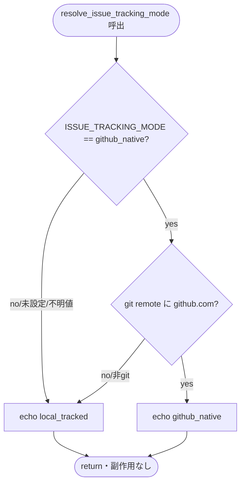
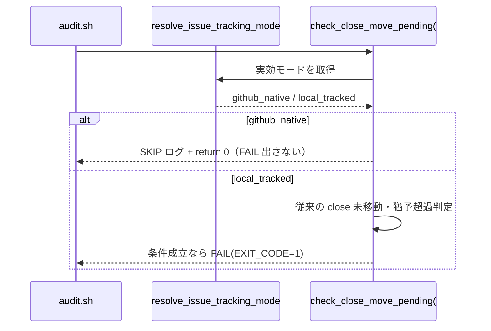

# 要件定義書: S-1 audit.sh モード分岐（resolve_issue_tracking_mode 新設＋#33 の github_native SKIP ガード）

**プロジェクト名**: S-1 audit.sh モード分岐（親: issue 運用ポリシーの GitHub Issue 中心への全面移行）
**作成日**: 2026 年 07 月 15 日
**最終更新**: 2026 年 07 月 15 日

> **重要**: **このドキュメントは常に更新**: 要件の変更や追加があった場合は、即座にこのドキュメントを更新してください。
>
> **本 issue は親 issue（GitHub Issue #115）のサブ issue S-1**（`90_issues/` 配下）であり、GitHub Issue 起票ゲート（enforcement #34）の対象外＝親 Issue #115 に集約する。参照元は親 02_設計 ADR-1/ADR-2/ADR-4/ADR-5 と親 03_実装計画 T1。
>
> **用語**: [.agent-skill-chain/source/CONCEPTS.md §用語規約](../../../../../../.agent-skill-chain/source/CONCEPTS.md#用語規約) を参照。

---

## 1. 概要

### 1.1 システム概要

本 issue は、親 issue「issue 運用ポリシーの GitHub Issue 中心への全面移行（二重モード方式）」の**強制層（audit.sh）を実装する最初のサブ issue（S-1・親タスク T1）**である。二重モード（`github_native` / `local_tracked`）の**単一の決定点**として純関数 `resolve_issue_tracking_mode` を audit.sh に新設し、`check_close_move_pending`（#33）に「実効モードが github_native なら早期 SKIP」ガードを追加する。**#34/#35/#36・#3/#9/#29/#31/#32 は一切変更しない**（回帰保証が最重要）。既定は後方互換の `local_tracked` に固定するため、S-1 は**単独マージしても既存挙動を変えない**（親 03 §1.2）。

**本フェーズ（requirement-discovery）のスコープ**: S-1 単体の目的・受け入れ基準・BDD の整理まで。audit.sh の具体改修コードは後続 design-feature / implement-feature（S-1 の当該フェーズ）で行い、本フェーズでは対象 audit.sh を**読解のみ**とする。方針の是非は親 issue で確定済み。

### 1.2 用語集

| 用語 | 説明 |
| ---- | ---- |
| 実効モード（effective mode） | `resolve_issue_tracking_mode` が返す最終的なモード文字列（`github_native` / `local_tracked`）。env 設定値そのものではなく、github.com remote 有無を加味した解決結果 |
| `ISSUE_TRACKING_MODE` | 二重モードの唯一の設定シグナル（env）。値 `github_native` / `local_tracked`、既定 `local_tracked` |
| `resolve_issue_tracking_mode` | audit.sh 内の純関数（Query・副作用なし）。env×remote から実効モードを stdout へ返す |
| #33（`check_close_move_pending`） | verify-and-close 済みだが close/ 未移動・猶予超過のトップレベル issue を検知する既存 audit チェック |
| fail-safe | 未設定・不明値・非 git・非 GitHub をすべて `local_tracked`（安全側・後方互換）へ倒す既定挙動 |
| 回帰（regression） | モード追加の前後で #34/#35/#36・#3/#9/#29/#31/#32・local_tracked の #33 の PASS/FAIL が同値であること |
| tmp 隔離 | `mktemp -d`＋`git archive` で本番から切り離した使い捨てリポジトリで検証すること（本番自己インストール禁止） |

---

## 2. 機能要件

### 2.1 ユーザーストーリー

#### ストーリー 1: 実効モードを単一ヘルパーで決定論的に解決する

- **As a** 配布物（audit.sh）の保守者
- **I want to** `ISSUE_TRACKING_MODE` env と github.com remote 有無の 2 因子だけから実効モードを 1 つのヘルパー関数で決定論的に導出したい
- **So that** 各 check がモード分岐を必要とするとき、深い分岐を作らず単一の決定点を参照できる

**受け入れ基準**:

- `resolve_issue_tracking_mode` が `ISSUE_TRACKING_MODE=github_native` かつ `git -C "$PROJECT_ROOT" remote -v` に github.com を含むとき、標準出力へ `github_native` を返す（G1）。
- 次のいずれでも `local_tracked` を返す（G2・fail-safe 網羅）: (a) `ISSUE_TRACKING_MODE` 未設定、(b) 不明値（例 `foo`）、(c) `github_native` だが remote に github.com 無し、(d) 非 git ツリー。
- 副作用なし（DB/FS へ書き込まない・Query）。github.com 判定は #34 と同一シグナル（`git remote -v | grep -q 'github\.com'`）を再利用し新規判定を作らない（evidence_source: existing_code。audit.sh:1131・親 ADR-2）。
- 関数冒頭コメントに親 ADR-2/フォールバック理由（既定 local_tracked・非 GitHub 退避）を記載する。

#### ストーリー 2: github_native では #33 が close 未移動を督促しない

- **As a** github_native を採用したリポジトリのオーナー
- **I want to** close 移動運用を廃止した後、verify-and-close 済み・未移動の issue を #33 が永久に FAIL させないようにしたい
- **So that** 「完了は GitHub Issue close で完結」という新方針と enforcement が矛盾しない

**受け入れ基準**:

- `check_close_move_pending`（#33）の先頭（既存 sqlite3/DB ガードと同位置）に「実効モードが github_native なら SKIP ログ＋`return 0`」を追加する（evidence_source: existing_code。`GITHUB_ISSUE_GATE_ENABLED` の最優先 SKIP 前例・audit.sh:1118-1122）。
- github_native 実効時、close 未移動・猶予超過の issue があっても #33 は FAIL（EXIT_CODE=1）を出さず SKIP する（G3・親 S4）。
- #33 の既存ロジック（grandfather=`CLOSE_MOVE_GATE_EFFECTIVE_FROM`／grace=`CLOSE_MOVE_GRACE_DAYS`／`ts_to_epoch`／04_review.md の find／close・templates・90_issues 除外／FAIL メッセージ／`git mv` 非強制／Query 純粋性）は SKIP ガード以外**すべて不変**。

#### ストーリー 3: 既定（local_tracked）で挙動が一切変わらない（回帰）

- **As a** 既存消費者（`ISSUE_TRACKING_MODE` を設定していない）・本リポの既存フロー
- **I want to** モード分岐の追加後も、既定では #33・#34/#35/#36・#3/#9/#29/#31/#32 の挙動が現状から一切変わらないでほしい
- **So that** S-1 を単独マージしても既存の PR フロー・enforcement を止めない

**受け入れ基準**:

- `ISSUE_TRACKING_MODE` 未設定（＝実効 local_tracked）で audit.sh を実行すると、#33 が従来どおり close 未移動・猶予超過を FAIL 検知する（G4・回帰）。
- 同一 fixture で #34/#35/#36 の PASS/FAIL がモード追加の前後で不変（G5・親 S6）。#34/#35/#36 のコード・入力源は変更しない（親 ADR-4）。
- #3/#9/#29/#31/#32 も変更せず、既存挙動を保つ。

#### ストーリー 4: 非 GitHub・異常入力でロックアウトも誤発火もしない

- **As a** 非 GitHub 消費者・一時障害環境
- **I want to** github_native 指定でも github.com remote が無い／非 git ツリーなら local_tracked へ退避してほしい
- **So that** 新方針が成立しない環境で #33 を誤って SKIP せず（close 検知を維持）、かつロックアウトもしない

**受け入れ基準**:

- 「env=github_native かつ github.com remote あり」の AND 条件を厳守し、片方でも欠ければ `local_tracked`（親 ADR-2）。
- 非 git ツリー・env 不明値・未設定はすべて `local_tracked`（例外・エラーを出さず安全側へ倒れる）。

### 2.2 BDD ユースケース

#### ユースケース 1: 実効モード解決（`resolve_issue_tracking_mode`）

env×remote の組合せで実効モードが一意に定まることを規定する（親 03 §2.1.4 の BDD を正本とし精緻化）。

**シナリオ 1: github_native かつ GitHub remote あり → github_native**

```gherkin
Feature: 実効モード解決
  Scenario: github_native かつ GitHub remote あり
    Given ISSUE_TRACKING_MODE=github_native である
    And git remote に github.com が含まれる
    When resolve_issue_tracking_mode を呼ぶ
    Then 標準出力に github_native を返す
    And DB・FS への書き込みは発生しない
```

**シナリオ 2: 既定（未設定）は local_tracked（後方互換）**

```gherkin
Feature: 実効モード解決
  Scenario: ISSUE_TRACKING_MODE 未設定
    Given ISSUE_TRACKING_MODE を設定しない
    When resolve_issue_tracking_mode を呼ぶ
    Then 標準出力に local_tracked を返す
```

**シナリオ 3: 不明値・非 GitHub・非 git は local_tracked（fail-safe）**

```gherkin
Feature: 実効モード解決
  Scenario Outline: fail-safe フォールバック
    Given <条件>
    When resolve_issue_tracking_mode を呼ぶ
    Then 標準出力に local_tracked を返す
    And 例外・エラーで停止しない

    Examples:
      | 条件 |
      | ISSUE_TRACKING_MODE=foo（不明値） |
      | ISSUE_TRACKING_MODE=github_native だが git remote に github.com が無い |
      | 非 git ツリーで実行する |
```

**処理フロー**:



#### ユースケース 2: #33 のモードガード

**シナリオ 4: github_native で #33 は SKIP（FAIL を出さない）**

```gherkin
Feature: #33 モードガード
  Scenario: github_native 実効時は close 未移動を督促しない
    Given ISSUE_TRACKING_MODE=github_native で git remote に github.com がある
    And verify-and-close 済み・close/ 未移動・猶予超過の issue が存在する
    When audit.sh を実行し #33 が評価される
    Then #33 は SKIP ログを出し return 0 する
    And EXIT_CODE は 1 に上がらない（FAIL を出さない）
```

**シナリオ 5: local_tracked（既定）で #33 は従来どおり検知（回帰）**

```gherkin
Feature: #33 モードガード
  Scenario: 既定は後方互換で従来検知
    Given ISSUE_TRACKING_MODE を設定しない（実効 local_tracked）
    And verify-and-close 済み・close/ 未移動・猶予超過の issue が存在する
    When audit.sh を実行し #33 が評価される
    Then #33 は従来どおり FAIL し EXIT_CODE=1 になる
    And grandfather/grace/FAIL メッセージ等の既存挙動は不変
```

**処理フロー**:



#### ユースケース 3: 他チェックの回帰（不変性）

**シナリオ 6: #34/#35/#36 はモード追加の前後で PASS/FAIL 不変**

```gherkin
Feature: 他チェックの回帰保証
  Scenario: モード追加が #34/#35/#36 を変えない
    Given 同一の tmp 隔離 fixture
    When モード分岐を追加した audit.sh と追加前の audit.sh をそれぞれ実行する
    Then #34/#35/#36 の PASS/FAIL 結果が両者で同値である
    And #34/#35/#36 の入力源（ローカル 00 frontmatter・PR_BODY）は変更されていない
```

### 2.3 ビジネスルール

- 実効モードは `resolve_issue_tracking_mode` の返り値を唯一の正とし、各 check は env を直接読まずヘルパーを参照する（単一責務・単一決定点）。
- github.com 有無の判定は #34 と同一シグナルを再利用し、二重定義を作らない（親 ADR-2）。
- `resolve_issue_tracking_mode`・#33 は Query に徹し DB/FS へ書き込まない（CQRS 踏襲）。
- #34/#35/#36・#3/#9/#29/#31/#32 は S-1 で変更しない（回帰の対象＝不変を保証すべき既存資産）。
- `ISSUE_TRACKING_MODE` を AI が自律設定してはならない（原則の source 契約明記は S-3 スコープ。S-1 はコードのみ）。
- 全検証は tmp 隔離（`mktemp -d`＋`git archive`）で行い、本番自己インストールを伴わない。

---

## 3. 非機能要件

### 3.1 パフォーマンス要件

- audit.sh への追加は「1 回の env 参照＋既存 `git remote -v` の再利用」のみで、実行時間への影響は無視できる（evidence_source: existing_code。#34 で remote を既に評価・audit.sh:1131）。

### 3.2 セキュリティ要件

- 認証トークンの実値を成果物・memo・workflow.db・ログ・ドキュメント記載例に残さない（現行踏襲）。
- `ISSUE_TRACKING_MODE` の AI 自律設定禁止原則は維持（明記は S-3）。

### 3.3 ユーザビリティ要件

- 実効モードが「1 つの env＋github.com remote 有無」の 2 因子で決定論的に説明できる（深い分岐を作らない・AI フレンドリー設計）。
- #33 の SKIP 時は理由が分かる SKIP ログを stderr へ出す（既存 SKIP ログの様式に倣う）。

### 3.4 可用性要件

- 非 GitHub 環境・非 git ツリー・env 不明値でロックアウトも黙認通過もせず、常に `local_tracked`（安全側）へ倒れる（親 ADR-2・9.2）。

---

## 4. 外部インターフェース要件

### 4.1 API 要件

- **env（入力）**: `ISSUE_TRACKING_MODE`（`github_native` | `local_tracked`、既定 `local_tracked`）。
- **関数（Query）**: `resolve_issue_tracking_mode()` → stdout に `github_native` / `local_tracked`、副作用なし。
- **関数（Query）**: `check_close_move_pending()`（#33）→ github_native で SKIP＋`return 0`、local_tracked で現行検知。
- `git -C "$PROJECT_ROOT" remote -v`（github.com 有無の判定・#34 と同一）。

### 4.2 データ形式要件

- 実効モード出力は小文字固定文字列 `github_native` / `local_tracked` のいずれか（下流の文字列比較を単純化）。
- 親 02/03 の記述（env 名・既定値・値集合）と S-1 実装を一致させる（S-3/S-2 が参照する正）。

---

## 5. 制約事項・未決事項（design-feature 以降で決着させる）

> **本節は identify-assumptions / define-constraints で洗い出した前提・制約・S-1 単体の未決事項を明示する。親 issue 全体の未決 Q1〜Q9 は親 01 §5 に集約済みで、本節は S-1 の実装に固有のものに限定する。**

### 5.1 前提（検証可能なもの / 仮定として置くもの）

- **前提 A（検証済）**: `resolve_issue_tracking_mode`・`ISSUE_TRACKING_MODE` は audit.sh に未実装で、新設が競合しない（本セッションで `grep` 確認済・observed_runtime）。
- **前提 B（検証済）**: #34 が `git -C "$PROJECT_ROOT" remote -v | grep -q 'github\.com'` で GitHub 採用を判定する既存実装が存在し、同一シグナルを再利用できる（evidence_source: existing_code。audit.sh:1131）。
- **前提 C（検証済）**: #33 は先頭に sqlite3/DB 不在の SKIP ガードを持ち、同位置に最優先ガードを足せる（evidence_source: existing_code。audit.sh:1056-1058／`GITHUB_ISSUE_GATE_ENABLED` の前例・:1118-1122）。
- **前提 D（仮定）**: 既定 `local_tracked` により S-1 単独マージは既存挙動を変えず安全（親 03 §1.2・§3.2）。回帰テストで裏取りする。

### 5.2 未決事項（design-feature で決着させる・S-1 固有）

- **q1（SKIP ガードの厳密な挿入位置）**: #33 先頭の既存 sqlite3/DB 不在 SKIP・`WORKFLOW_SCAN_DIRS` 空 SKIP と、新設 github_native SKIP の**評価順序**をどうするか（`GITHUB_ISSUE_GATE_ENABLED` は最優先＝DB ガードより前。github_native SKIP も最優先にするか、DB ガード後にするか）。挙動上はどちらでも FAIL は出ないが、SKIP ログの一貫性・可読性の観点で design-feature が確定する。
- **q2（SKIP ログ文言・番号表記）**: #33 SKIP ログの文言（既存 `SKIP: #33（...）をスキップします（...）` 様式に合わせるか、モード名を含めるか）。親 03 の BDD 例は `grep -q 'SKIP.*#33'` を用いるため、`#33` 文字列を SKIP ログに含める必要がある（design-feature でメッセージ確定）。
- **q3（resolve ヘルパーの配置箇所）**: audit.sh 内でヘルパー関数を定義する位置（他 check より前・共通ヘルパー領域）。既存 `ts_to_epoch` 等のヘルパー配置に倣う（design-feature で確定）。
- **q4（回帰テストの fixture 設計）**: #33 の FAIL を再現する fixture（verify-and-close 証跡入り workflow.db＋未移動 04_review.md＋grandfather cutoff 以降の issue basename）と、#34/#35/#36 を PASS/FAIL させる fixture を tmp 隔離でどう組むか（design-feature / implement-feature でテスト設計）。

### 5.3 矛盾点・要注意（非ブロッキング）

- **注意 1**: 親 ADR-3/ADR-4 は「github_native の非追跡ドラフトを feature-worktree から push すると find 走査系が fail-open（不検知）になる」root 条件付き前提を述べるが、これは S-2（`.gitignore` 非追跡化）以降で顕在化する挙動であり、**S-1（audit.sh コードのみ・既定 local_tracked）単体では発生しない**。S-1 は #33 のモード分岐に限定し、find 走査系のコードは触らないため、この非対称は S-1 の受け入れ基準には含めない（親 issue 全体の S6 として記録済み）。

---

## 6. 参考資料

### プロジェクトドキュメント

- [`00_要求定義.md`](./00_要求定義.md) - 本サブ issue の要求定義
- 親 issue（GitHub Issue **#115**）: [`../../02_設計.md`](../../02_設計.md)（ADR-1 二重モード／ADR-2 実効モード解決・非 GitHub フォールバック／ADR-4 入力源不変／ADR-5 #33 モード分岐・§3.1/§3.2）、[`../../03_実装計画.md`](../../03_実装計画.md)（T1・§2.1）、[`../../90_issues.md`](../../90_issues.md)（S-1）
- [`.agent-skill-chain/source/enforcement/ci/audit.sh`](../../../../../../.agent-skill-chain/source/enforcement/ci/audit.sh) - #33（1055-1090）／#34 の GitHub 判定・トグル前例（1117-1131）／#35（1201-1249）／#36（1263-）

### その他の参考資料

- [`.agent-skill-chain/source/RULES.md` テスト戦略必須要件](../../../../../../.agent-skill-chain/source/RULES.md#テスト戦略必須要件)・`TEST_BDD_FORMAT.md`（テスト BDD 形式）

---

## 7. 前のステップ

この要件定義書は、以下のドキュメントを基に作成されています：

- **前**: [`00_要求定義.md`](./00_要求定義.md) - 要求定義フェーズ

---

## 8. 次のステップ

この要件定義書の承認後、以下のドキュメントを作成します（**別フェーズ・別途委譲**）：

- **次**: [`02_設計.md`](./02_設計.md) - 設計フェーズ（§5.2 の q1〜q4 をここで決着させる）
