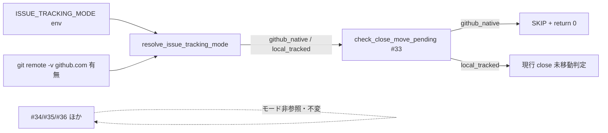
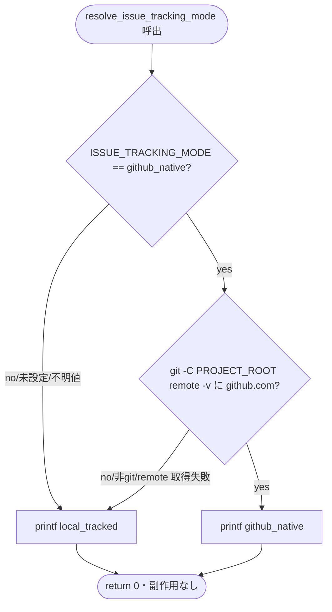

# 設計書: S-1 audit.sh モード分岐（resolve_issue_tracking_mode 新設＋#33 の github_native SKIP ガード）

**プロジェクト名**: S-1 audit.sh モード分岐（親: issue 運用ポリシーの GitHub Issue 中心への全面移行）
**作成日**: 2026 年 07 月 15 日
**最終更新**: 2026 年 07 月 15 日

> **重要**: **このドキュメントは常に更新**: 設計の変更や追加があった場合は、即座にこのドキュメントを更新してください。
>
> **本書の位置づけ**: 本書は S-1（親タスク T1）の design-feature フェーズ成果物であり、[`01_要件定義.md`](./01_要件定義.md) §5.2 の未決事項 q1〜q4 を ADR 形式で決着させる。方針の是非（二重モード方式・実効モード解決規則・入力源不変・#33 モード分岐）は親 02_設計（ADR-1/ADR-2/ADR-4/ADR-5）で確定済みであり、本書はそれを **S-1 のコードへ落とす具体化**に限定する。
>
> **用語**: [.agent-skill-chain/source/CONCEPTS.md §用語規約](../../../../../../.agent-skill-chain/source/CONCEPTS.md#用語規約) を参照。

---

## 1. 設計概要

### 1.1 設計方針

audit.sh に **単一の決定点**（純関数 `resolve_issue_tracking_mode`）を新設し、`check_close_move_pending`（#33）の**冒頭に 1 行のモードガード**を追加する。これ以外のコード（#34/#35/#36・#3/#9/#29/#31/#32・共通ヘルパー・呼び出し順）は**一切変更しない**。既定は後方互換の `local_tracked` に固定するため、S-1 は**単独マージしても既存挙動を変えない**（親 03 §1.2・親 ADR-1）。

**変更の総量（基本方針・親 ADR-5 の変更範囲最小化）**:

1. `resolve_issue_tracking_mode()` 関数の**新規追加**（純関数・Query・副作用なし）。
2. `check_close_move_pending()`（#33）**冒頭へガード 1 ブロック（早期 SKIP＋`return 0`）の挿入**。

既存行の**書き換え・削除は行わない**（挿入のみ）。

### 1.2 設計原則（本 issue で適用）

- **UNIX 哲学 / 変更範囲最小化**: 審査済み audit.sh ロジックを破壊せず、モード分岐を「1 ヘルパー＋#33 の 1 ガード」に集約する（既存 `GITHUB_ISSUE_GATE_ENABLED` トグル前例・audit.sh:1118-1122 に倣う）。
- **単一責務・単一決定点**: 実効モードの導出は `resolve_issue_tracking_mode` のみが担い、#33 はその返り値を参照するだけ（各 check が env を直接読まない）。
- **CQRS / Query 純粋性**: `resolve_issue_tracking_mode`・#33 は DB/FS へ一切書き込まない（既存設計踏襲）。
- **fail-safe（安全側）**: 未設定・不明値・非 git・非 GitHub はすべて `local_tracked` へ倒す（後方互換・ロックアウト回避・親 ADR-2）。
- **AI フレンドリー**: 実効モードを「1 つの env＋github.com remote 有無」の 2 因子だけで決定論的に説明できる（深い分岐を作らない）。

---

## 2. アーキテクチャ設計

### 2.1 責務・境界・参照関係

#### 2.1.1 責務一覧（S-1 スコープ）

| コンポーネント | 責務（1 文） | S-1 での変更 |
| -------------- | ------------ | ------------ |
| `ISSUE_TRACKING_MODE`（env・入力） | 二重モードの唯一の設定シグナル（`github_native` \| `local_tracked`、既定 `local_tracked`）。 | 新規参照（宣言不要・env 読取のみ） |
| `resolve_issue_tracking_mode()` | env×github.com remote 有無から実効モード文字列を stdout へ返す純関数（Query）。 | **新設** |
| `check_close_move_pending()`（#33） | 実効モードが github_native なら早期 SKIP、local_tracked なら現行どおり close 未移動を検知。 | 冒頭に**ガード 1 ブロック挿入** |
| `check_github_issue_before_implement()`（#34） | ローカル 00 frontmatter の github_issue 記録を検知（入力源・判定不変）。 | **不変** |
| `check_branch_linkage_before_implement()`（#35） | ローカル 00 frontmatter の branch 記録を検知（入力源・判定不変）。 | **不変** |
| `check_pr_issue_linkage()`（#36） | PR_BODY 一次経路で PR↔Issue 紐づけを検知（入力源・判定不変）。 | **不変** |
| `#3/#9/#29/#31/#32` ほか全 check | 既存の証跡・契約監査。 | **不変** |
| 共通ヘルパー（`ts_to_epoch`・`file_mtime_epoch`・`get_issue_mode`・`resolve_workflow_dirs`） | 既存ヘルパー群。 | **不変** |

#### 2.1.2 境界（S-1）

- **入力**: `ISSUE_TRACKING_MODE`（env・既定 `local_tracked`）、`git -C "$PROJECT_ROOT" remote -v`（github.com 有無）。既存 #33 が読む workflow.db・WORKFLOW_SCAN_DIRS 配下 04_review.md は不変。
- **出力**: `resolve_issue_tracking_mode` の stdout（`github_native` / `local_tracked`）、#33 の SKIP ログ（github_native 時）または現行 FAIL/PASS（local_tracked 時）。
- **他責務との境界（S-1 スコープ外＝触らない）**: `.gitignore` 非追跡化・`自己拡張ワークフロー.md` の手順・決定ログ・GitHub Issue Forms・source 契約文言（`ISSUE_TRACKING_MODE` の抽象原則追記）は **S-2/S-3** スコープ。S-1 は audit.sh のコードのみ。

#### 2.1.3 参照関係



- 単方向（設定 → 解決 → #33）。循環参照なし。#34/#35/#36 は `resolve_issue_tracking_mode` を参照しない（不変・親 ADR-4）。

### 2.2 実装対象コードの現況（実コード行番号引用・evidence_source: existing_code）

対象ファイル: `.agent-skill-chain/source/enforcement/ci/audit.sh`（全 1459 行）。S-1 で参照・改修する既存構造は次のとおり。

| 参照点 | 行番号 | 内容 |
| ------ | ------ | ---- |
| `PROJECT_ROOT` 設定 | `76` | `PROJECT_ROOT="${1:-.}"`。resolve の `git -C "$PROJECT_ROOT"` が依存する global（挿入位置より前に確定済み）。 |
| 共通ヘルパー領域（前方） | `153-182` | `ts_to_epoch`（153-167）・`file_mtime_epoch`（170-182）。汎用ヘルパー。 |
| `get_issue_mode` ヘルパー | `975-985` | **「消費者の直前に置く」ヘルパー配置前例**。#32（1000-）・#34（1158）が消費。→ q3 の配置根拠。 |
| #33 コメントブロック | `1045-1054` | `check_close_move_pending` の仕様コメント。 |
| #33 関数本体 | `1055-1090` | 冒頭 3 ガード（1056 sqlite3/DB・1057 workflow_log テーブル・1058 WORKFLOW_SCAN_DIRS 空）→ 本判定（1060-1089）。 |
| #34 の最優先トグル SKIP 前例 | `1118-1122` | `GITHUB_ISSUE_GATE_ENABLED` を**他のどのガードよりも先に**評価する `case ... return 0`。→ q1 の配置根拠。 |
| #34 の github.com 判定シグナル | `1131` | `git -C "$PROJECT_ROOT" remote -v 2>/dev/null \| grep -q 'github\.com'`。→ resolve が再利用する**同一シグナル**（親 ADR-2）。 |
| #34/#35/#36 本体 | `1117-1189` / `1201-1249` / `1263-1332` | 入力源（ローカル 00 frontmatter・PR_BODY）・判定ロジック。**S-1 では 1 行も変更しない**。 |
| check 呼び出し列 | `1443-1454` | 末尾の bare invocation 列。#33 は `1449` で呼ばれる。resolve は関数のため呼び出し列への追加は**不要**（#33 内部から呼ぶ）。 |

---

## 2.5 横断設計判断（ADR）— 01 §5.2 の q1〜q4 を決着

> 親 02_設計 ADR-1/ADR-2/ADR-4/ADR-5 で確定した方針を、S-1 のコード上の具体決定へ落とす。各 ADR は EVIDENCE_POLICY の様式（コンテキスト/選択肢/決定/根拠[evidence_source]/帰結）で記録する。

### ADR-S1-1（q1）: github_native SKIP ガードの挿入位置＝#33 冒頭・既存 DB ガードより前（最優先）

- **コンテキスト**: `check_close_move_pending`（#33）の冒頭には既存の 3 ガードがある——(1) sqlite3/DB 不在 SKIP（`1056`）、(2) workflow_log テーブル不在 SKIP（`1057`）、(3) `WORKFLOW_SCAN_DIRS` 空 `return 0`（`1058`）。新設の github_native SKIP をこれらの**前**に置くか**後**に置くかで、挙動は同値（いずれも `return 0` で FAIL を出さない）だが、SKIP ログの一貫性・意図の明瞭さが異なる（01 §5.2 q1）。
- **検討した選択肢**:
  1. **(a) 既存 DB ガードより前（冒頭第 1 ガード）**: `GITHUB_ISSUE_GATE_ENABLED` の最優先トグル前例（`1118-1122`）と同型。
  2. **(b) 既存 DB ガードの後**: sqlite3/DB/テーブル存在を確認してからモード判定。
- **決定**: **(a) 冒頭第 1 ガード（既存 DB ガードより前）**。`check_close_move_pending()` の関数本体の**最初の実行文**として、`resolve_issue_tracking_mode` の結果が `github_native` なら SKIP ログ＋`return 0` する。
- **根拠**: **evidence_source: existing_code**。(1) 最も近い構造的前例である #34 の `GITHUB_ISSUE_GATE_ENABLED` トグルは「最優先で評価する最初のガード」として DB ガードより前に置かれている（`1118-1122`、コメント「最優先で評価する最初のガード」）。#33 のモードガードも同じ「そのチェック自体を丸ごと無効化するゲート」であり、同一パターンに揃えるのが可読性（spec/06 優先順位 1）に適う。(2) 意味論的にも、github_native では #33 は **DB の有無に関わらず**恒久的に無効であるべきで、DB 不在という過渡的理由より「モードにより無効」という恒久的理由を先に示す方が SKIP ログの意図が明瞭（q2 と接続）。(3) github_native repo では workflow.db が CI クリーンチェックアウトで不在になりうる（audit.sh:186-198）ため、(b) だと「github_native なのに DB 不在 SKIP と報告される」 log 上の齟齬が生じうる。前置により常に mode 理由が出る。
- **帰結**: q1 決着。挿入は #33 関数本体の 1 行目（`1056` の直前）。既存 3 ガード（`1056-1058`）およびそれ以降のロジックは**位置も内容も不変**（前方に 1 ブロック挿入するのみ）。local_tracked では新ガードを素通りし、既存 3 ガード→本判定へ現行どおり到達する（回帰＝挙動不変）。

### ADR-S1-2（q2）: SKIP ログ文言＝既存 `SKIP: #33（…）をスキップします（…理由…）` 様式＋モード名明記

- **コンテキスト**: 親 03 の #33 BDD 例および本 issue の BDD は `grep -q 'SKIP.*#33'`（`SKIP` と `#33` を含む行の存在）で github_native SKIP を検証する。したがって新ガードの SKIP ログは **`SKIP` と `#33` の両リテラルを含む**必要がある。また既存 #33 の SKIP ログ（`1056-1057`）は `SKIP: #33（close ディレクトリ移動状況の検知）をスキップします（<理由>）` 様式である（01 §5.2 q2）。
- **検討した選択肢**: (i) 既存様式に完全準拠し括弧内理由をモード名にする／(ii) 独自様式で `[audit] SKIP github_native ...` のような別書式にする。
- **決定**: **(i)**。次の 1 行を stderr へ出力する（`>&2`）:
  ```
  SKIP: #33（close ディレクトリ移動状況の検知）をスキップします（実効モードが github_native のため。ISSUE_TRACKING_MODE=github_native かつ github.com remote 検出・02_設計 ADR-5/ADR-S1-2）
  ```
- **根拠**: **evidence_source: existing_code**。(1) 既存 #33 の 2 つの SKIP ログ（`1056`「…をスキップします（workflow.db 不在または sqlite3 不在）」/`1057`「…（workflow_log テーブル不在）」）と同一の接頭辞・語順・全角括弧様式に揃えることで、SKIP ログの読み手が理由だけを差分として読める。(2) `SKIP` と `#33` を含むため BDD の `grep -q 'SKIP.*#33'` を満たす。(3) 括弧内にモード名と 2 因子（env＝github_native・remote 検出）を書くことで、なぜ SKIP したかが log 単体で追える（可用性要件 3.3）。
- **帰結**: q2 決着。ログは stderr（既存 SKIP ログと同じストリーム）。ROLLBACK_MSG は**出さない**（SKIP は差し戻し対象ではないため。既存 SKIP ログも ROLLBACK_MSG を伴わない）。

### ADR-S1-3（q3）: `resolve_issue_tracking_mode` の配置＝#33 コメントブロックの直前（消費者隣接・`get_issue_mode` 前例）

- **コンテキスト**: 新設ヘルパーを audit.sh のどこに定義するか。候補は (A) 前方の汎用ヘルパー領域（`ts_to_epoch` 付近・`182` 直後）、(B) 唯一の消費者 #33 の定義直前（`1045` の直前）（01 §5.2 q3）。
- **検討した選択肢**:
  1. **(A) 前方共通ヘルパー領域**: `ts_to_epoch`(153)/`file_mtime_epoch`(170) の並びに追加。
  2. **(B) 消費者 #33 の直前**: `get_issue_mode`(975-985) が唯一の消費者 #32(1000-) の直前に置かれている前例に倣う。
- **決定**: **(B) #33 コメントブロック（`1045`）の直前に定義**（新ヘルパーのコメント＋関数本体を挿入し、その直後に既存 #33 コメント `1045` が続く）。
- **根拠**: **evidence_source: existing_code**。(1) `get_issue_mode`（`975-985`）は、モード信号を読む専用ヘルパーを**その最初の消費者（#32）の直前**に置く既存パターンであり、`resolve_issue_tracking_mode` も「モード信号を解決する専用ヘルパー・唯一の消費者は #33」で完全に同型。前例に一致させることで診断（どのチェックが使うか）が局所化される。(2) 汎用領域(A)へ置くと、`ts_to_epoch` 等の「複数チェックが使う汎用ユーティリティ」と、「#33 専用のモード解決」という責務差が混ざり可読性が落ちる。(3) `resolve` は `PROJECT_ROOT`（`76` で確定）のみに依存し、`1045` 時点では確実に定義済みのため、この位置で機能上の問題はない。bash は関数を呼び出し時に解決するため、呼び出し（#33 内部・実行は末尾 `1449`）より前に定義されていれば十分で、(B) はそれを満たす。
- **帰結**: q3 決着。差分は「`1045` 直前への新ヘルパー挿入」＋「#33 冒頭ガード挿入」の 2 箇所の**連続した挿入**に収まり、変更が近接して読める。

### ADR-S1-4（q4）: 回帰テスト fixture 設計＝tmp 隔離（`mktemp -d`＋`git archive`）＋モード env スイープ＋差分スコープ静的検査

- **コンテキスト**: (1) `resolve` の純関数単体（env×remote 3 組合せ＋非 git）、(2) #33 の github_native SKIP / local_tracked FAIL、(3) #34/#35/#36 の**モード追加前後で不変**——を本番自己インストールなしに検証する fixture をどう組むか（01 §5.2 q4）。
- **検討した選択肢**: (a) 本番リポで直接 audit.sh を叩く／(b) `mktemp -d` に `git archive | tar -x` で使い捨てリポを作り、そこに最小 fixture を組んで audit.sh を実行する。
- **決定**: **(b)**。加えて (i) `resolve` は audit.sh から関数定義だけを `awk` 抽出して source する単体テスト、(ii) #33/#34/#35/#36 は使い捨てリポで audit.sh を**モード env を変えて複数回実行**し stderr の該当 FAIL/SKIP 行の有無を突合、(iii) 変更が #34/#35/#36/#3/#9/#29/#31/#32 の行に及んでいないことを `git diff` の**スコープ静的検査**で担保、の 3 層で構成する。
- **根拠**: **evidence_source: existing_code / project 規約**。(1) `自己拡張ワークフロー.md §テストの tmp 隔離`・親 02 §6・本 issue 制約 4.2/6 が tmp 隔離（`mktemp -d`＋`git archive`）を必須化。(2) audit.sh はトップレベルで全 check を実行して `exit`（`1443-1459`）するため source すると全走査が走る。純関数のみを検証するには**関数定義だけを抽出して source** する必要がある（`awk '/^resolve_issue_tracking_mode\(\) \{/,/^\}/'`。resolve のトップレベル閉じ括弧は 1 つのみで、内側は `fi` 終端のため誤マッチしない）。(3) 「#34/#35/#36 がモードに影響されない」ことは、**同一 fixture で `ISSUE_TRACKING_MODE` を github_native / 未設定 / local_tracked / 不明値 と変えても #34/#35/#36 の FAIL 行が完全一致する**ことで直接立証できる（旧版スクリプトを別途走らせる必要がない）。加えて `git diff main` が resolve 追加と #33 ガード以外の行に触れていないことを機械検査して二重に担保する。
- **帰結**: q4 決着。具体 fixture 構成・アサーション・BDD は [`03_実装計画.md`](./03_実装計画.md) §テスト観点/§BDD に記述する。EXIT_CODE 総体ではなく**該当 SKIP/FAIL 行文字列の有無**でアサートし、他チェックの副次 FAIL がテスト判定を汚染しないようにする。

---

## 3. 機能設計

### 3.1 機能 1: 実効モード解決（`resolve_issue_tracking_mode`）

#### 3.1.1 処理フロー



#### 3.1.2 入力・出力・契約

- **入力**: env `ISSUE_TRACKING_MODE`（未設定可）、`git -C "$PROJECT_ROOT" remote -v`。
- **出力**: stdout に `github_native` または `local_tracked`（改行付き 1 行）。**常に `return 0`**（例外・非ゼロ終了を出さない）。
- **副作用**: なし（DB/FS へ書き込まない・Query・CQRS 踏襲）。
- **fail-safe**: `ISSUE_TRACKING_MODE != github_native`（未設定・不明値含む）→ `local_tracked`。`== github_native` かつ remote に github.com が**無い/非 git/remote 取得失敗** → `local_tracked`。両条件成立時のみ `github_native`（親 ADR-2 の AND 条件）。

#### 3.1.3 実装スケッチ（実装は implement-feature）

```bash
# 実効モード解決（02_設計 ADR-2/ADR-5・ADR-S1-3）。純関数/Query・副作用なし。
# 既定 local_tracked（fail-safe・後方互換）。ISSUE_TRACKING_MODE=github_native かつ
# git remote に github.com を含むときのみ github_native を返す。未設定・不明値・非 git・
# 非 GitHub はすべて local_tracked（ロックアウト・非追跡データ消失の回避）。github.com 判定は
# #34（GitHub 採用判定・audit.sh:1131）と同一シグナルを再利用し新規判定を作らない。
resolve_issue_tracking_mode() {
  if [[ "${ISSUE_TRACKING_MODE:-}" != "github_native" ]]; then
    printf '%s\n' "local_tracked"; return 0
  fi
  if git -C "$PROJECT_ROOT" remote -v 2>/dev/null | grep -q 'github\.com'; then
    printf '%s\n' "github_native"; return 0
  fi
  printf '%s\n' "local_tracked"
}
```

- `set -e`（`75`）の下でも安全: 分岐条件はすべて `if` 内（パイプ・`git`/`grep` の非ゼロは条件評価として吸収され致命化しない）。既存 `1131` が同一パターン（`if ! git ... | grep -q ...`）で実証済み。`set -o pipefail` は設定されていない（`75` は `set -e` のみ）。

### 3.2 機能 2: #33 のモードガード

#### 3.2.1 実装スケッチ（implement-feature が `check_close_move_pending()` 冒頭＝現 `1056` 直前へ挿入）

```bash
check_close_move_pending() {
  # 0. モードガード（最優先・02_設計 ADR-5/ADR-S1-1）: 実効モードが github_native なら
  #    close 移動運用は廃止済みのため本チェックを丸ごと SKIP する。GITHUB_ISSUE_GATE_ENABLED
  #    の最優先トグル前例（audit.sh:1118-1122）と同型で、既存 DB ガードより前に置く。
  if [[ "$(resolve_issue_tracking_mode)" == "github_native" ]]; then
    echo "SKIP: #33（close ディレクトリ移動状況の検知）をスキップします（実効モードが github_native のため。ISSUE_TRACKING_MODE=github_native かつ github.com remote 検出・02_設計 ADR-5/ADR-S1-2）" >&2
    return 0
  fi
  if ! command -v sqlite3 >/dev/null 2>&1 || [[ ! -f "$WF_DB" ]]; then ... # 既存 1056 以降は不変
```

#### 3.2.2 入力・出力

- **入力**: `resolve_issue_tracking_mode` の結果。
- **出力**: github_native → SKIP ログ（stderr・ADR-S1-2）＋`return 0`（`EXIT_CODE` を上げない）。local_tracked → 既存判定（`1056` 以降）へ現行どおり到達。

---

## 4. 変更対象ファイル（実装タスクの起点・実施は implement-feature）

| ID | 対象 | 変更内容 | 影響行（既存） |
| -- | ---- | -------- | ------------- |
| C1 | `.agent-skill-chain/source/enforcement/ci/audit.sh` | `resolve_issue_tracking_mode()` を #33 コメントブロック（現 `1045`）の直前へ新規挿入（ADR-S1-3）。 | 挿入のみ（既存行の書換なし） |
| C2 | 同上 | `check_close_move_pending()` 冒頭（現 `1056` 直前）へ github_native SKIP ガードを挿入（ADR-S1-1/S1-2）。 | 挿入のみ（既存 `1056-1090` は不変） |

**触らないもの（回帰対象）**: #34（`1117-1189`）／#35（`1201-1249`）／#36（`1263-1332`）／#3（`290-309`）／#9（`432-453`）／#29（`880-`）／#31（`919-`）／#32（`1000-`）／共通ヘルパー／末尾 check 呼び出し列（`1443-1454`）。

---

## 5. API 設計（契約）

| 契約 | 種別 | 説明 |
| ---- | ---- | ---- |
| `ISSUE_TRACKING_MODE` | env（入力） | `github_native` \| `local_tracked`（既定 `local_tracked`）。それ以外の値は不明値＝`local_tracked` 扱い。 |
| `resolve_issue_tracking_mode()` | 関数（Query） | 実効モード文字列（`github_native`/`local_tracked`）を stdout に返す。常に `return 0`・副作用なし。 |
| `check_close_move_pending()`（#33） | 関数（Query） | github_native で SKIP＋`return 0`（ADR-S1-2 の SKIP ログ）、local_tracked で現行検知。 |

**契約違反時の扱い**: env 不明値 → `local_tracked`（fail-safe）。github_native 指定だが非 GitHub/非 git → `local_tracked`（ロックアウト回避・親 ADR-2）。#33 は github_native で必ず SKIP（FAIL を出さない・親 S4）。

---

## 6. テスト戦略

テスト観点の正本は [RULES.md テスト戦略必須要件](../../../../../../.agent-skill-chain/source/RULES.md#テスト戦略必須要件)、BDD 形式は [TEST_BDD_FORMAT.md](../../../../../../.agent-skill-chain/source/TEST_BDD_FORMAT.md)。本 issue は audit.sh（bash）のみが対象で DB/UI/HTTP API は無い。テストは **tmp 隔離（`mktemp -d`＋`git archive`）必須**（ADR-S1-4）。具体 fixture・BDD・アサーションは [`03_実装計画.md`](./03_実装計画.md)。

### 6.1 対象ごとのテスト割り当て

| 対象 | 単体 | 結合 | クリティカル観点 | バリデーション観点 |
| ---- | ---- | ---- | ---------------- | ------------------ |
| `resolve_issue_tracking_mode` | ○ | × | env×remote 3 組合せで実効モードが決定論的（G1/G2） | 不明値/未設定/非 git → local_tracked |
| #33 モードガード | ○ | ○ | github_native で SKIP・local_tracked で従来 FAIL 維持（G3/G4） | resolve との結線・SKIP ログに `#33` を含む |
| #34/#35/#36 不変性 | ○ | ○ | モード env を変えても FAIL 行が完全一致（G5・回帰） | 入力源（00 frontmatter・PR_BODY）不変 |
| 変更スコープ | ○ | × | `git diff` が resolve 追加＋#33 ガード以外に及ばない | #34-#36/#3/#9/#29/#31/#32 の行が無変更 |

---

## 7. セキュリティ設計

- `gh`/git 認証トークンの実値を成果物・memo・workflow.db・ログ・fixture・記載例に残さない（現行踏襲）。fixture の remote は `https://github.com/example/repo.git` のダミーを用い、認証を伴わない（`git remote add` のみで fetch しない）。
- `ISSUE_TRACKING_MODE` を AI が自律設定してはならない原則は維持（source 契約への明記は S-3 スコープ。S-1 はコードのみ）。

---

## 8. 非機能要件への対応

- **パフォーマンス**: 追加は「1 回の env 参照＋既存 `git remote -v` の再利用」のみ。実行時間への影響は無視できる（#34 が既に remote を評価・`1131`）。
- **可用性**: 非 GitHub・非 git・不明値で常に `local_tracked`（安全側）へ倒れ、ロックアウトも github_native 誤発火も起こさない（親 ADR-2）。
- **保守性**: モード分岐を「単一ヘルパー＋#33 の 1 ガード」に集約し、審査済み audit.sh への介入を最小化（挿入のみ・既存行不変）。

---

## 9. 参考資料

- [`00_要求定義.md`](./00_要求定義.md) / [`01_要件定義.md`](./01_要件定義.md)
- 親 issue（GitHub Issue **#115**）: [`../../02_設計.md`](../../02_設計.md)（ADR-1/ADR-2/ADR-4/ADR-5・§3.1/§3.2）／[`../../03_実装計画.md`](../../03_実装計画.md)（T1）／[`../../90_issues.md`](../../90_issues.md)（S-1）
- [`.agent-skill-chain/source/enforcement/ci/audit.sh`](../../../../../../.agent-skill-chain/source/enforcement/ci/audit.sh)（#33=1045-1090／#34 トグル前例=1118-1122／#34 remote 判定=1131／get_issue_mode 配置前例=975-985）
- [`.agent-skill-chain/source/EVIDENCE_POLICY.md`](../../../../../../.agent-skill-chain/source/EVIDENCE_POLICY.md)

---

## 10. 前のステップ / 次のステップ

- **前**: [`01_要件定義.md`](./01_要件定義.md)
- **次**: [`03_実装計画.md`](./03_実装計画.md)。本書完了後、implement-feature 着手前に **review-docs（実装前ドキュメントレビュー）を必須**で経ること。
