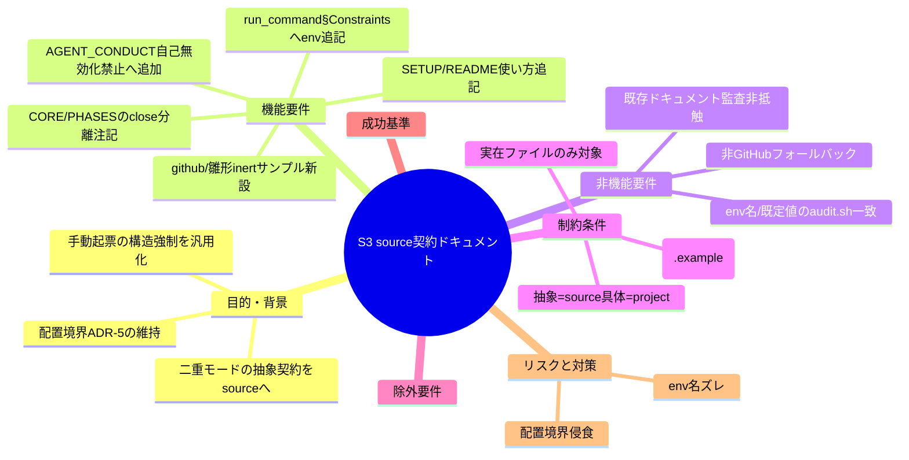
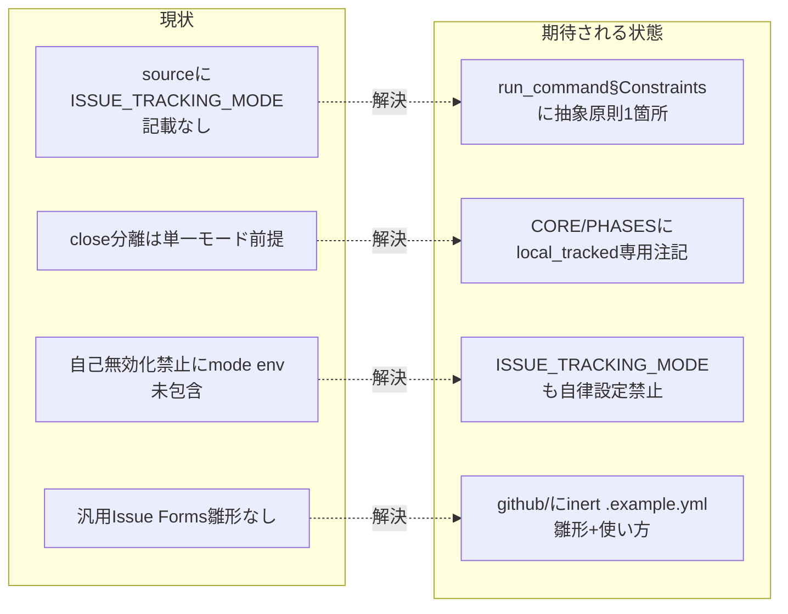

# 要求定義書: S-3 source 契約ドキュメント（ISSUE_TRACKING_MODE 抽象原則＋汎用 Issue Forms 雛形）

**プロジェクト名**: S-3 source 契約ドキュメント
**作成日**: 2026 年 07 月 15 日
**最終更新**: 2026 年 07 月 15 日

> **重要**:
>
> - 本書は親 issue「issue 運用ポリシーの GitHub Issue 中心への全面移行（二重モード方式）」（GitHub Issue #115）のサブ issue **S-3** の requirement-discovery 成果物である。親の 03_実装計画 §2.3 タスク **T4** と §2.4 タスク **T6** を出発点に、要求・受け入れ基準・BDD を精緻化する。
> - `90_issues/` 配下のサブ issue のため GitHub Issue 起票ゲート対象外（親 #115 に集約）。個別 Issue は作成しない。
> - **このドキュメントは常に更新**: 要求の変更や追加があった場合は、即座にこのドキュメントを更新すること。
>
> **用語**: [.agent-skill-chain/source/CONCEPTS.md §用語規約](../../../../../../.agent-skill-chain/source/CONCEPTS.md#用語規約) を参照。

---

## 要求定義の全体像

**注意**: マインドマップは全体像把握用であり、詳細は各セクションに記載する。

---

## 1. 目的・背景

### 1.1 目的（必須）

source 契約に二重モードの抽象原則を追記し汎用 Issue Forms 雛形を新設する。

### 1.2 背景

- **現状の課題**:
  - 親 issue は二重モード（`ISSUE_TRACKING_MODE`＝`github_native` / `local_tracked`）を導入する。S-1 で強制層（audit.sh のヘルパー `resolve_issue_tracking_mode` ＋ #33 のモードガード）は実装済み（マージ待ち PR #116。evidence_source: existing_code。S-1 worktree の `audit.sh:1050-1057`・`1071-1075`）。しかし配布物 `.agent-skill-chain/source/` の**契約ドキュメント側**には、この二重モードの存在・既定値・フォールバック・close 分岐・AI 自律設定禁止という**抽象原則**がまだ記載されていない。
  - source の各契約（`run_command.md` §Constraints の 3 ゲート・`CORE.md`／`PHASES.md` の close 分離・`AGENT_CONDUCT.md` の自己無効化禁止）は現状 `ISSUE_TRACKING_MODE` を知らないため、消費者・エージェントが source だけを読んでも「起票＝確定・close 移動廃止・非追跡ドラフト」という新方式の存在を把握できない（evidence_source: existing_code。source 4 ファイルに env 名が出現しないことを本セッションで確認）。
  - github_native 採用時、AI 起票（`gh issue create --body`）には親 02 §3.3.2 の完全転記テンプレートがあるが、オーナーの GitHub Web UI 手動起票には構造強制がない。消費者が汎用にコピーして使える Issue Forms 雛形が source 側に存在しない（evidence_source: existing_code。`.agent-skill-chain/source/enforcement/github/` ディレクトリ自体が未存在）。

- **必要性**:
  - S-1（安全な既定）→ **S-3（契約）** → S-2（本リポ採用＝スイッチ投入）の依存順（親 03 §1.2）で、S-2 のスイッチ投入前に source 側の抽象契約を整えておく必要がある。契約が無いまま本リポを github_native へ切り替えると、配布物の抽象層と本リポ固有具体層の整合が取れない。
  - 配置境界原則（ADR-5 前例：抽象＝source／具体＝project）を維持したまま、本リポ固有の具体手順（実効モード固定・body テンプレートの実文言）は project 側 `自己拡張ワークフロー.md`（S-2 で改訂）へ委譲し、source には抽象原則のみを置く必要がある。

### 1.3 期待される効果（必須: 1 件以上）

- **効果 1**: source 契約だけを読んで `ISSUE_TRACKING_MODE` の存在・既定 `local_tracked`・非 GitHub フォールバックを把握できる（○/× 判定: `run_command.md` §Constraints を grep して `ISSUE_TRACKING_MODE` と `local_tracked` が 1 箇所記載され、具体手順が project へリンク委譲されているか）。
- **効果 2**: 「close 移動は local_tracked 専用・github_native は GitHub Issue close で完結」という抽象注記が close 分離の正本（CORE）と本体（PHASES）に入る（○/× 判定: 両ファイルの close 分離／移動節にモード注記があるか）。
- **効果 3**: `ISSUE_TRACKING_MODE` の AI 自律設定が禁止される（○/× 判定: `AGENT_CONDUCT.md` の自己無効化禁止の対象に `ISSUE_TRACKING_MODE` が含まれるか）。
- **効果 4**: 消費者が自リポへコピーして手動起票を構造強制できる汎用 Issue Forms 雛形が用意される（○/× 判定: `source/enforcement/github/` に inert な `.example.yml` 雛形が新設され、SETUP/README に使い方が追記されているか）。

**現状と期待される状態の比較**:

---

## 2. 機能要件

### 2.1 既存機能の維持（該当する場合）

- `run_command.md` §Constraints の既存 3 ゲート（GitHub Issue 起票ゲート・ブランチ紐づけゲート・PR 紐づけゲート）の記述は**変更せず維持**する。`ISSUE_TRACKING_MODE` の追記はこれらと**非交差の独立項目**として足す。
- `CORE.md`／`PHASES.md` の close 分離のライフサイクル定義・「1 ファイル 1 責務」構造は維持する。追記は抽象注記のみ。
- `AGENT_CONDUCT.md` の自己無効化禁止の既存 env 列挙（`*_GATE_ENABLED` 系・`*_GATE_EFFECTIVE_FROM` 系）は維持し、`ISSUE_TRACKING_MODE` を対象に**追加**する。

### 2.2 新規機能要件

1. **run_command §Constraints への `ISSUE_TRACKING_MODE` 抽象原則追記（T4）**: 既定 `local_tracked`・`github_native` との二値・非 GitHub は local_tracked へフォールバック・close 移動は local_tracked 専用・AI 自律設定禁止、を**抽象原則**として追記し、具体手順（本リポ実効モード固定・body テンプレートの実文言）は project（`自己拡張ワークフロー.md`）へリンク委譲する。
2. **CORE §完了 issue の close 分離／PHASES §完了 issue の close 移動 への抽象注記（T4）**: 「close 移動（`git mv`）は local_tracked 専用。github_native では close 移動 PR を行わず GitHub Issue の close で完結する」旨をコア抽象側に注記する。
3. **AGENT_CONDUCT §自己無効化禁止への `ISSUE_TRACKING_MODE` 追加（T4）**: モード切替 env も AI が自律的に設定・変更してはならない対象へ含める（本文＋サブエージェント向け凝縮版の双方）。
4. **source 汎用 Issue Forms 雛形の新設（T6）**: `.agent-skill-chain/source/enforcement/github/` を新設し、GitHub Issue Forms の inert サンプル（`.example.yml`）を置く。フィールドは親 02 §3.3.2 と一致（目的／成功基準／受け入れ基準を `required: true` の `textarea`、全体像・フロー／参照は `required: false`）。消費者が自リポ `.github/ISSUE_TEMPLATE/` へコピーして使う。
5. **SETUP.md／enforcement/README.md への雛形記述追記（T6）**: 雛形の存在・コピー先・使い方を、既存の `orchestrator-allowlist.example.txt` の記述（SETUP.md §157-158・README.md §148）に倣って追記する。
6. **抽象／具体の二重記載回避**: 原則＝source、具体手順＝project（`自己拡張ワークフロー.md`）。同一内容を両側へ二重記載しない（配置境界＝ADR-5 前例）。

---

## 3. 非機能要件

### 3.1 パフォーマンス

- 特筆すべき性能要件はない（ドキュメント・inert 雛形のみ）。雛形は enforcement/audit.sh・フックから読まれない不活性ファイルであり、実行時間に影響しない。

### 3.2 セキュリティ

- `ISSUE_TRACKING_MODE` を含む enforcement 関連 env の AI 自律設定を禁止する（自己バイパス防止）。雛形・記述例にトークン実値・認証情報を残さない（親 02 §8 踏襲）。

### 3.3 互換性

- source（配布物）を改変するため、GitHub Issue を採用しない消費者環境（`git remote` に github.com を含まない環境）でロックアウトしないこと。抽象原則は「既定 `local_tracked`・非 GitHub は local_tracked へフォールバック」を明記し、非 GitHub 環境で新方式を強制しない。
- 追記文言の env 名（`ISSUE_TRACKING_MODE`）・既定値（`local_tracked`）は S-1 実装（`resolve_issue_tracking_mode`）と**厳密一致**させること（乖離すると契約とコードが食い違う）。

### 3.4 保守性

- 二重記載を避け（抽象＝source／具体＝project）、変更点を最小化する。既存 3 ゲート・close 分離の構造を破壊しない。
- 雛形は `.example.` 命名の inert サンプルとし、`orchestrator-allowlist.example.txt` と同格の「コピーして使う雛形」パターンで一貫させる。

---

## 4. 制約条件

### 4.1 技術的制約

- **対象は実在ファイルのみ**（本セッションで存在確認済み・evidence_source: existing_code）:
  - `.agent-skill-chain/source/skills/agent/run_command.md`（§Constraints・既存 3 ゲート）
  - `.agent-skill-chain/source/boot/CORE.md`（§完了 issue の close 分離・宣言）
  - `.agent-skill-chain/source/workflow/PHASES.md`（§完了 issue の close 移動・ライフサイクル本体）
  - `.agent-skill-chain/source/AGENT_CONDUCT.md`（§enforcement ゲートの自己無効化禁止＋サブエージェント向け凝縮版）
  - `.agent-skill-chain/source/SETUP.md`（§orchestrator allowlist の project 拡張・雛形記述の前例）
  - `.agent-skill-chain/source/enforcement/README.md`（allowlist 雛形記述の前例）
  - 新設: `.agent-skill-chain/source/enforcement/github/`（ディレクトリごと新規）
- **配置境界（ADR-5 前例）**: source 側は**抽象原則のみ**。本リポ固有の実効モード固定・body テンプレートの実文言などの具体手順は project（`自己拡張ワークフロー.md`）に committed 済み（S-2 で改訂）であり、source へ重複させない。
- **env 名・既定値の一致**: S-1 実装の `resolve_issue_tracking_mode`（env `ISSUE_TRACKING_MODE`・既定 `local_tracked`・値 `github_native`）と文言を一致させる。
- **雛形は inert**: `.example.yml` 命名で、enforcement・audit.sh・フックから読まれない不活性サンプルとする（`orchestrator-allowlist.example.txt` 前例）。

### 4.2 既存システムとの互換性

- 既存 3 ゲートの記述・close 分離のライフサイクル・自己無効化禁止の既存 env 列挙を破壊しない（追記・追加のみ）。
- 内部参照禁止（enforcement #6・PR 本文のみ対象）・DOCS_NOISE 等の既存ドキュメント監査に抵触しない。

### 4.3 移行期間・スケジュール

- 依存順は S-1（env 名確定・PR #116 マージ待ち）→ **S-3** → S-2（スイッチ投入）。S-3 は S-1 の env 名確定後に文言を合わせ、S-2 のスイッチ投入前に完了させる。T4／T6 は S-2 の T7（本リポ実ファイル）に先行して確定する（T7 は T6 雛形に倣う）。

---

## 5. 除外要件

- **本リポ `.github/ISSUE_TEMPLATE/` の実ファイル作成（T7）は S-2 のスコープ**。S-3 は source 汎用雛形（T6）までを対象とする。
- `.gitignore` の新規ドラフト非追跡化・決定ログ `docs/maintainer/decisions/DECISIONS.md` 新設・`自己拡張ワークフロー.md` の両モード具体手順化（起票本文完全転記の実文言・close 移動の local_tracked 専用化）は **S-2** のスコープ。
- audit.sh のコード改修（`resolve_issue_tracking_mode` 新設・#33 モードガード）は **S-1** のスコープ（実装済み・PR #116）。
- GitHub Issue の UI カスタマイズ・ラベル体系・プロジェクトボード連携等の運用細部。
- #36 二次 fail-safe の代替検知（ブランチ命名抽出等）新設は親 02 ADR-4 で将来別 issue へ申し送り済み（本 issue で新規 audit を足さない）。

---

## 6. 成功基準（必須: 1 件以上）

- **SC1**: `run_command.md` §Constraints に `ISSUE_TRACKING_MODE`（既定 `local_tracked`・`github_native` 二値・非 GitHub フォールバック・close は local_tracked 専用・AI 自律設定禁止）の抽象原則が 1 箇所記載され、具体手順は `自己拡張ワークフロー.md` へリンク委譲されている（二重記載なし）（○/×）。
- **SC2**: `CORE.md` §完了 issue の close 分離 と `PHASES.md` §完了 issue の close 移動 に「close 移動（`git mv`）は local_tracked 専用／github_native は GitHub Issue の close で完結」の抽象注記がある（○/×）。
- **SC3**: `AGENT_CONDUCT.md` §enforcement ゲートの自己無効化禁止 の対象に `ISSUE_TRACKING_MODE` が含まれる（本文＋サブエージェント向け凝縮版の双方）（○/×）。
- **SC4**: source 契約に記載した env 名（`ISSUE_TRACKING_MODE`）・既定値（`local_tracked`）が S-1 実装の audit.sh と grep 突合で一致する（○/×）。
- **SC5**: `.agent-skill-chain/source/enforcement/github/` に GitHub Issue Forms の inert 雛形（`.example.yml`）が新設され、目的／成功基準／受け入れ基準が `required: true`・全体像・フロー／参照が `required: false` の妥当な Forms スキーマになっている（○/×）。
- **SC6**: SETUP.md と enforcement/README.md に、雛形の存在・コピー先（消費者の `.github/ISSUE_TEMPLATE/`）・使い方が `orchestrator-allowlist.example.txt` 前例に倣って追記されている（○/×）。
- **SC7**: 追記が既存 3 ゲート・close 分離・自己無効化禁止の既存記述を壊さず、内部参照禁止（#6）・DOCS_NOISE 等の既存ドキュメント監査に抵触しない（○/×）。
- **SC8**: 雛形が inert（enforcement・audit.sh・フックから読まれない）で、`orchestrator-allowlist.example.txt` と同格の「コピーして使う雛形」として一貫している（○/×）。

> **親成功基準との対応**: SC1〜SC4・SC7 は親 00 の **S6**（#3/#9/#29/#31/#32 が想定どおり機能する前提の再確認・記録＝source 抽象契約側の記述）・**S8**（非 GitHub 環境フォールバックの要件・設計への定義）に対応。SC5／SC6／SC8 は親 02 **ADR-9**（GitHub Issue テンプレートの配置境界・形式）の source 汎用雛形（T6）側に対応する。

---

## 7. リスクと対策

### 7.1 技術的リスク

- **リスク**: source に具体手順（本リポ実効モード固定・body テンプレートの実文言）を書きすぎ、配置境界（ADR-5：抽象＝source／具体＝project）を侵す。
  - **対策**: source は抽象原則のみに留め、具体手順は `自己拡張ワークフロー.md` へリンク委譲する。design-feature／review-docs で「二重記載なし」を確認する（SC1）。
- **リスク**: 追記した env 名・既定値が S-1 実装（`resolve_issue_tracking_mode`）とズレ、契約とコードが食い違う。
  - **対策**: audit.sh と grep 突合（SC4）。S-1 の env 名（`ISSUE_TRACKING_MODE`）・既定値（`local_tracked`）・値（`github_native`）を正とする。
- **リスク**: 雛形が enforcement／audit.sh から誤って読まれ、inert 前提が崩れる。
  - **対策**: `.example.` 命名の不活性ファイルとし、`orchestrator-allowlist.example.txt` 前例（フックから読まれない雛形）に厳密に倣う（SC8）。

### 7.2 スケジュールリスク

- **リスク**: S-1（env 名確定）マージ前に文言を固めると、後で不一致が生じる。
  - **対策**: S-1 実装（PR #116）の確定 env 名・既定値を参照済みであり、その値に固定する。S-2 のスイッチ投入前に S-3 を完了させる依存順（親 03 §1.2）を守る。

---

## 8. 参考資料

### プロジェクトドキュメント

- 親 issue（別 worktree・未マージ）: [`../../00_要求定義.md`](../../00_要求定義.md)・[`../../01_要件定義.md`](../../01_要件定義.md)・[`../../02_設計.md`](../../02_設計.md)（ADR-1〜9・§3.3.2 body テンプレート・§4 変更対象ファイル T4/T6）・[`../../03_実装計画.md`](../../03_実装計画.md)（T4＝§2.3・T6＝§2.4）・[`../../90_issues.md`](../../90_issues.md)
- [`.agent-skill-chain/source/skills/agent/run_command.md`](../../../../../../.agent-skill-chain/source/skills/agent/run_command.md) - §Constraints（既存 3 ゲート）
- [`.agent-skill-chain/source/boot/CORE.md`](../../../../../../.agent-skill-chain/source/boot/CORE.md) - §完了 issue の close 分離
- [`.agent-skill-chain/source/workflow/PHASES.md`](../../../../../../.agent-skill-chain/source/workflow/PHASES.md) - §完了 issue の close 移動
- [`.agent-skill-chain/source/AGENT_CONDUCT.md`](../../../../../../.agent-skill-chain/source/AGENT_CONDUCT.md) - §enforcement ゲートの自己無効化禁止
- [`.agent-skill-chain/source/enforcement/claude/orchestrator-allowlist.example.txt`](../../../../../../.agent-skill-chain/source/enforcement/claude/orchestrator-allowlist.example.txt) - inert 雛形の前例

### その他の参考資料

- S-1 実装（マージ待ち PR #116）の `resolve_issue_tracking_mode`（env `ISSUE_TRACKING_MODE`・既定 `local_tracked`・値 `github_native`）
- 本セッションでの source 4 ファイル・enforcement ディレクトリ構成の実在確認結果（evidence_source: existing_code）

---

## 9. 次のステップ

この要求定義書の承認後、以下のドキュメントを作成します：

- **次**: [`01_要件定義.md`](./01_要件定義.md) - 要件定義フェーズ
