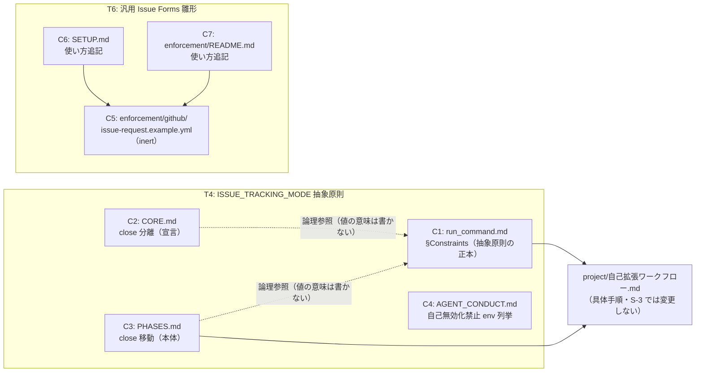

# 設計書: S-3 source 契約ドキュメント（ISSUE_TRACKING_MODE 抽象原則＋汎用 Issue Forms 雛形）

**プロジェクト名**: S-3 source 契約ドキュメント
**作成日**: 2026 年 07 月 16 日
**最終更新**: 2026 年 07 月 16 日

> **重要**: **このドキュメントは常に更新**: 設計の変更や追加があった場合は、即座にこのドキュメントを更新すること。本書は [`01_要件定義.md`](./01_要件定義.md) の確定要件（ストーリー1〜5・BDD シナリオ1〜6・BR）を実装可能な設計に落とす。
>
> **進行中の注記（重要・2026-07-16 更新）**: 本 02 は design-feature の**責務・境界定義（§2.1）＋ architecture\_\_design-api-contract フェーズ（§2.2〜§2.5・§3・§4・§5・§7〜§9）**まで完了した状態である。**§6 テスト戦略のみ**、後続の architecture\_\_review-dependencies フェーズが担当し、01 の BDD シナリオ 1〜6 と C1〜C7 の対応・依存関係の最終確認を行った上で本ファイルへ追記する。§6 は「（次フェーズで確定）」のまま未着手である。
>
> **親 02_設計.md 欠落に関する注記（重要・evidence_source: existing_code）**: 親 issue（GitHub Issue #115）の `00_要求定義.md`〜`03_実装計画.md`（ADR-1〜9 詳細を含む）は、作成後に一度も commit されないまま作業用 worktree の削除により失われている（[`../../90_issues.md`](../../90_issues.md) §参考資料の欠落注記、および本セッションでの `git -C <worktree> ls-files` 実測で親 00-03 が tracked files に存在しないことを確認済み）。本 02 は、S-3 自身の `00_要求定義.md`／`01_要件定義.md`（既に親 02 の該当箇所＝ADR-5 配置境界・ADR-9 Issue Forms 要件・§3.3.2 body テンプレートのフィールド定義を引用・確定済みの状態でマージされている）を一次情報として設計する。ADR-5／ADR-9 の**原文**（コンテキスト・検討した選択肢等の全文）は参照不能であり、本 02 では S-3 の 00/01 に記載された**機能的な確定事項**（配置境界の原則・Forms フィールドの required/optional 区分）のみを正として扱う。この制約は次フェーズへの申し送り事項とする（§12 参照）。
>
> **用語**: [.agent-skill-chain/source/CONCEPTS.md §用語規約](../../../../../../.agent-skill-chain/source/CONCEPTS.md#用語規約)、および本 issue 固有の用語は [`01_要件定義.md` §1.2 用語集](./01_要件定義.md#12-用語集) を参照。

---

## 1. 設計概要

### 1.1 設計方針

S-3 は**ドキュメント契約の追記のみ**を扱う issue であり、新規の実行時コンポーネント・API・データモデルを持たない。設計方針は「**1 ファイル 1 責務**の既存構造を壊さずに、二重モード（`ISSUE_TRACKING_MODE`）の抽象原則を正本 1 箇所に記載し、他ファイルは自ファイルの既存責務の範囲内で最小の注記のみを追加する」こととする（01 §2.3 ビジネスルール「配置境界」「非交差・非破壊」に対応）。

### 1.2 設計原則（本プロジェクトで適用するもの）

- **単一責務**: 対象 7 コンポーネント（ドキュメント／雛形ファイル）それぞれに単一の責務を割り当てる（§2.1）。1 ファイルに複数の関心（例: 抽象原則の全文と close 分岐の詳細）を重複させない。
- **明確な境界**: 「抽象＝source」「具体＝project（`自己拡張ワークフロー.md`）」の境界（01 §1.2 用語集「配置境界」）を、コンポーネントごとの境界定義として明示する（§2.1.2）。
- **UNIX 哲学（1 ファイル 1 責務の踏襲）**: 既存の「CORE＝宣言、PHASES＝ライフサイクル本体」「SETUP／README＝雛形の使い方、雛形ファイル自体＝inert サンプル」という既存の役割分担パターンをそのまま踏襲し、新しい分割方式を持ち込まない（01 §5 制約「対象は実在ファイルのみ」と整合）。
- 本 issue はドキュメント・inert 雛形のみを扱うため、CQRS・イベント駆動・データモデル設計は該当しない（01 §3.1 パフォーマンス「実行時性能への影響はない」と整合）。

---

## 2. アーキテクチャ設計

### 2.1 責務・境界・参照関係

#### 2.1.1 責務一覧

| # | コンポーネント（ファイル） | 対応タスク | 責務（1 文） |
|---|---|---|---|
| C1 | `.agent-skill-chain/source/skills/agent/run_command.md` §Constraints | T4 | `ISSUE_TRACKING_MODE` の**抽象原則の正本**（既定 `local_tracked`・`github_native` 二値・非 GitHub フォールバック・close は local_tracked 専用・AI 自律設定禁止）を 1 箇所に記載し、具体手順を project（`自己拡張ワークフロー.md`）へリンク委譲する。既存 3 ゲート（GitHub Issue 起票／branch／PR）の記述には触れない。 |
| C2 | `.agent-skill-chain/source/boot/CORE.md` §完了 issue の close 分離（宣言） | T4 | close 分離が**宣言**であるという既存の役割のまま、「close 移動は local_tracked 専用・github_native は Issue close で完結」という抽象事実を 1 文で注記する。ライフサイクル詳細（実行確定手段の分岐等）は C3 へ委譲する既存構造を維持する。 |
| C3 | `.agent-skill-chain/source/workflow/PHASES.md` §完了 issue の close 移動（ライフサイクル本体） | T4 | close 移動の**ライフサイクル本体**という既存の役割のまま、C2 と同旨の抽象注記を、既存の「GitHub 連携時は PR 経由・非連携時はユーザー明示指示」という実行確定手段の分岐（§完了issueのclose移動、実測済み記述）と矛盾しない形で追加する。 |
| C4 | `.agent-skill-chain/source/AGENT_CONDUCT.md` §enforcement ゲートの自己無効化禁止（本文＋第 3 部 サブエージェント向け凝縮版） | T4 | 自己バイパス禁止対象の env 列挙（`*_GATE_ENABLED` 系・`*_GATE_EFFECTIVE_FROM` 系）に `ISSUE_TRACKING_MODE` を追加する。本文・凝縮版の**両方**を更新する（既存の「委譲時に凝縮版を Constraints 末尾へ転記する」運用と整合させるため、片方のみの更新は不可）。既存の「人間の明示指示があれば設定してよい」という但し書きの対象に含める。 |
| C5 | `.agent-skill-chain/source/enforcement/github/`（新設ディレクトリ）＋ `*.example.yml`（新設 inert 雛形） | T6 | 消費者が自リポ `.github/ISSUE_TEMPLATE/` へコピーして使う、GitHub Issue Forms 形式の inert 雛形を提供する。フィールドは `textarea` 型で「目的・成功基準・受け入れ基準」を `required: true`、「全体像・フロー・参照」を `required: false` とする（01 §2.1 ストーリー4・§4.2 で確定済み）。enforcement・`audit.sh`・hook から読み込まれない不活性ファイルとする。 |
| C6 | `.agent-skill-chain/source/SETUP.md`（`orchestrator-allowlist.example.txt` 記述箇所の直後・同型の追記） | T6 | C5 雛形の**存在・コピー先（`.github/ISSUE_TEMPLATE/`）・使い方**を、既存の `orchestrator-allowlist.example.txt` の記述パターン（実測: SETUP.md 157-158 行「拡張ファイル」「雛形」の 2 行構成）に倣って追記する。雛形の中身（フィールド定義）は再掲しない。 |
| C7 | `.agent-skill-chain/source/enforcement/README.md`（`orchestrator-allowlist.example.txt` 記述箇所と同型の追記） | T6 | C6 と同内容を、既存の `orchestrator-allowlist の project 拡張点` 節（実測: README.md 148 行）と同型の記述で追加する。C6・C7 は同じ情報を異なる読者（セットアップ手順の読者 vs enforcement 詳細の読者）向けに提供する、既存の SETUP/README 二重掲載パターンをそのまま踏襲する（新しい重複ではない）。 |

**対象外（本 issue では変更しないファイル・既存のまま参照するのみ）**:

| コンポーネント | 役割 | S-3 での扱い |
|---|---|---|
| `.agent-skill-chain/source/enforcement/ci/audit.sh`（`resolve_issue_tracking_mode`） | env 名・既定値・値の**単一情報源（コード側）** | S-1 で実装済み（PR #116）。S-3 はこの実装に**文言を一致させる側**であり、コードは変更しない（01 §4.1 対象外ファイル）。 |
| `.agent-skill-chain/project/自己拡張ワークフロー.md` | 具体手順（本リポ実効モード固定・body テンプレート実文言・close 分岐の実装）の置き場所 | S-2 のスコープ。C1・C3 からのリンク委譲**先**としてのみ参照し、S-3 では改訂しない（01 §5 制約「依存順 S-1→S-3→S-2」）。 |
| `.github/ISSUE_TEMPLATE/`（本リポ実ファイル） | C5 雛形を本リポへ実際に適用したもの | S-2（T7）のスコープ。S-3 は C5（source 汎用雛形）までを対象とする（01 §5 除外要件）。 |

#### 2.1.2 境界

- **入力**: `01_要件定義.md` の受け入れ基準・BDD シナリオ（ストーリー1〜5）。S-1 実装が確定した env 名・既定値・値（`ISSUE_TRACKING_MODE`／`local_tracked`／`github_native`、`audit.sh:1052-1059` 実測）。C1〜C7 各ファイルの現行記述（本セッションで実測済み）。`orchestrator-allowlist.example.txt` の inert 雛形前例。
- **出力**: 既存 4 ファイル（C1〜C4）への抽象原則・注記の**追記**（既存文の変更・削除は伴わない）。新設 1 ディレクトリ＋雛形ファイル 1 件以上（C5）。既存 2 ファイル（C6・C7）への使い方の**追記**。
- **他責務との境界**:
  - **S-1（audit.sh のコード実装）とは非交差**: S-3 はコードを一切変更しない。C1 が記載する env 名・既定値は S-1 実装の**引用**であり、実装ロジック自体は対象外。
  - **S-2（本リポ具体化・スイッチ投入）とは非交差**: 本リポ固有の実効モード固定・`自己拡張ワークフロー.md` 改訂・`.gitignore`・決定ログ新設・`.github/ISSUE_TEMPLATE/` 実ファイルは S-3 の範囲外。C1・C3 は project 側へ**リンクするだけ**で、リンク先の中身は作らない。
  - **T4（抽象原則の契約反映）と T6（汎用雛形の新設）は機能的に独立**: T4 系（C1〜C4）は「二重モードの存在を source が知っている」ことを保証し、T6 系（C5〜C7）は「消費者が手動起票を構造強制できる」ことを保証する。両者は同じ親 issue の異なるユーザーストーリーに対応し、ファイルレベルでの依存はない（§2.1.3）。
  - **本フェーズ（責務・境界定義）と後続フェーズの境界**: 本 02 の本節までが責務・境界の確定であり、各コンポーネントの**具体的な追記文言・YAML スキーマの厳密な記述・Mermaid 図・ADR・データ形式要件の確定**は後続の architecture\_\_design-api-contract（§2.2 以降）・architecture\_\_review-dependencies（§6 テスト戦略・依存関係の最終確認）が担当する。

#### 2.1.3 参照関係

- C1（run_command.md） → `.agent-skill-chain/project/自己拡張ワークフロー.md`（具体手順への既存のリンク委譲様式を踏襲。本 issue では project 側を変更しない・参照のみ）
- C2（CORE.md） → C3（PHASES.md）（「宣言は CORE、ライフサイクル詳細は PHASES」という既存の 1 ファイル 1 責務委譲構造をそのまま維持。モード注記もこの構造に従い、CORE 側に詳細を書き込まない）
- C3（PHASES.md） → `.agent-skill-chain/project/自己拡張ワークフロー.md`（close 移動の実行確定手段の具体化は既存どおり project 側へ委譲。モード注記もこの既存パターンを踏襲し、新しい参照経路を作らない）
- C2・C3 → C1（run_command.md）（**論理的な参照**: close 分岐注記は `ISSUE_TRACKING_MODE` という同一 env を扱うため、値の意味・既定値の**全文説明はC1のみが担い**、C2/C3 は「local_tracked 専用」という結論のみを短く記載する。C1 を抽象原則の正本とすることで SC1 の「1 箇所記載」要件と整合させる。物理的なリンク記述を入れるかは次フェーズで確定）
- C4（AGENT_CONDUCT.md） → 独立（他コンポーネントを参照しない。既存の env 列挙にトークンを 1 つ追加するのみで、`ISSUE_TRACKING_MODE` の意味説明は持たない＝C1 への非依存を意図的に保つ）
- C6（SETUP.md） → C5（enforcement/github/*.example.yml）（雛形の存在・コピー先を記述。`orchestrator-allowlist.example.txt` → SETUP.md の既存パターンと同型）
- C7（enforcement/README.md） → C5（同上。C6 と同型・独立した参照）
- C5（enforcement/github/*.example.yml） → 依存なし（inert・単独で完結。enforcement・audit.sh からは読まれない＝逆方向の参照も存在しない）
- **T4 群（C1〜C4）と T6 群（C5〜C7）の間に参照関係はない**（§2.1.2 のとおり機能的に独立。循環参照なし）。

---

## 2.2 システムアーキテクチャ

- **採用パターン**: 該当なし。C1〜C7 はいずれも既存ドキュメント（または既存 inert 雛形パターン）への追記であり、新規の実行時コンポーネント・API・データモデルを持たない（§1.2 のとおり CQRS・イベント駆動は適用外）。
- **根拠**: [spec/06_設計判断の優先順位.md](../../../../../../.agent-skill-chain/source/spec/06_設計判断の優先順位.md) の優先順位に照らし、本 issue は「既存構造の保守性・変更容易性」を最優先すべき軽量ドキュメント変更であり、新しいアーキテクチャパターンを持ち込む必要性・妥当性のいずれも無い（01 §3.4 保守性要件、02 §1.1 設計方針と整合）。

C1〜C7 の参照関係（§2.1.3 と同一情報の図示。新しい関係は追加しない）:



C4 は上図のどのノードとも矢印を持たない（§2.1.3 のとおり独立。既存 env 列挙にトークンを 1 つ追加するのみで `ISSUE_TRACKING_MODE` の意味説明を持たない）。T4 群と T6 群の間にも矢印はない（機能的に独立）。

### 2.3 コンポーネント構成

| 種別 | 該当コンポーネント | 役割 |
|---|---|---|
| 抽象原則の正本 | C1 | `ISSUE_TRACKING_MODE` の全文説明（既定値・二値・フォールバック・close 分岐・自律設定禁止）を唯一保持する |
| 宣言（既存役割を維持） | C2 | close 分離の**宣言**という既存の役割のまま、1 文の抽象事実のみを追記する |
| ライフサイクル本体（既存役割を維持） | C3 | close 移動の**ライフサイクル本体**という既存の役割のまま、既存の実行確定手段の分岐と矛盾しない形で 1 文を追記する |
| 自己バイパス防止対象列挙（既存役割を維持） | C4 | 対象 env の列挙にトークンを 1 つ追加するのみ。意味説明は持たない |
| inert 雛形（新設） | C5 | GitHub Issue Forms 形式の不活性サンプルを提供する。enforcement・audit.sh・hook から読まれない |
| 使い方ガイド（既存役割を維持） | C6・C7 | C5 の存在・コピー先・使い方を、異なる読者向けに同型で記載する（既存 SETUP/README 二重掲載パターンの踏襲） |

### 2.4 データフロー

該当なし（イベント駆動ではないため、状態変更イベントの発行は無い）。強いて言えば「読者（エージェント・消費者）が C1 を読み、必要な場合のみ project 側の具体手順（`自己拡張ワークフロー.md`）へ辿る」という参照の流れが実質的なデータフローに相当するが、これは §2.1.3 参照関係・§2.2 の図と同一情報であるため、シーケンス図としての重複掲載はしない。

### 2.5 横断設計判断（ADR）

02 §12（前フェーズ申し送り）の未決事項 2・3 は、いずれも後続フェーズ（03_実装計画）の実装内容を左右する重要判断であるため、本フェーズで ADR として確定する。

#### ADR-S3-1: C1〜C4 間の参照は物理リンクを張るか

- **コンテキスト**: 前フェーズ（§2.1.3）は C2/C3 → C1 を「論理的な参照」（値の意味の全文説明は C1 のみが担う）と位置づけたが、実際の追記文で C1 への Markdown リンクを張るか、独立した短文注記に留めるかは未確定だった（02 §12 未決事項 2）。SC1「1 箇所記載」と PHASES.md 既存の「1 ファイル 1 責務・重複禁止」原則との整合が論点。
- **検討した選択肢**:
  - (a) 独立した短文注記のみ（C1 へのリンクなし）: 各ファイルが自己完結するが、読者が C1 の詳細（既定値・フォールバック・自律設定禁止等）へ辿る導線を失い、「1 箇所記載」を参照させる SC1 の趣旨が弱まる。
  - (b) C1 への物理的な Markdown リンクを追加する: 既存の読者導線を保ちながら、C2/C3 側での重複記載を防げる。
- **決定**: (b)。C2（CORE.md）・C3（PHASES.md）はそれぞれ、1 文の抽象事実に続けて C1（`run_command.md` §Constraints）への相対リンクを付す。リンク書式は本コードベースで確立された慣習（`[ファイル名](相対パス)` の直後に `§見出し名` を平文で置き、URL フラグメントは使わない。例: CORE.md 142 行目 `[.agent-skill-chain/project/自己拡張ワークフロー.md](../../project/自己拡張ワークフロー.md) §完了 issue の close 移動（上書き）`）に厳密に倣う。
- **根拠**（evidence_source: existing_code）: CORE.md 138-143 行目・PHASES.md 70-85 行目に、既に同型の「詳細はリンク先を参照」導線（project 側への委譲リンク）が複数存在し、この参照パターンが本ファイル群の確立された慣習であるため、新しい分割方式を持ち込まない（§1.2 設計原則「UNIX 哲学の踏襲」と整合）。
- **帰結**: C2・C3 の追記は「1 文の抽象事実＋C1 への物理リンク」の形になる（§3.1 で詳細化）。C1 が持つ全文説明を C2/C3 が重複転記しないことが、SC1「1 箇所記載」の充足条件として明確化される。

#### ADR-S3-2: C5 雛形はファイルを何件・どう命名するか

- **コンテキスト**: 01 §4.2 は雛形の必須/任意フィールド区分（目的／成功基準／受け入れ基準＝`required: true`、全体像・フロー／参照＝`required: false`）を定めるが、ファイル数（単一か複数か）・命名は未確定だった（02 §12 未決事項 3）。GitHub Issue Forms の一般的な運用は複数テンプレート＋ `config.yml` の構成を取ることが多い。
- **検討した選択肢**:
  - (a) 単一ファイル（issue 種別を分岐しない汎用 1 種類）。
  - (b) 複数ファイル（例: `bug_report.example.yml`・`feature_request.example.yml` 等）＋ `config.yml`（Blank issue 無効化）。
- **決定**: (a)。`.agent-skill-chain/source/enforcement/github/issue-request.example.yml` として 1 ファイルのみ新設する。`config.yml` は追加しない。
- **根拠**（evidence_source: existing_code）: 01 §1.2 用語集・§2.2 BDD ユースケース 2・§4.2 データ形式要件はいずれも単一の 5 フィールド構造（目的・成功基準・受け入れ基準・全体像/フロー・参照）のみを参照し、bug/feature 等の issue 種別分岐に一切触れていない。この 5 フィールドは `00_要求定義.md` の主要見出し（目的・成功基準・全体像・参考資料）に対応する汎用構造であり、01 に根拠のない種別分岐・`config.yml` を先取りしない（01 §5「対象は実在ファイルのみ」、§2.3 ビジネスルール「非交差・非破壊」の趣旨、YAGNI）。
- **帰結**: C5 は `enforcement/github/` 配下に `issue-request.example.yml` 1 ファイルのみ（§4 データ設計で詳細スキーマを定義）。将来 bug/feature 等の種別分岐が必要になった場合は、01 の要件を更新した上で別 issue として追加する（本 ADR はその追加を妨げない）。

---

## 3. 機能設計

**方針**: 各コンポーネントについて「入力」「出力」「責務」を数行で定義する（design-api-contract §手順 3）。**具体的な日本語プロース文言そのもの（diff 相当のテキスト）は 03_実装計画のタスクとして起票する**（design-api-contract §制約「実装の詳細は 02 に長く書かない」）。本節は文言が満たすべき**構成要素**を確定する。

### 3.1 機能 1: T4 — ISSUE_TRACKING_MODE 抽象原則の契約反映（C1〜C4）

#### 3.1.1 概要

配布物 source 側の 4 ファイルに、二重モード（`ISSUE_TRACKING_MODE`）の存在を反映する。抽象原則の全文は C1 のみが持ち、C2/C3 は 1 文の事実注記＋C1 への物理リンク（ADR-S3-1）、C4 は独立した env 追加のみに留める。

#### 3.1.2 コンポーネント別入力・出力・責務

| コンポーネント | 入力 | 出力（追記の構成要素） | 責務 |
|---|---|---|---|
| C1（`run_command.md` §Constraints） | 01 の確定事項（既定 `local_tracked`・`github_native` 二値・非 GitHub フォールバック・close は local_tracked 専用・AI 自律設定禁止）。S-1 実装の env 名/既定値（`audit.sh` 実測）。既存 3 ゲートの箇条書き書式（1 ブレット＝1 独立項目、末尾に project 側への具体手順リンク） | 既存 3 ゲートと**非交差の独立 1 ブレット**を追加。構成要素: (i) env 名 `ISSUE_TRACKING_MODE` (ii) 既定値 `local_tracked` (iii) 二値 (`github_native`／`local_tracked`) (iv) 非 GitHub 環境では `local_tracked` へフォールバック (v) close 移動は `local_tracked` 専用（C2/C3 と同旨、詳細先） (vi) `ISSUE_TRACKING_MODE` は AI 自律設定禁止対象（C4 参照） (vii) 具体手順（本リポ実効モード固定・body テンプレート実文言）は `自己拡張ワークフロー.md` へリンク委譲 | `ISSUE_TRACKING_MODE` 抽象原則の**唯一の正本**（全文説明を持つのはここだけ） |
| C2（`CORE.md` §完了 issue の close 分離） | 既存の宣言文（138-143 行）。ADR-S3-1 の物理リンク方針 | 既存宣言の末尾に 1 文追記: 「close 移動（`git mv`）は `ISSUE_TRACKING_MODE=local_tracked`（既定）専用。`github_native` では GitHub Issue の close で完結し、close 移動 PR は不要」＋ C1（`run_command.md` §Constraints）への相対リンク | **宣言としての最小注記のみ**。既定値・フォールバック等の全文説明は持たない（C1 に委譲） |
| C3（`PHASES.md` §完了 issue の close 移動） | 既存のライフサイクル本体（既存の「実行確定手段（分岐・原則）」段落を含む）。ADR-S3-1 の物理リンク方針 | C2 と同旨の 1 文を、既存の「GitHub 連携時は PR 経由・非連携時はユーザー明示指示」という実行確定手段の分岐と**矛盾しない位置**（当該分岐の説明の前または後）に追加＋ C1 への相対リンク | ライフサイクル本体としての最小注記のみ。既存の分岐構造を破壊しない |
| C4（`AGENT_CONDUCT.md` §enforcement ゲートの自己無効化禁止・第 3 部凝縮版） | 既存の対象 env 列挙（本文 80 行目「`*_GATE_ENABLED` 系」列挙・凝縮版 102 行目「ゲート自己無効化禁止」箇条書き） | **本文・凝縮版の両方**に `ISSUE_TRACKING_MODE` をトークン追加する（既存の「人間の明示指示があれば設定してよい」という但し書きの対象に自動的に含まれる）。片方のみの更新は不可（01 ストーリー3 受け入れ基準） | 自己バイパス防止対象の網羅性維持。`ISSUE_TRACKING_MODE` の意味説明は持たない（C1 に非依存。§2.1.3） |

#### 3.1.3 エラーハンドリング（契約違反時の扱い）

- **配置境界違反**（C2/C3/C4 に既定値・フォールバック等の全文説明を書き込む）: review-docs／review-dependencies のレビューで「1 ファイル 1 責務違反・SC1 逸脱」として指摘し、実装を差し戻す。
- **env 名・既定値の不一致**（C1 の記載が `audit.sh` の `resolve_issue_tracking_mode` と食い違う）: SC4 の grep 突合（01 §2.2 シナリオ 2 のコマンド）で検知し、review-dependencies のテスト観点として FAIL 扱いにする。
- **C4 の片方のみ更新**（本文のみ／凝縮版のみ）: SC3 未達として、review-dependencies で本文・凝縮版の双方に `ISSUE_TRACKING_MODE` が存在することを grep で確認するテスト観点を設ける。
- **既存 3 ゲート・close 分岐・自己無効化禁止の既存記述の変更・弱化**: 01 §2.1 ストーリー1〜3 の受け入れ基準（非交差・非破壊）に反するため、diff レビューで既存行の変更が無いことを確認する。

---

### 3.2 機能 2: T6 — 汎用 GitHub Issue Forms 雛形の新設（C5〜C7）

#### 3.2.1 概要

消費者が自リポ `.github/ISSUE_TEMPLATE/` へコピーして使う inert な GitHub Issue Forms 雛形（C5）を新設し、その使い方を既存の `orchestrator-allowlist.example.txt` 前例に倣って 2 箇所（C6・C7）に追記する。

#### 3.2.2 コンポーネント別入力・出力・責務

| コンポーネント | 入力 | 出力（追記の構成要素） | 責務 |
|---|---|---|---|
| C5（新設 `.agent-skill-chain/source/enforcement/github/issue-request.example.yml`） | 01 §4.2 のフィールド定義（required/optional 区分）。GitHub Issue Forms スキーマ（`name`/`description`/`body[].type`/`attributes`/`validations.required`）。ADR-S3-2（単一ファイル決定）。`orchestrator-allowlist.example.txt` の inert 命名・コメント前例 | 新設ディレクトリ＋ 1 ファイル（詳細スキーマは §4 データ設計）。ファイル冒頭に「これは雛形であり enforcement からは読まれない」旨のコメント（`orchestrator-allowlist.example.txt` 前例踏襲） | inert な構造強制雛形の提供。enforcement・`audit.sh`・hook からは読まれない |
| C6（`SETUP.md` §orchestrator allowlist の project 拡張（opt-in） の直後） | C5 の存在。同見出し直後にある既存の拡張ファイル記述パターン（157-158 行目相当: 「拡張ファイル」「雛形」の 2 行構成） | 同見出しの直後に新規小見出し（例: `### Issue Forms 雛形の利用（opt-in）`）を追加し、雛形の存在・コピー先（`.github/ISSUE_TEMPLATE/`）・使い方を 2 行程度で記載。**雛形のフィールド定義は再掲しない** | セットアップ手順の読者向けガイド |
| C7（`enforcement/README.md` の `**orchestrator allowlist の project 拡張点（opt-in・fail-closed 保全）**:` 段落の直後） | C5 の存在。同段落の既存記述パターン（148 行目） | 同段落の直後に同型の 1 段落を追加。内容は C6 と同旨（異なる読者向けに同じ情報を提供する既存 SETUP/README 二重掲載パターンの踏襲） | enforcement 詳細の読者向けガイド |

#### 3.2.3 エラーハンドリング（契約違反時の扱い）

- **雛形が enforcement/audit.sh/hook から誤って読み込まれる状態になる**（inert 原則違反）: SC8 未達として、review-dependencies で「audit.sh・PreToolUse.sh・PostToolUse.sh いずれも `enforcement/github/` を参照しない」ことを grep で確認するテスト観点を設ける。
- **C6・C7 でフィールド定義を再掲する**（二重記載）: 01 §2.1 ストーリー5・保守性要件に反するため、レビューで「雛形の中身は再掲しない」ルール違反として指摘する。
- **YAML スキーマが GitHub Issue Forms として不正**（`required`/`type` 等のキー不足・型不一致）: SC5 未達として、review-dependencies で YAML パース可否・必須キー存在をテスト観点に含める（01 §2.2 シナリオ 5 の grep コマンドを踏襲）。

---

## 4. データ設計

本 issue はリレーショナルなデータモデル・DB テーブルを持たない（01 §3.1 実行時性能への影響なし）。データ設計として定義するのは、C5（新設 inert 雛形）の YAML スキーマのみである。

### 4.1 データ構造（C5: GitHub Issue Forms スキーマ）

**ファイル**: `.agent-skill-chain/source/enforcement/github/issue-request.example.yml`（ADR-S3-2・単一ファイル）

| キー | 型 | 必須 | 内容 |
|---|---|---|---|
| `name` | string | 必須（GitHub Forms 仕様） | フォームの表示名（例: `"Issue 起票（要求定義）"`） |
| `description` | string | 必須（GitHub Forms 仕様） | フォームの説明（1 文） |
| `title` | string | 任意 | Issue タイトルのプレフィックス既定値 |
| `labels` | array | 任意 | 既定で付与するラベル（本雛形は空配列とし、消費者側のラベル体系に委ねる。01 §5 制約「GitHub Issue の…ラベル体系…等の運用細部」は除外要件） |
| `body` | array | 必須（GitHub Forms 仕様） | フィールド定義の配列（下記 4.1.1） |

#### 4.1.1 `body` 配下フィールド（01 §4.2 の required/optional 区分を反映）

| フィールド `id` | `label` | `type` | `validations.required` | 対応する 00_要求定義.md 相当節 |
|---|---|---|---|---|
| `purpose` | 目的 | `textarea` | `true` | §1.1 目的 |
| `success-criteria` | 成功基準 | `textarea` | `true` | §6 成功基準 |
| `acceptance-criteria` | 受け入れ基準 | `textarea` | `true` | （01 の受け入れ基準相当。00 テンプレートには対応節が無いため雛形独自の項目として追加） |
| `overview-flow` | 全体像・フロー | `textarea` | `false` | §要求定義の全体像（マインドマップ） |
| `references` | 参照 | `textarea` | `false` | §8 参考資料 |

各フィールドは `type: textarea` に統一する（複数行の自由記述を要するため。`input`/`dropdown`/`checkboxes` 等の他の GitHub Forms 型は 01 に要件が無く採用しない）。`attributes.description` に「00_要求定義.md の対応節」を 1 行で明記し、AI 起票時の §3.3.2 body テンプレートとの対応が読者にわかるようにする。

### 4.2 参考: スキーマの具体像（実装時の入力・03 で確定する最終文言ではない）

```yaml
# 雛形コメント: これは雛形（example）です。enforcement からは読まれません。
# 実効ファイルは消費先プロジェクトの .github/ISSUE_TEMPLATE/ へコピーして使ってください。
name: "Issue 起票（要求定義）"
description: "目的・成功基準・受け入れ基準を明確にした Issue を起票します。"
title: "[Issue] "
labels: []
body:
  - type: textarea
    id: purpose
    attributes:
      label: 目的
      description: "この issue で達成したいこと（00_要求定義.md §1.1 目的 相当）。"
    validations:
      required: true
  - type: textarea
    id: success-criteria
    attributes:
      label: 成功基準
      description: "○/× で判定できる成功基準（00_要求定義.md §6 成功基準 相当）。"
    validations:
      required: true
  - type: textarea
    id: acceptance-criteria
    attributes:
      label: 受け入れ基準
      description: "Given/When/Then 等で確認できる受け入れ基準。"
    validations:
      required: true
  - type: textarea
    id: overview-flow
    attributes:
      label: 全体像・フロー
      description: "（任意）関連する処理フロー・マインドマップ等。"
    validations:
      required: false
  - type: textarea
    id: references
    attributes:
      label: 参照
      description: "（任意）関連 Issue・ドキュメントへのリンク。"
    validations:
      required: false
```

この YAML は §4.1 の表を満たす一貫例であり、実装時（03_実装計画）の起点として使ってよい。最終的な文言（`description` の日本語表現等）の微調整は実装計画・実装フェーズの裁量とする（design-api-contract §制約「実装の詳細は 02 に長く書かない」）。

---

## 5. API 設計

本 issue に実行時 API・エンドポイントはない（01 §4.1）。「契約」は各コンポーネントが読者・消費者・GitHub 側に対して保証する入出力であり、以下をその一覧として扱う。

### 5.1 インターフェース一覧（新規実行時 API なし・01 §4.1）

| # | インターフェース（契約） | 入力（読者・呼び出し元） | 出力・契約（保証内容） | 契約違反時の扱い |
|---|---|---|---|---|
| K1 | C1: `run_command.md` §Constraints の `ISSUE_TRACKING_MODE` ブレット | source を読むエージェント・消費者 | `ISSUE_TRACKING_MODE` の既定値・二値・フォールバック・close 分岐・自律設定禁止・project へのリンク委譲を 1 箇所で提供する（§3.1.2） | env 名・既定値の不一致は SC4 grep 突合で FAIL（§3.1.3） |
| K2 | C2: `CORE.md` §完了 issue の close 分離 の 1 文注記 | close 可否を判断するエージェント | 「close 移動は `local_tracked` 専用」という結論＋C1 への物理リンクのみを提供する（全文説明は提供しない） | 全文説明の重複記載は 1 ファイル 1 責務違反としてレビュー指摘（§3.1.3） |
| K3 | C3: `PHASES.md` §完了 issue の close 移動 の 1 文注記 | 同上 | K2 と同旨。既存の実行確定手段の分岐と矛盾しないことを保証する | 既存分岐との矛盾はレビューで差し戻し |
| K4 | C4: `AGENT_CONDUCT.md` 自己無効化禁止（本文＋凝縮版） | AI エージェント（自己バイパス防止の対象） | `ISSUE_TRACKING_MODE` が自律設定禁止対象に含まれることを本文・凝縮版の両方で保証する | 片方のみの更新は SC3 未達（§3.1.3） |
| K5 | C5: `enforcement/github/issue-request.example.yml` | 消費者（GitHub Web UI での手動起票者） | `required: true`（目的／成功基準／受け入れ基準）・`required: false`（全体像・フロー／参照）の入力構造を GitHub Forms 機構自身に強制させる（§4） | 必須欄未入力時の submit 不可は GitHub 側機構が保証（本リポでのテスト対象外）。雛形が enforcement から読まれる状態になった場合は SC8 未達（§3.2.3） |
| K6 | C6: `SETUP.md` の C5 利用ガイド | セットアップ手順の読者 | C5 の存在・コピー先・使い方を提供する（フィールド定義は再掲しない） | 再掲（二重記載）はレビュー指摘（§3.2.3） |
| K7 | C7: `enforcement/README.md` の C5 利用ガイド | enforcement 詳細の読者 | K6 と同内容を異なる読者向けに提供する | 同上 |

### 5.2 既存契約との整合

- **K1 は既存 3 ゲート（GitHub Issue 起票／branch／PR 紐づけ）の記述を変更しない**（01 §2.1 ストーリー1 受け入れ基準）。既存箇条書きの末尾に**非交差の独立ブレット**として追加する形を取り、既存ブレットの文言・順序には触れない（existing_code: `run_command.md` 47-51 行目の既存 3 ゲートを実測確認済み）。
- **K4 は既存の「人間の明示指示があれば設定してよい」という但し書き**（`AGENT_CONDUCT.md` 82 行目）**の対象へ `ISSUE_TRACKING_MODE` を自動的に含める**形とし、但し書き自体の文言は変更しない。
- **K5 は既存の `orchestrator-allowlist.example.txt` の inert 命名・コメント構造パターンに合わせる**（`.example.` サフィックス・冒頭コメントでの「雛形であり読まれない」旨の明記・コピー先の明示）。GitHub Issue Forms は YAML 自体に人間可読なコメントを許容するため、`orchestrator-allowlist.example.txt` の `#` コメント前例をそのまま踏襲できる。
- **K6・K7 は既存の SETUP/README 二重掲載パターン**（`orchestrator-allowlist.example.txt` の記述前例: SETUP.md 151-166 行目・README.md 148 行目）**をそのまま踏襲する**（新しい重複ではなく、既存パターンの追加インスタンス）。

---

## 6. テスト戦略（次フェーズで確定）

（architecture\_\_review-dependencies フェーズで、01 の BDD シナリオ 1〜6（grep 突合・Forms スキーマ検証等）と C1〜C7 の対応を確定する。）

---

## 7. UI 設計

該当なし。本 issue はドキュメント・inert 雛形のみを扱う。GitHub Issue Forms 自体の入力 UI（Web フォーム描画・必須チェック）は GitHub 側の既存機構であり本 issue の実装対象外（本リポへの `.github/ISSUE_TEMPLATE/` 実ファイル適用＝画面として実際に使われる状態にすることは S-2 のスコープ。01 §5 除外要件）。

## 8. セキュリティ設計

### 8.1 認証・認可

該当なし。本 issue は実行時の認証・認可機構を持たない（ドキュメント追記＋ inert 雛形のみ）。

### 8.2 データ保護

- 雛形（C5）・SETUP/README への記述例（C6・C7）にトークン実値・認証情報を残さない（01 §3.2 セキュリティ要件、親 02 §8 踏襲）。
- C4（`AGENT_CONDUCT.md` 自己無効化禁止対象への `ISSUE_TRACKING_MODE` 追加）により、AI エージェントが自らのゲート（close 移動の要否等）を SKIP させる目的で `ISSUE_TRACKING_MODE` を自律的に書き換える自己バイパスを防止する（01 §3.2、K4）。

## 9. 非機能要件への対応

### 9.1 パフォーマンス

該当なし。雛形（C5）は enforcement・`audit.sh`・hook から読まれない inert ファイルであり実行時性能に影響しない（01 §3.1）。

### 9.2 可用性

C1 の抽象原則に「非 GitHub 環境では既定 `local_tracked` へフォールバックする」ことを明記する（§3.1.2）ことで、GitHub 非採用の消費者環境をロックアウトしないことを保証する（01 §3.4 可用性要件）。

---

## 10. 参考資料

### プロジェクトドキュメント

- [`00_要求定義.md`](./00_要求定義.md)・[`01_要件定義.md`](./01_要件定義.md)（本 02 の入力）
- 親 issue（GitHub Issue #115）: [`../../90_issues.md`](../../90_issues.md)（親 00〜03 欠落の経緯注記を含む）
- S-1 実装: [`../20260715_190000_S1_audit_sh_モード分岐/02_設計.md`](../20260715_190000_S1_audit_sh_モード分岐/02_設計.md)（参考。本 02 では未参照だが env 名一致検証時に参照予定）

### 実在ファイル（本セッションで実測確認済み・evidence_source: existing_code）

- [`.agent-skill-chain/source/skills/agent/run_command.md`](../../../../../../.agent-skill-chain/source/skills/agent/run_command.md) §Constraints
- [`.agent-skill-chain/source/boot/CORE.md`](../../../../../../.agent-skill-chain/source/boot/CORE.md) §完了 issue の close 分離（138-143 行）
- [`.agent-skill-chain/source/workflow/PHASES.md`](../../../../../../.agent-skill-chain/source/workflow/PHASES.md) §完了 issue の close 移動（70-85 行）
- [`.agent-skill-chain/source/AGENT_CONDUCT.md`](../../../../../../.agent-skill-chain/source/AGENT_CONDUCT.md) §enforcement ゲートの自己無効化禁止（76-84 行）・第 3 部 サブエージェント向け凝縮版（88-104 行）
- [`.agent-skill-chain/source/SETUP.md`](../../../../../../.agent-skill-chain/source/SETUP.md)（157-158 行、orchestrator-allowlist 記述前例）
- [`.agent-skill-chain/source/enforcement/README.md`](../../../../../../.agent-skill-chain/source/enforcement/README.md)（148 行、orchestrator-allowlist 記述前例）
- [`.agent-skill-chain/source/enforcement/claude/orchestrator-allowlist.example.txt`](../../../../../../.agent-skill-chain/source/enforcement/claude/orchestrator-allowlist.example.txt)（inert 雛形の書式前例）
- [`.agent-skill-chain/source/enforcement/ci/audit.sh`](../../../../../../.agent-skill-chain/source/enforcement/ci/audit.sh)（1048-1077 行、`resolve_issue_tracking_mode` 実装・env 名/既定値の単一情報源）

### その他の参考資料

- S-1 実装（マージ待ち PR #116）の `resolve_issue_tracking_mode`
- 親 02_設計.md（ADR-5・ADR-9 詳細）は worktree 削除により欠落（[`../../90_issues.md`](../../90_issues.md) 参照。§進行中の注記を参照）

---

## 11. 前のステップ

この設計書は、以下のドキュメントを基に作成されています：

- **前**: [`01_要件定義.md`](./01_要件定義.md) - 要件定義フェーズ

---

## 12. 次のステップ・申し送り事項

この設計書（責務・境界定義フェーズ＋ architecture\_\_design-api-contract フェーズ分）の承認後、以下を作成します：

- **次**: architecture\_\_review-dependencies フェーズで §6 テスト戦略（01 の BDD シナリオ 1〜6 と C1〜C7・K1〜K7 の対応、依存関係の最終確認）を確定し、[`03_実装計画.md`](./03_実装計画.md) を作成する。

**前フェーズ（責務・境界定義）からの未決事項の処理状況**:

1. **親 02_設計.md（ADR-5／ADR-9）の原文欠落**: 未解決のまま（本フェーズのスコープ外・本フェーズ限定の制約のため深入りしない）。ただし本フェーズで新設した ADR-S3-1・ADR-S3-2（§2.5）は、いずれも「親 ADR を継承した」ではなく S-3 自身の 00/01 の記述のみを根拠（evidence_source: existing_code）として独立に ADR 化しており、前フェーズの申し送り方針に従っている。次フェーズ以降で新たに ADR を書く場合も同じ方針（参照不能な親文書を根拠に挙げない）を維持すること。
2. **C1〜C4 の物理的な参照リンクの要否**: **解決済み（ADR-S3-1・§2.5・§3.1.2）**。C2・C3 は 1 文の抽象事実＋C1 への物理リンク（既存の `[ファイル名](相対パス) §見出し名` 書式）を追加する方針で確定した。
3. **C5 雛形のファイル数・命名**: **解決済み（ADR-S3-2・§2.5・§4.1）**。単一ファイル `.agent-skill-chain/source/enforcement/github/issue-request.example.yml` に確定した（`config.yml` は追加しない）。
4. **C6・C7 の追記位置の基準（行番号ではなく見出し名）**: 本フェーズで見出し名ベースの特定に置き換え済み（§3.2.2）。C6 は `SETUP.md` の見出し `### orchestrator allowlist の project 拡張（opt-in）` の直後、C7 は `enforcement/README.md` の段落 `**orchestrator allowlist の project 拡張点（opt-in・fail-closed 保全）**:` の直後を基準とする。実装フェーズ（03_実装計画）でもこの見出し名・段落見出しを基準に追記箇所を特定し、行番号には依存しないこと。

**本フェーズ（design-api-contract）からの新規申し送り**:

5. **C1〜C4 の最終プロース文言・03_実装計画への落とし込み**: §3.1〜§3.2 で確定したのは追記の**構成要素**（何を含むか）であり、実際の日本語文言の確定は 03_実装計画のタスクとする（design-api-contract §制約「実装の詳細は 02 に長く書かない」）。
6. **§6 テスト戦略・依存関係の最終確認**: §3.1.3・§3.2.3・§5.1 で契約違反時の扱いとテスト観点の種を示したが、01 の BDD シナリオ 1〜6 との網羅的対応表・テスト種別（単体/構成/手動）の割り当ては architecture\_\_review-dependencies フェーズで確定すること。
