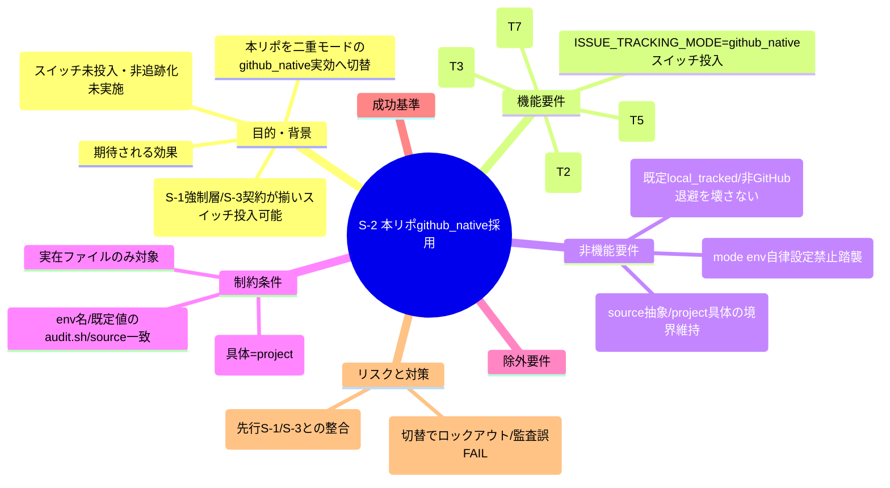
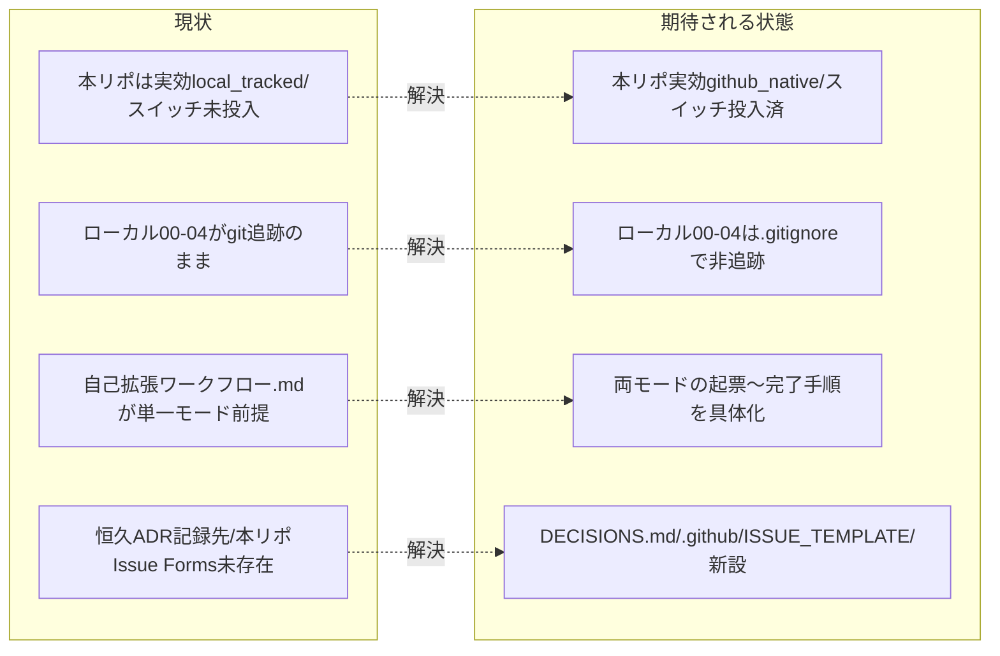

# 要求定義書: S-2 本リポ github_native 採用（スイッチ投入・非追跡化・両モード手順化・決定ログ／Issue Forms 新設）

**プロジェクト名**: S-2 本リポ github_native 採用（親: issue 運用ポリシーの GitHub Issue 中心への全面移行）
**作成日**: 2026 年 07 月 16 日
**最終更新**: 2026 年 07 月 16 日

> **重要**:
>
> - 要求定義書は、プロジェクトの全体像を把握するためのものです。詳細な技術仕様や実装方法は要件定義書以降で記載します。必要最低限の情報に収めることを心掛けてください。
> - **このドキュメントは常に更新**: 要求の変更や追加があった場合は、即座にこのドキュメントを更新してください。
> - **本 issue は親 issue「issue 運用ポリシーの GitHub Issue 中心への全面移行」（GitHub Issue #115）のサブ issue S-2** であり、`90_issues/` 配下に置かれる。GitHub Issue 起票ゲート対象外＝**親 Issue #115 のチェックリスト／コメントに集約**する設計のため、本サブ issue には個別の `github_issue` を起票しない。
> - 本 issue は親 03_実装計画のタスク **T2・T3・T5・T7** に対応し、依存順（親 03 §1.2）で **S-1（安全な既定・PR #116 マージ済み）→ S-3（source 契約・PR #121 マージ済み）→ 本 S-2（本リポ github_native 採用＝スイッチ投入）** の最後に位置する。方針の是非（案 B＝二重モード方式）は親 issue で確定済み（human_decision「B 案にします」）であり、本フェーズ（requirement-discovery）は S-2 単体の目的・成功基準・制約・受け入れ基準・BDD を精緻化する。
> - **フェーズ状態（更新）**: requirement-discovery（extract-goals → identify-assumptions → define-constraints → write-bdd）は完了済みで、**詳細な前提・制約・受け入れ基準・BDD の正本は [`01_要件定義.md`](./01_要件定義.md)** にある。本 00 の §1・§6 が目的・成功基準の正本であり、§2〜5・§7 は要求段階の骨子（詳細は 01 が正本）として保持する。design-feature（[`02_設計.md`](./02_設計.md)・[`03_実装計画.md`](./03_実装計画.md)）も完了済み。
>
> **用語**: [.agent-skill-chain/source/CONCEPTS.md §用語規約](../../../../../../.agent-skill-chain/source/CONCEPTS.md#用語規約) を参照。

---

## 要求定義の全体像

**注意**: マインドマップは全体像把握用であり、詳細は各セクションに記載する。

---

## 1. 目的・背景

### 1.1 目的（必須）

本リポを二重モードの github_native 実効へ切り替え、非追跡化・両モード手順・決定ログ・Issue Forms を実投入する。

### 1.2 背景

- **現状の課題**:
  - S-1（audit.sh の `resolve_issue_tracking_mode`＋#33 の github_native SKIP ガード・PR #116 マージ済み）と S-3（source 契約への `ISSUE_TRACKING_MODE` 抽象原則追記・汎用 Issue Forms 雛形・PR #121 マージ済み）で「強制層」と「抽象契約」は整ったが、**本リポ自身をまだ github_native 実効に切り替えていない**。`ISSUE_TRACKING_MODE=github_native` のスイッチが未投入で、audit.sh の実効モードは依然 `local_tracked`（既定）に倒れている。
  - ローカル issue ドキュメント（`docs/maintainer/workflow/` 配下の 00〜04）が依然 git 追跡されており、親 issue の狙い（起票検討段階の使い捨てドラフト＝非追跡）が本リポで実現していない（親 成功基準 **S1** 未達）。
  - 本リポ固有の具体手順を担う project override（`自己拡張ワークフロー.md`）が、二重モードの両モード具体手順（起票本文の完全転記・全体像／フロー図の転記・close 移動の local_tracked 専用化）にまだ更新されていない（親 成功基準 **S2/S3** の本リポ側未達）。
  - 恒久 ADR の記録先（git 追跡される決定ログ `docs/maintainer/decisions/DECISIONS.md`）が本リポに未存在で、非追跡化後に設計判断の永続記録先が失われる（親 成功基準 **S7** 未達。2026-07-15 に worktree 削除で 02/03 が失われた事故の再発防止にも直結）。
  - 手動起票（GitHub Web UI）に構造強制がなく、本リポ `.github/ISSUE_TEMPLATE/` の実ファイル（GitHub Issue Forms）が未存在（親 受け入れ基準・ADR-9 の本リポ側 T7 未達）。

- **必要性**:
  - 依存順（親 03 §1.2）で S-2 は**最後のスイッチ投入**であり、S-1（安全な既定）・S-3（契約）が揃った今、本リポを github_native 実効へ切り替える前提が整っている。
  - スイッチ投入と非追跡化・両モード手順・決定ログ・Issue Forms は**同一の本リポ採用ドメイン**（親 90_issues 分割理由 (b)）として一括で整合させる必要がある。契約（source）・強制（audit.sh）と本リポ運用（project／`.gitignore`／`.github/`）が食い違うと、非追跡化後に監査が誤 FAIL したりロックアウトする恐れがある。

### 1.3 期待される効果（必須: 1 件以上）

- **効果 1**: 本リポで `ISSUE_TRACKING_MODE=github_native` が実効化し、audit.sh の #33（close 移動督促）が SKIP される（○/× 判定: 本リポ環境で `resolve_issue_tracking_mode` が `github_native` を返し、close 未移動・猶予超過の issue があっても #33 が FAIL しないか）。
- **効果 2**: 新規に作成されるローカル issue ドラフト（00〜04）が `git status` に現れず非追跡になる（○/× 判定: `.gitignore` 追加後に新規ドラフトを置いて `git status --porcelain` に出ないか。親 S1）。
- **効果 3**: `自己拡張ワークフロー.md` を読めば github_native／local_tracked 双方の起票〜完了手順（本文完全転記・close の扱い）が具体的に辿れる（○/× 判定: 両モードの手順節が存在し、github_native は「本文完全転記＋Issue close で完結」、local_tracked は「close 移動 PR」と分岐記載されているか。親 S2/S3）。
- **効果 4**: 恒久 ADR が `docs/maintainer/decisions/DECISIONS.md`（git 追跡）に記録できる（○/× 判定: DECISIONS.md が新設され、ADR 最小集合の記録手順が定義されているか。親 S7）。
- **効果 5**: 本リポの GitHub Web UI 手動起票が Issue Forms で構造強制される（○/× 判定: `.github/ISSUE_TEMPLATE/` に実 Forms ファイルが存在し、目的／成功基準／受け入れ基準が必須フィールドになっているか。親 ADR-9・T7）。

**現状と期待される状態の比較**:

---

## 2. 機能要件

> 本節は S-2 スコープ（T2・T3・T5・T7＋スイッチ投入）の骨子。精緻化された機能要件・受け入れ基準の正本は [`01_要件定義.md`](./01_要件定義.md) §3（AC1〜AC8）である。

### 2.1 既存機能の維持（該当する場合）

- 既定 `local_tracked`・非 GitHub 環境フォールバックを壊さない（消費者環境で本リポ固有のスイッチ投入が波及しないこと）。
- S-1 が確立した実効モード解決（`resolve_issue_tracking_mode`）・#33 の github_native SKIP ガード本体、および S-3 の source 抽象契約は変更しない。ただし **#28（`check_issue_doc_in_gitignored_path`）への github_native SKIP ガード追加は本 S-2 スコープに含む**（下記 §2.2・§5 参照）。#28 は非追跡化と直接衝突するため、S-1 が確立した同一パターンを 1 箇所に適用する小規模拡張として S-2 で対応する。

### 2.2 新規機能要件

1. **ローカルドラフト非追跡化（T3）**: `.gitignore` で本リポの新規 issue ドラフト（00〜04）を非追跡にする。
2. **`自己拡張ワークフロー.md` 両モード具体手順化（T2）**: 起票本文の完全転記・全体像／フロー図の転記・close 移動の local_tracked 専用化を両モードで具体化。
3. **決定ログ `docs/maintainer/decisions/DECISIONS.md` 新設（T5）**: 恒久 ADR の git 追跡記録先と記録手順を定義。
4. **本リポ `.github/ISSUE_TEMPLATE/` 実ファイル新設（T7）**: GitHub Issue Forms で手動起票を構造強制（S-3 の source 汎用雛形 T6 に倣う）。
5. **audit.sh #28 への github_native SKIP ガード追加**: `check_issue_doc_in_gitignored_path`（#28）は非追跡化された 00〜04 を `find` で走査し `git check-ignore` が exit 0（＝ ignore 配下）を返すと誤 FAIL する。S-1 の #33 と同型の「実効モードが github_native なら冒頭 SKIP」ガードを #28 に追加し、非追跡化と #28 の衝突を解消する（audit.sh のその他チェック・S-1 の `resolve_issue_tracking_mode`／#33 本体は変更しない）。
6. **`ISSUE_TRACKING_MODE=github_native` スイッチ投入**: 本リポの実効モードを github_native に切り替える（最後に投入）。

---

## 3. 非機能要件

> 本節は要求段階の骨子。精緻化された正本は [`01_要件定義.md`](./01_要件定義.md)（非機能=§3.x／除外=§2.2 C 系・§5／リスク=§2.3 R1〜R6）を参照。

### 3.1 パフォーマンス

- 特筆すべき性能要件はない（`.gitignore`／ドキュメント／設定ファイル・実 Forms の追加のみ）。

### 3.2 セキュリティ

- `ISSUE_TRACKING_MODE` を含む enforcement 関連 env の AI 自律設定を禁止する原則（S-3 で source に明記済み）を本リポでも踏襲する。トークン実値を成果物・記述例に残さない。

### 3.3 互換性

- 既定 `local_tracked`・非 GitHub 環境フォールバックを壊さない。スイッチ投入は本リポ限定で、配布物 source の既定挙動へ波及させない。

### 3.4 保守性

- 配置境界（抽象＝source／具体＝project）を維持し、本リポ固有の具体手順は project（`自己拡張ワークフロー.md`）へ集約する。

---

## 4. 制約条件

> 本節は要求段階の骨子。確定した制約（C1〜C8）の正本は [`01_要件定義.md`](./01_要件定義.md) §2.2 を参照。

### 4.1 技術的制約

- env 名 `ISSUE_TRACKING_MODE`・既定値 `local_tracked`・値 `github_native` を S-1 実装（audit.sh の `resolve_issue_tracking_mode`）および S-3 の source 契約と厳密一致させる。
- 対象は本リポ実在ファイル（project override・`.gitignore`・`docs/maintainer/decisions/`・`.github/ISSUE_TEMPLATE/`）に限定する。

### 4.2 既存システムとの互換性

- 非追跡化後も audit.sh の #34/#35/#36・#3/#9/#29/#31/#32 が想定どおり機能する（またはローカル pre-push 経路のみで機能する前提が妥当である）ことを再確認・記録する（親 S6）。

### 4.3 移行期間・スケジュール

- S-2 は依存順の最後（スイッチ投入）。先行 S-1（PR #116）・S-3（PR #121）は完了済み。

---

## 5. 除外要件

> 本節は要求段階の骨子。精緻化された正本は [`01_要件定義.md`](./01_要件定義.md)（非機能=§3.x／除外=§2.2 C 系・§5／リスク=§2.3 R1〜R6）を参照。

- audit.sh の実効モード解決関数 `resolve_issue_tracking_mode`・#33 モードガード本体の新設は **S-1 スコープ**（実装済み・PR #116）。**#28 への github_native SKIP ガード追加は S-2 スコープに含む**（§2.2-5・非追跡化と #28 の衝突解消のため。S-1 が確立したパターンの適用であり、audit.sh のその他ロジックは変更しない）。
- source 契約への抽象原則追記・source 汎用 Issue Forms 雛形（T6）は **S-3 スコープ**（実装済み・PR #121）。

---

## 6. 成功基準（必須: 1 件以上）

- **SC1**（親 S1）: `.gitignore` 追加後、本リポに新規ローカル issue ドラフト（00〜04 相当）を置くと `git status --porcelain` に現れず非追跡になる（○/×）。
- **SC2**（親 S2/S3）: `自己拡張ワークフロー.md` に github_native／local_tracked 双方の起票〜完了手順が具体化され、github_native は「起票時に目的・成功基準・受け入れ基準（および理解に必要な図）を Issue 本文へ完全転記」「完了は GitHub Issue の close で完結（close 移動 PR 不要）」、local_tracked は「従来の close 移動 PR」と分岐記載されている（○/×）。
- **SC3**（親 S7）: `docs/maintainer/decisions/DECISIONS.md` が新設され、ADR 最小集合（コンテキスト／選択肢／決定／根拠／帰結）で恒久記録する手順が定義されている（○/×）。
- **SC4**（親 ADR-9・T7）: 本リポ `.github/ISSUE_TEMPLATE/` に GitHub Issue Forms の実ファイルが新設され、目的／成功基準／受け入れ基準が `required: true`、全体像・フロー／参照が `required: false` の妥当な Forms スキーマになっている（○/×）。
- **SC5**（スイッチ投入・親 S3/S4）: 本リポ環境で `ISSUE_TRACKING_MODE=github_native` が実効化し、`resolve_issue_tracking_mode` が `github_native` を返す。close 未移動・猶予超過の issue があっても audit.sh の #33 が SKIP して FAIL（EXIT_CODE=1）を出さない（○/×）。
- **SC6**（親 S4 再確認）: スイッチ投入後、audit.sh の #33 が本リポで無用に既存 issue を FAIL させない（github_native SKIP が本リポ実環境で有効である）ことを確認・記録する（○/×）。
- **SC7**（親 S5/S6 再確認）: 非追跡化＋実効 github_native 化後の既存監査を、**誤 FAIL（偽陽性）と検知漏れ（偽陰性）の双方**の観点で再確認・記録する（○/×）。具体的には (a) **#28（`check_issue_doc_in_gitignored_path`）に github_native SKIP ガードを追加し、非追跡ドラフトが存在しても #28 が SKIP して FAIL しない**こと、(b) `find` ベース走査の #3/#9/#29/#31/#32・#34/#35 は git 追跡状態に非依存で非追跡ドラフトにも到達し誤 FAIL・検知漏れを起こさないこと、(c) **#36（`check_pr_issue_linkage`）は `git diff --name-only`（追跡ファイルのみ）を起点とするため、非追跡ドラフトは PR 差分に現れず検知対象から外れる（＝当該経路での検知漏れは github_native 運用の設計上の帰結であり、Issue 紐づけは GitHub Issue 側・#34 ゲートで担保される）**ことを評価・記録する。
- **SC8**（親 S8）: 本リポの github_native 採用が、非 GitHub 環境・既定 local_tracked の消費者へ波及せずロックアウトしないことを確認する（○/×）。

> **親成功基準との対応**: SC1＝親 S1、SC2＝親 S2/S3、SC3＝親 S7、SC4＝親 ADR-9（本リポ側 T7）、SC5/SC6＝親 S3/S4、SC7＝親 S5/S6、SC8＝親 S8。SC5〜SC8 の検証は tmp 隔離（`mktemp -d`＋`git archive`）で行い本番自己インストールを伴わない（[`01_要件定義.md`](./01_要件定義.md) C6 で制約確定済み）。

---

## 7. リスクと対策

> 本節は要求段階の骨子。精緻化された正本は [`01_要件定義.md`](./01_要件定義.md)（非機能=§3.x／除外=§2.2 C 系・§5／リスク=§2.3 R1〜R6）を参照。

### 7.1 技術的リスク

- **リスク**: スイッチ投入や非追跡化が、本リポの既存監査（#28・#3/#9/#29/#31/#32・#34/#35/#36）を誤 FAIL させる／ロックアウトする。特に **#28（`check_issue_doc_in_gitignored_path`）は github_native ガードを持たず、非追跡化した 00〜04 を検出して確実に FAIL する**（非追跡化との直接衝突）。
  - **対策**: #28 に S-1 の #33 と同型の github_native SKIP ガードを追加する（本 S-2 スコープに編入）。その他の変更を本リポ固有ファイルに限定し、tmp 隔離で**非追跡ドラフトを人工的に作成した状態**での監査挙動を検証したうえでスイッチを最後に投入する。

### 7.2 スケジュールリスク

- **リスク**: 先行 S-1（env 名・既定値）・S-3（source 抽象契約）と本リポ固有記述が乖離する。
  - **対策**: env 名 `ISSUE_TRACKING_MODE`・既定 `local_tracked`・値 `github_native` を S-1／S-3 の確定値に一致させる。

---

## 8. 参考資料

### プロジェクトドキュメント

- 親 issue（GitHub Issue **#115**）: `docs/maintainer/workflow/20260715_160558_issue運用ポリシー全面移行/` の [`90_issues.md`](../../90_issues.md)（S-2 行・T2/T3/T5/T7）
- 兄弟サブ issue: [`../20260715_190000_S1_audit_sh_モード分岐/00_要求定義.md`](../20260715_190000_S1_audit_sh_モード分岐/00_要求定義.md)（S-1・PR #116）・[`../20260715_195758_S3_source契約ドキュメント/00_要求定義.md`](../20260715_195758_S3_source契約ドキュメント/00_要求定義.md)（S-3・PR #121）
- project override（本リポ具体・改訂対象）: [`.agent-skill-chain/project/自己拡張ワークフロー.md`](../../../../../../.agent-skill-chain/project/自己拡張ワークフロー.md)

### その他の参考資料

- 本セッションでの親 issue #115 本文（目的・成功基準 S1〜S8・受け入れ基準・全体像フロー）取得結果
- 案 B（二重モード方式）確定（human_decision「B 案にします」）

---

## 9. 次のステップ

requirement-discovery・design-feature は完了済み。以降の工程は次のとおり：

- **完了**: requirement-discovery（[`01_要件定義.md`](./01_要件定義.md)・AC1〜AC8・BDD 1〜8）→ design-feature（[`02_設計.md`](./02_設計.md) ADR-S2-1〜S2-7・[`03_実装計画.md`](./03_実装計画.md) T-a〜T-f）。
- **次**: review-docs（実装前ドキュメントレビュー・full/standard 必須）→ implement-feature（T-a〜T-f を同一 PR で実装）→ verify-and-close（tmp 隔離 SC5〜SC8 検証・04_review・DECISIONS.md 記録）。
