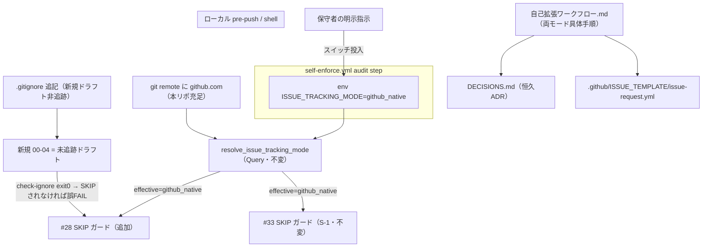
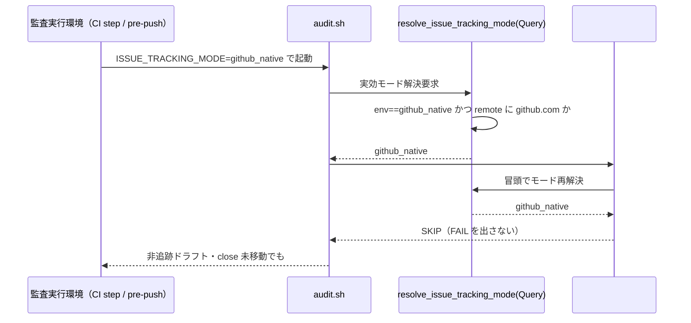
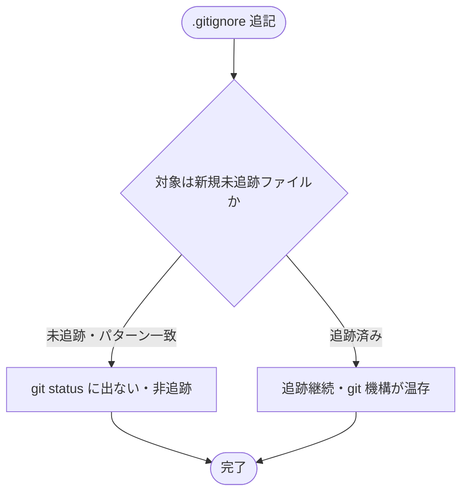

# 設計書: S-2 本リポ github_native 採用（スイッチ投入・非追跡化・両モード手順化・決定ログ／Issue Forms 新設）

**プロジェクト名**: S-2 本リポ github_native 採用（親: issue 運用ポリシーの GitHub Issue 中心への全面移行）
**作成日**: 2026 年 07 月 17 日
**最終更新**: 2026 年 07 月 17 日

> **重要**: **このドキュメントは常に更新**: 設計の変更や追加があった場合は、即座にこのドキュメントを更新してください。ドキュメントは「生きているドキュメント」として扱い、実装内容と常に同期させます。
>
> - 本 issue は親 issue（GitHub Issue **#115**）のサブ issue **S-2**（`90_issues/` 配下）である。正本の要求・要件は [`00_要求定義.md`](./00_要求定義.md)・[`01_要件定義.md`](./01_要件定義.md)（**01 を要件の正本**とする）。本設計は 01 の AC1〜AC8・BDD シナリオ 1〜8 を入力とする。
> - **用語**: [.agent-skill-chain/source/CONCEPTS.md §用語規約](../../../../../../.agent-skill-chain/source/CONCEPTS.md#用語規約) を参照。

---

## 1. 設計概要

**必須**: 設計方針・原則は [.agent-skill-chain/source/spec/01\_設計原則.md](../../../../../../.agent-skill-chain/source/spec/01_設計原則.md) を先に参照した上で、本プロジェクトに適用するものを選び記載する。

### 1.1 設計方針

本 issue は新規コードモジュールではなく、**本リポジトリの既存 enforcement 資産（S-1 の `resolve_issue_tracking_mode`／#33 ガード）と source 抽象契約（S-3）に整合する「本リポ固有の設定・運用ファイル群」を、既存境界を壊さずに投入する**設計である。既存の審査済みロジック（`resolve_issue_tracking_mode`・#33 本体・その他 audit チェック）は不変とし、変更は本リポ固有の project／`.gitignore`／`.github/`／決定ログと、非追跡化と直接衝突する **audit.sh #28 への 1 箇所の SKIP ガード追加**に限定する（最小差分・回帰安全）。

### 1.2 設計原則（本プロジェクトで適用するもの）

- **単一責務**: 各成果物を 1 責務に割り当てる（`.gitignore`＝非追跡パターンのみ／`自己拡張ワークフロー.md`＝本リポ具体手順のみ／`DECISIONS.md`＝恒久 ADR のみ／Issue Forms＝手動起票の構造強制のみ／#28 ガード＝非追跡ドラフトとの衝突解消のみ）。責務を跨ぐ記述を持ち込まない。
- **明確な境界**: 抽象（source＝配布物契約・**変更しない**）／具体（project＝本リポ固有手順）／強制（audit.sh＝機械検知）／設定シグナル（env `ISSUE_TRACKING_MODE`）の 4 境界を維持する。本リポ固有の切替が配布物 source の既定挙動へ波及しないことを不変条件とする（AC8）。
- **CQRS（Command/Query 分離）**: モード解決（`resolve_issue_tracking_mode`）と #28/#33 の判定は**副作用のない Query**（DB・FS へ書き込まない）に徹する。状態変更（Command）は env 設定・ファイル投入という人間主導の恒常トグルに限定し、監査ロジックへ状態変更を持ち込まない。
- **AIフレンドリー設計**: 小さなファイル・明確な責務・意図が分かる命名・深すぎない構造。本リポ固有の具体手順は `自己拡張ワークフロー.md` の既存節構成に沿って両モード分岐を明示し、進行役エージェントが実効モードから手順を一意に辿れるようにする。

---

## 2. アーキテクチャ設計

### 2.1 責務・境界・参照関係

#### 2.1.1 責務一覧

| コンポーネント | 責務（1 文） |
| -------------- | ------------ |
| `.gitignore`（ルート・追記） | 本リポの**新規**ローカル issue ドラフト（`docs/maintainer/workflow/**` 配下の 00〜04）を git 非追跡にする（既存追跡ファイルは巻き込まない）。 |
| `.agent-skill-chain/project/自己拡張ワークフロー.md`（改訂） | 本リポ固有の `github_native`／`local_tracked` 両モードの起票〜完了具体手順（本文完全転記・図の転記・close 移動の local_tracked 専用化・スイッチ投入先）を集約する。 |
| `docs/maintainer/decisions/DECISIONS.md`（新設） | 非追跡化後も設計判断を永続保存する git 追跡の恒久 ADR 記録先（最小集合＋記録手順）。 |
| `.github/ISSUE_TEMPLATE/issue-request.yml`（新設） | GitHub Web UI 手動起票を Issue Forms の `required` 機構で構造強制する（AI 起票・audit・hook からは読まれない）。 |
| `audit.sh#28`（`check_issue_doc_in_gitignored_path`・SKIP ガード 1 箇所追加） | 実効モードが `github_native` のとき冒頭 SKIP し、非追跡ドラフトとの誤 FAIL（偽陽性）を解消する（S-1 の #33 と同型・本体ロジックは不変）。 |
| env `ISSUE_TRACKING_MODE`（スイッチ投入先の確定） | 本リポの実効モードを `github_native` に切り替える設定シグナル。CI（self-enforce.yml）step env とローカル pre-push／シェルへ配線する。 |

#### 2.1.2 境界

- **入力**: 人間（保守者）の明示指示（スイッチ投入・非追跡化の採用判断）、01 の AC1〜AC8、S-1（`resolve_issue_tracking_mode`／#33 ガード）と S-3（source 抽象契約・汎用 Issue Forms 雛形）の確定成果。
- **出力**: 本リポ実効 `github_native` 化・新規ドラフト非追跡・両モード具体手順・恒久 ADR 記録先・手動起票 Forms・#28 の非追跡ドラフト誤 FAIL 解消。
- **他責務との境界（本 issue の範囲外）**: (a) `resolve_issue_tracking_mode`・#33 本体・source 抽象契約の新設／改変（S-1／S-3 スコープ・**不変**）、(b) self-enforce.yml の #36 `PR_BODY` 配線・audit step のブロッキング化（別 issue への申し送り。00 §4.2）、(c) 消費者環境向け配布物 source の既定値変更（波及禁止）。

#### 2.1.3 参照関係

- `audit.sh#28` → `resolve_issue_tracking_mode`（実効モード解決の再利用。新規判定を作らない）
- `self-enforce.yml`（audit step）→ `audit.sh`（env `ISSUE_TRACKING_MODE=github_native` を付与して呼ぶ）
- ローカル `.git/hooks/pre-push`（未追跡・pre-push.example 由来）→ `audit.sh`（env を付与して呼ぶ）
- `自己拡張ワークフロー.md` → `DECISIONS.md`・`.github/ISSUE_TEMPLATE/`・`.gitignore`（本リポ具体手順が参照する運用対象）
- `.github/ISSUE_TEMPLATE/issue-request.yml` → `enforcement/github/issue-request.example.yml`（S-3 雛形をコピー元とする）
- 循環参照なし（監査は解決関数を一方向に参照。設定・ドキュメントは監査ロジックへ依存を戻さない）。

### 2.2 システムアーキテクチャ

- **採用パターン**: 二重モード（dual-mode）＋単一設定シグナル（single switch）＋境界分離（抽象 source／具体 project／強制 audit）。
- **根拠**: spec/06 の優先順位（可読性＞単一責務＞仕様整合）と spec/01 の明確な境界・単一責務に従い、切替を単一 env に集約し、審査済みロジックの改変を #28 の 1 箇所に最小化する（変更容易性・保守性より仕様整合と回帰安全を優先）。

#### 2.2.1 CQRS（Command/Query 分離）

- **Command（状態変更・人間主導）**: env `ISSUE_TRACKING_MODE=github_native` の投入、`.gitignore` パターン追加、`DECISIONS.md`／Forms の新設。いずれも人間の明示指示に基づく恒常トグル・ファイル投入であり、AI 自律設定は禁止（C4）。
- **Query（副作用なし）**: `resolve_issue_tracking_mode`（env×remote → 実効モード）、#28／#33 の判定。DB・FS へ一切書き込まない（既存設計を踏襲・不変）。

#### 2.2.2 アーキテクチャ図



### 2.3 コンポーネント構成

明確な境界（設定シグナル層＝env／解決層＝`resolve_issue_tracking_mode`〈不変〉／強制層＝audit#28・#33／運用ドキュメント層＝project・DECISIONS・Forms／非追跡制御層＝`.gitignore`）で構成し、各コンポーネントは §2.1.1 の単一責務を満たす。切替の唯一の設定面は env `ISSUE_TRACKING_MODE` に集約し、解決層は 2 因子（env × github.com remote）のみで決定論的に実効モードを返す（A5）。強制層は解決層を参照するのみで、解決層・設定層へ依存を戻さない。

### 2.4 データフロー

本 issue は原則同期処理でありイベント発行は導入しない（spec/06「単純な同期処理で十分な場合は無理にイベント駆動を導入しない」）。実効モード解決 → 監査分岐の一方向フローを次に示す。



### 2.5 横断設計判断（ADR）

重要判断を [EVIDENCE_POLICY.md](../../../../../../.agent-skill-chain/source/EVIDENCE_POLICY.md) の ADR 形式（コンテキスト／検討した選択肢／決定／根拠[evidence_source 付き]／帰結）で記録する。evidence_source の分類定義は [CONCEPTS.md §外部根拠の必須化](../../../../../../.agent-skill-chain/source/CONCEPTS.md#外部根拠の必須化external-anchor) を正本とし複製しない。

#### ADR-S2-1: `.gitignore`・#28 ガード・スイッチ投入の原子的投入順序（最重要）

- **コンテキスト**: fable 助言レビューは「`.gitignore` に 00〜04 パターンを追加した瞬間、実効モードがまだ github_native でなくても、**既存の追跡済み issue ドキュメント**が #28（`check_issue_doc_in_gitignored_path`）の FAIL 対象になる。理由は `git check-ignore -q` がパターン照合のみでファイルの追跡状態を見ないため」と指摘した。この前提が正しければ、非追跡化と #28 ガード追加・スイッチ投入の投入順序を誤ると本リポ監査がロックアウトする。
- **検討した選択肢**:
  - (A) 3 変更（`.gitignore` パターン・#28 github_native SKIP ガード・CI スイッチ）を**同一 PR で原子的に投入**する。
  - (B) **#28 ガード追加を `.gitignore` 投入より先行**させる（別 PR で #28 ガードを先に main へ入れてから非追跡化）。
  - (C) 順序を制約せず個別投入する。
- **決定**: **(A) 同一 PR での原子的投入**を採る。加えて、fable 前提の一部（「既存**追跡済み**ドキュメントが即 FAIL する」）は**実測により否定**されたため、真のリスク（未追跡ドラフトの誤 FAIL）に即して順序制約を再定義する。
- **根拠**:
  - **[evidence_source: observed_runtime]** `git check-ignore -q`（#28 が使用・`--no-index` 無し／`audit.sh:868`）は **git の index を参照する**。tmp 隔離の実測（git 2.43.0）で、`.gitignore` パターンに一致する**追跡済み**ファイルは `git check-ignore -q` が **exit 1（=非 ignore）**を返し #28 の FAIL 対象にならない。**未追跡**の新規ドラフトのみ **exit 0（=ignore 配下）**を返し #28 の FAIL 対象になる（`--no-index` を付けると追跡済みでも exit 0 に反転するが、#28 は付けていない）。ゆえに「`.gitignore` 追加だけで既存追跡ドキュメントが即 FAIL する」という前提は本リポの実機構では成立しない。
  - **[evidence_source: existing_code]** ただし #28 本体（`audit.sh:858-875`）には github_native ガードが無く、`find` で走査した**未追跡**ドラフト（github_native 運用で意図的に生む使い捨てドラフト）は確実に exit 0 → FAIL する（01 A9(a)・C2 と整合）。従って非追跡化を有効化する環境（ローカル作業ツリー・pre-push）では #28 ガードとスイッチが**同時に**効いている必要がある。
  - **[evidence_source: observed_runtime]** CI（`self-enforce.yml` の `actions/checkout`）はクリーン checkout で**追跡ファイルのみ**を展開し未追跡ドラフトは存在しないため、CI 上の #28 はガード有無に関わらず追跡ドキュメント（exit 1）のみを見て安全である。**未追跡ドラフトが同居しうるのはローカル作業ツリー（pre-push）**であり、そこが真の順序制約点である。
- **帰結**:
  - 3 つの**追跡成果物**（ルート `.gitignore` パターン・`audit.sh#28` の github_native SKIP ガード・`self-enforce.yml` audit step の `ISSUE_TRACKING_MODE` env）は**同一 PR で原子的に投入**する（中間状態を main に残さない）。
  - **ローカル pre-push は追跡外の設定面**であるため、pre-push フック採用時に env `ISSUE_TRACKING_MODE=github_native` を**同時に**設定する（`自己拡張ワークフロー.md` に手順化）。env 未設定のまま非追跡ドラフトを作業ツリーに置いて push すると #28 が誤 FAIL しうる（唯一の残余ロックアウト経路）ため、hook 採用と env 設定を一組で行う不変条件とする。
  - フィジビリティ確認済み（実測）。fable 前提の誤りを本 ADR で明示的に是正し、01 A9(a)（未追跡ドラフトが #28 を FAIL させる）は正しいことを確認する。

#### ADR-S2-2: #28 への github_native SKIP ガードの実装方式（S-1 #33 と同型）

- **コンテキスト**: 非追跡ドラフトによる #28 誤 FAIL（ADR-S2-1）を解消する実装が必要。
- **検討した選択肢**: (A) #33（`audit.sh:1076-1079`）と同型の「冒頭で `resolve_issue_tracking_mode`==github_native なら SKIP」ガードを #28 冒頭（既存の非 git SKIP・`WORKFLOW_SCAN_DIRS` 空 SKIP より前、または直後）に 1 箇所追加。 (B) `.gitignore` パターンを #28 の走査対象から除外する特別扱いを追加。 (C) #28 を廃止。
- **決定**: **(A)** S-1 が確立した #33 と同型の冒頭 SKIP ガードを #28 に 1 箇所追加する。
- **根拠**: **[evidence_source: existing_code]** #33 は既に `if [[ "$(resolve_issue_tracking_mode)" == "github_native" ]]; then echo "SKIP: #33…"; return 0; fi` を冒頭ガードとして持つ（`audit.sh:1073-1079`）。同一パターンの横展開は審査済みロジックの再利用であり、`resolve_issue_tracking_mode`・#33 本体・その他チェックを変更しない最小差分（C2 例外の範囲）。(B) は走査ロジックへの分岐追加で複雑化し保守性を損なう。(C) は local_tracked での誤配置検知（#28 本来の責務）を失う。
- **帰結**: `github_native` では #28 が SKIP（`SKIP: #28…github_native…` を stderr 出力・`return 0`）。`local_tracked`・非 GitHub では従来どおり誤配置検知が有効（回帰安全）。SKIP メッセージは #33 の文言に倣い、実効モード条件（env＋github.com remote）を明記する。

#### ADR-S2-3: スイッチ（env `ISSUE_TRACKING_MODE`）の機械的実装先の確定

- **コンテキスト**: 実効モードは env `ISSUE_TRACKING_MODE` と github.com remote の 2 因子で決まる（A5）。本リポの実行環境である **CI（self-enforce.yml）** と **ローカル pre-push フック** のそれぞれで、誰がどこで env を設定するかを確定しなければ「スイッチ投入」が機械的に成立しない。同時に、配布物 source へ書くと消費者へ波及する（C5・AC8 違反）ため、投入先は本リポ限定でなければならない。
- **検討した選択肢**:
  - (A) **CI**: `self-enforce.yml` の「Enforcement audit (non-blocking)」step に `env: ISSUE_TRACKING_MODE: github_native` を付与。**pre-push**: ローカル `.git/hooks/pre-push`（未追跡）内で `export ISSUE_TRACKING_MODE=github_native`、またはシェルプロファイルで export。
  - (B) 配布物 `pre-push.example`／`audit.yml` テンプレート／`audit.sh` の既定値に github_native を焼き込む。
  - (C) `.agent-skill-chain/project/` に env を宣言する設定ファイルを新設し、audit.sh がそれを読む。
- **決定**: **(A)**。CI は `self-enforce.yml` の audit step の `env:` に、ローカルは pre-push フック内 export（またはシェル export）に配線し、両者を `自己拡張ワークフロー.md` に手順化する。source 配布物は変更しない。
- **根拠**:
  - **[evidence_source: existing_code]** `self-enforce.yml` は本リポ専用 CI であり配布物ではない（消費者は `.agent-skill-chain/runtime/templates/github/workflows/audit.yml` を使う）。audit step（`self-enforce.yml:190-197`）は `bash …/audit.sh .` を呼ぶのみで env を渡していない。step の `env:` に 1 行足すのが最小・波及なし。
  - **[evidence_source: existing_code]** pre-push は `enforcement/ci/pre-push.example`（`AGENTS_ROOT/enforcement/ci/audit.sh "."` を呼ぶだけ）を各採用先が `.git/hooks/pre-push` へコピーする運用で、**フック実体は git 追跡外・環境固有**（`.claude/settings.json` の deny ミラーと同じ「本リポでは手動維持」パターン・`自己拡張ワークフロー.md §0.2` 前例）。よって配布 `pre-push.example` を汚さずローカル hook／シェルで export するのが波及なしで正しい。
  - **[evidence_source: observed_runtime]** 本リポ `git remote -v` は `https://github.com/techbeansjp-free/AGENTS.md.git`（github.com を含む）。CI の `actions/checkout` も origin を github.com に設定するため、env=github_native を与えれば CI・ローカル双方で `resolve_issue_tracking_mode` は github_native を返す（A4 充足）。(B) は消費者波及で AC8 違反。(C) は解決層が env 以外の入力を読む改変となり A5（2 因子のみ）を崩し S-1 契約に反する。
- **帰結**: 実効 github_native は「本リポ CI step env ＋ ローカル pre-push/シェル export」の 2 箇所で成立し、配布物 source の既定 `local_tracked` は不変（消費者は unset → local_tracked にフォールバック・AC8）。audit step が `continue-on-error`（非ブロッキング）である現状は不変で、env 付与は #28/#33 の SKIP 出力を実効モードに整合させる（将来ブロッキング化時も正しい）。CI env は ADR-S2-1 の原子的 PR に含める追跡成果物。ローカル export は追跡外・手順化のみ。

#### ADR-S2-4: `.gitignore` 非追跡パターンの設計（過剰 ignore の回避・tracked 温存）

- **コンテキスト**: AC1 は「`docs/maintainer/workflow/**` 配下の 00〜04 を非追跡化し、既存追跡ファイル・`DECISIONS.md`・Forms を巻き込まない」を要求する（C7）。
- **検討した選択肢**: (A) `docs/maintainer/workflow/**/{00_要求定義,01_要件定義,02_設計,03_実装計画,04_review}.md` の 5 明示ファイル名パターン。 (B) `docs/maintainer/workflow/**/0[0-4]_*.md` のワイルドカード。 (C) `docs/maintainer/workflow/**/*.md` 全体。
- **決定**: **(A)** 明示ファイル名 5 パターン（`docs/maintainer/workflow/` 起点・末尾一致）。
- **根拠**: **[evidence_source: observed_runtime]** 追跡済みファイルは git 機構により非追跡化されない（ADR-S2-1 実測。tracked → check-ignore exit 1・`git status` 空・`git ls-files` に残存）ため、パターンが既存追跡ファイルに一致しても履歴は失われない。ただし可読性・意図明確化（spec/06）と過剰 ignore 回避（C7）のため、(C) 全 md 一括は `90_issues.md`・`README.md` 等の追跡対象まで巻き込む意図不明瞭さがあり不可。(B) は `00_システム理解.md` 等 `0[0-4]_*` に一致する周辺ファイルまで含みうる。(A) は 01 AC1 の列挙と一致し #28 の `find`（`00_*.md`〜`04_*.md`）走査対象のうち「正規ドラフト名」だけを非追跡化する意図が明確。
- **帰結**: 新規ドラフト（未追跡・上記 5 名）のみ非追跡。既存追跡 issue・`close/` 配下・`DECISIONS.md`（別パス `docs/maintainer/decisions/`）・Forms（別パス `.github/`）は非対象で追跡継続。`.gitignore` はルートに追記し、既存 `**/memo/*` 等の行は変更しない。

#### ADR-S2-5: 恒久 ADR 記録先 `DECISIONS.md` の構造（最小集合・恒久追跡）

- **コンテキスト**: github_native では close 移動を行わず（A6）、ローカルドラフトは非追跡・破棄されうる（親 #115 参照節）。設計判断の永続記録先が別途必要（A12・2026-07-15 の worktree 削除で 02/03 喪失事故の再発防止）。
- **検討した選択肢**: (A) `docs/maintainer/decisions/DECISIONS.md` 単一追記ファイルに ADR 最小集合（コンテキスト／選択肢／決定／根拠／帰結）で記録。 (B) issue ごとに個別 ADR ファイル。 (C) GitHub Issue コメントのみ。
- **決定**: **(A)** 単一の git 追跡ファイル `docs/maintainer/decisions/DECISIONS.md`。
- **根拠**: **[evidence_source: existing_code]** EVIDENCE_POLICY §節2 が ADR 最小集合 5 要素を定義し、S-3 で source 契約に「恒久 ADR 記録先＝git 追跡の決定ログ」を明記済み（親 S7・受け入れ基準 6）。**[evidence_source: inference_only]** 単一ファイル追記は参照容易性・可読性（spec/06 優先 1）に優れ、非追跡ドラフトが消えても恒久保存される。(B) はファイル増殖で参照性低下、(C) は git 追跡外で喪失リスク（本 issue の趣旨に反する）。
- **帰結**: `DECISIONS.md` は ADR 最小集合の見出しと記録手順を含み git 追跡される。本 ADR-S2-1〜S2-3 等の恒久判断は完了フェーズ（verify-and-close／04_review）で DECISIONS.md へ転記する（AC6/AC7 の確認結果もここへ記録）。`.gitignore` パターンに巻き込まれない（別パス・ADR-S2-4）。

#### ADR-S2-6: 本リポ Issue Forms 実ファイルの新設方式（S-3 雛形からのコピー）

- **コンテキスト**: GitHub Web UI 手動起票に構造強制が無い（親 ADR-9・T7）。S-3 で汎用雛形 `enforcement/github/issue-request.example.yml` を新設済み。
- **検討した選択肢**: (A) S-3 雛形を `.github/ISSUE_TEMPLATE/issue-request.yml` へコピーし本リポで有効化。 (B) 独自 Forms をゼロから作成。
- **決定**: **(A)** S-3 雛形を実効パスへコピーする（必要なら本リポ向け微修正）。
- **根拠**: **[evidence_source: existing_code]** 雛形（`issue-request.example.yml`）は目的・成功基準・受け入れ基準を `validations.required: true`、全体像・フロー／参照を `required: false` とする妥当な Forms スキーマを既に備え、「消費先の `.github/ISSUE_TEMPLATE/issue-request.yml` へコピーして有効化」と自己記述している（AC4 と一致）。雛形の再利用は再発明回避（spec UNIX 哲学）。
- **帰結**: `.github/ISSUE_TEMPLATE/issue-request.yml` が新設され Web UI で選択可能に。AI 起票（`gh issue create --body`）・audit・hook からは読まれず既存フローに非干渉（A7）。git 追跡され `.gitignore` に巻き込まれない（別パス）。

#### ADR-S2-7: 検証は tmp 隔離＋非追跡ドラフトの実作成（`git archive` だけでは偽 PASS）

- **コンテキスト**: SC5〜SC8／AC5〜AC8 の検証は本番自己インストールを避け tmp 隔離で行う（C6・2026-07-11 誤 uninstall 事故防止）。だが `git archive` は追跡ファイルのみをアーカイブするため、非追跡ドラフト存在下の #28 挙動（AC7）を再現できない。
- **検討した選択肢**: (A) `mktemp -d`＋`git archive` で隔離環境を作り、**その中で `.gitignore` 適用後に新規 00〜04 を実ファイル作成**し `git status --porcelain` 空＝非追跡を確認してから audit.sh を走らせる。 (B) `git archive` の展開結果のみで検証する。
- **決定**: **(A)**。非追跡ドラフトは隔離環境内で人工的に実作成して再現する。
- **根拠**: **[evidence_source: observed_runtime]** `git archive` は tracked のみ出力する仕様（C6・01 記載と整合。本設計の実測でも tracked/untracked で check-ignore 挙動が分岐することを確認済み）。(B) では非追跡ドラフトが存在せず #28 が偽 PASS し AC7(a) の実効性を検証できない。
- **帰結**: 検証は「隔離環境構築 → `.gitignore` 適用 → 実ドラフト作成 → 非追跡確認 → `ISSUE_TRACKING_MODE=github_native`＋github.com remote 相当付与 → audit.sh 実行」の手順で行い、#28 SKIP・#33 SKIP・find ベース各チェックの非誤 FAIL・#36 の検知漏れ（設計上の帰結）を観測・記録する。実装フェーズではなく verify-and-close（04_review）で実施し DECISIONS.md へ記録する。

---

## 3. 機能設計

### 3.1 機能 1: ローカルドラフト非追跡化（T3・`.gitignore`）

#### 3.1.1 概要
ルート `.gitignore` に ADR-S2-4 の 5 明示パターンを追記し、新規ローカル issue ドラフトを非追跡化する。

#### 3.1.2 処理フロー


#### 3.1.3 入力・出力
- **入力**: `docs/maintainer/workflow/**` 配下に置かれる新規 00〜04 ファイル。
- **出力**: 未追跡ドラフトは `git status --porcelain` に非表示・`git check-ignore` exit 0。追跡済み・別パス（DECISIONS/Forms）は非対象。

#### 3.1.4 エラーハンドリング
過剰 ignore（既存追跡・`close/`・`90_issues.md`・別パスの巻き込み）を避けるためパターンを 5 明示名に限定（ADR-S2-4）。追加後 `git status --porcelain` に既存追跡 issue の削除（`D `）が出ないことを検証（AC1）。

### 3.2 機能 2: `自己拡張ワークフロー.md` 両モード具体手順化（T2）

#### 3.2.1 概要
`github_native`／`local_tracked` 双方の起票〜完了具体手順節を追記し、実効モードから手順を一意に辿れるようにする。加えてスイッチ投入先（ADR-S2-3）・非追跡化手順・DECISIONS 記録手順を集約する。

#### 3.2.2 処理フロー
進行役が実効モードを解決 →（github_native）本文完全転記で `gh issue create` → 記録は GitHub Issue コメント／チェックリスト → 完了は Issue close で完結（close 移動 PR 不要）。（local_tracked）従来どおりローカル 00〜04 を正本とし完了時 `close/` へ close 移動 PR。

#### 3.2.3 入力・出力
- **入力**: 実効モード（`resolve_issue_tracking_mode` の結果）。
- **出力**: モード別の起票〜完了手順（`grep -q 'github_native'`／`grep -q 'local_tracked'` 両ヒット・AC2）。

#### 3.2.4 エラーハンドリング
抽象（source）との二重記載を避け、原則本文は source を参照し具体値・具体手順のみを project に置く（C2・配置境界）。

### 3.3 機能 3: 決定ログ `DECISIONS.md` 新設（T5）
恒久 ADR 記録先を新設（ADR-S2-5）。ADR 最小集合 5 要素の見出しと記録手順を含み git 追跡させる（AC3）。

### 3.4 機能 4: 本リポ Issue Forms 実ファイル新設（T7）
S-3 雛形をコピーし `.github/ISSUE_TEMPLATE/issue-request.yml` を新設（ADR-S2-6）。必須／任意フィールドの妥当性を検証（AC4）。

### 3.5 機能 5: audit.sh #28 github_native SKIP ガード追加
#28 冒頭に S-1 #33 同型のガードを 1 箇所追加（ADR-S2-2）。github_native で SKIP、local_tracked/非 GitHub で従来検知（AC7(a)）。

#### 3.5.1 エラーハンドリング（回帰安全）
既存 #28 の非 git SKIP・`WORKFLOW_SCAN_DIRS` 空 SKIP・`templates/` 除外・`git check-ignore` exit 0 のみ FAIL の各挙動を変更しない。追加は冒頭ガードのみ。

### 3.6 機能 6: `ISSUE_TRACKING_MODE=github_native` スイッチ投入
CI（self-enforce.yml step env）＋ローカル pre-push/シェル export に配線（ADR-S2-3）。**最後に投入**し、#28 ガード・`.gitignore` と同一 PR で原子的に（ADR-S2-1）。

---

## 4. データ設計

本 issue に DB スキーマは無い。データ契約は (a) `.gitignore` パターン、(b) Issue Forms スキーマ、(c) DECISIONS.md の ADR 構造の 3 つ。

### 4.1 `.gitignore` 追記パターン（契約）
```gitignore
# S-2: ローカル issue ドラフト（00〜04）の非追跡化（github_native 採用）。
# 追跡済みファイルは git 機構により温存され、新規未追跡ドラフトのみ非追跡になる（02_設計 ADR-S2-4）。
docs/maintainer/workflow/**/00_要求定義.md
docs/maintainer/workflow/**/01_要件定義.md
docs/maintainer/workflow/**/02_設計.md
docs/maintainer/workflow/**/03_実装計画.md
docs/maintainer/workflow/**/04_review.md
```
（正確な行・コメント文言は実装フェーズで確定。非対象: `90_issues.md`・別パスの `DECISIONS.md`・`.github/`。）

### 4.2 Issue Forms スキーマ（契約・`.github/ISSUE_TEMPLATE/issue-request.yml`）
| フィールド id | label | `validations.required` |
| ------------- | ----- | ---------------------- |
| purpose | 目的 | true |
| success-criteria | 成功基準 | true |
| acceptance-criteria | 受け入れ基準 | true |
| overview-flow | 全体像・フロー | false |
| references | 参照 | false |
YAML パース可能・`name`/`description`/`body` を持つ（S-3 雛形と同一・AC4）。

### 4.3 DECISIONS.md の ADR 構造（契約）
各 ADR は最小集合 5 見出し（コンテキスト／検討した選択肢／決定／根拠[evidence_source 付き]／帰結）。冒頭に記録手順（いつ・何を・誰が追記するか）を持つ。

---

## 5. API 設計

本 issue の「API」は関数エンドポイントではなく、既存の機械契約（env・シェル関数・監査 SKIP）である。新設・変更する契約面を列挙する。

### 5.1 契約一覧
| 契約 | 種別 | 説明 |
| ---- | ---- | ---- |
| env `ISSUE_TRACKING_MODE` | 設定シグナル | 値 `github_native`/`local_tracked`（既定 `local_tracked`）。本リポは CI step env・ローカル export で `github_native` を投入。 |
| `resolve_issue_tracking_mode` | Query（不変・S-1） | env×github.com remote → 実効モード。**本 issue で変更しない**（参照のみ）。 |
| `check_issue_doc_in_gitignored_path`（#28） | 監査 Query | 冒頭に github_native SKIP ガードを追加（ADR-S2-2）。入力=作業ツリーの 00〜04、出力=exit code（SKIP 時 return 0）。 |

### 5.2 契約詳細
#### 契約1: #28 github_native SKIP ガード
- **入力**: 実効モード（`resolve_issue_tracking_mode` の結果）。
- **出力**: github_native → `SKIP: #28…github_native…` を stderr へ出力し `return 0`（FAIL を出さない）。それ以外 → 既存検知ロジックへ進む。
- **契約違反（境界外）の扱い**: 非 git ツリー・`WORKFLOW_SCAN_DIRS` 空は既存の後続 SKIP がそのまま担保（ガード追加で既存 SKIP を壊さない）。env 不正値・remote に github.com 無しは `resolve_issue_tracking_mode` が `local_tracked` を返し従来検知へフォールバック（ロックアウトしない）。

#### 契約2: スイッチ投入面（env）
- **CI**: `self-enforce.yml` audit step の `env: { ISSUE_TRACKING_MODE: github_native }`。
- **ローカル pre-push**: `.git/hooks/pre-push`（未追跡）内 export、またはシェル export。
- **エラー方針**: env 未設定・github.com remote 不在では実効 `local_tracked` にフォールバック（AC8・非波及）。

---

## 6. テスト戦略

テスト戦略の観点定義は [RULES.md §テスト戦略必須要件](../../../../../../.agent-skill-chain/source/RULES.md#テスト戦略必須要件)、BDD 形式は [TEST_BDD_FORMAT.md](../../../../../../.agent-skill-chain/source/TEST_BDD_FORMAT.md) を参照。本 issue はコード関数の単体ではなく**設定・監査挙動の検証**が中心のため、単体＝静的検査（grep/YAML パース/`git check-ignore`）、結合/受け入れ＝tmp 隔離での audit.sh 実挙動（ADR-S2-7）で担保する。

### 6.1 対象ごとのテスト割り当て
| 対象 | 単体 | 結合/API | E2E | クリティカル観点 | バリデーション観点 | 未達理由/補足 |
| ---- | ---- | -------- | --- | ---------------- | ------------------ | ------------- |
| `.gitignore` 非追跡化（AC1） | ○ | ○ | × | 新規ドラフト非追跡・既存追跡温存 | パターン過剰 ignore 無し | E2E 不要（静的＋`git status`） |
| `自己拡張ワークフロー.md` 両モード（AC2） | ○ | × | × | github_native/local_tracked 分岐存在 | 本文完全転記/close 分岐記載 | grep 検査 |
| `DECISIONS.md`（AC3） | ○ | × | × | git 追跡・ADR 5 見出し | 非追跡巻き込み無し（check-ignore exit1） | — |
| Issue Forms（AC4） | ○ | × | × | 必須/任意 required 妥当 | YAML パース可 | Web UI submit は GitHub 側契約（対象外） |
| #28 SKIP ガード（AC7(a)） | ○ | ○ | × | github_native で SKIP・FAIL 0 | local_tracked で従来検知（回帰） | tmp 隔離＋非追跡ドラフト実作成 |
| スイッチ実効・#33 SKIP（AC5/AC6） | ○ | ○ | × | resolve→github_native・#33 SKIP | close 未移動でも #33 起因 FAIL 0 | tmp 隔離（C6） |
| 非波及（AC8） | ○ | ○ | × | unset→local_tracked | source 既定値差分無し | tmp 隔離 |

### 6.2 監査・レビューでの確認（証跡）
§6.1 の割当と 03 §2 タスク別テスト観点・BDD が 1:1 対応することを確認する。tmp 隔離検証の結果は verify-and-close の 04_review と `DECISIONS.md` に記録する（AC6/AC7）。

---

## 7. UI 設計

一般的な画面 UI は無い。唯一の UI 面は **GitHub Web UI の Issue Forms**（`.github/ISSUE_TEMPLATE/issue-request.yml`）である。New Issue 画面で本フォームが選択肢として表示され、`required: true` フィールド未入力時は GitHub 側が submit を拒否する（GitHub の既存機構が保証・本リポ自動テスト対象外・A7）。フォーム構造は §4.2 を参照。

---

## 8. セキュリティ設計

### 8.1 認証・認可
`ISSUE_TRACKING_MODE` を含む enforcement 関連 env の **AI 自律設定を禁止**する（C4・[AGENT_CONDUCT.md §enforcement ゲートの自己無効化禁止](../../../../../../.agent-skill-chain/source/AGENT_CONDUCT.md)）。本 issue のスイッチ投入は「人間が判断した正当な project 恒常トグル運用」に該当し禁止対象外。その根拠を DECISIONS.md に記録する。

### 8.2 データ保護
成果物・記述例・Forms・DECISIONS・`.gitignore` にトークン実値を残さない（C8）。`gh` 認証はホスト既存認証に従い実値をログ・DB・memo・本書に残さない。

---

## 9. 非機能要件への対応

### 9.1 パフォーマンス
`.gitignore`／ドキュメント／設定ファイル追加のみで特筆すべき性能要件なし。#28 ガードは冒頭 1 分岐で追加コスト無視可能。

### 9.2 可用性（互換性・ロックアウト非発生）
既定 `local_tracked`・非 GitHub フォールバックを不変とし、切替を本リポ CI step env／ローカル hook に閉じる（AC8・C5）。唯一の残余ロックアウト経路（ローカルで env 未設定のまま非追跡ドラフトを push）は ADR-S2-1 の「hook 採用と env 設定を一組」で回避する。

---

## 10. 参考資料

### プロジェクトドキュメント
- [`00_要求定義.md`](./00_要求定義.md) - 要求定義（SC1〜SC8）
- [`01_要件定義.md`](./01_要件定義.md) - 要件定義（AC1〜AC8・BDD シナリオ 1〜8・**要件の正本**）
- [`03_実装計画.md`](./03_実装計画.md) - 実装計画（本設計から生成）
- 親 [`90_issues.md`](../../90_issues.md)（S-1/S-2/S-3 の位置づけ・依存順）

### その他の参考資料
- 親 issue GitHub Issue **#115**（成功基準 S1〜S8・受け入れ基準・全体像フロー）
- S-1: `audit.sh` の `resolve_issue_tracking_mode`（`audit.sh:1052-1060`）・#33 SKIP ガード（`audit.sh:1076-1079`）・PR #116
- S-3: source 抽象契約・汎用 Issue Forms 雛形 `enforcement/github/issue-request.example.yml`・PR #121
- 本設計のフィジビリティ実測（git 2.43.0・tmp 隔離・observed_runtime）: `git check-ignore -q` は index を参照し tracked→exit1／untracked→exit0

---

## 11. 前のステップ
- **前**: [`01_要件定義.md`](./01_要件定義.md) - 要件定義フェーズ（requirement-discovery 完了・PR #125 マージ済み）

---

## 12. 次のステップ
- **次**: [`03_実装計画.md`](./03_実装計画.md) - 実装計画フェーズ
- 本 command（design-feature）完了後、implement-feature 着手前に **review-docs（実装前ドキュメントレビュー）** を必ず経ること（full/standard 必須ゲート）。
