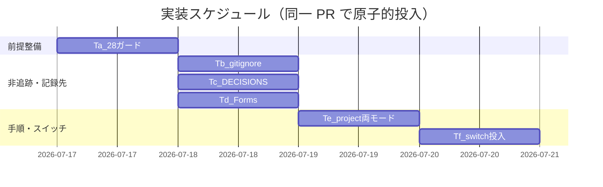

# 実装計画書: S-2 本リポ github_native 採用（スイッチ投入・非追跡化・両モード手順化・決定ログ／Issue Forms 新設）

**プロジェクト名**: S-2 本リポ github_native 採用（親: issue 運用ポリシーの GitHub Issue 中心への全面移行）
**作成日**: 2026 年 07 月 17 日
**最終更新**: 2026 年 07 月 17 日

> **重要**: **このドキュメントは常に更新**。実装計画・進捗・バグの記録があれば即時更新する。
> **必須項目**: 各タスクの「テスト観点」「単体テスト仕様（BDD）」は具体ケースを 1 件以上記載する。
> **用語**: [.agent-skill-chain/source/CONCEPTS.md §用語規約](../../../../../../.agent-skill-chain/source/CONCEPTS.md#用語規約) を参照。設計の正本は [`02_設計.md`](./02_設計.md)、要件の正本は [`01_要件定義.md`](./01_要件定義.md)。

---

## 1. 実装概要

### 1.1 実装方針（必須）
02_設計の ADR-S2-1〜S2-7 に従い、既存審査済みロジック（`resolve_issue_tracking_mode`・#33 本体・その他 audit チェック・source 抽象契約）を不変とし、変更を本リポ固有ファイル＋ #28 の 1 箇所ガードに限定する。**追跡 3 成果物（`.gitignore` パターン・#28 ガード・self-enforce.yml の CI env スイッチ）は同一 PR で原子的に投入**し（ADR-S2-1）、スイッチ（env 実効化）を**最後**に成立させる。検証は tmp 隔離で非追跡ドラフトを実作成して行う（ADR-S2-7・verify-and-close 側）。

### 1.2 実装順序（必須: 1 件以上）
1. **T-a**: audit.sh #28 github_native SKIP ガード追加（最優先＝非追跡化の前提を先に整える・ADR-S2-1/S2-2）
2. **T-b**: ルート `.gitignore` 非追跡化パターン追加（T3・ADR-S2-4）
3. **T-c**: `docs/maintainer/decisions/DECISIONS.md` 新設（T5・ADR-S2-5）
4. **T-d**: `.github/ISSUE_TEMPLATE/issue-request.yml` 新設（T7・ADR-S2-6）
5. **T-e**: `自己拡張ワークフロー.md` 両モード具体手順化＋スイッチ／非追跡化／DECISIONS 記録手順の集約（T2・ADR-S2-3）
6. **T-f**: スイッチ投入 = self-enforce.yml audit step の `env: ISSUE_TRACKING_MODE: github_native`（**最後**・ローカル pre-push/shell 手順は T-e に記載・ADR-S2-3）



---

## 2. タスク分解

**必須**: 各タスクに「テスト観点（2.x.3）」「単体テスト仕様（BDD）（2.x.4）」を記載する。観点定義は [02_設計 §6](./02_設計.md)・[RULES §テスト戦略](../../../../../../.agent-skill-chain/source/RULES.md#テスト戦略必須要件)・[TEST_BDD_FORMAT.md](../../../../../../.agent-skill-chain/source/TEST_BDD_FORMAT.md) を参照。本書はタスクごとの具体ケースのみ記載する。

### 2.1 タスク T-a: audit.sh #28 github_native SKIP ガード追加

#### 2.1.1 概要（必須）
`check_issue_doc_in_gitignored_path`（#28・`audit.sh:858-875`）冒頭に、実効モード github_native 時の SKIP ガード（S-1 #33 と同型）を 1 箇所追加し、非追跡ドラフトによる誤 FAIL を解消する。

#### 2.1.2 実装内容（必須: 1 件以上）
- #28 関数冒頭（既存の非 git SKIP 直後）に `if [[ "$(resolve_issue_tracking_mode)" == "github_native" ]]; then echo "SKIP: #28…（実効モードが github_native のため。ISSUE_TRACKING_MODE=github_native かつ github.com remote 検出・02_設計 ADR-S2-2）" >&2; return 0; fi` を追加。
- `resolve_issue_tracking_mode`・#33 本体・#28 の既存検知ロジック（`find`・`git check-ignore -q` exit0 のみ FAIL・`templates/` 除外）は変更しない。
- SKIP メッセージ文言は #33（`audit.sh:1077`）の様式に倣う。

#### 2.1.3 テスト観点（必須）
##### 単体（具体ケース・必須 1 件以上）
- `ISSUE_TRACKING_MODE=github_native`＋github.com remote 下で #28 が SKIP 行を stderr 出力し `return 0`（正常系）。
- `ISSUE_TRACKING_MODE` unset（local_tracked）下で、gitignore 配下に置いた未追跡 00〜04 を #28 が従来どおり FAIL 検知する（回帰・異常系）。
##### 結合/API（該当時 1 件以上）
- audit.sh 全体を github_native で実行し #28 起因 FAIL が 0 件（EXIT_CODE 非 1）。tmp 隔離＋非追跡ドラフト実作成（ADR-S2-7）。
##### E2E/受け入れ
- AC7(a) の tmp 隔離検証（verify-and-close で実施）。本タスク単体では tmp 隔離のシェル検証で代替。
##### バリデーション
- 該当なし（分岐追加のみ・入力バリデーション無し）。

#### 2.1.4 単体テスト仕様（BDD）（必須）
```gherkin
Feature: audit.sh #28 の github_native SKIP ガード（01 シナリオ7）
  Scenario: 実効 github_native では非追跡ドラフトがあっても #28 は SKIP する
    Given tmp 隔離環境で ISSUE_TRACKING_MODE=github_native かつ git remote に github.com を含む
    And .gitignore 適用後に docs/maintainer/workflow 配下へ未追跡の 00〜04 を実作成し git status --porcelain が空
    When audit.sh の #28 を実行する
    Then stderr に "SKIP: #28…github_native…" が出力され #28 起因の FAIL が 0 件になる
```
```bash
# Given: tmp 隔離環境を作り github_native かつ github.com remote 相当を用意し、未追跡ドラフトを実作成する
tmp=$(mktemp -d); (cd "$repo" && git archive HEAD) | tar -x -C "$tmp"
(cd "$tmp" && git init -q && git remote add origin https://github.com/x/y.git)
mkdir -p "$tmp/docs/maintainer/workflow/_probe_"; echo draft > "$tmp/docs/maintainer/workflow/_probe_/00_要求定義.md"
# When: github_native を投入して #28 を実行する
out=$(cd "$tmp" && ISSUE_TRACKING_MODE=github_native bash .agent-skill-chain/source/enforcement/ci/audit.sh . 2>&1)
# Then: #28 が SKIP 行を出し #28 起因 FAIL が無い
echo "$out" | grep -q 'SKIP: #28' && ! echo "$out" | grep -q 'FAIL:.*gitignore 配下'
```

#### 2.1.5 依存関係
- 依存先: S-1（`resolve_issue_tracking_mode`・#33 ガード・PR #116 マージ済み）。
- 依存元（本タスクを前提）: T-b（`.gitignore`）・T-f（スイッチ）。ADR-S2-1 により同一 PR。

#### 2.1.6 見積もり
- **工数**: 0.5h（1 分岐追加＋tmp 隔離検証）／**優先度**: 高

### 2.2 タスク T-b: ルート `.gitignore` 非追跡化パターン追加

#### 2.2.1 概要（必須）
新規ローカル issue ドラフト（`docs/maintainer/workflow/**` 配下の 00〜04）を非追跡化する 5 明示パターンをルート `.gitignore` へ追記する（ADR-S2-4）。

#### 2.2.2 実装内容（必須: 1 件以上）
- 02_設計 §4.1 の 5 パターン（`docs/maintainer/workflow/**/00_要求定義.md`〜`.../04_review.md`）＋意図コメントをルート `.gitignore` 末尾へ追記。
- 既存行（`**/memo/*`・`/.agent-skill-chain/runtime/*` 等）は変更しない。

#### 2.2.3 テスト観点（必須）
##### 単体（具体ケース・必須 1 件以上）
- 未追跡ドラフト `docs/maintainer/workflow/_probe_/00_要求定義.md` を置くと `git check-ignore` exit 0・`git status --porcelain` 空。
- 既存追跡 issue（この S-2 の 00/01 等）が `git status --porcelain` に削除（`D `）で現れない・`git ls-files` に残存。
##### 結合/API
- `git ls-files docs/maintainer/decisions/DECISIONS.md .github/ISSUE_TEMPLATE/` が追跡を返し続ける（別パス非巻き込み）。
##### E2E/受け入れ
- AC1（verify-and-close）。単体で `git status`／`git check-ignore` により代替検証。
##### バリデーション
- パターンが `90_issues.md`・`README.md` に一致しない（過剰 ignore 無し・C7）。

#### 2.2.4 単体テスト仕様（BDD）（必須）
```gherkin
Feature: 新規ローカルドラフトの非追跡化（01 シナリオ1）
  Scenario: 新規ドラフトは非追跡・既存追跡は温存
    Given .gitignore の非追跡パターンが新規ドラフト 00〜04 に限定されている
    When docs/maintainer/workflow 配下に新規 _probe_/00_要求定義.md を置く
    Then 新規ドラフトは git check-ignore exit 0・git status 空、既存追跡 issue と別パスは追跡され続ける
```
```bash
# Given: .gitignore に S-2 パターン追記済み
# When: 新規未追跡ドラフトを配置する
mkdir -p docs/maintainer/workflow/_probe_; echo x > docs/maintainer/workflow/_probe_/00_要求定義.md
# Then: 未追跡ドラフトは ignore され、追跡ファイルは status に削除として出ない
git check-ignore -q docs/maintainer/workflow/_probe_/00_要求定義.md && [ -z "$(git status --porcelain docs/maintainer/workflow/_probe_/00_要求定義.md)" ]
[ -z "$(git status --porcelain | grep -E '^ ?D .*docs/maintainer/workflow/')" ]
```

#### 2.2.5 依存関係
- 依存先: T-a（#28 ガードが先に整うことで、非追跡ドラフト存在時も誤 FAIL しない・ADR-S2-1）。
#### 2.2.6 見積もり
- **工数**: 0.3h／**優先度**: 高

### 2.3 タスク T-c: `docs/maintainer/decisions/DECISIONS.md` 新設

#### 2.3.1 概要（必須）
恒久 ADR 記録先を新設し git 追跡させる（ADR-S2-5・T5）。

#### 2.3.2 実装内容（必須: 1 件以上）
- `docs/maintainer/decisions/DECISIONS.md` を新設。冒頭に記録手順（いつ・何を・誰が追記するか）、続けて ADR 最小集合 5 見出し（コンテキスト／検討した選択肢／決定／根拠[evidence_source]／帰結）のテンプレート節を置く。
- `git add` して追跡させる（`.gitignore` に巻き込まれない別パスであることを確認）。

#### 2.3.3 テスト観点（必須）
##### 単体（具体ケース・必須 1 件以上）
- `git ls-files docs/maintainer/decisions/DECISIONS.md` が 1 行返す。
- ADR 最小集合 5 要素の見出し語が `grep` で存在。
##### 結合/API
- `git check-ignore docs/maintainer/decisions/DECISIONS.md` が exit 1（非 ignore・非巻き込み）。
##### E2E/受け入れ
- AC3（verify-and-close）。
##### バリデーション
- 記録手順節が非空（プレースホルダのままでない）。

#### 2.3.4 単体テスト仕様（BDD）（必須）
```gherkin
Feature: 恒久 ADR 記録先の新設（01 シナリオ3）
  Scenario: DECISIONS.md が追跡され ADR 最小集合を含む
    Given github_native では close 移動を行わず永続記録先が別途必要
    When DECISIONS.md を新設し git add する
    Then git ls-files が当該ファイルを返し、ADR 最小集合 5 見出しが存在し、非追跡パターンに巻き込まれない
```
```bash
# Given/When: DECISIONS.md を新設し追跡させる（実装で作成）
# Then: 追跡され・5 見出しを持ち・ignore されない
git ls-files docs/maintainer/decisions/DECISIONS.md | grep -q DECISIONS.md
grep -qE 'コンテキスト' docs/maintainer/decisions/DECISIONS.md && grep -qE '検討した選択肢' docs/maintainer/decisions/DECISIONS.md
git check-ignore -q docs/maintainer/decisions/DECISIONS.md; [ $? -eq 1 ]
```

#### 2.3.5 依存関係
- 依存先: なし（独立作成）。参照: EVIDENCE_POLICY §節2。
#### 2.3.6 見積もり
- **工数**: 0.5h／**優先度**: 高

### 2.4 タスク T-d: `.github/ISSUE_TEMPLATE/issue-request.yml` 新設（Issue Forms）

#### 2.4.1 概要（必須）
S-3 汎用雛形をコピーし本リポ手動起票を構造強制する Forms を新設する（ADR-S2-6・T7）。

#### 2.4.2 実装内容（必須: 1 件以上）
- `enforcement/github/issue-request.example.yml` を `.github/ISSUE_TEMPLATE/issue-request.yml` へコピー（コメント冒頭の「雛形／コピー先」注記は実ファイル向けに調整可）。
- フィールド required 設計（目的／成功基準／受け入れ基準=true、全体像・フロー／参照=false）を維持。

#### 2.4.3 テスト観点（必須）
##### 単体（具体ケース・必須 1 件以上）
- `.github/ISSUE_TEMPLATE/issue-request.yml` が YAML パース可能。
- purpose/success-criteria/acceptance-criteria の `validations.required: true`、overview-flow/references が false。
##### 結合/API
- `name`/`description`/`body` キーを持つ妥当な Forms スキーマ。
##### E2E/受け入れ
- Web UI submit 拒否は GitHub 側契約（本リポ自動テスト対象外・A7）。AC4（verify-and-close）。
##### バリデーション
- トークン実値・機密を含まない（C8）。

#### 2.4.4 単体テスト仕様（BDD）（必須）
```gherkin
Feature: GitHub Issue Forms の新設（01 シナリオ4）
  Scenario: Forms が妥当なスキーマで必須/任意フィールドを持つ
    Given Issue Forms は手動起票のみ構造強制し AI 起票・audit から読まれない
    When .github/ISSUE_TEMPLATE/issue-request.yml を新設し YAML パースと required を検証する
    Then YAML パース可能で 目的/成功基準/受け入れ基準=required true、全体像・フロー/参照=false である
```
```bash
# Given/When: Forms を新設し YAML を検証する
python3 - <<'PY'
# Then: パース可能・required 設計が妥当
import yaml
d=yaml.safe_load(open(".github/ISSUE_TEMPLATE/issue-request.yml"))
req={b["id"]:b.get("validations",{}).get("required",False) for b in d["body"] if "id" in b}
assert req["purpose"] and req["success-criteria"] and req["acceptance-criteria"]
assert not req["overview-flow"] and not req["references"]
print("OK")
PY
```

#### 2.4.5 依存関係
- 依存先: S-3（雛形 `issue-request.example.yml`・PR #121 マージ済み）。
#### 2.4.6 見積もり
- **工数**: 0.3h／**優先度**: 高

### 2.5 タスク T-e: `自己拡張ワークフロー.md` 両モード具体手順化＋スイッチ／非追跡化／DECISIONS 集約

#### 2.5.1 概要（必須）
本リポ固有の `github_native`／`local_tracked` 両モードの起票〜完了具体手順と、スイッチ投入先（ADR-S2-3）・非追跡化・DECISIONS 記録手順を `自己拡張ワークフロー.md` に集約する（T2・C2 配置境界）。

#### 2.5.2 実装内容（必須: 1 件以上）
- 両モード分岐節を追記: github_native＝「起票時に目的・成功基準・受け入れ基準（＋理解に必要な図）を GitHub Issue 本文へ完全転記」「完了は Issue close で完結（close 移動 PR 不要）」／local_tracked＝「従来の close 移動 PR」。
- スイッチ投入先の手順を明記: CI＝`self-enforce.yml` audit step の `env: ISSUE_TRACKING_MODE: github_native`／ローカル＝`.git/hooks/pre-push` 内 export またはシェル export（hook 採用と env 設定を一組・ADR-S2-1 残余ロックアウト回避）。
- 非追跡化（`.gitignore`）・DECISIONS.md 記録手順・github_native スイッチが「人間判断の正当なトグル運用」である旨（C4）を参照付きで集約。source 抽象原則は二重記載せず参照のみ（C2）。

#### 2.5.3 テスト観点（必須）
##### 単体（具体ケース・必須 1 件以上）
- `grep -q 'github_native'` と `grep -q 'local_tracked'` が両ヒット。
- github_native 節に「完全転記」「close で完結」、local_tracked 節に「close 移動 PR」が `grep` で存在。
- スイッチ投入先（self-enforce.yml env・pre-push export）の記載が存在。
##### 結合/API
- source 抽象原則の逐語重複が無い（参照リンクで解決・C2）。
##### E2E/受け入れ
- AC2（verify-and-close）。
##### バリデーション
- トークン実値を含まない（C8）。

#### 2.5.4 単体テスト仕様（BDD）（必須）
```gherkin
Feature: 両モードの起票〜完了手順の具体化（01 シナリオ2）
  Scenario: 自己拡張ワークフロー.md が両モード分岐を具体化する
    Given 抽象=source／具体=project の境界を維持し具体手順は project へ集約する
    When 自己拡張ワークフロー.md を github_native/local_tracked で grep する
    Then 両モード節が存在し、github_native=本文完全転記＋Issue close で完結、local_tracked=close 移動 PR が記載される
```
```bash
# Given/When: project ドキュメントを grep する
f=.agent-skill-chain/project/自己拡張ワークフロー.md
# Then: 両モードと分岐記載・スイッチ投入先が存在する
grep -q 'github_native' "$f" && grep -q 'local_tracked' "$f"
grep -q '完全転記' "$f" && grep -q 'close 移動 PR' "$f"
grep -q 'ISSUE_TRACKING_MODE' "$f" && grep -q 'self-enforce.yml' "$f"
```

#### 2.5.5 依存関係
- 依存先: T-a〜T-d（集約対象の実体が先に存在すると手順が具体化しやすい。ただし記述は並行可）。
#### 2.5.6 見積もり
- **工数**: 1.5h（既存節構成への統合・二重記載回避）／**優先度**: 高

### 2.6 タスク T-f: スイッチ投入（self-enforce.yml audit step env・最後）

#### 2.6.1 概要（必須）
本リポ CI の audit step に `env: ISSUE_TRACKING_MODE: github_native` を付与し、実効モードを github_native に切り替える（ADR-S2-3・**最後に投入**・追跡 3 成果物として同一 PR）。

#### 2.6.2 実装内容（必須: 1 件以上）
- `.github/workflows/self-enforce.yml` の「Enforcement audit (non-blocking)」step（`self-enforce.yml:190-197`）に `env: { ISSUE_TRACKING_MODE: github_native }` を追加。`continue-on-error: true`（非ブロッキング運用）は不変。
- 配布物 source（`pre-push.example`・`audit.yml` テンプレート・audit.sh 既定値）は変更しない（非波及・AC8）。ローカル pre-push/shell の export は手順（T-e）で担保。

#### 2.6.3 テスト観点（必須）
##### 単体（具体ケース・必須 1 件以上）
- `self-enforce.yml` に `ISSUE_TRACKING_MODE: github_native` が audit step 配下で存在（`grep`／YAML パース）。
- tmp 隔離で `ISSUE_TRACKING_MODE=github_native`＋github.com remote 時 `resolve_issue_tracking_mode` が厳密に `github_native` を返す。
##### 結合/API
- github_native 下で #33 が SKIP 行を出し、close 未移動・猶予超過 issue があっても #33 起因 FAIL・EXIT_CODE=1 が出ない（AC5/AC6）。
##### E2E/受け入れ
- AC5/AC6/AC8（verify-and-close・tmp 隔離）。
##### バリデーション
- `ISSUE_TRACKING_MODE` を unset にすると `resolve_issue_tracking_mode` が `local_tracked`（非波及・AC8）。source 配布物に既定値変更差分が無い。

#### 2.6.4 単体テスト仕様（BDD）（必須）
```gherkin
Feature: スイッチ投入で実効 github_native・#33 SKIP（01 シナリオ5/6/8）
  Scenario: github_native 実効化で #33 が SKIP し、unset では local_tracked に戻る
    Given 本リポ git remote は github.com を含み #33 SKIP ガードは S-1 でマージ済み（不変）
    When tmp 隔離で ISSUE_TRACKING_MODE=github_native を設定し audit.sh を実行する
    Then resolve_issue_tracking_mode が github_native を返し #33 が SKIP・#33 起因 FAIL 0 件、unset では local_tracked に戻る
```
```bash
# Given: tmp 隔離＋github.com remote
tmp=$(mktemp -d); (cd "$repo" && git archive HEAD)|tar -x -C "$tmp"
(cd "$tmp" && git init -q && git remote add origin https://github.com/x/y.git)
# When: github_native を投入して audit を実行
out=$(cd "$tmp" && ISSUE_TRACKING_MODE=github_native bash .agent-skill-chain/source/enforcement/ci/audit.sh . 2>&1)
# Then: #33 が SKIP し、unset では local_tracked に戻る（非波及）
echo "$out" | grep -q 'SKIP: #33'
un=$(cd "$tmp" && source .agent-skill-chain/source/enforcement/ci/audit.sh >/dev/null 2>&1; true) # 実際は関数抽出で確認
```

#### 2.6.5 依存関係
- 依存先: T-a（#28 ガード）・T-b（`.gitignore`）と同一 PR で原子的（ADR-S2-1）。**投入は最後**。
#### 2.6.6 見積もり
- **工数**: 0.3h（1 step env 追加）／**優先度**: 高

---

## テスト観点

本実装計画のテスト観点は「(1) 静的検査（grep／YAML パース／`git ls-files`／`git check-ignore`）による成果物構造の確認」と「(2) tmp 隔離での audit.sh 実挙動（非追跡ドラフト実作成を含む・ADR-S2-7）」の 2 層。01 の BDD シナリオ 1〜8 と本書タスクの対応: シナリオ1↔T-b、シナリオ2↔T-e、シナリオ3↔T-c、シナリオ4↔T-d、シナリオ5/6↔T-f、シナリオ7↔T-a、シナリオ8↔T-f（非波及）。回帰保証として local_tracked／非 GitHub 環境で #28・#33 の従来検知が不変であることを必ず確認する。

## 単体テスト

各タスク §2.x.4 の BDD 仕様に単体ケースを定義。コード関数の新規追加は #28 の 1 ガードのみで、他は設定・ドキュメントの構造検査。単体は静的検査で成立し、audit 実挙動は tmp 隔離（結合/受け入れ）で担保する。

## BDD

シナリオ 1〜8 は 01_要件定義 §3.3.2 が正本。本書 §2.x.4 は各タスクに対応する Given/When/Then とシェル検証例を Given/When/Then インラインコメント付きで記載した（TEST_BDD_FORMAT 準拠）。検証コマンドの正本は 01 §3.1（AC 表）とし、本書は観測結果のみ記す。

---

## 3. 実装スケジュール

### 3.1 マイルストーン
| マイルストーン | 期日 | 成果物 |
| -------------- | ---- | ------ |
| M1: 前提整備 | 実装 Day1 | #28 ガード（T-a） |
| M2: 非追跡・記録先・Forms | 実装 Day1 | `.gitignore`（T-b）・DECISIONS.md（T-c）・Forms（T-d） |
| M3: 手順・スイッチ | 実装 Day2 | 両モード手順（T-e）・スイッチ投入（T-f・最後） |
| M4: 検証 | verify-and-close | tmp 隔離 SC5〜SC8 検証・04_review・DECISIONS 記録 |

### 3.2 実装フェーズ
#### フェーズ 1: 追跡 3 成果物＋記録先＋Forms（同一 PR・原子的）
- **タスク**: T-a → T-b/T-c/T-d → T-e → T-f（最後）。ADR-S2-1 により中間状態を main に残さない。

---

## 4. テスト計画

観点・レベル・BDD 定義は 02_設計 §6・RULES・TEST_BDD_FORMAT を参照。各タスク §2.x.3 に具体ケース、§2.x.4 に BDD を記載済み。

### 4.1 テストの優先順位
- クリティカル: #28/#33 の SKIP と回帰（local_tracked 従来検知不変）・非波及（AC8）を厚くテスト。
- 影響範囲が広い箇所（audit.sh・`.gitignore`）は tmp 隔離で回帰確認に必ず含める。

---

## 5. リスク管理

### 5.1 実装リスク
- **リスク**: ローカルで env 未設定のまま非追跡ドラフトを push し #28 が誤 FAIL（唯一の残余ロックアウト経路・02 §9.2）。
  - **対策**: T-e で「pre-push フック採用と env 設定を一組」で手順化（ADR-S2-1）。追跡 3 成果物は同一 PR で原子的投入。
- **リスク**: `.gitignore` パターンが既存追跡・別パスを巻き込む。
  - **対策**: 5 明示パターンに限定（ADR-S2-4）。追加後 `git status --porcelain`／`git ls-files` で温存を確認（AC1）。
- **リスク**: 検証を `git archive` のみで行い非追跡ドラフト不在で偽 PASS（#28）。
  - **対策**: tmp 隔離環境内で `.gitignore` 適用後に実ドラフトを作成し非追跡確認してから audit 実行（ADR-S2-7・C6）。
- **リスク**: スイッチが配布物へ波及し消費者の既定 local_tracked を破壊。
  - **対策**: 投入先を self-enforce.yml（本リポ CI）とローカル hook/shell に限定し source を変更しない（AC8・C5）。

---

## 6. 参考資料

### プロジェクトドキュメント
- [`02_設計.md`](./02_設計.md) - 設計（ADR-S2-1〜S2-7）
- [`01_要件定義.md`](./01_要件定義.md) - 要件（AC1〜AC8・BDD 1〜8）
- [`00_要求定義.md`](./00_要求定義.md) - 要求（SC1〜SC8）
- 親 [`90_issues.md`](../../90_issues.md)（S-2 行・T2/T3/T5/T7）

### その他の参考資料
- 親 GitHub Issue **#115**、S-1（PR #116・audit.sh）、S-3（PR #121・source 契約・雛形）

---

## 7. 前のステップ
- **前**: [`02_設計.md`](./02_設計.md) - 設計フェーズ

---

## 8. 次のステップ
- 本 issue は単一 issue（サブ分割なし）。design-feature 完了後、**review-docs（実装前ドキュメントレビュー・full/standard 必須）** を経てから implement-feature（本計画の T-a〜T-f を同一 PR で実装）へ進む。実装後 verify-and-close で tmp 隔離 SC5〜SC8 検証・04_review 作成・DECISIONS.md への恒久記録を行う。
- **用語**: [.agent-skill-chain/source/CONCEPTS.md §用語規約](../../../../../../.agent-skill-chain/source/CONCEPTS.md#用語規約) を参照。
