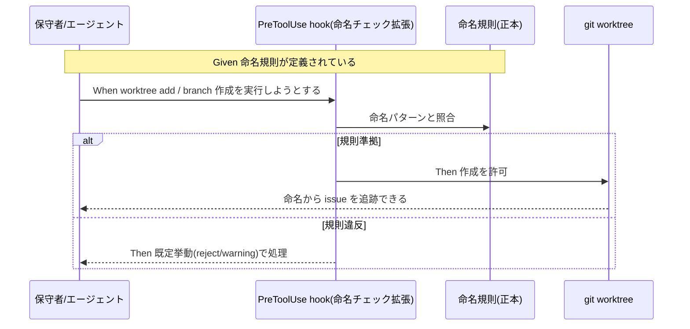
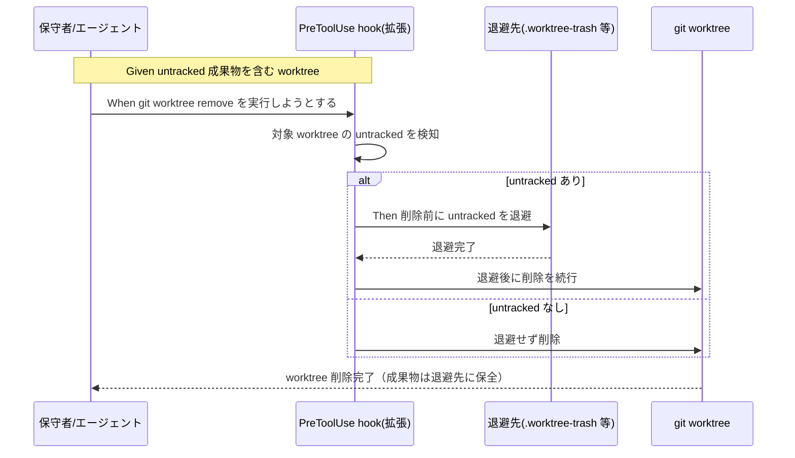

# 要件定義書: worktree 運用規律（命名規則とライフサイクル安全化）

**プロジェクト名**: worktree 運用規律（命名規則とライフサイクル安全化）
**作成日**: 2026 年 07 月 16 日
**最終更新**: 2026 年 07 月 16 日

> **重要**: **このドキュメントは常に更新**: 要件の変更や追加があった場合は、即座にこのドキュメントを更新してください。
>
> **用語**: [.agent-skill-chain/source/CONCEPTS.md §用語規約](../../../../.agent-skill-chain/source/CONCEPTS.md#用語規約) を参照。

---

## 1. 概要

### 1.1 システム概要

本 issue は、git worktree の**運用規律**を、①命名（B）と②削除ライフサイクルの安全化（C）の両面から一体で定める。**B・C いずれも「文書化されたルール」だけでなく「機械強制」を確定要件とする**（ユーザーフィードバック反映）。B は worktree ディレクトリ名・ブランチ名の命名規則（パターン `<type>/<YYYYMMDD_HHMMSS>_<固有名>`、`type`=feature/bugfix/hotfix、evidence_source: human_decision）を新設し、issue との対応追跡性を確保するとともに、規則違反の作成操作を機械的に検知する。C は `git worktree remove` 実行前に untracked 成果物を検知・退避し、2026-07-15 に発生した「未commit成果物の永久ロスト事故」の再発を機械強制で防ぐ。B・C の機械強制はいずれも既存 enforcement 機構（PreToolUse hook・CI audit）の**拡張**として実現し、新設機構は原則作らない。

本 issue は requirement-discovery（00/01）のみで完了とし、設計（02）以降は本フェーズで行わない。

### 1.2 用語集

| 用語 | 説明 |
| -------- | ------ |
| worktree | `git worktree` で main から切り出した独立作業ツリー。本リポではブランチを切って隔離作業する運用（親 §0）。 |
| untracked ファイル | 一度も `git add` されていないファイル。`git worktree remove --force` で無条件消去され、reflog 等で復元不能。 |
| 退避（トラッシュ） | 削除前に untracked 成果物を保全用ディレクトリ（例 `.claude/.worktree-trash/`）へ移す動作。 |
| 削除前チェック | `git worktree remove` 系操作の実行**前**に untracked を検知し退避判断する処理。 |
| PreToolUse hook | ツール実行前に stdin JSON の `tool_input.command` 等を検査し違反を block（exit 2）／許可（exit 0）する既存機構。 |
| 命名規則（B） | worktree ディレクトリ名・ブランチ名が満たすべき規則。パターン `<type>/<YYYYMMDD_HHMMSS>_<固有名>`（`type`=feature/bugfix/hotfix）。命名から対応 issue（または目的）を追跡可能にする。 |
| type | 命名パターン先頭の分類語。`feature`（機能追加）／`bugfix`（不具合修正）／`hotfix`（緊急修正）の 3 種を基準とする一般的な git-flow 系分類（evidence_source: human_decision）。 |
| 機械強制 | 規律を文書化するだけでなく、違反操作を機械的に検知し reject／warning 等の既定挙動で処理すること。B（命名規則違反の検知）・C（untracked 退避）の両方に適用する統一テーマ。 |

---

## 2. 機能要件

### 2.1 ユーザーストーリー

#### ストーリー 1: 命名から issue を追跡できる（B-規則）

- **As a** 複数 worktree を並行運用する保守者／エージェント
- **I want to** worktree ディレクトリ名・ブランチ名を命名規則に沿って付けたい
- **So that** どの worktree／ブランチがどの issue（または目的）に対応するか、名前から一目で追跡でき、取り違えを防げる

**受け入れ基準**:

- 命名規則が正本（`.agent-skill-chain/project/` 優先）に文書化されている（00 SC-1 に対応）。
- 規則は**パターン `<type>/<YYYYMMDD_HHMMSS>_<固有名>`** を採用する。`<type>` は `feature`/`bugfix`/`hotfix` の 3 種を基準とする（evidence_source: human_decision）。`YYYYMMDD_HHMMSS` は既存のプレフィックス取得規約（`TZ=Asia/Tokyo date +%Y%m%d_%H%M%S` 等）を再利用する。例: `feature/20260716_143000_worktree運用規律`。
- **worktree ディレクトリ名についても、ブランチ名と別パターンにする合理的理由がない限り同一パターンを適用する**（統一する方向を確定要件とし、細部の最終確定のみ 02_設計 に委ねてよい）。
- 既存の無秩序な名前の遡及一括改名は要求しない（新規作成分から適用・段階対応）。

#### ストーリー 2: 規則違反の命名が機械的に検知される（B-強制・新規）

- **As a** worktree／ブランチを作成する保守者／エージェント
- **I want to** 命名規則に反する `git worktree add`（またはブランチ作成）を行おうとしたときに機械的に検知してほしい
- **So that** 命名規則が「文書化されただけの申し合わせ」で終わらず、実際に守られる規律として機能する

**受け入れ基準**:

- 規則（`<type>/<YYYYMMDD_HHMMSS>_<固有名>`、`type`=feature/bugfix/hotfix）に反する命名での worktree／ブランチ作成が検知される（00 SC-2）。
- 検知時の既定挙動（reject または warning）が定義されている。**「検知して何らかの形で顕在化させる」こと自体は本 issue で確定し、reject／warning のどちらを既定にするかの最終確定は 02_設計 に委ねてよい**。
- 対象外環境（非 git ツリー等）では fail-safe に倒れ、正常な作成操作を妨げない。
- この機械強制は既存 enforcement hook 機構（PreToolUse）の拡張として実現する（新設機構を原則作らない。00 §4.1 参照）。

#### ストーリー 3: 未commit成果物が削除で消えない（C・中核）

- **As a** worktree を整理・削除する保守者／エージェント
- **I want to** `git worktree remove` の前に untracked 成果物が自動退避されてほしい
- **So that** 「唯一のコピー」だった未commitの 00〜04 等が永久ロストせず、削除後も復元できる

**受け入れ基準**:

- `git worktree remove` 系操作の実行前に、対象 worktree の untracked ファイルの有無を検知する（00 SC-3）。
- untracked が存在する場合、削除前に退避先へ保存してから削除する（または退避が完了するまで削除を止める）。退避後は復元可能である。
- 退避対象は untracked 限定（追跡済みファイルは対象外・00 SC-4）。
- この機械強制は既存 enforcement hook 機構の拡張として実現する（新設機構を原則作らない）。

#### ストーリー 4: 追跡済みのみの worktree は従来どおり消せる（C）

- **As a** worktree を削除する保守者／エージェント
- **I want to** untracked が無い（＝失うものが無い）worktree は退避なしで従来どおり削除したい
- **So that** 過剰な退避で操作が煩雑化・退避先が汚染されない

**受け入れ基準**:

- untracked ファイルが無い worktree の削除は退避を行わず通常どおり完了する（00 SC-4）。

#### ストーリー 5: 退避先が肥大化しない（C）

- **As a** 本リポの保守者
- **I want to** 退避先（トラッシュ）を自動パージしたい
- **So that** 退避先が無制限に肥大化してディスク・リポジトリを圧迫しない

**受け入れ基準**:

- 退避先の自動パージ方針（保持期限・容量等）が定義されている（00 SC-5）。
- 期限・容量を超過した退避エントリが除去される。

#### ストーリー 6: 対象外環境で誤作動しない（互換・非破壊）

- **As a** 本パッケージの消費者／CI
- **I want to** 非 git ツリー環境・GitHub 非採用環境等でゲートが誤作動しないでほしい
- **So that** 既存フローがロックアウト・誤 FAIL しない

**受け入れ基準**:

- 非 git ツリー・対象外環境ではゲートが自然に SKIP される（00 SC-6）。
- 既存 enforcement チェック（#1〜#38 相当）を破壊しない（00 SC-7）。
- hook 内部エラー時は fail-safe（allow 側）に倒し、正常な削除・作成操作を妨げない（evidence_source: existing_code＝`PreToolUse.sh` の `set +e`・「内部エラーは allow に倒す」原則）。

### 2.2 BDD ユースケース

#### ユースケース 1: worktree／ブランチの命名と機械強制（B）

新規に worktree・ブランチを作成する際、命名規則（パターン `<type>/<YYYYMMDD_HHMMSS>_<固有名>`、`type`=feature/bugfix/hotfix）に沿った名前を付け、命名から対応 issue を追跡可能にする。規則に反する命名は機械的に検知される。

**シナリオ 1: 命名規則に沿った worktree を新規作成する**

```gherkin
Feature: worktree／ブランチ命名規則
  Scenario: 規則に沿った命名で worktree を作成する
    Given worktree／ブランチ命名規則（<type>/<YYYYMMDD_HHMMSS>_<固有名>）が正本に定義されている
    And ある issue に対する新しい作業ツリーを作ろうとしている
    When feature/bugfix/hotfix のいずれかの type と、取得規約で得たタイムスタンプ、固有名を組み合わせて worktree ディレクトリ名とブランチ名を決める
    Then 命名から対応 issue（または目的）を追跡できる
    And その名前は命名規則の妥当性チェックを満たす
```

**シナリオ 2: 既存の無秩序な名前は遡及改名を強制されない**

```gherkin
Feature: worktree／ブランチ命名規則
  Scenario: 既存ブランチの遡及一括改名は求めない
    Given 命名規則の適用前から存在する無秩序な名前のブランチ群がある
    When 命名規則を導入する
    Then 既存ブランチの一括改名は要求されない
    And 規則は新規作成分から段階的に適用される
```

**シナリオ 3: worktree ディレクトリ名にもブランチ名と同一パターンを適用する**

```gherkin
Feature: worktree／ブランチ命名規則
  Scenario: worktree ディレクトリ名をブランチ名と統一パターンにする
    Given ブランチ命名パターン <type>/<YYYYMMDD_HHMMSS>_<固有名> が定まっている
    And worktree ディレクトリ名を別パターンにする合理的理由が無い
    When 新しい worktree ディレクトリを作成する
    Then ブランチ名と同一パターンに沿った worktree ディレクトリ名を用いる
```

**シナリオ 4: 規則違反の命名は機械的に検知され既定挙動で処理される（機械強制・新規）**

```gherkin
Feature: worktree／ブランチ命名規則の機械強制
  Scenario: 規則に反する命名での作成が検知される
    Given 命名規則（<type>/<YYYYMMDD_HHMMSS>_<固有名>、type=feature/bugfix/hotfix）が定義されている
    When 規則に反する名前（例: type が feature/bugfix/hotfix のいずれでもない、またはタイムスタンプ部が欠落している）で git worktree add（またはブランチ作成）を実行しようとする
    Then 違反が機械的に検知される
    And 既定挙動（reject または warning。02_設計で確定）に従って処理される
```

**シナリオ 5: 対象外環境では命名チェックが fail-safe に倒れる（機械強制・新規）**

```gherkin
Feature: worktree／ブランチ命名規則の機械強制
  Scenario: 対象外環境・内部エラー時は作成をブロックしない
    Given 命名チェックの実行環境が非 git ツリー、または検知ロジック内部で予期しないエラーが発生する
    When git worktree add（またはブランチ作成）を実行しようとする
    Then 命名チェックは fail-safe（allow 側）に倒れる
    And 正常な作成操作をブロックしない
```

**処理フロー**:



#### ユースケース 2: untracked 成果物を含む worktree の削除（C・中核）

`git worktree remove` の実行前に untracked を検知し、存在すれば退避してから削除する。

**シナリオ 1: 未commit成果物を含む worktree の削除で退避される**

```gherkin
Feature: worktree 削除前の untracked 退避
  Scenario: untracked 成果物がある worktree を remove すると退避される
    Given ある worktree に未commitの成果物（例 02_設計.md・03_実装計画.md）が untracked で存在する
    When その worktree に対して git worktree remove（--force 含む）を実行しようとする
    Then 削除の前に当該 untracked ファイルが退避先へ保存される
    And 退避完了後に worktree が削除される
    And 退避先から成果物を復元できる
```

**シナリオ 2: --force でも退避が先行する**

```gherkin
Feature: worktree 削除前の untracked 退避
  Scenario: --force 付き削除でも untracked を失わない
    Given untracked 成果物がある worktree
    When git worktree remove --force を実行しようとする
    Then --force による無条件消去の前に untracked が退避される
    And 退避されずに untracked が永久ロストすることはない
```

**シナリオ 3: 追跡済みのみの worktree は退避せず削除**

```gherkin
Feature: worktree 削除前の untracked 退避
  Scenario: untracked が無ければ従来どおり削除する
    Given worktree に untracked ファイルが存在しない（追跡済みのみ、または空）
    When git worktree remove を実行する
    Then 退避は行われない
    And worktree は通常どおり削除される
```

**処理フロー**:



#### ユースケース 3: 退避先の自動パージ（C）

退避先が無制限に肥大化しないよう、保持期限・容量方針で自動パージする。

**シナリオ 1: 期限超過エントリがパージされる**

```gherkin
Feature: 退避先の自動パージ
  Scenario: 保持期限を超えた退避エントリが除去される
    Given 退避先に、保持期限を超過した過去の退避エントリが存在する
    When 自動パージ方針が適用される
    Then 期限超過エントリが退避先から除去される
    And 期限内のエントリは保持される
```

#### ユースケース 4: 対象外環境・既存機構との非干渉（互換・非破壊）

対象外環境でゲートが誤作動せず、既存 enforcement を壊さない。

**シナリオ 1: 非 git ツリー／対象外環境で SKIP する**

```gherkin
Feature: 対象外環境での無害化
  Scenario: 対象外環境ではゲートが SKIP する
    Given 非 git ツリー環境、または GitHub 非採用等の対象外環境である
    When worktree 関連の操作・監査が走る
    Then 本ゲートは誤作動せず自然に SKIP する
    And 既存フローはロックアウト・誤 FAIL しない
```

**シナリオ 2: hook 内部エラーは fail-safe に倒れる**

```gherkin
Feature: 対象外環境での無害化
  Scenario: hook 内部エラー時は削除を妨げない
    Given 削除前チェックの内部で予期しないエラーが発生する
    When git worktree remove を実行しようとする
    Then hook は fail-safe（allow 側）に倒れる
    And 正常な削除操作をブロックしない
```

**シナリオ 3: 既存 enforcement チェックを破壊しない**

```gherkin
Feature: 既存機構の非破壊拡張
  Scenario: 既存の失敗条件を壊さない
    Given 既存 enforcement の失敗条件（#1〜#38 相当）が存在する
    When C の削除前チェックを既存機構の拡張として追加する
    Then 既存チェック・既存テストはグリーンのまま維持される
    And 追加は最小の拡張として行われる
```

### 2.3 ビジネスルール

- **BR-1**: C の退避対象は untracked 限定。git 追跡済みファイルは worktree 削除で消えないため退避しない。
- **BR-2**: C の機械強制は既存 enforcement hook 機構の拡張として実現する（新設機構は原則作らない。統合方式は 02_設計 で確定）。
- **BR-3**: B の命名規則は新規作成分から適用。既存ブランチ／worktree の遡及一括改名は求めない。
- **BR-4**: ゲートは fail-safe / fail-closed の既存原則に整合させ、対象外環境では SKIP、内部エラー時は allow に倒す。
- **BR-5**: 汎用原則はコア（`.agent-skill-chain/source/`）、具体パス・具体値は project（`.agent-skill-chain/project/`）に置く（既存の配置境界に整合）。
- **BR-6（新規）**: B の命名規則は `<type>/<YYYYMMDD_HHMMSS>_<固有名>` を採用し、`type` は `feature`/`bugfix`/`hotfix` の 3 種を基準とする（evidence_source: human_decision）。タイムスタンプ部は本プロジェクト既存のプレフィックス取得規約（`TZ=Asia/Tokyo date +%Y%m%d_%H%M%S` 等）と同一の取得手段を用いる。
- **BR-7（新規）**: B の機械強制も C と同様、既存 enforcement hook 機構（PreToolUse）の拡張として実現する（新設機構は原則作らない）。既定挙動（reject／warning）の確定は 02_設計 に委ねるが、「規律は文書化のみで済まさず機械検知する」こと自体は本 issue の確定要件（BR-2 と対をなす）。

---

## 3. 非機能要件

### 3.1 パフォーマンス要件

- 削除前チェック（untracked 検知・退避）は worktree 削除操作を実用時間内に完了させ、大量ファイル worktree でも著しく遅延させない（具体閾値は 02 で検討）。

### 3.2 セキュリティ要件

- 退避処理・命名チェックはコード注入ベクタを作らない（拡張ファイルは source せずデータとして read する既存原則に整合。evidence_source: existing_code＝`PreToolUse.sh` の allowlist 設計コメント）。
- 退避先にトークン等の秘匿情報がそのまま残らないよう配慮（退避は untracked ファイルの移動であり内容改変はしない前提。パージ方針で保持を短くする）。

### 3.3 ユーザビリティ要件

- 退避が発生した際は、どこへ退避したか（復元手段）が操作者に分かるメッセージを出す（詳細は 02）。

### 3.4 可用性要件

- ゲートは既存フローをロックアウトしない。対象外環境・内部エラー時は無害化（SKIP／allow）される。

---

## 4. 外部インターフェース要件

### 4.1 API 要件

- 新規外部 API は設けない。命名規則違反の検知（B）・untracked 退避（C）ともに、既存 PreToolUse hook（stdin JSON の `tool_input.command` 検査）と CI audit（`audit.sh`）の拡張として実現する（evidence_source: existing_code＝既存 enforcement 機構）。

### 4.2 データ形式要件

- 退避先ディレクトリの構造・命名（例 `.claude/.worktree-trash/<timestamp>_<worktree名>/`）・パージ方針の記録形式は 02_設計 で確定する（本 01 では枠組みのみ）。

---

## 5. 制約事項

- 本 issue は requirement-discovery（00/01）のみで完了とし、design-feature（02）以降には本フェーズでは進めない。
- 実装・変更作業は必ず main から新規ブランチを切った git worktree で行う（親 §0）。本 issue の作業ブランチは暫定 `feature/worktree-operation-discipline`。
- `git worktree remove --force` は untracked を無条件消去し reflog 等での復元は不可（evidence_source: observed_runtime＝2026-07-15 事故）。よって「削除前退避」で対処する。
- **残余リスク（機械強制の限界・C）**: PreToolUse hook は Bash の `command` を前置検査するため、hook を経由しない削除経路（別ツール・別プロセスからの `git worktree remove` 等）は捕捉できない場合がある。この限界は 02 設計で明示し隠さない（evidence_source: existing_code＝`PreToolUse.sh` は Bash `tool_input.command` を検査対象とする）。
- **残余論点（02_設計へ送付・B）**: `<type>` の許容集合を `feature`/`bugfix`/`hotfix` の 3 種のみに固定するか、既存で慣用的に使われている `chore`/`docs`/`fix` 等を例外として許容・マッピングするかは未確定。本 01 では 3 種を「基準」とすることのみ確定要件とし、拡張可否・マッピング方式の最終決定は 02_設計 に委ねる。
- **残余論点（02_設計へ送付・B）**: worktree ディレクトリ名にブランチ名と同一パターンを適用する方向は 01 で確定したが、既存の `worktree-agent-*` 命名との移行期の共存ルール（新パターンへの切替タイミング等）は 02_設計 で具体化する。
- **残余論点（02_設計へ送付・B）**: 命名規則違反の既定挙動を reject にするか warning にするかは未確定。本 01 では「検知して既定挙動で処理する」ことのみを確定要件とし、reject／warning のどちらを既定にするかは 02_設計 で確定する。

---

## 6. 参考資料

### プロジェクトドキュメント

- [`00_要求定義.md`](./00_要求定義.md) - 要求定義（本 01 の参照元）
- 親 issue（事故コンテキスト）: `docs/maintainer/workflow/20260715_160558_issue運用ポリシー全面移行/90_issues.md`
- worktree 必須運用の正本: [.agent-skill-chain/project/自己拡張ワークフロー.md](../../../../.agent-skill-chain/project/自己拡張ワークフロー.md) §0
- 既存 enforcement 機構: [.agent-skill-chain/source/enforcement/README.md](../../../../.agent-skill-chain/source/enforcement/README.md)・`enforcement/claude/PreToolUse.sh`・`enforcement/ci/audit.sh`

### その他の参考資料

- ユーザーメモリ `feedback_worktree-removal-data-loss-risk`（2026-07-15 データロス事故の教訓）
- 本 issue を委譲したオーケストレータの委譲メッセージ（B・C を一体の worktree 運用規律として先行着手する決定）
- ユーザーからの追加フィードバック（2026-07-16、evidence_source: human_decision）: 命名パターン `<type>/<YYYYMMDD_HHMMSS>_<固有名>`（type=feature/bugfix/hotfix）の指定、および「規律だけでなく強制化も必要」という方針。ストーリー 1・2（B）、BR-6・BR-7 の直接の根拠。

---

## 7. 前のステップ

この要件定義書は、以下のドキュメントを基に作成されています：

- **前**: [`00_要求定義.md`](./00_要求定義.md) - 要求定義フェーズ

---

## 8. 次のステップ

この要件定義書の承認後、以下のドキュメントを作成します：

- **次**: [`02_設計.md`](./02_設計.md) - 設計フェーズ（本 issue では requirement-discovery のみで完了とし、02 以降には進めない）
