# 設計書: worktree 運用規律（命名規則とライフサイクル安全化）

**プロジェクト名**: worktree 運用規律（命名規則とライフサイクル安全化）
**作成日**: 2026 年 07 月 16 日
**最終更新**: 2026 年 07 月 16 日

> **重要**: 本 02 は 01_要件定義.md の確定要件（ストーリー1〜9・BR-1〜16・SC-1〜10）を実装可能な設計に落とす。
> 01 §5「02_設計での実装詳細確定事項」に列挙された 7 項目の**書き方**を本 02 で確定する（**方針**は 01 で確定済み）。
> 用語は 01 §1.2 用語集に従う。

---

## 1. 設計概要

### 1.1 設計方針

本 issue は「B（命名規則の機械強制）・B'（`.worktree/` への配置一元化）・C（`git worktree remove` 前の untracked 退避）」の三本柱を、**既存 enforcement 機構（PreToolUse hook・CI audit・`.claude/settings.json` deny・`setup.sh`）の最小拡張**として実現する。新設機構は作らない（BR-2・BR-7）。実装は既存コードの構造（`PreToolUse.sh` の `parse_input` → 関数群 → R1〜R6 ガード、`audit.sh` の `check_*` 関数群を末尾で一括呼び出し、`setup.sh` の未存在時のみ配布するテンプレ生成）をそのまま踏襲する。

**正本（enforcement コード）の所在**: hook の正本は `.agent-skill-chain/source/enforcement/claude/PreToolUse.sh`。`setup.sh` の `copy_owned_files` が `.claude/hooks/PreToolUse.sh` へ配備する（配備物は各採用先で `.gitignore` 対象・生成物）。**本 issue の全 hook 改修は正本ファイルに対して行う**（配備物 `.claude/hooks/PreToolUse.sh` を直接編集しない。乖離は `check-hook-drift.sh` が検知する。evidence_source: existing_code＝`setup.sh:203-212`・`check-hook-drift.sh`）。

> **設計時に発見した既知の事実（隠さず明記・round2 レビューで精査）**: `.claude/`（配備物）は全採用先で `.gitignore` 対象の生成物であり、環境ごとに状態が異なりうる。**本 issue のメイン開発環境（自己拡張リポ本体）**では、配備物 `.claude/hooks/PreToolUse.sh` が正本 `enforcement/claude/PreToolUse.sh` より**古い**（正本には R1 carve-out・symlink 実体すり替え耐性が入っているが配備物には未反映。diff 143 行・`check-hook-drift.sh` の `[DRIFT]` 検知を実機確認、evidence_source: existing_code＝両ファイル diff 実測＋`check-hook-drift.sh` 実行結果 2026-07-16）。一方、**本 issue の実装作業用 worktree** ではそもそも `.claude/` が未生成（新規 `git worktree add` は `.gitignore` 対象物を引き継がないため）であり、「古い」ではなく「不在」である。いずれの状態でも T6-1（`setup.sh`/`upgrade` 再実行）は未生成なら新規生成・既存なら同期という同一の冪等処理で正しく解決するため、対処方針（03 のタスク）に差異はない。

### 1.2 設計原則（本プロジェクトで適用するもの）

- **UNIX 哲学・単一責務**（spec/01）: hook の新規判定は既存 `is_sqlite3_invocation` と同型の小さな純関数（トークナイザ）として追加し、1 関数 1 責務に保つ。B（作成検知）と C（削除検知）は別関数として分離する。
- **明確な境界**（spec/01）: B は「作成時の命名規律」、C は「削除時の成果物保全規律」、B' は「配置場所と走査除外」の三境界。共有するのは「worktree 操作の入口で機械的にルールを効かせる」という PreToolUse hook 拡張という**実現手段**のみ（01 §6 SC の一貫性説明と整合）。
- **CQRS**（spec/01）: 命名検知（B）・untracked 有無検知（C の検知部）は Query（状態を変えない）。退避（C の退避部）だけが Command（fs を変える）。両者を関数レベルで分離する（ADR-C1）。
- **設計判断の優先順位**（spec/06）: 可読性 > 単一責務 > 仕様整合。単一巨大正規表現より、既存 `case` 分岐と同型の段階的トークナイザを採る（可読性・既存との一貫性、BR-16）。
- **fail-safe / fail-closed の既存原則**（BR-4・existing_code＝`PreToolUse.sh` `set +e`・「内部エラーは allow に倒す」）: 対象外環境・判定不能・内部エラーは allow（exit 0）。**作成形と確定できた命名違反のみ** block（exit 2）に倒す（fail-closed）。
- **汎用/固有の配置境界**（BR-5・spec/README）: 汎用ロジック（トークナイザ・退避アルゴリズム・audit チェック）はコア（`.agent-skill-chain/source/`）、命名規則本体の文言・`type` 具体値・退避先の具体パス・grandfather baseline は project（`.agent-skill-chain/project/`）に置く。

---

## 2. アーキテクチャ設計

### 2.1 責務・境界・参照関係

| # | コンポーネント（ファイル） | 層 | 責務（単一） | 対応要件 | 変更種別 |
|---|---|---|---|---|---|
| C1 | `enforcement/claude/PreToolUse.sh` に新規関数 `is_git_branch_creation` + `worktree_name_reject` | runtime hook（Tier1・B） | `git worktree add`／`switch -c`／`checkout -b`／`branch <name>` の**作成形**を検知し、抽出したブランチ名・path を命名規則と照合。違反は reject（exit 2）。 | ストーリー2・9／BR-7・13・16／SC-2・10 | 既存拡張（関数追加＋R7 ブロック追加） |
| C2 | `PreToolUse.sh` に新規関数 `is_worktree_destroy` + `worktree_untracked_rescue` | runtime hook（C） | `git worktree remove`／`git clean -x/-X`（または対象パスが `.worktree` を含む）を検知し、対象 worktree の untracked を退避先へ**コピー保全**してから allow。 | ストーリー3・4・8P2／BR-1・12／SC-3・4 | 既存拡張（関数追加＋R8 ブロック追加） |
| C3 | `.claude/settings.json` の `permissions.deny` | 静的 deny（B'） | `.worktree/**` への `Read/Grep/Glob` を deny し、ネスト経由の deny バイパスを防ぐ。 | ストーリー8P1／BR-10／SC-9 | 既存配列へ 3 エントリ追加 |
| C4 | `.agent-skill-chain/source/worktree-gitignore.template`（新規）＋ `setup.sh` の生成ブロック | セットアップ（B'） | `setup`/`init`/`upgrade` 時に `.worktree/` と `.worktree/.gitignore`（`*`＋`!.gitignore`）を**未存在時のみ**自動生成。 | ストーリー7／BR-8／SC-8 | 新規テンプレ＋ `setup.sh` にブロック追加 |
| C5 | `enforcement/ci/audit.sh` に新規 `check_find_worktree_prune`（#39） | CI audit（B'・P2） | ルート起点 `find` に `.worktree` prune が無い追跡対象シェルを検知（best-effort lint）。 | ストーリー8P2・シナリオ5／BR-11 | 既存拡張（`check_*` 関数追加＋末尾呼び出し） |
| C6 | `audit.sh` に新規 `check_worktree_branch_naming`（#40） | CI audit（Tier2・B） | 全ローカルブランチ名を列挙し、grandfather baseline に無い**新規**非準拠名を FAIL（Tier1 の網羅バックストップ）。 | ストーリー9・シナリオ3／BR-14／SC-10 | 既存拡張（`check_*` 関数追加＋末尾呼び出し） |
| C7 | `.agent-skill-chain/project/自己拡張ワークフロー.md` §0（命名規則本文）＋ `worktree-naming.md`（正本文書・任意分割） | project 文書（B） | 命名規則パターン・`type` 5 種・`.worktree/` 配置・grandfather 方針を**正本文書化**（project 優先）。 | ストーリー1／BR-3・5・6・8・9／SC-1 | 文書追記 |

**参照関係（依存の向き）**:

- C1・C2 は同一ファイル `PreToolUse.sh` 内。既存の `parse_input`（`TOOL`/`CMD`/`ROLE`/`IS_SUBAGENT` 確定）と `is_sqlite3_invocation`（トークナイザの原型）に依存する。C1/C2 の新関数は**既存関数を変更せず追加**し、判定は既存 R1〜R6 の後（`CMD` が確定した Bash 経路）に **R7（B）・R8（C）** として差し込む。C1/C2 は互いに独立（別サブコマンド）。
- C3 は他コンポーネントに依存しない静的設定。C4 が生成する `.worktree/` の存在を前提に「その配下を deny する」意味を持つが、実行時依存ではない。
- C4 は `setup.sh` の既存 `runtime/.gitignore` 生成ブロック（`setup.sh:138-156`）と同一パターン。`runtime-gitignore.template` の npm-packlist 回避策（`.gitignore` 名を配布物から除外される問題）をそのまま踏襲する。
- C5・C6 は `audit.sh` 内の独立 `check_*` 関数。既存の `resolve_workflow_dirs`・`audit_has_column`・`GIT_RANGE` 無害化等の共通基盤に依存する。C6 は git・grandfather baseline ファイルに依存する。
- C7 は文書のみ。C1/C6 の照合ロジックが参照する「規則の意味」の正本。コードは C7 の文言をハードコードせず、正規表現・`type` 集合を C1/C6 内に持つ（照合の実効はコード側、根拠の正本は C7）。

**境界の非侵犯**: B の命名検知（C1/C6）と C の退避（C2）は責務を混ぜない。C2 は「消えると困る成果物の保全」だけを行い、命名の良し悪しは一切見ない。C1 は「名前の妥当性」だけを見て、fs を変えない。

### 2.2 システムアーキテクチャ

```mermaid
flowchart TD
    subgraph 作成経路["worktree/ブランチ 作成（B）"]
        A1[git worktree add / switch -c / checkout -b / branch name]
        A1 --> H1[PreToolUse.sh R7<br/>is_git_branch_creation]
        H1 -->|作成形と確定 + 命名違反| RJ[block exit2<br/>期待パターン+got を stderr へ]
        H1 -->|準拠 or 曖昧/対象外| OK1[allow exit0]
    end
    subgraph 削除経路["worktree 削除（C）"]
        A2[git worktree remove / clean -x/-X]
        A2 --> H2[PreToolUse.sh R8<br/>is_worktree_destroy]
        H2 -->|untracked あり| RS[worktree_untracked_rescue<br/>退避先へコピー保全]
        RS --> OK2[allow exit0<br/>退避先パスを stderr 通知]
        H2 -->|untracked なし/対象外| OK2b[allow exit0]
    end
    subgraph CI["CI audit（Tier2 網羅バックストップ）"]
        D1[audit.sh check_worktree_branch_naming #40]
        D2[audit.sh check_find_worktree_prune #39]
    end
    subgraph 静的["配置・走査除外（B'）"]
        S1[.claude/settings.json deny .worktree/**]
        S2[setup.sh 生成 .worktree/.gitignore]
    end
    style RJ fill:#fdd
    style RS fill:#ffd
```



### 2.3 コンポーネント構成

- **hook 内の判定順（`PreToolUse.sh`）**: 既存 R1（`.workflow` 直接編集）→ R2（orchestrator allowlist）→ R3/R4/R5（Bash・scribe）→ R6（sqlite3）の後に、**R7（B 命名検知）→ R8（C 削除退避）** を追加する。R7/R8 は `TOOL=Bash` かつ `CMD` 非空のときのみ評価し、それ以外は素通り（既存 `allow` 末尾へ到達）。R7/R8 は orchestrator 判定と独立（サブエージェント worker が実作業で `git worktree add` するのが正常経路のため、ROLE で絞らずコマンド内容で判定する）。
- **トークナイザの配置**: B/C 双方が「`git` サブコマンド抽出」を要するため、共有の低レベル関数 `git_subcommand_of <segment>`（グローバルオプションをスキップしてサブコマンド名を返す）を 1 つ追加し、R7・R8 双方から呼ぶ（重複排除・単一責務）。既存 `is_sqlite3_invocation` のセグメント分割（`; & | 改行`）・`VAR=val` スキップ・basename 化の作法を再利用する。

### 2.4 データフロー

**B（命名検知・R7）**:
1. `CMD` を `; & | 改行` でセグメント分割（既存作法）。
2. 各セグメント先頭の `VAR=val` 環境変数代入と `command`/`env FOO=bar`/`nohup` ラッパー、パス付き `git`（basename 比較）を読み飛ばす。
3. `git` と確定したら `git_subcommand_of` でグローバルオプション（`-C <p>`・`-c <kv>`・`--git-dir=`・`--work-tree=`・`-p`/`--paginate`/`--no-pager` 等）をスキップしてサブコマンドを得る。
4. サブコマンドが `worktree`/`switch`/`checkout`/`branch` のいずれでもなければ allow（fail-open）。
5. 作成形（下表）と確定できたら、ブランチ名（`-b/-B <name>` または暗黙名＝path basename）と worktree path を抽出し、`validate_worktree_name`／`validate_worktree_path` で照合。違反なら `worktree_name_reject`（exit 2）。作成形と確定できない（listing 系・曖昧）なら allow（fail-open）。

**C（削除退避・R8）**:
1. セグメント分割・サブコマンド抽出は B と共通。
2. `worktree remove`（`--force` 有無問わず）または `clean` に `-x`/`-X`（結合形 `-xf` 等含む）が付く、または対象パスが `.worktree` を含む場合を検知対象とする。
3. 対象 worktree path を抽出し、`git -C <path> status --porcelain=v1` の `??`（untracked）行を列挙。
4. untracked が 0 件なら allow（退避しない・BR-1・SC-4）。
5. untracked が 1 件以上なら `worktree_untracked_rescue` が退避先 `<trash>/<YYYYMMDD_HHMMSS>_<worktree名>/` へ**コピー**（原本は残す。実削除は本来のコマンドに委ねる）→ 退避先パスを stderr 通知 → allow（exit 0）。コピー失敗時は fail-safe で allow に倒しつつ WARN（データ保全が主目的のため、退避不能でも正常削除を妨げないが警告は必ず出す）。

### 2.5 横断設計判断（ADR）

各 ADR に evidence_source を付す（EVIDENCE_POLICY 準拠。値は human_decision／existing_code／external_spec／observed_runtime／inference_only のいずれか）。

**ADR-1: enforcement コードの改修は正本 `.agent-skill-chain/source/enforcement/` に対して行い、配備物 `.claude/hooks/` は setup/upgrade で同期する。**
- 決定: hook・audit の変更は正本ファイルのみに入れる。配備物 `.claude/hooks/PreToolUse.sh` は直接編集しない。
- 根拠: `setup.sh:203-212` の `copy_owned_files` が正本→配備物の一方向コピーであり、`check-hook-drift.sh` が乖離を検知する既存設計に整合させるため。配備物を直接触ると次回 upgrade で上書き消失する。
- evidence_source: existing_code（`setup.sh`・`check-hook-drift.sh` 実測）。

**ADR-2: B/C の機械強制は既存 PreToolUse hook に R7/R8 として追加し、ROLE で絞らずコマンド内容で判定する。**
- 決定: 既存 R1〜R6 の後に R7（B）・R8（C）を追加。`ROLE=orchestrator` 制約は課さない（サブエージェント worker が `git worktree add/remove` するのが正常経路）。
- 根拠: BR-2・BR-7（既存機構の拡張・新設しない）。orchestrator は Bash 自体を実行できない（既存 R3(c)）ため、worktree 操作は必ず worker 経由。命名・削除の妥当性はロールでなく操作対象で決まる。
- evidence_source: existing_code（`PreToolUse.sh` の R2/R3 ロール分岐）＋ human_decision（BR-7 既定 reject）。

**ADR-3: B の検知は単一巨大正規表現ではなくトークナイザ方式（既存 `is_sqlite3_invocation` と同型）を採る。**
- 決定: セグメント分割 → `VAR=val`/ラッパー/パス付き git スキップ → グローバルオプションスキップ → サブコマンド判定 → 作成形判定 → 名前抽出・照合、の段階的トークナイザ。
- 根拠: BR-16・spec/06（可読性 > 実装効率）。単一正規表現は `-C <p>`・`-c <kv>`・オプション位置揺れ・暗黙ブランチ名を 1 本で扱うと破綻しやすく、既存 `case` 分岐との一貫性も崩れる。既存 `is_sqlite3_invocation` が同型の実績を持つ。
- evidence_source: existing_code（`is_sqlite3_invocation` の実装）＋ human_decision（BR-16）＋ inference_only（fable アドバイザー助言を統合した状態機械設計。§ADR-9 参照）。

**ADR-4: 固有名の許容文字クラスは「LC_ALL=C 固定・ASCII 危険文字のブラックリスト＋構造チェック」で設計し、日本語（マルチバイト）固有名を許容する。**
- 決定: 01 の参考正規表現 `[A-Za-z0-9._-]+` は**採用しない**（このリポの実 issue 名 `worktree運用規律` 等の日本語を全 reject するため）。代わりに `LC_ALL=C` を関数内 `local` で固定し、ASCII の危険文字（空白・`/ ; & | $ ` " ' \ < > ( ) { } [ ] ^ ~ : # ? *`・制御文字 `\x01-\x1f`・`\x7f`）をブラックリストで排除し、先頭 `.`／先頭 `-`／`..`／末尾 `.lock` を構造チェックで排除する。危険文字は全て ASCII（≤0x7F）、UTF-8 マルチバイトの構成バイトは全て ≥0x80 で ASCII と衝突しない（UTF-8 の自己同期性）ため、日本語固有名は誤爆せず通り、危険文字は確実に弾ける。ブランチ名側は加えて `git check-ref-format --branch <name>` を併用可（git 自身の ref 規則を正とする）。
- 根拠: 01 ストーリー1・9（日本語を含む実 issue 名が命名対象）。ホワイトリストで日本語範囲 `[ぁ-ん一-鿿]` を書くと glibc ERE の照合順序依存で未定義になり脆い。`[[:alnum:]]` はロケール依存で C/UTF-8 で判定が反転する落とし穴がある。ブラックリスト極性はロケール非依存・決定的。
- 最終確定文字クラス（実装で用いる bash 判定式）:
  ```bash
  validate_name() {              # 固有名（<固有名> 部分）の妥当性
    local LC_ALL=C name="$1"
    [[ -z "$name" ]] && return 1
    (( ${#name} > 200 )) && return 1                       # 長さ上限（バイト数。下記脚注参照）
    case "$name" in
      .*|-*|*..*|*.lock) return 1 ;;                       # 先頭./先頭-/親escape/refロック
      *[$' \t;&|$`"'\''\\<>(){}!?*[]^~:#/'$'\x7f'']*) return 1 ;;  # ASCII危険文字
    esac
    # 制御文字（\x01-\x1f）を別途排除（case の範囲式が扱いにくいため =~ を LC_ALL=C で）
    [[ "$name" =~ [$'\x01'-$'\x1f'] ]] && return 1
    return 0
  }
  ```
  （`/` を含めることで固有名にパス区切りが混入しない＝3 階層目より深いネストを防ぐ。）
- **長さ上限（round2 レビューで発見・追加）**: 元設計には固有名の長さ上限が無く、極端に長い固有名（数千文字等）が `validate_name` を通過したまま `git worktree add`／`mkdir` へ渡ると、多くの Linux ファイルシステムのコンポーネント長上限（ext4 の `NAME_MAX=255` バイト等）を超えて **hook 通過後に OS レベルの分かりにくいエラーで失敗する**恐れがある（フェイルセーフ違反ではないが、BR-16 の「reject 時は期待パターン・修正例を含める」というエージェント自己修正の趣旨に反する不親切な失敗経路になる）。`LC_ALL=C` 下の `${#name}` はバイト数として評価されるため、日本語等マルチバイト固有名は 1 文字が 3 バイト（UTF-8 の多くの CJK 文字）程度消費する前提で、`NAME_MAX=255` に安全マージンを見込み **200 バイト**を上限とする（`.worktree/<type>/<ts>/<name>/` の他コンポーネントも合算した実効パス長は `PATH_MAX`（Linux 既定 4096）に対して十分小さく収まる）。上限超過は他の危険文字違反と同じ reject メッセージ経路（§3.1）で扱う。
- **残余リスク（隠さない・round2 レビューで発見）**: 本ブラックリストは ASCII の危険文字・制御文字（`\x01`-`\x1f`）のみを対象とし、Unicode の書式制御文字（例: ゼロ幅スペース `U+200B`、双方向制御文字 `U+202E` 等の「Trojan Source」類）は UTF-8 継続バイトが全て `\x80` 以上でありブラックリストに一切かからないため通過する。本 issue の固有名は外部非信頼者ではなく本リポの保守者・エージェントが選ぶ値であり、公開攻撃面としての深刻度は低いと判断し、追加のブラックリスト拡張は本 issue のスコープに含めない（過剰実装を避ける・spec/06 可読性 > 実装効率）。ただし将来 issue 名が外部入力由来になる場合は再検討が必要という限界を明記する（`is_sqlite3_invocation` 等既存関数と同じ誠実な限界開示の作法）。
- evidence_source: inference_only（fable アドバイザー助言を統合、長さ上限値 200 バイトの具体的な選定含む）＋ external_spec（UTF-8 自己同期性・`git check-ref-format` の ref 規則・ext4 `NAME_MAX=255`・Unicode 書式制御文字カテゴリ）＋ existing_code（`is_sqlite3_invocation` の `LC_ALL=C`／`case` 作法）。

**ADR-5: C の退避は「hook がコピーで保全してから allow」する（block-and-require-wrapper は採らない）。**
- 決定: untracked 検知時、hook 自身が退避先へ**コピー**（`cp -a` 相当。原本は残す）してから本来の削除コマンドを allow する。「削除を block してラッパー使用を強制する」案・「原本を move する」案は採らない。
- 根拠: 01 ストーリー3 受け入れ基準「退避してから削除（または退避完了まで削除を止める）」。PreToolUse は破壊的コマンドの**前**に実行される唯一の機会であり、ここでコピー保全すれば `--force` の無条件消去より先に「唯一のコピー」が退避先に残る（2026-07-15 事故の再発防止・observed_runtime）。move でなく copy にするのは、退避処理自体が失敗しても原本を壊さない（fail-safe を退避処理にも適用）ため。block-and-require-wrapper 案は、hook がラッパー使用を保証できず（`--force` 直打ちを止めきれない）目的を達しない。
- トレードオフ（隠さない）: (1) 大量 untracked を含む worktree ではコピーに時間がかかる（01 §3.1 パフォーマンス）。閾値・除外（`.git` ディレクトリ実体は除く）を設ける。(2) PreToolUse が fs を変える副作用を持つ（Query 層に Command が混ざる）が、C2 関数内に閉じ込め検知部（Query）と退避部（Command）を分離する（CQRS・spec/01）。(3) hook 非経由の削除（別プロセス・別ツール）は捕捉外＝残余リスク（01 §5 制約・existing_code）。
- evidence_source: observed_runtime（2026-07-15 事故）＋ human_decision（BR-1・退避方針）＋ inference_only（copy vs move・block vs rescue のトレードオフ判断）。

**ADR-6: `.worktree/**` の deny は本リポの `.claude/settings.json` に直接追加し、消費者には手動ミラーとして文書化する（setup/enforce では自動配布しない）。**
- 決定: C3 の 3 エントリはこのリポの `.claude/settings.json` に手で追加する。汎用配布は enforcement 文書に「消費者は `.worktree/**` deny をミラーせよ」と明記する形にとどめる。
- 根拠: `enforce on`（`src/agents-md.ts`）が settings.json に配線するのは **hook エントリのみ**で、`permissions.deny` は触らない（既存 `close/**` deny も手動維持）。`setup.sh:199` は「`.claude/settings.json` 等ユーザー設定を touch しない」と明記。よって deny を自動配布する既存経路が無い。既存 `close/**` deny との共存は単なる配列要素追加で衝突しない（同一 `deny` 配列に追記）。
- evidence_source: existing_code（`src/agents-md.ts` の enforce ロジック・`setup.sh:199`・`.claude/settings.json` 実内容）＋ human_decision（BR-10 採用）。

**ADR-7: `.worktree/.gitignore` は専用テンプレ `worktree-gitignore.template` から setup が未存在時のみ生成する（`runtime/.gitignore` 生成と同型）。**
- 決定: 正本に `.agent-skill-chain/source/worktree-gitignore.template`（内容は `*` と `!.gitignore` の 2 行）を新規追加し、`setup.sh` に `.worktree/.gitignore` 未存在時のみコピー生成するブロックを `runtime/.gitignore` 生成ブロック（`setup.sh:138-156`）と同型で追加する。ルート `.gitignore` は変更しない。
- 根拠: 01 §4.2・BR-8（`.worktree/.gitignore` 自身に 2 行・ルート `.gitignore` 不変）。テンプレ名を `.gitignore` にしないのは、npm-packlist がルートから 2 階層以上ネストした `.gitignore` を配布物から強制除外する既知問題を回避するため（`runtime-gitignore.template` と同じ回避策）。未存在時のみ生成で消費者のローカル変更を尊重する。
- evidence_source: existing_code（`setup.sh:129-156` の `runtime/.gitignore` 生成パターン・npm-packlist 回避策）＋ human_decision（BR-8）。

**ADR-8: audit の新規失敗条件は #39（find prune 規約）・#40（非準拠ブランチ名事後検知）で確定する。**
- 決定: `audit.sh` の現状最大失敗条件は **#38（モデルティア明記義務）**であることを実測確認した（`audit.sh` の `check_model_tier_recorded` が最終）。#39・#40 は未使用で空いており、01 の暫定採番どおり #39＝find prune 規約違反検知、#40＝非準拠ブランチ名事後検知に確定する。他の並行 issue との採番競合は無い（audit.sh 全文 grep で #39/#40 の既存定義なしを確認）。
- 根拠: 01 §5・BR-11・BR-14 の暫定採番。実測により競合なしを確認。
- evidence_source: existing_code（`audit.sh` 全文の失敗条件番号実測 2026-07-16）。

**ADR-9: 設計詳細のトークナイザ・正規表現方針は fable にアドバイザー限定で諮問し、その助言を本サブが統合して確定した。**
- 経緯: [[feedback_fable-advisor-role-exception]] 運用に基づき、ユーザー承認済みの範囲で `model="fable"` のサブエージェントを**助言専用**（意思決定・編集をさせない独立プロンプト）で 1 回諮問した。諮問内容は (Q1) 固有名の許容文字クラス（日本語許容 × 危険文字排除、ホワイト/ブラックリストの堅牢性、LC_ALL/ロケールの落とし穴）と (Q2) git グローバルオプションのスキップ状態機械・未知オプション時の fail-open/closed。
- 結果の採用: Q1 → ADR-4（LC_ALL=C ブラックリスト＋構造チェック＋`git check-ref-format` 併用）。Q2 → ADR-3・§3.1 の状態機械（引数取りオプション明示列挙・未知は 1 進みで allow 側に自然落下・作成確定後のみ fail-closed・曖昧時は `ask` エスカレーション可）。fable 自身に 02/03 は書かせていない（本サブが執筆）。
- evidence_source: inference_only（fable 助言）＋ existing_code（実ファイル `PreToolUse.sh` 構造との突合は本サブが実施）＋ human_decision（fable 相談自体のユーザー承認・01 §6 参考資料）。

---

## 3. 機能設計

### 3.1 機能 1: B — 命名規則の Tier1 機械強制（C1・R7）

**命名規則（正本文言は C7・自己拡張ワークフロー.md §0）**:
- パターン: `<type>/<YYYYMMDD_HHMMSS>/<固有名>`。
- `type` ∈ {`feature`,`bugfix`,`hotfix`,`release`,`chore`}（5 種・BR-6）。
- `<YYYYMMDD_HHMMSS>`: `[0-9]{8}_[0-9]{6}`（既存プレフィックス取得規約 `TZ=Asia/Tokyo date +%Y%m%d_%H%M%S` で得る値と同形）。
- `<固有名>`: ADR-4 の `validate_name`（日本語可・危険文字/`/`不可）。
- worktree ディレクトリ: `.worktree/<type>/<YYYYMMDD_HHMMSS>/<固有名>/`（`.worktree/` 起点でパターンをミラー）。

**検知対象コマンドと抽出（Tier1・BR-13）**:

| コマンド形 | ブランチ名の出所 | path チェック | 備考 |
|---|---|---|---|
| `git worktree add -b/-B <name> <path>` | `<name>`（明示） | `<path>` が `.worktree/<type>/…` 準拠か | オプション位置揺れ対応（`-b<name>` 結合形含む） |
| `git worktree add <path>`（`-b` 無し） | `<path>` の basename（暗黙ブランチ） | 同上 | 暗黙名も命名照合（ストーリー9シナリオ1） |
| `git switch -c/-C <name>` | `<name>` | — | |
| `git checkout -b/-B <name>` | `<name>` | — | |
| `git branch <name>`（作成形のみ） | `<name>` | — | 無引数一覧・`-d/-l/--list/-a/-r/-v/-m/-M` 等は対象外（listing/削除/rename は Tier1 非対象。fail-open） |

**トークナイザ状態機械（ADR-3・fable 助言統合）**:
```bash
# git_subcommand_of <segment> : グローバルオプションをスキップしサブコマンド名を echo（無ければ空）
git_subcommand_of() {
  local LC_ALL=C; local -a tok; read -ra tok <<< "$1"
  local i=0 n=${#tok[@]}
  # 先頭ラッパー・VAR=val・パス付き git を読み飛ばす
  while (( i < n )); do
    case "${tok[i]}" in
      *=*) ((i++)); continue ;;                 # VAR=val 代入
      command|env|nohup|nice|stdbuf) ((i++)); continue ;;
      *) break ;;
    esac
  done
  [[ "${tok[i]##*/}" != "git" ]] && return 0     # basename が git でなければ対象外
  ((i++))
  while (( i < n )); do
    case "${tok[i]}" in
      -C|-c|--git-dir|--work-tree|--namespace|--config-env|--attr-source)
        ((i+=2)) ;;                              # 引数を別トークンで取る（space 形も可） → 2 進む
      --*=*|-C?*|-c?*) ((i++)) ;;                # 結合/=形は自己完結 → 1 進む
      --exec-path|-p|--paginate|-P|--no-pager|--bare|--no-replace-objects|--literal-pathspecs|--no-optional-locks|--no-advice)
        ((i++)) ;;                               # 引数なし既知フラグ（bare `--exec-path` は下記脚注参照）
      -*) ((i++)) ;;                             # 未知オプション: 1 進み（allow 側に自然落下）
      *) printf '%s' "${tok[i]}"; return 0 ;;    # サブコマンド確定
    esac
  done
}
```
- **未知オプション時 fail-open**: 未知 `--foo` を「引数なし」と誤推定しても、次トークンが対象サブコマンドでなければ allow に落ちる（誤 block でなく見逃しに倒れる非対称・fable 助言）。
- **`--exec-path` は 2 トークン消費グループに含めない（round2 レビューで発見・observed_runtime で実機検証済み）**: `-C`/`-c`/`--git-dir`/`--work-tree`/`--namespace`/`--config-env`/`--attr-source` は space 区切り形（例 `git --git-dir /path status`）でも次トークンを自身の引数として正しく消費することを実機（git 2.43.0）で確認した。一方 `--exec-path` は **bare 形（`=` 無し）では次トークンを一切消費せず、常に exec-path を表示して即終了する**（`git --exec-path status` は `status` を実行せず path を印字して exit 0）ため、これを 2 トークン消費グループに含めると次トークン（例えば `worktree`）を誤って `--exec-path` の引数として読み飛ばし、後続の真のサブコマンド判定を狂わせる（`--exec-path=<path>` の `=` 形は既存の `--*=*` パターンで別途正しく処理される）。実際には bare `--exec-path` の直後で本物の git 自体が終了するため到達可能な bypass ではないが、状態機械の前提誤りとして是正した（evidence_source: observed_runtime＝`git --git-dir /path status`・`git --exec-path status`・`git --namespace foo status`・`git --config-env core.editor=X status` を実機実行し space 区切り消費の正誤を個別確認、2026-07-16）。

**reject メッセージ（BR-16・SC-2・ストーリー9シナリオ5・具体文言確定）**:
```
[enforcement:block] 違反(BLOCK): worktree/branch name violates naming rule /
  worktree・ブランチ名が命名規則に違反しています
  expected: <type>/<YYYYMMDD_HHMMSS>/<name>  (type = feature|bugfix|hotfix|release|chore)
  got:      <実際に抽出した名前>
  fix example: feature/20260716_143000/worktree運用規律
  worktree path must be under: .worktree/<type>/<YYYYMMDD_HHMMSS>/<name>/
```
- 英語部分文字列を先頭に保持し既存 `block()` の日英併記規約（FR-7）と体裁を揃える。`got:` に実入力を出すことでエージェントが自己修正・再試行できる（ストーリー9シナリオ5）。

**fail-safe（SC-2・ストーリー2/シナリオ5）**: 非 git ツリー・`CMD` 未取得・作成形と確定できない・内部エラーは全て allow。作成形と確定した命名違反のみ block（fail-closed）。曖昧かつ作成確定のケースは、実装余力に応じて hook の `permissionDecision: "ask"`（人間エスカレーション）に倒す選択肢を残す（fable 助言・任意）。

### 3.2 機能 2: B' — `.worktree/**` deny ミラー（C3）

`.claude/settings.json` の `permissions.deny` 配列に既存 `close/**` 3 エントリと**共存する形で** 3 エントリを追加する（ADR-6）:
```json
{
  "permissions": {
    "deny": [
      "Read(docs/maintainer/workflow/close/**)",
      "Grep(docs/maintainer/workflow/close/**)",
      "Glob(docs/maintainer/workflow/close/**)",
      "Read(.worktree/**)",
      "Grep(.worktree/**)",
      "Glob(.worktree/**)"
    ],
    "allow": [ "Bash(gh pr merge *)" ]
  }
}
```
- glob パターンは既存 `close/**` と同一書式（`<Tool>(<相対 glob>)`・`**` で再帰）。相対 glob はプロジェクトルート起点。既存エントリは一切変更しない（衝突なし）。
- 消費者向け: enforcement 文書に「`.worktree/**` の Read/Grep/Glob deny をミラー追加すること」を必須手順として記載（自動配布経路が無いため・ADR-6）。

### 3.3 機能 3: B' — `.worktree/` 雛形の自動生成（C4）

**新規テンプレ** `.agent-skill-chain/source/worktree-gitignore.template`（2 行・末尾改行あり）:
```
*
!.gitignore
```
**`setup.sh` 追加ブロック**（`runtime/.gitignore` 生成ブロックの直後・同型）:
```bash
# .worktree/ 雛形（未存在時のみ生成。worktree 一元配置先・追跡除外は .worktree/.gitignore 自身で完結）。
# テンプレ名を .gitignore にしないのは npm-packlist の 2 階層ネスト .gitignore 除外を回避するため（runtime/.gitignore と同型）。
WT_DIR="$PROJECT_ROOT/.worktree"
WT_GITIGNORE="$WT_DIR/.gitignore"
WT_GITIGNORE_SOURCE="$PACKAGE_ROOT/.agent-skill-chain/source/worktree-gitignore.template"
if [[ -f "$WT_GITIGNORE_SOURCE" ]]; then
  if [[ ! -f "$WT_GITIGNORE" ]]; then
    mkdir -p "$WT_DIR"
    cp "$WT_GITIGNORE_SOURCE" "$WT_GITIGNORE"
    echo ".worktree/.gitignore を配布しました（未存在時のみ）。"
  fi
else
  { echo "警告: .worktree/.gitignore のコピー元テンプレートが見つかりません: $WT_GITIGNORE_SOURCE"; } >&2
fi
```
- ルート `.gitignore` は変更しない（BR-8・SC-8）。`init`/`upgrade` は `setup.sh` を経由するため同ブロックで自動生成される。

### 3.4 機能 4: C — 削除前 untracked 退避（C2・R8）

**検知（BR-1・BR-12・ストーリー3/4/8P2）**: `git_subcommand_of` が `worktree` で次要素が `remove`（`--force`/`-f` 有無問わず）、または `clean` に `-x`/`-X`（結合形 `-xf`・`-dfx` 等含む）、または対象引数に `.worktree` を含む場合を対象とする。

**退避先（データ形式・§4.1）**: `<trash_root>/<YYYYMMDD_HHMMSS>_<worktree basename>/` に untracked をディレクトリ構造保持でコピー。`<trash_root>` 既定 `.claude/.worktree-trash/`（project で上書き可・BR-5）。タイムスタンプは既存規約（`TZ=Asia/Tokyo date +%Y%m%d_%H%M%S`）。

**アルゴリズム（ADR-5・CQRS 分離）**:
```
detect（Query）: target=抽出 path;  [[ git tree でない ]] && allow
  untracked = git -C "$target" status --porcelain=v1 | awk '/^\?\?/ {print substr($0,4)}'
  [[ empty ]] && allow                          # untracked なし → 退避しない（BR-1/SC-4）
rescue（Command）: dest="$trash/<ts>_<basename>";  mkdir -p "$dest"
  各 untracked を dest へ cp（親ディレクトリ構造を保持。.git 実体は除外）
  echo "[enforcement:info] rescued N untracked files to $dest (restore from there)" >&2
  allow                                          # 退避後に本来の削除を続行させる
  失敗時: WARN を出し allow（fail-safe。退避不能でも正常削除は妨げない）
```
- コピー（move でなく）で原本を保持し、退避処理失敗が原本を壊さない（ADR-5）。実削除は本来のコマンドに委ねる（hook は保全のみ）。
- `--force` でも「hook は削除の前」に走るため、無条件消去より先に退避が完了する（ストーリー3シナリオ2）。

**退避先の自動パージ（SC-5・ストーリー5）**: 退避のたびに `<trash_root>` を走査し、`<ts>` プレフィックスが保持期限（既定 14 日・env/project で上書き可）超過のエントリを削除する軽量パージを退避関数末尾で行う（別 cron 不要・退避時 lazy purge）。容量上限（既定なし・任意）は project 設定で追加可能とする。パージは `<trash_root>` 配下の自エントリのみ対象（他パスに触れない）。

**残余リスク（隠さない・01 §5）**: hook 非経由の削除経路（別プロセス・別ツールからの `git worktree remove`）は捕捉外。この限界を C7 文書と 03 に明記する。

### 3.5 機能 5: CI audit の Tier2/prune 検知（C5・C6）

**#40 `check_worktree_branch_naming`（Tier2・BR-14・SC-10）**:
- SKIP 条件: 非 git ツリー、`WORKTREE_NAMING_AUDIT_ENABLED`（既定 true）が false、grandfather baseline ファイル不在時は「baseline 生成前」として SKIP（初回導入で既存ブランチを誤 FAIL させない・SC-7 非破壊）。
- grandfather（BR-9・SC-7）: `.agent-skill-chain/project/worktree-naming-grandfather.txt`（実装時に `git branch --format='%(refname:short)'` のスナップショットを 1 度だけ記録）に載るブランチ名は**既存＝対象外**。baseline に無い（＝本 issue 完了後に新規作成された）ブランチ名のみを照合する。
- 照合: 各対象ブランチ名を `^(feature|bugfix|hotfix|release|chore)/[0-9]{8}_[0-9]{6}/` プレフィックス＋固有名（ADR-4）で検査し、非準拠なら FAIL（`gh pr checkout` 由来等は Tier3 allowlist として baseline/除外リストで救済・BR-15）。
- fail-open 方向: git・baseline が揃わない環境は SKIP。判定は列挙のみ（DB 不要）。

**#39 `check_find_worktree_prune`（B'・P2・BR-11・ベストエフォート lint）**:
- 目的: 追跡対象シェル（`enforcement/`・`scripts/` 配下 `*.sh`）に**ルート起点の unbounded `find`**（`find "$PROJECT_ROOT"` 等、`$_wfd`/`docs`/`close` 等でスコープされていないもの）が新規に入り、かつ `.worktree` の prune 節（`-path '*/.worktree' -prune -o` 等）を欠く場合を検知する。
- 実装: 対象シェルを grep し、`find "$PROJECT_ROOT"`（直後がサブディレクトリ変数でない root 起点）かつ同一 `find` 行/継続に `\.worktree.*-prune` を含まない箇所を FAIL とする heuristic。既存 audit.sh の find は全て `$_wfd`/`docs`/`close` スコープであり本検知の対象外（実測確認済み）。
- prune 規約（文書化・C7/README）: 「新規にルート起点 `find` を書く場合は `-path '*/.worktree' -prune -o ...` を必ず入れる」を規約として明記。
- 限界: 静的 grep のため完全網羅ではない（動的生成 find 等は検知外）。ベストエフォートである旨をコメント・README に明記（`is_sqlite3_invocation` の限界明記と同じ誠実さ）。
- SKIP: 対象シェルが無い環境は SKIP。

---

## 4. データ設計

### 4.1 データ構造

| 名前 | 形式 | 内容 | 追跡 |
|---|---|---|---|
| `.worktree/.gitignore` | 2 行テキスト | `*` ＋ `!.gitignore`（BR-8・01 §4.2 確定・02 変更不可） | 追跡（自身のみ）。配下は追跡除外 |
| `worktree-gitignore.template` | 2 行テキスト | 上と同内容の配布用テンプレ（npm-packlist 回避で `.gitignore` 名を避ける） | 追跡（配布物） |
| 退避エントリ | ディレクトリ | `<trash_root>/<YYYYMMDD_HHMMSS>_<worktree名>/<untracked のディレクトリ構造>` | 非追跡（`.claude/` 配下・既定） |
| grandfather baseline | 1 行 1 ブランチ名 | `.agent-skill-chain/project/worktree-naming-grandfather.txt`（#40 の既存ブランチ除外） | 追跡（project） |

### 4.2 設定値（project で上書き可・BR-5）

| 設定 | 既定 | 上書き | 用途 |
|---|---|---|---|
| 退避先ルート `<trash_root>` | `.claude/.worktree-trash/` | project/env | C2 退避先 |
| 退避保持期限 | 14 日 | env `WORKTREE_TRASH_RETENTION_DAYS` | SC-5 lazy purge |
| #40 有効化 | true | env `WORKTREE_NAMING_AUDIT_ENABLED` | Tier2 gate |
| #40 grandfather baseline | ファイル | `.agent-skill-chain/project/worktree-naming-grandfather.txt` | BR-9 既存救済 |

---

## 5. API 設計

### 5.1 インターフェース一覧（新規外部 API なし・01 §4.1）

すべて既存契約の内側での関数・設定追加。外部 API・新規プロトコルは追加しない。

| # | インターフェース | 入力 | 出力/契約 |
|---|---|---|---|
| I1 | `PreToolUse.sh` R7（B） | stdin JSON `tool_input.command`（既存） | exit 2（命名違反・block）／exit 0（allow）。stderr に §3.1 reject メッセージ |
| I2 | `PreToolUse.sh` R8（C） | 同上 | exit 0（退避後 allow・退避なし allow・fail-safe）。stderr に退避先パス通知。**block はしない**（保全が目的） |
| I3 | `git_subcommand_of <segment>` | コマンドセグメント文字列 | サブコマンド名 or 空（純関数・副作用なし・Query） |
| I4 | `validate_name` / `validate_worktree_path` | 名前 / path 文字列 | return 0（準拠）/ 1（違反）（純関数・Query） |
| I5 | `worktree_untracked_rescue <target>` | worktree path | 退避先へ copy（Command）＋ stderr 通知＋ lazy purge |
| I6 | `audit.sh check_find_worktree_prune` / `check_worktree_branch_naming` | `PROJECT_ROOT`・git・baseline | `EXIT_CODE=1`（FAIL）/ SKIP（既存 `check_*` 契約） |
| I7 | `setup.sh` `.worktree/.gitignore` 生成 | `PROJECT_ROOT`・テンプレ | 未存在時のみ生成（冪等） |
| I8 | `.claude/settings.json` deny | — | 静的 3 エントリ追加 |

### 5.2 既存契約との整合

- I1/I2 は既存 `PreToolUse.sh` の stdin JSON 契約・exit code 規約（違反=2/許可=0）・`block()`/`allow()` 薄関数・日英併記メッセージ規約に完全準拠（existing_code）。
- I6 は既存 `check_*` 関数の「`EXIT_CODE=1` を立てて `ROLLBACK_MSG` を出す・SKIP を stderr に明示」パターンに準拠。README §失敗条件対応表へ #39/#40 行を追加する。

---

## 6. テスト戦略

### 6.1 対象ごとのテスト割り当て（01 BDD ↔ 03 テスト観点対応）

| 01 の受け入れ基準/シナリオ | 検証対象 | テスト種別 | 03 テスト観点 ID |
|---|---|---|---|
| UC1シナリオ1（規則準拠の命名で作成できる・正例） | I1/I4 | 単体（hook を stdin JSON で駆動、準拠 add→exit0） | T-B1a |
| ストーリー2/UC1シナリオ4（違反命名を reject） | I1 R7 | 単体（hook を stdin JSON で駆動） | T-B1 |
| UC1.5シナリオ1（`-b` 無し暗黙ブランチ検知） | I1 抽出 | 単体 | T-B2 |
| UC1.5シナリオ2（listing 誤 block しない・fail-open） | I1 | 単体 | T-B3 |
| UC1シナリオ5（対象外/内部エラー fail-safe） | I1 | 単体 | T-B4 |
| UC1.5シナリオ5（reject メッセージ品質） | I1 stderr | 単体 | T-B5 |
| 固有名の日本語許容・危険文字排除・長さ上限（ADR-4） | I4 | 単体 | T-B6 |
| UC1シナリオ3（worktree ディレクトリ名が `.worktree/` 配下でブランチ名パターンをミラー） | I4（`validate_worktree_path`） | 単体 | T-B6b |
| UC1.6シナリオ4（deny ミラー） | I8 | 構成/手動 | T-B7 |
| UC1.6シナリオ1/2（`.worktree/` 雛形生成・追跡除外） | I7 | 統合（setup 実行） | T-B8 |
| UC2シナリオ1/2（untracked 退避・--force 先行） | I2/I5 | 単体/統合 | T-C1 |
| UC2シナリオ3（untracked 無しは退避せず削除） | I2 | 単体 | T-C2 |
| UC2シナリオ4（`git clean -x/-X` 検知） | I2 | 単体 | T-C3 |
| UC3シナリオ1（退避先パージ） | I5 | 単体 | T-C4 |
| UC1.5シナリオ3（Tier2 非準拠ブランチ事後検知 #40） | I6 #40 | 単体（audit 駆動） | T-D1 |
| UC1.6シナリオ5（find prune 規約 #39） | I6 #39 | 単体 | T-D2 |
| UC4シナリオ1/2/3（対象外 SKIP・既存非破壊） | I1/I2/I6 | 統合（既存 audit グリーン維持） | T-N1 |

**テスト対象外（理由明記・REVIEW_RULE.md §テストコード化の網羅）**: 以下は能動的な振る舞いを持たない方針・ポリシー確認事項であり、独立したテストコードを持たない。

| 01 のシナリオ | 対象外の理由 |
|---|---|
| UC1シナリオ2（既存名の遡及一括改名は求めない） | 「何もしない（既存名を変更しない）」ことの確認であり、hook・audit いずれも既存ブランチを能動的に触らない設計（グランドファザリング）自体がこの要件を満たす。T-D1 の「baseline 済み既存ブランチは SKIP」が間接的にこれを担保する。 |
| UC1シナリオ3.5（ブランチ名とディレクトリ名の「/」の意味の相違が `.worktree/` 一元化で解消） | アーキテクチャ上の設計判断（`.worktree/` 配下への階層化）そのものであり、T-B6b（`validate_worktree_path`）が採用後の状態を検証することでこの判断の帰結を間接検証する。判断自体に独立したテストは不要。 |
| UC1.6シナリオ3（グランドファザリング対象の既存 worktree は `.worktree/` 配下への移動を要求されない） | 「移動処理を実装しない」という不作為要件であり、移動ロジック自体を実装しないため対応するテストコードも存在しない（実装しないことをテストで積極証明する対象ではない）。 |
| UC1.6シナリオ6（CI `paths-ignore` は不要と判断） | 01 が既に「checkout に `.worktree/` が含まれないため構造的に不要」と理由を明記した意思決定であり、実装対象が無い（対応不要の判断そのもの）。 |

### 6.2 監査・レビューでの確認（証跡）

- SC-7 非破壊: 既存 `audit.sh`（#1〜#38）が本改修後もグリーンであること、既存 hook テストが通ることを実測。
- #39/#40 が既存ブランチ・既存 find を誤 FAIL させないこと（grandfather baseline・スコープ限定で確認）。

---

## 7. UI 設計

UI は無い（CLI/hook のみ）。ユーザー向け出力は hook stderr の reject/退避通知メッセージ（§3.1・§3.4）と audit の FAIL メッセージのみ。

---

## 8. セキュリティ設計

- **コード注入非導入**（01 §3.2・existing_code）: 拡張は `source` せずデータとして扱う既存原則を維持。トークナイザは文字列を分割・比較するのみで `eval` しない。deny/allowlist の厳密一致原則を崩さない。
- **deny バイパス防止**（BR-10・SC-9）: `.worktree/**` deny ミラー（I8）で、ネスト worktree 内の `close/**` 相当ファイルへの別経路アクセスを塞ぐ。
- **退避先の秘匿情報**（01 §3.2）: 退避は untracked の移動（内容改変なし）。lazy purge（既定 14 日）で保持を短くし、トークン等が退避先に長期残留しないよう配慮。

---

## 9. 非機能要件への対応

- **パフォーマンス**（01 §3.1）: C2 退避は untracked のみコピー（追跡済みは対象外・BR-1）。大量 untracked 時は時間がかかるため、`.git` 実体除外・（任意）ファイル数/サイズ閾値超過時は WARN しつつ退避を試みる。命名検知（I1）は文字列処理のみで軽量。
- **可用性/互換**（01 §3.4・SC-6）: 全経路 fail-safe（対象外・内部エラーは allow）。#39/#40 は非 git/未 gate/baseline 不在で SKIP。既存フローをロックアウトしない。
- **保守性**（spec/01）: 新関数は 1 関数 1 責務・既存作法踏襲。project 側に具体値を逃し、コア側は汎用ロジックのみ。

---

## 10. 参考資料

### プロジェクトドキュメント
- [`00_要求定義.md`](./00_要求定義.md)・[`01_要件定義.md`](./01_要件定義.md)（本 02 の要求元）
- 命名規則正本の配置先（C7）: `.agent-skill-chain/project/自己拡張ワークフロー.md` §0
- 既存 enforcement: `.agent-skill-chain/source/enforcement/README.md`・`enforcement/claude/PreToolUse.sh`・`enforcement/ci/audit.sh`

### その他の参考資料
- spec/00・01・02・06（設計原則・ディレクトリ構造方針・設計判断の優先順位）
- 既存実装（evidence_source: existing_code）: `PreToolUse.sh`（`is_sqlite3_invocation` トークナイザ・`block/allow` 規約）、`audit.sh`（`check_*`/`resolve_workflow_dirs`/失敗条件 #38 まで実測）、`setup.sh`（`runtime/.gitignore` 生成パターン・`copy_owned_files`）、`src/agents-md.ts`（enforce on は hooks のみ配線・deny は非管理）、`.claude/settings.json`（既存 `close/**` deny）
- fable アドバイザー諮問（ADR-9・evidence_source: inference_only＋human_decision）
- ユーザーメモリ `feedback_worktree-removal-data-loss-risk`（2026-07-15 事故）・`feedback_fable-advisor-role-exception`

---

## 11. 前のステップ
- **前**: [`01_要件定義.md`](./01_要件定義.md)

## 12. 次のステップ
- **次**: [`03_実装計画.md`](./03_実装計画.md)（本 02 と対で作成）。実装着手前に review-docs（実装前ドキュメントレビュー）を必須で経ること。
