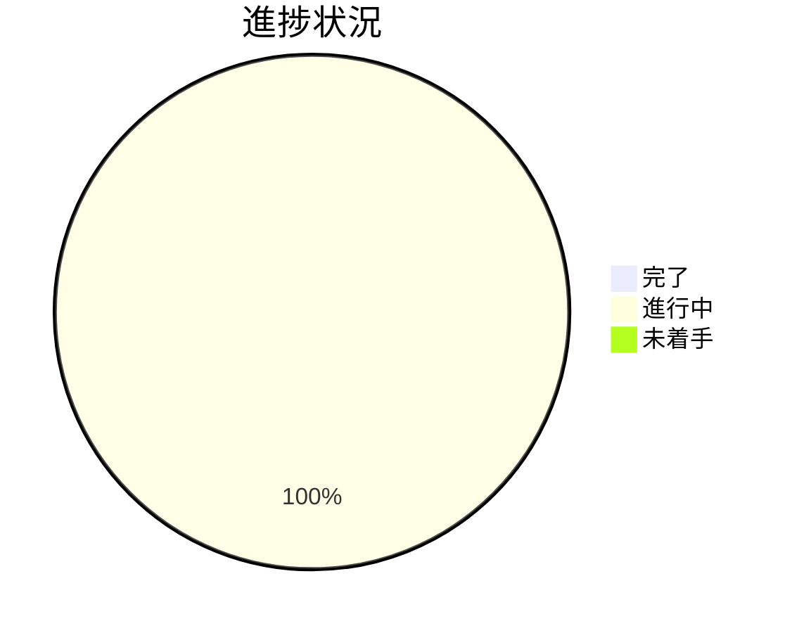

# Issue 一覧: worktree 運用規律（GitHub Issue #119 / PR#120）

**プロジェクト名**: worktree 運用規律の Tier1 強制・退避・CI 監査
**作成日**: 2026 年 07 月 16 日
**最終更新**: 2026 年 07 月 16 日

> **重要**: 本ファイルは親 issue（`20260716_013937_worktree運用規律/`）配下のサブ issue 一覧・進捗の index。各サブ issue の詳細は当該 `90_issues/{issue}/` を参照する。
>
> **用語**: [.agent-skill-chain/source/CONCEPTS.md §用語規約](../../../.agent-skill-chain/source/CONCEPTS.md#用語規約) を参照。

---

## Issue 一覧

| Issue 名 | 概要 | 優先度 | ステータス | リンク |
| -------- | ---- | ------ | ---------- | ------ |
| PR#120 指摘対応 | PR#120（worktree 運用規律）独立技術評価の 9 指摘のトリアージ記録。即時対応 4 件（finding-1/2/8/9）・起票 5 件（finding-3/4/5/6/7・うち finding-6/7 は data 非可逆消失・security_flag=true）を本 PR ブランチ内で実装。 | 高 | 進行中（実装中） | [詳細](./90_issues/20260716_102158_PR120_PR指摘対応/00_要求定義.md) |

---

## 進捗状況

### 全体進捗

- **完了**: 0 / 1
- **進行中**: 1 / 1（PR#120 指摘対応）
- **未着手**: 0 / 1

### 優先度別進捗

- **高優先度**: 0 / 1（PR#120 指摘対応 進行中）
- **中優先度**: 0 / 0
- **低優先度**: 0 / 0

---

## 参考資料

### プロジェクトドキュメント

親 issue の全体ドキュメント:

- [`00_要求定義.md`](./00_要求定義.md) - 要求定義
- [`01_要件定義.md`](./01_要件定義.md) - 要件定義
- [`02_設計.md`](./02_設計.md) - 設計
- [`03_実装計画.md`](./03_実装計画.md) - 実装計画
- [`04_review.md`](./04_review.md) - レビュー

### その他

- PR: https://github.com/techbeansjp-free/AGENTS.md/pull/120
- GitHub Issue: #119
