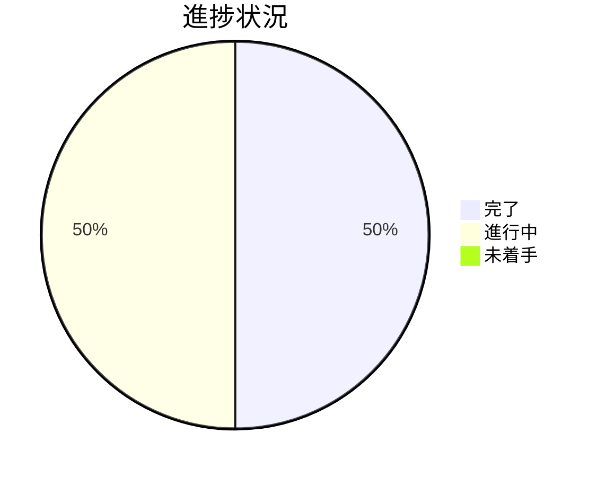

# Issue 一覧: worktree 運用規律（GitHub Issue #119 / PR#120）

**プロジェクト名**: worktree 運用規律の Tier1 強制・退避・CI 監査
**作成日**: 2026 年 07 月 16 日
**最終更新**: 2026 年 07 月 16 日

> **重要**: 本ファイルは親 issue（`20260716_013937_worktree運用規律/`）配下のサブ issue 一覧・進捗の index。各サブ issue の詳細は当該 `90_issues/{issue}/` を参照する。
>
> **用語**: [.agent-skill-chain/source/CONCEPTS.md §用語規約](../../../../.agent-skill-chain/source/CONCEPTS.md#用語規約) を参照。

---

## Issue 一覧

| Issue 名 | 概要 | 優先度 | ステータス | リンク |
| -------- | ---- | ------ | ---------- | ------ |
| PR#120 指摘対応 | PR#120（worktree 運用規律）レビュー指摘のトリアージ記録。第 1 ラウンド（独立技術評価 finding-1〜9・即時対応 4＋起票 5）に加え、第 2 ラウンド（CodeRabbit 第 2 レビュー ＋ CI 失敗 A〜F）まで本 PR ブランチ内で実装・全テスト green。 | 高 | 完了（第 1・第 2 ラウンド） | [詳細](./90_issues/20260716_102158_PR120_PR指摘対応/00_要求定義.md) |
| worktree 記録 commit 漏れ検知 | PR#120 が実装した削除前 untracked 退避機構は物理的なファイル消失を防ぐのみで、issue 記録が正式に commit・push されて main に残ることは保証しない（2026-07-15 の記録喪失事故と同型のリスクが残存）。記録のライフサイクル管理・commit 規律を requirement-discovery で検討する。 | 中 | requirement-discovery 着手（目的抽出フェーズ完了・前提整理以降は未着手） | [詳細](./90_issues/20260716_121521_worktree記録commit漏れ検知/00_要求定義.md) |

---

## 進捗状況

### 全体進捗

- **完了**: 1 / 2（PR#120 指摘対応・第 1／第 2 ラウンドとも完了）
- **進行中**: 1 / 2（worktree 記録 commit 漏れ検知・requirement-discovery 進行中）
- **未着手**: 0 / 2

### 優先度別進捗

- **高優先度**: 1 / 1（PR#120 指摘対応 完了）
- **中優先度**: 0 / 1（worktree 記録 commit 漏れ検知 進行中）
- **低優先度**: 0 / 0

---

## 参考資料

### プロジェクトドキュメント

親 issue の全体ドキュメント:

- [`00_要求定義.md`](./00_要求定義.md) - 要求定義
- [`01_要件定義.md`](./01_要件定義.md) - 要件定義
- [`02_設計.md`](./02_設計.md) - 設計
- [`03_実装計画.md`](./03_実装計画.md) - 実装計画
- [`04_review.md`](./04_review.md) - レビュー

### その他

- PR: https://github.com/techbeansjp-free/AGENTS.md/pull/120
- GitHub Issue: #119
