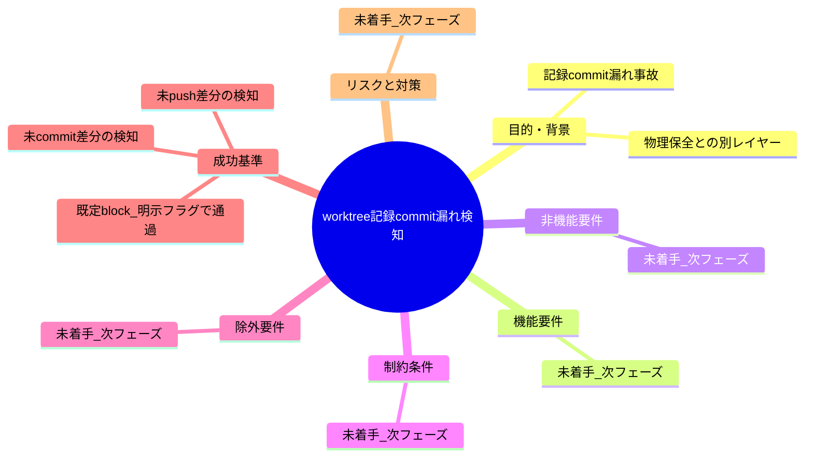
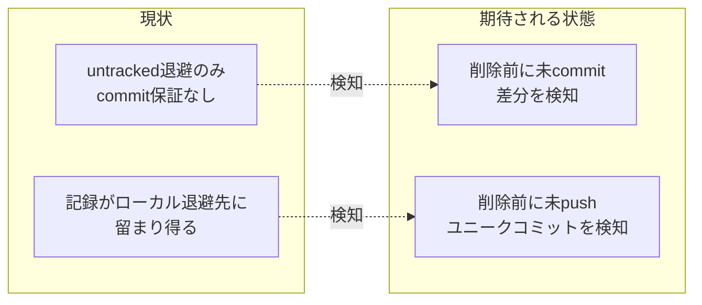

# 要求定義書: worktree 記録 commit 漏れ検知（issue 記録のライフサイクル管理・commit 規律）

**プロジェクト名**: worktree 記録 commit 漏れ検知（issue 記録のライフサイクル管理・commit 規律）
**作成日**: 2026 年 07 月 16 日
**最終更新**: 2026 年 07 月 16 日

> **重要**:
>
> - 要求定義書は、プロジェクトの全体像を把握するためのものです。詳細な技術仕様や実装方法は要件定義書以降で記載します。必要最低限の情報に収めることを心掛けてください。
> - **このドキュメントは常に更新**: 要求の変更や追加があった場合は、即座にこのドキュメントを更新してください。
> - **必須項目**: 「必須」と明記した項目は空欄・抽象語のみで提出しないこと。
> - **本ファイルの現在の完成度（重要）**: 本ファイルは requirement-discovery の **フェーズ 1（目的抽出 / extract-goals）完了時点のたたき台**である。§1.1 目的・§6 成功基準（候補）のみを確定し、§1.2〜1.3・§2〜§5・§7 はテンプレートのプレースホルダのまま次フェーズ（前提整理 identify-assumptions・受入基準定義 define-constraints）に引き継ぐ。次フェーズの担当者は本注記を読んだうえで該当プレースホルダを埋めること。
>
> **用語**: [.agent-skill-chain/source/CONCEPTS.md §用語規約](../../../../../../.agent-skill-chain/source/CONCEPTS.md#用語規約) を参照。

---

## 要求定義の全体像

**注意**:

- 本 issue は親 issue「worktree 運用規律」（`docs/maintainer/workflow/20260716_013937_worktree運用規律/`）のサブ issue として、`90_issues/` 配下に作成する（04_review 承認済みだが close 未移動のため追加可能）。
- 変更箇所（worktree 削除経路・PreToolUse hook 等）が親issue（PR#120）と同じコード面になるため、起票先を親issueの派生サブissueとした。問題自体は親issueの「物理的ファイル消失防止（untracked 退避）」とは別レイヤーの「記録（issue文書等）のライフサイクル管理・commit規律」である。

---

## 1. 目的・背景

### 1.1 目的（必須）

worktree 削除前に、issue 記録の未 commit・未 push を機械的に検知しブロックする。

### 1.2 背景

（次フェーズ〔前提整理 identify-assumptions〕で確定する。以下は目的抽出フェーズ時点で判明している事実のみを暫定記載する。詳細な前提・リスク洗い出しは次フェーズの範囲）

- **現状の課題（暫定）**:
  - PR#120（worktree 運用規律）が実装した「削除前 untracked 退避機構」（`worktree_untracked_rescue`。既定 `.claude/.worktree-trash/` へのローカルコピー、保持期限 14 日で lazy purge）は、**物理的なファイル消失を防ぐのみ**であり、「作業記録（issue 文書の更新・`90_issues.md` の進捗更新・memo 等）が正式に git commit・push されて main に残る」ことは保証しない。
  - 実例: `docs/maintainer/workflow/20260715_160558_issue運用ポリシー全面移行/90_issues.md` に、「00〜03 一式が一度も commit されないまま worktree 削除で喪失した」という 2026-07-15 の事故が記載されている（untracked 退避機構が無い時期の事故だが、退避機構がある現在も「退避＝commit・push 済み」ではないため、記録がローカル退避先に留まったまま正式な記録として残らないリスクは解消していない）。
  - {次フェーズで追記: 前提・制約・リスクの詳細洗い出し}

- **必要性（暫定）**:
  - {次フェーズで追記}

### 1.3 期待される効果（必須: 1 件以上）

（次フェーズ〔前提整理〕で精緻化する前提で、目的抽出フェーズ時点の暫定案を記載）

- **効果 1（暫定）**: worktree 削除前に、当該 worktree 内の issue 記録に未 commit の差分がある場合、削除操作の実行前に検知できる（○/×判定: 未 commit 差分がある worktree の削除操作を試み、検知されるかで検証できる）。
- **効果 2（暫定）**: commit 済みだが未 push のユニークコミット（origin に存在しないコミット）がある場合も同様に検知できる（○/×判定: 未 push コミットがある worktree の削除操作を試み、検知されるかで検証できる）。

**現状と期待される状態の比較**（次フェーズ以降で必要に応じて作成）:

---

## 2. 機能要件

### 2.1 既存機能の維持（該当する場合）

{次フェーズ（前提整理・受入基準定義）で追記。既存の `worktree_untracked_rescue`（PR#120 実装済み・物理ファイル退避）を破壊しないことが前提となる見込み。}

### 2.2 新規機能要件

{次フェーズで追記。オーケストレータとの会話で挙がった解決の方向性（アイデア・未確定）を参考情報として記す:
- 削除前ゲート（未 commit 差分・未 push ユニークコミットの検知 → 既定は block、`--force` 類の明示フラグでのみ通過）。auto-commit は意図しない WIP 混入リスクがあるため非推奨。
- 終了時契約（verify-and-close／worktree 終了条件に「記録 commit・push 済み」を機械検証で追加）も候補。
いずれも設計フェーズ（02_設計）で確定する。}

---

## 3. 非機能要件

### 3.1 パフォーマンス

- {次フェーズで追記}

### 3.2 セキュリティ

- {次フェーズで追記}

### 3.3 互換性

- {次フェーズで追記}

### 3.4 保守性

- {次フェーズで追記}

---

## 4. 制約条件

### 4.1 技術的制約

- {次フェーズで追記}

### 4.2 既存システムとの互換性

- {次フェーズで追記。既存の worktree 必須運用（`.agent-skill-chain/project/自己拡張ワークフロー.md` §0）・PR#120 の untracked 退避機構との整合が必要な見込み。}

### 4.3 移行期間・スケジュール

- {次フェーズで追記}

---

## 5. 除外要件

{次フェーズで追記。目的抽出時点での参考情報: worktree 以外の一般的な git データロス対策全般は対象外の見込み（親issue「worktree 運用規律」の除外要件と同様の切り分けを踏襲する想定）。}

---

## 6. 成功基準（必須: 1 件以上）

**本節は目的抽出フェーズの成果物であり、次フェーズ（受入基準定義 define-constraints）で検証可能な受け入れ基準へ精緻化されることを前提とした候補（たたき台）である。**

- **SC-1（候補）**: `git worktree remove` 等の worktree 削除操作の実行前に、当該 worktree 内の issue 記録（`00_要求定義.md`〜`04_review.md`・`90_issues.md` 等の git 追跡対象ファイル）に未 commit の差分がある場合、それが機械的に検知される（○/×判定可能）。
- **SC-2（候補）**: 未 commit の差分が検知された場合、既定挙動は block（拒否）とし、`--force` 相当の明示フラグを指定した場合のみ通過できる（○/×判定可能。具体のフラグ名・UI は設計フェーズで確定）。
- **SC-3（候補）**: commit 済みだが未 push（origin の対応ブランチに存在しない）のユニークコミットがある場合も、SC-1・SC-2 と同様に検知・block される（○/×判定可能）。
- **SC-4（候補・非破壊）**: 既存の `worktree_untracked_rescue`（PR#120 実装・物理ファイル退避、既定 `.claude/.worktree-trash/`）を破壊しない（既存テスト（`test/test-worktree-discipline.sh` 等）が新規 FAIL 無しで green のまま・○/×判定可能）。
- **SC-5（候補・再発防止の実証）**: 2026-07-15 の実事故（`docs/maintainer/workflow/20260715_160558_issue運用ポリシー全面移行/90_issues.md` 記載の「00〜03 一式が一度も commit されないまま worktree 削除で喪失」）と同型のシナリオ（未 commit の issue 記録を含む worktree を削除しようとする操作）を再現するテストで、本機構導入後は削除が block される（または明示フラグ無しでは記録が失われない）ことを検証できる（○/×判定可能）。
- **SC-6（候補・fail-safe）**: 非 git ツリー環境・GitHub 非採用環境等でゲートが誤作動せず自然に SKIP される（○/×判定可能。親issue「worktree 運用規律」の既存ゲート群との整合方針を踏襲する想定）。

> 上記 SC-1〜SC-6 はいずれも「候補」であり、具体的な検知対象パス・フラグ名・実装方式（PreToolUse hook 拡張か verify-and-close 側の契約強化か等）は未確定。次フェーズ（受入基準定義 define-constraints）で前提整理の結果とあわせて確定させること。

---

## 7. リスクと対策

### 7.1 技術的リスク

- **リスク**: {次フェーズで追記}
  - **対策**: {次フェーズで追記}

### 7.2 スケジュールリスク

- **リスク**: {次フェーズで追記}
  - **対策**: {次フェーズで追記}

---

## 8. 参考資料

### プロジェクトドキュメント

- 親 issue: [`docs/maintainer/workflow/20260716_013937_worktree運用規律/00_要求定義.md`](../../00_要求定義.md)（04_review 承認済み・close 未移動）
- 記録commit漏れの実事故記録: `docs/maintainer/workflow/20260715_160558_issue運用ポリシー全面移行/90_issues.md`（2026-07-15、00〜03 一式が一度も commit されないまま worktree 削除で喪失した事例）
- 既存の物理保全機構（本issueが前提とする既存実装）: PR#120（worktree 運用規律）実装の `worktree_untracked_rescue`（`.agent-skill-chain/source/enforcement/claude/PreToolUse.sh`）
- worktree 必須運用の正本: [`.agent-skill-chain/project/自己拡張ワークフロー.md`](../../../../../../.agent-skill-chain/project/自己拡張ワークフロー.md) §0

### その他の参考資料

- ユーザーメモリ `feedback_worktree-removal-data-loss-risk`（2026-07-15 データロス事故の教訓。「worktree remove --force は untracked 成果物を無条件消去。削除前に必ず価値確認・警告」）
- fable（アドバイザー限定・ユーザー承認済み）への相談結果: 本問題の本質は「worktree 運用規律」（物理保全）とは別レイヤーの「issue 記録のライフサイクル管理・commit 規律」問題であるが、実装の変更箇所（worktree 削除経路・PreToolUse hook）は同じコード面のため、起票先は worktree 運用規律の派生サブ issue が妥当という助言。解決策の方向性（削除前ゲート・終了時契約）はアイデア段階であり確定ではない。

---

## 9. 次のステップ

この要求定義書の承認後、以下のドキュメントを作成します：

- **次**: [`01_要件定義.md`](./01_要件定義.md) - 要件定義フェーズ
