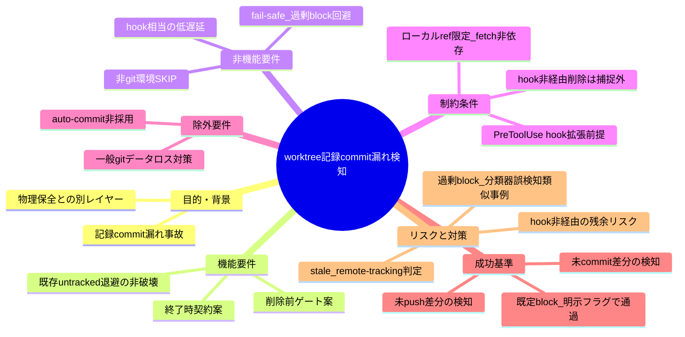
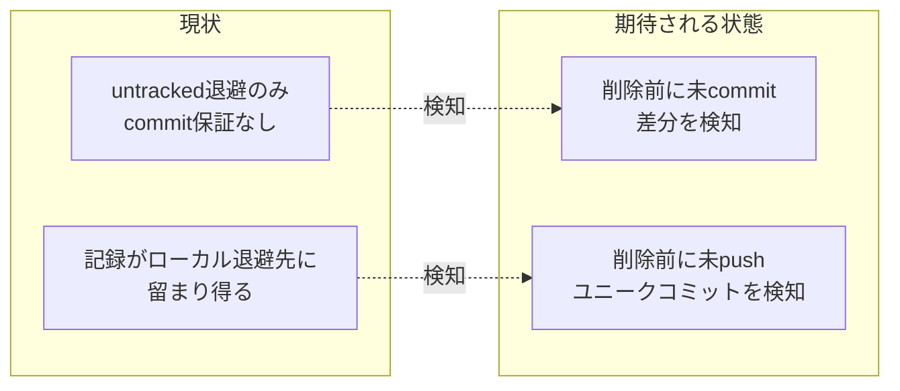

# 要求定義書: worktree 記録 commit 漏れ検知（issue 記録のライフサイクル管理・commit 規律）

**プロジェクト名**: worktree 記録 commit 漏れ検知（issue 記録のライフサイクル管理・commit 規律）
**作成日**: 2026 年 07 月 16 日
**最終更新**: 2026 年 07 月 16 日

> **重要**:
>
> - 要求定義書は、プロジェクトの全体像を把握するためのものです。詳細な技術仕様や実装方法は要件定義書以降で記載します。必要最低限の情報に収めることを心掛けてください。
> - **このドキュメントは常に更新**: 要求の変更や追加があった場合は、即座にこのドキュメントを更新してください。
> - **必須項目**: 「必須」と明記した項目は空欄・抽象語のみで提出しないこと。
> - **本ファイルの現在の完成度（重要）**: 本ファイルは requirement-discovery の **フェーズ 3（受入基準定義 / define-constraints）完了時点のたたき台**である。§6 成功基準は、前提整理（identify-assumptions）が残した「候補」段階から、検証可能な受け入れ基準（SC-1〜SC-6）へ確定した。**ただし、候補 A（削除前ゲート）・候補 B（終了時契約）のどちらを採用するか（またはどちらも採用するか）というアーキテクチャ選択そのものは、本フェーズでは確定させていない**。SC-1〜SC-6 はいずれの採用でも（両方採用の場合も）検証可能な形で記述し、アーキテクチャ選択は次フェーズ以降の 02_設計（design-feature）で ADR として確定する方針とした（§2.2・§6.1 参照）。あわせて、前提整理からの申し送り事項のうち「未 push コミット判定方式の具体」「既存 worktree への遡及適用可否」「`--force` 相当フラグの仕様」も、実装方式に強く依存するため本フェーズでは確定させず、§6.1 に設計フェーズへの申し送りとして明記した。BDD シナリオの執筆（write-bdd）は次フェーズに引き継ぐ。次フェーズの担当者は §6.1 に記載の申し送り事項を参照のうえ作業すること。
>
> **用語**: [.agent-skill-chain/source/CONCEPTS.md §用語規約](../../../../../../.agent-skill-chain/source/CONCEPTS.md#用語規約) を参照。

---

## 要求定義の全体像

**注意**:

- 本 issue は親 issue「worktree 運用規律」（`docs/maintainer/workflow/20260716_013937_worktree運用規律/`）のサブ issue として、`90_issues/` 配下に作成する（04_review 承認済みだが close 未移動のため追加可能）。
- 変更箇所（worktree 削除経路・PreToolUse hook 等）が親issue（PR#120）と同じコード面になるため、起票先を親issueの派生サブissueとした。問題自体は親issueの「物理的ファイル消失防止（untracked 退避）」とは別レイヤーの「記録（issue文書等）のライフサイクル管理・commit規律」である。

---

## 1. 目的・背景

### 1.1 目的（必須）

worktree 削除前に、issue 記録の未 commit・未 push を機械的に検知しブロックする。

### 1.2 背景

- **現状の課題**:
  - PR#120（worktree 運用規律）が実装した「削除前 untracked 退避機構」（`worktree_untracked_rescue`。既定 `.claude/.worktree-trash/` へのローカルコピー、保持期限 14 日で lazy purge）は、**物理的なファイル消失を防ぐのみ**であり、「作業記録（issue 文書の更新・`90_issues.md` の進捗更新・memo 等）が正式に git commit・push されて main に残る」ことは保証しない。
  - 実例: `docs/maintainer/workflow/20260715_160558_issue運用ポリシー全面移行/90_issues.md` に、「00〜03 一式が一度も commit されないまま worktree 削除で喪失した」という 2026-07-15 の事故が記載されている（untracked 退避機構が無い時期の事故だが、退避機構がある現在も「退避＝commit・push 済み」ではないため、記録がローカル退避先に留まったまま正式な記録として残らないリスクは解消していない）。
  - 実装箇所は親issue（PR#120）と同じコード面（`git worktree remove` 系の削除経路・`enforcement/claude/PreToolUse.sh` の R8 相当）になる見込みだが、問題の本質は親issueの「物理的ファイル消失防止（untracked 退避）」とは別レイヤーの「記録（issue 文書等）のライフサイクル管理・commit 規律」である（fable 相談結果・ユーザー承認済み。8 §参考資料 参照）。

- **前提（本フェーズで洗い出し。検証可能なものと仮定として置くものを区別する）**:
  - **前提 1（検証可能・既存実装から確認済み）**: 既存の `worktree_untracked_rescue`（R8・`PreToolUse.sh` L478 以降）は「削除形コマンド（`worktree remove`／`clean -x`/`-X`）を検知した際、untracked ファイルを退避先へ copy 保全してから削除を通す」動作であり、**削除操作そのものを block しない**（保全のみ）。本issueが新設する検知は、これとは別の「commit・push 済みか」を判定する新規レイヤーであり、R8 を置き換えるものではない（既存 R8 と併存する前提）。
  - **前提 2（仮定）**: 未 push ユニークコミットの判定は、ローカルに存在する remote-tracking 参照（`@{u}` または `origin/<branch>` 相当）との比較（`git rev-list @{u}.. `等）に基づく想定であり、**判定のために `git fetch` 等のネットワークアクセスを行わない**ことを前提として置く（PreToolUse hook は既存 R1〜R8 と同様、高速・オフライン動作が期待されるため）。この前提の下では、直近に fetch していない環境では remote-tracking 参照が stale になり得るという限界が残る（§7 リスクに記載）。
  - **前提 3（検証可能・既存実装から確認済み）**: 削除前検知は、既存 R7（命名強制）・R8（untracked 退避）と同様に PreToolUse hook が `tool_input.command`（Bash コマンド文字列）を静的パースする経路で実現される想定であり、**hook を経由しない削除経路（別プロセス・エディタ・`rm -rf` 等）は捕捉できない**という既存の残余リスクをそのまま引き継ぐ（worktree 運用規律 00 §7 と同型の限界）。
  - **前提 4（仮定）**: 検知対象は git 追跡対象ファイル（`00_要求定義.md`〜`04_review.md`・`90_issues.md` 等）に限定する。`memo/` はルート `.gitignore`（`**/memo/*`）により非追跡・transient と定義されている（`自己拡張ワークフロー.md` §memo）ため、本issueの「記録」の対象外（正本ではない）と仮定する。
  - **前提 5（検証可能）**: 本issueはトップレベル issue「worktree 運用規律」（`docs/maintainer/workflow/20260716_013937_worktree運用規律/`）の `90_issues/` 配下のサブ issue として存在する。親issueは 04_review 承認済みだが close 未移動のため、本issueの追加作成・進行は妨げられない（自己拡張ワークフロー.md の適用対象規定と整合）。

- **必要性**:
  - 記録漏れ事故は「物理ファイルの消失」ではなく「正式な記録として main に残らない」という別種の事故であり、既存の untracked 退避機構だけでは再発防止にならないことが 2026-07-15 の実例で示されている。
  - 削除前の機械的なゲートが無いと、「退避されているから大丈夫」という誤解のもとで commit・push を省略したまま worktree 削除が進む構造的リスクが残る（退避先はあくまでローカルの `.claude/.worktree-trash/` であり、保持期限 14 日で lazy purge されるため、正式な記録としての永続性は保証されない）。
  - 既存の worktree 運用規律（Tier1/2/3・grandfather 機構）が「作成時の命名規律」「削除時の物理保全」を機械強制している一方、「削除時の記録 commit 規律」だけが手当てされていない非対称が残っている。

### 1.3 期待される効果（必須: 1 件以上）

（受入基準定義フェーズで §6 の SC-1〜SC-6 として検証可能な形に確定した。本節はその要約であり、詳細な検証方法・設計判断の申し送りは §6・§6.1 を参照）

- **効果 1（確定）**: worktree 内の issue 記録（記録対象ファイルの定義は §1.2 前提 4）に未 commit の差分がある状態で、削除操作の実行前（候補 A）または終了条件の判定時（候補 B）のいずれかの契機（具体は 02_設計 で確定）で、未 commit 差分の存在が機械的に検知できる（○/×判定可能。詳細は §6 SC-1）。
- **効果 2（確定）**: commit 済みだが未 push のユニークコミット（origin に存在しないコミット）がある場合も、効果 1 と同様に検知できる（○/×判定可能。判定方式の具体は §6.1 へ設計フェーズ申し送り。詳細は §6 SC-3）。

**現状と期待される状態の比較**（次フェーズ以降で必要に応じて作成）:

---

## 2. 機能要件

### 2.1 既存機能の維持（該当する場合）

- **前提**: 既存の `worktree_untracked_rescue`（PR#120 実装済み・R8・物理ファイルの削除前退避）を破壊しない。本issueが新設する検知はその上位レイヤー（commit・push 規律）であり、既存機構を置き換えるものではなく併存させる。
- **前提**: 既存の enforcement 三層構成（Tier1＝PreToolUse hook 即時 reject／Tier2＝CI audit 事後検知／Tier3＝明示 allowlist 除外）という設計パターンを踏襲する見込み（親issue 00 §2.2 B 参照）。本issueが Tier1（削除操作の即時 block）のみで完結するか、Tier2 相当（CI audit・verify-and-close 側の契約強化）も要するかは、02_設計 で確定する（§2.2 の候補 A・B を参照）。

### 2.2 新規機能要件（前提整理時点のスコープ候補・未確定）

前提整理フェーズ時点では機能要件を確定しない（確定は 02_設計）。ここではオーケストレータとの会話で挙がった解決の方向性（アイデア段階）を、スコープの輪郭として整理する。

- **候補 A（削除前ゲート）**: worktree 削除操作（`git worktree remove` 系）の実行前に、未 commit 差分・未 push ユニークコミット（§1.2 前提 2 の判定方式）を検知し、**既定は block**、`--force` 類の明示フラグを指定した場合のみ通過できるようにする。
- **候補 B（終了時契約）**: `verify-and-close`／worktree 終了条件に「記録 commit・push 済み」の機械検証を追加する。
- **除外方針（前提）**: auto-commit（未 commit 差分を検知時に自動で commit してしまう方式）は、意図しない WIP・一時ファイルの混入リスクがあるため**非採用の方向で検討する**（§5 除外要件・§7 リスク参照）。
- **前提**: 候補 A・B のいずれか一方に絞るか併用するかは未確定。両者は排他ではなく、候補 A（削除操作の入口での即時検知）と候補 B（ワークフロー完了条件としての検証）は異なる契機で働く別レイヤーの可能性がある。02_設計 で確定する。
- **受入基準定義フェーズでの扱い（確定・本節）**: 候補 A・B のどちらを採用するか（または両方採用するか）という**アーキテクチャ選択そのものは、本フェーズ（受入基準定義 define-constraints）では確定させない**。02_設計（design-feature）で ADR として確定する方針とする（本プロジェクトの他 issue で踏襲されている「アーキテクチャ選択は設計フェーズで ADR 化する」前例に倣う）。§6 の受け入れ基準（SC-1〜SC-6）は、A・B いずれが採用されても（または両方採用されても）検証可能な形で記述した（§6.1 に申し送り事項として明記）。

---

## 3. 非機能要件

### 3.1 パフォーマンス

- 削除前ゲート（候補 A）は PreToolUse hook として動作する想定のため、既存 R1〜R8 と同様、削除操作の実行を実用的な時間内（体感でブロッキングと感じない範囲）に完了させる必要がある。`git status`／`git rev-list @{u}..` 相当の判定はいずれもローカル参照ベースであり通常は高速だが、大規模リポジトリ・大量ファイルの worktree でも操作を著しく遅延させないこと（具体閾値は設計フェーズで検討）。

### 3.2 セキュリティ

- 既存 PreToolUse hook の設計原則（拡張ファイルは source せずデータとして read、fail-closed／fail-safe を保全）に整合させる。commit・push 検知ロジックもコード注入ベクタを作らないこと。
- **意図しない過剰 block の回避（新規・本セッションの実例に基づく）**: 本セッション中に、`.claude/settings.json` の deny 設定変更という「設定ファイルの直接編集」が、auto mode の分類器により意図しない権限拡大とみなされブロックされた実例があった。本issueの削除前 block 機構も、実装によっては同種の「意図しない過剰ブロック」（正当な削除操作までブロックしてしまう）のリスクを持ちうる。既存 PreToolUse hook の fail-safe 原則（判定不能時は allow に倒す）を踏襲し、判定ロジックの誤検知が作業を不必要に止めないことを非機能要件とする（詳細は §7 リスク参照）。

### 3.3 互換性

- 非 git ツリー環境・GitHub 非採用環境等でゲートが誤作動せず自然に SKIP されること（既存の worktree 運用規律の Tier1/2/3 機構・grandfather 機構と同様の fail-safe 方針を踏襲する）。
- 既存の `worktree_untracked_rescue`（R8）・命名強制（R7）等、既存 enforcement チェックを破壊しないこと。

### 3.4 保守性

- 1 ファイル 1 責務・UNIX 哲学（`.agent-skill-chain/source/spec/01_設計原則.md`）に従い、既存機構（`PreToolUse.sh`・`enforcement/ci/audit.sh`）への最小の追加として実装できる形にすること。
- コア抽象／project 具体の配置境界（既存の設計原則）に従い、汎用原則はコア（`.agent-skill-chain/source/`）、具体パス・具体値は project 側（`.agent-skill-chain/project/自己拡張ワークフロー.md`）に置く。

---

## 4. 制約条件

### 4.1 技術的制約

- 削除前検知は、既存の PreToolUse hook 機構（`.agent-skill-chain/source/enforcement/claude/PreToolUse.sh`）の拡張として実現する前提とする（新設ではなく既存拡張。worktree 運用規律の B／C と同じ実現手段を踏襲する見込み）。
- 未 push ユニークコミットの判定は、ローカルに存在する remote-tracking 参照（`@{u}` または `origin/<branch>` 相当）との比較に基づく想定であり、**判定のために `git fetch` 等のネットワークアクセスは行わない**ことを制約として置く（§1.2 前提 2）。この制約下では、直近に fetch していない環境で remote-tracking 参照が stale になり得るという限界を受け入れる。
- 検知対象の削除操作は、PreToolUse hook が `tool_input.command`（Bash コマンド文字列）を静的パースする経路に限定される（既存 R7・R8 と同型）。**hook を経由しない削除経路（別プロセス・エディタ・`rm -rf` 等）は捕捉できない**という既存の残余リスクを、本issueも同様に引き継ぐ（隠さず 01・02 に明記する）。
- 非 git ツリー環境・GitHub 非採用環境でのフェイルセーフ動作（既存の `git remote -v` に `github.com` を含むかの判定シグナル等と同様の考え方）が要求される。

### 4.2 既存システムとの互換性

- 既存の `worktree_untracked_rescue`（R8・PR#120 実装済み・物理ファイル退避）を破壊しないこと（非破壊が前提）。
- `.agent-skill-chain/project/自己拡張ワークフロー.md` §0 の「実装・変更作業は必ず worktree で行う」運用と整合すること。
- 検知対象ファイルの正本判定は、同ファイル §memo の作成場所（memo は非追跡・transient、正本は issue ドキュメント `00`〜`04` のみ）の定義に整合させる（§1.2 前提 4）。
- 既存の enforcement 失敗条件番号（#1〜#40 相当）と衝突しない新規番号を採番する想定（具体番号は 02_設計 で確定）。

### 4.3 移行期間・スケジュール

- 親issue「worktree 運用規律」は、B（命名規則）・C（untracked 退避）を「本issue完了時点以降に新規作成される worktree／ブランチにのみ適用」するグランドファザリングを採用している（親 00 §4.3）。本issueの検知機構を、**既存の（本issue完了前から存在する）worktree にも遡及適用するか、新規作成分のみに限定するかは未確定**であり、実装方式（削除前ゲートか終了時契約か）に依存する判断のため、本フェーズ（受入基準定義）でも確定させず 02_設計（design-feature）へ申し送る（§6.1 参照）。
- 本issueはサブ issue として `90_issues/` 配下に存在するため、親issueの close 移動タイミング（04_review 承認済みだが close 未移動）との整合を要する見込み（自己拡張ワークフロー.md §完了issueのclose移動）。

---

## 5. 除外要件

- worktree 以外の一般的な git データロス対策全般（誤 `git reset --hard`・誤 `rm -rf` 等）。本issueは `git worktree remove` 系の削除経路に限定する（親issue「worktree 運用規律」00 §5 と同様の切り分けを踏襲）。
- **auto-commit 機構の実装**: 未 commit 差分を検知時に自動で commit する方式は、意図しない WIP・一時ファイルの混入リスクがあるため、本issueのスコープでは非採用の方向とする（§2.2 除外方針・§7 リスク参照）。将来的に別issueで再検討する余地は残すが、本issueでは実装しない。
- **非 git 環境・GitHub 非採用環境向けの代替記録機構の新設**: これらの環境では検知機構自体を fail-safe に SKIP する対応に留め、代替の記録保証手段（例: 別ストレージへの自動バックアップ等）の新設は本issueのスコープ外とする。
- 親issue「worktree 運用規律」の B（命名規則）・C（untracked 退避）そのものの再設計・変更。本issueはそれらを前提として維持し、その上に新規レイヤーを追加する。
- 本issueは requirement-discovery（00/01 作成）の範囲に留め、design-feature（02_設計）以降の確定的な実装方式決定（Tier 構成・具体的な検知コマンド・フラグ名等）は次フェーズ以降に委ねる。

---

## 6. 成功基準（必須: 1 件以上）

**本節は受入基準定義フェーズ（define-constraints）の成果物であり、前提整理フェーズが残した「候補」段階の SC-1〜SC-6 を、検証可能な受け入れ基準へ確定したものである。**

**確定の方針（重要）**: 候補 A（削除前ゲート）・候補 B（終了時契約）のどちらを採用するか（または両方採用するか）という**アーキテクチャ選択そのものは、本フェーズでは確定しない**（§2.2 参照。02_設計＝design-feature で ADR として確定する）。そのため、以下の SC-1〜SC-6 は「誰が・何を・どう検証するか」が分かる形にしつつ、**A・B いずれが採用されても（両方採用されても）検証可能な表現**に統一している。同様に、実装方式に強く依存する個別の設計判断（未 push 判定方式の具体・既存 worktree への遡及適用可否・`--force` 相当フラグの仕様）も本フェーズでは確定せず、§6.1 に設計フェーズへの申し送りとして明記する。

- **SC-1（未 commit 差分の検知・中核）**: 誰が＝本機構（削除前ゲートまたは終了時契約。以下同様）が、何を＝当該 worktree 内の記録対象ファイル（git 追跡対象の `00_要求定義.md`〜`04_review.md`・`90_issues.md` 等。対象範囲は §1.2 前提 4 に定義済み）に未 commit の差分がある状態を、どう検証するか＝worktree 削除操作の実行前（候補 A 採用時）または worktree 終了条件の判定時（候補 B 採用時）のいずれかの契機（契機の具体は 02_設計 で確定）で機械的に検知できることを、実際に未 commit 差分を作った worktree に対して当該操作・判定を実行し検知されるかで確認できる（○/×判定可能）。
- **SC-2（既定 block・明示バイパス）**: 誰が＝本機構が、何を＝SC-1 で未 commit 差分が検知された場合の挙動を、どう検証するか＝既定挙動が block（拒否、または候補 B の場合は終了条件不成立の判定）であり、明示的なバイパス手段（`--force` 相当。具体のフラグ名・呼び出し形式は §6.1 へ申し送り）を用いた場合のみ通過できることを、両方のケース（バイパス無し／バイパス有り）を実行して確認できる（○/×判定可能）。
- **SC-3（未 push 検知）**: 誰が＝本機構が、何を＝commit 済みだが未 push（origin の対応ブランチに存在しない）のユニークコミットがある状態を、どう検証するか＝SC-1・SC-2 と同一の契機・挙動（検知・既定 block・明示バイパス）で検知・block されることを、未 push コミットのみを含む worktree に対して当該操作・判定を実行し確認できる（○/×判定可能）。判定に用いる具体コマンド・remote-tracking 参照の比較方式は §1.2 前提 2 の制約（`git fetch` 等のネットワークアクセスを行わない）を満たす形で 02_設計 にて確定する（§6.1 参照）。
- **SC-4（非破壊）**: 誰が＝実装者が、何を＝既存の `worktree_untracked_rescue`（PR#120 実装・R8・物理ファイル退避、既定 `.claude/.worktree-trash/`）を破壊しないことを、どう検証するか＝既存テスト（`test/test-worktree-discipline.sh` 等）を実行し、新規 FAIL 無しで green のまま維持されることで確認できる（○/×判定可能）。
- **SC-5（再発防止の実証）**: 誰が＝レビュー担当者が、何を＝2026-07-15 の実事故（`docs/maintainer/workflow/20260715_160558_issue運用ポリシー全面移行/90_issues.md` 記載の「00〜03 一式が一度も commit されないまま worktree 削除で喪失」）と同型のシナリオを、どう検証するか＝未 commit の issue 記録を含む worktree を削除しようとする操作を再現するテストを実行し、本機構導入後は当該操作が block される（または明示フラグ無しでは記録が失われない）ことで確認できる（○/×判定可能）。
- **SC-6（fail-safe）**: 誰が＝実装者が、何を＝非 git ツリー環境・GitHub 非採用環境等での本機構の挙動を、どう検証するか＝親issue「worktree 運用規律」の既存ゲート群と同一の判定シグナル（`git remote -v` に `github.com` を含むか等）を用いた検証シナリオを実行し、誤作動せず自然に SKIP されることで確認できる（○/×判定可能）。

### 6.1 design-feature へ明示的に持ち越す設計判断事項（本フェーズで確定しない・申し送り）

以下は前提整理フェーズ（identify-assumptions）からの申し送り事項のうち、アーキテクチャ選択そのもの、または実装方式に強く依存するため、本フェーズ（受入基準定義 define-constraints）では確定させない項目である。SC-1〜SC-6 はいずれの選択でも検証可能な形で記述済みだが、具体の実装方式は 02_設計（design-feature）で ADR として確定すること。

1. **候補 A（削除前ゲート）・候補 B（終了時契約）のいずれを採用するか、または併用するか**（§2.2）。SC-1・SC-2 は A・B いずれの採用でも検証可能な表現にしてあるが、具体的な実現箇所（PreToolUse hook 拡張か、verify-and-close 側の契約強化か、両方か）は design-feature で確定する。
2. **未 push ユニークコミットの判定方式の具体**（§1.2 前提 2・SC-3）: remote-tracking 参照（`@{u}`／`origin/<branch>`）の具体的な比較コマンド（例: `git rev-list @{u}..`）、および「`git fetch` を行わない」制約下で発生しうる stale 判定への対処方針（許容するか、警告を出すか等）。
3. **既存 worktree への遡及適用可否**（§4.3）: 本issue完了時点で既に存在する worktree にも検知機構を適用するか、親issue「worktree 運用規律」の B・C と同様にグランドファザリング（本issue完了時点以降に新規作成される worktree／ブランチにのみ適用）するかは未確定。design-feature で判断し、02_設計・01_要件定義 に確定内容を記録する。
4. **`--force` 相当フラグの仕様**（SC-2）: 具体的なフラグ名、呼び出し形式（コマンドライン引数／環境変数等）、バイパス実行時のログ記録要否は design-feature で確定する。

**設計フェーズへの引き継ぎ方法**: 上記 1〜4 は、02_設計（design-feature）で ADR（Architecture Decision Record 相当）として確定し、01_要件定義（write-bdd が作成する BDD シナリオの Given/When/Then）は SC-1〜SC-6 の検証可能な表現をそのまま踏襲しつつ、A/B いずれの採用でも成立するシナリオとして書くか、あるいは 02_設計 の確定後に具体化することとする（write-bdd 実行時点で 02_設計 が未着手の場合は、本節の申し送りをそのまま 01 の「制約事項」等へ転記してよい）。

---

## 7. リスクと対策

### 7.1 技術的リスク

- **リスク（過剰 block・本セッションの実例に基づく）**: 削除前ゲート（候補 A）が正当な削除操作まで過剰にブロックし、作業を妨げる。本セッション中に、`.claude/settings.json` の deny 設定変更という「設定ファイルの直接編集」が、auto mode の分類器により意図しない権限拡大とみなされブロックされた実例があった。本issueの解決策（削除前 block 機構）も、実装によっては同種の「意図しない過剰ブロック」（未commit・未pushの判定を誤り、正当な削除を止めてしまう）のリスクを持ちうる。
  - **対策（方向性・確定は設計フェーズ）**: 既存 PreToolUse hook の fail-safe 原則（判定不能・内部エラー時は allow に倒す）を踏襲する。`--force` 相当の明示フラグによる意図的なバイパス経路を用意する。block 時のエラーメッセージには、具体的にどのファイルが未 commit／未 push なのか、どう解消すればよいか（例: `git add && git commit`／`git push` のコマンド例）を含め、ユーザー・エージェントが「なぜ止められたか」を即座に理解できるようにする（詳細は 02_設計 で確定）。
- **リスク（stale な remote-tracking 判定）**: 未 push 判定がローカルの remote-tracking 参照（`@{u}`／`origin/<branch>`）に依存し、かつ `git fetch` を伴わない実装を前提とする（§1.2 前提 2・§4.1）ため、直近に fetch していない環境では実際は push 済みなのに「未 push」と誤検知する、あるいはその逆の判定になり得る。
  - **対策**: 判定の限界を 01・02 に残余リスクとして明記する。fetch を伴う実装に切り替えるかどうか（パフォーマンス・オフライン動作とのトレードオフ）は設計フェーズで再検討する。
- **リスク（hook 非経由の削除・既存 R7/R8 と同型）**: 別プロセス・エディタ・`rm -rf` 等、PreToolUse hook を経由しない削除経路は本機構でも捕捉できない。
  - **対策**: 隠さず 01・02 に残余リスクとして明記する（既存 worktree 運用規律 00 §7 と同様の透明性を踏襲）。完全網羅は目指さない。
- **リスク（auto-commit 非採用の裏面リスク）**: auto-commit を採用しない方針（§2.2・§5）の結果、検知後の解消操作（commit・push）は依然として人間・エージェントの手動対応に依存する。ゲートが block しても、対応方法が分かりにくいと作業がスタックする可能性がある。
  - **対策**: 上記「過剰 block」対策と同様、明確なエラーメッセージ・解消手順の提示を要件に含める。

### 7.2 スケジュールリスク

- **リスク**: 本issueは親issue「worktree 運用規律」（04_review 承認済みだが close 未移動）の `90_issues/` 配下サブissueとして進行するため、親issueの close 移動タイミングと本issueの完了タイミングの整合が必要になる可能性がある。
  - **対策**: 親issueの進行・close 移動判断とは独立して本issueの完了を判定できるよう、本issue自体のスコープ（00〜04）を区切って進める。親issueが先に close 移動する場合は、本issueも同時に `close/` 配下へ移動する（自己拡張ワークフロー.md の「トップレベル issue が完了したときのみ、配下のサブ issue 含め移動」の原則に従う）。

---

## 8. 参考資料

### プロジェクトドキュメント

- 親 issue: [`docs/maintainer/workflow/20260716_013937_worktree運用規律/00_要求定義.md`](../../00_要求定義.md)（04_review 承認済み・close 未移動）
- 記録commit漏れの実事故記録: `docs/maintainer/workflow/20260715_160558_issue運用ポリシー全面移行/90_issues.md`（2026-07-15、00〜03 一式が一度も commit されないまま worktree 削除で喪失した事例）
- 既存の物理保全機構（本issueが前提とする既存実装）: PR#120（worktree 運用規律）実装の `worktree_untracked_rescue`（`.agent-skill-chain/source/enforcement/claude/PreToolUse.sh`）
- worktree 必須運用の正本: [`.agent-skill-chain/project/自己拡張ワークフロー.md`](../../../../../../.agent-skill-chain/project/自己拡張ワークフロー.md) §0

### その他の参考資料

- ユーザーメモリ `feedback_worktree-removal-data-loss-risk`（2026-07-15 データロス事故の教訓。「worktree remove --force は untracked 成果物を無条件消去。削除前に必ず価値確認・警告」）
- fable（アドバイザー限定・ユーザー承認済み）への相談結果: 本問題の本質は「worktree 運用規律」（物理保全）とは別レイヤーの「issue 記録のライフサイクル管理・commit 規律」問題であるが、実装の変更箇所（worktree 削除経路・PreToolUse hook）は同じコード面のため、起票先は worktree 運用規律の派生サブ issue が妥当という助言。解決策の方向性（削除前ゲート・終了時契約）はアイデア段階であり確定ではない。

---

## 9. 次のステップ

この要求定義書の承認後、以下のドキュメントを作成します：

- **次**: [`01_要件定義.md`](./01_要件定義.md) - 要件定義フェーズ
