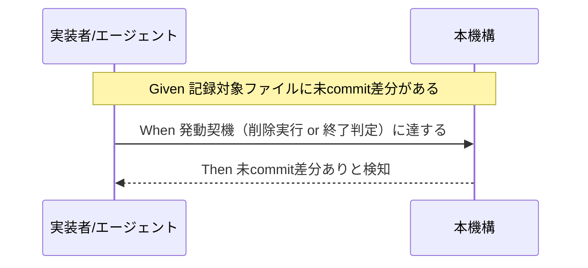

# 要件定義書: worktree 記録 commit 漏れ検知（issue 記録のライフサイクル管理・commit 規律）

**プロジェクト名**: worktree 記録 commit 漏れ検知（issue 記録のライフサイクル管理・commit 規律）
**作成日**: 2026 年 07 月 16 日
**最終更新**: 2026 年 07 月 17 日

> **重要**: **このドキュメントは常に更新**: 要件の変更や追加があった場合は、即座にこのドキュメントを更新してください。本書は [`00_要求定義.md`](./00_要求定義.md) の §6 成功基準（SC-1〜SC-6）を BDD シナリオへ落とし込む。
>
> **アーキテクチャ選択は 02_設計 で確定済み（ADR-1〜4）**: 候補 A（削除前ゲート）・候補 B（終了時契約）の採否は 02_設計 §2.5 で **A + B 併用**（ADR-1）と確定済み。本書の BDD シナリオは引き続き方式非依存の表現を残しつつ、02 で確定した具体（未 push 判定方式＝ADR-2、適用範囲＝ADR-3、バイパス＝ADR-4）と整合させる。
>
> **PR#124 指摘対応の反映（2026-07-17・finding-2／finding-5）**: **finding-2**＝未 push 検知（SC-3・ストーリー 3・ユースケース 3）のセマンティクスを「**記録対象ファイルを変更した**未 push コミットがある場合に検知（記録に無関係なコード・テスト変更のみの未 push は block しない）」へ精緻化した（未 commit 検知と対称。02 §3.4・ADR-2 に整合）。**finding-5**＝適用範囲（SC-6・ストーリー 6・§5 制約事項）を「**R7 命名規則準拠パス配下**の worktree を対象とする**パスベースのスコープ**（作成時期は判定しない）」へ整合させた（02 ADR-3 改訂＝案 B に整合）。
>
> **用語**: [.agent-skill-chain/source/CONCEPTS.md §用語規約](../../../../../../.agent-skill-chain/source/CONCEPTS.md#用語規約) を参照。

---

## 1. 概要

### 1.1 システム概要

本機構は、worktree 内の issue 記録（git 追跡対象の `00_要求定義.md`〜`04_review.md`・`90_issues.md` 等。定義は 00 §1.2 前提 4）に未 commit の差分、または commit 済みだが未 push のユニークコミットがある状態を、worktree の削除操作前（候補 A）または終了条件の判定時（候補 B）のいずれかの契機で機械的に検知し、既定では block（拒否）する。明示的なバイパス手段（`--force` 相当。仕様は 02_設計で確定）を用いた場合のみ通過できる。既存の `worktree_untracked_rescue`（R8・物理ファイルの削除前退避）とは別レイヤーであり、これを置き換えず併存する。

### 1.2 用語集

| 用語 | 説明 |
| -------- | ------ |
| 記録対象ファイル | git 追跡対象の issue ドキュメント（`00_要求定義.md`〜`04_review.md`・`90_issues.md` 等）。`memo/` は非追跡・transient のため対象外（00 §1.2 前提 4）。 |
| 候補 A（削除前ゲート） | `git worktree remove` 系の削除操作の実行前に、未 commit・未 push を検知し既定 block する方式。PreToolUse hook 拡張として実現する想定（00 §2.2）。 |
| 候補 B（終了時契約） | `verify-and-close`／worktree 終了条件の判定に「記録 commit・push 済み」の機械検証を追加する方式（00 §2.2）。 |
| 本機構の発動契機 | 候補 A では「削除操作の実行前」、候補 B では「終了条件の判定時」を指す総称。02_設計で最終確定するまでは、本書ではこの総称で方式非依存に記述する。 |
| 未 push ユニークコミット | commit 済みだが、ローカルの remote-tracking 参照（`@{u}`／`origin/<branch>` 相当）との比較で origin に存在しないと判定されるコミット。判定は `git fetch` を伴わない（00 §1.2 前提 2）。**検知対象は記録対象ファイル（本表 1 行目）を変更したコミットに限る**（記録に無関係なコード・テスト変更のみのコミットは対象外＝未 commit 判定と同一スコープ。finding-2・02 §3.4／ADR-2）。 |
| `--force` 相当フラグ | 検知結果を明示的にバイパスする手段の総称。具体のフラグ名・呼び出し形式は 02_設計で確定（00 §6.1 事項 4）。 |
| 既存 R8（`worktree_untracked_rescue`） | PR#120 実装済み。削除操作前に untracked ファイルを退避先（既定 `.claude/.worktree-trash/`）へ copy 保全する機構。削除操作そのものは block しない（保全のみ）。本機構とは別レイヤーで併存する。 |

---

## 2. 機能要件

### 2.1 ユーザーストーリー

#### ストーリー 1: worktree 内で issue 記録作業を行う実装者／エージェントとして、未 commit 差分を削除前に検知してほしい

- **As a** worktree 内で issue 記録（00〜04・90_issues.md 等）の作成・更新を行う実装者／エージェント
- **I want to** worktree を削除する前（または worktree の終了条件が判定される時点）に、記録対象ファイルの未 commit 差分が機械的に検知される
- **So that** commit し忘れたまま worktree を削除し、記録が正式に main へ残らないまま失われる事故（2026-07-15 実例）を未然に防げる

**受け入れ基準**（00 §6 SC-1 対応）:

- 記録対象ファイルに未 commit の差分がある状態で、本機構の発動契機に達すると検知される。
- 発動契機の具体（候補 A: 削除操作の実行前／候補 B: 終了条件の判定時）は 02_設計で確定する。いずれの契機でも検知自体は機械的（○/×判定可能）である。
- `memo/` 等、記録対象外のファイルの変更のみでは検知（誤検知）しない。

#### ストーリー 2: 削除操作を行う実装者／エージェントとして、検知時は既定で止められ、正当な理由があるときのみ明示的に進めたい

- **As a** worktree 削除操作（または終了処理）を実行する実装者／エージェント
- **I want to** 未 commit・未 push が検知された場合は既定で block（削除拒否、または終了条件不成立）され、`--force` 相当の明示フラグを指定した場合のみ通過できる
- **So that** 誤って記録を失う操作を防ぎつつ、記録を残す必要がないと判断した正当なケース（例: 検証専用の使い捨て worktree）では作業を止められない

**受け入れ基準**（00 §6 SC-2 対応）:

- SC-1（未 commit）または SC-3（未 push）の検知条件が成立している状態で、明示フラグを指定しない場合は既定で block される。
- 同じ検知条件でも、明示フラグを指定した場合は通過できる。
- フラグの具体名・呼び出し形式・バイパス実行時のログ記録要否は 02_設計で確定する（00 §6.1 事項 4 の申し送りをそのまま引き継ぐ）。

#### ストーリー 3: worktree 内で作業する実装者／エージェントとして、commit 済みでも push し忘れた記録は喪失リスクが残るため、未 push も検知してほしい

- **As a** worktree 内で issue 記録の commit・push を行う実装者／エージェント
- **I want to** commit 済みだが origin に存在しない、**記録対象ファイルを変更した**未 push のユニークコミットがある状態も、未 commit 差分と同様に検知・block される
- **So that** 「commit したから安全」という誤解のまま push を省略し、worktree 削除でローカル専用のコミットが失われることを防げる。かつ記録に無関係なコード変更のみの未 push で正当な削除まで止められることがない

**受け入れ基準**（00 §6 SC-3 対応・finding-2 精緻化）:

- **記録対象ファイル（`00_要求定義.md`〜`04_review.md`・`90_issues.md` 等）を変更した**未 push のユニークコミットがある状態で、SC-1・SC-2 と同一の契機・挙動（検知・既定 block・明示バイパス）が働く。
- **記録に無関係なパス（例: `enforcement/*.sh`・`test/*.sh` 等のコード・テスト）のみを変更した未 push コミットしか無い場合は検知・block しない**（未 commit 判定〈SC-1〉と同一の記録スコープで対称に絞り込む＝finding-2。02 §3.4 は `git rev-list @{u}..HEAD -- <記録格納ルート>` の pathspec で実現）。
- 判定はローカルの remote-tracking 参照（`@{u}`／`origin/<branch>` 相当）との比較に基づき、`git fetch` 等のネットワークアクセスを行わない（00 §1.2 前提 2・§4.1 制約）。
- 直近に fetch していない環境で remote-tracking 参照が stale になり得る限界を許容する（00 §7.1 リスク）。具体の判定コマンド・stale 対処方針は 02_設計 ADR-2 で確定済み（`@{u}` 優先・`origin/<branch>` フォールバック・stale は警告付き許容）。

#### ストーリー 4: 保守者として、新設する検知機構が既存の物理保全機構を壊さないことを確認したい

- **As a** 本機構を実装・レビューする保守者
- **I want to** 既存の `worktree_untracked_rescue`（R8・PR#120 実装済み）が本機構の追加によって退行しない
- **So that** 新規レイヤーの追加が既存の削除前 untracked 退避という安全機構を破壊しないと確信できる

**受け入れ基準**（00 §6 SC-4 対応）:

- 既存テスト（`test/test-worktree-discipline.sh` 等）が、本機構追加後も新規 FAIL なく green のまま維持される。
- 本機構は既存 R8 を置き換えるものではなく、併存するレイヤーとして実装される（00 §2.1）。

#### ストーリー 5: レビュー担当者として、実際の事故パターンが再発しないことを実証したい

- **As a** 04_review でこの機構の妥当性を確認するレビュー担当者
- **I want to** 2026-07-15 の実事故（`docs/maintainer/workflow/20260715_160558_issue運用ポリシー全面移行/90_issues.md` 記載）と同型の状況を再現し、本機構がそれを防止することを確認する
- **So that** 抽象的な受け入れ基準だけでなく、実際に起きた事故パターンに対して機構が機能することを裏付けられる

**受け入れ基準**（00 §6 SC-5 対応）:

- 未 commit の issue 記録一式（00〜03 相当）を含む worktree に対し、明示バイパスフラグ無しで削除操作（または終了条件判定）を実行するテストシナリオを用意する。
- 本機構導入後は、当該操作が block される、または明示フラグ無しでは記録が失われないことが確認できる。

#### ストーリー 6: 非 git 環境・判定不能環境の利用者として、本機構が誤作動せず自然に迂回されてほしい

- **As a** 非 git ツリー環境等、本機構の判定が成立しない環境で本フレームワークを利用する実装者／エージェント
- **I want to** 本機構が自環境では誤作動せず、既存 R1〜R8 の fail-safe 原則（判定不能時は allow に倒す）に従い自然に SKIP／allow される
- **So that** 環境非対応を理由に意図しない作業停止（過剰 block）が発生しない

**受け入れ基準**（00 §6 SC-6 対応・finding-5 適用範囲整合）:

- 非 git ツリー環境・判定不能・内部エラー時を再現した検証シナリオを実行し、対象外環境で誤作動せず自然に SKIP／allow されることを確認できる。本機構はローカル git 状態のみで動作し remote 非依存のため、`git remote -v` の `github.com` 等の remote 依存シグナルによる判定は用いない（02_設計 §3.5 注記・§6.2 SC-6 行を参照）。
- **適用範囲は R7 命名規則準拠パス（`.worktree/<type>/<YYYYMMDD_HHMMSS>/<name>/`）配下の worktree に限定する パスベースのスコープであり、作成時刻・baseline を判定しない**（finding-5・02 ADR-3 改訂＝案 B）。準拠パスなら本 issue 導入前から在る既存 worktree も対象に含み、非準拠パスは新旧問わず対象外。「本 issue 完了以降に作成された新規 worktree のみ」という時期ベースの表現は用いない。
- 既存 PreToolUse hook の fail-safe 原則（判定不能・内部エラー時は allow に倒す）を踏襲する（00 §3.2・§7.1）。

### 2.2 BDD ユースケース

#### ユースケース 1: 未 commit 差分の検知（SC-1・中核）

worktree 内の記録対象ファイルに未 commit の差分がある状態を、本機構の発動契機で機械的に検知する。

**シナリオ 1: 未 commit 差分がある状態で検知される（方式非依存）**

```gherkin
Feature: 未commit差分の検知
  Scenario: 記録対象ファイルに未commit差分がある状態で検知される
    Given worktree内の記録対象ファイル（00_要求定義.md〜04_review.md・90_issues.md等、git追跡対象）に未commitの差分がある
    When 本機構の発動契機（削除操作の実行前、または終了条件の判定時）に達する
    Then 未commit差分の存在が機械的に検知される
    And memo/等、記録対象外のファイルの変更のみでは検知されない
```

**発動契機の具体は方式依存のため、以下に候補 A・候補 B それぞれの想定シナリオを併記する（02_設計で最終確定）**:

**シナリオ 1-A（候補 A: 削除前ゲート 想定）**

```gherkin
Feature: 未commit差分の検知（候補A：削除前ゲート）
  Scenario: worktree削除操作の実行前にPreToolUse hook相当が検知する
    Given worktree内の記録対象ファイルに未commitの差分がある
    When エージェントが `git worktree remove` 系の削除コマンドを実行しようとする
    Then PreToolUse hook拡張が削除コマンドの実行前に未commit差分を検知する
```

**シナリオ 1-B（候補 B: 終了時契約 想定）**

```gherkin
Feature: 未commit差分の検知（候補B：終了時契約）
  Scenario: verify-and-close等の終了条件判定時に検知される
    Given worktree内の記録対象ファイルに未commitの差分がある
    When verify-and-close またはworktree終了条件の判定処理が実行される
    Then 終了条件が「記録commit未済」により不成立と判定され、未commit差分の存在が検知される
```



#### ユースケース 2: 既定 block・明示バイパス（SC-2）

SC-1・SC-3 の検知結果に対する挙動として、既定は block、明示フラグ指定時のみ通過する。

**シナリオ 2: 検知時は既定で block される**

```gherkin
Feature: 既定block・明示バイパス
  Scenario: 明示フラグ無しでは既定でblockされる
    Given SC-1（未commit）またはSC-3（未push）の検知条件が成立している
    When バイパスフラグを指定せずに本機構の発動契機に達する
    Then 操作は既定でblockされる（削除拒否、または候補Bの場合は終了条件不成立の判定）
```

**シナリオ 3: 明示フラグ指定時はバイパスできる**

```gherkin
Feature: 既定block・明示バイパス
  Scenario: 明示フラグ指定時は通過できる
    Given SC-1（未commit）またはSC-3（未push）の検知条件が成立している
    When `--force`相当の明示フラグ（具体名・呼び出し形式は02_設計で確定）を指定して本機構の発動契機に達する
    Then 操作はblockされず通過する
```

**注記**: フラグの具体名・呼び出し形式・バイパス実行時のログ記録要否は候補 A・候補 B いずれでも共通して未確定であり、00 §6.1 事項 4 のとおり 02_設計へ申し送る。上記 2 シナリオは A・B いずれの採用でも成立する表現にしてある。

#### ユースケース 3: 未 push 検知（SC-3）

commit 済みだが origin に存在しない未 push のユニークコミットも、SC-1・SC-2 と同一の挙動で検知・block する。

**シナリオ 4: 記録対象ファイルを変更した未 push ユニークコミットがある状態で検知される（finding-2 精緻化）**

```gherkin
Feature: 未push差分の検知
  Scenario: origin未反映かつ記録対象ファイルを変更したユニークコミットがある状態で検知される
    Given worktreeのブランチに、origin対応ブランチには存在しないcommit済みのユニークコミットがある
    And そのユニークコミットは記録対象ファイル（00_要求定義.md〜04_review.md・90_issues.md等）を変更している
    And 判定はgit fetch等のネットワークアクセスを行わず、ローカルのremote-tracking参照（@{u}/origin/<branch>相当）のみで行われる
    When バイパスフラグを指定せずに本機構の発動契機に達する
    Then 未pushユニークコミットの存在が検知され、SC-2と同じ既定block・明示バイパスの挙動が働く
```

**シナリオ 4-N（finding-2: 記録に無関係な未 push は検知しない・未 commit 判定との対称性）**

```gherkin
Feature: 未push差分の検知（スコープ対称）
  Scenario: 記録に無関係なコード変更のみの未pushコミットでは検知・blockしない
    Given worktreeのブランチに、origin対応ブランチには存在しないcommit済みのユニークコミットがある
    And そのユニークコミットは記録対象パス外（例: enforcement/*.sh・test/*.sh 等のコード・テスト）のみを変更しており、記録対象ファイルは一切変更していない
    When バイパスフラグを指定せずに本機構の発動契機に達する
    Then 当該コミットは未push検知の対象に含まれず、記録漏れ無しとして通過する（過剰blockを起こさない）
    And 未commit判定（SC-1）と同一の記録スコープで対称に絞り込まれていることが確認できる
```

**シナリオ 5: fetch を伴わない制約下での stale 判定の許容（残余リスクの明示）**

```gherkin
Feature: 未push差分の検知
  Scenario: 直近にfetchしていない環境でのstale判定
    Given 判定がgit fetchを伴わずローカルのremote-tracking参照のみに基づく
    And 直近にfetchしていない環境でremote-tracking参照が実態と乖離している
    When 本機構の発動契機に達する
    Then 実際のorigin状態と異なる誤検知（過検知/見落とし）が生じ得ることが01/02に残余リスクとして明記されている
```

**注記**: シナリオ 4／4-N は候補 A・候補 B いずれでも成立する表現にしてある（発動契機部分のみ「本機構の発動契機」として抽象化）。判定コマンドの具体および stale 対処方針は 02_設計 ADR-2／§3.4 で確定済み: 記録スコープの pathspec を付与した `git rev-list @{u}..HEAD -- <記録格納ルート>`（`@{u}` 未設定時は `origin/<branch>` フォールバック）で記録対象を変更した未 push コミットのみを数え、stale は警告付きで許容する（finding-2 反映）。

#### ユースケース 4: 既存機構の非破壊（SC-4）

既存の `worktree_untracked_rescue`（R8）を本機構の追加が破壊しないことを保証する。

**シナリオ 6: 既存 untracked 退避テストが green のまま維持される**

```gherkin
Feature: 既存機構の非破壊
  Scenario: 本機構追加後も既存テストがgreenのまま維持される
    Given 既存のworktree_untracked_rescue（R8）に対応するテスト（test/test-worktree-discipline.sh等）がある
    When 本issueの検知機構を追加した後に既存テストを実行する
    Then 既存テストは新規FAIL無くgreenのまま維持される
    And R8（削除前untracked退避）は本機構と併存し、置き換えられない
```

#### ユースケース 5: 再発防止の実証（SC-5）

2026-07-15 の実事故と同型のシナリオを再現し、本機構が防止することを確認する。

**シナリオ 7: 実事故と同型のシナリオが本機構で防止される**

```gherkin
Feature: 再発防止の実証
  Scenario: 未commitのissue記録一式を含むworktree削除が防止される
    Given 未commitのissue記録一式（00〜03相当。2026-07-15事故と同型の状態を再現）を含むworktreeがある
    When 明示バイパスフラグ無しで、その記録を削除するworktree削除操作（または終了条件判定）を実行する
    Then 操作がblockされる、または明示フラグ無しでは記録が失われないことが確認できる
```

#### ユースケース 6: fail-safe（SC-6）

非 git ツリー環境・判定不能・内部エラー時等で、本機構が誤作動せず自然に SKIP／allow される（本機構はローカル git 状態のみで動作し remote 非依存のため、github シグナルによる SKIP 判定は用いない。02_設計 §3.5 注記参照）。

**シナリオ 8: 非 git ツリー環境では SKIP される**

```gherkin
Feature: fail-safeなSKIP
  Scenario: 非gitツリー環境ではSKIPされる
    Given 対象ディレクトリがgitツリーでない
    When 本機構の発動契機に達する
    Then 本機構は誤作動せず自然にSKIPされる
```

**シナリオ 8-G（finding-5: 適用範囲はパスベースのスコープ・作成時期を判定しない）**

```gherkin
Feature: 適用範囲（パスベースのスコープ）
  Scenario: R7命名規則準拠パス配下のworktreeを作成時期を問わず対象とし、非準拠パスは対象外とする
    Given 判定対象のworktreeパスがR7命名規則準拠（.worktree/<type>/<YYYYMMDD_HHMMSS>/<name>/）である
    And 本機構はworktreeの作成時刻・baselineを参照せず、パス構造のみで適用範囲を判定する
    When 記録漏れ（未commit/未push）がある状態で本機構の発動契機に達する
    Then 準拠パスであれば本issue導入前から在る既存worktreeであっても検知される（時期ベースの「新規のみ」ではない）
    And 非準拠パスのworktreeは新旧を問わず対象外としてSKIPされる
```

**シナリオ 9: 判定不能・内部エラー時は fail-open で allow へ倒れる**

```gherkin
Feature: fail-safeなSKIP
  Scenario: 判定不能・内部エラー時の一般fail-open
    Given 本機構はローカルgit状態のみ（git status --porcelain／git rev-list @{u}..）で動作しremote非依存である
    And そのためgit remote -vのgithub.com等のremote依存シグナルによる判定は用いない
    When 対象外環境・判定不能・内部エラー（例: remote-tracking参照が解決不能）に該当する状況で本機構の発動契機に達する
    Then 既存PreToolUse hookのfail-safe原則（判定不能時はallowに倒す）に従いSKIPまたはallowへ倒れる（過剰block回避）
```

### 2.3 ビジネスルール

- **除外（auto-commit 非採用）**: 未 commit 差分を検知した際に自動で commit する方式は採用しない（意図しない WIP・一時ファイル混入リスク。00 §2.2・§5）。検知後の解消（commit・push）は実装者／エージェントの手動対応に委ねる。
- **検知対象の限定**: 検知対象は git 追跡対象の記録ファイル（00〜04・90_issues.md 等）のみ。`memo/` は非追跡・transient と定義され対象外（00 §1.2 前提 4）。
- **既存機構との非破壊・併存**: 既存 `worktree_untracked_rescue`（R8）は置き換えず併存させる（00 §2.1・§4.2）。
- **hook 経由の削除に限定**: 検知は PreToolUse hook が `tool_input.command`（Bash コマンド文字列）を静的パースする経路に限定され、hook を経由しない削除経路（別プロセス・エディタ・`rm -rf` 等）は捕捉できない（00 §4.1・§7.1）。この限界は隠さず明記する。
- **fetch 非依存**: 未 push 判定のための `git fetch` 等のネットワークアクセスは行わない（00 §1.2 前提 2・§4.1）。
- **fail-safe 優先**: 判定不能・内部エラー時は allow（通過）に倒す。既存 R1〜R8 の設計原則を踏襲する（00 §3.2・§7.1）。

---

## 3. 非機能要件

### 3.1 パフォーマンス要件

- 候補 A（削除前ゲート）として実装される場合、PreToolUse hook として動作し、既存 R1〜R8 と同様に削除操作の実行を実用的な時間内（体感でブロッキングと感じない範囲）に完了させる（00 §3.1）。
- 判定に用いる `git status`／`git rev-list @{u}..` 相当のコマンドはいずれもローカル参照ベースであり、大規模リポジトリ・大量ファイルの worktree でも操作を著しく遅延させないこと（具体閾値は 02_設計で検討）。

### 3.2 セキュリティ要件

- 拡張ファイルは source せずデータとして read する既存 PreToolUse hook の設計原則を踏襲する（00 §3.2）。
- commit・push 検知ロジックはコード注入ベクタを作らない。
- 判定ロジックの誤検知が正当な削除操作を不必要に止めない（過剰 block 回避。00 §3.2・§7.1 のセッション内実例に基づくリスク対策）。

### 3.3 ユーザビリティ要件

- block 時のエラーメッセージには、どのファイルが未 commit／未 push なのか、どう解消すればよいか（例: `git add && git commit`／`git push` のコマンド例）を含め、実装者／エージェントが「なぜ止められたか」を即座に理解できるようにする（00 §7.1）。
- `--force` 相当のバイパス手段は明示的な操作であることが利用者に伝わる呼び出し形式にする（具体は 02_設計）。

### 3.4 可用性要件

- 非 git ツリー環境・判定不能・内部エラー時等でゲートが誤作動せず自然に SKIP／allow されること（remote 非依存につき github シグナル判定は用いない。00 §3.3・SC-6）。
- 既存の `worktree_untracked_rescue`（R8）・命名強制（R7）等、既存 enforcement チェックを破壊しないこと（00 §3.3・SC-4）。

---

## 4. 外部インターフェース要件

### 4.1 API 要件

- 本機構に実行時 API は無い。契約は (a) PreToolUse hook 相当の `tool_input.command` 静的パースの入出力（exit code・stderr メッセージ）、(b) 候補 B 採用時は `verify-and-close`／終了条件判定の合否出力、のいずれかまたは両方（02_設計で確定）。
- 既存 R1〜R8 と同様、拒否時は exit code 2 相当・許可時は exit code 0 相当という既存の hook 契約パターンを踏襲する想定（具体は 02_設計）。

### 4.2 データ形式要件

- 判定入力は git のローカル状態（`git status --porcelain` 相当・`git rev-list @{u}..` 相当）であり、外部データ形式との連携は無い。
- block 時のメッセージ形式（対象ファイル一覧・解消コマンド例の提示形式）は 02_設計で確定する。

---

## 5. 制約事項

- 削除前検知は既存の PreToolUse hook 機構（`.agent-skill-chain/source/enforcement/claude/PreToolUse.sh`）の拡張として実現する前提とする（00 §4.1）。
- 未 push ユニークコミットの判定は `git fetch` 等のネットワークアクセスを行わない（00 §4.1・§1.2 前提 2）。
- hook を経由しない削除経路（別プロセス・エディタ・`rm -rf` 等）は捕捉できない（00 §4.1・§7.1）。
- 既存の `worktree_untracked_rescue`（R8）・命名強制（R7）を破壊しないこと（00 §4.2）。
- 検知対象ファイルの正本判定は `自己拡張ワークフロー.md` §memo の定義（memo は非追跡・transient、正本は issue ドキュメント 00〜04 のみ）に整合させる（00 §4.2）。
- 既存の enforcement 失敗条件番号（#1〜#40 相当）と衝突しない新規番号を採番する（具体番号は 02_設計で確定・00 §4.2）。
- **02_設計で確定済みの事項**（00 §6.1 が持ち越した 4 件は 02 §2.5 ADR-1〜4 で裁定済み。PR#124 finding-2／5 の反映も含む）:
  1. **候補 A・候補 B の採否**: **A + B 併用**（ADR-1）。削除前ゲート（R9）と終了時契約（verify-and-close）の 2 契機で担保。
  2. **未 push 判定方式**（ADR-2・**finding-2 反映**）: `git rev-list @{u}..HEAD -- <記録格納ルート>` 優先・`origin/<branch>` フォールバック・`git fetch` 非依存・stale は警告付き許容。**記録対象パスを変更した未 push コミットのみを対象**とし、未 commit 判定と同一スコープで対称化（記録に無関係なコード・テスト変更のみの未 push は block しない）。
  3. **適用範囲**（ADR-3 改訂・**finding-5 反映＝案 B**）: **R7 命名規則準拠パス配下の worktree を対象とするパスベースのスコープ**（作成時期は判定しない・baseline 機構は新設しない）。準拠パスの既存 worktree も対象に含み、非準拠パスは新旧問わず対象外。「新規作成分のみ」という時期ベースの表現は撤回済み。
  4. **バイパス仕様**（ADR-4）: 環境変数 `ASC_WORKTREE_CLOSE_BYPASS`。使用時は明示ログ・警告を出力（監査痕跡）。

---

## 6. 参考資料

### プロジェクトドキュメント

- [`00_要求定義.md`](./00_要求定義.md) - 要求定義（§6 SC-1〜SC-6・§6.1 設計フェーズ申し送り事項）
- 親 issue: [`../../00_要求定義.md`](../../00_要求定義.md)（worktree 運用規律。04_review 承認済み・close 未移動）
- worktree 必須運用・既存 R7/R8 の正本: [`.agent-skill-chain/project/自己拡張ワークフロー.md`](../../../../../../.agent-skill-chain/project/自己拡張ワークフロー.md)

### その他の参考資料

- 記録commit漏れの実事故記録: `docs/maintainer/workflow/20260715_160558_issue運用ポリシー全面移行/90_issues.md`（2026-07-15、00〜03 一式が一度も commit されないまま worktree 削除で喪失した事例。ユースケース 5・シナリオ 7 の再現対象）
- 既存の物理保全機構: PR#120（worktree 運用規律）実装の `worktree_untracked_rescue`（`.agent-skill-chain/source/enforcement/claude/PreToolUse.sh`）

---

## 7. 前のステップ

この要件定義書は、以下のドキュメントを基に作成されています：

- **前**: [`00_要求定義.md`](./00_要求定義.md) - 要求定義フェーズ（extract-goals → identify-assumptions → define-constraints → write-bdd）

---

## 8. 次のステップ

この要件定義書の承認後、以下のドキュメントを作成します：

- **次**: [`02_設計.md`](./02_設計.md) - 設計フェーズ（design-feature）。候補 A・候補 B のアーキテクチャ選択、未 push 判定方式の具体、既存 worktree への遡及適用可否、`--force` 相当フラグの仕様は §2.5 ADR-1〜4 で確定済み（PR#124 finding-2＝ADR-2 追補／finding-5＝ADR-3 改訂も反映）。以降は implement-feature（03_実装計画）。
