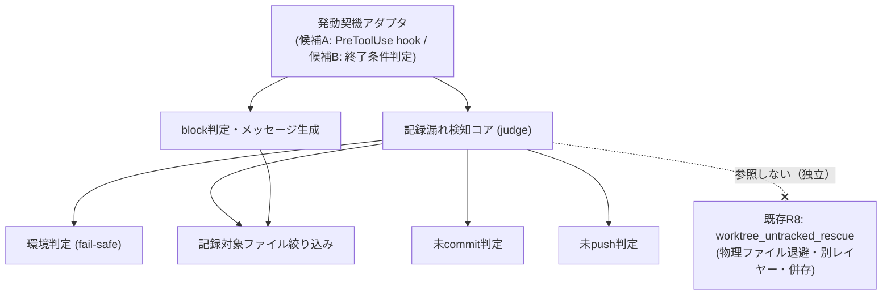

# 設計書: worktree 記録 commit 漏れ検知（issue 記録のライフサイクル管理・commit 規律）

**プロジェクト名**: worktree 記録 commit 漏れ検知（issue 記録のライフサイクル管理・commit 規律）
**作成日**: 2026 年 07 月 16 日
**最終更新**: 2026 年 07 月 16 日

> **重要**: **このドキュメントは常に更新**: 設計の変更や追加があった場合は、即座にこのドキュメントを更新してください。ドキュメントは「生きているドキュメント」として扱い、実装内容と常に同期させます。
>
> **本ファイルの現在の完成度（重要）**: 本ファイルは design-feature の **最初のステップ（architecture__define-boundaries）** の成果物であり、**責務・境界・参照関係のたたき台**である。後続ステップ（design-api-contract＝API・入出力契約の設計、review-dependencies＝依存関係とテスト観点の確認）は別途実施され、§2.2 以降（アーキテクチャパターン確定・ADR・機能設計・データ設計・API 設計・テスト戦略）を埋める。
>
> **未決事項（進行役の裁定が必要）**: 00_要求定義 §6.1 が設計フェーズへ持ち越した 4 件の設計判断（候補 A／候補 B の採否、未 push 判定方式、既存 worktree への遡及適用可否、`--force` 相当フラグ仕様）は、**本ステップでは選択肢とトレードオフの整理に留め、最終決定を下していない**。これら 4 件は**進行役（人間）の裁定を要する未決事項**として §2.6 に整理した。責務・境界（§2.1）は、いずれの選択でも成立するよう方式非依存に記述している。
>
> **用語**: [.agent-skill-chain/source/CONCEPTS.md §用語規約](../../../../../../.agent-skill-chain/source/CONCEPTS.md#用語規約) を参照。

---

## 1. 設計概要

**必須**: 設計方針・原則は [.agent-skill-chain/source/spec/01\_設計原則.md](../../../../../../.agent-skill-chain/source/spec/01_設計原則.md) を**先に参照**した上で、本プロジェクトに**適用するものを選び**記載すること。

### 1.1 設計方針

既存の enforcement 三層構成・PreToolUse hook 設計原則（拡張ファイルは source せずデータとして read、判定不能・内部エラー時は allow に倒す fail-safe）を踏襲し、既存の物理保全レイヤー（R8・`worktree_untracked_rescue`）とは**別レイヤーの「記録の commit・push 規律」検知機構**を、既存機構への最小の追加として設計する（00 §1.2・§3.2・01 §5）。

### 1.2 設計原則（本プロジェクトで適用するもの）

- **単一責務**: 「検知（判定）」「発動契機（いつ呼ぶか）」「block 判定・メッセージ生成」「環境判定（fail-safe）」を分離し、1 コンポーネント 1 責務とする。特に「何を検知するか（判定ロジック）」は発動契機（候補 A／候補 B）から独立させ、アーキテクチャ選択が未確定でも判定ロジックを共有できる構造とする。
- **明確な境界**: 本機構（commit・push 規律の検知）と既存 R8（物理ファイル退避）を明確に分離し、置き換えず併存させる（00 §2.1・§4.2）。
- **UNIX 哲学**: 小さく作る・1 つのことをうまくやる。判定はローカルの git 状態（`git status --porcelain` 相当・`git rev-list @{u}..` 相当）のみを入力とし、外部連携を持たない（01 §4.2）。
- **AI フレンドリー設計**: 既存 `PreToolUse.sh` の R1〜R8 と同型の小さな関数単位で追加し、意図が分かる命名（例: `worktree_record_commit_guard` 相当）とする。

---

## 2. アーキテクチャ設計

### 2.1 責務・境界・参照関係

> **本節が本ステップ（define-boundaries）の中核成果物**。候補 A（削除前ゲート）・候補 B（終了時契約）いずれの採用でも成立するよう、**「発動契機」を抽象化した方式非依存の責務分解**として記述する。

#### 2.1.1 責務一覧

| コンポーネント | 責務（1 文） |
| -------------- | ------------ |
| **記録漏れ検知コア**（judge） | 当該 worktree の記録対象ファイルに未 commit 差分、または未 push ユニークコミットが存在するかを判定して真偽を返す（方式非依存の中核ロジック）。 |
| **記録対象ファイル絞り込み**（scope filter） | git 追跡対象の issue 記録（`00_要求定義.md`〜`04_review.md`・`90_issues.md` 等）のみを判定対象に含め、`memo/` 等の非追跡・transient は除外する。 |
| **未 commit 判定**（uncommitted judge） | 記録対象ファイルに未 commit の差分（未ステージ・ステージ済み・未追跡の記録ファイル）があるかをローカル git 状態のみで判定する。 |
| **未 push 判定**（unpushed judge） | commit 済みだが origin 対応ブランチに存在しないユニークコミットがあるかを、ローカルの remote-tracking 参照との比較のみ（`git fetch` を伴わない）で判定する。 |
| **環境判定**（fail-safe gate） | 非 git ツリー・GitHub 非採用環境等を判定し、対象外なら検知を自然に SKIP（allow に倒す）させる。 |
| **発動契機アダプタ**（trigger adapter） | 検知コアを「いつ・どこで」呼び出すかを担う。実体は採用アーキテクチャに依存する（候補 A＝PreToolUse hook の削除形コマンド検知経路／候補 B＝verify-and-close・終了条件判定経路。§2.6 で裁定）。 |
| **block 判定・メッセージ生成**（gate & reporter） | 検知結果が真のとき既定で block（削除拒否／終了条件不成立）し、`--force` 相当の明示バイパス時のみ通過させる。block 時は未 commit／未 push のファイル・コミットと解消手順（`git add && git commit`／`git push` 例）を提示する。 |

#### 2.1.2 境界

- **入力**: 当該 worktree のローカル git 状態（`git status --porcelain` 相当の作業ツリー状態、`git rev-list @{u}..` 相当の remote-tracking 参照との差分）、および発動契機となるイベント（候補 A＝削除形 Bash コマンド文字列 `tool_input.command`／候補 B＝終了条件判定の呼び出し）。
- **出力**: 検知結果（未 commit／未 push の有無）と、それに基づく allow／block 判定（block 時は exit code・stderr メッセージ、または終了条件の合否）。バイパスフラグ指定時は block を解除して通過。
- **他責務との境界（本責務の範囲外）**:
  - **既存 R8（`worktree_untracked_rescue`・物理ファイル退避）**: 本機構とは別レイヤー。本機構は R8 を呼ばず・置き換えず、独立して併存する（00 §2.1・§4.2・SC-4）。「物理ファイルが消えないか」は R8 の責務、「記録が commit・push されて正式に残るか」が本機構の責務。
  - **auto-commit（解消操作の自動化）**: 検知後の commit・push は実装者／エージェントの手動対応に委ね、本機構は行わない（非採用。00 §2.2・§5・01 §2.3）。
  - **hook 非経由の削除経路**（別プロセス・エディタ・`rm -rf` 等）: 静的パースの対象外であり本機構では捕捉しない（既存 R7/R8 と同型の残余リスク。00 §4.1・§7.1）。
  - **親 issue「worktree 運用規律」の B（命名規則・R7）／C（untracked 退避・R8）の再設計**: 前提として維持し、変更しない（00 §5）。
  - **非 git・GitHub 非採用環境向けの代替記録機構の新設**: SKIP に留め、代替バックアップ等は新設しない（00 §5）。

#### 2.1.3 参照関係

- 発動契機アダプタ → 記録漏れ検知コア（検知結果を得る）
- 記録漏れ検知コア → 環境判定（対象外なら SKIP）
- 記録漏れ検知コア → 記録対象ファイル絞り込み（判定対象を確定）
- 記録漏れ検知コア → 未 commit 判定
- 記録漏れ検知コア → 未 push 判定
- 発動契機アダプタ → block 判定・メッセージ生成（検知真かつバイパス無しのとき）
- block 判定・メッセージ生成 → 記録対象ファイル絞り込み（解消手順に載せる対象ファイル名を取得）

**循環参照は無い**（発動契機アダプタを起点に、検知コア → 各判定サブ責務へ一方向。block 判定はアダプタから呼ばれ、判定サブ責務のみを参照）。**既存 R8 への参照は持たない**（独立・併存の境界を保つ）。

### 2.2 システムアーキテクチャ

（後続ステップ design-api-contract / review-dependencies および §2.6 の裁定後に確定する。採用パターン・根拠・アーキテクチャ図はアーキテクチャ選択＝候補 A／B の裁定に依存するため、本ステップでは未記載とする。）

### 2.5 横断設計判断（ADR）

（本ステップ＝define-boundaries では ADR を確定しない。00 §6.1 が持ち越した 4 件は §2.6 に選択肢とトレードオフを整理済み。**進行役の裁定後**、後続ステップまたは進行役指示のもとで ADR-1〜ADR-4 として本節に確定記録する。）

### 2.6 未決事項（進行役の裁定が必要・本ステップでは決定しない）

> **本節の位置づけ**: 00_要求定義 §6.1 が design-feature へ持ち越した 4 件について、**責務・境界の観点から選択肢とトレードオフを整理する**。**最終決定は下さない。この 4 件はいずれも進行役（人間）の裁定を要する未決事項**であり、裁定後に §2.5 で ADR として確定する。§2.1 の責務・境界は、いずれの選択でも成立するよう方式非依存に設計してある。

#### 未決 1: 候補 A（削除前ゲート）／候補 B（終了時契約）の採否（併用含む）

責務・境界の観点では「記録漏れ検知コア」は方式非依存に切り出せるため、この裁定が影響するのは**発動契機アダプタの実体をどこに置くか**である。

| 選択肢 | 概要 | 利点 | 欠点・トレードオフ |
| ------ | ---- | ---- | ------------------ |
| **A のみ**（削除前ゲート） | `git worktree remove` 系の削除操作を PreToolUse hook（R9 相当）で検知し既定 block | 削除という「事故が起きる瞬間」を直接押さえる／既存 R7・R8 と同じ hook 経路で一貫／即時 reject | hook 非経由の削除は捕捉外（残余リスク）／過剰 block リスク（正当な削除まで止める）／判定を高速・オフラインに保つ制約 |
| **B のみ**（終了時契約） | `verify-and-close`／終了条件判定に「記録 commit・push 済み」検証を追加 | ワークフロー完了条件として自然／エージェント運用フローに沿い解消を促しやすい／過剰 block を hook より起こしにくい | 削除操作そのものは素通りするため、フローを経ずに直接 worktree 削除されると防げない／「削除の瞬間」を押さえない |
| **A + B 併用** | 削除入口（A）と完了条件（B）の 2 契機で二重に担保 | 事故経路を最も広くカバー／どちらか一方の抜けを他方が補う | 実装・保守コスト増／2 箇所でメッセージ・バイパス仕様の整合を保つ必要／過剰 block 面積も増える |

**裁定の論点**: A と B は排他ではなく異なる契機で働く別レイヤー（00 §2.2）。「削除の瞬間を機械的に止めること」を最重要とするなら A（または A+B）、「ワークフロー完走条件としての規律」を重視するなら B。実装コストと過剰 block リスクの許容度が判断材料。

#### 未決 2: 未 push ユニークコミットの判定方式の具体（比較コマンド・stale 対処）

「未 push 判定」責務の内部実装の具体。境界（`git fetch` を行わない＝オフライン・ローカル参照のみ。00 §1.2 前提 2・§4.1）は確定済みで、その制約下での方式選択。

| 論点 | 選択肢 | 利点 | 欠点・トレードオフ |
| ---- | ------ | ---- | ------------------ |
| 比較コマンド | `git rev-list @{u}..`（上流設定に依存） | 上流が設定済みなら簡潔・正確 | `@{u}`（upstream）未設定ブランチでは判定不能→fail-safe SKIP か `origin/<branch>` フォールバックが必要 |
| 比較コマンド（代替） | `origin/<branch>` を明示比較 | upstream 未設定でも動く | ブランチ名と remote-tracking 名の対応を自前解決する必要／origin 以外の remote で破綻 |
| stale 対処 | 許容（そのまま判定） | 実装最小・高速・オフライン厳守 | 直近未 fetch 環境で誤検知（過検知／見落とし）が残る（00 §7.1）→残余リスクとして 01/02 明記済み |
| stale 対処（代替） | stale 可能性を警告表示 | 利用者が誤検知を認識できる | メッセージ設計の追加・「警告疲れ」で無視されるリスク |

**裁定の論点**: fetch を伴わない制約は既定として維持する前提。upstream 未設定時のフォールバック方針と、stale 誤検知を「黙って許容」か「警告付きで許容」かの選択が主眼。

#### 未決 3: 既存 worktree への遡及適用可否（グランドファザリング要否）

境界（適用範囲）の裁定。親 issue の B・C はグランドファザリング（本 issue 完了以降の新規作成分のみ適用）を採用済み（00 §4.3）。

| 選択肢 | 概要 | 利点 | 欠点・トレードオフ |
| ------ | ---- | ---- | ------------------ |
| **遡及適用する** | 既存 worktree にも一律に検知を適用 | 既存 worktree の記録漏れも防げる（保護範囲最大） | 導入前から未 commit を抱える既存 worktree が突然 block され作業停止（過剰 block・移行摩擦） |
| **グランドファザリング**（新規分のみ） | 本 issue 完了以降に作成された worktree のみ適用 | 親 issue B・C と一貫／既存作業を止めない | 既存 worktree の記録漏れは保護対象外／「いつ作成されたか」を判定する baseline 機構が必要 |

**裁定の論点**: 実装方式（候補 A／B）に依存する面がある（A の PreToolUse hook は削除時点で一律発火するため、遡及除外には baseline 参照が要る／B は終了条件を通す worktree にのみ働く）。過剰 block・移行摩擦の許容度と、親 issue との一貫性が判断材料。**未決 1 の裁定と連動**。

#### 未決 4: `--force` 相当バイパスフラグの仕様

「block 判定・メッセージ生成」責務の外部インターフェースの具体。バイパス経路を設ける方針自体は確定（00 §6 SC-2）で、その表現・呼び出し形式の裁定。

| 論点 | 選択肢 | 利点 | 欠点・トレードオフ |
| ---- | ------ | ---- | ------------------ |
| フラグ形式 | コマンドライン引数（例: 既存 `git worktree remove --force` に相乗り／専用フラグ） | 削除コマンドに自然に付随（候補 A と相性可） | `remove --force` は既存 R8 が別意味で扱う（untracked 退避対象）ため意味衝突に注意／専用フラグは静的パースの追加が必要 |
| フラグ形式（代替） | 環境変数（例: `WORKTREE_RECORD_GUARD_BYPASS=1`） | hook・終了条件のどちらからも読める（A/B 両対応）／コマンド文字列を汚さない | 明示性がコマンド引数より弱い（「意図的バイパス」が見えにくい） |
| ログ記録 | バイパス実行を記録する／しない | 記録すれば「なぜ記録が残らなかったか」の追跡可能 | 記録先・記録主体（書記委譲の要否）の設計が増える |

**裁定の論点**: 候補 A／B のどちらで発火するか（未決 1）に依存し、A ならコマンド引数、B なら環境変数寄りが自然。既存 `--force`（R8 の untracked 退避トリガと意味が異なる）との衝突回避と、バイパスの明示性・監査可能性が主眼。

---

## 3. 機能設計

（design-api-contract ステップで、§2.1 の責務・境界を前提に各判定の入出力・処理フロー・エラーハンドリングを設計する。§2.6 の裁定に依存する部分は裁定後に確定。）

---

## 6. テスト戦略

（review-dependencies ステップで、01_要件定義の SC-1〜SC-6・BDD シナリオ 1〜9 に対応するテスト割当を §6.1 に整理する。既存 `test/test-worktree-discipline.sh` の非破壊（SC-4）を含む。）

---

## 10. 参考資料

### プロジェクトドキュメント

- [`01_要件定義.md`](./01_要件定義.md) - 要件定義（SC-1〜SC-6・BDD ユースケース 1〜6）
- [`00_要求定義.md`](./00_要求定義.md) - 要求定義（§6.1 設計フェーズ申し送り 4 件＝本書 §2.6 の裁定対象）
- 既存 enforcement（R7 命名強制・R8 untracked 退避の実装）: [`.agent-skill-chain/source/enforcement/claude/PreToolUse.sh`](../../../../../../.agent-skill-chain/source/enforcement/claude/PreToolUse.sh)（R7/R8＝L956-969、`worktree_untracked_rescue`＝L476-）
- enforcement 失敗条件一覧（新規番号は現行最大 #40 の次＝#41 相当を採番する想定・具体は後続ステップ／裁定後に確定）: [`.agent-skill-chain/source/enforcement/README.md`](../../../../../../.agent-skill-chain/source/enforcement/README.md)

### その他の参考資料

- 記録 commit 漏れの実事故記録: `docs/maintainer/workflow/20260715_160558_issue運用ポリシー全面移行/90_issues.md`（2026-07-15、00〜03 一式が一度も commit されないまま worktree 削除で喪失。SC-5 の再現対象）

---

## 11. 前のステップ

この設計書は、以下のドキュメントを基に作成されています：

- **前**: [`01_要件定義.md`](./01_要件定義.md) - 要件定義フェーズ

---

## 12. 次のステップ

この設計書の承認後、以下のドキュメントを作成します：

- **本フェーズの残ステップ**: design-api-contract（API・入出力契約）→ review-dependencies（依存関係・テスト観点）。
- **進行役の裁定**: §2.6 の未決 4 件を裁定し、§2.5 に ADR-1〜ADR-4 として確定する。
- **次フェーズ**: [`03_実装計画.md`](./03_実装計画.md) - 実装計画フェーズ（implement-feature）。
