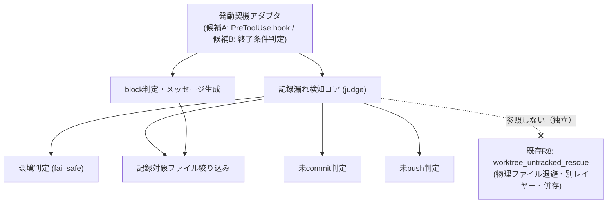
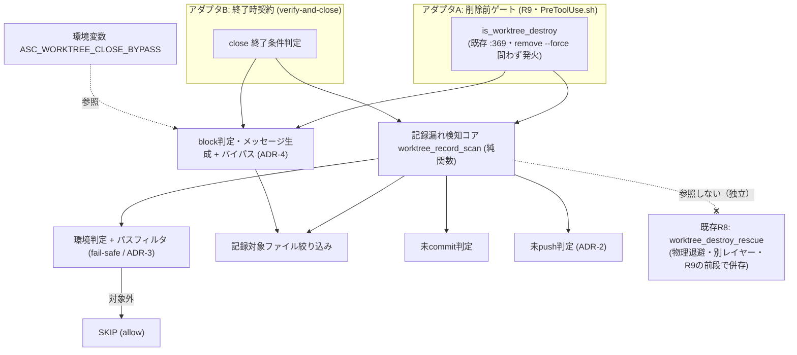

# 設計書: worktree 記録 commit 漏れ検知（issue 記録のライフサイクル管理・commit 規律）

**プロジェクト名**: worktree 記録 commit 漏れ検知（issue 記録のライフサイクル管理・commit 規律）
**作成日**: 2026 年 07 月 16 日
**最終更新**: 2026 年 07 月 16 日

> **重要**: **このドキュメントは常に更新**: 設計の変更や追加があった場合は、即座にこのドキュメントを更新してください。ドキュメントは「生きているドキュメント」として扱い、実装内容と常に同期させます。
>
> **本ファイルの現在の完成度**: define-boundaries（§2.1 責務・境界）に続き、**design-api-contract ステップ完了**（§2.2 アーキテクチャ確定・§2.5 ADR-1〜4 確定記録・§3 機能設計＝各コンポーネントの入出力契約・処理フロー・エラーハンドリング）。残ステップは review-dependencies（依存関係とテスト観点＝§6 テスト戦略）。
>
> **未決事項は裁定完了**: 00_要求定義 §6.1 が持ち越した 4 件（発動契機の採否、未 push 判定方式、遡及適用可否、バイパス仕様）は進行役により裁定され、[§2.5 ADR-1〜ADR-4](#25-横断設計判断adr) に確定記録した。§2.6 は検討過程の記録として保持する。責務・境界（§2.1）は確定 ADR と整合する。
>
> **用語**: [.agent-skill-chain/source/CONCEPTS.md §用語規約](../../../../../../.agent-skill-chain/source/CONCEPTS.md#用語規約) を参照。

---

## 1. 設計概要

**必須**: 設計方針・原則は [.agent-skill-chain/source/spec/01\_設計原則.md](../../../../../../.agent-skill-chain/source/spec/01_設計原則.md) を**先に参照**した上で、本プロジェクトに**適用するものを選び**記載すること。

### 1.1 設計方針

既存の enforcement 三層構成・PreToolUse hook 設計原則（拡張ファイルは source せずデータとして read、判定不能・内部エラー時は allow に倒す fail-safe）を踏襲し、既存の物理保全レイヤー（R8・`worktree_untracked_rescue`）とは**別レイヤーの「記録の commit・push 規律」検知機構**を、既存機構への最小の追加として設計する（00 §1.2・§3.2・01 §5）。

### 1.2 設計原則（本プロジェクトで適用するもの）

- **単一責務**: 「検知（判定）」「発動契機（いつ呼ぶか）」「block 判定・メッセージ生成」「環境判定（fail-safe）」を分離し、1 コンポーネント 1 責務とする。特に「何を検知するか（判定ロジック）」は発動契機（候補 A／候補 B）から独立させ、アーキテクチャ選択が未確定でも判定ロジックを共有できる構造とする。
- **明確な境界**: 本機構（commit・push 規律の検知）と既存 R8（物理ファイル退避）を明確に分離し、置き換えず併存させる（00 §2.1・§4.2）。
- **UNIX 哲学**: 小さく作る・1 つのことをうまくやる。判定はローカルの git 状態（`git status --porcelain` 相当・`git rev-list @{u}..` 相当）のみを入力とし、外部連携を持たない（01 §4.2）。
- **AI フレンドリー設計**: 既存 `PreToolUse.sh` の R1〜R8 と同型の小さな関数単位で追加し、意図が分かる命名（例: `worktree_record_commit_guard` 相当）とする。

---

## 2. アーキテクチャ設計

### 2.1 責務・境界・参照関係

> **本節が本ステップ（define-boundaries）の中核成果物**。候補 A（削除前ゲート）・候補 B（終了時契約）いずれの採用でも成立するよう、**「発動契機」を抽象化した方式非依存の責務分解**として記述する。

#### 2.1.1 責務一覧

| コンポーネント | 責務（1 文） |
| -------------- | ------------ |
| **記録漏れ検知コア**（judge） | 当該 worktree の記録対象ファイルに未 commit 差分、または未 push ユニークコミットが存在するかを判定して真偽を返す（方式非依存の中核ロジック）。 |
| **記録対象ファイル絞り込み**（scope filter） | git 追跡対象の issue 記録（`00_要求定義.md`〜`04_review.md`・`90_issues.md` 等）のみを判定対象に含め、`memo/` 等の非追跡・transient は除外する。 |
| **未 commit 判定**（uncommitted judge） | 記録対象ファイルに未 commit の差分（未ステージ・ステージ済み・未追跡の記録ファイル）があるかをローカル git 状態のみで判定する。 |
| **未 push 判定**（unpushed judge） | commit 済みだが origin 対応ブランチに存在しないユニークコミットがあるかを、ローカルの remote-tracking 参照との比較のみ（`git fetch` を伴わない）で判定する。 |
| **環境判定**（fail-safe gate） | 非 git ツリー・GitHub 非採用環境等を判定し、対象外なら検知を自然に SKIP（allow に倒す）させる。 |
| **発動契機アダプタ**（trigger adapter） | 検知コアを「いつ・どこで」呼び出すかを担う。実体は採用アーキテクチャに依存する（候補 A＝PreToolUse hook の削除形コマンド検知経路／候補 B＝verify-and-close・終了条件判定経路。§2.6 で裁定）。 |
| **block 判定・メッセージ生成**（gate & reporter） | 検知結果が真のとき既定で block（削除拒否／終了条件不成立）し、`--force` 相当の明示バイパス時のみ通過させる。block 時は未 commit／未 push のファイル・コミットと解消手順（`git add && git commit`／`git push` 例）を提示する。 |

#### 2.1.2 境界

- **入力**: 当該 worktree のローカル git 状態（`git status --porcelain` 相当の作業ツリー状態、`git rev-list @{u}..` 相当の remote-tracking 参照との差分）、および発動契機となるイベント（候補 A＝削除形 Bash コマンド文字列 `tool_input.command`／候補 B＝終了条件判定の呼び出し）。
- **出力**: 検知結果（未 commit／未 push の有無）と、それに基づく allow／block 判定（block 時は exit code・stderr メッセージ、または終了条件の合否）。バイパスフラグ指定時は block を解除して通過。
- **他責務との境界（本責務の範囲外）**:
  - **既存 R8（`worktree_untracked_rescue`・物理ファイル退避）**: 本機構とは別レイヤー。本機構は R8 を呼ばず・置き換えず、独立して併存する（00 §2.1・§4.2・SC-4）。「物理ファイルが消えないか」は R8 の責務、「記録が commit・push されて正式に残るか」が本機構の責務。
  - **auto-commit（解消操作の自動化）**: 検知後の commit・push は実装者／エージェントの手動対応に委ね、本機構は行わない（非採用。00 §2.2・§5・01 §2.3）。
  - **hook 非経由の削除経路**（別プロセス・エディタ・`rm -rf` 等）: 静的パースの対象外であり本機構では捕捉しない（既存 R7/R8 と同型の残余リスク。00 §4.1・§7.1）。
  - **親 issue「worktree 運用規律」の B（命名規則・R7）／C（untracked 退避・R8）の再設計**: 前提として維持し、変更しない（00 §5）。
  - **非 git・GitHub 非採用環境向けの代替記録機構の新設**: SKIP に留め、代替バックアップ等は新設しない（00 §5）。

#### 2.1.3 参照関係

- 発動契機アダプタ → 記録漏れ検知コア（検知結果を得る）
- 記録漏れ検知コア → 環境判定（対象外なら SKIP）
- 記録漏れ検知コア → 記録対象ファイル絞り込み（判定対象を確定）
- 記録漏れ検知コア → 未 commit 判定
- 記録漏れ検知コア → 未 push 判定
- 発動契機アダプタ → block 判定・メッセージ生成（検知真かつバイパス無しのとき）
- block 判定・メッセージ生成 → 記録対象ファイル絞り込み（解消手順に載せる対象ファイル名を取得）

**循環参照は無い**（発動契機アダプタを起点に、検知コア → 各判定サブ責務へ一方向。block 判定はアダプタから呼ばれ、判定サブ責務のみを参照）。**既存 R8 への参照は持たない**（独立・併存の境界を保つ）。

### 2.2 システムアーキテクチャ

> **裁定反映**: §2.6 の未決 4 件は進行役により裁定済み（ADR-1〜ADR-4＝§2.5）。本節はその確定を前提にアーキテクチャパターンを確定する。

#### 2.2.1 採用パターン: 共有検知コア ＋ 2 発動契機アダプタ（ports & adapters 風）

**ADR-1（A + B 併用）**の裁定により、方式非依存に切り出した**記録漏れ検知コア**（純関数・副作用なし）を中核に据え、これを **2 つの発動契機アダプタ**が共有する構成を採る。

- **記録漏れ検知コア**（`worktree_record_scan` 相当）: 対象 worktree のローカル git 状態のみを入力に、未 commit／未 push の有無と対象一覧を返す**純関数**。呼び出し元（A／B）を知らない。
- **アダプタ A（削除前ゲート・R9 相当）**: 既存 `PreToolUse.sh` の R7／R8 と同じ hook 経路に**新規失敗条件 R9** として追加する。既存 `is_worktree_destroy`（`PreToolUse.sh:369`）が `remove --force` 有無を問わず削除形を検知する基盤として既に存在するため、その検知直後にコアを呼び、真かつバイパス無しなら `block`（exit 2）。既存 R8（`worktree_destroy_rescue`＝物理退避・block しない）とは**別の失敗条件として併存**し、R8 の後段（allow 直前）で評価する。
- **アダプタ B（終了時契約）**: `verify-and-close` の終了条件判定に「記録 commit・push 済み」検証を追加する。コアを呼び、真なら**完了条件不成立**として close をブロックし解消を促す。
- **バイパス（ADR-4）**: 環境変数 `ASC_WORKTREE_CLOSE_BYPASS=1` を A・B 双方が同一参照する。設定時は block を解除しつつ、バイパス使用を stderr へ明示ログ出力（監査痕跡）。
- **適用範囲（ADR-3）**: 環境判定内の**パスフィルタ**で、R7 命名規則準拠パス（`.worktree/<type>/<YYYYMMDD_HHMMSS>/<name>/`）配下の worktree のみを検知対象とする。baseline 記録機構は新設しない。

**この構成の根拠**: (1) 検知ロジックを 1 箇所（コア）に集約し、A／B 2 契機でメッセージ・判定の乖離を防ぐ（DRY・単一責務）。(2) 既存 enforcement の「小さな関数を R 番号で足す」パターン（R1〜R8）と同型で AI フレンドリー。(3) コアが純関数のため A（hook・オフライン高速制約）でも B（ワークフロー）でも同一に再利用でき、テスト時はコア単体を直接検証できる（疎結合）。(4) 既存 R8 を呼ばず・置き換えず併存（物理保全レイヤーと記録規律レイヤーの分離＝00 §2.1・§4.2・SC-4）。

#### 2.2.2 アーキテクチャ図

#### 2.2.3 レイヤーと配置

| レイヤー | 配置（想定） | 内容 |
| -------- | ------------ | ---- |
| 共有コア・判定サブ責務 | `PreToolUse.sh` 内の `worktree-discipline lib` 区画（R7/R8 と同区画） | `worktree_record_scan` ほか純関数群。B からも共有できるよう副作用を持たせない。 |
| アダプタ A（R9） | `PreToolUse.sh` の R8 評価直後・`allow` 直前 | 削除形検知 → コア → block/allow。 |
| アダプタ B | `verify-and-close` 系の終了条件（`.agent-skill-chain/source/commands` 側） | close 前にコアを呼び完了条件として検証。 |
| バイパス | 環境変数（A・B 共通参照） | `ASC_WORKTREE_CLOSE_BYPASS`。 |

### 2.5 横断設計判断（ADR）

> 00 §6.1／§2.6 の未決 4 件を進行役が裁定した確定記録。選択肢・トレードオフの全体像は §2.6 を参照。

#### ADR-1: 発動契機は候補 A（削除前ゲート）＋候補 B（終了時契約）の併用を採用

- **決定**: A と B を併用する。A は `PreToolUse.sh` の新規失敗条件 R9 として削除形を検知して既定 block、B は `verify-and-close` の終了条件に記録 commit・push 検証を追加する。
- **根拠**: 事故の実経路（ワークフローを経ない直接削除。2026-07-15 の実事故＝喪失と同型）を防ぐには A（削除の瞬間を押さえるゲート）が必須。既存 `is_worktree_destroy`（`PreToolUse.sh:369`）が `remove --force` 有無を問わず発火する検知基盤として**既に存在する**ため、A の追加実装コストは「検知直後に検知コアを呼ぶ」程度に収まる。B は A の抜け（hook 非経由等）を完了条件として補い、ワークフロー完走規律としても二重に担保する。
- **帰結**: 実装・保守は 2 箇所になるが、判定ロジックは §2.2.1 の共有コアに集約してメッセージ・バイパス仕様の乖離を防ぐ。過剰 block 面積の増加は ADR-3（適用範囲限定）・ADR-4（バイパス）で緩和する。

#### ADR-2: 未 push 判定は `git rev-list @{u}..` を優先し、upstream 未設定時は `origin/<branch>` 比較へフォールバック。stale は警告付きで許容

- **決定**: (1) `git rev-list @{u}..<HEAD>` でユニークコミットの有無を判定する。(2) `@{u}`（upstream）未設定時は現ブランチ名から `origin/<branch>` を解決して比較へフォールバックする。(3) `git fetch` は行わない（オフライン・ローカル remote-tracking 参照のみ＝00 §1.2 前提 2）。(4) 直近未 fetch（stale）による誤検知は**黙って許容せず、警告文を添えて許容**する（「push 済みのはずだが直近 fetch していないため実際と乖離している可能性がある」旨を明示）。
- **根拠**: upstream 設定済みが最も簡潔・正確。未設定ブランチでも `origin/<branch>` 明示比較で判定を継続でき、fail-safe SKIP に落とすより保護範囲が広い。fetch 非依存はローカル・高速・オフライン厳守の前提を保つ。stale 誤検知は残余リスクだが、警告表示により利用者が乖離を認識できる（「黙って許容」より監査性が高い）。
- **帰結**: `origin` 以外の remote 運用や remote-tracking 名の非自明な対応では判定不能となりうるため、その場合は fail-safe（SKIP＋警告）へ倒す。

#### ADR-3: 遡及適用はグランドファザリング。R7 命名規則準拠パス配下の worktree のみを検知対象とする（baseline 機構は新設しない）

- **決定**: 本 issue 完了以降に作成された新規 worktree のみを検知対象とするグランドファザリングを採用する。実装方式として「いつ作成されたか」を追跡する baseline 記録機構は**新設せず**、R7 命名規則準拠パス（`.worktree/<type>/<YYYYMMDD_HHMMSS>/<name>/` 形式）配下の worktree のみを検知対象とすることで、本 issue 導入前からある非準拠パスの既存 worktree を事実上対象外とする。
- **根拠**: 親 issue「worktree 運用規律」の B（R7 命名）・C（R8 退避）と一貫（グランドファザリング済み＝00 §4.3）。命名規則自体が既に R7 でグランドファザリングされているため、その準拠パスをフィルタに用いれば新規 state を持たずに遡及除外が実現でき、実装・保守が最小。既存作業を突然 block する移行摩擦も避けられる。
- **帰結**: 非準拠パスの既存 worktree の記録漏れは保護対象外（親 issue と同じ既知の割り切り）。パスフィルタは環境判定（fail-safe gate）内に置き、A・B 双方が共有する。

#### ADR-4: バイパスは環境変数 `ASC_WORKTREE_CLOSE_BYPASS` 方式。使用時は明示ログ・警告を出力

- **決定**: コマンドライン引数（`--force` 相乗り／専用フラグ）ではなく**環境変数**（例: `ASC_WORKTREE_CLOSE_BYPASS=1`）でバイパスを表現する。A 経路（hook）・B 経路（終了条件）の双方から同一環境変数を参照する。バイパス実行時は stderr へ「バイパスが使用された」ことを明示的にログ・警告出力する。
- **根拠**: 既存 `git worktree remove --force` は R8 が untracked 退避対象として**別意味で既に消費**しているため、`--force` 相乗りは意味衝突を招く。環境変数なら A/B 両契機から一様に読め、削除コマンド文字列を汚さない。バイパスは事故経路そのものであるため、痕跡（ログ）を残して監査可能性を確保する。
- **帰結**: 環境変数はコマンド引数より「意図的バイパス」の明示性が弱い。これをログ・警告出力で補い、「なぜ記録が残らなかったか」を事後追跡可能にする。

### 2.6 未決事項の整理（裁定済み・記録として保持）

> **本節の位置づけ（裁定完了）**: 00_要求定義 §6.1 が design-feature へ持ち越した 4 件は、進行役により**すべて裁定済み**（確定記録は [§2.5 ADR-1〜ADR-4](#25-横断設計判断adr)）。本節は裁定に至った**選択肢とトレードオフの検討過程**を記録として保持する（意思決定の根拠追跡用）。未決 1→ADR-1、未決 2→ADR-2、未決 3→ADR-3、未決 4→ADR-4 に対応する。§2.1 の責務・境界は、いずれの選択でも成立するよう方式非依存に設計してあり、確定した ADR とも整合する。

#### 未決 1: 候補 A（削除前ゲート）／候補 B（終了時契約）の採否（併用含む）

責務・境界の観点では「記録漏れ検知コア」は方式非依存に切り出せるため、この裁定が影響するのは**発動契機アダプタの実体をどこに置くか**である。

| 選択肢 | 概要 | 利点 | 欠点・トレードオフ |
| ------ | ---- | ---- | ------------------ |
| **A のみ**（削除前ゲート） | `git worktree remove` 系の削除操作を PreToolUse hook（R9 相当）で検知し既定 block | 削除という「事故が起きる瞬間」を直接押さえる／既存 R7・R8 と同じ hook 経路で一貫／即時 reject | hook 非経由の削除は捕捉外（残余リスク）／過剰 block リスク（正当な削除まで止める）／判定を高速・オフラインに保つ制約 |
| **B のみ**（終了時契約） | `verify-and-close`／終了条件判定に「記録 commit・push 済み」検証を追加 | ワークフロー完了条件として自然／エージェント運用フローに沿い解消を促しやすい／過剰 block を hook より起こしにくい | 削除操作そのものは素通りするため、フローを経ずに直接 worktree 削除されると防げない／「削除の瞬間」を押さえない |
| **A + B 併用** | 削除入口（A）と完了条件（B）の 2 契機で二重に担保 | 事故経路を最も広くカバー／どちらか一方の抜けを他方が補う | 実装・保守コスト増／2 箇所でメッセージ・バイパス仕様の整合を保つ必要／過剰 block 面積も増える |

**裁定の論点**: A と B は排他ではなく異なる契機で働く別レイヤー（00 §2.2）。「削除の瞬間を機械的に止めること」を最重要とするなら A（または A+B）、「ワークフロー完走条件としての規律」を重視するなら B。実装コストと過剰 block リスクの許容度が判断材料。

#### 未決 2: 未 push ユニークコミットの判定方式の具体（比較コマンド・stale 対処）

「未 push 判定」責務の内部実装の具体。境界（`git fetch` を行わない＝オフライン・ローカル参照のみ。00 §1.2 前提 2・§4.1）は確定済みで、その制約下での方式選択。

| 論点 | 選択肢 | 利点 | 欠点・トレードオフ |
| ---- | ------ | ---- | ------------------ |
| 比較コマンド | `git rev-list @{u}..`（上流設定に依存） | 上流が設定済みなら簡潔・正確 | `@{u}`（upstream）未設定ブランチでは判定不能→fail-safe SKIP か `origin/<branch>` フォールバックが必要 |
| 比較コマンド（代替） | `origin/<branch>` を明示比較 | upstream 未設定でも動く | ブランチ名と remote-tracking 名の対応を自前解決する必要／origin 以外の remote で破綻 |
| stale 対処 | 許容（そのまま判定） | 実装最小・高速・オフライン厳守 | 直近未 fetch 環境で誤検知（過検知／見落とし）が残る（00 §7.1）→残余リスクとして 01/02 明記済み |
| stale 対処（代替） | stale 可能性を警告表示 | 利用者が誤検知を認識できる | メッセージ設計の追加・「警告疲れ」で無視されるリスク |

**裁定の論点**: fetch を伴わない制約は既定として維持する前提。upstream 未設定時のフォールバック方針と、stale 誤検知を「黙って許容」か「警告付きで許容」かの選択が主眼。

#### 未決 3: 既存 worktree への遡及適用可否（グランドファザリング要否）

境界（適用範囲）の裁定。親 issue の B・C はグランドファザリング（本 issue 完了以降の新規作成分のみ適用）を採用済み（00 §4.3）。

| 選択肢 | 概要 | 利点 | 欠点・トレードオフ |
| ------ | ---- | ---- | ------------------ |
| **遡及適用する** | 既存 worktree にも一律に検知を適用 | 既存 worktree の記録漏れも防げる（保護範囲最大） | 導入前から未 commit を抱える既存 worktree が突然 block され作業停止（過剰 block・移行摩擦） |
| **グランドファザリング**（新規分のみ） | 本 issue 完了以降に作成された worktree のみ適用 | 親 issue B・C と一貫／既存作業を止めない | 既存 worktree の記録漏れは保護対象外／「いつ作成されたか」を判定する baseline 機構が必要 |

**裁定の論点**: 実装方式（候補 A／B）に依存する面がある（A の PreToolUse hook は削除時点で一律発火するため、遡及除外には baseline 参照が要る／B は終了条件を通す worktree にのみ働く）。過剰 block・移行摩擦の許容度と、親 issue との一貫性が判断材料。**未決 1 の裁定と連動**。

#### 未決 4: `--force` 相当バイパスフラグの仕様

「block 判定・メッセージ生成」責務の外部インターフェースの具体。バイパス経路を設ける方針自体は確定（00 §6 SC-2）で、その表現・呼び出し形式の裁定。

| 論点 | 選択肢 | 利点 | 欠点・トレードオフ |
| ---- | ------ | ---- | ------------------ |
| フラグ形式 | コマンドライン引数（例: 既存 `git worktree remove --force` に相乗り／専用フラグ） | 削除コマンドに自然に付随（候補 A と相性可） | `remove --force` は既存 R8 が別意味で扱う（untracked 退避対象）ため意味衝突に注意／専用フラグは静的パースの追加が必要 |
| フラグ形式（代替） | 環境変数（例: `WORKTREE_RECORD_GUARD_BYPASS=1`） | hook・終了条件のどちらからも読める（A/B 両対応）／コマンド文字列を汚さない | 明示性がコマンド引数より弱い（「意図的バイパス」が見えにくい） |
| ログ記録 | バイパス実行を記録する／しない | 記録すれば「なぜ記録が残らなかったか」の追跡可能 | 記録先・記録主体（書記委譲の要否）の設計が増える |

**裁定の論点**: 候補 A／B のどちらで発火するか（未決 1）に依存し、A ならコマンド引数、B なら環境変数寄りが自然。既存 `--force`（R8 の untracked 退避トリガと意味が異なる）との衝突回避と、バイパスの明示性・監査可能性が主眼。

---

## 3. 機能設計

> §2.1 の責務・境界と §2.5 の ADR-1〜ADR-4 を前提に、各コンポーネントの**入出力契約・処理フロー・エラーハンドリング（契約違反時の扱い）**を定義する。実装詳細（関数の逐次コード）は 03_実装計画へ委譲し、本節は契約に限る。関数名は既存 R7/R8 と同型の暫定名（`_wt_*`／`worktree_record_*`）で示す。

**共通のエラー方針（fail-safe）**: すべての判定サブ責務は、非 git・コマンド不在（`git` 無し）・内部エラー・解決不能を検知したら**対象外として SKIP（allow 側に倒す）**する（既存 PreToolUse hook の fail-safe 原則＝01 §4.2）。block へ倒すのは「記録漏れが確証できた」場合に限る（fail-closed は命名強制 R7 側の責務で、本機構は保護の追加であり作業停止の過剰 block を避ける）。

### 3.1 記録漏れ検知コア（`worktree_record_scan`）

| 項目 | 内容 |
| ---- | ---- |
| **責務** | 対象 worktree に「記録の未 commit 差分」または「未 push ユニークコミット」があるかを判定し、真偽と対象一覧を返す純関数。副作用なし。 |
| **入力** | `target`（対象 worktree の絶対/相対パス。A では `WT_DESTROY_PATH`〈空なら CWD〉、B では close 対象 worktree のパス）。 |
| **出力** | `RECORD_DIRTY`（0/1）、`RECORD_UNCOMMITTED`（未 commit の記録ファイル一覧）、`RECORD_UNPUSHED`（未 push コミットの短 SHA/件数）、`RECORD_WARN`（stale 警告文。無ければ空）。 |
| **処理フロー** | (1) 環境判定（§3.5）を呼び、対象外なら `RECORD_DIRTY=0` で即 return（SKIP）。(2) 記録対象ファイル絞り込み（§3.2）で判定対象集合を得る。(3) 未 commit 判定（§3.3）。(4) 未 push 判定（§3.4）。(5) いずれかが真なら `RECORD_DIRTY=1`。 |
| **契約違反時** | `target` が空/非 git/解決不能 → 環境判定で SKIP（`RECORD_DIRTY=0`）。判定コマンド失敗（`git` 異常終了）→ その判定は「漏れなし」扱いにフォールバックし SKIP（過剰 block 回避）。 |

### 3.2 記録対象ファイル絞り込み（`_wt_record_scope`）

| 項目 | 内容 |
| ---- | ---- |
| **責務** | git 追跡対象の issue 記録（`00_要求定義.md`〜`04_review.md`・`90_issues.md` 等）のみを判定対象に含め、`memo/` 等の非追跡・transient を除外する。 |
| **入力** | `target`（worktree パス）。 |
| **出力** | 判定対象パスの集合（git 管理下の記録ファイル）。 |
| **処理フロー** | (1) `git -C <target> ls-files` で追跡対象を列挙。(2) 記録ファイル名パターン（`0[0-4]_*.md`・`90_issues.md` 等）に一致するものへ絞る。(3) `memo/`・非追跡（`--others`）は対象外。未追跡でも「新規作成された記録ファイル」（`??` の記録ファイル名）は未 commit 側で拾うため §3.3 と連携。 |
| **契約違反時** | `ls-files` 失敗 → 空集合（＝漏れなし扱い・SKIP）。 |

### 3.3 未 commit 判定（`_wt_record_uncommitted`）

| 項目 | 内容 |
| ---- | ---- |
| **責務** | 記録対象ファイルに未 commit 差分（未ステージ・ステージ済み・未追跡の記録ファイル）があるかをローカル git 状態のみで判定。 |
| **入力** | `target`、§3.2 の対象集合。 |
| **出力** | 未 commit の記録ファイル一覧（空なら「漏れなし」）。 |
| **処理フロー** | `git -C <target> status --porcelain -- <対象>` を評価し、記録ファイル名に一致する変更行（`M`/`A`/`??` 等）を抽出。`fetch` を伴わずローカルのみ。 |
| **契約違反時** | `status` 失敗 → 空（漏れなし・SKIP）。 |

### 3.4 未 push 判定（`_wt_record_unpushed`）— ADR-2

| 項目 | 内容 |
| ---- | ---- |
| **責務** | commit 済みだが origin 対応ブランチに未反映のユニークコミットを、`git fetch` を伴わずローカル remote-tracking 参照との比較のみで判定。 |
| **入力** | `target`。 |
| **出力** | 未 push コミットの件数・短 SHA 一覧（空なら「漏れなし」）、必要に応じ stale 警告文。 |
| **処理フロー（ADR-2）** | (1) 優先: `git -C <target> rev-list @{u}..HEAD` の件数で判定。(2) `@{u}` 未設定なら現ブランチ名を `git -C <target> rev-parse --abbrev-ref HEAD` で取得し `git -C <target> rev-list origin/<branch>..HEAD` へフォールバック。(3) `fetch` は実行しない。(4) 判定できたが remote-tracking が stale の可能性がある場合、結果に「push 済みのはずだが直近 fetch していないため実際と乖離している可能性がある」旨の**警告文**を添えて許容（黙って握り潰さない）。 |
| **契約違反時** | `@{u}` 未設定かつ `origin/<branch>` も未解決（origin 以外の remote・remote-tracking 不在）→ 判定不能として SKIP＋警告（過剰 block 回避）。`rev-list` 失敗 → SKIP。 |

### 3.5 環境判定・グランドファザリング パスフィルタ（`_wt_record_env_gate`）— ADR-3

| 項目 | 内容 |
| ---- | ---- |
| **責務** | 非 git・GitHub 非採用・コマンド不在等を SKIP させる fail-safe gate。加えて R7 命名規則準拠パス配下のみを検知対象に限定する（遡及除外＝グランドファザリング）。 |
| **入力** | `target`。 |
| **出力** | `IN_SCOPE`（0/1）。0 なら検知コアは即 SKIP。 |
| **処理フロー** | (1) `command -v git` 不在 → 対象外。(2) `git -C <target> rev-parse --is-inside-work-tree` 偽 → 対象外。(3) **パスフィルタ**: `target` の絶対パスが `.worktree/<type>/<YYYYMMDD_HHMMSS>/<name>/` 形式（`type=feature|bugfix|hotfix|release|chore`、既存 R7 の `validate_worktree_path` と同一の命名パターン）に一致しなければ対象外（本 issue 導入前の非準拠パスの既存 worktree を事実上除外）。(4) すべて満たせば `IN_SCOPE=1`。 |
| **契約違反時** | 解決不能・判定エラーは一律 `IN_SCOPE=0`（SKIP＝fail-safe）。baseline state は持たない。 |

### 3.6 発動契機アダプタ A（削除前ゲート・R9 相当）

| 項目 | 内容 |
| ---- | ---- |
| **責務** | 削除形 Bash コマンドを検知し、記録漏れが確証されバイパス無しなら削除を block する。 |
| **入力** | `CMD`（Bash `tool_input.command`）。TOOL=Bash かつ CMD 非空時のみ評価。 |
| **出力** | block（exit 2・`[enforcement:block]` 日英併記）または allow（exit 0）。 |
| **処理フロー** | (1) 既存の segment 分割（`;`/`&`/`\|` → 改行）＋ `_wt_effective` で各セグメントを正規化。(2) `is_worktree_destroy`（既存 :369）で削除形と `WT_DESTROY_PATH` を得る。(3) 対象 `tgt`（空なら CWD）に対し `worktree_record_scan`（§3.1）を呼ぶ。(4) `RECORD_DIRTY=1` かつバイパス未設定なら §3.8 の reporter で block。(5) それ以外は allow へ通す。**配置**: 既存 R8（`worktree_destroy_rescue`＝物理退避）評価の**直後**、最終 `allow` の直前（R8 の物理保全を先に済ませてから記録規律を判定）。 |
| **契約違反時** | 削除形と確定できない/対象外/非 git は allow（fail-open）。`scan` 内部エラーは SKIP＝allow。 |

### 3.7 発動契機アダプタ B（終了時契約・verify-and-close）

| 項目 | 内容 |
| ---- | ---- |
| **責務** | close ワークフローの終了条件に「記録 commit・push 済み」を追加し、漏れがあれば完了させない。 |
| **入力** | close 対象 worktree のパス。 |
| **出力** | 完了条件 合格／不合格（不合格時は §3.8 と同等の解消手順を提示し close をブロック）。 |
| **処理フロー** | (1) close 対象 worktree で `worktree_record_scan` を呼ぶ。(2) `RECORD_DIRTY=1` かつバイパス未設定なら完了条件不成立として close を止め、未 commit／未 push 一覧と解消手順を提示。(3) それ以外は合格。stale 警告があれば合格でも警告を併記。 |
| **契約違反時** | 非 git・対象外は条件対象外として合格扱い（過剰阻害回避）。 |

### 3.8 block 判定・メッセージ生成・バイパス（`worktree_record_reject` / reporter）— ADR-4

| 項目 | 内容 |
| ---- | ---- |
| **責務** | 検知結果が真のとき既定で block／不成立とし、解消手順を提示。バイパス時のみ通過させ痕跡を残す。 |
| **入力** | `RECORD_UNCOMMITTED`・`RECORD_UNPUSHED`・`RECORD_WARN`、環境変数 `ASC_WORKTREE_CLOSE_BYPASS`。 |
| **出力** | block（A: exit 2／B: 完了条件不成立）またはバイパス通過（＋警告ログ）。 |
| **処理フロー（ADR-4）** | (1) `ASC_WORKTREE_CLOSE_BYPASS=1` なら block を解除し、stderr へ「バイパスが使用された（記録が残らない可能性がある）」旨を**明示ログ・警告**出力して通過（監査痕跡）。(2) 未設定なら block。メッセージは既存 `worktree_name_reject` と同体裁（`[enforcement:block]` プレフィックス・`<英語> / <日本語>` 併記）で、①未 commit の記録ファイル名、②未 push コミット、③解消手順（`git add <files> && git commit` ／ `git push` の具体例）を提示。(3) `RECORD_WARN`（stale）があれば block/通過いずれでも警告文を併記。 |
| **契約違反時** | 一覧が空（＝漏れなし）で誤って呼ばれた場合は何もせず allow（防御的）。 |

---

## 6. テスト戦略

（review-dependencies ステップで、01_要件定義の SC-1〜SC-6・BDD シナリオ 1〜9 に対応するテスト割当を §6.1 に整理する。既存 `test/test-worktree-discipline.sh` の非破壊（SC-4）を含む。）

---

## 10. 参考資料

### プロジェクトドキュメント

- [`01_要件定義.md`](./01_要件定義.md) - 要件定義（SC-1〜SC-6・BDD ユースケース 1〜6）
- [`00_要求定義.md`](./00_要求定義.md) - 要求定義（§6.1 設計フェーズ申し送り 4 件＝本書 §2.6 の裁定対象）
- 既存 enforcement（R7 命名強制・R8 untracked 退避の実装）: [`.agent-skill-chain/source/enforcement/claude/PreToolUse.sh`](../../../../../../.agent-skill-chain/source/enforcement/claude/PreToolUse.sh)（R7/R8＝L956-969、`worktree_untracked_rescue`＝L476-）
- enforcement 失敗条件一覧（新規番号は現行最大 #40 の次＝#41 相当を採番する想定・具体は後続ステップ／裁定後に確定）: [`.agent-skill-chain/source/enforcement/README.md`](../../../../../../.agent-skill-chain/source/enforcement/README.md)

### その他の参考資料

- 記録 commit 漏れの実事故記録: `docs/maintainer/workflow/20260715_160558_issue運用ポリシー全面移行/90_issues.md`（2026-07-15、00〜03 一式が一度も commit されないまま worktree 削除で喪失。SC-5 の再現対象）

---

## 11. 前のステップ

この設計書は、以下のドキュメントを基に作成されています：

- **前**: [`01_要件定義.md`](./01_要件定義.md) - 要件定義フェーズ

---

## 12. 次のステップ

この設計書の承認後、以下のドキュメントを作成します：

- **本フェーズの残ステップ**: review-dependencies（依存関係・テスト観点＝§6 テスト戦略）。design-api-contract（§2.2・§2.5・§3）は完了。
- **進行役の裁定**: 完了（§2.6 未決 4 件 → §2.5 ADR-1〜ADR-4 として確定済み）。
- **次フェーズ**: [`03_実装計画.md`](./03_実装計画.md) - 実装計画フェーズ（implement-feature）。
