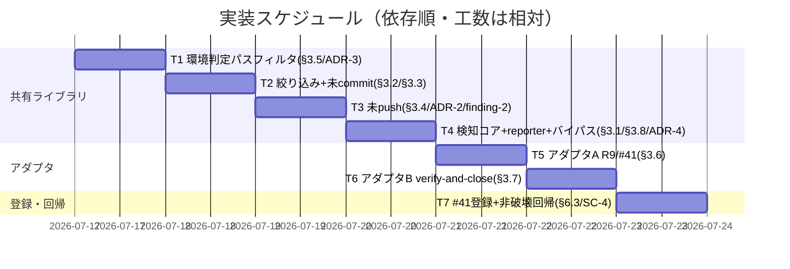

# 実装計画書: worktree 記録 commit 漏れ検知（issue 記録のライフサイクル管理・commit 規律）

**プロジェクト名**: worktree 記録 commit 漏れ検知（issue 記録のライフサイクル管理・commit 規律）
**作成日**: 2026 年 07 月 17 日
**最終更新**: 2026 年 07 月 17 日

> **重要**: **このドキュメントは常に更新**: 実装計画の変更、進捗状況の更新、バグの記録などがあった場合は、即座にこのドキュメントを更新してください。ドキュメントは「生きているドキュメント」として扱い、実装内容と常に同期させます。
> **必須項目**: 「必須」と明記した欄は空欄・抽象語のみで提出しないこと。テスト観点・BDD 仕様は具体ケースを 1 件以上記載すること。
>
> **本ファイルの位置づけ（review-dependencies → implement-feature 橋渡し）**: 本書は [`02_設計.md`](./02_設計.md) の design-feature 全ステップ完了成果（§2.1 責務・§2.5 ADR-1〜4・§3 機能設計・§6 テスト戦略）を、implement-feature が着手できる粒度まで具体化する。02 §12 の指示に従い、(1) §6.2 のテスト割当・§6.3 の非破壊確認手順を**フィクスチャ・アサーション・テストファイル配置**まで落とし込み、(2) **R9 の enforcement 失敗条件番号を確定**（`enforcement/README.md` 現行最大 #40 の次＝**#41**。§2.7 ADR-6 で確定・`evidence_source: existing_code`）した。BDD は [`01_要件定義.md`](./01_要件定義.md) のシナリオ 1〜9（finding-2 のシナリオ 4-N・finding-5 のシナリオ 8-G を含む）と 1:1 対応させる（§BDD 対応表）。
>
> **用語**: [.agent-skill-chain/source/CONCEPTS.md §用語規約](../../../../../../.agent-skill-chain/source/CONCEPTS.md#用語規約) を参照。

---

## 1. 実装概要

### 1.1 実装方針（必須）

02 §2.2.1 の「共有検知コア ＋ 2 発動契機アダプタ（ports & adapters 風）」を、独立シェルスクリプト `.agent-skill-chain/source/enforcement/lib/worktree_record_guard.sh`（純関数群＋`BASH_SOURCE==$0` ガード付き `main`）として新設し、アダプタ A（`PreToolUse.sh` の新規失敗条件 **R9 / #41**・source 共有）とアダプタ B（`verify-and-close.md` の終了条件判定・`bash` 直接実行共有）が同一スクリプトを 2 経路から呼ぶ構成で実装する。既存 R8（`worktree_untracked_rescue`・物理退避）は編集せず、R9 を R8 評価直後・`allow` 直前に**併置**して非破壊（SC-4）を担保する。

### 1.2 実装順序（必須: 1 件以上）

依存の向き（02 §6.1 の一方向 DAG）に沿い、共有ライブラリの葉ノード（環境判定・絞り込み・各判定）から積み上げ、検知コア → reporter → 2 アダプタ → 失敗条件登録・非破壊回帰の順に実装する。



---

## 2. タスク分解

**用語**: [.agent-skill-chain/source/CONCEPTS.md §用語規約](../../../../../../.agent-skill-chain/source/CONCEPTS.md#用語規約) を参照。

**必須**: 各タスクには **「テスト観点」（2.x.3）** と **「単体テスト仕様（BDD）」（2.x.4）** を必ず記載する。テスト観点の定義は **02_設計 §6** および **[TEST_BDD_FORMAT.md](../../../../../../.agent-skill-chain/source/TEST_BDD_FORMAT.md)** を参照し、本ドキュメントでは**タスクごとの具体ケース**のみ記載する。**テストファイル配置は §2.7 ADR-5 で新規 `test/test-worktree-record-guard.sh` に確定**した（既存 `test/test-worktree-discipline.sh` は SC-4 の回帰対象として不変に保つ）。以降 `RG` は当該新規テストファイルを指す。

**新設ライブラリの関数命名（02 §3 準拠の暫定名を確定）**: `worktree_record_scan`（検知コア・§3.1）／`_wt_record_scope`（絞り込み述語・§3.2）／`_wt_record_uncommitted`（未 commit・§3.3）／`_wt_record_unpushed`（未 push・§3.4）／`_wt_record_env_gate`（環境判定・§3.5）／`worktree_record_reject`（reporter＋バイパス・§3.8）。既定走査ルートは `docs/maintainer/workflow`（`ASC_RECORD_SCAN_ROOT` で上書き可・02 §3.2）。

### 2.1 タスク 1: 共有ライブラリ基盤 + 環境判定パスフィルタ（§3.5・ADR-3 改訂／finding-5）

#### 2.1.1 概要（必須）

新規スクリプト `enforcement/lib/worktree_record_guard.sh` の骨格（`BASH_SOURCE==$0` ガード付き `main`・source 時は関数定義のみで副作用なし）と、`_wt_record_env_gate`（fail-safe gate ＋ R7 命名規則準拠パスの**パスベースのスコープ**）を実装する。

#### 2.1.2 実装内容（必須: 1 件以上）

- **T1-1**: `enforcement/lib/worktree_record_guard.sh` を新規作成。冒頭に区画コメント（意図・A は source／B は `bash` 実行の 2 経路共有・02 §2.2.1）。末尾に `if [[ "${BASH_SOURCE[0]}" == "${0}" ]]; then main "$@"; fi` ガードを置き、source 時は関数定義のみ（副作用ゼロ）。
- **T1-2**: `_wt_record_env_gate <target>` を実装。(1) `command -v git` 不在 → `IN_SCOPE=0`。(2) `git -C <target> rev-parse --is-inside-work-tree` 偽 → `0`。(3) **パスフィルタ**: `<target>` の絶対パス（`realpath`／`readlink -f`／`cd+pwd` フォールバック）が `.worktree/<type>/<YYYYMMDD_HHMMSS>/<name>/`（`type ∈ {feature,bugfix,hotfix,release,chore}`。既存 R7 `validate_worktree_path`（`PreToolUse.sh:265-283`）と同一パターン）に一致しなければ `0`。**作成時刻・baseline は参照しない**（パス構造のみ）。(4) 全て満たせば `IN_SCOPE=1`。解決不能・判定エラーは一律 `IN_SCOPE=0`（fail-safe）。
- **T1-3**: パスパターンの正本重複回避方針を確定（既存 R7 の命名パターンを 02 §3.5 の記述どおりミラーする。実装時に R7 の実パターンと文字種・type 集合が一致することを `PreToolUse.sh:265-283` 実読で照合する＝`evidence_source: existing_code`）。
- **成果物**: 新規 `enforcement/lib/worktree_record_guard.sh`（骨格＋`_wt_record_env_gate`）。

#### 2.1.3 テスト観点（必須）

**参照**: 観点の定義は [02_設計 §6.2](./02_設計.md) を参照。以下は本タスクの具体ケースのみ。

##### 単体（必須 1 件以上）

- 準拠パス `<tmp>/.worktree/feature/20260716_143000/x/`（git ツリー）で `_wt_record_env_gate` が `IN_SCOPE=1`。
- 非準拠パス `<tmp>/somewhere/x/`（git ツリー・R7 命名外）で `IN_SCOPE=0`（新旧問わず・finding-5 パスベース）。
- 準拠パスだが**本 issue 導入前相当**（新しい state を一切持たない）でも `IN_SCOPE=1`（時期を判定しないことの確認）。

##### 結合/API

- 該当なし（本タスクは純関数のみ。アダプタ経路は T5/T6）。

##### E2E/受け入れ

- 該当なし（E2E は T5 の SC-5 再現で担保）。

##### バリデーション（境界値）

- `type` が 5 種以外（例 `feat/`）の準拠風パスは `IN_SCOPE=0`。
- 非 git ツリー（`rev-parse --is-inside-work-tree` 偽）で `IN_SCOPE=0`。
- `command -v git` 不在をシミュレート（PATH を空に）した場合 `IN_SCOPE=0`（fail-safe）。

#### 2.1.4 単体テスト仕様（BDD）（必須）

01 シナリオ 8（非 git SKIP）・シナリオ 8-G（finding-5 パスベース）に 1:1 対応。

```gherkin
Feature: 環境判定・パスベースのスコープ（§3.5・ADR-3/finding-5）
  Scenario: 非gitツリーはSKIP  # RG-T1a ← 01 シナリオ8
    Given target が git ツリーでない一時ディレクトリ
    When _wt_record_env_gate <target> を呼ぶ
    Then IN_SCOPE=0（検知コアは即 SKIP）

  Scenario: R7準拠パスは作成時期を問わず対象  # RG-T1b ← 01 シナリオ8-G(a)
    Given target が .worktree/feature/20260716_143000/x/ 形式の git ツリー
    And baseline・作成時刻を一切参照しない
    When _wt_record_env_gate <target> を呼ぶ
    Then IN_SCOPE=1（時期ベースの「新規のみ」ではない）

  Scenario: 非準拠パスは新旧問わず対象外  # RG-T1c ← 01 シナリオ8-G(b)
    Given target が R7 命名規則を外れるパスの git ツリー
    When _wt_record_env_gate <target> を呼ぶ
    Then IN_SCOPE=0
```

**テストコード例（bash・`RG` に追記）**

```bash
# Given: 準拠パスの tmp git リポを作る
mk_wt() { local p="$TMP/.worktree/$1"; mkdir -p "$p"; git -C "$p" init -q; echo "$p"; }
# When: 準拠パスで env gate を評価する
W=$(mk_wt "feature/20260716_143000/x"); _wt_record_env_gate "$W"
# Then: IN_SCOPE=1 を期待
[[ "$IN_SCOPE" == "1" ]] && ok || ng "RG-T1b 準拠パスは IN_SCOPE=1"
# Given/When: 非準拠パス  Then: IN_SCOPE=0
N="$TMP/plain/x"; mkdir -p "$N"; git -C "$N" init -q; _wt_record_env_gate "$N"
[[ "$IN_SCOPE" == "0" ]] && ok || ng "RG-T1c 非準拠は IN_SCOPE=0"
```

#### 2.1.5 依存関係

- なし（葉ノード。以降の T2〜T4 が本関数を前提とする）。

#### 2.1.6 見積もり

- **工数**: 小（0.5 人日）
- **優先度**: 高（全判定の入口）

### 2.2 タスク 2: 記録対象ファイル絞り込み + 未 commit 判定（§3.2・§3.3・finding-1／finding-3）

#### 2.2.1 概要（必須）

`_wt_record_scope`（追跡状態を問わない scope 述語）と `_wt_record_uncommitted`（`git status --porcelain -uall --ignored=no` に scope 述語を適用）を実装し、未追跡の新規記録ファイル・親ワークフローの `90_issues.md` の取りこぼしを防ぐ。

#### 2.2.2 実装内容（必須: 1 件以上）

- **T2-1**: `_wt_record_scope` を実装。判定条件（02 §3.2）: basename が **closed set `0[0-4]_*.md`（`00`〜`04`）または `90_issues.md`** に一致（`0[0-4]_*.md` は `90_issues.md` に不一致のため `90_issues.md` を**独立パターンとして併記**＝finding-3）、かつパスが走査ルート配下（既定 `docs/maintainer/workflow/**`）、かつ `memo/` 配下・ignored でない。**`git ls-files`（追跡済みのみ）は使わない**（SC-5 の未追跡喪失を取りこぼすため・02 §3.2 レビュー反映）。
- **T2-2**: `_wt_record_uncommitted <target>` を実装。`git -C <target> status --porcelain --untracked-files=all --ignored=no -- <走査ルート>` を実行（**`-uall` で未追跡ディレクトリを個別ファイルまで展開**＝finding-1）、各行 basename に `_wt_record_scope` 述語を適用し、一致行（状態コード付き `??`/`A`/`M`/`AM`）を `RECORD_UNCOMMITTED` に収集。非空なら「未 commit あり」。
- **T2-3**: `status` 失敗・走査ルート不在は空集合（漏れなし・fail-open）。
- **成果物**: `worktree_record_guard.sh` に `_wt_record_scope`・`_wt_record_uncommitted` を追記。

#### 2.2.3 テスト観点（必須）

##### 単体（必須 1 件以上）

- 追跡済み `02_設計.md` に未ステージ変更がある worktree で `RECORD_UNCOMMITTED` に当該パスが載る。
- **issue ディレクトリごと未追跡**（`docs/maintainer/workflow/<...>/<issue_dir>/` 一式が一度も add されない）の worktree で、`-uall` により `?? .../<issue_dir>/00_要求定義.md`〜`04_review.md` が個別展開され各ファイルが載る（finding-1）。
- 未 commit（新規 `??`）の `90_issues.md` が `RECORD_UNCOMMITTED` に載る（`0[0-4]_*.md` 単独では不一致・独立パターン併記の確認＝finding-3）。

##### 結合/API

- 該当なし（アダプタ経路は T5/T6）。

##### E2E/受け入れ

- 該当なし。

##### バリデーション（境界値）

- 既定 `-unormal` では `?? .../<issue_dir>/` に畳まれ空振りすることを**対照確認**（`-uall` の必要性の実証・finding-1）。
- `memo/` 配下・ignored のみ変更の worktree で `RECORD_UNCOMMITTED` が空（誤検知しない）。

#### 2.2.4 単体テスト仕様（BDD）（必須）

01 シナリオ 1（未 commit 検知・方式非依存）・シナリオ 1 の And 節（誤検知除外）に 1:1 対応。SC-1 の finding-1（未追跡ディレクトリ展開）・finding-3（`90_issues.md`）も本タスクで検証。

```gherkin
Feature: 未commit差分の検知（§3.2・§3.3）
  Scenario: 記録対象ファイルの未commit差分を検知  # RG-T2a ← 01 シナリオ1
    Given worktree の記録対象ファイル（00〜04・90_issues.md 等）に未commit差分がある
    When _wt_record_uncommitted <target> を呼ぶ
    Then RECORD_UNCOMMITTED に当該ファイルが載る

  Scenario: 一度も commit されていない未追跡ディレクトリを個別展開  # RG-T2b ← 01 シナリオ1（finding-1・SC-5同型）
    Given issue ディレクトリ一式が一度も add されていない未追跡状態
    When -uall で status 走査する
    Then 00_要求定義.md〜04_review.md が個別に RECORD_UNCOMMITTED へ載る（-unormal では畳まれ空振り）

  Scenario: 親ワークフローの 90_issues.md を取りこぼさない  # RG-T2c ← 01 シナリオ1（finding-3）
    Given 未commit（新規 ??）の 90_issues.md がある
    Then RECORD_UNCOMMITTED に 90_issues.md が載る（0[0-4]_*.md 独立併記が効く）

  Scenario: 記録対象外の変更のみでは検知しない  # RG-T2d ← 01 シナリオ1 の And 節
    Given memo/ 配下・非追跡 transient のみ変更がある
    Then RECORD_UNCOMMITTED は空（誤検知しない）
```

**テストコード例（bash・`RG` に追記）**

```bash
# Given: 準拠 worktree に未追跡の issue 記録一式を置く（一度も add しない）
W=$(mk_wt "feature/20260716_143000/rec"); d="$W/docs/maintainer/workflow/20260101_000000_x"
mkdir -p "$d"; : > "$d/00_要求定義.md"; : > "$d/04_review.md"
# When: 未commit判定を走らせる
_wt_record_uncommitted "$W"
# Then: 00 と 04 が RECORD_UNCOMMITTED に含まれる
grep -q "00_要求定義.md" <<<"$RECORD_UNCOMMITTED" && grep -q "04_review.md" <<<"$RECORD_UNCOMMITTED" \
  && ok || ng "RG-T2b 未追跡 issue 一式を個別展開して検知"
```

#### 2.2.5 依存関係

- T1（`_wt_record_env_gate`。ただし本タスクの純関数単体テストは env gate を介さず直接呼べる）。

#### 2.2.6 見積もり

- **工数**: 中（1 人日）
- **優先度**: 高（SC-1・SC-5 中核）

### 2.3 タスク 3: 未 push 判定（§3.4・ADR-2・finding-2 スコープ対称）

#### 2.3.1 概要（必須）

`_wt_record_unpushed`（`git rev-list @{u}..HEAD -- <走査ルート>` 優先・`origin/<branch>` フォールバック・fetch 非依存・stale 警告付き許容・**記録スコープ pathspec で対称化**）を実装する。

#### 2.3.2 実装内容（必須: 1 件以上）

- **T3-1**: 優先経路 `git -C <target> rev-list @{u}..HEAD -- <走査ルート>` の件数で判定。**pathspec `-- <走査ルート>` により記録格納ルート配下を変更したユニークコミットのみを数える**（finding-2＝未 commit 判定〈§3.3〉とスコープ対称）。
- **T3-2**: `@{u}` 未設定時は `git -C <target> rev-parse --abbrev-ref HEAD` でブランチ名を取得し `git -C <target> rev-list origin/<branch>..HEAD -- <走査ルート>` へフォールバック（同一 pathspec）。
- **T3-3**: `git fetch` は実行しない（オフライン・ローカル remote-tracking 参照のみ）。判定継続時に stale 可能性がある場合 `RECORD_WARN` に「直近 fetch 未実施で乖離の可能性」を格納（黙って握り潰さない）。
- **T3-4**: 任意の basename 二次絞り込み（走査ルート直下に記録以外 md が混在する環境向け・`git diff-tree --no-commit-id --name-only -r <sha>` ＋ §3.2 述語。既定ルートでは実質同値のため既定オフ・コメントで明記）。
- **T3-5**: `@{u}` 未設定かつ `origin/<branch>` 未解決（origin 以外・参照不在）→ 判定不能として SKIP＋警告。`rev-list` 失敗 → SKIP。
- **成果物**: `worktree_record_guard.sh` に `_wt_record_unpushed` を追記。

#### 2.3.3 テスト観点（必須）

##### 単体（必須 1 件以上）

- upstream 設定済みブランチで、記録対象パスを変更した未 push ユニークコミットがある worktree を検知（`RECORD_UNPUSHED` に短 SHA・件数）。
- upstream 未設定時に `origin/<branch>` フォールバックで検知継続（同一 pathspec）。
- **finding-2 対称性**: `enforcement/*.sh`・`test/*.sh` 等**記録に無関係なパスのみ**を変更した未 push コミットしか無い worktree では `RECORD_UNPUSHED` が空（block しない）。同 worktree に記録対象ファイル変更コミットを 1 つ加えると検知される。

##### 結合/API

- 該当なし（アダプタ経路は T5/T6）。

##### E2E/受け入れ

- 該当なし。

##### バリデーション（境界値）

- テスト全体で `git fetch` が呼ばれない（ネットワーク非依存。ローカル bare リポを origin に見立てる）。
- stale を作為的に発生させた状況で `RECORD_WARN` が非空（警告付き許容）。
- origin 以外の remote・remote-tracking 不在で SKIP＋警告（過剰 block しない）。

#### 2.3.4 単体テスト仕様（BDD）（必須）

01 シナリオ 4（記録対象を変更した未 push・finding-2）・シナリオ 4-N（記録に無関係な未 push は検知しない・finding-2）・シナリオ 5（stale 許容）に 1:1 対応。

```gherkin
Feature: 未push差分の検知（§3.4・ADR-2・finding-2）
  Scenario: 記録対象を変更した未pushユニークコミットを検知  # RG-T3a ← 01 シナリオ4
    Given origin 未反映で記録対象ファイル（00 等）を変更したユニークコミットがある
    And 判定は git fetch を行わずローカル remote-tracking 参照のみ
    When _wt_record_unpushed <target> を呼ぶ
    Then RECORD_UNPUSHED に当該コミットが載る（@{u}..HEAD -- <走査ルート>）

  Scenario: 記録に無関係なコード変更のみの未pushは検知しない  # RG-T3b ← 01 シナリオ4-N（finding-2）
    Given 未pushユニークコミットが enforcement/*.sh・test/*.sh のみを変更している
    When _wt_record_unpushed <target> を呼ぶ
    Then RECORD_UNPUSHED は空（未commit判定とスコープ対称・過剰blockしない）

  Scenario: fetchを伴わないstale判定は警告付きで許容  # RG-T3c ← 01 シナリオ5
    Given remote-tracking 参照が stale になり得る
    When 判定を継続する
    Then 判定を返しつつ RECORD_WARN に乖離可能性の警告を添える（黙って握り潰さない）
```

**テストコード例（bash・`RG` に追記）**

```bash
# Given: ローカル bare を origin にした準拠 worktree で、記録に無関係なコミットのみ未push
W=$(setup_wt_with_origin "feature/20260716_143000/up")
echo x >> "$W/enforcement/dummy.sh"; git -C "$W" add -A; git -C "$W" commit -qm "code only"
# When: 未push判定
_wt_record_unpushed "$W"
# Then: 記録対象外のみのため空（finding-2 対称）
[[ -z "$RECORD_UNPUSHED" ]] && ok || ng "RG-T3b 記録無関係の未pushは検知しない"
# Given: 記録対象を変更したコミットを追加  Then: 検知される
d="$W/docs/maintainer/workflow/20260101_000000_x"; mkdir -p "$d"; echo y >> "$d/00_要求定義.md"
git -C "$W" add -A; git -C "$W" commit -qm "record change"; _wt_record_unpushed "$W"
[[ -n "$RECORD_UNPUSHED" ]] && ok || ng "RG-T3a 記録変更の未pushを検知"
```

#### 2.3.5 依存関係

- T1（走査ルート概念を T2 と共有）。

#### 2.3.6 見積もり

- **工数**: 中（1 人日）
- **優先度**: 高（SC-3・finding-2）

### 2.4 タスク 4: 検知コア + reporter + バイパス（§3.1・§3.8・ADR-4）

#### 2.4.1 概要（必須）

`worktree_record_scan`（env gate → 未 commit → 未 push を統合し `RECORD_DIRTY`/`RECORD_UNCOMMITTED`/`RECORD_UNPUSHED`/`RECORD_WARN` を返す純関数）と `worktree_record_reject`（reporter＋`ASC_WORKTREE_CLOSE_BYPASS` バイパス）、および直接実行時 `main`（scan → レポート出力 → 終了コード）を実装する。

#### 2.4.2 実装内容（必須: 1 件以上）

- **T4-1**: `worktree_record_scan <target>` を実装（02 §3.1 処理フロー）: (1) `_wt_record_env_gate` が対象外なら `RECORD_DIRTY=0` で即 return。(2) `_wt_record_uncommitted`。(3) `_wt_record_unpushed`。(4) いずれか非空で `RECORD_DIRTY=1`。判定コマンド異常終了は当該判定を「漏れなし」にフォールバック（fail-open）。
- **T4-2**: `worktree_record_reject`（reporter）を実装。メッセージ本文（①未 commit ファイル名 ②未 push コミット ③解消手順 `git add <files> && git commit` ／ `git push` 例 ④`RECORD_WARN`）を既存 `worktree_name_reject` と同体裁（`[enforcement:block]` プレフィックス・`<英語> / <日本語>` 併記）で生成。**本文生成は本関数に集約**し A/B が同一文面を共有（transport のみ差異）。
- **T4-3**: バイパス（ADR-4）: `ASC_WORKTREE_CLOSE_BYPASS=1` なら block 解除し stderr へ「バイパスが使用された（記録が残らない可能性がある）」旨を明示ログ・警告出力（監査痕跡）。ADR-4 残余リスク（`export` の持続でセッション恒常無効化）を利用ガイド行としてスクリプト冒頭コメントに明記（インライン `ASC_WORKTREE_CLOSE_BYPASS=1 <cmd>` 推奨）。
- **T4-4**: `main <target>`（`BASH_SOURCE==$0` ガード内）: `worktree_record_scan` → `RECORD_DIRTY=1` かつ非バイパスなら reporter を stdout へ出力し**非 0 終了**、それ以外は**終了コード 0**（B が終了コード＋stdout で close 可否判定）。
- **成果物**: `worktree_record_guard.sh` に `worktree_record_scan`・`worktree_record_reject`・`main` を追記（ライブラリ完成）。

#### 2.4.3 テスト観点（必須）

##### 単体（必須 1 件以上）

- 未 commit ありの準拠 worktree で `worktree_record_scan` が `RECORD_DIRTY=1`。
- env gate 対象外（非準拠パス）で `RECORD_DIRTY=0`（即 SKIP・過剰 block 回避）。
- `worktree_record_reject` の出力に未 commit ファイル名・`git commit`／`git push` 解消例・`[enforcement:block]` プレフィックスが含まれる。

##### 結合/API

- `bash worktree_record_guard.sh <dirty target>` が**非 0 終了**かつ stdout にレポート、`<clean target>` が**終了コード 0**（B 経路契約・§3.7）。

##### E2E/受け入れ

- 該当なし（アダプタ E2E は T5/T6）。

##### バリデーション（境界値）

- `ASC_WORKTREE_CLOSE_BYPASS=1` で block 解除＋stderr にバイパス警告ログ（監査痕跡）。
- 一覧が空（漏れなし）で reporter が誤って呼ばれても何もせず allow（防御的・§3.8 契約違反時）。

#### 2.4.4 単体テスト仕様（BDD）（必須）

01 シナリオ 2（既定 block）・シナリオ 3（明示バイパス）に 1:1 対応。

```gherkin
Feature: 既定block・明示バイパス（§3.1・§3.8・ADR-4）
  Scenario: 検知時は既定でblock  # RG-T4a ← 01 シナリオ2
    Given RECORD_DIRTY=1（未commit または未push）かつ ASC_WORKTREE_CLOSE_BYPASS 未設定
    When main <target> を bash 実行する
    Then 非0終了し、stdout に解消手順つきレポートを出す

  Scenario: 明示バイパスで通過し痕跡を残す  # RG-T4b ← 01 シナリオ3
    Given 同じ検知条件で ASC_WORKTREE_CLOSE_BYPASS=1
    When main <target> を bash 実行する
    Then 終了コード0で通過し、stderr にバイパス使用の明示警告ログが出る
```

**テストコード例（bash・`RG` に追記）**

```bash
# Given: 未commit差分ありの準拠 worktree
W=$(mk_wt "feature/20260716_143000/blk"); d="$W/docs/maintainer/workflow/20260101_000000_x"
mkdir -p "$d"; : > "$d/00_要求定義.md"
# When: バイパス無しで直接実行  Then: 非0終了＋レポート
out=$(bash "$LIB_RG" "$W"); rc=$?
[[ $rc -ne 0 ]] && grep -q "enforcement:block" <<<"$out" && ok || ng "RG-T4a 既定block"
# When: バイパス有りで直接実行  Then: exit 0＋警告ログ
err=$(ASC_WORKTREE_CLOSE_BYPASS=1 bash "$LIB_RG" "$W" 2>&1 >/dev/null); rc=$?
[[ $rc -eq 0 ]] && grep -qi "bypass" <<<"$err" && ok || ng "RG-T4b バイパス通過＋警告"
```

#### 2.4.5 依存関係

- T1・T2・T3（配下の判定サブ責務を統合）。

#### 2.4.6 見積もり

- **工数**: 中（1 人日）
- **優先度**: 高（SC-2・共有コアの完成）

### 2.5 タスク 5: 発動契機アダプタ A（削除前ゲート・R9 / 失敗条件 #41）（§3.6）

#### 2.5.1 概要（必須）

`PreToolUse.sh` に **新規失敗条件 R9 / #41** を追加する。既存 `is_worktree_destroy`（`PreToolUse.sh:369`）の削除形検知直後、R8（`worktree_destroy_rescue`）評価の**直後・`allow` 直前**に、共有ライブラリを source して `worktree_record_scan` を in-process 呼び出しし、記録漏れ確証かつ非バイパスなら block（exit 2）する。

#### 2.5.2 実装内容（必須: 1 件以上）

- **T5-1**: `PreToolUse.sh` が実行時に `source "$AGENTS_ROOT/enforcement/lib/worktree_record_guard.sh"`（`$AGENTS_ROOT` 解決＝`PreToolUse.sh:754`）。**ファイル不在・関数未定義時は R9 を SKIP（fail-open）**（02 §2.2.3・信頼境界: 本 lib はパッケージ所有ソースで `PreToolUse.sh` と同一信頼レベル・source 可）。
- **T5-2**: R9 本体を実装（02 §3.6 処理フロー）: (1) 既存 segment 分割＋`_wt_effective` で正規化。(2) `is_worktree_destroy` で削除形と `WT_DESTROY_PATH` を得る。(3) 対象 `tgt`（空なら CWD）で `worktree_record_scan`。(4) `RECORD_DIRTY=1` かつ `ASC_WORKTREE_CLOSE_BYPASS` 未設定なら `worktree_record_reject` で block（exit 2）。(5) それ以外 allow。**配置は R8 評価の直後・最終 `allow` の直前**（R8 の物理保全を先に済ませてから記録規律を判定・非破壊）。
- **T5-3**: fail-open 分岐（削除形と確定不能・対象外・非 git・`scan` 内部エラーは allow）。
- **成果物**: `PreToolUse.sh` に R9（source ＋ ゲート）追加。R8 の関数本体は**編集しない**（SC-4 設計担保）。
- **配備同期の申し送り（親 issue T6-1 と同型）**: 正本 `enforcement/claude/PreToolUse.sh` 改修後、配備済み `.claude/hooks/` は `upgrade`/`setup.sh` 再実行まで追従しない。ただし共有 lib は `$AGENTS_ROOT/enforcement/lib/` 常設で `.claude/hooks/` へコピー不要（02 §2.2.1 配布・信頼境界）。implement-feature 時に `check-hook-drift.sh` で乖離ゼロ確認する。

#### 2.5.3 テスト観点（必須）

##### 単体

- 該当なし（R9 は hook 統合。純関数は T1〜T4 で単体済み）。

##### 結合/API（必須 1 件以上）

- 未 commit ありの準拠 worktree を CWD に、`git worktree remove <準拠path>` を stdin JSON で駆動 → **exit 2**＋stderr に `[enforcement:block]`・解消手順（結合層・シナリオ 1-A）。
- 未 commit なしの準拠 worktree 削除 → exit 0（allow）。
- 非準拠パスの worktree 削除 → exit 0（env gate 対象外・fail-open）。
- `ASC_WORKTREE_CLOSE_BYPASS=1` 下で未 commit あり削除 → exit 0＋バイパス警告。

##### E2E/受け入れ（SC-5 再発防止）

- **2026-07-15 事故同型**: 未 commit の 00〜03 一式（未追跡）を含む準拠 worktree に対し、バイパス無しの `git worktree remove --force <path>` を stdin JSON で駆動 → **exit 2**（＝明示フラグ無しでは記録が失われない）。

##### バリデーション（境界値）

- listing・非削除形（`git worktree list` 等）は R9 を発火させず exit 0。
- `is_worktree_destroy` で削除形と確定できないコマンドは allow（fail-open）。

#### 2.5.4 単体テスト仕様（BDD）（必須）

01 シナリオ 1-A（候補 A: 削除前ゲート）・シナリオ 7（再発防止の実証）に 1:1 対応。

```gherkin
Feature: 削除前ゲート R9/#41（§3.6）
  Scenario: 削除コマンドの実行前に未commitを検知しblock  # RG-T5a ← 01 シナリオ1-A
    Given 準拠 worktree の記録対象ファイルに未commit差分がある
    When git worktree remove <path> を stdin JSON で hook に渡す
    Then hook が R9 で exit 2（block）し stderr に解消手順を出す

  Scenario: 2026-07-15事故同型の削除が防止される  # RG-T5b ← 01 シナリオ7（SC-5）
    Given 未commit の 00〜03 一式（未追跡）を含む準拠 worktree
    When バイパス無しで git worktree remove --force <path> を駆動する
    Then exit 2 で block され、明示フラグ無しでは記録が失われない

  Scenario: 削除形でない/対象外は素通り  # RG-T5c ← 01 シナリオ1-A 対偶
    When git worktree list 等の非削除形、または非準拠パス削除を渡す
    Then R9 は発火せず exit 0（fail-open）
```

**テストコード例（bash・`RG` に追記。既存 `run_hook` パターン踏襲）**

```bash
# Given: 未commit の 00〜03 一式（未追跡）を含む準拠 worktree（tmp 隔離）
W=$(mk_wt "feature/20260716_143000/e2e"); d="$W/docs/maintainer/workflow/20260101_000000_x"
mkdir -p "$d"; for f in 00_要求定義 01_要件定義 02_設計 03_実装計画; do : > "$d/$f.md"; done
# When: バイパス無しで remove --force を hook に stdin JSON で渡す（CWD=$W）
( cd "$W" && run_hook "git worktree remove --force $W" )
# Then: R9 で exit 2（記録喪失防止）
assert_rc 2 "RG-T5b 事故同型の削除が block される"
assert_err "enforcement:block" "RG-T5b 解消手順メッセージ"
```

#### 2.5.5 依存関係

- T4（`worktree_record_scan`・`worktree_record_reject`）。既存 `is_worktree_destroy`（R8 で導入済み・不変）。

#### 2.5.6 見積もり

- **工数**: 中（1 人日）
- **優先度**: 高（SC-1/SC-2/SC-5 の主経路・R9/#41 の実体）

### 2.6 タスク 6: 発動契機アダプタ B（終了時契約・verify-and-close）（§3.7）

#### 2.6.1 概要（必須）

`commands/verify-and-close.md`（markdown skill chain）の終了条件判定 step に、共有ライブラリの `bash` 直接実行による記録 commit・push 検証を追加する。

#### 2.6.2 実装内容（必須: 1 件以上）

- **T6-1**: `verify-and-close.md` の終了条件判定 step に `bash "$AGENTS_ROOT/enforcement/lib/worktree_record_guard.sh" <close 対象 worktree>` を実行する記述を追加。**終了コード**（0＝漏れなし／非 0＝`RECORD_DIRTY`）と **stdout レポート**を close 可否判定に用いる（02 §3.7・同一スクリプトを A と共有＝§2.2.1）。
- **T6-2**: 終了コード非 0 かつ非バイパスなら**完了条件不成立**として close を止め、スクリプト出力の未 commit／未 push 一覧と解消手順をそのまま提示。非 git・対象外はスクリプトが終了コード 0（SKIP）で返すため合格扱い（過剰阻害回避）。stale 警告があれば合格でも併記。
- **T6-3**: バイパスは A と同一環境変数 `ASC_WORKTREE_CLOSE_BYPASS`（ADR-4）を参照する旨を記述。
- **成果物**: `commands/verify-and-close.md` の終了条件判定 step に検証記述を追加（markdown skill chain の記述であり bash 関数の直接共有はしない＝02 §2.2.1）。

#### 2.6.3 テスト観点（必須）

##### 単体

- 該当なし（B は markdown skill chain の記述。共有スクリプトの `bash <path> <target>` 契約は T4 §2.4.3 結合ケースで検証済み）。

##### 結合/API（必須 1 件以上）

- `bash worktree_record_guard.sh <dirty close 対象>` が**非 0**＋stdout レポートを返し、B の判定 step が close を止められること（スクリプト契約の再確認・T4 と同経路）。
- `bash worktree_record_guard.sh <clean 対象>` が終了コード 0（合格・close 続行可）。

##### E2E/受け入れ

- verify-and-close の skill chain 全体を通す E2E は本 issue のテスト隔離規約（本リポ実体を書き換えない）に抵触するため**該当なし**（スクリプト契約層で担保。理由: close 実行は実 worktree の移動を伴い tmp 隔離が困難）。

##### バリデーション（境界値）

- 非 git・対象外 target でスクリプトが終了コード 0（B は合格扱い・過剰阻害しない）。

#### 2.6.4 単体テスト仕様（BDD）（必須）

01 シナリオ 1-B（候補 B: 終了時契約）に 1:1 対応。

```gherkin
Feature: 終了時契約 verify-and-close（§3.7）
  Scenario: close終了条件判定時に記録漏れで不成立  # RG-T6a ← 01 シナリオ1-B
    Given close 対象 worktree の記録対象ファイルに未commit差分がある
    When verify-and-close が bash worktree_record_guard.sh <target> を実行する
    Then 終了コード非0＋stdoutレポートを受け、完了条件不成立として close を止め解消手順を提示する

  Scenario: 漏れなしなら合格しcloseを続行  # RG-T6b ← 01 シナリオ1-B 対偶
    Given 記録漏れなし、または非git/対象外 target
    When 同スクリプトを実行する
    Then 終了コード0で合格しclose続行可（stale警告があれば併記）
```

**テストコード例（bash・`RG` に追記。B の契約＝終了コード＋stdout をアサート）**

```bash
# Given: 未commit差分ありの close 対象 worktree
W=$(mk_wt "feature/20260716_143000/close"); d="$W/docs/maintainer/workflow/20260101_000000_x"
mkdir -p "$d"; : > "$d/02_設計.md"
# When: B 経路と同じく bash 直接実行
out=$(bash "$LIB_RG" "$W"); rc=$?
# Then: 非0終了＋レポート（close を止められる）
[[ $rc -ne 0 ]] && grep -q "02_設計.md" <<<"$out" && ok || ng "RG-T6a close 不成立契約"
# Given/When: clean 対象  Then: 終了コード0（合格）
C=$(mk_wt "feature/20260716_143000/clean"); bash "$LIB_RG" "$C"; [[ $? -eq 0 ]] && ok || ng "RG-T6b 合格"
```

#### 2.6.5 依存関係

- T4（共有スクリプト `main` の終了コード＋stdout 契約）。

#### 2.6.6 見積もり

- **工数**: 小（0.5 人日）
- **優先度**: 中（SC-1/SC-2 の補完契機・A の抜けを補う）

### 2.7 タスク 7: 失敗条件 #41 登録 + 非破壊回帰（§6.3・SC-4）

#### 2.7.1 概要（必須）

R9 の enforcement 失敗条件 **#41** を `enforcement/README.md` のレジストリ・判定ルール一覧に登録し、`RG` を `test/run-all.sh` に登録し、既存 `test/test-worktree-discipline.sh` の非破壊（SC-4）を機械的に確認する。

#### 2.7.2 実装内容（必須: 1 件以上）

- **T7-1**: `enforcement/README.md` の「失敗条件 → 実装の所在 → 実装状態 → 強制レベル 対応表」および「失敗とみなす条件（判定ルール）一覧」に **#41 行**を追加（§2.7 ADR-6 の確定内容）。概要＝「worktree 削除前の記録 commit・push 漏れ検知（R9・PreToolUse hook）」、実装の所在＝`PreToolUse.sh` R9 ＋ `enforcement/lib/worktree_record_guard.sh`、実装状態＝実装済み、強制レベル＝runtime reject（ロール非依存・削除形コマンドに発火。非 git/非準拠パス/バイパスは SKIP）、差し戻し＝記録を commit・push するか `ASC_WORKTREE_CLOSE_BYPASS=1` で明示バイパス。
- **T7-2**: `test/run-all.sh` に `RG`（`test/test-worktree-record-guard.sh`）を登録。既存 tmp 隔離規約（`mktemp -d`・本リポ `.agent-skill-chain/source/`・`.claude/`・`.worktree/`・`workflow.db` を書き換えない）を厳守。
- **T7-3**: 非破壊確認（02 §6.3 手順）: (1) R9 追加**前**に `bash test/test-worktree-discipline.sh` で `FAIL=0`・exit 0 をベースライン記録。(2) 追加**後**に再実行し `FAIL=0`・exit 0 維持（既存 PASS が新規 FAIL に転じない）。(3) `bash test/run-all.sh` で他テスト（`test-pretooluse-hook.sh` 等）の退行なしを確認。(4) R9 追加が R8 関数本体を編集していないことを diff レベルで確認（R8 結合テストのフィクスチャ・アサーション不変）。
- **成果物**: `README.md` #41 行・`run-all.sh` 登録・非破壊回帰の実測記録（implement-feature 時）。

#### 2.7.3 テスト観点（必須）

##### 単体

- 該当なし（本タスクは登録・回帰確認）。

##### 結合/API

- `RG` 単体実行が `PASS=<n> FAIL=0`・exit 0。

##### E2E/受け入れ（SC-4 非破壊・必須）

- `test/test-worktree-discipline.sh` が R9 追加前後で `FAIL=0`・exit 0 維持（既存 R7/R8・audit #39/#40 が green）。
- `test/run-all.sh` 全体が green（他テスト退行なし）。

##### バリデーション（境界値）

- `enforcement/README.md` に #41 行が追加され、#40 が最大でなくなる（採番の確定）。既存 #1〜#40 行は不変。

#### 2.7.4 単体テスト仕様（BDD）（必須）

01 シナリオ 6（既存機構の非破壊）・シナリオ 9（一般 fail-open）に 1:1 対応。

```gherkin
Feature: 既存機構の非破壊と失敗条件登録（§6.3・SC-4）
  Scenario: 本機構追加後も既存テストがgreen維持  # RG-T7a ← 01 シナリオ6
    Given 既存 test/test-worktree-discipline.sh（R7/R8・#39/#40）がある
    When R9・検知コアを追加した後に既存テストと run-all.sh を実行する
    Then 既存テストは新規FAIL無くgreen維持され、R8はR9の前段で併存し置換されない

  Scenario: 対象外・判定不能・内部エラーはfail-openでallow  # RG-T7b ← 01 シナリオ9
    Given 本機構はローカルgit状態のみで動作しremote非依存（github.com シグナル判定は用いない）
    When 対象外環境・判定不能・remote-tracking解決不能で発動契機に達する
    Then fail-safe原則に従いSKIP/allowへ倒れる（過剰block回避）
```

**テストコード例（回帰・非破壊は実行結果で確認）**

```bash
# Given: R9 追加後のリポジトリ  When: 既存 discipline テストを実行
# Then: FAIL=0・exit 0（新規FAILなし）を要求
bash test/test-worktree-discipline.sh; [[ $? -eq 0 ]] && ok || ng "RG-T7a 既存テスト非破壊"
# Given: remote-tracking 解決不能な target  When/Then: SKIP（allow）へ倒れる
N=$(mk_wt "feature/20260716_143000/noremote"); bash "$LIB_RG" "$N"; [[ $? -eq 0 ]] && ok || ng "RG-T7b fail-open"
```

#### 2.7.5 依存関係

- T1〜T6（全実装完了後）。

#### 2.7.6 見積もり

- **工数**: 中（0.5〜1 人日・回帰実測含む）
- **優先度**: 高（SC-4・#41 採番の確定・受け入れの締め）

---

## 2.7 横断実装判断（ADR・本フェーズで確定）

> 02 §2.5 の ADR-1〜4（アーキテクチャ確定）を前提に、本フェーズ（review-dependencies → implement-feature 橋渡し）で確定した**実装レベルの判断**を ADR 形式（[EVIDENCE_POLICY.md §節2](../../../../../../.agent-skill-chain/source/EVIDENCE_POLICY.md) 準拠）で記録する。

### ADR-5: テストは新規 `test/test-worktree-record-guard.sh` に配置し、既存 `test/test-worktree-discipline.sh` は不変に保つ

- **コンテキスト**: 02 §6.2 は「既存ファイルへの追記 or 新規テストファイル」を両論併記し配置確定を 03 へ委ねた。SC-4（非破壊）は既存 `test-worktree-discipline.sh` の green 維持で検証する。
- **検討した選択肢**: (A) 既存 `test-worktree-discipline.sh` に R9 テストを追記。(B) 新規 `test-worktree-record-guard.sh` を作成し `run-all.sh` に登録。
- **決定**: **(B) 新規ファイル**。既存 `test-worktree-discipline.sh` は R9 追加後も**一字も変えず** SC-4 の回帰ベースラインとして使う。
- **根拠**: SC-4 の非破壊は「既存テストが不変のまま green」で最も明快に示せる。既存ファイルに追記すると、回帰ベースライン自体が変化し「既存が壊れていない」ことの証明が濁る。加えて共有 lib は独立スクリプトのため、既存の sed マーカ抽出（`# >>> worktree-discipline lib`）と異なり**新規 lib を直接 `source`** でき、テスト構造上も分離が自然（`evidence_source: existing_code`＝`test-worktree-discipline.sh:44` の sed 抽出方式と、独立スクリプト source の差異を実読で確認）。既存の 3 層テスト規約（単体＝lib source／結合＝`run_hook` stdin JSON／境界値）と tmp 隔離（`mktemp -d`・`WORKTREE_TRASH_ROOT`）は新規ファイルでも同型に踏襲する。
- **帰結**: `run-all.sh` に 1 行追加。既存ファイルは diff ゼロ（SC-4 の設計担保を diff レベルで示せる＝§6.3 手順 4）。

### ADR-6: R9 の enforcement 失敗条件番号は #41 とし、CI audit Tier2 バックストップは本 issue のスコープ外とする

- **コンテキスト**: 02 §12・§10 は「R9 の enforcement 失敗条件番号を確定する。新規番号は現行最大 #40 の次＝#41 相当」と指示。実際に `enforcement/README.md` の失敗条件レジストリ・判定ルール一覧を実読し現行最大を確認する必要があった。
- **検討した選択肢**: (A) #41 を採番し R9 runtime reject のみ登録。(B) #41（R9）に加え、R7→#40 と同型の CI audit バックストップ（例 #42）も本 issue で新設。
- **決定**: **(A)**。R9 の失敗条件番号を **#41** に確定する。CI audit Tier2 バックストップ（hook 非経由削除の事後検知）は**本 issue のスコープ外**とする。
- **根拠**: `enforcement/README.md` の対応表・判定ルール一覧・全 `enforcement/` を grep した実測で、**現行最大は #40**（非準拠ブランチ名事後検知）であり #41 が未使用（`evidence_source: existing_code`＝`enforcement/README.md:296,354` および `grep -roE '#4[0-9]' enforcement/` が `#40` のみを返すことを確認）。02 は R9 に単一の新規番号を意図しており（§10・§12）、CI audit バックストップの新設は 02 のスコープ・ADR に含まれていない。hook 非経由削除の残余リスクは 00 §7.1・01 §5・02 §2.1.2 で「隠さず明記・完全網羅は目指さない」と割り切り済みであり、B（終了時契約・verify-and-close）が A の抜けを完了条件として補う二重担保（ADR-1）で足りる。R7 が Tier1（作成時・広範な命名強制）ゆえ CI バックストップ #40 を要したのに対し、R9 は削除形コマンドに限定発火するため audit 側の網羅需要が相対的に低い（`evidence_source: inference_only`＝需要度の推論。**要注意フラグ**: RULES.md §高リスク操作に非該当のため非ブロッキング。後続で CI バックストップの要否を再検討し得る）。
- **帰結**: `enforcement/README.md` に #41 行のみ追加（T7-1）。CI audit バックストップの要否は完了報告で進行役へフォローアップ提案する（自ら起票しない）。

---

## テスト観点

- **環境判定・パスベースのスコープ（§3.5・finding-5）**: R7 命名準拠パスは作成時期を問わず対象（`IN_SCOPE=1`）、非準拠パスは新旧問わず対象外（`IN_SCOPE=0`）。タイムスタンプ・baseline を判定に用いない。非 git・`git` 不在は fail-safe SKIP。
- **絞り込み・未 commit（§3.2・§3.3・finding-1/3）**: 未追跡の新規記録ファイル（`??`）・issue ディレクトリごと未追跡の個別展開（`-uall`）・親ワークフロー `90_issues.md`（独立パターン併記）を取りこぼさない。`memo/`・ignored のみ変更は誤検知しない。既定 `-unormal` の畳み込みで空振りすることを対照確認。
- **未 push（§3.4・ADR-2・finding-2）**: 記録対象パスを変更した未 push ユニークコミットのみを pathspec で数え、記録に無関係なコード・テスト変更のみの未 push は block しない（未 commit 判定とスコープ対称）。`git fetch` を呼ばない。stale は `RECORD_WARN` 付きで許容。origin 以外・参照不在は SKIP＋警告。
- **検知コア・reporter・バイパス（§3.1・§3.8・ADR-4）**: `RECORD_DIRTY` 統合、`[enforcement:block]` 日英併記＋解消手順、`ASC_WORKTREE_CLOSE_BYPASS=1` で block 解除＋監査警告ログ。`bash <lib> <target>` の終了コード＋stdout 契約（B 経路）。
- **アダプタ A（R9/#41・§3.6）**: 削除形 stdin JSON で未 commit/未 push を検知し exit 2、非削除形・対象外・非準拠は fail-open で exit 0。SC-5 事故同型（未追跡 00〜03 の remove --force）が block される。
- **アダプタ B（§3.7）**: `bash <lib> <target>` の終了コード非 0 で close 不成立、0 で合格。
- **非破壊（SC-4・§6.3）**: 既存 `test-worktree-discipline.sh`（R7/R8・#39/#40）が R9 追加前後で green 維持、`run-all.sh` 全体 green、R8 関数本体は diff ゼロ。

## 単体テスト

- `_wt_record_env_gate`: 準拠パス accept（`IN_SCOPE=1`）／非準拠・非 git・`git` 不在 reject（`0`）／type 5 種外 reject／作成時期非依存（baseline 不参照）。
- `_wt_record_scope` / `_wt_record_uncommitted`: 追跡変更 `M`・add 済み `A`・未追跡 `??` を検知／未追跡ディレクトリ `-uall` 個別展開／`90_issues.md` 独立検知／`memo/`・ignored 除外／`-unormal` 畳み込み対照。
- `_wt_record_unpushed`: `@{u}..HEAD -- <root>` 記録変更検知／`origin/<branch>` フォールバック／finding-2 対称（無関係コードのみは空）／`fetch` 非呼出／stale 警告／origin 不在 SKIP。
- `worktree_record_scan` / `worktree_record_reject` / `main`: `RECORD_DIRTY` 統合／`[enforcement:block]`＋解消手順／バイパス解除＋警告／`bash <lib> <target>` 終了コード（dirty 非 0・clean 0）。

## BDD

01 の Gherkin シナリオ 1〜9 と 1:1 対応（各 `RG-*` は本 03 のタスク別テスト ID。詳細 Given/When/Then は §2.x.4 に記載）。全体の対応表を次節に示す。

### BDD ↔ タスク ↔ SC ↔ 設計 対応表（1:1 対応の確認）

| 01 シナリオ | 内容 | SC | 実装タスク | 設計コンポーネント | テスト ID |
| ----------- | ---- | -- | ---------- | ------------------ | --------- |
| シナリオ 1 | 未 commit 検知（方式非依存） | SC-1 | T2 | §3.2・§3.3 | RG-T2a |
| シナリオ 1（And 節） | 記録対象外は誤検知しない | SC-1 | T2 | §3.2 | RG-T2d |
| シナリオ 1（finding-1） | 未追跡ディレクトリ個別展開 | SC-1 | T2 | §3.3（`-uall`） | RG-T2b |
| シナリオ 1（finding-3） | `90_issues.md` 検知 | SC-1 | T2 | §3.2（独立併記） | RG-T2c |
| シナリオ 1-A | 候補 A: 削除前ゲート | SC-1 | T5 | §3.6（R9/#41） | RG-T5a |
| シナリオ 1-B | 候補 B: 終了時契約 | SC-1 | T6 | §3.7 | RG-T6a |
| シナリオ 2 | 既定 block | SC-2 | T4 | §3.8 | RG-T4a |
| シナリオ 3 | 明示フラグ バイパス | SC-2 | T4 | §3.8・ADR-4 | RG-T4b |
| シナリオ 4 | 記録変更の未 push 検知 | SC-3 | T3 | §3.4・ADR-2 | RG-T3a |
| シナリオ 4-N | 記録無関係の未 push は非検知（finding-2） | SC-3 | T3 | §3.4（pathspec 対称） | RG-T3b |
| シナリオ 5 | stale 許容（残余リスク） | SC-3 | T3 | §3.4（`RECORD_WARN`） | RG-T3c |
| シナリオ 6 | 既存機構の非破壊 | SC-4 | T7 | §6.3 | RG-T7a |
| シナリオ 7 | 再発防止の実証 | SC-5 | T5 | §3.6（E2E） | RG-T5b |
| シナリオ 8 | 非 git SKIP | SC-6 | T1 | §3.5 | RG-T1a |
| シナリオ 8-G | 適用範囲＝パスベース（finding-5） | SC-6 | T1 | §3.5・ADR-3 | RG-T1b/T1c |
| シナリオ 9 | 一般 fail-open | SC-6 | T7（＋T3） | §3.5 注記・§3 冒頭 | RG-T7b |

**逆方向の網羅確認**: 全 15 行（シナリオ 9 個＋派生 6 個）が実装タスク T1〜T7 のいずれかに割り当てられ、テスト ID を持つ。未割当のシナリオ・未対応のタスクは無い（1:1 対応成立）。

---

## 3. 実装スケジュール

### 3.1 マイルストーン

| マイルストーン | 期日 | 成果物 |
| -------------- | ---- | ------ |
| M1 共有ライブラリ骨格＋env gate | T1 完了 | `worktree_record_guard.sh`（骨格・`_wt_record_env_gate`） |
| M2 判定サブ責務 | T2・T3 完了 | 絞り込み・未 commit・未 push 関数 |
| M3 検知コア完成 | T4 完了 | `worktree_record_scan`・reporter・`main`（lib 完成） |
| M4 2 アダプタ | T5・T6 完了 | R9/#41（`PreToolUse.sh`）・verify-and-close 記述 |
| M5 登録・非破壊回帰 | T7 完了 | `README.md` #41 行・`run-all.sh` 登録・回帰実測 |

### 3.2 実装フェーズ

本 03 完了後、**implement-feature 着手前に review-docs（実装前ドキュメントレビュー・full/standard 必須）を必ず経る**（design-feature.md DoD・enforcement #32）。本サブは design-feature（02/03）まで（本 03 で完了）とし、review-docs 以降には進まない。

---

## 4. テスト計画

テスト観点・レベル・BDD 形式の定義は **02_設計 §6** および **[TEST_BDD_FORMAT.md](../../../../../../.agent-skill-chain/source/TEST_BDD_FORMAT.md)** を参照。本実装計画では各タスク §2.x.3（テスト観点）・§2.x.4（BDD 仕様）にタスクごとの具体ケースを記載した。

### 4.1 テストの優先順位

1. **SC-5 再発防止（T5・E2E）**: 2026-07-15 実事故（未追跡 00〜03 の喪失）と同型の削除が block されることを最優先で実測（`evidence_source: observed_runtime` を implement 時に取得）。
2. **finding-1/2/3（T2・T3）**: 未追跡ディレクトリ展開・未 push スコープ対称・`90_issues.md` 取りこぼし防止は本 issue の精緻化の核。境界値（`-unormal` 畳み込み対照・記録無関係コードのみの未 push 非検知）を厚く。
3. **非破壊（SC-4・T7）**: 既存 `test-worktree-discipline.sh`・`run-all.sh` の green 維持と R8 diff ゼロを必ず実測。
4. **fail-open（SC-6・T1・T7）**: 非準拠パス・非 git・remote 解決不能で過剰 block しないこと（過去のロックアウト事故の教訓）。

---

## 5. リスク管理

### 5.1 実装リスク

- **配備物が古い**（親 issue ADR-1 と同型）: 正本 `PreToolUse.sh` 改修後 `.claude/hooks/` 未同期だと R9 が効かない。implement-feature 時に `setup.sh`/`upgrade` 再実行＋`check-hook-drift.sh` で乖離ゼロ確認（T5 申し送り）。共有 lib は `$AGENTS_ROOT/enforcement/lib/` 常設のためコピー不要。
- **過剰 block（fail-open の非対称）**: R9 が正当な削除まで止めるリスク。判定不能・内部エラー・非準拠パス・非 git は必ず allow に倒す（§3 冒頭 共通エラー方針）。過去の分類器過剰 block・ロックアウト事故（01 §3.2・00 §7.1）の教訓を踏襲し、境界値テストを厚くする。
- **`ASC_WORKTREE_CLOSE_BYPASS` の `export` 持続**（ADR-4 残余リスク）: 単発のつもりの `export` がセッション全体でガードを恒常無効化する。機構上は防げないため、(1) バイパス通過ごとの stderr 警告ログ、(2) 利用ガイドでインライン指定推奨（`ASC_WORKTREE_CLOSE_BYPASS=1 <cmd>`）を明記し受容する。
- **stale 誤検知**（ADR-2 残余リスク）: fetch 非依存ゆえ直近未 fetch 環境で未 push 誤判定。`RECORD_WARN` で乖離可能性を明示（黙って握り潰さない）。
- **hook 非経由削除**（残余リスク・00 §7.1・01 §5）: 別プロセス・エディタ・`rm -rf` は R9 で捕捉外。B（終了時契約）で完了条件として補完しつつ、限界を隠さず文書化。CI audit バックストップは本 issue スコープ外（ADR-6・進行役へフォローアップ提案）。

---

## 6. 参考資料

### プロジェクトドキュメント

- [`02_設計.md`](./02_設計.md) - 設計（§2.1 責務・§2.5 ADR-1〜4・§3 機能設計・§6 テスト戦略）
- [`01_要件定義.md`](./01_要件定義.md) - 要件定義（SC-1〜SC-6・BDD シナリオ 1〜9・finding-2 シナリオ 4-N・finding-5 シナリオ 8-G）
- [`00_要求定義.md`](./00_要求定義.md) - 要求定義（§6.1 設計フェーズ申し送り＝02 §2.5 で裁定済み）

### その他の参考資料

- 既存 enforcement（R7 命名強制・R8 untracked 退避・`is_worktree_destroy`・`$AGENTS_ROOT` 解決）: `.agent-skill-chain/source/enforcement/claude/PreToolUse.sh`（R7 `validate_worktree_path`＝L265-283・`is_worktree_destroy`＝L369・`$AGENTS_ROOT`＝L754）
- enforcement 失敗条件レジストリ（現行最大 #40・R9 は #41 を採番＝ADR-6）: `.agent-skill-chain/source/enforcement/README.md`
- 既存テスト（3 層構造・tmp 隔離・SC-4 回帰対象）: `test/test-worktree-discipline.sh`・`test/run-all.sh`
- 共有検知コアの新設先: `.agent-skill-chain/source/enforcement/lib/worktree_record_guard.sh`（新規）
- アダプタ B の配置先: `.agent-skill-chain/source/commands/verify-and-close.md`
- 記録 commit 漏れの実事故記録（SC-5 再現対象）: `docs/maintainer/workflow/20260715_160558_issue運用ポリシー全面移行/90_issues.md`（2026-07-15）

---

## 7. 前のステップ

この実装計画書は、以下のドキュメントを基に作成されています：

- **前**: [`02_設計.md`](./02_設計.md) - 設計フェーズ（design-feature 全ステップ完了・§2.5 ADR-1〜4 裁定済み）

---

## 8. 次のステップ

この実装計画書の承認後、以下のステップに進みます：

- **本 issue は 1 つの実装単位**（複数 issue に分割しない）。design-feature（02/03）は本 03 で完了。
- **次**: implement-feature 着手前に **review-docs（実装前ドキュメントレビュー・full/standard 必須）** を必ず経る（design-feature.md DoD・enforcement #32）。その後 implement-feature で T1〜T7 を依存順に実装し、各タスクの §2.x.4 BDD 仕様に沿って `test/test-worktree-record-guard.sh` を作成・green 化、SC-4 非破壊を実測する。

**用語**: [.agent-skill-chain/source/CONCEPTS.md §用語規約](../../../../../../.agent-skill-chain/source/CONCEPTS.md#用語規約) を参照。
