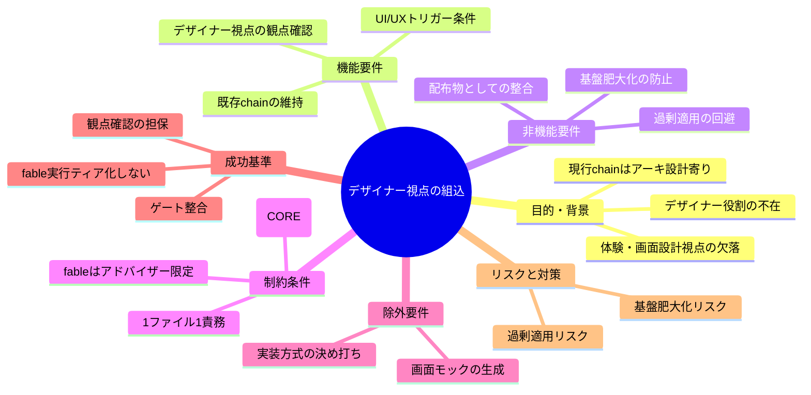
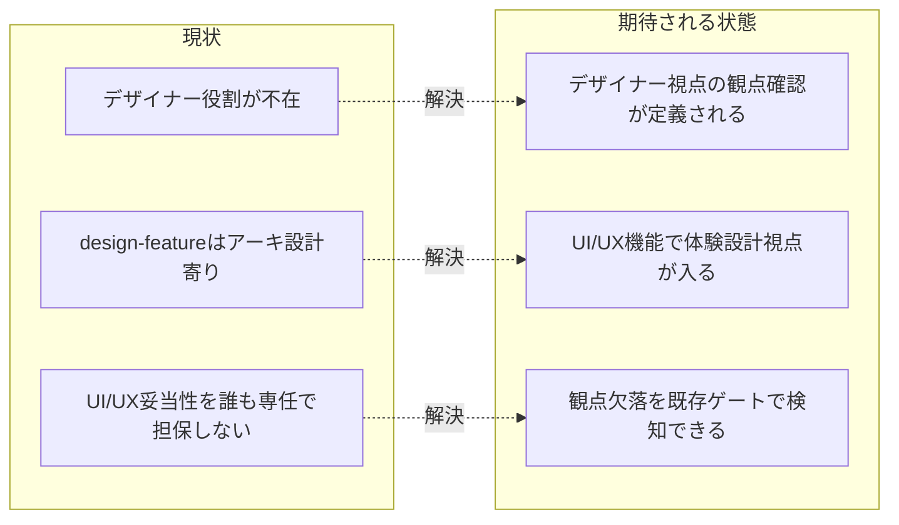

# 要求定義書: CORE へのデザイナー視点（UX/プロダクトデザイン）の組込

**プロジェクト名**: CORE へのデザイナー視点（UX/プロダクトデザイン）の組込
**作成日**: 2026 年 07 月 17 日
**最終更新**: 2026 年 07 月 17 日

> **重要**:
>
> - 要求定義書は、プロジェクトの全体像を把握するためのものです。詳細な技術仕様や実装方法は要件定義書以降で記載します。必要最低限の情報に収めることを心掛けてください。
> - **このドキュメントは常に更新**: 要求の変更や追加があった場合は、即座にこのドキュメントを更新してください。ドキュメントは「生きているドキュメント」として扱い、実装内容と常に同期させます。
> - **必須項目**: 以下の「必須」と明記した項目は空欄・抽象語のみで提出しないこと。判定可能な形（目的は 1 文・成功基準は ○/× で判定できる記載等）で記入すること。
>
> **用語**: [.agent-skill-chain/source/CONCEPTS.md §用語規約](../../../../.agent-skill-chain/source/CONCEPTS.md#用語規約) を参照。

---

## 要求定義の全体像

**注意**:

- マインドマップは全体像を把握するためのものです。主要なセクション名程度に留め、詳細は各セクションに記載します。

---

## 1. 目的・背景

### 1.1 目的（必須）

CORE の command chain にデザイナー視点（UX/IA/UI 妥当性）の観点確認を組み込む。

### 1.2 背景

- **現状の課題**:
  - このフレームワークの command chain（requirement-discovery → design-feature → implement-feature → verify-and-close）に、**ユーザー視点・情報設計（IA）・UX/UI 妥当性を専任で担保する視点・工程が存在しない**。要件定義・アーキテクチャ設計・実装計画には強いが、「体験・画面設計」の視点が欠落している。
  - `design-feature` は責務境界・API 契約・依存関係といった**アーキテクチャ設計**に寄っており、「ビジネス目的・KPI からユーザー分析・課題発見・情報設計・ユーザーフロー・画面構成・UI（アクセシビリティ・視線誘導）・実装可能性・検証改善へ至る一連のデザイン思考プロセス」を担う担当がいない。
  - プロジェクトオーナーの指摘: 「デザイナーがこのシステムにいないね」。優れたデザイナーほど画面そのものではなく「意思決定の流れ」「体験」を設計しており、見た目のデザインは最後の工程である。現行 chain はこの上流の体験設計視点を持たない。

- **必要性**:
  - UI/UX を伴う機能で、ユーザー視点・情報設計・体験の妥当性を担保する工程が無いまま設計完了とみなされると、実装後に体験面の欠陥（使いにくさ・情報構造の破綻・アクセシビリティ欠如）が露見し手戻りコストが大きい。
  - 本フレームワークは配布パッケージであり、この欠落は**全消費者**に共通して波及する。CORE（`.agent-skill-chain/source/`）側で担保する必要がある。

### 1.3 期待される効果（必須: 1 件以上）

- **効果 1**: UI/UX を伴う機能の要求定義・設計時に、デザイナー視点の観点（ビジネス目的・ユーザー/課題分析・IA/ユーザーフロー・UI/アクセシビリティ・実装可能性・検証改善）確認が行われるようになる（○/×: 該当 issue の成果物で観点確認の記録有無を判定できる）。
- **効果 2**: デザイナー視点の観点が欠落したまま設計完了とみなされない（○/×: 既存の review-docs 等のゲートで観点欠落を差し戻せる状態になっている）。
- **効果 3**: 配布パッケージ本体（CORE）に反映され、全消費者が同じ観点確認を受けられる（○/×: 変更対象が `.agent-skill-chain/source/` 配下である）。

**現状と期待される状態の比較**:

---

## 2. 機能要件

### 2.1 既存機能の維持（該当する場合）

- 既存の command chain（requirement-discovery / design-feature / implement-feature / verify-and-close）と各 skill、既存ゲート（review-docs・GitHub Issue 起票・branch/PR 紐づけ）の挙動を破壊しないこと。デザイナー視点は既存工程を置換せず、補完・統合する形で導入する。

### 2.2 新規機能要件

- **デザイナー視点の観点セットの定義**: 少なくとも次の思考プロセス要素を CORE 上で扱えるようにする。
  1. ビジネス目的・成功基準（KPI）の明確化
  2. ユーザー・課題分析（誰の何の課題か・仮説と検証）
  3. 情報設計（IA）・ユーザーフロー・体験設計（UX）
  4. 画面構成・UI（アクセシビリティ・視線誘導・ビジュアル）
  5. 実装可能性とのすり合わせ（実装制約との整合）
  6. 検証・改善（計測・改善ループ）の観点
- **観点確認が行われるフェーズ**: 上記観点の確認が、**要求・要件定義フェーズ**または**設計フェーズ**のいずれか（もしくは双方）で、UI/UX を伴う機能について実施される。
- **適用トリガー条件（過剰適用回避）**: UI/UX が関与する issue にのみ適用する。バックエンドのみ・内部処理のみ等 UI/UX が関与しない issue には一律強制しない。適用条件（トリガー）を要件として明確化する。
- **具体的な実装方式は本 issue では決め打ちしない**: 新規 skill domain の追加／既存 command への工程追加／新規 command の追加、のいずれで実現するかは次工程（design-feature）で決定する。00/01 では「何を実現したいか」「どんな受け入れ基準を満たせばよいか」に留める。

---

## 3. 非機能要件

### 3.1 パフォーマンス

- 観点確認の追加により、UI/UX を伴わない issue のワークフロー所要が増大しないこと（トリガー非該当時はオーバーヘッドゼロ）。

### 3.2 セキュリティ

- 本件は文書・ワークフロー定義の変更であり外部書き込みを伴わない。fable 起用時もアドバイザー（助言的インプット）に限定し、成果物本文の執筆・外部操作を担わせない。

### 3.3 互換性

- 既存の消費者ランタイム・既存 issue と後方互換であること。既存 chain・ゲート・enforcement の挙動を変えない。

### 3.4 保守性

- 基盤（CORE / LOAD_POLICY / PHASES 等）の**1 ファイル 1 責務・肥大化防止**（[.agent-skill-chain/source/META_LAYER.md](../../../../.agent-skill-chain/source/META_LAYER.md) の基盤肥大化防止原則）を尊重する。既存ファイルへの闇雲な追記ではなく、適切な粒度で設計する。

---

## 4. 制約条件

### 4.1 技術的制約

- **変更対象は `.agent-skill-chain/source/`（配布パッケージ正本＝CORE）**。プロジェクトローカルの `.agent-skill-chain/project/` 限定の対応ではなく、フレームワークを使う全消費者に届く形にする。
- 既存の設計原則（UNIX 哲学・単一責務・明確な境界・AI フレンドリー設計）と設計判断の優先順位（可読性 > 単一責務 > 仕様整合 > 変更容易性 …）に従う。
- **fable アドバイザー起用の制約**: fable は「デザイン直感・創造的視点の壁打ち相手」としての助言的インプットにのみ起用可能とし、**実行ティア（成果物本文の執筆担当）にはしない**。起用は本 issue のように**都度ユーザーが最重要指定した場合の例外**として位置づけ、恒常的な実行ティア化をしない（[.agent-skill-chain/project/MODEL_TIER_TABLE.md](../../../../.agent-skill-chain/project/MODEL_TIER_TABLE.md) の「fable | 原則禁止 | ユーザーが個別 issue を『最重要』と明示指定した場合のみ、都度例外として許容する。日常運用化しない。」に整合）。本 issue はユーザー本人が明示的に fable をアドバイザー役として指定しており、この例外条件を満たす。
  - **例外記録（隠さない）**: 2026-07-17 の review-docs ラウンド3 では、ユーザーが「徹底的にレビューしたの？最重要だからfableに徹底的にレビューと指摘対応をさせて。」と明示指定し、**fable がレビューと指摘の直接修正（00〜03 の編集）を実行担当として実施**した。これは上記 MODEL_TIER_TABLE の都度例外の発動であり、恒常的な実行ティア化ではない。CORE に組み込む設計としての fable の役割（アドバイザー限定）は不変（02 §13.3 参照）。

### 4.2 既存システムとの互換性

- 既存の command chain・skill・ゲート・テンプレート・enforcement を破壊しない。デザイナー視点は補完・統合であり置換ではない。

### 4.3 移行期間・スケジュール

- 本 issue は当初 **00_要求定義.md / 01_要件定義.md の作成まで**をスコープとして起票され、その後プロジェクトオーナーの指示により同一 issue 内で設計（02）・実装計画（03）まで進行済み（作成は design-feature が担当・mode: full）。実装（implement-feature）・レビュー（verify-and-close）は review-docs ゲート通過後の後続工程で行う。

---

## 5. 除外要件

- 実装方式（新規 skill domain 追加 / 既存 command への工程追加 / 新規 command 追加）の決定は本 issue の対象外（design-feature で決定）。
- 具体的な UI モック・ワイヤーフレーム・ビジュアルデザインの生成そのものは対象外（本件は「デザイン思考の観点確認プロセスを CORE に組み込む」ことであり、個別成果物の作画ではない）。
- Claude Code の Skill としての `product-design` 実装は対象外（今回はフレームワーク自身の CORE への組込が目的）。
- バックエンドのみ・UI/UX が関与しない機能への観点確認の一律強制は対象外（過剰適用回避）。

---

## 6. 成功基準（必須: 1 件以上）

- **SC1**: UI/UX を伴う機能の要求定義・設計時に、デザイナー視点の観点（§2.2 の 6 要素）確認が行われることが CORE 上で定義されている（○/×: 定義の有無を確認できる）。
- **SC2**: デザイナー視点の観点が欠落したまま設計完了とみなされない仕組みが、既存の review-docs 等のゲートと整合する形で定義されている（○/×: 既存ゲートとの整合が記述されている）。
- **SC3**: 適用トリガー条件（UI/UX 関与時のみ）が明確化され、UI/UX 非関与 issue への過剰適用が回避されている（○/×: トリガー条件の記載有無）。
- **SC4**: fable が実行ティア（成果物本文の執筆担当）として恒常利用されないことが受け入れ基準・制約に明記されている（○/×: 制約記載の有無）。
- **SC5**: 変更対象が `.agent-skill-chain/source/`（CORE）であり、`.agent-skill-chain/project/` 限定でないことが定義されている（○/×: スコープ記載の有無）。
- **SC6**: 基盤の 1 ファイル 1 責務・肥大化防止原則を尊重した粒度で設計方針が示されている（○/×: 粒度方針の記載有無。実装方式の決定自体は design-feature）。

---

## 7. リスクと対策

### 7.1 技術的リスク

- **リスク**: デザイナー視点を全 issue に一律強制すると、UI/UX 非関与の issue まで過剰にプロセスが重くなる（過剰適用）。
  - **対策**: 適用トリガー条件（UI/UX 関与時のみ）を要件として明確化し、[.agent-skill-chain/source/CONTEXT_EFFICIENCY.md](../../../../.agent-skill-chain/source/CONTEXT_EFFICIENCY.md) の規模比例・過剰適用回避の考え方と整合させる。
- **リスク**: 既存の基盤ファイル（CORE / LOAD_POLICY / PHASES 等）への闇雲な追記で基盤が肥大化し、1 ファイル 1 責務が崩れる。
  - **対策**: META_LAYER.md の肥大化防止原則を尊重し、適切な粒度（新規 skill/command か既存工程統合か）を design-feature で判断する。00/01 では実装方式を決め打ちしない。
- **リスク**: fable を助言役として使ううちに、いつのまにか成果物本文執筆（実行ティア）に流れる。
  - **対策**: fable はアドバイザー限定・実行ティア化しないことを制約・受け入れ基準に明記し、都度ユーザー最重要指定時の例外に限定する。

### 7.2 スケジュールリスク

- **リスク**: 実装方式を 00/01 で先取り決定してしまい、design-feature の検討余地を狭める。
  - **対策**: 本 issue のスコープを 00/01（何を実現するか・受け入れ基準）に厳格に限定し、実装方式は後続工程に委ねる。

---

## 8. 参考資料

### プロジェクトドキュメント

- 本 issue は**新規 issue（親なし）** であり、参照元となる親 00/03 は存在しない。
- 実装対象の基盤: [.agent-skill-chain/source/boot/CORE.md](../../../../.agent-skill-chain/source/boot/CORE.md)、[.agent-skill-chain/source/boot/LOAD_POLICY.md](../../../../.agent-skill-chain/source/boot/LOAD_POLICY.md)、[.agent-skill-chain/source/workflow/PHASES.md](../../../../.agent-skill-chain/source/workflow/PHASES.md)

### その他の参考資料

- [.agent-skill-chain/source/META_LAYER.md](../../../../.agent-skill-chain/source/META_LAYER.md) — 基盤肥大化防止
- [.agent-skill-chain/source/CONTEXT_EFFICIENCY.md](../../../../.agent-skill-chain/source/CONTEXT_EFFICIENCY.md) — 規模比例・過剰適用回避
- [.agent-skill-chain/project/MODEL_TIER_TABLE.md](../../../../.agent-skill-chain/project/MODEL_TIER_TABLE.md) — fable の扱い
- ユーザー（プロジェクトオーナー）の指摘: 「デザイナーがこのシステムにいないね」／デザイン思考ループ（ビジネス理解 → 課題発見 → 仮説 → 検証 → コンセプト → UX → IA → ワイヤーフレーム → UI → 実装 → 計測 → 改善）／「見た目のデザインは最後の工程」

### mode 選択の根拠

- **mode: full** を選択。理由: 本件は CORE（配布パッケージ本体）の command/skill 構成そのものへ新しい役割（デザイナー視点）を組み込む変更であり、複数フェーズ・複数消費者に横断的に影響する**新規機能・大規模変更**に相当する（RULES.md §実行モード）。軽微な変更ではないため quick は選ばない。standard の「中規模・既存機能の拡張」より広範な影響を持つため full とする。

---

## 9. 次のステップ

この要求定義書の承認後、以下のドキュメントを作成します：

- **次**: [`01_要件定義.md`](./01_要件定義.md) - 要件定義フェーズ
