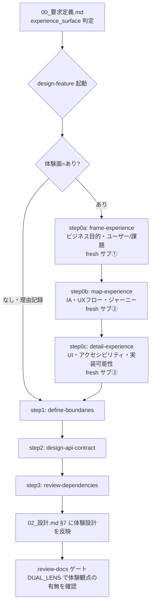
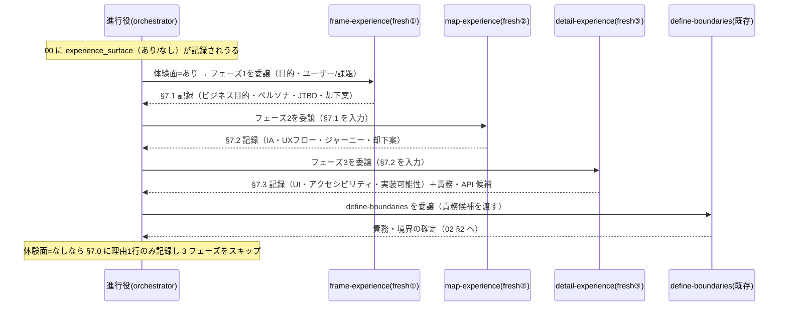

# 設計書: CORE へのデザイナー視点（UX/プロダクトデザイン）の組込

**プロジェクト名**: CORE へのデザイナー視点（UX/プロダクトデザイン）の組込
**作成日**: 2026 年 07 月 17 日
**最終更新**: 2026 年 07 月 17 日

> **重要**: **このドキュメントは常に更新**: 設計の変更や追加があった場合は、即座にこのドキュメントを更新してください。ドキュメントは「生きているドキュメント」として扱い、実装内容と常に同期させます。
>
> **用語**: [.agent-skill-chain/source/CONCEPTS.md §用語規約](../../../../.agent-skill-chain/source/CONCEPTS.md#用語規約) を参照。
>
> **スコープ注記**: 本 02 は「何を・どのファイルを・どう変更するか」を**設計として文書化**するに留める。`.agent-skill-chain/source/` 配下の実ファイル改修（実装）そのものは後続の implement-feature フェーズで行い、本フェーズでは行わない。

---

## 1. 設計概要

**必須**: 設計方針・原則は [.agent-skill-chain/source/spec/01\_設計原則.md](../../../../.agent-skill-chain/source/spec/01_設計原則.md) を**先に参照**した上で、本プロジェクトに**適用するものを選び**記載する。

### 1.1 設計方針

現行の `design-feature` command がアーキテクチャ設計（責務・境界・API・依存）に寄っている欠落を、**新規 skill domain `experience`（体験設計）を 1 つ**追加し、その中に**体験設計の工程を分担する 3 つのフェーズ capability**（`frame-experience` → `map-experience` → `detail-experience`）を置き、`design-feature` の skill chain 冒頭に**トリガー条件付きの 3 工程**として差し込むことで補完する。

**体験設計は「デザインチーム」を模した工程分担とし、各フェーズを都度 fresh なサブエージェントへ委譲する**（1 人のサブが要件受領から UI まで一気通貫でこなす設計にはしない）。これは本フレームワークの既存原則 [CLOSEOUT.md §fresh サブ分割 §発火工程](../../../../.agent-skill-chain/source/CLOSEOUT.md#fresh-サブ分割)（**phase 遷移時に新規 fresh なサブへの分割を必須とし、同一サブに文脈を蓄積させない**）を、体験設計の各フェーズへそのまま適用したものである（プロジェクトオーナーの追加要望＝ADR-7）。工程を単一 capability（＝単一ステップ＝単一サブ）に畳み込むと、この既存の fresh サブ分割原則が体験設計内部で発火せず、一気通貫委譲になってしまう。したがって体験設計は**複数フェーズ＝複数ステップ**として構成する。

トリガー・成果物・ゲートはすべて**既存機構（00 テンプレート frontmatter・02 テンプレート §7・review-docs ゲート・DUAL_LENS）に相乗り**させ、新規 command・新規 enforcement・新規成果物ファイルを増やさない（基盤肥大化防止）。フェーズ数はユーザー提示のフルセット業務フロー（11 工程）を**そのまま持ち込まず 3 に絞り込む**（ADR-7）。機能規模が小さい体験サーフェスではフェーズを統合・省略してよい（規模比例・§9.1・[CONTEXT_EFFICIENCY.md §適用のスケーリング](../../../../.agent-skill-chain/source/CONTEXT_EFFICIENCY.md#適用のスケーリング)）。

### 1.2 設計原則（本プロジェクトで適用するもの）

- **UNIX哲学**: 「小さく作る／1 つのことをうまくやる／組み合わせ可能」。体験設計を既存 skill に混ぜず独立 domain として切り出し、さらにドメイン内をフェーズ capability に分割して chain で組み合わせる。各フェーズ capability は 1 工程 1 責務を守る。
- **単一責務**: `experience` domain は「体験の流れから責務・API を逆算する観点確認」を担い、要求抽出（requirements）・責務境界（architecture）とは責務を分離する。ドメイン内は 3 フェーズ（体験の前提づけ／体験の流れ／体験の具体化）に責務を分担し、1 capability が全工程を抱え込まない。
- **明確な境界**: 体験設計（experience）内部のフェーズ境界（frame → map → detail）と、体験設計 ↔ アーキテクチャ設計（architecture）の境界（detail-experience → define-boundaries）を、chain 上の前後関係として明示する。
- **AIフレンドリー設計**: 新規 skill は既存の `skills/{domain}/{capability}/`（README.md + SKILL.md・6 見出し契約）の構成に厳密に倣い、小さなファイル・明確な責務・意図が分かる命名（`experience` / `frame-experience` / `map-experience` / `detail-experience`）とする。
- **工程分担（デザインチーム）**: 体験設計の各フェーズを別々の fresh サブ（＝役割の異なるデザイナー: UX/情報設計担当 → UI/デザインシステム担当 …）に委譲し、実務のデザインチームの引き継ぎ構造を模す（ADR-7）。

> 本件はコード・DB・イベントを新設しない**フレームワーク（ドキュメント・ワークフロー定義）の変更**であるため、CQRS・イベント駆動は適用しない（§2.2）。

---

## 2. アーキテクチャ設計

### 2.1 責務・境界・参照関係

#### 2.1.1 責務一覧

| コンポーネント | 責務（1 文） |
| -------------- | ------------ |
| `skills/experience/`（新規ドメイン） | 体験設計（UX/IA/体験の流れ）に関する 3 フェーズ capability を束ねる名前空間を提供し、共通の判断基準優先順位（§2.1.4）を README で定義する。 |
| `skills/experience/frame-experience/`（新規 capability・フェーズ1） | UI/UX を伴う機能について、ビジネス目的・成功基準（KPI）とユーザー・課題（誰の何の課題か・JTBD・仮説）を「一人称ナラティブ＋却下案」で枠づけ、02_設計 §7.1 に記録する。 |
| `skills/experience/map-experience/`（新規 capability・フェーズ2） | フェーズ1 の前提の上で、情報設計（IA）・ユーザーフロー（CTA・失敗時体験）・体験ナラティブ／ジャーニーを設計し、02_設計 §7.2 に記録する。 |
| `skills/experience/detail-experience/`（新規 capability・フェーズ3） | フェーズ2 の流れの上で、UI/ビジュアル・デザインシステム適用・アクセシビリティ・実装可能性を具体化し（「格好いいが操作しづらい」は却下）、**新規 UI 要素を提案する前に消費者プロジェクトの既存デザイン資産を優先順位に沿って探索・再利用し（新規作成は正当化条件を満たす場合のみ・ADR-8）**、02_設計 §7.3 に記録して責務・API 候補を define-boundaries へ逆算・引き渡す。 |
| `commands/design-feature.md`（改修） | skill chain 冒頭に、トリガー該当時のみ発動する `frame-experience` → `map-experience` → `detail-experience` の 3 工程を追加する。各工程は orchestrator が都度 fresh サブへ委譲する（chain 定義のみ）。 |
| `commands/requirement-discovery.md`（改修・軽微） | 「実行時の注意」に、体験サーフェス判定（トリガー）を 00 に記録してよい旨の 1 項を追加する（chain は変えない）。 |
| `runtime/templates/00_要求定義.md`（改修） | 体験サーフェス判定（`experience_surface`）を任意 frontmatter 項目として提供する。 |
| `runtime/templates/02_設計.md`（改修） | 既存 §7「UI 設計」を「UI/UX・体験設計」へ拡張し、体験 3 フェーズ（frame/map/detail）出力の受け皿セクションを設ける。 |
| `source/README.md`（改修・軽微） | skill domain 索引に `experience` を 1 行追記する。 |
| `commands/review-docs.md`（改修・軽微） | 実装前レビューの確認観点に「体験サーフェス=あり の場合、体験設計観点の記載有無を確認する」を 1 項追加する（既存ゲートへの相乗り）。 |

#### 2.1.2 境界

- **入力**: UI/UX を伴う機能 issue の 00_要求定義.md（`experience_surface` 判定を含みうる）・01_要件定義.md。フェーズ間は前フェーズの 02 §7.x 出力を次フェーズの入力とする（frame §7.1 → map §7.2 → detail §7.3）。
- **出力**: 02_設計.md §7「UI/UX・体験設計」に記録された体験ナラティブ・ジャーニー・却下案・6 観点確認・幻覚ペルソナ注意書き。および `define-boundaries` の入力となる「体験から逆算した責務・境界の種」（最終フェーズ detail-experience が引き渡す）。
- **他責務との境界**:
  - **experience 内部フェーズ境界（frame → map → detail）**: frame は「なぜ・誰の課題か（目的・ユーザー）」、map は「どう流れるか（IA・UXフロー）」、detail は「どう見える・操作できるか（UI・アクセシビリティ・実装可能性）」を担い、フェーズ間で責務を重複させない。各フェーズは別々の fresh サブが担当し、前フェーズの確定出力（§7.x）のみを引き継ぐ（会話文脈は引き継がない・CLOSEOUT §fresh サブ分割 の継承物＝却下済み指摘＋must-preserve のみ）。
  - **experience ↔ requirements（extract-goals / write-bdd）**: requirements は「目的・ゴール・ユーザーストーリー・受け入れ基準・BDD」を担う。experience は「体験の**流れ**（ジャーニー）と情報設計（IA）・タッチポイント・失敗時体験・UI 具体化」を担う。重複回避のため、experience は要求抽出フェーズには新規工程を置かず（§ADR-2）、設計フェーズで責務・API を逆算する側に置く。
  - **experience ↔ architecture（define-boundaries）**: experience は「体験の流れ」から「何を作るべきか（責務候補）」を提示するに留め、責務境界の確定・参照関係の定義は architecture（define-boundaries 以降）が行う。
  - **experience ↔ 実装レビュー／デザインレビュー（既存フェーズ）**: ユーザー提示フローの「実装レビュー」「デザインレビュー」は、本フレームワークの既存の review-docs（実装前）／verify-and-close（実装後 04_review）が担う。experience 側に専用のレビュー・フェーズ capability は新設しない（重複回避・ADR-7）。
  - **本責務の範囲外**: UI モック・ワイヤーフレーム・ビジュアルの作画そのもの（00 §5 除外要件）。実ユーザー調査の代替（§2.5 幻覚ペルソナ注意）。

#### 2.1.3 参照関係

- `commands/design-feature.md` → `skills/experience/frame-experience/` → `map-experience/` → `detail-experience/`（chain step 0a/0b/0c・トリガー該当時・各ステップは別 fresh サブ）
- `skills/experience/detail-experience/` → `skills/architecture/define-boundaries/`（detail-experience の OUT〈責務・API 候補〉が define-boundaries の IN）
- `commands/requirement-discovery.md` → `runtime/templates/00_要求定義.md`（`experience_surface` 記入枠を参照）
- `skills/experience/{frame,map,detail}-experience/` → `runtime/templates/02_設計.md §7.1/§7.2/§7.3`（各フェーズの出力先）
- `commands/review-docs.md` → 02_設計.md §7（体験設計観点の記載有無を確認）
- 循環参照は持たない（chain は一方向: frame → map → detail → architecture）。

#### 2.1.4 判断基準の優先順位（体験設計ドメイン共通・experience/README で定義）

体験設計の各フェーズが判断に迷ったときの優先順位を、ドメイン共通ルールとして固定する（プロジェクトオーナー提示。当初 6 段の粗い列挙を、後続のプロジェクトオーナー追加インプットに合わせて 8 段へ**精緻化・統合**した。矛盾はなく、旧 6 段を上位包含して細分化したもの）:

1. **ビジネス目標** → 2. **ユーザータスク**（ユーザーが達成したいこと＝ユーザー体験の中核） → 3. **情報階層（IA）** → 4. **アクセシビリティ** → 5. **デザインシステムの一貫性** → 6. **レスポンシブ** → 7. **保守性** → 8. **ビジュアルの洗練度**

- 旧 6 段（ビジネス目標 > ユーザー体験 > アクセシビリティ > 保守性 > 一貫性 > デザイン性）との対応: 「ユーザー体験」は「ユーザータスク＋情報階層」に細分、「一貫性」は「デザインシステムの一貫性」として明確化しレスポンシブを追加、「デザイン性」は最下位の「ビジュアルの洗練度」に統一。上位（ビジネス目標・ユーザータスク）が下位（ビジュアル洗練度）に優先する原則は不変。
- 「格好いいが操作しづらい」（ビジュアルの洗練度がユーザータスク・アクセシビリティを上回る案）は却下する。detail-experience の却下案（§7.3）にこの観点を必須で 1 件以上含める。
- この優先順位は**レビュー時の優先順位**（review-docs／§ADR-4 の体験観点確認・03 T6）としても用いる（同一リストを設計判断とレビュー判断の双方に適用し、二重定義しない）。

### 2.2 システムアーキテクチャ

**必須**: 設計判断は [.agent-skill-chain/source/spec/](../../../../.agent-skill-chain/source/spec/) を先に参照した。

- **採用パターン**: **Pipe-and-Filter（契約付きフィルタの skill chain）**。既存の command = filter（INPUT→PROCESS→OUTPUT・[IO_CONTRACT.md](../../../../.agent-skill-chain/source/IO_CONTRACT.md)）に、条件付き前段フィルタ（体験 3 フェーズ frame→map→detail）を 3 段挿入する（各段は別 fresh サブ）。
- **根拠**: spec/01 の「組み合わせ可能」「単一責務」、spec/06 の優先順位「可読性 > 単一責務」。既存 chain を置換せず前段に足すことで、非該当 issue はフィルタを素通りし（オーバーヘッド 0）、該当 issue のみ 1 段増える。

#### 2.2.1 CQRS（Command/Query 分離）

- 本件は状態変更・状態取得を持つプログラムではない（ドキュメント/ワークフロー定義の変更）ため **CQRS は適用しない**。

#### 2.2.2 アーキテクチャ図（本プロジェクトの構成で記載）



> 各体験フェーズ（0a/0b/0c）は orchestrator が**都度 fresh サブへ委譲**する（CLOSEOUT §fresh サブ分割）。小規模サーフェスではフェーズを統合してよい（§9.1・規模比例）。

### 2.3 コンポーネント構成

- **UX/IA/UI 層に相当**: `skills/experience/{frame,map,detail}-experience/`（体験の前提づけ・流れの設計・UI 具体化の観点確認。3 フェーズ・各 fresh サブ）。
- **Domain 層に相当**: `skills/architecture/*`（責務・境界・API・依存。既存・不変）。
- **設定/テンプレート層**: `runtime/templates/00_要求定義.md`・`runtime/templates/02_設計.md`（トリガー枠・出力受け皿）。
- **ワークフロー定義層**: `commands/design-feature.md`・`commands/requirement-discovery.md`・`commands/review-docs.md`（chain・ゲート）。
- 各コンポーネントは単一責務を満たすよう分離する（§2.1）。

### 2.4 データフロー

本件は「起きた事実」を表すイベントを新設しない（イベント駆動は適用しない）。フェーズ間の受け渡しは既存 chain の OUT→IN で表現する。

> 各フェーズは別 fresh サブが担当し、前フェーズの確定出力（02 §7.x）のみを受け渡す（会話文脈は引き継がない）。進行役は各フェーズを個別に委譲する。



### 2.5 横断設計判断（ADR）

#### ADR-1: 新規 skill domain `experience` を 1 つ追加する（既存 skill への統合ではなく）

- **コンテキスト**: デザイナー視点をどこに置くか。(a) 既存 skill（extract-goals / define-boundaries）へ観点統合、(b) 新規 domain 追加、(c) ハイブリッド。
- **検討した選択肢**: (a) は該当 skill が二責務化し単一責務を崩す・条件発動（UI/UX 時のみ）の制御が困難。(b) は既存 domain（requirements/architecture/…）の構成に倣え、条件発動を chain step の分岐で表現できる。(c)。
- **決定**: (b)＋(c) の折衷。新規 domain `experience` を 1 つ追加し、`design-feature` chain に条件付き工程として差す。要求フェーズへは新規 skill を置かず、00 の trigger 記入とテンプレート枠で「参加」させる（軽量統合）。ドメイン内のフェーズ分割数は ADR-7 で決定する。
- **根拠**: spec/01 単一責務・spec/06「再利用のために責務を曖昧にしてはならない」。META_LAYER Rule 1（統合検討）に対し、体験設計は requirements/architecture のいずれとも責務が異なり統合すると単一責務が崩れるため新規化を選択。`evidence_source: human_decision`（プロジェクトオーナーの「デザイナーがいない」という明示指摘）。
- **帰結**: 新規 domain が 1 つ増える（内部フェーズ capability 数は ADR-7）。ただし新規 command・新規 enforcement・新規成果物ファイルは増やさない（ADR-3/ADR-4/ADR-7）。

#### ADR-2: 差し込み位置は design-feature 冒頭の 1 箇所のみとし、requirement-discovery には新規工程を置かない

- **コンテキスト**: fable 助言は requirement-discovery 中盤（extract-goals と write-bdd の間）と design-feature 冒頭の **2 箇所**への差し込みを提案。
- **検討した選択肢**: (a) 2 箇所差し込み（fable 案）、(b) design-feature 冒頭 1 箇所のみ＋00 トリガー記入で要求フェーズは軽量参加。
- **決定**: (b)。requirement-discovery の chain（extract-goals→identify-assumptions→define-constraints→write-bdd）は変えない。要求フェーズは 00 の `experience_surface` 記入で参加する。
- **根拠**: fable 自身が落とし穴として挙げた「extract-goals・write-bdd との重複」を最小化する。write-bdd は既に「As a / I want / So that」のユーザーストーリーを担い、体験の流れは設計フェーズで責務・API を逆算する側に置く方が、01 の要求（「設計フェーズで体験設計視点が入る」）に直結する。CONTEXT_EFFICIENCY の過剰適用回避・META_LAYER Rule 3 の最小変更。01 の受け入れ基準「要求定義フェーズ**または**設計フェーズのいずれか」を満たす。
- **帰結**: 差し込みは 1 箇所。要求フェーズの体験関与はトリガー記入という 1 行コストに抑えられる。将来、要求フェーズ専用の体験 capability（例: `map-user-journey`）が必要と判明した場合は別 issue で追加できる（拡張余地を残す）。

#### ADR-3: 発動トリガーは 00 frontmatter `experience_surface` に記録し、silent skip を防ぐ

- **コンテキスト**: UI/UX 非関与 issue への過剰適用を避けつつ、「なし」を黙って素通りさせない（fable 助言 2）。
- **検討した選択肢**: (a) 00 frontmatter に必須項目として追加、(b) 00 frontmatter に**任意**項目として追加し、値が無い場合は frame-experience（体験フェーズ1）の step 1 が設計時に判定・記録、(c) 本文セクションに記録。
- **決定**: (b)。`experience_surface: "yes: <理由1行>"` または `"no: <理由1行>"`（既存 `github_issue: "declined: <理由>"` パターンに倣う）。**任意項目**とし、後方互換（既存 00・既存消費者）を保つ。値が無い/未知の場合、frame-experience の step 1 が体験サーフェスを判定し、判定結果（あり/なし＋理由 1 行）を必ず 02_設計 §7.0 に記録する（silent skip 防止は skill レベルで担保）。判定が「なし」なら後続フェーズ（map/detail）はスキップ。
- **根拠**: 必須化すると全 issue（バックエンドのみ含む）に記入を強制し過剰適用・後方互換破壊。任意＋skill レベルの判定記録なら、過剰適用回避（SC3）と silent skip 防止（fable 助言 2）を両立できる。`evidence_source: existing_code`（`github_issue` の declined パターンを踏襲）。
- **帰結**: 00 テンプレートに任意 1 項目が増える。判定の実施責任は最初の体験フェーズ frame-experience の step 1 に集約される。

#### ADR-4: 新規 enforcement（audit.sh チェック）を追加せず、既存 review-docs ゲート＋DUAL_LENS に相乗りする

- **コンテキスト**: META_LAYER Rule 3 は「enforcement を伴わないルール追加」を禁じる。一方で新規 audit チェックの追加は基盤肥大・機械強制の複雑化を招く。
- **検討した選択肢**: (a) 新規 audit.sh チェック（体験観点欠落を機械検知）、(b) 既存 review-docs ゲート（implement 前の必須ゲート・full/standard 一律必須）と DUAL_LENS（[REVIEW_DUAL_LENS.md §5](../../../../.agent-skill-chain/source/REVIEW_DUAL_LENS.md) が review-docs も対象と明記）に「体験観点の有無確認」を相乗りさせる。
- **決定**: (b)。review-docs.md の確認観点に「体験面=あり の issue は 02 §7 に体験設計観点が記載されているか」を 1 項追加する。新規 audit.sh チェックは追加しない。
- **根拠**: 体験観点は静的機械監査になじまない（ナラティブの質は機械判定不能。fable 助言 4 の「幻覚ペルソナ」「チェックボックス化」リスク）。既存の実装前必須ゲート＝review-docs は既に横断的に発動しており、そこに人手＋DUAL_LENS で確認させる方が実効的。META_LAYER Rule 3 は「enforcement を伴わないルール」を禁じるが、本件は**既存 enforcement（review-docs ゲート）を利用する**ため、"enforcement を伴わない" には該当しない。SC2（既存ゲートとの整合）を満たす。
- **帰結**: 機械検知は追加されない。実効性は review-docs レビュアーの観点＋DUAL_LENS に依存する（限界として明記・§6.3）。

#### ADR-5: 成果物ファイルを増やさず、既存 02 §7 を拡張して体験設計を吸収する

- **コンテキスト**: fable 助言 4「05_UX設計.md 等の新規ファイルは避け既存 00〜02 のセクション吸収が望ましい」。
- **検討した選択肢**: (a) 新規成果物 `05_UX設計.md`、(b) 既存 02 テンプレート §7「UI 設計」を「UI/UX・体験設計」へ拡張。
- **決定**: (b)。02 テンプレートの §7 を拡張し、7.0 体験サーフェス判定・7.1 フェーズ1（体験の前提）・7.2 フェーズ2（体験の流れ）・7.3 フェーズ3（体験の具体化）・7.4 幻覚ペルソナ注意 を 3 フェーズ対応の受け皿とする（既存 7.1 画面遷移図・7.2 画面設計 は 7.5 以降へ再配置）。詳細構成は §7。
- **根拠**: META_LAYER Rule 1（新規文書追加前の統合検討）。成果物ファイル増殖は追跡・監査コストを増やす。既存 §7 は元々「UI 設計」で体験設計と親和性が高い。`evidence_source: human_decision`（fable 助言を採用）。
- **帰結**: 新規成果物ファイルは 0。02 テンプレートの §7 見出しが変わる（後方互換: 既存 issue の 02 は §7 を持つため破壊しない）。

#### ADR-6: 基盤修正ファイル数が META_LAYER 目安（≤2）を超えることの明示

- **コンテキスト**: META_LAYER の監視指標「1 issue あたり基盤修正ファイル数 ≤ 2（目安）」。本件は新規 skill 4 ファイル（domain README + 3 フェーズ capability 各 README/SKILL のうち代表構成）＋command 3 ファイル＋テンプレート 2 ファイル＋README 1 を触る（ADR-7 のフェーズ分割で新規ファイルが増える）。
- **検討した選択肢**: (a) 目安に収めるため機能を削る、(b) 目安超過を許容し、各ファイルの変更を最小に保つ。
- **決定**: (b)。ただし、(1) フェーズ capability を 3 に絞る（11 工程を丸写ししない・ADR-7）、(2) 新規 command を作らず既存 design-feature に相乗り、(3) 新規 audit を作らない、(4) 新規成果物ファイルを作らない、(5) 既存 §7 を拡張、(6) requirement-discovery は注記のみ、という 6 つの簡素化で touch ファイルあたりの変更を最小化する。
- **根拠**: META_LAYER の指標は「目安」であり「超えた場合、基盤の簡素化を検討する」と定める。本件は「新しい役割（デザイナー視点＝デザインチーム）を CORE に組み込む」という性質上、フェーズ分担（fresh サブ per phase）を成立させるには複数の capability（＝複数ステップ）が不可欠であり（ADR-7）、単一ファイルには収まらない。指標超過を隠さず明記し、上記 6 簡素化で正当化する（「隠さない」文化に整合）。
- **帰結**: 目安超過を許容。ただし実装 PR は最小 diff を維持し、review-docs で肥大化チェックを受ける。

#### ADR-7: 体験設計を 3 フェーズに分割し、各フェーズを都度 fresh サブへ委譲する（単一 capability 一気通貫の否定）

- **コンテキスト**: プロジェクトオーナーが design-feature 完了後に追加要望を提示した。要旨:「デザイナー」を Claude Code の Skill ではなく **AI 社員の職務定義（Job Description）** として設計し、Web デザインの一連の業務フロー（要件受領 → ビジネス理解 → ユーザー分析 → 競合調査 → 情報設計 → UX 設計 → ワイヤーフレーム → UI → デザインシステム → アクセシビリティ → 実装レビュー → デザインレビュー）を、**1 人の AI が一気通貫でこなすのではなく、役割を分担したデザインチームとして、フェーズごとに新規サブエージェント（別のデザイナー）へ引き継ぐ**べき、というもの。最重要指定:「ウェブデザインを作成させる場合に、一気通貫でさせるのではなく phase 分けして、それぞれが新規サブエージェント（別のデザイナー）として対応させるほうが良い」。
- **問題（現状設計との矛盾）**: 従前の設計は体験設計を**単一 capability `map-experience`（＝単一ステップ＝単一 fresh サブ）**に畳み込んでいた。本フレームワークでは orchestrator は **skill（ステップ）単位**で fresh サブへ委譲し、1 つの skill の内部フェーズには踏み込まない（[run_command.md](../../../../.agent-skill-chain/source/skills/agent/run_command.md)・[CLOSEOUT.md §fresh サブ分割 §発火工程](../../../../.agent-skill-chain/source/CLOSEOUT.md#fresh-サブ分割)）。したがって単一 capability では体験設計全工程が **1 サブの一気通貫**になり、ユーザー要望と**矛盾する**。
- **検討した選択肢**:
  - (a) `map-experience` を単一 capability に維持し、SKILL.md 内で「各フェーズを fresh サブへ委譲せよ」と記す。→ **却下**。orchestrator はステップ内部を委譲しない（ワーカーがさらにサブへ再委譲する入れ子委譲は本フレームワークの標準運用でない）。単一ステップは単一 fresh サブに帰結し、fresh サブ分割原則（§発火工程）が体験設計内部で発火しない。フレームワーク非整合。
  - (b) `experience` を独立 command（例 `design-experience`）に切り出し、複数 skill の chain として各ステップを fresh サブへ委譲する。→ フレームワーク整合。ただし PHASE_COMMAND_MAP（phase→command の決定的単一正本）の改変・02 の所有権（どの command が 02 §7 を書くか）の再整理が必要で、コア routing への侵襲が大きい。
  - (c) (b) の実行モデル（複数ステップ・各ステップ fresh サブ）を採りつつ、**独立 command を新設せず、既存 design-feature chain 冒頭の条件付き複数ステップ**として実現する。→ PHASE_COMMAND_MAP・02 所有権は不変（設計 phase → design-feature のまま）。ADR-1/ADR-2 の配置決定を維持。既存の per-step fresh サブ委譲にそのまま乗る。
- **決定**: **(c)**。体験設計を **3 フェーズ**（`frame-experience`〈ビジネス目的＋ユーザー/課題〉→ `map-experience`〈IA＋UXフロー〉→ `detail-experience`〈UI＋デザインシステム＋アクセシビリティ＋実装可能性〉）に分割し、design-feature chain の step 0a/0b/0c として差す。**各ステップは orchestrator が都度 fresh サブへ委譲する**（既存 CLOSEOUT §fresh サブ分割 §発火工程 の適用そのもの）。ユーザーの「役割分担したデザインチーム」は、フェーズごとに役割の異なる fresh サブ（＝別デザイナー）が担当する構造として実現する。
- **フェーズ数の絞り込み（fable 肥大化警告との整合）**: ユーザー提示の 11 工程を丸写ししない（fable が「肥大化・形骸化の最大の敵」と警告）。11 工程を **3 フェーズへ統合**する: 要件受領〜競合調査 → frame、情報設計〜ワイヤーフレーム → map、UI〜アクセシビリティ → detail。「実装レビュー・デザインレビュー・成果物提出」は既存の review-docs（実装前）／verify-and-close（実装後 04_review）が担い、experience に専用フェーズを新設しない。3 は「意味のある工程分担」を保てる最小粒度であり、これ未満（2 以下）では情報設計と UI が混在し役割分担にならない。
- **過剰適用回避・規模比例**: 3 フェーズ強制は過剰適用リスクを高める。したがって (1) `experience_surface: no` はスキップ（3 フェーズとも発動しない）、(2) 体験サーフェスが小さい場合（例: CLI エラーメッセージ 1 行の文言）は orchestrator の裁量でフェーズを**統合**してよく、最小 1 サブまで畳んでよい（CLOSEOUT §免除条件・CONTEXT_EFFICIENCY §適用のスケーリング）。「体験面=あり」でも常に 3 サブを機械強制しない。既存 02 の「体験面あり/なし」判定（§7.0・ADR-3）と整合させる。
- **根拠**: `evidence_source: human_decision`（プロジェクトオーナーの最重要指定）。加えて `evidence_source: existing_code`（CLOSEOUT §fresh サブ分割 §発火工程 の既存 fresh サブ分割義務）— 本 ADR は新原則の導入ではなく、既存義務を体験設計フェーズへ適用しただけである。
- **帰結**: experience domain の capability が 1 → 3 に増える（ADR-6 のファイル数に反映）。design-feature chain が step 0a/0b/0c を持つ。fable の「skill は 2 つまで／1 capability に絞る」提言は、それより後に届いたユーザーの fresh サブ分割要望が優先し、3 フェーズへ更新する（§アドバイザー入力の扱い の該当行を更新）。

#### ADR-8: detail-experience は「新規作成」より「既存デザイン資産の再利用」を優先する（探索順序と新規作成正当化条件の明文化）

- **コンテキスト**: プロジェクトオーナーが design-feature 完了・review-docs 1 回目完了後に追加インプットを提示した。要旨:「Web デザイナー」の設計行為では Atomic Design のような**部品分解の名称だけでは統一性を保てず**、実務でありがちな失敗（Container が Atom か Template か曖昧・レイアウトがページごとにバラつく・コンポーネントが肥大化する等）が起きる。そこで責務で階層分けした構成（例: Design Tokens → UI Primitives → UI Components → Layout Components → Patterns/Sections → Page Templates → Pages の 7 層）と、**AI（デザイナー役）に「新しい画面をデザインする能力」より先に「既存デザインシステムを読み取り・再利用し・必要最小限だけ拡張する能力」を持たせること**が最重要と指摘された。
- **問題（現状設計との差分）**: 従前の detail-experience（ADR-7）は UI/ビジュアル・デザインシステム適用・アクセシビリティ・実装可能性を扱うが、**「新規 UI 要素をいきなり作らせない／既存資産を優先探索する」という決定順序**と**新規作成が正当化される条件**が Process/Done に明文化されていなかった。このままでは「既存に似た部品があるのに新規で作る」「トークンやレイアウトが無秩序に増える」という実務失敗を設計として防げない。
- **検討した選択肢**:
  - (a) プロジェクトオーナー提示の具体例（React/Figma/Storybook 前提のディレクトリ構成・TypeScript コード例・7 層の固定名称）を CORE 成果物にそのままコピーして強制する。→ **却下**。本フレームワーク（`.agent-skill-chain/source/`）は特定技術スタック（React・Figma 等）に非依存な汎用ワークフロー定義であり、特定の階層名・ディレクトリ構成を CORE にハードコードすると、対象外スタック（CLI・バックエンド・ドキュメント生成等）の消費者に不要な制約を課す（META_LAYER Feature First・過剰適用回避）。
  - (b) 技術スタックに依存しない**汎用原則**のみを抽出して detail-experience に組み込み、具体的な階層名は「消費者プロジェクトが持つ既存の階層・デザインシステム命名を最優先で使い、無ければ一般化した考え方を参考にする」柔軟な形にする。→ **採用**。
- **決定**: **(b)**。detail-experience に次の技術非依存な汎用原則を組み込む（§3.1.2・§5.2 契約3・§7.3・03 T1 に反映）:
  1. **既存資産の再利用探索順序（新規作成の前に必ず実施）**: ①既存の**ページテンプレート相当** → ②既存の**パターン／セクション相当** → ③既存の**コンポーネント相当** → ④既存の**レイアウト相当**の組み合わせ → ⑤既存の**プリミティブ相当** → ⑥それでも不足する場合のみ**新規作成**。
  2. **新規作成が正当化される条件**（すべて満たすことが望ましい・§7.3 と SKILL.md Done に明記）: 複数箇所での再利用が見込まれる／責務が明確／既存の組み合わせで表現できない／バリアントが明示されている／アクセシビリティ要件が文書化されている／レスポンシブ挙動が文書化されている。
  3. **4 原則（detail-experience の判断基準）**: (i) 基礎値（トークン相当）を自由に増やさない、(ii) レイアウトを個別成果物に直接埋め込まない、(iii) 既存資産を先に探索する、(iv) 新規作成条件を明文化する。
  4. **階層の考え方（参考・強制しない）**: 一般化した多層構造（基礎値 → 最小部品 → 複合部品 → レイアウト → パターン → テンプレート → 個別成果物）は**参考情報**として示すに留める。**消費者プロジェクトが独自の階層・デザインシステム命名（Atoms/Molecules や Tokens/Primitives/Components/Layouts/Patterns/Templates/Pages 等）を持つ場合はそれを最優先で使う**。持たない場合のみ上記の一般化した考え方を参考にしてよい。**CORE は特定フレームワーク・特定ディレクトリ構成・特定の階層名を強制しない**（無ければ厳密な階層強制はしない）。
- **判断基準優先順位との整合**: プロジェクトオーナー提示のレビュー優先順位（ビジネス目標→ユーザータスク→情報階層→アクセシビリティ→デザインシステム一貫性→レスポンシブ→保守性→ビジュアル洗練度）は §2.1.4 の判断基準優先順位へ統合・精緻化した（旧 6 段を 8 段へ細分・矛盾なし）。「デザインシステムの一貫性」を明示順位に組み込むことで、本 ADR の再利用優先原則と §2.1.4 が同じ価値観を共有する。
- **根拠**: `evidence_source: human_decision`（プロジェクトオーナーの追加インプット）。META_LAYER Feature First・過剰適用回避（技術非依存性を壊さない）。ADR-4/ADR-5 と整合（新規 audit・新規成果物ファイルを増やさず、detail-experience の Process/Done と §7.3 受け皿に吸収する）。
- **帰結**: 新規ファイル・新規 command・新規 audit は増えない（detail-experience の既存契約 Process/Done と 02 §7.3 テンプレートへの追記のみ）。detail-experience は「新規 UI を作る役」から「既存を読み取り最小拡張する役」へ責務の重心が移る。特定技術スタックは CORE に固定しない。

#### アドバイザー入力の扱い（fable デザインアドバイザーの助言の採否）

> fable は本 issue で**アドバイザー（助言的インプット）限定**で起用された（実行ティアではない・[MODEL_TIER_TABLE.md](../../../../.agent-skill-chain/project/MODEL_TIER_TABLE.md) の fable 行の例外条件を満たす）。以下は opus（設計担当）による採否判断であり、fable 助言の丸写しではない。

| fable 助言 | 採否 | 理由 |
| ---------- | ---- | ---- |
| 1. 新 domain `experience` を 1 つ足す | **採用** | 単一責務・既存 domain 構成に整合（ADR-1）。 |
| 1. skill は 2 つまで | **更新（3 フェーズへ・ADR-7 が優先）** | 当初は 1 capability（map-experience）に絞ったが、**design-feature 完了後に届いたユーザーの最重要要望（フェーズ分割・都度 fresh サブ委譲）が fable の本提言に優先する**。体験設計を frame/map/detail の 3 フェーズ capability に分割する（ADR-7）。fable の肥大化警告は「11 工程を 3 に絞る・新規 command/audit/成果物ファイルを作らない」で担保。 |
| 1. 2 箇所差し込み（requirement-discovery 中盤＋design-feature 冒頭） | **却下（design-feature 冒頭のみ採用）** | extract-goals・write-bdd との重複（fable 自身が挙げた落とし穴）を最小化。要求フェーズは 00 トリガー記入で軽量参加（ADR-2）。 |
| 1. 成果物は「ナラティブ＋却下案」必須 | **採用** | チェックボックス化回避。各体験フェーズ（frame/map/detail）の Outputs に却下案 1 件以上を必須化（§5・SKILL.md）。 |
| 1. UI は画面だけでなく CLI 出力・エラー・生成 Markdown・エージェント指示文も含む | **採用** | 体験サーフェスの定義に含める（§7.0）。フレームワーク自身の成果物（CLI・Markdown・指示文）にも体験がある、という捉え方は本 issue の本質に整合。 |
| 2. 発動判定「人間が感覚器で直接体験するか」1 行判定 | **採用** | トリガーの定義文として採用（§7.0・ADR-3）。 |
| 2. 00 に `体験面: あり/なし（理由1行）` を記録・「なし」記録コスト自体を判定行為に | **採用（実装形を調整）** | frontmatter `experience_surface` として任意記録。silent skip 防止は「00 必須化」ではなく「frame-experience step1 の判定記録必須」で担保（後方互換のため・ADR-3）。 |
| 3. 刺さる質問をフェーズごと 2〜3 問に絞る | **採用** | 各体験フェーズ（frame/map/detail）の Process の観点シードとして採用。フェーズあたり 2 問に絞りチェックボックス化を回避（§3.1.2）。 |
| 4. 落とし穴（チェックボックス化・既存 skill 重複・全 issue 強制・verify 側だけに足す・ファイル増殖・幻覚ペルソナ） | **全採用（設計制約化）** | ナラティブ必須（反チェックボックス）・design 冒頭差し込み（反 verify 偏重）・トリガー（反全 issue 強制）・§7 吸収（反ファイル増殖）・幻覚ペルソナ注意書き必須（§7.4）。 |
| 5. domain 名 `experience`・通称「体験設計」 | **採用** | 「デザイン」の語は視覚に矮小化されるため domain 名から避ける、という fable の整理を採用。 |
| 5. capability 候補 `map-user-journey` / `challenge-assumptions-as-user` / `design-touchpoints` / `define-success-signals` | **一部採用（3 フェーズへ再編・ADR-7）** | fable の 4 分割案は skill 増殖につながるため丸採用しないが、ユーザーの fresh サブ分割要望を受け、体験設計を **3 フェーズ**（frame/map/detail）に再編する。fable の 4 観点（ジャーニー・前提挑戦・タッチポイント・成功シグナル）は 3 フェーズへ配分して内包する（frame=前提挑戦・成功シグナル、map=ジャーニー・タッチポイント、detail=UI 具体化）。 |

---

## 3. 機能設計

### 3.1 機能 1: experience domain の 3 フェーズ capability（体験設計の観点確認）

#### 3.1.1 概要

UI/UX を伴う機能について、体験の流れと 6 観点を「一人称ナラティブ＋却下案」で確認し、責務・API を逆算する土台を 02_設計 §7 に作る。責務は **3 フェーズ capability** に分担し（frame → map → detail）、`design-feature` chain の step 0a/0b/0c（トリガー該当時）として発動する。**各フェーズは別々の fresh サブが担当する**（ADR-7）。判断基準の優先順位は §2.1.4（ビジネス目標 > ユーザータスク > 情報階層 > アクセシビリティ > デザインシステムの一貫性 > レスポンシブ > 保守性 > ビジュアルの洗練度・8 段）を全フェーズ共通で適用する。さらに detail-experience は既存デザイン資産の再利用を新規作成に優先する（ADR-8）。

#### 3.1.2 各フェーズの責務・観点シード（フェーズあたり少数に絞る。チェックボックス化しない）

**フェーズ1: `frame-experience`（体験の前提づけ）— §7.1**
- 担当: ビジネス目的・成功基準（KPI）／ユーザー・課題分析（ペルソナ・JTBD・仮説）／競合・ベンチマークの当たり。
- 観点シード:
  1. ビジネス目的: 「この機能が無ければ誰がどう困るか（実在の一人を挙げられるか）」
  2. ユーザー・課題: 「このユーザーが最初の 5 秒で知りたいことは何か／これはユーザーがやりたいことか、我々が作れることか」
- 出力: §7.1 に前提ナラティブ＋却下案（採らなかったターゲット/目的仮説）＋幻覚ペルソナ注意。

**フェーズ2: `map-experience`（体験の流れ）— §7.2**
- 担当: 情報設計（IA）／ユーザーフロー（CTA・タッチポイント・失敗時体験）／体験ナラティブ・ジャーニー。
- 入力: §7.1（前提）。観点シード:
  3. IA・流れ: 「情報構造は誰の意思決定順に並んでいるか／削っても誰も困らない情報はどれか」
  4. 失敗時: 「失敗時の画面／出力（CLI エラー・生成 Markdown 含む）を先に設計したか」
- 出力: §7.2 に体験ジャーニー・IA・フロー＋却下案（採らなかった導線案）。

**フェーズ3: `detail-experience`（体験の具体化）— §7.3**
- 担当: UI/ビジュアル／デザインシステム適用／アクセシビリティ／実装可能性のすり合わせ／**既存デザイン資産の再利用優先探索**（ADR-8）。
- 入力: §7.2（流れ）。観点シード:
  5. UI・アクセシビリティ: 「視線誘導・操作容易性・アクセシビリティ（コントラスト・キーボード操作・代替テキスト等）を満たすか。『格好いいが操作しづらい』案を却下したか」
  6. 再利用・実装可能性・検証: 「**新規 UI 要素を作る前に既存資産（テンプレート→パターン/セクション→コンポーネント→レイアウト→プリミティブ）を探索したか／新規作成は正当化条件を満たすか**（ADR-8）／体験を成立させる実装制約と矛盾しないか／どう計測・改善するか」
- 出力: §7.3 に UI 具体化＋**既存資産の再利用結果・新規作成の正当化根拠**＋却下案（ビジュアル洗練度優先で操作性を損なう案を 1 件以上明示的に却下）＋**責務・API 候補（逆算の種）を抽出し define-boundaries へ引き渡す**。

> **規模比例**: 体験サーフェスが小さい場合、orchestrator は 3 フェーズを統合し最小 1 サブに畳んでよい（ADR-7・§9.1）。統合時も §7 に「どのフェーズを統合したか」を 1 行記録する。

#### 3.1.3 入力・出力

- **入力**: 00_要求定義.md（`experience_surface` を含みうる）・01_要件定義.md。フェーズ間は前フェーズの §7.x を入力とする。
- **出力**: 02_設計.md §7.1/§7.2/§7.3 への体験ナラティブ・ジャーニー・6 観点確認・却下案・幻覚ペルソナ注意、および detail-experience が define-boundaries へ渡す「責務・API 候補」。

#### 3.1.4 エラーハンドリング

- 体験サーフェス判定が不能・曖昧な場合は「あり」に倒す（fail-safe。過剰スキップより過剰確認を選ぶ）。ただし過剰適用回避のため、明確にバックエンドのみと判定できる場合は「なし＋理由」で 3 フェーズとも素通りさせる。
- 判定は最初のフェーズ（frame-experience）の step 1 が行い、結果（あり/なし＋理由）を §7.0 に必ず記録する（silent skip 防止・ADR-3）。

### 3.2 機能 2: design-feature chain へのトリガー付き 3 工程挿入

#### 3.2.1 概要

`commands/design-feature.md` の PROCESS（skill chain）冒頭に、トリガー該当時のみ発動する体験設計 3 フェーズを step 0a/0b/0c として追加する。**各ステップは orchestrator が都度 fresh サブへ委譲する**（既存 run_command / CLOSEOUT §fresh サブ分割 の運用）。

#### 3.2.2 処理フロー（改修後の PROCESS 定義）

```
PROCESS（Skill chain・この順で実行）
0a. frame-experience  （体験サーフェス=あり のときのみ）— 体験の前提づけ  ※fresh サブ①
    skills/experience/frame-experience/
0b. map-experience    （体験サーフェス=あり のときのみ）— 体験の流れ      ※fresh サブ②
    skills/experience/map-experience/
0c. detail-experience （体験サーフェス=あり のときのみ）— 体験の具体化     ※fresh サブ③
    skills/experience/detail-experience/
1.  define-boundaries — 責務・境界の定義
2.  design-api-contract — API・インターフェースの設計
3.  review-dependencies — 依存関係・テスト観点の確認
```

- INPUT に「00 の `experience_surface`」を追加。
- 「入出力の受け渡し」に frame OUT(§7.1) → map IN、map OUT(§7.2) → detail IN、detail OUT(責務・API 候補) → define-boundaries IN を追加。
- OUTPUT/DONE に「体験面=あり の場合 02 §7 に体験設計（3 フェーズ分・統合時は統合記録）が記載されている」を追加、DONE に「体験面=なし の場合、判定結果（なし＋理由）が記録されている」を追加。
- 「実行時の注意」に、**各体験フェーズは別 fresh サブへ委譲する（一気通貫にしない）**旨、および規模比例でフェーズ統合可の旨を追加。

#### 3.2.3 入力・出力

- **入力**: design-feature の既存 INPUT ＋ `experience_surface`。
- **出力**: 既存 OUTPUT（02/03）＋ 02 §7 の体験設計。

#### 3.2.4 エラーハンドリング

- 体験 3 フェーズは条件付き step であるため、体験面=なし の場合に「工程未実行」を欠落として扱わない（トリガー非該当は正常系）。規模比例でフェーズを統合した場合も欠落として扱わない（統合記録があること）。ただし判定結果の記録が無い場合は review-docs で差し戻す。

### 3.3 機能 3: テンプレート・軽微改修（00 / 02 / requirement-discovery / review-docs / README）

- 00 テンプレート: `experience_surface` 任意 frontmatter を追加（§4.2）。
- 02 テンプレート: §7 を「UI/UX・体験設計」へ拡張（§ADR-5）。
- requirement-discovery.md: 実行時の注意に「体験サーフェスが要求時に判明していれば 00 に記録してよい」を 1 項追加（chain は不変）。
- review-docs.md: 確認観点に「体験面=あり の 02 §7 記載有無」を 1 項追加。
- source/README.md: skill domain 索引に `experience` を追記。

---

## 4. データ設計

- **該当なし**。本件は DB・データモデルを持たない。frontmatter の `experience_surface` は文字列値（`"yes: ..."` / `"no: ..."`）で、テーブル・リレーションは伴わない。workflow.db への記録は既存の書記（write-workflow-log）経由で行い、スキーマ変更は伴わない。

---

## 5. API 設計（skill / command 契約）

### 5.1 契約一覧

| 契約対象 | 種別 | 説明 |
| -------- | ---- | ---- |
| `skills/experience/frame-experience/SKILL.md` | skill 契約 | 6 見出し（IO_CONTRACT 準拠・新規のため猶予なし）。体験の前提づけ（目的・ユーザー/課題）。 |
| `skills/experience/map-experience/SKILL.md` | skill 契約 | 6 見出し。体験の流れ（IA・UXフロー・ジャーニー）。 |
| `skills/experience/detail-experience/SKILL.md` | skill 契約 | 6 見出し。体験の具体化（UI・アクセシビリティ・実装可能性）＋責務逆算。 |
| `commands/design-feature.md` | command 契約 | INPUT/PROCESS/OUTPUT/DONE。PROCESS に step0a/0b/0c 追加 |

### 5.2 契約詳細

#### 契約1: frame-experience（SKILL.md・6 見出し）— フェーズ1

- **Purpose**: UI/UX を伴う機能について、ビジネス目的・成功基準とユーザー・課題を一人称ナラティブ＋却下案で枠づけ、02_設計 §7.1 に作る。
- **Inputs**: 00_要求定義.md（`experience_surface` を含みうる）・01_要件定義.md・02 テンプレート §7。
- **Process**: (1) 体験サーフェス判定（あり/なし＋理由）を §7.0 に記録 →（あり時）(2) ビジネス目的・KPI を一人称ナラティブで記述 → (3) ユーザー・課題（ペルソナ・JTBD・仮説）を確認 → (4) 却下案（採らなかったターゲット/目的仮説）を 1 件以上記述 → (5) 幻覚ペルソナ注意を明記。
- **Outputs**: 02_設計 §7.1（前提ナラティブ・ペルソナ・JTBD・却下案・注意書き）。次フェーズ map-experience への入力。
- **Done**: 体験面=あり なら §7.1 にナラティブ＋却下案＋幻覚ペルソナ注意が揃う。体験面=なし なら §7.0 に判定結果（なし＋理由 1 行）が記録され、後続フェーズはスキップ。
- **Forbidden**: チェックボックスのみ（ナラティブ無し）で済ませること。幻覚ペルソナを実ユーザー調査の代替として扱うこと。IA・UI 具体化へ踏み込むこと（それは map/detail の責務）。

#### 契約2: map-experience（SKILL.md・6 見出し）— フェーズ2

- **Purpose**: フェーズ1 の前提の上で、情報設計（IA）・ユーザーフロー・体験ジャーニーを設計し、02_設計 §7.2 に作る。
- **Inputs**: §7.1（frame の出力）・01_要件定義.md。
- **Process**: (1) IA（情報構造・分類・ナビゲーション）を設計 → (2) ユーザーフロー・CTA・タッチポイント・失敗時体験を一人称ナラティブで記述 → (3) 体験ジャーニーを描く → (4) 却下案（採らなかった導線案）を 1 件以上記述。
- **Outputs**: 02_設計 §7.2（IA・UXフロー・ジャーニー・却下案）。次フェーズ detail-experience への入力。
- **Done**: 体験面=あり なら §7.2 にジャーニー＋IA＋却下案が揃う。
- **Forbidden**: フェーズ1 の前提を無視して流れを描くこと。UI/ビジュアルの具体化（detail の責務）。architecture の責務境界を確定すること（define-boundaries の責務）。

#### 契約3: detail-experience（SKILL.md・6 見出し）— フェーズ3

- **Purpose**: フェーズ2 の流れの上で、UI・デザインシステム・アクセシビリティ・実装可能性を具体化し、**既存デザイン資産を再利用優先で探索した上で**責務・API を逆算する土台を 02_設計 §7.3 に作る。
- **Inputs**: §7.2（map の出力）・01_要件定義.md・**消費者プロジェクトの既存デザイン資産／デザインシステム（存在すればその階層・命名を最優先で参照）**。
- **Process**: (1) UI/ビジュアル・視線誘導を検討 → (2) **既存デザイン資産の再利用探索を優先順位で実施**（①既存のページテンプレート相当 → ②既存のパターン/セクション相当 → ③既存のコンポーネント相当 → ④既存のレイアウト相当の組み合わせ → ⑤既存のプリミティブ相当 → ⑥不足時のみ新規作成。ADR-8）→ (3) デザインシステム適用・一貫性を確認（**基礎値＝トークン相当を自由に増やさない／レイアウトを個別成果物に直接埋め込まない**）→ (4) アクセシビリティ（コントラスト・キーボード操作・代替テキスト等）を確認 → (5) 実装可能性・検証改善観点を確認 → (6) **新規 UI 要素を作る場合は正当化条件**（複数箇所での再利用見込み・責務明確・既存の組み合わせで表現不可・バリアント明示・アクセシビリティ要件文書化・レスポンシブ挙動文書化）**を満たすか明記** → (7) 却下案（ビジュアル洗練度優先で操作性を損なう案）を 1 件以上記述 → (8) 責務・API 候補を抽出し define-boundaries へ渡す。
- **Outputs**: 02_設計 §7.3（UI 具体化・**既存資産の再利用結果／新規作成の正当化根拠**・アクセシビリティ・却下案）。define-boundaries への「責務・API 候補」。
- **Done**: 体験面=あり なら §7.3 に UI 具体化＋**既存資産の再利用探索結果（再利用したか／新規作成なら正当化条件の充足）**＋アクセシビリティ＋「操作性を損なう案の却下」1 件以上＋責務・API 候補が揃う。**新規 UI 要素を提案する場合は ADR-8 の正当化条件を満たす根拠が §7.3 に書かれている**。
- **Forbidden**: 判断基準優先順位（§2.1.4）を無視し「ビジュアルの洗練度」を上位に置くこと。**既存資産の探索を省略し安易に新規 UI 要素・新規トークン・ページ直書きレイアウトを増やすこと（ADR-8）**。幻覚ペルソナを実ユーザー調査の代替として扱うこと。UI モックの作画（除外要件）。architecture の責務境界を確定すること（define-boundaries の責務）。**特定技術スタック（React/Figma 等）や特定ディレクトリ構成を前提として固定すること（消費者の技術非依存性を壊す・ADR-8）**。

> **共通**: 3 フェーズは規模比例で統合してよい（ADR-7・§9.1）。統合時は 1 サブが複数フェーズの Process を実施し §7 に統合記録を残す。統合の可否判断は orchestrator が行い、SKILL.md はフェーズ単体の契約を定義する。

#### 契約4: design-feature.md（command・INPUT/PROCESS/OUTPUT/DONE 改修）

- **INPUT**: 既存 ＋ `experience_surface`（00 frontmatter・任意）。
- **PROCESS**: step0a/0b/0c = frame → map → detail-experience（体験面=あり時・各 fresh サブ）→ step1-3 は既存。
- **OUTPUT**: 既存（02/03）＋ 02 §7 体験設計。
- **DONE**: 既存 ＋「体験面=あり なら 02 §7 に体験設計（3 フェーズ分または統合記録）が記載」「体験面=なし なら判定結果が記録」。
- **契約違反時**: 体験面=あり なのに §7 が空 → review-docs で差し戻し（新規 audit は追加しない・ADR-4）。

---

## 6. テスト戦略

> 本件は**コードを持たないフレームワーク（ドキュメント/ワークフロー定義）の変更**であるため、テストは「ドキュメント成果物・ワークフロー定義の検証観点」である（コード単体テストではない）。監査・review-docs でのチェックリストとして機能する。

### 6.1 対象ごとのテスト割り当て

| 対象 | 単体（ドキュメント検証） | 結合（chain 整合） | E2E（消費者観点） | クリティカル観点 | バリデーション観点 | 未達理由/補足 |
| ---- | ---- | ---- | ---- | ---- | ---- | ---- |
| frame/map/detail-experience SKILL.md（3 件） | ○（各 6 見出し充足） | ○（frame→map→detail→define-boundaries の OUT/IN 連鎖） | × | ナラティブ＋却下案必須・フェーズ間責務非重複 | 幻覚ペルソナ注意の有無・判断基準優先順位の記載 | E2E は消費者ランタイムでの実運用で担保 |
| design-feature.md PROCESS | ○（step0a/0b/0c 記載・各 fresh サブ委譲明記） | ○（chain 順序） | × | トリガー分岐＋フェーズ分割の明確さ | 体験面=なし の正常系扱い・規模比例統合 | — |
| 00 テンプレート `experience_surface` | ○（任意項目・後方互換） | ○（frame-experience が読む） | × | 後方互換（既存 00 を壊さない） | declined 類似形式 | — |
| 02 テンプレート §7 拡張 | ○（§7 受け皿存在・3 フェーズ節） | ○（3 フェーズ出力先） | × | 既存 §7 破壊しない | 見出し整合 | — |
| review-docs ゲート相乗り | ○（確認観点追記） | ○（DUAL_LENS 整合） | × | 体験観点欠落を差し戻せる | 体験面=なし は差し戻さない | — |

### 6.2 監査・レビューでの確認（証跡）

02 §6.1 の割当と 03 のタスク別テスト観点・BDD が対応していることを確認する。01 の BDD（ユースケース 1-3・各シナリオ）と 03 のタスクが漏れなく対応していることを、03 の受け入れ基準対応表で検証する。

### 6.3 実効性の限界（隠さない）

- 体験ナラティブの「質」は機械監査で判定できない（新規 audit を作らない・ADR-4）。実効性は review-docs レビュアーの観点＋DUAL_LENS に依存する。
- 幻覚ペルソナ（LLM が捏造したユーザー像）は実ユーザー調査の代替にならない。§7.4 の注意書きで明示するが、注意書きの存在は誤用を完全には防げない（残余リスク・fable 助言 4）。

---

## 7. UI 設計

本件自体が「フレームワークに体験設計（UI/UX 観点）を組み込む」変更であり、成果物の一部は **02 テンプレートの §7「UI 設計」を「UI/UX・体験設計」へ拡張する**こと（メタ的な UI 設計）である。拡張後の §7 は**3 フェーズ（frame/map/detail）に対応した受け皿**とする。各フェーズは別 fresh サブが該当節を記入する（ADR-7）:

- **7.0 体験サーフェス判定**: `experience_surface`（あり/なし＋理由 1 行）。判断基準優先順位（§2.1.4）も併記。UI＝画面に限らず CLI 出力・エラーメッセージ・生成 Markdown・エージェントへの指示文も体験サーフェスに含む。（frame-experience の step 1 が記入）
- **7.1 フェーズ1: 体験の前提（frame-experience）**: ビジネス目的・成功基準（KPI）／ユーザー・課題（ペルソナ・JTBD・仮説）を一人称ナラティブで。却下案（採らなかったターゲット/目的仮説）を 1 件以上。
- **7.2 フェーズ2: 体験の流れ（map-experience）**: 情報設計（IA）／ユーザーフロー（CTA・タッチポイント・失敗時体験）／体験ジャーニー。却下案（採らなかった導線案）を 1 件以上。
- **7.3 フェーズ3: 体験の具体化（detail-experience）**: UI/ビジュアル・視線誘導／デザインシステム適用／アクセシビリティ／実装可能性・検証改善。**既存デザイン資産の再利用探索結果**（探索順序 ①ページテンプレート相当→②パターン/セクション相当→③コンポーネント相当→④レイアウト相当→⑤プリミティブ相当→⑥不足時のみ新規作成。ADR-8）と、**新規作成した場合はその正当化根拠**（複数箇所での再利用見込み・責務明確・既存の組み合わせで表現不可・バリアント明示・アクセシビリティ／レスポンシブ挙動の文書化）を記す。却下案（ビジュアル洗練度優先で操作性を損なう案）を 1 件以上。責務・API 候補（逆算の種）。
  - **技術非依存の注記**: 消費者プロジェクトが独自の階層・デザインシステム命名（Atoms/Molecules や Tokens/Primitives/Components/Layouts/Patterns/Templates/Pages 等）を持つ場合は**それを最優先で使う**。持たない場合のみ一般化した多層構造（基礎値→最小部品→複合部品→レイアウト→パターン→個別成果物）を参考にしてよい。**CORE は特定フレームワーク（React/Figma 等）・特定ディレクトリ構成を強制しない**（ADR-8）。
- **7.4 幻覚ペルソナ注意（共通）**: LLM ペルソナは実ユーザー調査の代替でない旨。
- **7.5 画面遷移図 / 7.6 画面設計**: 既存 7.1/7.2 を再配置（後方互換）。

> **6 観点との対応**: 01/00 の「6 観点」（目的/ユーザー/IA/UI/実装可能性/検証）は 3 フェーズへ配分される（7.1=目的・ユーザー、7.2=IA・体験の流れ、7.3=UI・実装可能性・検証）。観点は失われず、フェーズ責務に沿って再配置されるのみ。
> **規模比例**: 小規模サーフェスでフェーズを統合した場合は、統合した節に「フェーズ N・M を統合」と 1 行記し、割愛した観点があればその理由を記す。

本 issue（02 自身）は UI/UX を伴うフレームワーク変更のため、`experience_surface: あり` に相当する（本 02 の §7 も体験設計観点で記述している）。

---

## 8. セキュリティ設計

### 8.1 認証・認可

- 該当なし。本件は文書・ワークフロー定義の変更であり、認証・認可・外部書き込みを伴わない。

### 8.2 データ保護

- 該当なし。fable 起用時もアドバイザー（助言的インプット）限定であり、成果物本文の執筆・外部操作・秘匿情報の取り扱いを担わせない。

---

## 9. 非機能要件への対応

### 9.1 パフォーマンス

- 体験面=なし（トリガー非該当）の issue では体験 3 フェーズが発動せず、ワークフロー所要は増えない（オーバーヘッド 0）。条件付き step により該当 issue のみ工程が増える。
- 体験面=あり でも規模比例でフェーズを統合してよく（ADR-7）、小規模サーフェスでは実質 1 サブに畳める。3 サブ発動は「実質的な体験設計を要する規模」に限られ、規模不相応な多段委譲を機械強制しない（CONTEXT_EFFICIENCY §適用のスケーリング）。

### 9.2 可用性・互換性

- 00/02 テンプレート改修は**任意項目追加・既存 §7 拡張**であり、既存 issue・既存消費者ランタイムと後方互換。既存 chain・ゲート・enforcement の挙動を変えない（新規 audit を追加しない）。

---

## 10. 参考資料

### プロジェクトドキュメント

- [`01_要件定義.md`](./01_要件定義.md) - 要件定義
- [`00_要求定義.md`](./00_要求定義.md) - 要求定義

### その他の参考資料

- [.agent-skill-chain/source/META_LAYER.md](../../../../.agent-skill-chain/source/META_LAYER.md) — 基盤肥大化防止（Rule 1/3・監視指標）
- [.agent-skill-chain/source/CONTEXT_EFFICIENCY.md](../../../../.agent-skill-chain/source/CONTEXT_EFFICIENCY.md) — 規模比例・過剰適用回避
- [.agent-skill-chain/source/IO_CONTRACT.md](../../../../.agent-skill-chain/source/IO_CONTRACT.md) — command/skill 契約（新規 skill は 6 見出し猶予なし）
- [.agent-skill-chain/source/REVIEW_DUAL_LENS.md](../../../../.agent-skill-chain/source/REVIEW_DUAL_LENS.md) §5 — review-docs も DUAL_LENS 対象
- [.agent-skill-chain/source/commands/design-feature.md](../../../../.agent-skill-chain/source/commands/design-feature.md) / [requirement-discovery.md](../../../../.agent-skill-chain/source/commands/requirement-discovery.md) — 改修対象 command
- [.agent-skill-chain/source/skills/requirements/write-bdd/](../../../../.agent-skill-chain/source/skills/requirements/write-bdd/) — 新規 skill フォーマットの参照（README.md + SKILL.md 構成）
- [.agent-skill-chain/project/MODEL_TIER_TABLE.md](../../../../.agent-skill-chain/project/MODEL_TIER_TABLE.md) — fable アドバイザー限定・opus 設計担当

---

## 11. 前のステップ

この設計書は、以下のドキュメントを基に作成されています：

- **前**: [`01_要件定義.md`](./01_要件定義.md) - 要件定義フェーズ

---

## 12. 次のステップ

この設計書の承認後、以下のドキュメントを作成します：

- **次**: [`03_実装計画.md`](./03_実装計画.md) - 実装計画フェーズ

---

## 13. 実装前レビュー（review-docs）の二観点リスト

> [REVIEW_DUAL_LENS.md](../../../../.agent-skill-chain/source/REVIEW_DUAL_LENS.md) §2/§3/§6 に従い、00〜03 に対する「敵対的観点リスト」と「must-preserve リスト」の両方を記載する（DoD 上必須）。詳細な指摘・修正の証跡は memo（`../memo/`）に記録。ラウンド間で must-preserve を継承し退行を検知した（§6）。

### 13.1 敵対的観点リスト（攻めた観点と結論）

| # | 観点（攻め） | 結論 | 対応 |
| - | ------------ | ---- | ---- |
| A1 | **【ユーザー最重要要望】** 従前 02 は体験設計を単一 capability `map-experience`（＝単一ステップ＝単一 fresh サブ）に畳んでおり、UI/UX 設計を 1 サブが一気通貫でこなす。ユーザーの「一気通貫させず phase 分けし、各フェーズを新規サブエージェント（別デザイナー）に対応させる」要望と**矛盾**。 | **要修正（採用）** | ADR-7 を新設。体験設計を frame/map/detail の **3 フェーズ capability** に分割し、design-feature chain の step0a/0b/0c として各フェーズを**都度 fresh サブへ委譲**する構成に修正（既存 CLOSEOUT §fresh サブ分割 §発火工程 の適用）。§1.1/§2.1/§3.1/§3.2/§5・03 全般を修正。 |
| A2 | 選択肢 (a)（単一 capability の SKILL.md 内でフェーズを都度 fresh サブ委譲と記す）はフレームワーク整合か。 | **却下（採らない）** | orchestrator はステップ（skill）単位で委譲し、単一 skill 内部フェーズには踏み込まない。(a) は入れ子委譲を要し標準運用でない。フェーズは別ステップ＝別 capability にする必要（ADR-7 選択肢検討に明記）。 |
| A3 | 独立 command `design-experience` 新設（選択肢 b）にすべきでは。 | **一部却下（design-feature 相乗りを採用）** | PHASE_COMMAND_MAP（phase→command 決定的正本）改変・02 所有権再整理などコア routing 侵襲が大きい。(b) の実行モデル（複数ステップ・各 fresh サブ）は採るが、既存 design-feature 相乗り（選択肢 c）で実現し ADR-1/ADR-2 の配置決定を維持（ADR-7）。 |
| A4 | 3 フェーズ強制は過剰適用（全 UI issue で 3 サブ）を招く。 | **要修正（採用）** | 規模比例でフェーズ統合可（最小 1 サブ）を ADR-7・§3.1.2・§9.1・§3.2 に明記。体験面=なし はスキップ。CONTEXT_EFFICIENCY §適用のスケーリング・CLOSEOUT §免除条件と整合。 |
| A5 | フェーズ分割で基盤修正ファイル数がさらに増え META_LAYER 目安超過が悪化。 | **要修正（明示・正当化）** | ADR-6 を 5→6 簡素化に更新し、新規 skill 7 ファイルへの増加を明示。フェーズ分担成立に不可欠な粒度であり、新規 command/audit/成果物ファイルを作らないことで最小化（隠さない文化）。 |
| A6 | ユーザー提示の 11 工程を丸写しすると肥大化・形骸化（fable 警告）。 | **要修正（採用）** | 11 工程を 3 フェーズへ統合（要件〜競合=frame、IA〜ワイヤー=map、UI〜アクセシビリティ=detail）。実装/デザインレビューは既存 review-docs/verify-and-close に吸収し experience に専用フェーズを作らない（ADR-7）。 |
| A7 | フェーズ分割で 02 §7 の番号体系（旧 7.1 ナラティブ/7.2 6観点/7.3 却下案）が破綻。 | **要修正（採用）** | §7 を 3 フェーズ対応（7.1=前提/7.2=流れ/7.3=具体化、各フェーズに却下案欄、7.4 幻覚ペルソナ共通）へ再構成。6 観点は失わず 3 フェーズへ配分（§7 注記）。ADR-5・T5 を更新。 |
| A8 | fable 助言表の「skill は 1 つに削減」がユーザー要望と矛盾したまま残存。 | **要修正（採用）** | fable 助言表の該当 2 行を「3 フェーズへ更新・ユーザー要望が優先」と改訂。時系列（fable→その後ユーザー要望）を明記。 |
| A9 | 判断基準の優先順位（ビジネス>UX>アクセシビリティ>保守性>一貫性>デザイン性）が設計に反映されていない。 | **要修正（採用）** | §2.1.4 に共通ルールとして固定。detail-experience に「格好いいが操作しづらいは却下」を必須化（§5.2 契約3）。experience/README で定義（T1）。 |
| A10 | フェーズ間で責務が重複し形骸化しないか。 | **確認済（対応済）** | §2.1.2 でフェーズ境界（frame=目的/ユーザー、map=IA/流れ、detail=UI/実装可能性）を非重複に定義。各 SKILL.md Forbidden に越境禁止を明記（§5.2）。 |
| A11 | **【ラウンド2・プロジェクトオーナー追加インプット】** detail-experience の Process/Done に「新規 UI 要素を作る前に既存デザイン資産を優先順位で探索・再利用する」決定順序と「新規作成の正当化条件」が明記されていない。部品分解の名称（Atomic Design 等）だけでは統一性を保てず、Container が Atom か Template か曖昧・レイアウトのページ間バラつき・コンポーネント肥大化という実務失敗を設計として防げない。 | **要修正（採用）** | ADR-8 を新設。detail-experience の Process に既存資産の再利用探索順序（①テンプレート→②パターン/セクション→③コンポーネント→④レイアウト→⑤プリミティブ→⑥不足時のみ新規）を追加、Done に新規作成正当化条件（複数箇所再利用見込み・責務明確・既存組合せで表現不可・バリアント明示・アクセシビリティ/レスポンシブ文書化）を明記。4 原則（トークンを増やさない／レイアウトを個別成果物に直書きしない／既存を先に探索／新規作成条件を明文化）を判断基準に統合。§2.1.1・§3.1.2・§5.2 契約3・§7.3・03 T1 を修正。 |
| A12 | プロジェクトオーナー提示のレビュー優先順位（ビジネス目標→ユーザータスク→情報階層→アクセシビリティ→デザインシステム一貫性→レスポンシブ→保守性→ビジュアル洗練度）が §2.1.4 の旧 6 段（ビジネス目標>UX>アクセシビリティ>保守性>一貫性>デザイン性）と粒度が異なり、2 つの優先順位が並立して矛盾しかねない。 | **要修正（採用・統合）** | §2.1.4 を旧 6 段の上位包含関係を保ったまま 8 段へ精緻化・統合（1 リストに確定）。旧「デザイン性」→最下位「ビジュアルの洗練度」、旧「一貫性」→「デザインシステムの一貫性」、旧「UX」→「ユーザータスク＋情報階層」に細分。設計判断とレビュー判断で同一リストを用い二重定義しない。矛盾は解消済。 |
| A13 | プロジェクトオーナーの技術的具体例（React/Figma/Storybook 前提の 7 層・ディレクトリ構成・TypeScript コード例）を CORE 成果物にそのままコピーすると、技術非依存な汎用ワークフロー定義であるべき `.agent-skill-chain/source/` に特定スタックが固定され、対象外スタック（CLI・バックエンド等）の消費者へ不要な制約を課す。 | **要修正（採用・回避）** | ADR-8 選択肢 (a) を明示却下。CORE には技術非依存の汎用原則（探索順序・正当化条件・4 原則・一般化した多層構造の「考え方」）のみを反映。特定フレームワーク・ディレクトリ構成・階層名は固定せず、「消費者が既存の階層・デザインシステムを持てばそれを最優先で使い、無ければ一般化した考え方を参考にする（厳密強制しない）」旨を §7.3・§5.2 Forbidden・ADR-8 に明記。 |

### 13.2 must-preserve リスト（保持すべき不変条件と保持確認）

| # | 不変条件（must-preserve） | 保持確認 |
| - | -------------------------- | -------- |
| M1 | 既存 chain（requirements 4 skill・architecture 3 skill）の順序・内容不変。 | ○ architecture skill は不変。design-feature の既存 step1-3 は順序・内容とも維持（§3.2.2・T2 単体観点）。 |
| M2 | 適用トリガー（`experience_surface`）による過剰適用回避。 | ○ 維持し、3 フェーズ化に伴い規模比例統合を追加して過剰適用をさらに抑制（ADR-3・ADR-7・§9.1）。 |
| M3 | 新規 audit（audit.sh）を作らず既存 review-docs ゲート＋DUAL_LENS に相乗り。 | ○ ADR-4 維持。3 フェーズ化でも新規機械強制を追加しない。 |
| M4 | 新規成果物ファイルを作らず既存 02 §7 に吸収。 | ○ ADR-5 維持（§7 を 3 フェーズ受け皿に再構成するが新規ファイル 0）。 |
| M5 | fable はアドバイザー限定・実行ティア化しない。 | ○ §8.2・fable 助言表の但し書き維持。02/03 は opus 執筆。 |
| M6 | 00/01 の「6 観点」の内容。 | ○ 6 観点は 3 フェーズへ配分され失われない（§7 注記・03 §4.2 UC1-S1）。00/01 は実装方式を決め打ちしない方針のため本改訂で変更不要。 |
| M7 | テンプレート後方互換（00 任意項目・02 §7 既存画面設計）。 | ○ `experience_surface` は任意（ADR-3）。既存 7.1/7.2 画面遷移図・画面設計は 7.5/7.6 へ再配置し保持（§7・T5）。 |
| M8 | ナラティブ＋却下案必須・幻覚ペルソナ注意（反チェックボックス）。 | ○ 各フェーズ SKILL.md の Process/Done に却下案必須、§7.4 に幻覚ペルソナ注意（共通）を維持。 |
| M9 | domain 名 `experience`（「デザイン」を視覚矮小化として避ける）。 | ○ 維持。capability 名も frame/map/detail-experience で統一。 |
| M10 | 変更対象は CORE（`.agent-skill-chain/source/`・`runtime/templates/`）で project 限定でない。 | ○ 全変更ファイルが CORE 配下（03 §2 ファイル一覧・§4.2 ストーリー5）。 |
| M11 | ADR-1（新規 domain）・ADR-2（design-feature 冒頭・requirement-discovery に新規工程を置かない）の配置決定。 | ○ ADR-7 の選択肢 (c) はこの配置を維持したまま単一→3 ステップ化したのみ。 |
| M12 | ADR-7（体験設計 3 フェーズ・各フェーズ都度 fresh サブ委譲・規模比例統合）の決定。 | ○ ラウンド2 の ADR-8（再利用優先）は detail-experience の**内部 Process/Done を精緻化しただけ**で、フェーズ数（3）・fresh サブ委譲・規模比例統合を変えていない。§3.2.2 chain・§9.1 不変。 |
| M13 | 変更が特定技術スタックに非依存であること（CORE は React/Figma 等を前提固定しない汎用ワークフロー定義）。 | ○ ADR-8 は選択肢 (a)（技術例の丸写し）を却下し、汎用原則のみ反映。§5.2 Forbidden・§7.3・ADR-8 に技術非依存を明記。既存 CORE の技術非依存性を壊していない。 |

### 13.3 ラウンド間 must-preserve 継承・退行検知（§6）

- **ラウンド1**（A1-A10 検出）→ 修正 → 退行検知（M1-M11 継承）で残指摘 0 を確認（design-feature 完了後の最重要要望＝フェーズ分割・fresh サブ委譲を ADR-7 として反映）。
- **ラウンド2（本ラウンド）**: プロジェクトオーナーの追加インプット（既存デザイン資産の再利用優先・新規作成正当化条件・レビュー優先順位の精緻化・技術非依存の堅持）を新規の敵対的観点 A11-A13 として検出 → ADR-8 新設・§2.1.4 統合・§2.1.1/§3.1.2/§5.2 契約3/§7.3・03 T1/§4.2 を修正。継承した must-preserve M1-M11 を再確認し、M12（ADR-7 のフェーズ構成）・M13（技術非依存性）を新規追加。ADR-8 が M1（既存 chain 不変）・M4（新規ファイル 0）・M7（後方互換）・M12（3 フェーズ/fresh サブ委譲）を**壊していない**ことを退行検知として確認済み（detail-experience の内部 Process/Done 追記と §7.3 受け皿追記のみで、新規 command/audit/成果物ファイルは 0）。
- ラウンド2 修正後の再走査で**残指摘 0 件**を確認 → ループ終了。詳細は memo（round2）参照。
