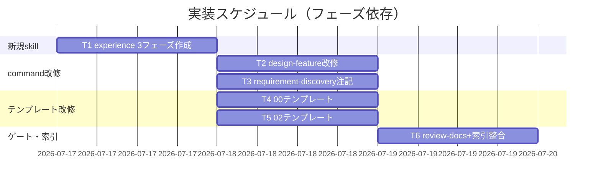

# 実装計画書: CORE へのデザイナー視点（UX/プロダクトデザイン）の組込

**プロジェクト名**: CORE へのデザイナー視点（UX/プロダクトデザイン）の組込
**作成日**: 2026 年 07 月 17 日
**最終更新**: 2026 年 07 月 17 日

> **重要**: **このドキュメントは常に更新**: 実装計画の変更・進捗・バグの記録があった場合は即座に更新する。
> **必須項目**: テスト観点・BDD 仕様は具体ケースを 1 件以上記載する。
> **スコープ注記**: 本 03 は「どのファイルをどう変更するか」の**計画**であり、`.agent-skill-chain/source/` 実ファイルの改修（実装）は後続 implement-feature フェーズで行う。本フェーズでは行わない。
> **テストの性質**: 本件はコードを持たないフレームワーク変更のため、「テスト」は**ドキュメント成果物・ワークフロー定義の検証観点**（監査・review-docs チェックリスト）である。BDD は検証観点を Given/When/Then で表現する。
>
> **用語**: [.agent-skill-chain/source/CONCEPTS.md §用語規約](../../../../.agent-skill-chain/source/CONCEPTS.md#用語規約) を参照。

---

## 1. 実装概要

### 1.1 実装方針（必須）

02_設計の決定（新規 domain `experience` を 1 つ・体験設計を分担する 3 フェーズ capability `frame-experience`／`map-experience`／`detail-experience` を追加し、design-feature chain 冒頭にトリガー付き 3 工程として差す。**各体験フェーズは進行役が run_command 委譲を step 単位に分割して都度 fresh サブへ委譲する＝ADR-7 委譲手順（run_command / CLOSEOUT 自体は改変しない）**。既存 review-docs ゲート＋DUAL_LENS に相乗り、新規 command・新規 audit・新規成果物ファイルを作らない。**detail-experience は既存デザイン資産の再利用を新規作成より優先し・探索一覧の提示を義務化し・新規作成正当化条件を明文化し・特定技術スタックを CORE に固定しない＝ADR-8**）に従い、`.agent-skill-chain/source/` 配下の**新規 7 ファイル・改修 8 ファイル**を最小 diff で実装する。フェーズ数は 3 に絞り込み（11 工程を丸写ししない）、規模比例でフェーズ統合可とする。

### 1.2 実装順序（必須: 1 件以上）



タスク優先順位: T1（新規 skill 実体）→ T2（chain 接続）→ T3/T4/T5（並行可）→ T6（ゲート相乗り・索引）。

---

## 2. タスク分解

**変更・新規作成する `.agent-skill-chain/source/` 配下のファイルパス一覧（先出し）**:

| # | パス | 種別 |
| - | ---- | ---- |
| 1 | `.agent-skill-chain/source/skills/experience/README.md` | 新規（domain 索引・判断基準優先順位を定義） |
| 2 | `.agent-skill-chain/source/skills/experience/frame-experience/README.md` | 新規（フェーズ1 capability） |
| 3 | `.agent-skill-chain/source/skills/experience/frame-experience/SKILL.md` | 新規（6 見出し契約） |
| 4 | `.agent-skill-chain/source/skills/experience/map-experience/README.md` | 新規（フェーズ2 capability） |
| 5 | `.agent-skill-chain/source/skills/experience/map-experience/SKILL.md` | 新規（6 見出し契約） |
| 6 | `.agent-skill-chain/source/skills/experience/detail-experience/README.md` | 新規（フェーズ3 capability） |
| 7 | `.agent-skill-chain/source/skills/experience/detail-experience/SKILL.md` | 新規（6 見出し契約・責務逆算） |
| 8 | `.agent-skill-chain/source/commands/design-feature.md` | 改修（PROCESS step0a/0b/0c 追加・各 fresh サブ委譲明記・INPUT/OUTPUT/DONE） |
| 9 | `.agent-skill-chain/source/commands/requirement-discovery.md` | 改修（実行時の注意に 1 項） |
| 10 | `.agent-skill-chain/runtime/templates/00_要求定義.md` | 改修（`experience_surface` 任意 frontmatter） |
| 11 | `.agent-skill-chain/runtime/templates/02_設計.md` | 改修（§7 を UI/UX・体験設計＝3 フェーズ受け皿へ拡張） |
| 12 | `.agent-skill-chain/source/commands/review-docs.md` | 改修（確認観点に体験観点 1 項＝あり時の記載有無＋なし時の §7.0 判定記録・理由の妥当性） |
| 13 | `.agent-skill-chain/source/README.md` | 改修（skill domain 索引に experience 追記） |
| 14 | `.agent-skill-chain/source/workflow/TEMPLATES.md` | 改修（02_設計.md 行の capability 列に experience 3 capability を追記） |
| 15 | `.agent-skill-chain/source/workflow/SKILL_MANDATORY.md` | 改修（設計 phase 行に experience 3 capability の条件付き必須＋省略/統合時に残すもの＝§7.0 判定記録/統合記録を追記） |

> 注: 8/9/12/13/14/15 は「1 ファイル 1 責務・最小 diff」を厳守（META_LAYER Rule 3）。10/11 の 00/02 テンプレートは `runtime/templates/` 配下（配布テンプレート正本）。新規 skill は 7 ファイル（domain README + 3 フェーズ×README/SKILL）に増えるが、これはフェーズ分担（fresh サブ per phase・ADR-7）を成立させるための不可欠な粒度であり、新規 command・audit・成果物ファイルは作らないことで肥大化を最小化する（02 ADR-6・新規 7＋改修 8＝計 15）。enforcement 配下（PreToolUse.sh・audit.sh・allowlist）への追随は**不要と検証済み**（02 §9.2・A23: 新規 skill は R1 の保護範囲外、テンプレートは templates carve-out で編集可）。run_command.md・CLOSEOUT.md は改変しない（02 M14）。

### 2.1 タスク 1: 新規 skill domain `experience` / 3 フェーズ capability（frame / map / detail-experience）の作成

#### 2.1.1 概要（必須）

体験設計の観点確認を担う新規 skill 実体を、既存 `skills/requirements/write-bdd/`（README.md + SKILL.md）の構成に厳密に倣って作成する。体験設計は 3 フェーズ capability に分担し、各フェーズは orchestrator が都度 fresh サブへ委譲する前提で SKILL.md を書く（ADR-7）。

#### 2.1.2 実装内容（必須: 1 件以上）

- `skills/experience/README.md`: domain 索引（`skills/requirements/README.md` の表形式に倣う。capability = frame-experience / map-experience / detail-experience の 3 つ）。**判断基準の優先順位（ビジネス目標 > ユーザータスク > 情報階層 > アクセシビリティ > デザインシステムの一貫性 > レスポンシブ > 保守性 > ビジュアルの洗練度・8 段）をドメイン共通ルールとして明記**（02 §2.1.4。設計判断とレビュー判断の双方に用いる同一リスト）。**「各フェーズは別 fresh サブが担当し一気通貫にしない」旨（ADR-7・CLOSEOUT §fresh サブ分割）と「規模比例でフェーズ統合可」を明記**。**detail-experience の「既存デザイン資産の再利用優先・新規作成正当化条件・技術非依存」（ADR-8）にも触れる**。
- `skills/experience/frame-experience/{README.md,SKILL.md}`: 体験の前提づけ（ビジネス目的・KPI・ユーザー/課題・JTBD）。02 §5.2 契約1・§3.1.2 フェーズ1 に準拠。Process に「体験サーフェス判定の §7.0 記録（00 に値が無い場合）」「前提ナラティブ」「却下案 1 件以上」「幻覚ペルソナ注意」を含める。Forbidden に「00/01 の目的・成功基準・ユーザーストーリーの再定義・重複執筆の禁止（frame は 00/01 を体験の前提へ翻訳する役。矛盾発見時は進行役へ差し戻す）」を含める（02 契約1・extract-goals/write-bdd との二重工数防止）。
- `skills/experience/map-experience/{README.md,SKILL.md}`: 体験の流れ（IA・UXフロー・ジャーニー）。02 §5.2 契約2・§3.1.2 フェーズ2 に準拠。Inputs に §7.1、Outputs に §7.2。却下案（導線案）必須。
- `skills/experience/detail-experience/{README.md,SKILL.md}`: 体験の具体化（UI・デザインシステム・アクセシビリティ・実装可能性）＋責務逆算。02 §5.2 契約3・§3.1.2 フェーズ3・**ADR-8**（既存デザイン資産の再利用優先）に準拠。Inputs に §7.2 ＋**消費者プロジェクトの既存デザインシステム（存在すればその階層・命名を最優先で参照）**、Outputs に §7.3 ＋ define-boundaries への責務・API 候補。以下を Process/Done に必須で含める:
  - **既存資産の再利用探索順序**（新規作成の前に必ず実施）: ①既存のページテンプレート相当 → ②既存のパターン/セクション相当 → ③既存のコンポーネント相当 → ④既存のレイアウト相当の組み合わせ → ⑤既存のプリミティブ相当 → ⑥不足時のみ新規作成（ADR-8）。
  - **探索一覧の提示義務（検証可能な成果物形式）**: Outputs/Done に「§7.3 へ**探索した既存資産の一覧**（どの層で何を探索し、再利用可否と理由）を列挙する。既存デザイン資産が無いプロジェクトでは『既存資産なし』と 1 行明記する」を含める（『探索した』の一言では Done を満たさない。02 契約3）。
  - **新規作成の正当化条件**（新規 UI 要素を作る場合に §7.3 へ明記）: 複数箇所での再利用見込み・責務明確・既存の組み合わせで表現不可・バリアント明示・アクセシビリティ要件文書化・レスポンシブ挙動文書化。
  - **4 原則**: 基礎値（トークン相当）を自由に増やさない／レイアウトを個別成果物に直接埋め込まない／既存を先に探索する／新規作成条件を明文化する。
  - **技術非依存**: 消費者が独自の階層・デザインシステム命名（Atoms/Molecules や Tokens/Primitives/Components/Layouts/Patterns/Templates/Pages 等）を持てばそれを最優先で使い、無ければ一般化した多層構造（基礎値→最小部品→複合部品→レイアウト→パターン→個別成果物）を参考にしてよい。**特定フレームワーク（React/Figma 等）・ディレクトリ構成・階層名を SKILL.md に固定しない**（ADR-8・§5.2 Forbidden）。
  - 「格好いいが操作しづらい」（ビジュアル洗練度がユーザータスク・アクセシビリティを上回る案）を却下する観点を必須。
- 各 SKILL.md は frontmatter（name/description）＋ IO_CONTRACT 6 見出し（新規のため猶予なし）。

#### 2.1.3 テスト観点（必須）

##### 単体（ドキュメント検証・必須 1 件以上）

- 3 つの SKILL.md それぞれに Purpose/Inputs/Process/Outputs/Done/Forbidden の 6 見出しが揃っている（IO_CONTRACT 新規猶予なし）。
- frame の Process に「体験サーフェス判定の記録」「ナラティブ」「却下案 1 件以上」「幻覚ペルソナ注意」が含まれる。map/detail の Process に各フェーズ責務＋却下案が含まれる。
- **detail の Process に既存資産の再利用探索順序（①テンプレート→…→⑤プリミティブ→⑥不足時のみ新規作成）が含まれ、Outputs/Done に探索一覧の提示義務（層ごとの探索対象・再利用可否・理由の列挙。資産なしは 1 行明記）と新規作成正当化条件が含まれる（ADR-8）。特定技術スタック（React/Figma 等）を前提固定していない。**
- frame の Forbidden に 00/01 の再定義・重複執筆の禁止（二重工数防止）が含まれる。
- 3 つの README.md が既存 capability README のセクション（目的/手順/制約・禁止/成果物の形式/参照）を満たす。
- domain README に判断基準優先順位（8 段）・fresh サブ分割・規模比例統合・detail の再利用優先（ADR-8）が明記されている。

##### 結合/API（該当時は必須 1 件以上）

- フェーズ間の OUT/IN 連鎖（frame §7.1 → map §7.2 → detail §7.3）が SKILL.md 間で矛盾しない。
- detail-experience の Outputs（責務・API 候補）が define-boundaries の Inputs と接続する記述がある。

##### E2E/受け入れ

- 消費者ランタイムでの実運用検証は本 issue のスコープ外（実装後の実運用で担保）。理由: フレームワーク定義の検証は静的レビューで足りる。

##### バリデーション

- domain 名は `experience`（「デザイン」を含めない）、capability 名は `frame-experience` / `map-experience` / `detail-experience`。
- フェーズ間で責務が重複していない（frame=目的/ユーザー、map=IA/流れ、detail=UI/実装可能性）。

#### 2.1.4 単体テスト仕様（BDD）（必須）

```gherkin
Feature: experience 3 フェーズ skill の定義
  Scenario: 3 つの SKILL.md が IO_CONTRACT 6 見出しを満たしフェーズ責務が分離している
    Given skills/experience/{frame,map,detail}-experience/SKILL.md を新規作成する
    When 各 SKILL.md の見出しとフェーズ責務を検査する
    Then それぞれ Purpose/Inputs/Process/Outputs/Done/Forbidden の 6 見出しが揃い、frame=目的/ユーザー・map=IA/流れ・detail=UI/実装可能性 に責務が分離し、各 Process に却下案が含まれる

  Scenario: 各フェーズが fresh サブ委譲前提で記述される
    Given experience domain README と 3 SKILL.md
    When 委譲モデルの記述を検査する
    Then 「各フェーズは別 fresh サブが担当し一気通貫にしない（ADR-7・CLOSEOUT §fresh サブ分割）」旨と「規模比例でフェーズ統合可」が明記されている

  Scenario: detail-experience が既存資産の再利用を新規作成より優先する（ADR-8）
    Given skills/experience/detail-experience/SKILL.md
    When Process/Done の再利用探索・新規作成条件の記述を検査する
    Then Process に既存資産の探索順序（①テンプレート→②パターン/セクション→③コンポーネント→④レイアウト→⑤プリミティブ→⑥不足時のみ新規作成）が含まれ、Outputs/Done に探索した既存資産の一覧の提示義務（層ごとの探索対象・再利用可否・理由。資産なしは「既存資産なし」と 1 行明記）と新規作成正当化条件（複数箇所再利用見込み・責務明確・既存組合せで表現不可・バリアント明示・アクセシビリティ/レスポンシブ文書化）が含まれ、特定フレームワーク・ディレクトリ構成を前提固定していない（技術非依存・消費者の既存階層を最優先で使う旨が書かれている）
```

**検証手段（コード非実行・監査観点）**: review-docs / 監査で 3 SKILL.md の見出し・フェーズ責務分離・fresh サブ委譲記述の存在をチェックリスト照合する。

#### 2.1.5 依存関係

- なし（最初に着手可能）。3 フェーズは frame → map → detail の順で作成すると OUT/IN 連鎖を確認しやすい。

#### 2.1.6 見積もり

- **工数**: 中〜大（3 capability） / **優先度**: 高

### 2.2 タスク 2: `commands/design-feature.md` の PROCESS 改修

#### 2.2.1 概要（必須）

design-feature の skill chain 冒頭に、体験サーフェス=あり のときのみ発動する frame → map → detail-experience の 3 工程を step0a/0b/0c として追加する。各工程は orchestrator が都度 fresh サブへ委譲する（ADR-7）。

#### 2.2.2 実装内容（必須: 1 件以上）

- PROCESS に「0a. frame-experience / 0b. map-experience / 0c. detail-experience（いずれも体験面=あり時）」を追加し、既存 1-3 を維持。各 step に `skills/experience/{frame,map,detail}-experience/` を明記。
- INPUT に「00 の `experience_surface`」を追記。
- 「入出力の受け渡し」に frame OUT(§7.1)→map IN、map OUT(§7.2)→detail IN、detail OUT(責務・API 候補)→define-boundaries IN を追記。
- OUTPUT/DONE に「体験面=あり なら 02 §7 に体験設計（3 フェーズ分または統合記録）記載」「体験面=なし なら判定結果（なし＋理由）が §7.0 に記録」を追記。
- 「実行時の注意」に、**委譲粒度の分割規定（ADR-7 委譲手順）**を追記: 体験面=あり の場合、進行役は run_command による委譲を「step 0a」「step 0b」「step 0c」「残り chain（step 1〜3）」の単位に分割し、各委譲パケット（Task/Constraints/OutputSpec）に**担当 step・成果物（02 §7.x）・前フェーズの確定出力（§7.x）・継承物（却下済み指摘＋理由・must-preserve リスト＝CLOSEOUT §fresh サブ分割の継承前提）・選定ティア/effort** を明記して、フェーズごとに別 fresh サブへ委譲する（一気通貫にしない。標準の「1 command 委譲＝1 サブが chain 通し実行」のままでは 0a〜0c が同一サブになるため、この分割規定を command 側に明文化する）。
- 「実行時の注意」に、規模比例でフェーズ統合可（統合対象の工程群は 1 委譲に畳んでよい・統合記録を §7 に残す）の旨、体験面=なし はトリガー非該当の正常系であり工程欠落として扱わない旨、**00 明示 `no:` 時の §7.0 転記・検証責務**（設計フェーズ最初の委譲サブが 00 の値を §7.0 へ転記し、体験サーフェス定義に照らして検証。矛盾すれば「あり」へ倒して進行役へ差し戻す＝ADR-3 形骸化防止）を追記。

#### 2.2.3 テスト観点（必須）

##### 単体（必須 1 件以上）

- PROCESS に step0a/0b/0c（frame/map/detail-experience）が「体験面=あり時」の条件付きで記載され、各 step の fresh サブ委譲が明記されている。
- 実行時の注意に**委譲粒度の分割規定**（step 単位の分割委譲・委譲パケットに担当 step／前フェーズ確定出力／継承物／ティア・effort を明記）と **00 明示 `no:` 時の §7.0 転記・検証責務**が記載されている。
- 既存 step1-3（define-boundaries / design-api-contract / review-dependencies）が順序・内容とも不変。run_command.md・CLOSEOUT.md を改変していない（02 M14）。

##### 結合/API（該当時）

- design-feature.md の chain 記載と 3 SKILL.md の Inputs/Outputs 連鎖（frame→map→detail→define-boundaries）が矛盾しない。

##### E2E/受け入れ

- 該当なし（静的レビューで担保）。

##### バリデーション

- 体験面=なし の場合・規模比例でフェーズ統合した場合に「未実行 = 欠落」と誤判定しない記述がある。

#### 2.2.4 単体テスト仕様（BDD）（必須）

```gherkin
Feature: design-feature への体験 3 工程差し込み
  Scenario: 体験面=あり の issue で 3 フェーズが chain 冒頭で順に発動し各々 fresh サブに委譲される
    Given design-feature.md の PROCESS を改修した
    When UI/UX を伴う機能 issue（experience_surface=あり）で design-feature を実行する
    Then step0a→0b→0c で frame→map→detail-experience が順に発動し、各々別 fresh サブへ委譲され、define-boundaries より前に体験設計観点が確認される

  Scenario: 体験面=なし の issue では 3 フェーズをスキップし正常完了する
    Given バックエンドのみの issue（experience_surface=no: 理由）
    When design-feature を実行する
    Then 体験 3 フェーズはトリガー非該当としてスキップされ、工程欠落とみなされず completes

  Scenario: 小規模サーフェスではフェーズを統合してよい
    Given 体験サーフェスが小さい issue（experience_surface=yes・CLI 1 行等）
    When design-feature を実行する
    Then orchestrator は 3 フェーズを統合し最小 1 サブに畳んでよく、§7 に統合記録が残り、工程欠落とみなされない
```

#### 2.2.5 依存関係

- T1（3 フェーズ capability の存在）に依存。

#### 2.2.6 見積もり

- **工数**: 小 / **優先度**: 高

### 2.3 タスク 3: `commands/requirement-discovery.md` の軽微改修

#### 2.3.1 概要（必須）

要求フェーズで体験サーフェスが判明していれば 00 に記録してよい旨を「実行時の注意」に 1 項追加する（chain は不変）。

#### 2.3.2 実装内容（必須: 1 件以上）

- 「実行時の注意」に「UI/UX を伴うか要求時に判明していれば 00 frontmatter の `experience_surface` に記録してよい（任意・design-feature の frame-experience が最終判定する）」を追記。PROCESS（skill chain）は変更しない。

#### 2.3.3 テスト観点（必須）

##### 単体（必須 1 件以上）

- requirement-discovery.md の PROCESS（extract-goals→identify-assumptions→define-constraints→write-bdd）が不変。
- 実行時の注意に experience_surface 記録の 1 項が追加されている。

##### 結合/API（該当時）

- 該当なし（chain 不変）。

##### E2E/受け入れ / バリデーション

- 該当なし。

#### 2.3.4 単体テスト仕様（BDD）（必須）

```gherkin
Feature: requirement-discovery での体験サーフェス記録
  Scenario: 要求時に体験サーフェスを 00 に記録できる
    Given requirement-discovery.md に experience_surface 記録の注記を追加した
    When 要求フェーズで UI/UX 関与が判明している
    Then 00 frontmatter に experience_surface を任意記録でき、chain（4 skill）は変更されていない
```

#### 2.3.5 依存関係 / 2.3.6 見積もり

- 依存: T1。工数: 小 / 優先度: 中。

### 2.4 タスク 4: `runtime/templates/00_要求定義.md` の改修

#### 2.4.1 概要（必須）

体験サーフェス判定 `experience_surface` を任意 frontmatter 項目としてテンプレートに追加する。

#### 2.4.2 実装内容（必須: 1 件以上）

- frontmatter に、既存 `mode`/`branch`/`github_issue` に倣ったコメント付き任意項目を追加:
  ```yaml
  # experience_surface: 任意。この変更の出力を人間が感覚器で直接体験するか（画面・CLI出力・エラー・生成Markdown・エージェント指示文を含む）。
  #   あり: "yes: <理由1行>" / なし: "no: <理由1行>"。未記入時は design-feature の frame-experience（体験フェーズ1）が判定・記録する。
  experience_surface: null
  ```
- 既存項目・本文セクションは一切変更しない（後方互換）。

#### 2.4.3 テスト観点（必須）

##### 単体（必須 1 件以上）

- frontmatter に `experience_surface` が任意（既定 null）で追加され、既存 `mode`/`branch`/`github_issue`/`issue_id`/`document_id` が不変。
- 既存 00 ドキュメント（本項目を持たない）が引き続き有効（後方互換）。

##### 結合/API（該当時）

- frame-experience が読む値の形式（`yes:`/`no:` プレフィックス）が SKILL.md の Inputs 記述と一致。

##### E2E/受け入れ / バリデーション

- `no:` 空理由の扱いは機械強制しない（新規 audit を作らない・ADR-4）。silent skip 防止は frame-experience の判定記録で担保。

#### 2.4.4 単体テスト仕様（BDD）（必須）

```gherkin
Feature: 00 テンプレートの体験サーフェス枠
  Scenario: experience_surface が任意項目として追加され後方互換を保つ
    Given 00_要求定義.md テンプレートに experience_surface を追加した
    When 本項目を持たない既存 00 を読む
    Then 既存 00 は有効なままで、新規 00 は experience_surface を任意記録できる
```

#### 2.4.5 依存関係 / 2.4.6 見積もり

- 依存: なし（T1 と並行可）。工数: 小 / 優先度: 中。

### 2.5 タスク 5: `runtime/templates/02_設計.md` の §7 拡張

#### 2.5.1 概要（必須）

既存 §7「UI 設計」を「UI/UX・体験設計」へ拡張し、体験 3 フェーズ出力の受け皿（7.0〜7.4）を設け、既存 7.1/7.2 を 7.5/7.6 へ再配置する。

#### 2.5.2 実装内容（必須: 1 件以上）

- §7 見出しを「7. UI/UX・体験設計」に変更。
- 7.0 体験サーフェス判定（＋判断基準優先順位・8 段）/ 7.1 フェーズ1 体験の前提（frame）/ 7.2 フェーズ2 体験の流れ（map）/ 7.3 フェーズ3 体験の具体化（detail・**既存資産の再利用探索結果／新規作成の正当化根拠欄と技術非依存の注記を含む**・ADR-8）/ 7.4 幻覚ペルソナ注意 を追加（02 §7 の構成に準拠）。各フェーズ節に却下案欄を設ける。
- 既存「7.1 画面遷移図」「7.2 画面設計」を「7.5 画面遷移図」「7.6 画面設計」へ再配置（内容は不変・後方互換）。

#### 2.5.3 テスト観点（必須）

##### 単体（必須 1 件以上）

- §7 に 7.0〜7.4 の 3 フェーズ体験設計受け皿が存在し、既存の画面遷移図・画面設計が失われていない。

##### 結合/API（該当時）

- 7.1/7.2/7.3 の構成が frame/map/detail-experience の Outputs（§5.2 契約1-3・Done）と一致。

##### E2E/受け入れ / バリデーション

- 既存 issue の 02（旧 §7 構成）を破壊しない（テンプレートは新規作成時の枠であり既存成果物を書き換えない）。

#### 2.5.4 単体テスト仕様（BDD）（必須）

```gherkin
Feature: 02 テンプレート §7 の体験設計拡張
  Scenario: §7 が 3 フェーズ体験設計の受け皿を持ち画面設計も保持する
    Given 02_設計.md テンプレート §7 を「UI/UX・体験設計」へ拡張した
    When frame/map/detail-experience の出力を §7.1/7.2/7.3 に反映する
    Then 7.0（判定＋優先順位）/7.1（前提）/7.2（流れ）/7.3（具体化）/7.4（幻覚ペルソナ注意）に記録でき、各フェーズに却下案欄があり、7.5/7.6 に画面遷移図・画面設計も残る
```

#### 2.5.5 依存関係 / 2.5.6 見積もり

- 依存: なし（T1 と並行可）。工数: 小 / 優先度: 中。

### 2.6 タスク 6: `commands/review-docs.md` ＋ `source/README.md` ＋ workflow 索引（TEMPLATES / SKILL_MANDATORY）の相乗り・整合改修

#### 2.6.1 概要（必須）

体験観点を既存 review-docs ゲート（DUAL_LENS）に相乗りさせ、skill domain 索引・capability→テンプレート対応・phase 別必須条件を新 capability に追随させる。

#### 2.6.2 実装内容（必須: 1 件以上）

- `commands/review-docs.md`: 実装前レビューの確認観点（Process 2 のレビュー観点）に次の 1 項を追加: 「体験面=あり の issue は 02 §7 に体験設計観点（ナラティブ・却下案・6 観点・探索一覧・幻覚ペルソナ注意）が記載されているかを DUAL_LENS で確認し、欠落時は差し戻す。**体験面=なし は体験設計の欠落では差し戻さない。ただし §7.0 の判定記録が無い場合、または『なし』の理由が体験サーフェス定義（画面に限らず CLI 出力・エラー・生成 Markdown・エージェント指示文を含む）と明らかに矛盾する場合は差し戻す**（機械的な『なし』の形骸化防止・ADR-3）」。新規 audit.sh チェックは追加しない。
- `source/README.md`: skill 索引（または「何を知りたいときに何を読むか」表の周辺）に `experience`（体験設計）domain を 1 行追記。
- `workflow/TEMPLATES.md`: 「成果物 → テンプレート → 使う command / capability」表の 02_設計.md 行の「主に使う capability」列に `frame-experience, map-experience, detail-experience`（体験面=あり時）を追記（capability→テンプレート対応の正本を最新化・RULES §ドキュメント）。既存行・既存記載は変更しない。
- `workflow/SKILL_MANDATORY.md`: 設計 phase 行に「**条件付き**: frame/map/detail-experience は `experience_surface`=あり のときのみ必須（規模比例で統合可）。体験面=なし／統合時に残すもの＝02 §7.0 の判定記録／統合記録」を追記。既存の Mandatory 3 capability（define-boundaries / design-api-contract / review-dependencies）の記載は変更しない。

#### 2.6.3 テスト観点（必須）

##### 単体（必須 1 件以上）

- review-docs.md に体験観点確認の 1 項（あり時の記載有無＋なし時の §7.0 判定記録・理由の妥当性）が追加され、既存の review-docs 完了定義（memo＋指摘収束＋書記委譲）を再定義していない。
- README.md の索引に experience が現れる。
- TEMPLATES.md の 02_設計.md 行に experience 3 capability が現れ、既存行が不変。
- SKILL_MANDATORY.md の設計 phase 行に条件付き必須（体験面=あり時のみ・省略/統合時に残すもの）が現れ、既存 Mandatory の記載が不変。

##### 結合/API（該当時）

- 追記が REVIEW_DUAL_LENS.md §5（review-docs も DUAL_LENS 対象）と矛盾しない。

##### E2E/受け入れ

- 体験面=あり で §7 が空の 02 を review-docs が差し戻せる（観点として成立）。

##### バリデーション

- 体験面=なし の issue を体験観点欠落として差し戻さない（過剰適用回避）。

#### 2.6.4 単体テスト仕様（BDD）（必須）

```gherkin
Feature: review-docs ゲートへの体験観点相乗り
  Scenario: 体験面=あり で体験設計が欠落した設計を差し戻す
    Given review-docs.md に体験観点確認の項を追加した
    And UI/UX を伴う issue の 02 §7 が空である
    When 実装着手前の review-docs ゲートを通過しようとする
    Then 体験設計観点の欠落が指摘され、設計完了とみなされず差し戻される

  Scenario: 体験面=なし の issue は体験観点で差し戻さない
    Given experience_surface が "no: 理由" の issue で 02 §7.0 に判定記録（なし＋理由）がある
    When review-docs を実行する
    Then 体験観点の欠落を理由に差し戻されない（過剰適用回避）

  Scenario: 機械的な「なし」判定は差し戻される（形骸化防止）
    Given experience_surface が "no: バックエンドのため" だが、当該機能の出力に CLI メッセージ・生成 Markdown 等の体験サーフェスが明らかに存在する
    When review-docs を実行する
    Then §7.0 の判定理由が体験サーフェス定義と矛盾するとして差し戻され、体験フェーズの実施（または妥当な再判定）が要求される
```

#### 2.6.5 依存関係 / 2.6.6 見積もり

- 依存: T1/T2/T5（TEMPLATES.md / SKILL_MANDATORY.md の追記は T1 の capability 確定に依存）。工数: 小 / 優先度: 高。

---

## テスト観点

全タスクの検証観点は「ドキュメント成果物・ワークフロー定義の静的検証」であり、review-docs / 監査のチェックリストとして機能する。クリティカル観点: (1) 新規 skill（3 フェーズ）の各 6 見出し充足・フェーズ責務非重複、(2) chain 順序と条件分岐の明確さ・委譲粒度の分割規定（ADR-7 委譲手順: step 単位の分割委譲・委譲パケットの内容）の明記、(3) テンプレート後方互換、(4) 既存ゲートとの整合（新規 audit を作らない）、(5) 過剰適用回避と形骸化防止の両立（体験面=なし は体験欠落で差し戻さないが、§7.0 判定記録なし・理由の明白な矛盾は差し戻す。規模比例でフェーズ統合可）、(6) 索引の追従（TEMPLATES.md / SKILL_MANDATORY.md / README）。

## 単体テスト

コードを持たないため実行可能な単体テストは無い。各タスク §2.x.4 の BDD は「監査・review-docs での検証観点」を Given/When/Then で表現したものであり、テストコード化不能な理由（=フレームワーク定義の静的変更）を明記する。

## BDD

各タスク §2.x.4 の Gherkin を参照。01_要件定義.md のユースケース 1-3・各シナリオとの対応は下表（§4.2）で担保する。

---

## 3. 実装スケジュール

### 3.1 マイルストーン

| マイルストーン | 期日 | 成果物 |
| -------------- | ---- | ------ |
| M1: 新規 skill 完成 | T1 完了 | experience domain・frame/map/detail-experience（各 README+SKILL） |
| M2: chain・テンプレート接続 | T2-T5 完了 | design-feature/requirement-discovery/00/02 改修 |
| M3: ゲート相乗り・索引 | T6 完了 | review-docs/README 改修 |

### 3.2 実装フェーズ

- フェーズ1: T1（新規 skill 実体）
- フェーズ2: T2-T5（chain 接続・テンプレート・並行可）
- フェーズ3: T6（ゲート相乗り・索引）→ implement-feature 後に review-docs ゲート

---

## 4. テスト計画

### 4.1 テストの優先順位

- クリティカル: 新規 skill 6 見出し・chain 条件分岐・既存ゲート整合。
- 回帰: テンプレート後方互換（既存 00/02 を壊さない）・既存 chain（requirements 4 skill・architecture 3 skill）不変。

### 4.2 01 受け入れ基準（BDD）との対応表（必須）

| 01 のユースケース/シナリオ | 対応する 03 タスク / BDD | 検証観点 |
| -------------------------- | ------------------------ | -------- |
| UC1-S1: UI/UX 関与機能で 6 観点確認が実施される | T1（frame/map/detail Process）・T2（step0a/0b/0c 発動） | §7 に 6 観点（3 フェーズ配分）＋ナラティブ記載 |
| UC1-S1（拡張・ADR-8）: detail で既存資産を再利用優先し新規作成は正当化条件を満たす | T1（detail-experience Process/Done の再利用探索順序・新規作成条件）・T5（02 §7.3 に再利用結果／正当化根拠欄） | §7.3 に既存資産の再利用探索結果と新規作成正当化根拠が記載され、特定技術スタックを前提固定していない |
| UC1-S2: 観点欠落が既存ゲートで差し戻される | T6（review-docs 相乗り・S1） | 体験面=あり で §7 空を差し戻す |
| UC2-S1: UI/UX 非関与でスキップ・負荷ゼロ | T2（体験面=なし スキップ・S2／小規模フェーズ統合・S3）・T6（S2） | 非該当で差し戻さない・工程増えない・規模比例統合可 |
| UC2-S2: トリガー判定が明確 | T4（experience_surface 枠）・T1（frame step1 判定記録）・T2（00 明示 `no:` の §7.0 転記・検証）・T6-S3（機械的な「なし」の差し戻し） | あり/なし が一意に判定・記録され、機械的な「なし」が検証・差し戻しで矯正される |
| UC3-S1: fable は成果物本文を執筆しない | 02 §2.5 アドバイザー入力の扱い（設計内で担保）・本 issue の運用 | 02/03 の初版〜ラウンド2 は opus 執筆・fable は助言のみ。**review-docs ラウンド3 の指摘修正のみ、ユーザー最重要指定の都度例外として fable が直接実施**（MODEL_TIER_TABLE の例外条件の発動・恒常運用ではない。02 §13.3/A22 に正直記録。CORE に組み込む設計としての fable 役割＝アドバイザー限定は不変） |
| UC3-S2: fable 起用は都度例外 | 02 §制約・MODEL_TIER_TABLE 整合 | 恒常運用化しない旨の記載 |
| ストーリー5: 変更が CORE に届く | T1-T6 全て（変更対象が `.agent-skill-chain/source/`・`runtime/templates/`） | project 限定でない |

> UC3（fable 限定起用）は「本 issue の運用規律・02 の設計方針」で担保される性質のもので、`.agent-skill-chain/source/` への新規実装タスクを生まない（既存 MODEL_TIER_TABLE.md で既に規定済み。再実装しない）。

---

## 5. リスク管理

### 5.1 実装リスク

- **リスク**: 基盤修正ファイル数が META_LAYER 目安（≤2）を超える。
  - **対策**: 02 ADR-6 の 6 簡素化（フェーズを 3 に絞る・新規 command なし・新規 audit なし・新規成果物ファイルなし・§7 拡張・requirement は注記のみ）を厳守し、各ファイル最小 diff。review-docs で肥大化チェック。
- **リスク**: 体験 3 フェーズが extract-goals/write-bdd と重複し形骸化する。
  - **対策**: 差し込みを design-feature 冒頭のみに限定（ADR-2）。体験フェーズは「体験の流れ→責務逆算」に責務を絞り、ユーザーストーリー（write-bdd）と分離。フェーズ間も責務を非重複に保つ（frame=目的/ユーザー、map=IA/流れ、detail=UI/実装可能性）。
- **リスク**: 3 フェーズ分割で fresh サブが増え、小規模 issue に過剰委譲が起きる。
  - **対策**: 規模比例でフェーズ統合可（ADR-7・T2-S3）。体験面=なし はスキップ。orchestrator が規模に応じ最小 1 サブへ畳む。
- **リスク**: 幻覚ペルソナが実ユーザー調査の代替として誤用される。
  - **対策**: §7.4 注意書きを必須化。SKILL.md Forbidden に明記。ただし残余リスクは隠さず 02 §6.3 に記載。
- **リスク**: 体験観点を全 issue に強制し過剰適用。
  - **対策**: トリガー（experience_surface）＋体験面=なし を体験欠落で差し戻さない明記（T6-S2）。
- **リスク**: AI エージェントが機械的に `no: バックエンドのため` 等の定型理由を書き、実質スキップが恒久化する（「なし」判定の形骸化）。
  - **対策**: 00 明示値も無検証で採用せず、設計フェーズ最初の委譲サブが §7.0 へ転記・検証（矛盾時は「あり」へ倒す fail-safe）＋ review-docs で判定記録の存在と理由の妥当性を確認し明白な矛盾は差し戻す（ADR-3・T2・T6-S3）。
- **リスク**: 標準の「1 command 委譲＝1 サブが chain 通し実行」のまま実装され、体験 3 フェーズが結局 1 サブの一気通貫になる（ADR-7 の理念倒れ）。
  - **対策**: design-feature.md 実行時の注意に委譲粒度の分割規定（step 単位の分割委譲・委譲パケットに担当 step／前フェーズ確定出力／継承物／ティア・effort）を明文化（T2）。review-docs / 監査で同規定の記載を確認（T2 単体観点）。
- **リスク**: detail-experience の再利用優先原則（ADR-8）を実装する際、プロジェクトオーナー提示の技術例（React/Figma/Storybook・7 層・ディレクトリ構成・コード例）を SKILL.md に丸写しし、特定技術スタックを CORE に固定してしまう。
  - **対策**: SKILL.md には技術非依存の汎用原則（探索順序・新規作成正当化条件・4 原則・一般化した多層構造の「考え方」）のみ記述。特定フレームワーク・ディレクトリ構成・階層名は書かず、「消費者が既存の階層・デザインシステムを持てば最優先で使い、無ければ一般化した考え方を参考にする（厳密強制しない）」旨を明記（ADR-8・§5.2 Forbidden・T1 単体観点）。review-docs で技術スタック固定の有無をチェック。
- **リスク**: 既存資産の再利用を機械的な「探索したか」のチェックボックスにしてしまい形骸化する。
  - **対策**: §7.3 に「再利用したか／新規作成なら正当化条件の充足根拠」をナラティブで記述させる（反チェックボックス。ADR-8・M8 と同型）。

---

## 6. サブ issue 分割の判断

- **90_issues.md は作成しない**。本件は「新規 skill domain 1 つ（3 capability）＋関連 command/テンプレート/索引/ゲートの一体改修」という単一の凝集した変更であり、独立に完結・並行 PR 化すべき分割単位を持たない（T1-T6 は相互依存し 1 つの実装フェーズで完結する）。分割はかえって chain 接続の整合検証を分断しリスクを高める。したがってサブ issue 分割は不要と判断し、`90_issues.md` は作成しない（02 §ADR-6 の最小変更方針とも整合）。

---

## 7. 前のステップ

この実装計画書は、以下のドキュメントを基に作成されています：

- **前**: [`02_設計.md`](./02_設計.md) - 設計フェーズ

---

## 8. 次のステップ

この実装計画書の承認後、以下に進みます：

- 本 issue は 1 つの issue（サブ分割なし）であるため、実装フェーズ（implement-feature）に直接進む。
- **実装着手前に review-docs（実装前ドキュメントレビュー）ゲートを必ず経ること**（full モード・[design-feature.md DoD](../../../../.agent-skill-chain/source/commands/design-feature.md)）。
