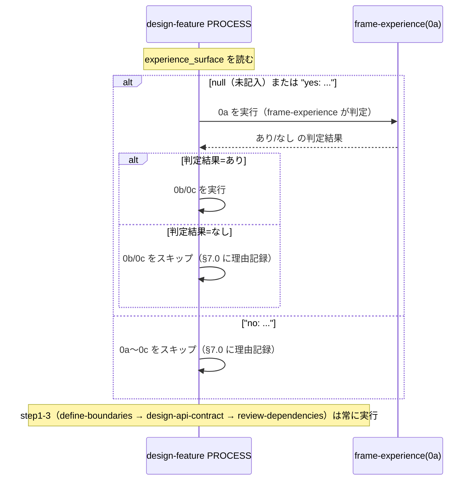

# 設計書: PR#128 指摘対応（是正実装）

**プロジェクト名**: PR#128 指摘対応（是正実装）
**作成日**: 2026 年 07 月 17 日
**最終更新**: 2026 年 07 月 17 日

> **重要**: **このドキュメントは常に更新**: 設計の変更や追加があった場合は、即座にこのドキュメントを更新してください。ドキュメントは「生きているドキュメント」として扱い、実装内容と常に同期させます。
>
> **用語**: [.agent-skill-chain/source/CONCEPTS.md §用語規約](../../../../../.agent-skill-chain/source/CONCEPTS.md#用語規約) を参照。

---

## 1. 設計概要

**必須**: 設計方針・原則は [.agent-skill-chain/source/spec/01\_設計原則.md](../../../../../.agent-skill-chain/source/spec/01_設計原則.md) を参照した上で、本プロジェクトに適用するものを選び記載する。

### 1.1 設計方針

本 issue は [01_要件定義.md](./01_要件定義.md) が確定した PR#128 レビュー指摘 11 件（finding-1, 2, 4, 5, 6, 7, 8, 10, 11, 13, 14）を、根本原因ごとに 5 グループ（A/B/C/D/E）＋独立 1 件（finding-8）として是正する**ドキュメント・テンプレート・command 定義の記述修正**の設計である。新規機能・新規 command・新規 audit・新規 skill を追加せず、既存の CORE 制御ファイル（`commands/design-feature.md`・`commands/review-docs.md`）を含む対象ファイルを**最小 diff・1 ファイル 1 責務・後方互換**で修正する。

### 1.2 設計原則（本プロジェクトで適用するもの）

- **単一責務**: 各グループの修正は該当ファイルの該当箇所のみを対象とし、1 つの是正のために無関係な節・無関係なファイルへ手を広げない（1 ファイル 1 責務）。
- **明確な境界**: 是正は「記述の整合」に限る。command/skill/テンプレートの構造（IO_CONTRACT 形式・見出し番号・節構成）・実行時挙動の意味を変えない。挙動が実質的に変わるのはグループ C（`experience_surface: null` 時の chain 起動）のみで、それ以外は表記・記録項目・確認観点の整合である。
- **AIフレンドリー設計**: 是正後の文言は、design-feature/review-docs を実行するサブエージェントが一義に読める表現にする（[01\_設計原則 §AIフレンドリー設計](../../../../../.agent-skill-chain/source/spec/01_設計原則.md#aiフレンドリー設計)）。[06\_設計判断の優先順位.md](../../../../../.agent-skill-chain/source/spec/06_設計判断の優先順位.md)（可読性 > 単一責務 > 仕様整合 > 変更容易性 > 保守性 > 再利用性 > 実装効率）に従い、可読性・単一責務・仕様整合を優先する。

> **spec 参照証跡**: spec/00_spec概要.md（フレームワーク正本＝配布パッケージの整合）・spec/01_設計原則.md（単一責務・明確な境界）・spec/06_設計判断の優先順位.md（可読性優先）を参照して本設計を行った。

---

## 2. アーキテクチャ設計

### 2.1 責務・境界・参照関係

#### 2.1.1 責務一覧

| コンポーネント（グループ） | 責務（1 文） |
| -------------------------- | ------------ |
| グループ A（finding-1, 5） | detail-experience の手順6「実装可能性・検証改善観点の確認」の結果が成果物に残るよう、`runtime/templates/02_設計.md` §7.3 と `detail-experience/README.md` OUT 契約の双方に記録項目を追加する。 |
| グループ B（finding-4, 6） | 「新規 UI 作成が正当化される条件」の必須レベル表現を、`detail-experience/README.md`・`experience/README.md`・`02_設計.md` テンプレート §7.3 の 3 ファイル間で「満たす場合に限る」（必須）に統一する。 |
| グループ C（finding-2, 7, 14） | `design-feature.md` の PROCESS step0a 実行条件を「`experience_surface` が `null`（未記入）または `"yes: ..."` の場合に実行」へ改め、`SKILL_MANDATORY.md`・`TEMPLATES.md`・issue 本体 `02_設計.md` §3.2.2 の同型条件文を同じ表現へ揃える。 |
| グループ D（finding-10, 11） | issue 本体 `02_設計.md` 契約1（frame-experience）の Outputs/Process/Done を「幻覚ペルソナ注意は共通 §7.4」へ揃え、`04_review.md`「指摘1」の対応済み根拠 commit のレビュー範囲外である旨を補記する。 |
| グループ E（finding-13） | `commands/review-docs.md` の体験観点確認を「§7 記載の有無」から「§7.1〜§7.3 各フェーズの必須項目個別充足」へ強化し、issue 本体 `02_設計.md` §3.3 の該当記述も揃える。 |
| 独立（finding-8） | issue 本体 `00_要求定義.md` §4.1 ほかの「変更対象は `.agent-skill-chain/source/`」限定記述を、実際の変更範囲（`source/` ＋ `runtime/templates/`）に一致させる。 |

#### 2.1.2 境界

- **入力**: 00/01（本サブ issue）が確定した 6 グループの是正方針・受け入れ基準。是正対象の現行実ファイル（Read/grep 確認済み）。
- **出力**: 本フェーズの成果物は 02_設計.md（本ファイル）・03_実装計画.md の 2 点のみ。**実ファイルの改修は次フェーズ（implement-feature）で行い、本フェーズでは実施しない。**
- **他責務との境界（本フェーズの範囲外）**:
  - 実ファイルの編集そのもの（implement-feature の責務）。
  - PR #128 で即時対応済みの finding-9（MD040）・見送りの finding-3（AI 誤検知）は対象外。
  - 新規 command・新規 audit・新規 skill・新規成果物ファイルの追加は行わない。
  - `commands/run_command.md`・`CLOSEOUT.md` は改変しない（グループ C の制約）。既存 step1-3（define-boundaries → design-api-contract → review-dependencies）の順序・内容も変更しない。

#### 2.1.3 参照関係

- 各グループの修正は独立しており、グループ間に依存（呼び出し関係）は無い。同一ファイルを 2 グループが触るのは `runtime/templates/02_設計.md` §7.3（グループ A の記録項目追加・グループ B の必須レベル統一）と issue 本体 `02_設計.md`（グループ C §3.2.2・グループ D 契約1・グループ E §3.3）のみで、いずれも**別の行・別の節**を対象とするため競合しない。
- 循環参照は無い。是正対象ファイル間の記述整合（experience/README ↔ detail-experience/README ↔ 02 テンプレート、design-feature.md ↔ SKILL_MANDATORY ↔ TEMPLATES ↔ issue 02 §3.2.2）は「同じ表現へ揃える」片方向の整合であり、実行時の相互呼び出しではない。

### 2.2 システムアーキテクチャ

- **採用パターン**: 該当なし（新規アーキテクチャを導入しない）。既存の「配布パッケージ正本（`.agent-skill-chain/source/`）＋テンプレート正本（`.agent-skill-chain/runtime/templates/`）＋消費者ランタイム issue ドキュメント」という 3 層の文書構造を前提に、その中の記述整合のみを修正する。
- **根拠**: spec/06 の「可読性 > 単一責務 > 仕様整合」に基づき、既存構造を保存したまま最小 diff で整合を取ることを最優先する。

### 2.5 横断設計判断（ADR）

#### ADR-1: グループ C — design-feature chain の PROCESS 実行条件を「null（未記入）または yes」へ改める（C2・最優先）

- **コンテキスト**: `design-feature.md` INPUT（L25）は「`experience_surface` 未記入の場合は frame-experience が判定する」とするが、PROCESS（L31/33/35）は 0a/0b/0c いずれも「体験サーフェス=あり のときのみ」という条件文で、文字どおり適用すると `experience_surface: null` の issue は 0a（frame-experience）自体が起動されず、INPUT の約束が果たされない（chain 中核の制御フロー矛盾）。
- **検討した選択肢**:
  - (a) PROCESS 0a の実行条件を「`experience_surface` が `null`（未記入）または `"yes: ..."` の場合に 0a を実行し、0a の判定結果（あり/なし）に応じて 0b/0c の要否を決める。`"no: ..."` は 0a〜0c をスキップ」へ変更する。
  - (b) INPUT 側を「`experience_surface=あり` のときのみ frame-experience が起動」へ書き換え、PROCESS に合わせる。
  - (c) 未記入検出用の新規 audit/enforcement を追加してスキップを検知する。
- **決定**: (a)。
- **根拠**: (b) は「未記入時は frame-experience が判定する」という fail-safe 設計（issue 本体 02 §3.1.4 ADR-3・過剰スキップ回避）を捨てることになり後退。(c) は「新規 audit 追加禁止」（01 §5・00 §3）に反する。(a) のみが INPUT の意図（未記入→frame-experience が判定）と PROCESS を無矛盾にし、既存の「`no:`＝トリガー非該当の正常系」「0b/0c は 0a の判定結果に従う」という設計を保存する。evidence_source: existing_code（`design-feature.md` L25/31-35・`experience/README.md` L17 発動条件・issue 本体 02 §3.1.4/§3.2.2 を Read で確認）。
- **帰結**: `design-feature.md` PROCESS・`SKILL_MANDATORY.md` L13・`TEMPLATES.md` L27・issue 本体 02 §3.2.2 の 4 箇所を同じ条件表現へ揃える。挙動が実際に変わるのは `experience_surface: null` の issue のみ（0a が起動するようになる）。既に `"yes:"`／`"no:"` が明記された issue の挙動・DONE の 2 条件分岐（あり/なし）の意味・step1-3 の順序・委譲粒度（ADR-7）・規模比例統合は不変。`run_command.md`・`CLOSEOUT.md` は触らない。

#### ADR-2: グループ B — 必須レベルの統一先を「満たす場合に限る」（必須）とする

- **コンテキスト**: 「新規 UI 作成が正当化される条件」の必須レベルが 3 ファイルで不統一。`detail-experience/README.md`（L21 手順7・L38）は「すべて満たすことが望ましく／望ましい」（努力目標）、`experience/README.md`（L42）は「満たす場合に限る」（必須）、`02_設計.md` テンプレート §7.3（L305）は「満たすことを明記」（必須度が曖昧）。
- **検討した選択肢**: (a) 最も厳格な「満たす場合に限る」（必須）へ揃える。(b) 最も緩い「望ましい」（努力目標）へ揃える。
- **決定**: (a)。
- **根拠**: `experience/README.md`（判断基準の domain 正本）が既に採用している「満たす場合に限る」を基準に揃えるのが、既存の再利用優先原則（新規作成を抑制する）と整合し、二重定義を生まない。(b) は新規 UI 濫造の抑止を弱めるため後退。evidence_source: existing_code（3 ファイルを Read/grep で確認。誤帰属注記どおり `detail-experience/SKILL.md` には「望ましい」表記が無く README.md 側〈L21/L38〉にあることを確認）。
- **帰結**: 是正対象は `detail-experience/README.md`（L21 手順7・L38・「4 原則」の第4項は表現統一の波及がないか確認）・`experience/README.md`（既に必須表現のため原則無変更・用語の一致確認のみ）・`02_設計.md` テンプレート §7.3（L305）。`detail-experience/SKILL.md` へは誤って新規追記しない。条件 6 項目の内容自体は変更しない。

#### ADR-3: グループ E — review-docs の体験観点確認を各フェーズ必須項目の個別充足へ強化する

- **コンテキスト**: `review-docs.md` Process 1.1（L27）の体験観点確認は「02_設計.md §7 に体験設計観点が記載されているか」という §7 の存在確認にとどまり、§7 が存在しさえすれば通過する形骸化の余地がある（group A・D と同族の「§7 完全性が検証層で完結していない」テーマ）。
- **検討した選択肢**: (a) `review-docs.md` 本体の確認観点を §7.1/§7.2/§7.3 各フェーズの必須項目の個別充足確認へ書き換える。(b) 新規 audit を追加して各項目の存在を機械検査する。
- **決定**: (a)。
- **根拠**: (b) は新規 audit 追加禁止に反する。(a) は既存 review-docs ゲート（DUAL_LENS 相乗り）の枠内で確認観点を精緻化するのみで、後方互換（体験面=なしを差し戻さない・ADR-3 形骸化防止）を保つ。evidence_source: existing_code（`review-docs.md` L27・各フェーズ Done を frame/map/detail SKILL.md と 02 テンプレート §7.1-7.3 で確認）。
- **帰結**: 是正対象は `commands/review-docs.md` L27 と issue 本体 `02_設計.md` §3.3（L349 の review-docs 記述）。他の確認観点（DUAL_LENS 敵対的観点・must-preserve・memo 記録・書記委譲）は不変。

#### ADR-4: finding-8 の是正範囲 — §4.1 を主対象とし、同型のスコープ記述を横断整合する

- **コンテキスト**: issue 本体 `00_要求定義.md` §4.1（L161）の「変更対象は `.agent-skill-chain/source/`」が、実際の変更範囲（`source/` ＋ `runtime/templates/`）と不一致。同型の「変更対象＝source/ 限定」記述が 00 の他所・01・03 にも点在する。
- **検討した選択肢**: (a) §4.1 のみ修正する。(b) §4.1 を主対象としつつ、同じ「変更対象スコープ」を主張する箇所（00 L91/L191・01 L94/L196/L237・03 L25 実装方針文・03 L51 のリスト見出し）も同一規則で整合する。
- **決定**: (b)。
- **根拠**: 01 ストーリー finding-8 受け入れ基準が「00/01/03 に同種の記述があれば同様に是正対象として確認する」を明記。§4.1 だけ直すと同一ファイル・関連ファイル内に不整合が残り、finding-8 の趣旨（読み手が誤った制約を前提にしない）を満たさない。**ただし** CORE の概念定義（「`source/` は配布パッケージ正本＝CORE である」という事実記述: 01 L22/L29/L89 等）は正しいため変更しない。修正するのは「変更対象（スコープ）が source/ に限られる」と読める記述に限る。evidence_source: existing_code（grep で 00/01/03 の全該当箇所を列挙。03 L25 の実装方針文「`.agent-skill-chain/source/` 配下の新規 7 ファイル・改修 8 ファイル」と 03 L51 のリスト見出しはいずれも「source/ 配下」と称するが、ファイル表の項目 10-11 が `runtime/templates/` を含むため不正確であることを確認）。
- **帰結**: §3.6 に列挙した各箇所へ「`.agent-skill-chain/source/`（配布パッケージ正本＝CORE）および `.agent-skill-chain/runtime/templates/`（テンプレート正本）」相当の表現を反映。制約の趣旨（全消費者へ届く／project 限定でない）は維持する。

---

## 3. 機能設計

> 各グループの「変更内容（before → after）」の逐語は §5 契約変更に集約する。本節は各グループの概要・対象・後方互換の担保を示す。

### 3.1 グループ A（finding-1, 5）: detail-experience OUT 契約への実装可能性・検証改善欄の追加

#### 3.1.1 概要

detail-experience の手順6（実装可能性・検証改善観点の確認）は実施されるが、その結果を記録する欄が成果物側（02 テンプレート §7.3・README OUT 契約）に無い。両者に記録項目を追加し、手順と OUT 契約の欠落を解消する。

#### 3.1.2 対象ファイルと変更点

- `.agent-skill-chain/runtime/templates/02_設計.md` §7.3（L299-308）: 既存項目群（UI/ビジュアル・アクセシビリティ、既存資産探索一覧、再利用結果／新規作成の正当化根拠、技術非依存の注記、却下案、責務・API 候補）を維持したまま「実装可能性・検証改善観点の確認結果」項目を 1 つ追加（§5.2-A 参照）。
- `.agent-skill-chain/source/skills/experience/detail-experience/README.md`「成果物の形式」節 OUT（L74）: OUT のカッコ内列挙へ「実装可能性・検証改善観点の確認結果」を追加。

#### 3.1.3 入力・出力

- **入力**: 手順6 の既存文言（`実装可能性・検証改善観点（体験を成立させる実装制約との矛盾の有無、どう計測・改善するか）を確認する`）。
- **出力**: §7.3・README OUT に記録欄が明記された状態。追加項目名・文言は手順6 に一致させ、新概念・新確認観点を持ち込まない（Process 側は不変）。

#### 3.1.4 後方互換

既存 §7.3 の他項目・README の他節（手順1-5・7-10、4 原則、制約・禁止、参照）は不変。追記のみで削除なし。`detail-experience/SKILL.md` Outputs は finding-5 のスコープ外（README OUT 契約が対象）のため本グループでは変更しない（1 ファイル 1 責務・最小 diff）。

### 3.2 グループ B（finding-4, 6）: 新規 UI 作成条件の必須レベル統一

#### 3.2.1 概要

「新規作成が正当化される条件」の必須レベル表現を 3 ファイルで「満たす場合に限る」（必須・ADR-2）へ統一する。誤帰属（元指摘は `SKILL.md` が「望ましい」とするが実際は `README.md` 側）を踏まえ対象を正しく特定する。

#### 3.2.2 対象ファイルと変更点

- `.agent-skill-chain/source/skills/experience/detail-experience/README.md`: L21 手順7「新規作成が正当化される条件（すべて満たすことが望ましい）」・L38「次をすべて満たすことが望ましく」を「（すべて）満たす場合に限り」相当の必須表現へ変更（§5.2-B 参照）。
- `.agent-skill-chain/source/skills/experience/README.md`: L42 は既に「満たす場合に限る」（必須）。基準側のため原則無変更。用語の一致のみ確認。
- `.agent-skill-chain/runtime/templates/02_設計.md` §7.3（L305）: 「…を満たすことを明記」を「…を満たす場合に限り、その根拠を明記」相当の必須表現へ揃える。
- `.agent-skill-chain/source/skills/experience/detail-experience/SKILL.md`: **対象外**（誤帰属。当該表記が無いため新規追記しない）。

#### 3.2.3 後方互換

条件 6 項目（複数箇所での再利用見込み・責務明確・既存の組み合わせで表現不可・バリアント明示・アクセシビリティ要件文書化・レスポンシブ挙動文書化）の内容自体は変更しない。必須レベルの表現統一のみ。

### 3.3 グループ C（finding-2, 7, 14・最優先・chain 中核）: design-feature chain の INPUT/PROCESS 整合

#### 3.3.1 概要

ADR-1 の決定に従い、PROCESS step0a の実行条件を「`experience_surface` が `null`（未記入）または `"yes: ..."` の場合に実行し、0a の判定結果に応じて 0b/0c の要否を決める」形へ改め、関連 3 箇所を同じ条件表現へ揃える。

#### 3.3.2 処理フロー（改修後の分岐）



#### 3.3.3 対象ファイルと変更点

- `.agent-skill-chain/source/commands/design-feature.md` PROCESS（L31/33/35）＋直下の注記（§5.2-C-1）。INPUT（L25）は既に「未記入時は frame-experience が判定」で整合しているため変更不要。
- `.agent-skill-chain/source/workflow/SKILL_MANDATORY.md`「設計」Phase 行（L13）の条件付き必須列（§5.2-C-2）。
- `.agent-skill-chain/source/workflow/TEMPLATES.md` 02_設計.md 行の capability 列「（体験面=あり時）」（L27）（§5.2-C-3）。
- issue 本体 `docs/maintainer/workflow/20260717_071859_デザイナー視点組込/02_設計.md` §3.2.2 の PROCESS 定義（code fence 内 L317-324）＋直下箇条書き（§5.2-C-4）。

#### 3.3.4 後方互換（既存 chain を壊さない・検証必須）

- 既存 step1-3 の順序・内容・入出力の受け渡しを変更しない。`run_command.md`・`CLOSEOUT.md` は改変しない。
- 委譲粒度（ADR-7・fresh サブ個別委譲）・規模比例統合・`"no: ..."` スキップ・DONE の「あり/なし」2 条件分岐の意味を変えない。判定ロジック自体は 0a の判定結果に従うという既存設計のまま、条件文の対象を「あり」単独から「null または yes」へ広げる。
- 既に `"yes:"`／`"no:"` が明記された issue の挙動は不変。挙動が変わるのは `experience_surface: null` の issue のみ。

### 3.4 グループ D（finding-10, 11）: 記録先記述と 04_review 証跡の整合

#### 3.4.1 概要

issue 本体 02 契約1（frame-experience）の Outputs/Process/Done を、実装・04_review が確定させた「幻覚ペルソナ注意は共通 §7.4 に記録」へ揃え、04_review「指摘1」の対応済み根拠 commit（`2f81938`）がレビュー範囲（`bab69a2..0032ade`）外である旨を補記する。

#### 3.4.2 対象ファイルと変更点

- issue 本体 `02_設計.md` 契約1: Outputs（L380）「§7.1（前提ナラティブ・ペルソナ・JTBD・却下案・**注意書き**）」→「§7.1（前提ナラティブ・ペルソナ・JTBD・却下案）。幻覚ペルソナ注意は 3 フェーズ共通の §7.4 に記録」へ。Process（L379）(5)「幻覚ペルソナ注意を明記」→「§7.4（共通）に幻覚ペルソナ注意を明記」へ。**Done（L381）「§7.1 にナラティブ＋却下案＋幻覚ペルソナ注意が揃う」→「§7.1 にナラティブ＋却下案が揃い、幻覚ペルソナ注意は §7.4（共通）に記録される」へ**（§7.1 局在が Done にも残ると finding-10 の根本が再生産されるため、Outputs/Process と同時に是正する）（§5.2-D-1）。
- issue 本体 `04_review.md`「指摘1」の**対応済み**行（L115）: commit `2f81938` が verify-and-close のレビュー範囲（`bab69a2..0032ade`）外である旨、または範囲を跨いだ経緯（指摘対応として範囲確定後に別途修正した）の注記を補記（§5.2-D-2）。

#### 3.4.3 後方互換

契約2（map-experience）・契約3（detail-experience）・02 内の他契約は変更しない（対象は契約1 のみ）。02 テンプレート §7.4 自体は既に共通注意として新設済みで無変更。04_review の他の観点・証跡（実装範囲 commit 列 L25/L33/L222/L253）は変更しない。

### 3.5 グループ E（finding-13）: review-docs ゲートの体験観点強化

#### 3.5.1 概要

ADR-3 に従い、`review-docs.md` の体験観点確認を「§7 記載の有無」から「§7.1/§7.2/§7.3 各フェーズ必須項目の個別充足」へ強化し、issue 本体 02 §3.3 の該当記述も揃える。

#### 3.5.2 対象ファイルと変更点

- `.agent-skill-chain/source/commands/review-docs.md` Process 1.1 の「体験観点の確認」（L27）（§5.2-E-1）。各フェーズの必須項目は次を確認観点として明記する:
  - §7.1（frame-experience）: 前提ナラティブ・ユーザー/課題・却下案 1 件以上（幻覚ペルソナ注意は 3 フェーズ共通の §7.4 に記録されるため §7.4 で確認する＝グループ D の §7.4 寄せと整合）。
  - §7.2（map-experience）: 情報設計（IA）・ユーザーフロー・体験ジャーニー・却下案 1 件以上。
  - §7.3（detail-experience）: UI/ビジュアル・既存資産探索一覧・再利用結果／新規作成の正当化根拠・アクセシビリティ・**実装可能性・検証改善観点の確認結果（グループ A で §7.3 へ追加する項目）**・却下案 1 件以上・責務/API 候補。
  - §7.4（共通）: 幻覚ペルソナ注意（frame-experience の Done 項目・3 フェーズ共通）。
- issue 本体 `02_設計.md` §3.3 の review-docs 記述（L349）を、強化後の確認観点と同一内容へ揃える（§5.2-E-2）。

#### 3.5.3 後方互換

体験面=なしを理由に差し戻さない既存の扱い、§7.0 判定記録欠如・「なし」理由と体験サーフェス定義の矛盾を差し戻す既存の扱い（ADR-3 形骸化防止）を変更しない。DUAL_LENS の敵対的観点・must-preserve・memo 記録・書記委譲は不変。

### 3.6 独立 finding-8: 変更対象スコープ記述の是正

#### 3.6.1 概要

「変更対象は `.agent-skill-chain/source/`」限定の記述を、実際の変更範囲（`source/` ＋ `runtime/templates/`）に一致させる（ADR-4）。

#### 3.6.2 対象ファイルと変更点（enumerated・grep 確認済み）

| ファイル | 箇所 | 現行 | 是正 |
| -------- | ---- | ---- | ---- |
| 本体 `00_要求定義.md` | §4.1 L161（**主対象**） | 変更対象は `.agent-skill-chain/source/`（配布パッケージ正本＝CORE） | ＋ `.agent-skill-chain/runtime/templates/`（テンプレート正本）を併記 |
| 本体 `00_要求定義.md` | §1.3 効果3 L91 | 変更対象が `.agent-skill-chain/source/` 配下である | スコープ記述に `runtime/templates/` を併記 |
| 本体 `00_要求定義.md` | §5 SC5 L191 | 変更対象が `.agent-skill-chain/source/`（CORE）であり | スコープ記述に `runtime/templates/` を併記 |
| 本体 `01_要件定義.md` | L94・L196・L237 | 変更対象が/は `.agent-skill-chain/source/`（CORE） | 同上の併記 |
| 本体 `03_実装計画.md` | §1.1 実装方針 L25 | `.agent-skill-chain/source/` 配下の新規 7 ファイル・改修 8 ファイル | 15 ファイルのうち表項目 10-11 が `runtime/templates/` 配下のため「`source/` および `runtime/templates/` 配下」へ是正 |
| 本体 `03_実装計画.md` | L51 リスト見出し | 変更・新規作成する `.agent-skill-chain/source/` 配下のファイルパス一覧 | 表項目 10-11 が `runtime/templates/` を含むため見出しを「`source/` および `runtime/templates/` 配下」へ是正 |

- **変更しない箇所**: CORE の概念定義（「`source/` は配布パッケージ正本＝CORE」という事実記述: 01 L22/L29/L89、03 L14/L17 等）は正しいため不変（**03 L25 は「source/ 配下の 15 ファイル」という変更対象スコープの主張であり、事実記述ではないため上表の是正対象に含める**）。03 L446 は既に「`source/`・`runtime/templates/`」を含むため無変更。

#### 3.6.3 後方互換

「project 限定でなく全消費者へ届く形にする」という制約の趣旨は維持し、表現の一致修正のみ行う。

---

## 4. データ設計

**該当なし**。DB・データモデルを持たない。`experience_surface` は frontmatter の文字列値（`null` / `"yes: ..."` / `"no: ..."`）で、スキーマ変更を伴わない。workflow.db への記録は既存の書記（write-workflow-log）経由で行う。

---

## 5. 契約変更（command / skill / テンプレート定義の before → after）

> 本 issue の「API」は command/skill/テンプレートの定義契約である。逐語の before → after を以下に集約する。行番号は現行ファイル（Read/grep 確認時点）の目安であり、実装時は文言一致で特定する。

### 5.1 契約変更一覧

| # | 対象ファイル | 種別 | グループ |
| - | ------------ | ---- | -------- |
| A-1 | `runtime/templates/02_設計.md` §7.3 | テンプレート | A |
| A-2 | `skills/experience/detail-experience/README.md` OUT | skill 契約 | A |
| B-1 | `skills/experience/detail-experience/README.md` L21/L38 | skill 手順 | B |
| B-2 | `runtime/templates/02_設計.md` §7.3 L305 | テンプレート | B |
| C-1 | `commands/design-feature.md` PROCESS | command 契約 | C |
| C-2 | `workflow/SKILL_MANDATORY.md` L13 | workflow 定義 | C |
| C-3 | `workflow/TEMPLATES.md` L27 | workflow 定義 | C |
| C-4 | 本体 `02_設計.md` §3.2.2 code fence | issue ドキュメント | C |
| D-1 | 本体 `02_設計.md` 契約1 Outputs/Process | issue ドキュメント | D |
| D-2 | 本体 `04_review.md` 指摘1 対応済み | issue ドキュメント | D |
| E-1 | `commands/review-docs.md` L27 | command 契約 | E |
| E-2 | 本体 `02_設計.md` §3.3 | issue ドキュメント | E |
| F-1〜5 | 本体 00/01/03 スコープ記述 | issue ドキュメント | finding-8 |

### 5.2 契約詳細（before → after）

#### 5.2-A: detail-experience OUT 契約への実装可能性・検証改善欄追加

- **A-1（02 テンプレート §7.3）** — 既存項目群に次の 1 項目を追加（削除なし）:
  - after（追加）: `- **実装可能性・検証改善観点の確認結果**（手順6: 体験を成立させる実装制約との矛盾の有無、どう計測・改善するか）: {確認結果}`
- **A-2（detail-experience/README.md L74 OUT）**:
  - before: `- **OUT**: 02_設計.md §7.3（UI 具体化・既存資産の探索一覧・再利用結果／新規作成の正当化根拠・アクセシビリティ・却下案・責務/API 候補）。…`
  - after: `- **OUT**: 02_設計.md §7.3（UI 具体化・既存資産の探索一覧・再利用結果／新規作成の正当化根拠・アクセシビリティ・**実装可能性・検証改善観点の確認結果**・却下案・責務/API 候補）。…`

#### 5.2-B: 新規 UI 作成条件の必須レベル統一（→「満たす場合に限る」）

- **B-1（detail-experience/README.md）**:
  - L21 手順7 before: `…**新規作成が正当化される条件**（すべて満たすことが望ましい）を §7.3 へ明記する:` → after: `…**新規作成が正当化される条件**（次をすべて満たす場合に限る）を §7.3 へ明記する:`
  - L38 before: `新規 UI 要素を作る場合、次をすべて満たすことが望ましく、§7.3 に明記する。` → after: `新規 UI 要素を作る場合、次を**すべて満たす場合に限り**、§7.3 に明記する。`
- **B-2（02 テンプレート §7.3 L305）**:
  - before: `…（新規 UI 要素を作る場合は、複数箇所での再利用見込み・…・レスポンシブ挙動文書化を満たすことを明記）:` → after: `…（新規 UI 要素を作る場合は、複数箇所での再利用見込み・…・レスポンシブ挙動文書化を**すべて満たす場合に限り、その根拠を**明記）:`
- 注: `experience/README.md` L42 は既に「満たす場合に限る」。`detail-experience/SKILL.md` は対象外（誤帰属）。

#### 5.2-C: design-feature chain の PROCESS 条件表現の統一

- **C-1（design-feature.md PROCESS L31/33/35）**:
  - before:
    ```text
    0a. frame-experience（体験サーフェス=あり のときのみ）…
    0b. map-experience（体験サーフェス=あり のときのみ）…
    0c. detail-experience（体験サーフェス=あり のときのみ）…
    ```
  - after:
    ```text
    0a. frame-experience（`experience_surface` が `null`（未記入）または `"yes: ..."` の場合に実行。`"no: ..."` はスキップ）— 体験の前提づけ ※fresh サブ①へ委譲
    0b. map-experience（0a の判定結果=あり の場合に実行）— 体験の流れ ※fresh サブ②へ委譲
    0c. detail-experience（0a の判定結果=あり の場合に実行）— 体験の具体化 ※fresh サブ③へ委譲
    ```
  - PROCESS 直下（L44 付近の注記）に 1 文追記: 「`experience_surface` が `null`（未記入）の場合も 0a を起動し、frame-experience が『あり/なし』を判定する（INPUT の約束と整合）。0b/0c の要否は 0a の判定結果に従う。」
- **C-2（SKILL_MANDATORY.md L13「設計」行の条件付き必須列）**:
  - before: `…＋**条件付き**: frame-experience, map-experience, detail-experience は `experience_surface`=あり のときのみ必須（規模比例で統合可）`
  - after: `…＋**条件付き**: frame-experience は `experience_surface` が `null`（未記入）または `yes:` のとき必須（未記入時は frame-experience が判定）。map-experience・detail-experience は frame-experience の判定＝あり のとき必須。`no:` のときは 3 つとも非該当（規模比例で統合可）`
- **C-3（TEMPLATES.md L27 capability 列）**:
  - before: `…frame-experience, map-experience, detail-experience（体験面=あり時）`
  - after: `…frame-experience, map-experience, detail-experience（体験面=あり時。`experience_surface` が `null`／`yes:` のとき frame-experience が判定）`
- **C-4（本体 02 §3.2.2 code fence L317-324）**: C-1 と同じ条件表現へ code fence 内 0a/0b/0c を書き換え。直下の箇条書き（L330-333）の「体験面=あり の場合」記述は DONE/OUTPUT 説明であり意味を変えないため不変。

#### 5.2-D: 記録先記述・04_review 証跡の整合

- **D-1（本体 02 契約1）**:
  - Outputs（L380）before: `- **Outputs**: 02_設計 §7.1（前提ナラティブ・ペルソナ・JTBD・却下案・注意書き）。次フェーズ…` → after: `- **Outputs**: 02_設計 §7.1（前提ナラティブ・ペルソナ・JTBD・却下案）。幻覚ペルソナ注意は 3 フェーズ共通の §7.4 に記録。次フェーズ…`
  - Process（L379）(5) before: `→ (5) 幻覚ペルソナ注意を明記。` → after: `→ (5) 幻覚ペルソナ注意を §7.4（共通）に明記。`
  - Done（L381）before: `- **Done**: 体験面=あり なら §7.1 にナラティブ＋却下案＋幻覚ペルソナ注意が揃う。…` → after: `- **Done**: 体験面=あり なら §7.1 にナラティブ＋却下案が揃い、幻覚ペルソナ注意は §7.4（共通）に記録される。…`（体験面=なし の後半文はそのまま）
- **D-2（本体 04_review.md 指摘1 対応済み L115）**: 末尾に注記を追記: 「なお commit `2f81938` は本レビューの対象範囲（`bab69a2..0032ade`）外であり、指摘 1 への追加対応として範囲確定後に別途実施した修正である（証跡として範囲外である旨を明示）。」

#### 5.2-E: review-docs 体験観点の各フェーズ必須項目化

- **E-1（review-docs.md L27）**:
  - before: `…02_設計.md §7 に体験設計観点（ナラティブ・却下案・6 観点・探索一覧・幻覚ペルソナ注意）が記載されているかを DUAL_LENS で確認し、欠落時は差し戻す。…`
  - after: `…02_設計.md の §7.1（前提ナラティブ・ユーザー/課題・却下案 1 件以上）・§7.2（IA・ユーザーフロー・体験ジャーニー・却下案 1 件以上）・§7.3（UI/ビジュアル・既存資産探索一覧・再利用結果／新規作成の正当化根拠・アクセシビリティ・実装可能性・検証改善観点の確認結果・却下案 1 件以上・責務/API 候補）・§7.4（幻覚ペルソナ注意〈3 フェーズ共通〉）の**各フェーズ必須項目が個別に充足しているか**を DUAL_LENS で確認し、欠落時は差し戻す（§7 セクションが存在するだけでは通過させない）。…`（体験面=なしの扱い・§7.0 の記述はそのまま。幻覚ペルソナ注意は §7.1 ではなく §7.4〈共通〉で確認＝グループ D と整合。§7.3 の実装可能性・検証改善観点の確認結果はグループ A の追加項目と対応）
- **E-2（本体 02 §3.3 の review-docs 行 L349）**: E-1 と同じ「各フェーズ必須項目の個別充足確認」の内容へ揃える。

#### 5.2-F: finding-8 スコープ記述の一致（§3.6.2 の表を正本とする）

- 各箇所の「`.agent-skill-chain/source/`」を「`.agent-skill-chain/source/`（配布パッケージ正本＝CORE）および `.agent-skill-chain/runtime/templates/`（テンプレート正本）」相当へ。03 L25 実装方針文は「`source/` および `runtime/templates/` 配下の新規 7 ファイル・改修 8 ファイル」へ、03 L51 見出しは「`source/` および `runtime/templates/` 配下のファイルパス一覧」へ。

---

## 6. テスト戦略

**性質**: 本件はコードを持たないドキュメント・テンプレート・command 定義の静的変更である。実行可能な単体テストは存在しない。全観点は**静的検証（実ファイルの grep/Read による before→after 照合、既存 chain 非破壊の構造確認）**で担保する。観点定義は [RULES.md §テスト戦略必須要件](../../../../../.agent-skill-chain/source/RULES.md#テスト戦略必須要件)・BDD 形式は [TEST_BDD_FORMAT.md](../../../../../.agent-skill-chain/source/TEST_BDD_FORMAT.md) を参照。

### 6.1 対象ごとのテスト割り当て

| 対象 | 単体 | 結合/API | E2E | クリティカル観点 | バリデーション観点 | 未達理由/補足 |
| ---- | ---- | -------- | --- | ---------------- | ------------------ | ------------- |
| グループ A（§7.3・README OUT） | × | × | ×（静的照合○） | 手順6 の結果が両成果物に記録欄として存在する | 既存項目が削除されていない・文言が手順6 と一致 | コード無・静的照合で担保 |
| グループ B（3 ファイル必須レベル） | × | × | ×（静的照合○） | 3 ファイルの必須レベルが「満たす場合に限る」で一致 | SKILL.md へ誤追記していない・6 項目内容不変 | 同上 |
| グループ C（design-feature 他 4 箇所）**最重要** | × | ×（chain 構造照合○） | ×（静的照合○） | null/yes/no の 3 分岐が正しく表現され、既存 step1-3 順序・run_command/CLOSEOUT 不変 | 4 箇所の条件表現が一致・DONE 2 分岐の意味不変・既存 yes/no issue 挙動不変 | chain 非破壊が最重要検証観点 |
| グループ D（契約1・04_review） | × | × | ×（静的照合○） | §7.4 寄せ・commit 範囲注記が実装/04_review と整合 | 契約2/3 不変・04 他証跡不変 | 静的照合で担保 |
| グループ E（review-docs・§3.3） | × | ×（review-docs ゲート構造照合○） | ×（静的照合○） | §7.1-7.3 必須項目が確認観点として個別列挙され、体験面=なしの扱い不変 | 2 箇所の内容一致・DUAL_LENS 他観点不変 | ゲート非破壊が検証観点 |
| finding-8（00/01/03 スコープ記述） | × | × | ×（静的照合○） | スコープ記述に runtime/templates が含まれ実態と一致 | CORE 概念定義（事実記述）は不変・制約趣旨維持 | 静的照合で担保 |

### 6.2 監査・レビューでの確認（証跡）

§6.1 の割当と 03 のタスク別テスト観点・BDD が対応していることを確認する。特にグループ C・E は CORE 中核制御ファイル改修のため、「既存 chain/ゲートを壊さない」検証観点が 03 の BDD に明示されていることを監査で確認する。

---

## 7. UI/UX・体験設計

### 7.0 体験サーフェス判定

- **experience_surface**: `null`（00_要求定義.md frontmatter どおり）。本サブ issue は「PR レビュー指摘の是正（ドキュメント・テンプレート・command 定義の記述修正）」というメタ作業であり、**人間が感覚器で直接体験する出力（画面・CLI 出力・エラー・生成 Markdown・エージェント指示文のうち新規に体験を生む出力）を持たない**。是正対象の一部（design-feature.md・review-docs.md 等）はエージェント指示文だが、本 issue はそれらの**既存記述の整合修正**であり新たな体験サーフェスを設計・追加するものではない。したがって体験サーフェス=**なし**（トリガー非該当の正常系）と判定する。
- **判定検証（define-boundaries が実施）**: 体験サーフェス定義（人間が感覚器で直接体験する出力があるか）に照らし、本 issue の出力（02/03 設計書＋後続の記述修正 diff）は保守者向けの内部ドキュメント整合であり、定型理由と実際の出力に矛盾は無い。「あり」へ倒す必要は無い。
- §7.1〜§7.4 は体験サーフェス=なしのため記載不要（欠落ではない）。experience 3 フェーズ（0a/0b/0c）は非該当・スキップ。

---

## 10. 参考資料

### プロジェクトドキュメント

- [`00_要求定義.md`](./00_要求定義.md) - 要求定義（トリアージ）
- [`01_要件定義.md`](./01_要件定義.md) - 要件定義（是正実装）
- 親 issue: [`../../02_設計.md`](../../02_設計.md)・[`../../04_review.md`](../../04_review.md)

### その他の参考資料

- PR: https://github.com/techbeansjp-free/AGENTS.md/pull/128
- 是正対象: `.agent-skill-chain/source/commands/design-feature.md`・`commands/review-docs.md`・`workflow/SKILL_MANDATORY.md`・`workflow/TEMPLATES.md`・`skills/experience/README.md`・`skills/experience/detail-experience/README.md`・`.agent-skill-chain/runtime/templates/02_設計.md`
- [`.agent-skill-chain/source/EVIDENCE_POLICY.md`](../../../../../.agent-skill-chain/source/EVIDENCE_POLICY.md)（ADR 形式）

---

## 11. 前のステップ

- **前**: [`01_要件定義.md`](./01_要件定義.md) - 要件定義フェーズ

---

## 12. 次のステップ

- **次**: [`03_実装計画.md`](./03_実装計画.md) - 実装計画フェーズ
