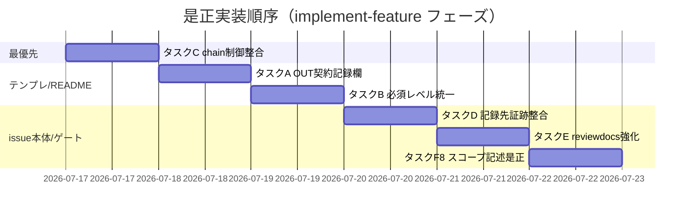

# 実装計画書: PR#128 指摘対応（是正実装）

**プロジェクト名**: PR#128 指摘対応（是正実装）
**作成日**: 2026 年 07 月 17 日
**最終更新**: 2026 年 07 月 17 日

> **重要**: **このドキュメントは常に更新**: 実装計画の変更・進捗・バグ記録があれば即座に更新する。
> **必須項目**: 「必須」欄は空欄・抽象語のみで提出しない。テスト観点・BDD は具体ケースを 1 件以上記載する。
>
> **スコープ注記**: 本 03 は「どのファイルをどう変更するか」の**計画**であり、実ファイルの改修（実装）は後続 implement-feature フェーズで行う。本フェーズでは行わない。
>
> **用語**: [.agent-skill-chain/source/CONCEPTS.md §用語規約](../../../../../.agent-skill-chain/source/CONCEPTS.md#用語規約) を参照。

---

## 1. 実装概要

### 1.1 実装方針（必須）

[02_設計.md](./02_設計.md) の決定（5 グループ＋独立 finding-8 の記述整合を、既存 CORE 制御ファイルを含む対象ファイルへ最小 diff で反映。ADR-1〜4）に従い、**1 ファイル 1 責務・最小 diff・後方互換・新規 command/audit/skill 追加禁止**でドキュメント・テンプレート・command 定義を修正する。挙動が実際に変わるのはグループ C（`experience_surface: null` 時の chain 起動）のみで、他は表記・記録項目・確認観点の整合である。グループ C・E は CORE 中核制御ファイル（`design-feature.md`・`review-docs.md`）改修のため「既存 chain/ゲートを壊さない」ことを最優先の検証観点とする。

### 1.2 実装順序（必須: 1 件以上）

グループ間に依存は無いが、最優先・高リスクの**グループ C を先頭**に置く。同一ファイルを触るグループ（A/B が `runtime/templates/02_設計.md`、C/D/E が本体 `02_設計.md`）は別行・別節のため並行可だが、diff 衝突回避のためファイル単位で順に適用する。



---

## 2. タスク分解

**必須**: 各タスクに「テスト観点」（2.x.3）と「単体テスト仕様（BDD）」（2.x.4）を記載する。本件はコードを持たない静的変更のため、単体＝**静的照合（grep/Read による before→after 確認・既存構造の非破壊確認）**を単体相当とする。

### 2.1 タスク C: design-feature chain の INPUT/PROCESS 制御フロー整合（最優先・chain 中核）

#### 2.1.1 概要（必須）

`experience_surface: null` 時に frame-experience（0a）が起動しない矛盾を解消するため、4 箇所の条件表現を「`null`（未記入）または `yes:` で 0a 実行、0a 判定で 0b/0c 要否決定、`no:` はスキップ」へ揃える（02 §3.3・§5.2-C・ADR-1）。

#### 2.1.2 実装内容（必須: 1 件以上）

- `.agent-skill-chain/source/commands/design-feature.md` PROCESS L31/33/35 を §5.2-C-1 の after へ書き換え、PROCESS 直下（L44 付近）に「未記入時も 0a を起動し frame-experience が判定」の 1 文を追記。INPUT L25 は変更しない。
- `.agent-skill-chain/source/workflow/SKILL_MANDATORY.md` L13 の条件付き必須列を §5.2-C-2 の after へ。
- `.agent-skill-chain/source/workflow/TEMPLATES.md` L27 capability 列を §5.2-C-3 の after へ。
- 本体 `docs/maintainer/workflow/20260717_071859_デザイナー視点組込/02_設計.md` §3.2.2 code fence（L317-324）を §5.2-C-4 の after へ。
- **不変**: `run_command.md`・`CLOSEOUT.md`、既存 step1-3 の順序・内容、委譲粒度（ADR-7）、DONE の「あり/なし」2 分岐の意味。

#### 2.1.3 テスト観点（必須）

##### 単体（静的照合・必須 1 件以上）

- 正常系: `design-feature.md` PROCESS に「`null`（未記入）または `"yes: ..."`」「0a の判定結果=あり」「`"no: ..."` はスキップ」の 3 条件が現れる。
- 正常系: SKILL_MANDATORY.md L13・TEMPLATES.md L27・本体 02 §3.2.2 の 3 箇所が design-feature.md と同じ条件表現に揃う。
- 境界: INPUT L25「未記入時は frame-experience が判定」が保持され、PROCESS と矛盾しない。
- 異常系（非破壊）: `git diff` で `run_command.md`・`CLOSEOUT.md` に差分が無い。PROCESS の step1-3 の順序・番号が不変。DONE の「あり/なし」2 分岐が不変。

##### 結合/API（chain 構造照合・該当時必須）

- design-feature.md の PROCESS 見出し（0a/0b/0c/1/2/3）の構造・入出力の受け渡し節（frame OUT→map IN 等）が改修後も維持されている。

##### E2E/受け入れ

- `experience_surface: null` の issue を design-feature で実行する読み手が、条件文から「0a を起動する」と一義に読める（文言の一義性確認。静的レビュー）。

##### バリデーション

- 既に `"yes:"`／`"no:"` が明記された issue の記述上の挙動が改修前後で変わらない。

#### 2.1.4 単体テスト仕様（BDD）（必須）

```gherkin
Feature: design-feature chain の INPUT/PROCESS 整合
  Scenario: experience_surface が未記入でも 0a が起動する条件表現
    Given design-feature.md の PROCESS 0a 条件が「null（未記入）または yes」へ是正されている
    When PROCESS・SKILL_MANDATORY.md L13・TEMPLATES.md L27・本体 02 §3.2.2 を照合する
    Then 4 箇所とも同じ条件表現に揃っている
    And run_command.md・CLOSEOUT.md・step1-3 の順序は不変である

  Scenario: 明示的な no は既存どおりスキップする
    Given experience_surface が "no: <理由>" である
    When 是正後の PROCESS 条件を適用する
    Then 0a〜0c はスキップされ「トリガー非該当は正常系」の扱いが変わらない
```

**静的照合コマンド例（Given/When/Then をコメントで明記）**

```bash
# Given: design-feature.md が是正済み
# When: 4 箇所の条件表現と非破壊対象を照合する
grep -n 'null（未記入）または' .agent-skill-chain/source/commands/design-feature.md .agent-skill-chain/source/workflow/SKILL_MANDATORY.md .agent-skill-chain/source/workflow/TEMPLATES.md docs/maintainer/workflow/20260717_071859_デザイナー視点組込/02_設計.md
git diff --stat -- .agent-skill-chain/source/commands/run_command.md .agent-skill-chain/source/CLOSEOUT.md
# Then: 4 箇所ヒット・run_command/CLOSEOUT 差分 0
```

#### 2.1.5 依存関係

- 独立。他タスクに先行して実施する（最優先）。

#### 2.1.6 見積もり

- **工数**: 小（4 箇所の文言修正）。 **優先度**: 高。

### 2.2 タスク A: detail-experience OUT 契約への実装可能性・検証改善欄追加

#### 2.2.1 概要（必須）

手順6 の結果が成果物に残るよう、`runtime/templates/02_設計.md` §7.3 と `detail-experience/README.md` OUT に記録項目を追加する（02 §3.1・§5.2-A）。

#### 2.2.2 実装内容（必須: 1 件以上）

- `.agent-skill-chain/runtime/templates/02_設計.md` §7.3 に「実装可能性・検証改善観点の確認結果」項目を 1 つ追加（§5.2-A-1）。
- `.agent-skill-chain/source/skills/experience/detail-experience/README.md` L74 OUT の列挙へ同項目を追加（§5.2-A-2）。
- **不変**: §7.3 の他項目・README の他節・`detail-experience/SKILL.md`（finding-5 スコープ外）。

#### 2.2.3 テスト観点（必須）

##### 単体（静的照合・必須 1 件以上）

- 正常系: §7.3 と README OUT の双方に「実装可能性・検証改善観点の確認結果」が存在する。
- 正常系: 追加文言が手順6（`実装可能性・検証改善観点（…矛盾の有無、どう計測・改善するか）を確認する`）と概念的に一致し、新観点を持ち込まない。
- 異常系（非破壊）: §7.3 既存項目（探索一覧・正当化根拠・却下案・責務/API 候補）が削除されていない。SKILL.md に差分が無い。

##### 結合/API

- 該当なし。

##### E2E/受け入れ

- detail-experience 実行者が手順6 の結果をどこに書くか §7.3/OUT から一義に判断できる。

##### バリデーション

- 該当なし。

#### 2.2.4 単体テスト仕様（BDD）（必須）

```gherkin
Feature: detail-experience の OUT 契約整備
  Scenario: 02 テンプレ §7.3 と README OUT に実装可能性・検証改善欄がある
    Given README 手順6 が実装可能性・検証改善観点の確認を要求している
    When 02_設計.md テンプレ §7.3 と detail-experience/README.md OUT を確認する
    Then 双方に「実装可能性・検証改善観点の確認結果」が記録対象として存在する
    And §7.3 の既存項目は削除されていない
```

```bash
# Given: タスクA 是正済み  When: 両ファイルを照合  Then: 双方にヒット
grep -c '実装可能性・検証改善観点の確認結果' .agent-skill-chain/runtime/templates/02_設計.md .agent-skill-chain/source/skills/experience/detail-experience/README.md
```

#### 2.2.5 依存関係 / 2.2.6 見積もり

- 独立。 工数: 小。 優先度: 中。

### 2.3 タスク B: 新規 UI 作成条件の必須レベル統一

#### 2.3.1 概要（必須）

必須レベル表現を 3 ファイルで「満たす場合に限る」（必須・ADR-2）へ統一する。誤帰属を踏まえ SKILL.md へは追記しない（02 §3.2・§5.2-B）。

#### 2.3.2 実装内容（必須: 1 件以上）

- `.agent-skill-chain/source/skills/experience/detail-experience/README.md` L21・L38 を必須表現へ（§5.2-B-1）。
- `.agent-skill-chain/runtime/templates/02_設計.md` §7.3 L305 を必須表現へ（§5.2-B-2）。
- `.agent-skill-chain/source/skills/experience/README.md` L42 は既に必須表現のため用語一致確認のみ。
- **不変**: 条件 6 項目の内容、`detail-experience/SKILL.md`。

#### 2.3.3 テスト観点（必須）

##### 単体（静的照合・必須 1 件以上）

- 正常系: 3 ファイルの必須レベル表現が「満たす場合に限る」相当で一致する。
- 異常系（非破壊）: `detail-experience/SKILL.md` に差分が無い（誤帰属回避）。条件 6 項目の文言が不変。

##### 結合/API・E2E・バリデーション: 該当なし（静的照合で担保）。

#### 2.3.4 単体テスト仕様（BDD）（必須）

```gherkin
Feature: 新規UI作成条件の必須レベル統一
  Scenario: 3 ファイルの必須レベルが一致し SKILL.md へ誤追記しない
    Given detail-experience/README が「望ましい」、experience/README が「満たす場合に限る」、02テンプレが曖昧である
    When 3 ファイルを是正後に確認する
    Then 3 ファイルの必須レベルが「満たす場合に限る」で一致する
    And detail-experience/SKILL.md には「望ましい」表記が新規追加されていない
```

```bash
# When: SKILL.md 非改変を確認  Then: 差分 0
git diff --stat -- .agent-skill-chain/source/skills/experience/detail-experience/SKILL.md
```

#### 2.3.5 依存関係 / 2.3.6 見積もり

- タスク A と同一ファイル（`runtime/templates/02_設計.md`）を触るため A の後に適用。 工数: 小。 優先度: 中。

### 2.4 タスク D: 記録先記述と 04_review 証跡の整合

#### 2.4.1 概要（必須）

本体 02 契約1 を「幻覚ペルソナ注意は共通 §7.4」へ揃え、04_review 指摘1 の対応済み根拠 commit のレビュー範囲外である旨を補記する（02 §3.4・§5.2-D）。

#### 2.4.2 実装内容（必須: 1 件以上）

- 本体 `02_設計.md` 契約1 Outputs（L380）・Process (5)（L379）を §5.2-D-1 の after へ。
- 本体 `04_review.md` 指摘1 対応済み（L115）へ commit 範囲外注記を追記（§5.2-D-2）。
- **不変**: 契約2/3・02 内他契約・04 の他証跡（commit 列 L25/L33/L222/L253）。

#### 2.4.3 テスト観点（必須）

##### 単体（静的照合・必須 1 件以上）

- 正常系: 契約1 Outputs から「注意書き」が §7.4 記録の記述へ置換され、実装（`2f81938`）・04_review 指摘1 の §7.4 寄せ記述と整合する。
- 正常系: 04_review 指摘1 に `bab69a2..0032ade` 外である旨の注記が存在する。
- 異常系（非破壊）: 契約2/3 の Outputs/Process に差分が無い。

##### 結合/API・E2E・バリデーション: 該当なし。

#### 2.4.4 単体テスト仕様（BDD）（必須）

```gherkin
Feature: 記録先記述と 04_review 証跡の整合
  Scenario: 契約1 が §7.4 寄せに揃い 04_review に範囲外注記がある
    Given 実装（commit 2f81938）は幻覚ペルソナ注意を §7.4 に記録すると確定している
    When 本体 02 契約1 と 04_review 指摘1 を確認する
    Then 契約1 Outputs は §7.1（前提のみ）＋幻覚ペルソナ注意は §7.4 と記述されている
    And 04_review 指摘1 に commit 2f81938 が bab69a2..0032ade 外である旨の注記がある
```

#### 2.4.5 依存関係 / 2.4.6 見積もり

- タスク C・E と同一ファイル（本体 02）だが別節。C の後に適用。 工数: 小。 優先度: 中。

### 2.5 タスク E: review-docs ゲートの体験観点強化

#### 2.5.1 概要（必須）

`review-docs.md` の体験観点確認を §7.1/§7.2/§7.3 各フェーズ必須項目の個別充足へ強化し、本体 02 §3.3 も揃える（02 §3.5・§5.2-E・ADR-3）。

#### 2.5.2 実装内容（必須: 1 件以上）

- `.agent-skill-chain/source/commands/review-docs.md` L27 を §5.2-E-1 の after へ（§7.1/§7.2/§7.3 の必須項目を個別列挙）。
- 本体 `02_設計.md` §3.3 の review-docs 記述（L349）を §5.2-E-2 の内容へ。
- **不変**: 体験面=なしの差し戻し扱い・§7.0 記述・DUAL_LENS 他観点・memo/書記委譲。

#### 2.5.3 テスト観点（必須）

##### 単体（静的照合・必須 1 件以上）

- 正常系: review-docs.md L27 に §7.1/§7.2/§7.3 各フェーズの必須項目が個別確認観点として列挙され、「§7 存在だけでは通過させない」旨がある。
- 正常系: 本体 02 §3.3 が同じ強化後の観点に揃う。
- 異常系（非破壊）: 体験面=なしを差し戻さない記述・§7.0 判定記録の扱いが保持される。DUAL_LENS の敵対的観点・must-preserve の記述に差分が無い。

##### 結合/API（ゲート構造照合）

- review-docs.md の Process 1.1 内の位置（DUAL_LENS 相乗り）を保ったまま観点のみ精緻化されている。

##### E2E・バリデーション: 該当なし。

#### 2.5.4 単体テスト仕様（BDD）（必須）

```gherkin
Feature: review-docs ゲートの体験観点強化
  Scenario: 各フェーズの必須項目個別充足を確認観点に持つ
    Given review-docs.md の体験観点確認は「§7 記載の有無」にとどまっている
    When review-docs.md L27 と 本体 02 §3.3 を是正後に確認する
    Then §7.1・§7.2・§7.3 それぞれの必須項目の個別充足が確認観点として明記される
    And 体験面=なしを差し戻さない既存の扱いは変更されていない
```

#### 2.5.5 依存関係 / 2.5.6 見積もり

- 独立（本体 02 §3.3 は D と別節）。 工数: 小。 優先度: 中。

### 2.6 タスク F8: 変更対象スコープ記述の是正（finding-8）

#### 2.6.1 概要（必須）

「変更対象は `source/`」限定記述を実態（`source/` ＋ `runtime/templates/`）へ一致させる（02 §3.6・§5.2-F・ADR-4）。

#### 2.6.2 実装内容（必須: 1 件以上）

- 02 §3.6.2 の表に列挙した各箇所（本体 00 L91/L161/L191、01 L94/L196/L237、03 L51 見出し）へ `runtime/templates/` を反映。
- **不変**: CORE の概念定義（事実記述）・制約趣旨（project 限定でない）・03 L446（既に整合）。

#### 2.6.3 テスト観点（必須）

##### 単体（静的照合・必須 1 件以上）

- 正常系: §3.6.2 の列挙各箇所のスコープ記述に `.agent-skill-chain/runtime/templates/` が含まれる。
- 正常系: 03 L51 見出しが「`source/` および `runtime/templates/` 配下」となり、表項目 10-11（runtime/templates）と整合する。
- 異常系（非破壊）: CORE 概念定義（01 L22/L29/L89 等）は不変。制約の趣旨（全消費者へ届く）が保持される。

##### 結合/API・E2E・バリデーション: 該当なし。

#### 2.6.4 単体テスト仕様（BDD）（必須）

```gherkin
Feature: 変更対象スコープ記述の是正
  Scenario: スコープ記述に runtime/templates が含まれる
    Given 実際の変更範囲は source/ と runtime/templates/ の両方である
    When 00 §4.1 ほか列挙箇所と 03 L51 見出しを是正後に確認する
    Then スコープ記述に runtime/templates/ が含まれる
    And CORE 概念定義（事実記述）と制約趣旨は維持されている
```

#### 2.6.5 依存関係 / 2.6.6 見積もり

- 独立。最後に実施。 工数: 小。 優先度: 中。

---

## テスト観点

全タスク共通で「コード無・静的変更」のため**静的照合（before→after 文言確認・既存構造の非破壊確認）を単体相当**とする。グループ C・E は CORE 中核制御ファイル改修のため「既存 chain/ゲートを壊さない（`run_command.md`/`CLOSEOUT.md` 無変更・step1-3 順序保持・DUAL_LENS 他観点保持・体験面=なしの扱い保持）」を最重要検証観点とする。各タスクの §2.x.3 に具体ケースを記載済み。

---

## 単体テスト

実行可能な単体テストは存在しない（ドキュメント・command 定義の静的変更）。各タスクの §2.x.4 の BDD＋grep/`git diff` による静的照合で代替し、非破壊対象は `git diff --stat` で差分 0 を確認する。

---

## BDD

各タスク §2.x.4 に Given/When/Then を記載（TEST_BDD_FORMAT 準拠）。最重要はタスク C の 2 シナリオ（未記入時 0a 起動・no スキップ）と非破壊照合。

---

## 3. 実装スケジュール

### 3.1 マイルストーン

| マイルストーン | 期日 | 成果物 |
| -------------- | ---- | ------ |
| M1: グループ C 整合完了 | implement-feature 内 | design-feature.md 他 4 箇所の条件表現一致 |
| M2: A/B（テンプレ・README）完了 | 同 | §7.3・README OUT・必須レベル統一 |
| M3: D/E/F8 完了 | 同 | 本体 02/04 整合・review-docs 強化・スコープ記述是正 |

### 3.2 実装フェーズ

#### フェーズ 1: 是正実装（implement-feature）

- **タスク**: C → A → B → D → E → F8。
- 実装後、review-docs（実装前ドキュメントレビュー済みの本 02/03 とは別に、是正実ファイル群は verify-and-close で静的レビュー）→ verify-and-close で `git diff` 全対象照合・非破壊確認。

---

## 4. テスト計画

### 4.1 テストの優先順位

- **最優先**: グループ C・E（CORE 中核制御ファイル）。既存 chain/ゲートの非破壊を回帰確認に必ず含める（`run_command.md`/`CLOSEOUT.md` 差分 0・step1-3 順序・DUAL_LENS 他観点）。
- 同一ファイル複数タスク（`runtime/templates/02_設計.md`＝A/B、本体 02＝C/D/E）は最終 diff で全体整合を確認。

---

## 5. リスク管理

### 5.1 実装リスク

- **リスク**: グループ C の条件文変更が既存 chain の 0b/0c 発動条件を意図せず変える。
  - **対策**: 「0b/0c は 0a の判定結果に従う」既存設計を保持し、条件文の対象を「あり」→「null/yes」に広げるのみに限定。DONE 2 分岐・step1-3 を差分対象外とし `git diff` で確認。
- **リスク**: グループ B で誤帰属どおり `SKILL.md` を誤修正する。
  - **対策**: 対象を README.md と明示。SKILL.md の `git diff --stat` 差分 0 を検証観点化。
- **リスク**: finding-8 で CORE 概念定義（正しい事実記述）まで書き換える過剰修正。
  - **対策**: 02 §3.6.2 の enumerated 表を正本とし、「変更対象スコープ」記述のみを対象・概念定義は不変と明記。

---

## 6. 参考資料

### プロジェクトドキュメント

- [`02_設計.md`](./02_設計.md) - 設計（ADR-1〜4・§3 機能設計・§5 契約変更が本 03 の土台）
- [`01_要件定義.md`](./01_要件定義.md) - 要件定義
- [`00_要求定義.md`](./00_要求定義.md) - 要求定義（トリアージ）

### その他の参考資料

- PR: https://github.com/techbeansjp-free/AGENTS.md/pull/128
- [`.agent-skill-chain/source/EVIDENCE_POLICY.md`](../../../../../.agent-skill-chain/source/EVIDENCE_POLICY.md)（ADR 形式）
- [`.agent-skill-chain/source/TEST_BDD_FORMAT.md`](../../../../../.agent-skill-chain/source/TEST_BDD_FORMAT.md)

---

## 7. 前のステップ

- **前**: [`02_設計.md`](./02_設計.md) - 設計フェーズ

---

## 8. 次のステップ

- **次**: 実装フェーズ（implement-feature）。本サブ issue は 1 issue 内で完結するため 90_issues.md への再分割は行わない。implement-feature 着手前に review-docs（full/standard 必須）を経る。
</content>
