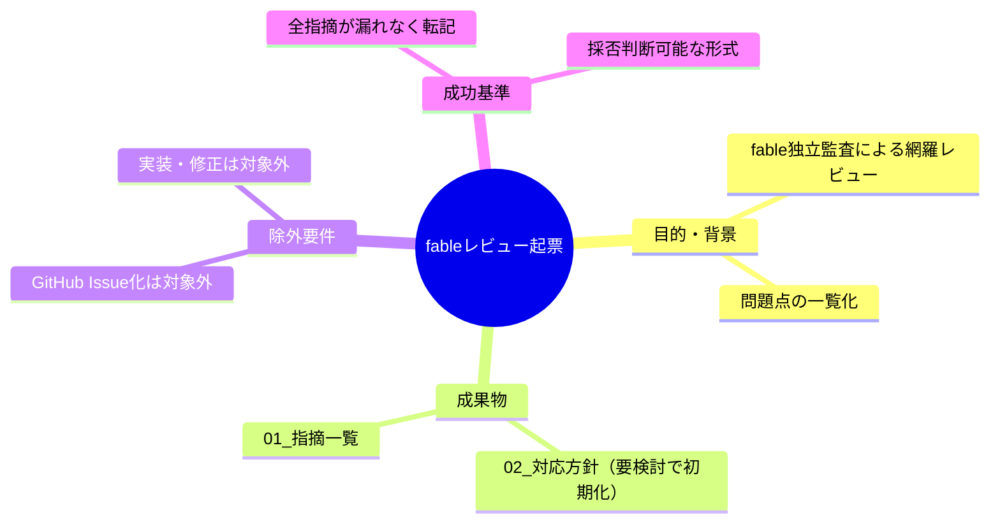
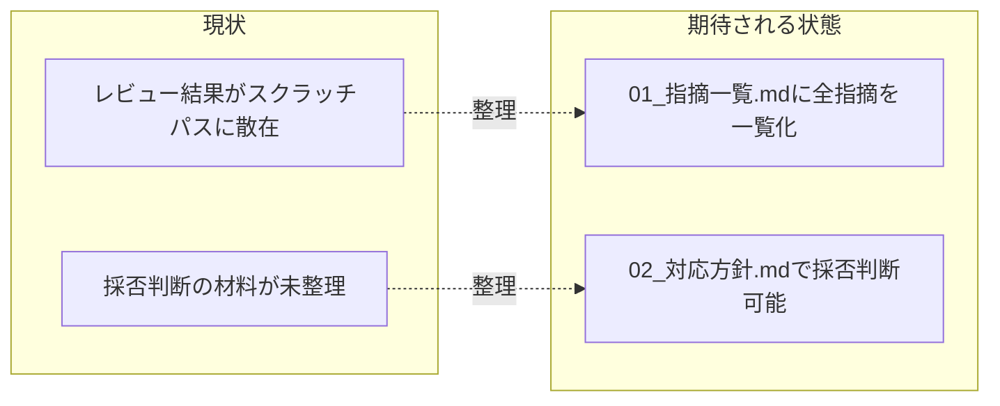

# 要求定義書: .agent-skill-chainフレームワーク fableによる徹底レビューと問題点の起票

**プロジェクト名**: .agent-skill-chainフレームワーク fableによる徹底レビューと問題点の起票
**作成日**: 2026年07月18日
**最終更新**: 2026年07月18日

> **重要**:
>
> - 要求定義書は、プロジェクトの全体像を把握するためのものです。詳細な技術仕様や実装方法は要件定義書以降で記載します。必要最低限の情報に収めることを心掛けてください。
> - **このドキュメントは常に更新**: 要求の変更や追加があった場合は、即座にこのドキュメントを更新してください。
> - **必須項目**: 以下の「必須」と明記した項目は空欄・抽象語のみで提出しないこと。

---

## 要求定義の全体像

**注意**: 本タスクは「調査・一覧化」であり実装ではないため、機能要件・非機能要件・制約条件などのセクションは該当が薄い部分がある。該当が薄い項目は「該当なし」「本タスクの対象外」と明記する。

---

## 1. 目的・背景

### 1.1 目的（必須）

.agent-skill-chainフレームワークの設計・実装をfableによる独立監査で徹底レビューし、問題点を一覧化してユーザーの採否判断に供する

### 1.2 背景

- **現状の課題**:
  - `.agent-skill-chain` フレームワークは起動契約・行動規範・コマンド/ワークフロー・enforcement機構・台帳/仕様・運用スクリプト・プロジェクト固有上書き・自己拡張ワークフローという広範な領域を持つが、これまで領域横断的な独立監査は行われていなかった。
  - フレームワーク自身の記述（矛盾・重複・機械強制の実効性欠如など）に問題が蓄積している可能性があるが、体系的に洗い出されたことがない。

- **必要性**:
  - fableモデルによる独立監査役としての客観的レビューを、7つの領域（A〜G）に分けて実施し、指摘を1件も漏らさず記録する必要がある。
  - ユーザーが後日、各指摘の採用/見送り/要検討を判断し、採用されたものについてのみ GitHub Issue 化を進める運用にするため、判断材料をローカルに整理する必要がある。

### 1.3 期待される効果（必須: 1 件以上）

- **効果 1**: fableレビューで検出された全指摘（約112件）が `01_指摘一覧.md` に領域別・深刻度別に整理され、ユーザーが一覧性を持って参照できる状態になる。
- **効果 2**: `02_対応方針.md` により、各指摘についてユーザーが「採用/見送り/要検討」の三択で対応方針を確定できる下地が整う。

**現状と期待される状態の比較**:

---

## 2. 機能要件

### 2.1 既存機能の維持（該当する場合）

該当なし（本タスクはドキュメント作成のみで、既存の実装・スクリプト・規約ファイルへの変更は行わない）

### 2.2 新規機能要件

- `01_指摘一覧.md`: fableレビュー生データ（`fable_review_raw.md`）に含まれる全指摘（7領域・約112件）を、要約・間引きせず、深刻度・対象ファイル・問題・失敗シナリオ・改善案の情報を保持したまま転記する。
- `02_対応方針.md`: 全指摘IDに対する対応方針（初期値はすべて「要検討」）の一覧表と、high深刻度指摘の参考リストを作成する。

---

## 3. 非機能要件

### 3.1 パフォーマンス

本タスクの対象外（ドキュメント作成のみで実行時性能に影響しない）

### 3.2 セキュリティ

本タスクの対象外

### 3.3 互換性

本タスクの対象外

### 3.4 保守性

- `01_指摘一覧.md` は生データの指摘ID（領域プレフィックス＋連番、例: A-1, G-12）を一意キーとして保持し、`02_対応方針.md` から参照できるようにする。

---

## 4. 制約条件

### 4.1 技術的制約

- 作業は worktree（`chore/20260718_025331-fableシステムレビュー`）内で行い、メインの作業ツリーを直接変更しない。
- 本タスクの成果物は GitHub Issue 起票の対象外であり、push・PR作成は行わない（ユーザーがまだ採否を決めていないため）。

### 4.2 既存システムとの互換性

該当なし

### 4.3 移行期間・スケジュール

該当なし（単発の一覧化作業）

---

## 5. 除外要件

- GitHub Issue の起票そのものは本タスクの対象外（ユーザーが `02_対応方針.md` で方針を確定させた後、別途進行役が判断する）。
- フレームワーク本体（規約ファイル・スクリプト等）の修正・実装は本タスクの対象外。

---

## 6. 成功基準（必須: 1 件以上）

- fableレビューで検出された全指摘（7領域・約112件）が `01_指摘一覧.md` に1件も欠落なく記載されている。
- 各指摘についてユーザーが `02_対応方針.md` で採用/見送り/要検討を判断できる一覧表形式になっている。
- `02_対応方針.md` の方針列が、進行役の独断で採用/見送りを決めず、全件「要検討」で初期化されている。
- worktree 内で3ファイルが commit されている（push・PRは作成しない）。

---

## 7. リスクと対策

### 7.1 技術的リスク

- **リスク**: 生データが長大（約795行）であるため、転記時に指摘の一部が抜け落ちる可能性がある。
  - **対策**: 領域ごとの件数・深刻度別件数をサマリー表で機械的に突合し、01の記載件数と一致することを確認する。

### 7.2 スケジュールリスク

- **リスク**: 該当なし（単発タスクでスケジュール上の依存はない）
  - **対策**: 該当なし

---

## 8. 参考資料

### プロジェクトドキュメント

- fableレビュー生データ（112件）の全文転記先: [`01_指摘一覧.md`](./01_指摘一覧.md)
- 本 issue の成果物: [`01_指摘一覧.md`](./01_指摘一覧.md)、[`02_対応方針.md`](./02_対応方針.md)

### その他の参考資料

- `.agent-skill-chain/project/自己拡張ワークフロー.md`（issue作成場所の上書き定義）

---

## 9. 次のステップ

この要求定義書の作成後、以下のドキュメントを作成します：

- **次**: [`01_指摘一覧.md`](./01_指摘一覧.md) - fableレビュー全指摘の一覧化
- **その次**: [`02_対応方針.md`](./02_対応方針.md) - 各指摘の対応方針（要検討で初期化）
