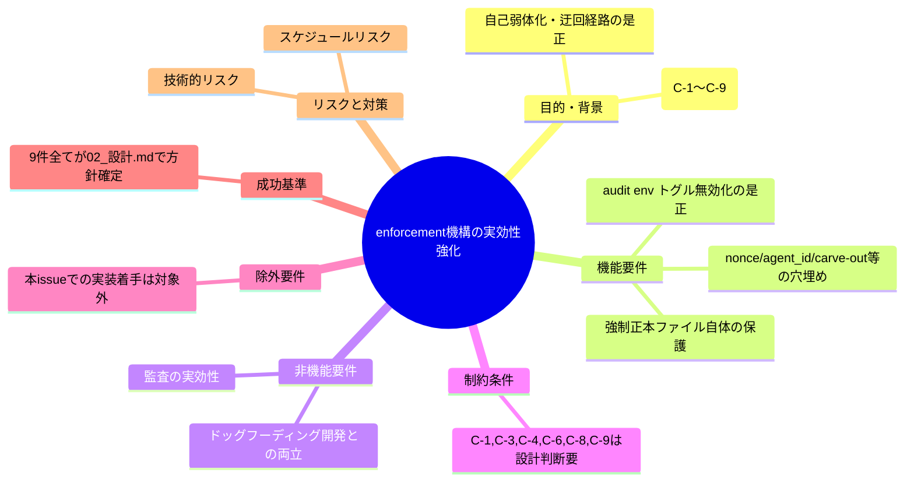
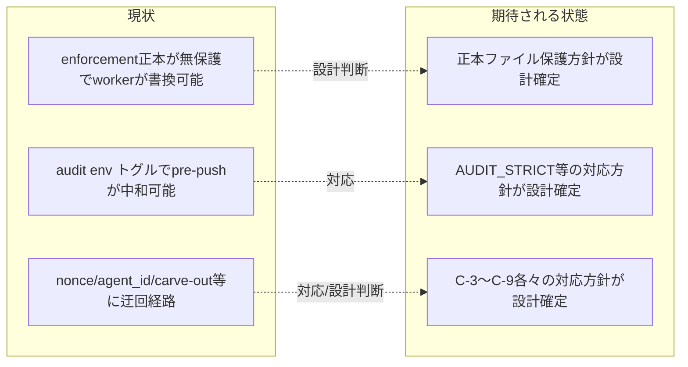

# 要求定義書: .agent-skill-chain: enforcement機構の実効性強化

**プロジェクト名**: .agent-skill-chain: enforcement機構の実効性強化
**作成日**: 2026年07月18日
**最終更新**: 2026年07月18日

> **重要**:
>
> - 要求定義書は、プロジェクトの全体像を把握するためのものです。詳細な技術仕様や実装方法は要件定義書以降で記載します。必要最低限の情報に収めることを心掛けてください。
> - **このドキュメントは常に更新**: 要求の変更や追加があった場合は、即座にこのドキュメントを更新してください。ドキュメントは「生きているドキュメント」として扱い、実装内容と常に同期させます。
> - **必須項目**: 以下の「必須」と明記した項目は空欄・抽象語のみ（例: 「{説明}」のまま）で提出しないこと。判定可能な形（目的は1文・成功基準は○/×で判定できる記載等）で記入すること。

---

## 要求定義の全体像

**注意**:

- 本ドキュメントは、fableによる `.agent-skill-chain` フレームワーク徹底レビュー（親issue: `../../00_要求定義.md`）で検出された領域C（enforcement機構）の指摘 C-1〜C-9（全9件）に対応するためのサブissueである。
- 対応方針の確定（02_設計.md）までを本issueのスコープとし、実装は方針確定後に着手する。

---

## 1. 目的・背景

### 1.1 目的（必須）

enforcement機構の自己弱体化・迂回経路を是正し、強制の実効性を高める

### 1.2 背景

fableによる独立監査（`../../01_指摘一覧.md` 領域C）およびユーザーの対応方針判定（`../../02_対応方針.md`）により、enforcement機構（hook・audit・強制正本ファイル群）自体に、AIエージェントが自らへの制約を弱体化・迂回できる経路が複数指摘された。対象指摘は以下の9件。

| ID | 深刻度 | 方針 | 要点（1行要約） |
| --- | --- | --- | --- |
| C-1 | high | 採用（要設計判断） | enforcement正本（source/enforcement/*, orchestrator-allowlist.txt, settings.enforce.json）自体がどのhook/auditでも保護されておらず、worker（IS_SUBAGENT=1）が自由に書き換え可能。全ROLE blockは本リポ自身のドッグフーディング開発（workerがenforcementを編集する正規作業）と衝突するため、消費者配備とフレームワーク開発を区別する設計判断が必要。 |
| C-2 | high | 採用 | audit の各ゲートが `*_GATE_ENABLED=false` 等のenv トグルで個別無効化でき、ローカル pre-push（唯一の実効的検知経路）と同一シェル環境のため直前exportで空振りPASSにできる。AUDIT_STRICT導入等、改善方向は明快。 |
| C-3 | medium | 採用（要設計判断） | scribe nonce は同一UIDのworkerに対し実質無防備（0600ファイルでも同一ユーザーは読める）で、証跡偽造によりaudit #12/#13/#25 を空振りさせられる。署名付きNDJSON等への格上げは大きな設計判断を要する。 |
| C-4 | medium | 採用（要設計判断） | DESIGN/README が「物理強制」と表で謳う項目（フェーズ飛ばしWrite拒否・書記未実行の次Task拒否）に対応する hook が実在しない。表現を実態に合わせて格下げするか、hookを新規実装するかの選択が必要。 |
| C-5 | medium | 採用 | jq 非搭載環境で agent_id 抽出が stdin 全体走査になりトップレベル限定を保証できず、main セッションが誤って IS_SUBAGENT=1 と判定されうる。fallbackのトップレベル限定化・jq必須化など修正方向は明快。 |
| C-6 | medium | 採用（要設計判断） | worker は Bash 無条件許可・sqlite3 直接実行（`bash -c` 迂回）検知外・R9（worktree記録漏れ検知）バイパス env が広く通る。いずれも設計上意図的な逃げ道であり、追加ハードニングの費用対効果判断が必要。 |
| C-7 | low | 採用 | R1 templates carve-out が未アンカー正規表現かつ realpath 正規化前の文字列一致で判定されており、`..` を含むパストラバーサルでcarve-out扱いにできる構造的欠陥。realpath正規化後判定への修正は安価かつ副作用なし。 |
| C-8 | low | 採用（要設計判断） | check_25（メイン直接作業検知）の許容窓48hと件数フォールバックが緩く、変更ファイル・issueとの対応を問わないため検出力が低い。許容窓は意図的選択済みであり、突合強化の要否は設計判断が必要。 |
| C-9 | low | 採用（要設計判断） | audit.sh 全体が `set -e` で走り、いずれかの check が想定外の非0終了をすると以降のcheckが一切実行されない構造的懸念。優先度（`set +e` + EXIT_CODE集約への切替）は設計判断が必要。 |

**総括（領域Cより）**: runtime 層の worktree 命名・R1〜R6・nonce・agent_id 分岐は個々には丁寧に作り込まれているが、「AI が自分への制約を弱める経路」という観点で致命的な穴が残る。強制の正本ファイル群自体がどの hook/audit でも保護されておらず worker が書き換え可能、唯一の実効検知経路とされるローカル pre-push audit が被監査側の env で中和でき、scribe nonce が同一ユーザーの AI に対して実質無防備なため DB 系監査全体が偽造で骨抜きにできる、という3点が中核的な弱点である。

- **現状の課題**:
  - enforcement機構の正本ファイル自体（PreToolUse.sh・audit.sh・PROTECTED_PATHS.txt・orchestrator-allowlist.txt等）がいずれのhook/audit保護対象にもなっておらず、worker が自由に書き換えて強制を無効化できる（C-1）。
  - audit の各種ゲートが環境変数トグルで無効化可能であり、pre-push（唯一のローカル実効検知経路）を被監査対象のAI自身が中和できる（C-2）。
  - scribe nonce・agent_id判定・carve-out判定・check_25検出力・audit.shのエラーハンドリングなど、細部の実装に複数の迂回・検出漏れ経路が存在する（C-3〜C-9）。

- **必要性**:
  - 6件（C-1,C-3,C-4,C-6,C-8,C-9）は「採用（要設計判断）」であり、対応方法に複数の選択肢とトレードオフ（ドッグフーディング開発との両立、防御強度と実装コスト、表現の格下げか実装追加か等）を伴うため、実装着手前に設計フェーズで具体的な対応方針を確定する必要がある。
  - 残る3件（C-2,C-5,C-7）は「採用」で改善方向が明快だが、いずれも同じenforcement機構内の変更であり、影響範囲の確認・整合を取るため同一設計フェーズで扱う。

### 1.3 期待される効果（必須: 1 件以上）

- **効果 1**: C-1〜C-9の9件それぞれについて、02_設計.mdで「対応する具体案（または見送りへの再判定）」が確定し、実装着手可能な状態になる。
- **効果 2**: 特に設計判断が必要な6件（C-1,C-3,C-4,C-6,C-8,C-9）について、トレードオフ（ドッグフーディング開発との両立・防御強度と実装コスト等）を明記した上で採用する具体的な対応方針が記録される。

**現状と期待される状態の比較**:

---

## 2. 機能要件

### 2.1 既存機能の維持（該当する場合）

enforcement機構の既存の検知項目（R1〜R9、audit.shの各checkシリーズ）の正常な検知機能は本issueの対応によって後退させない。

### 2.2 新規機能要件

- C-1: enforcement 正本ファイル群（`source/enforcement/*`, `project/orchestrator-allowlist.txt`, `settings.enforce.json` 等）に対する保護方針（block範囲・対象ROLE・監査項目追加）を設計で確定する。
- C-2: audit の env トグル無効化を無視して既定値を強制する `AUDIT_STRICT` 相当のモード、または無効化トグル使用の事実を監査結果に残す方式を設計で確定する。
- C-3: scribe nonce の同一UID脆弱性への対応（nonce方式の強化、または外部append-only証跡への格上げ方針）を設計で確定する。
- C-4: DESIGN/README の「物理強制」表記と実装の乖離について、表記格下げまたはhook新規実装のいずれを取るかを設計で確定する。
- C-5: jq 非搭載環境の agent_id フォールバック抽出をトップレベル限定にする、または jq 必須化して不在時は IS_SUBAGENT=0 に固定する対応を設計で確定する。
- C-6: worker経路のsqlite3 `bash -c` 迂回検知・R9バイパス使用時の痕跡記録について、対応要否と方式を設計で確定する。
- C-7: R1 templates carve-out の判定を realpath 正規化後のパスに対して行う、または `..` を含むパスを carve-out から除外する対応を設計で確定する。
- C-8: check_25 の変更ファイル・issueとの対応突合強化の要否と方式を設計で確定する。
- C-9: audit.sh 全体を `set +e` にして各 check の EXIT_CODE 集約に一本化する対応の要否と方式を設計で確定する。

---

## 3. 非機能要件

### 3.1 パフォーマンス

- hook（PreToolUse.sh/PostToolUse.sh）・pre-push audit の実行時間に著しい悪化を与えない。

### 3.2 セキュリティ

- 本issueの中心テーマそのものが「AIエージェントによる強制機構の自己弱体化・迂回の防止」であり、対応方針は防御強度を後退させない形で確定する。

### 3.3 互換性

- 本リポジトリ自身のドッグフーディング開発（worker が enforcement/ 配下を正規に編集する作業）を不可能にしない設計とする（特にC-1で考慮）。

### 3.4 保守性

- 対応方針は `enforcement/DESIGN.md`・`enforcement/README.md` の記述と実装（hook/audit）の一致を保つ形で確定する。

---

## 4. 制約条件

### 4.1 技術的制約

- 対象ファイル: `enforcement/DESIGN.md`, `enforcement/README.md`（該当箇所のみ）, `enforcement/ci/audit.sh`, `enforcement/claude/PreToolUse.sh`, `enforcement/claude/PostToolUse.sh`, `enforcement/lib/*.sh`, `PROTECTED_PATHS.txt`。
- C-1,C-3,C-4,C-6,C-8,C-9 の6件は「採用（要設計判断）」であり、02_設計.mdでトレードオフを明記した上で具体的対応方針を確定すること。

### 4.2 既存システムとの互換性

- 消費者への配布物としてのenforcement機構と、本リポジトリ自身のドッグフーディング開発（フレームワーク自体の改修作業）を区別する必要がある場合は、その区別方法を設計で明記する（C-1）。

### 4.3 移行期間・スケジュール

- 本issue（00_要求定義.md作成）は設計フェーズ着手の準備であり、実装は02_設計.md確定後に別途着手する。

---

## 5. 除外要件

- 本issueでの実装（コード変更・hook修正・audit.sh修正等）の着手は対象外。02_設計.mdでの対応方針確定までがスコープ。
- 領域C以外の指摘（領域A・B・D・E・F・G）への対応は対象外（別途進行役が判断・パッケージ分割する）。

---

## 6. 成功基準（必須: 1 件以上）

- 対象指摘9件（C-1〜C-9）それぞれについて、02_設計.mdで対応方針（具体的な実装方針、または見送りへの再判定とその理由）が確定していること。
- 「採用（要設計判断）」の6件（C-1,C-3,C-4,C-6,C-8,C-9）について、02_設計.mdにトレードオフの検討内容と選択理由が明記されていること。
- 03_実装計画.md作成時に、9件それぞれが対応するタスクに分解可能な粒度になっていること。

---

## 7. リスクと対策

### 7.1 技術的リスク

- **リスク**: C-1（enforcement正本の保護）の対応方針次第で、本リポジトリのドッグフーディング開発（workerがenforcement/を正規に編集する作業）が困難になる可能性がある。
  - **対策**: 02_設計.mdで、消費者配備時の保護と本リポジトリの開発作業を区別する方式（例: 環境変数や設定による切り替え、委譲・レビュー証跡要求への代替等）を検討する。

- **リスク**: C-2（AUDIT_STRICT等）の対応が既存のenv トグル運用（意図的な無効化ニーズ）と衝突する可能性がある。
  - **対策**: 02_設計.mdで、既存の正当なトグル利用ケースを洗い出し、無効化の事実を残す方式との使い分けを検討する。

### 7.2 スケジュールリスク

- **リスク**: 該当なし（本issueは設計判断の確定までがスコープであり、実装スケジュールへの依存はない）。
  - **対策**: 該当なし。

---

## 8. 参考資料

### プロジェクトドキュメント

- 親issue: [`../../00_要求定義.md`](../../00_要求定義.md)
- 全指摘一覧: [`../../01_指摘一覧.md`](../../01_指摘一覧.md)（該当箇所: 領域C, C-1〜C-9）
- 対応方針（採否判定）: [`../../02_対応方針.md`](../../02_対応方針.md)（該当箇所: 領域Cの表およびC-1〜C-9の理由・対応メモ）

### その他の参考資料

- `enforcement/DESIGN.md`, `enforcement/README.md`, `enforcement/ci/audit.sh`, `enforcement/claude/PreToolUse.sh`, `enforcement/claude/PostToolUse.sh`, `enforcement/lib/*.sh`, `PROTECTED_PATHS.txt`（本issueの対象ファイル）

---

## 9. 次のステップ

この要求定義書の承認後、以下のドキュメントを作成します：

- **次**: `01_要件定義.md` - 要件定義フェーズ（必要に応じて）
- **その次**: `02_設計.md` - C-1〜C-9それぞれの対応方針確定
