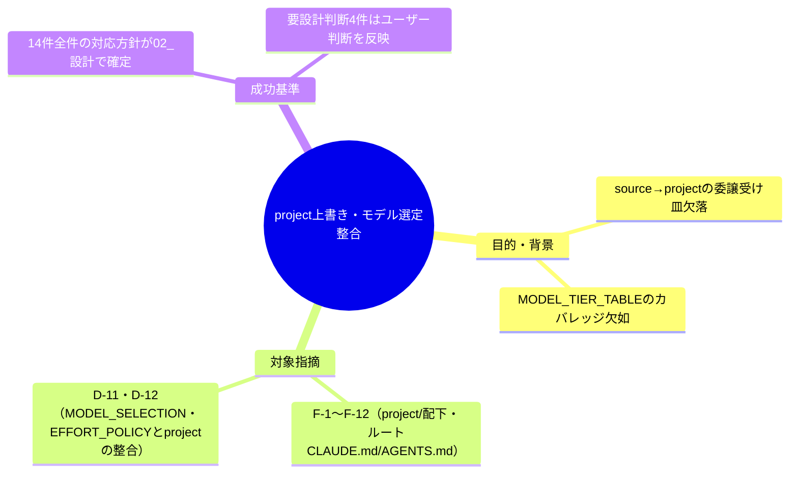

# 要求定義書: .agent-skill-chain: プロジェクト固有上書き・モデル選定方針の整合

**プロジェクト名**: .agent-skill-chain: プロジェクト固有上書き・モデル選定方針の整合
**作成日**: 2026年07月18日
**最終更新**: 2026年07月18日

> **重要**:
>
> - 要求定義書は、プロジェクトの全体像を把握するためのものです。詳細な技術仕様や実装方法は要件定義書以降で記載します。必要最低限の情報に収めることを心掛けてください。
> - **このドキュメントは常に更新**: 要求の変更や追加があった場合は、即座にこのドキュメントを更新してください。
> - **必須項目**: 以下の「必須」と明記した項目は空欄・抽象語のみで提出しないこと。

---

## 要求定義の全体像

**注意**: 本 issue は親 issue（fableレビュー起票）で「採用」「採用（要設計判断）」と判定された指摘のうち、プロジェクト固有上書きファイルとモデル選定方針に関わる 14 件を対応するための準備（サブ issue の 00 作成）である。設計・実装は別フェーズで行う。

---

## 1. 目的・背景

### 1.1 目的（必須）

project/ 配下の上書きファイルとモデル選定・ledger 記録方針の委譲欠落・カバレッジ欠如・記述不整合を是正する

### 1.2 背景

fableによる `.agent-skill-chain` フレームワークレビュー（[`../../01_指摘一覧.md`](../../01_指摘一覧.md)、[`../../02_対応方針.md`](../../02_対応方針.md)）で検出され、ユーザーが「採用」または「採用（要設計判断）」と判定した以下 14 件が対象。

- **現状の課題**:
  - `source/` は抽象原則を定め、具体値・委譲の受け皿は `project/` 側に置く設計だが、複数箇所で受け皿が未実装のまま残っており、非裁量の主張が実質空洞化している（MODEL_TIER_TABLE のカバレッジ欠落、降格・エスカレーション手続きの循環参照・未定義など）。
  - `MODEL_SELECTION.md`・`EFFORT_POLICY.md` が課すモデル選定・effort 明記の義務が、対応表未整備時のフォールバックや ledger 記録欄の欠如により、事後検証・遵守確認ができない状態にある。
  - `project/README.md`・`CLAUDE.md`・`AGENTS.md` に実在しないファイル名・ディレクトリ名を指す記述があり、読んだエージェントが誤った探索を行う恐れがある。

- **必要性**:
  - 進行役がモデルティア選定・委譲判断を行う際に「該当行が無い」「判定基準が無い」状態のまま裁量で処理すると、非裁量原則の建前と実運用が乖離し続ける。
  - fable例外条項など実運用と条文の乖離を放置すると、正当な利用（アドバイザー・監査役としての都度承認利用）が形式上違反と判定されるリスクがある。

**対象指摘一覧**（詳細は [`../../01_指摘一覧.md`](../../01_指摘一覧.md) 領域D・F を参照）:

| ID | 深刻度 | 対応方針 | 要約 |
|---|---|---|---|
| F-1 | high | 採用 | MODEL_TIER_TABLE の役割カバレッジに欠落（要求/要件執筆・issue起票・調査・choreの行が無い）があり、非裁量原則とデッドロックする |
| F-2 | high | 採用 | enforcement 配下の bash が COVERAGE_EXCEPTIONS の計測分母外なのに、台帳に除外行が無い（台帳なし除外） |
| F-3 | medium | 採用（要設計判断） | 「opus 要否先行判定」の判定基準（複雑さの定義・閾値）が未定義で、非裁量の主張が空洞 |
| F-4 | medium | 採用 | 降格（裁量下振れ）手続きが source↔project の循環参照になっており、手続きの実体がどこにも無い |
| F-5 | medium | 採用 | 未収束エスカレーションの具体段階・閾値が project 側（MODEL_TIER_TABLE）に未定義 |
| F-6 | medium | 採用 | grandfather ファイルが「凍結スナップショット」と「無期限 allowlist」を兼ね、追記に理由・承認・日付等のガバナンスが無い |
| F-7 | medium | 採用 | CLOSEOUT が project へ委譲する「継承物の受け渡し機構の具体」が project 側のどこにも定義されていない |
| F-8 | medium | 採用 | OPERATING_PRINCIPLES.md への到達経路が project/ ディレクトリ列挙頼みで、外部からの名指し参照がゼロ |
| F-9 | low | 採用 | COV-001（test/ 自身）のカテゴリ分類が正本の認定基準（機械生成コード）と不整合 |
| F-10 | low | 採用 | project/README.md が実在しないファイル名（実行ルール.md 等）を規約ファイルとして例示している |
| F-11 | low | 採用（要設計判断） | CLAUDE.md/AGENTS.md の「.agents より優先」の表現が用語不統一で、統一するか判断要 |
| F-12 | low | 採用 | fable 例外条項が実際に承認されている監査役利用（本レビュー自体）より狭い |
| D-11 | medium | 採用（要設計判断） | MODEL_SELECTION は裁量全面禁止だが、対応表が project に未定義のプロジェクトでの挙動（フォールバック）が未規定 |
| D-12 | medium | 採用（要設計判断） | EFFORT_POLICY は effort 明記を義務化するが、ledger（workflow_log）に記録欄がなく事後検証不能 |

**要設計判断（F-3, F-11, D-11, D-12）の扱い**: 上記 4 件は親 issue の `02_対応方針.md` で「採用（要設計判断）」と判定されており、機械的な適用ではなく、02_設計フェーズで具体的な設計案を複数提示し、トレードオフ（硬直化 vs 空洞化、記録コスト vs 検証可能性等）を明示した上でユーザーの判断を仰ぐ。

### 1.3 期待される効果（必須: 1 件以上）

- **効果 1**: MODEL_TIER_TABLE の役割カバレッジが拡充され、日常的な委譲（要求/要件執筆・issue起票・調査・chore）で「該当行が無く裁量で当てはめる」状況が解消される。
- **効果 2**: モデル選定・effort 明記の非裁量原則について、対応表未定義時のフォールバックと ledger 記録欄が整い、事後検証が可能になる。
- **効果 3**: project/ 配下の各上書きファイルおよびルート CLAUDE.md/AGENTS.md の記述が、実在するファイル・ディレクトリ・運用実態と一致する。

---

## 2. 機能要件

### 2.1 既存機能の維持（該当する場合）

`source/` と `project/` の委譲構造（source＝抽象原則、project＝具体値）自体は維持し、受け皿の欠落箇所を補完する形で対応する。

### 2.2 新規機能要件

- MODEL_TIER_TABLE.md への役割行追加（要求/要件執筆・issue起票・調査・chore、デフォルト行）
- COVERAGE_EXCEPTIONS.md への enforcement 配下 bash の台帳行追加または INCLUDE_PATHS 拡大
- MODEL_TIER_TABLE.md への降格手続き・エスカレーション段階の明文化（source との循環参照解消）
- worktree-naming-grandfather.txt のセクション分離（凍結スナップショット部／追記 allowlist 部）と追記メタデータ（理由・日付・承認）の必須化
- OPERATING_PRINCIPLES.md への継承物受け渡し機構の実値追加、project/README.md への索引節追加
- COVERAGE_EXCEPTIONS.md の COV-001 カテゴリ修正、project/README.md の実在ファイル名への置換
- CLAUDE.md/AGENTS.md の「.agents より優先」表現の統一（設計判断を経て）
- MODEL_TIER_TABLE.md の fable 例外条項の拡充
- MODEL_SELECTION.md の対応表未定義時フォールバック規定（設計判断を経て）
- EFFORT_POLICY.md の effort 記録欄・監査方針（設計判断を経て、必要なら ledger/schema 側への波及も検討）

---

## 3. 非機能要件

### 3.1 パフォーマンス

本パッケージの対象外（ドキュメント・規約ファイルの整合性修正であり実行時性能に影響しない）

### 3.2 セキュリティ

該当なし

### 3.3 互換性

- 既存の ledger スキーマ・監査スクリプト（audit.sh 等）と矛盾しない形で修正すること（D-12 で ledger 記録欄追加を選ぶ場合は scripts/ledger 側の変更要否を 02_設計 で検討する）。

### 3.4 保守性

- 対象 14 件のうち複数ファイルにまたがる修正があるため、02_設計 で修正順序・依存関係（例: F-4/F-5 は MODEL_TIER_TABLE と source/MODEL_SELECTION.md の双方に関わる）を明確にする。

---

## 4. 制約条件

### 4.1 技術的制約

- 本 00_要求定義.md はサブ issue の準備（ディレクトリ作成）であり、本ファイルの作成自体では git 操作（add/commit 等）は行わない。
- 親 issue（[`../../00_要求定義.md`](../../00_要求定義.md)）のファイルは変更しない。

### 4.2 既存システムとの互換性

- 他のサブ issue（enforcement機構実効性強化、起動契約コマンドワークフロー整合、運用スクリプトバグ修正、自己拡張ワークフロー構造是正、台帳記録整合強化 等）と対象ファイルが重複しないよう、02_設計 着手前に他パッケージの対象ファイルと突合する。

### 4.3 移行期間・スケジュール

該当なし（単発の整合修正パッケージ）

---

## 5. 除外要件

- F-1〜F-12, D-11, D-12 以外の指摘（他パッケージ・見送り分）は本パッケージの対象外。
- 実装（implement-feature）・GitHub Issue 化は本 00 作成の時点では対象外。ユーザーの Go 出し後に別フェーズで着手する。

---

## 6. 成功基準（必須: 1 件以上）

- 対象指摘 14 件（F-1〜F-12, D-11, D-12）それぞれについて、`02_設計.md` で対応方針（修正内容・対象ファイル・修正箇所）が確定していること。
- 要設計判断 4 件（F-3, F-11, D-11, D-12）について、`02_設計.md` に複数案とトレードオフが提示され、ユーザーの判断が反映された最終方針が記載されていること。
- `03_実装計画.md` に、14 件すべてに対応する実装タスクと対象ファイルの一覧が漏れなく記載されていること。
- 本パッケージの対象ファイルが、他サブ issue パッケージの対象ファイルと重複していないこと（重複がある場合は 02_設計 で調整済みであること）。

---

## 7. リスクと対策

### 7.1 技術的リスク

- **リスク**: MODEL_TIER_TABLE.md・source/MODEL_SELECTION.md の双方にまたがる修正（F-4, F-5, D-11）で、片方だけ修正すると循環参照が別の形で再発する。
  - **対策**: 02_設計 で source 側・project 側それぞれの修正内容を対で明記し、修正後に循環参照が解消されていることを相互参照チェックで確認する。
- **リスク**: D-12（effort 記録欄追加）が ledger/schema.sql や監査スクリプトへの波及を伴う場合、台帳記録整合強化パッケージ（他サブ issue）と対象が重複する可能性がある。
  - **対策**: 02_設計 着手前に該当パッケージの 00_要求定義.md と対象ファイルを確認し、重複があれば担当範囲を調整する。

### 7.2 スケジュールリスク

- **リスク**: 要設計判断 4 件でユーザーとの判断確定に時間を要し、他 10 件の設計・実装が待たされる可能性がある。
  - **対策**: 要設計判断でない 10 件（F-1, F-2, F-4〜F-10, F-12）を先行して設計・実装し、要設計判断 4 件は別途ユーザー判断を仰ぐ形で並行させることを 02_設計 で検討する。

---

## 8. 参考資料

### プロジェクトドキュメント

- 親 issue の要求定義: [`../../00_要求定義.md`](../../00_要求定義.md)
- 全指摘一覧（fableレビュー生データ全文転記）: [`../../01_指摘一覧.md`](../../01_指摘一覧.md)
- 対応方針（採用/見送り/要設計判断の判定）: [`../../02_対応方針.md`](../../02_対応方針.md)

### その他の参考資料

- 対象ファイル: `project/README.md`, `project/OPERATING_PRINCIPLES.md`, `project/MODEL_TIER_TABLE.md`, `project/COVERAGE_EXCEPTIONS.md`, `project/worktree-naming-grandfather.txt`, リポジトリルート `CLAUDE.md`, リポジトリルート `AGENTS.md`, `source/MODEL_SELECTION.md`, `source/EFFORT_POLICY.md`

---

## 9. 次のステップ

この要求定義書の承認後、以下のドキュメントを作成します：

- **次**: `01_要件定義.md`（必要に応じて） - 要件定義フェーズ
- **その次**: `02_設計.md` - 対象 14 件の対応方針確定（要設計判断 4 件を含む）
- **その次**: `03_実装計画.md` - 実装タスクの具体化
