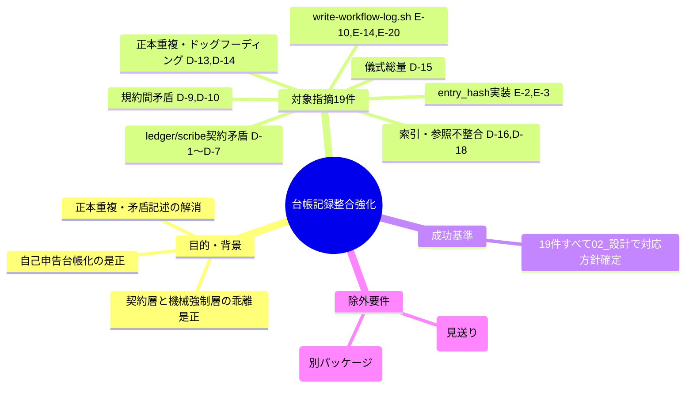

# 要求定義書: .agent-skill-chain: 台帳・記録(ledger/scribe)の整合強化

**プロジェクト名**: .agent-skill-chain: 台帳・記録(ledger/scribe)の整合強化
**作成日**: 2026年07月18日
**最終更新**: 2026年07月18日

> **重要**:
>
> - 要求定義書は、プロジェクトの全体像を把握するためのものです。詳細な技術仕様や実装方法は要件定義書以降で記載します。必要最低限の情報に収めることを心掛けてください。
> - **このドキュメントは常に更新**: 要求の変更や追加があった場合は、即座にこのドキュメントを更新してください。ドキュメントは「生きているドキュメント」として扱い、実装内容と常に同期させます。
> - **必須項目**: 以下の「必須」と明記した項目は空欄・抽象語のみ（例: 「{説明}」のまま）で提出しないこと。判定可能な形（目的は1文・成功基準は○/×で判定できる記載等）で記入すること。

---

## 要求定義の全体像



**注意**: 本タスクは既存の親issue（fableシステムレビューの対応方針確定）から切り出されたサブissueであり、対象は「台帳・記録(ledger/scribe)の整合強化」パッケージ（19件）に限定する。実装そのものは本00に続く02_設計・03_実装計画のフェーズで行う。

---

## 1. 目的・背景

### 1.1 目的（必須）

証跡台帳(ledger/scribe)の契約層と機械強制層の乖離、および自己申告台帳化を是正する

### 1.2 背景

`.agent-skill-chain` フレームワークの fable による独立監査（親issue: [`../../00_要求定義.md`](../../00_要求定義.md)）で検出された112件の指摘のうち、領域D（台帳・記録・仕様・各種ポリシー）および領域E（運用スクリプト）の一部が、ledger（`ledger/schema.sql`, `ledger/schema.md`, `ledger/README.md`）・scribe（`scribe/CONTRACT.md`, `scribe/README.md`）・関連スクリプト（`scripts/write-workflow-log.sh`, `scripts/gen-entry-hash.sh`, `scripts/resolve-wf-db.sh`）・周辺ポリシー文書（`EVIDENCE_POLICY.md`, `REVIEW_RULE.md`, `CODE_COMMENT_RULES.md`, `DOCS_NOISE_RULES.md`, `DOCS_RULES.md`, `CLOSEOUT.md`, `HEARTBEAT.md`）の整合性に関わるものとして本パッケージにまとめられた。総括Dが指摘する通り、最大の構造的懸念は「契約層（『必須』『絶対』という強い宣言）と機械強制層（実制約・実検査）の乖離」であり、document_id・必須キー・改ざん検知・ティア根拠のいずれも、文書上は強い義務だが機械層は「欄の存在」までしか担保せず、ledger は「検証可能な証跡」ではなく「体裁の整った自己申告台帳」に近づいている（詳細は [`../../01_指摘一覧.md`](../../01_指摘一覧.md) 領域D冒頭・総括D、[`../../02_対応方針.md`](../../02_対応方針.md) を参照）。

**対象指摘19件の要点一覧**（詳細は [`../../01_指摘一覧.md`](../../01_指摘一覧.md)、方針確定の経緯は [`../../02_対応方針.md`](../../02_対応方針.md) を参照）:

| ID | 深刻度 | 方針 | 要点（1行要約） |
| --- | --- | --- | --- |
| D-1 | high | 採用 | entry_hash/prev_hash の改ざん検知が、アルゴリズム未確定・検証手順不在で実質形骸化している |
| D-2 | high | 採用 | document_id を「必須・任意禁止」とする CONTRACT.md 宣言と、NULL 許容の DB スキーマが真っ向から矛盾する |
| D-3 | high | 採用 | 「必須キー」の定義が scribe/README・CONTRACT.md・ledger/README・schema.md の4ファイルで食い違い、正本が決まらない |
| D-4 | high | 採用（要設計判断） | 「INSERT OR IGNORE 推奨」記述が新スキーマでは重複防止にならず、記述としては陳腐化しているが正規ラッパー経路への実害は限定的 |
| D-5 | medium | 採用（要設計判断） | actor_role/delegated_by_role が単一値強制で記録欄として情報量ゼロ（意図的な不変条件強制か、廃止/複数値化かの設計判断が必要） |
| D-6 | medium | 採用（要設計判断） | dod_met・tier_rationale 等の中核記録が「欄が埋まっているか」しか検証されない自己申告（根拠パス必須化は設計判断） |
| D-7 | medium | 採用 | CONTRACT.md が実在しない memo_ref テーブルへの登録を指示している |
| D-9 | medium | 採用 | REVIEW_RULE の「外部根拠必須」と EVIDENCE_POLICY の inference_only 許容が矛盾する |
| D-10 | medium | 採用 | REVIEW_RULE の「プロジェクト全体を徹底調査」が quick/standard/full の深度選択と規模非比例に矛盾する |
| D-13 | medium | 採用 | schema.md が schema.sql の逐語コピーを保持し、DOCS_NOISE_RULES (iii) 正本重複禁止に自ら抵触する |
| D-14 | medium | 採用 | CODE_COMMENT_RULES にドッグフーディング（本リポジトリ固有パス）の直書きが残っている（既知欠陥クラスの再発） |
| D-15 | medium | 採用（要設計判断） | HEARTBEAT・CLOSEOUT の儀式総量が過大で大半が痕跡を残さない（二層化・最小集合化は大規模な再構成を伴う設計判断） |
| D-16 | low | 採用 | DOCS_NOISE_RULES が参照する識別子「R-5」が DOCS_RULES に実在しない |
| D-18 | low | 採用 | tier_rationale/tier_exception への索引が、audit #38 の非空判定のみの検査には恩恵がなく無意味 |
| E-2 | medium | 採用（要設計判断） | entry_hash が prev_hash・document_path・model_tier 等を含まず改竄検知が実質機能しない（式変更は既存チェーン全行を無効化する破壊的マイグレーションで移行方針の判断が必要） |
| E-3 | low | 採用（要設計判断） | gen-entry-hash.sh の `\|` 連結にエスケープがなくフィールド境界の曖昧性で衝突しうる（E-2 と同じハッシュ式変更で一括対処すべき） |
| E-10 | medium | 採用（要設計判断） | write-workflow-log.sh の「DB パス固定」宣言が環境変数（PROJECT_ROOT/WORKFLOW_DIR）で無効化できる（worktree横断DB解決という意図的設計との兼ね合いで制限方法は判断要） |
| E-14 | low | 採用 | write-workflow-log.sh のマイグレーション失敗チェックが set -e により到達不能なデッドコードになっている |
| E-20 | low | 採用（要設計判断） | write-workflow-log.sh の to_json_array が制御文字をエスケープせず不正 JSON を生成しうる（値はファイルパス中心で顕在化は稀だが防御的改善の要否は判断） |

**要設計判断（トレードオフを伴う）項目**: 上表のうち D-4, D-5, D-6, D-15, E-2, E-3, E-10, E-20 の8件は、独立検証において指摘自体の妥当性は確認されたものの、対応方法が複数考えられ採否・具体案の決定にトレードオフを伴うため、02_設計フェーズで人間判断を仰ぐ必要がある（[`../../02_対応方針.md`](../../02_対応方針.md) 冒頭「方針の決め方」を参照）。特に D-5・D-6 は「単一値強制」「自己申告」自体が意図的設計の可能性があり単純な欠陥修正では済まない。E-2・E-3 は entry_hash 生成式の変更が既存 workflow.db のチェーン全行を無効化する破壊的マイグレーションを伴うため、移行方針（再計算・切替時点・旧チェーンの扱い）の決定が前提となる。E-10 は worktree 横断での DB 解決という意図的設計とのトレードオフである。D-15 は HEARTBEAT・CLOSEOUT の大規模な再構成を伴う。なお、関連する要設計判断項目のうち D-11（MODEL_SELECTION 対応表未定義時のフォールバック）・D-12（EFFORT_POLICY の記録欄欠如）は別パッケージへ移管済みであり、本パッケージのスコープには含まない。

### 1.3 期待される効果（必須: 1 件以上）

- **効果 1**: ledger/scribe の契約層（CONTRACT.md・README.md・schema.md・schema.sql）の記述間の矛盾（D-1〜D-3, D-7, D-13）が解消され、実装がどのファイルを正本として参照すべきか一意に定まる。
- **効果 2**: 台帳・書記まわりに接続するポリシー間の矛盾（D-9, D-10, D-14, D-16）が解消され、実装者・レビュアーがルール間の板挟みでデッドロックしない。
- **効果 3**: 要設計判断となる8件（D-4, D-5, D-6, D-15, E-2, E-3, E-10, E-20）について、02_設計.md で具体的なトレードオフ整理と対応方針の確定が完了する。

**現状と期待される状態の比較**:

```mermaid
flowchart LR
    subgraph 現状["現状"]
        A1[契約層(必須/絶対)と機械強制層(欄の存在のみ)が乖離]
        A2[schema.md・README等4ファイルで必須キー定義が食い違う]
        A3[entry_hash生成式が検証不能・チェーン改竄検知が形骸化]
    end

    subgraph 期待される状態["期待される状態"]
        B1[19件それぞれで対応方針(採用/要設計判断の具体案)が確定]
        B2[正本一元化・矛盾記述の解消方針が02_設計に明記]
        B3[entry_hash方式変更のトレードオフ・移行方針が判断済み]
    end

    A1 -.->|整理| B1
    A2 -.->|整理| B2
    A3 -.->|整理| B3
```

---

## 2. 機能要件

### 2.1 既存機能の維持（該当する場合）

ledger/scribe の既存記録機能（workflow_log への記録、entry_hash によるチェーン形成）は本パッケージの対応後も継続して機能すること。

### 2.2 新規機能要件

- 対象19件それぞれについて、02_設計.md で個別の対応方針（修正内容・修正しない場合の理由・要設計判断項目のトレードオフ整理）を記載する。
- 「採用」判定済みの11件（D-1, D-2, D-3, D-7, D-9, D-10, D-13, D-14, D-16, D-18, E-14）は、具体的な修正内容（対象ファイル・修正箇所・修正後の記述）まで設計を確定する。
- 「採用（要設計判断）」の8件（D-4, D-5, D-6, D-15, E-2, E-3, E-10, E-20）は、複数の対応案とそれぞれのトレードオフを整理し、採否・具体案について本issueの進行役（ユーザー）の判断を仰ぐ。

---

## 3. 非機能要件

### 3.1 パフォーマンス

本パッケージの対象外（ドキュメント・スクリプトの整合性強化であり実行時性能への影響は限定的）

### 3.2 セキュリティ

- D-1, E-2, E-3 は改ざん検知（entry_hash チェーン）の実効性に関わるため、対応方針決定時にセキュリティ上の意味合い（検知回避の実害シナリオ）を明記すること。

### 3.3 互換性

- E-2, E-3 の entry_hash 生成式変更は、既存 workflow.db に記録済みの行の entry_hash と非互換になる可能性がある。互換性影響（既存チェーンの扱い・再計算要否）を02_設計で明記すること。

### 3.4 保守性

- D-13（schema.md の正本重複）はドキュメント保守性に直結するため、写し・旧スキーマ記述の削除方針を明確にすること。

---

## 4. 制約条件

### 4.1 技術的制約

- 本00作成時点では実装・git操作（add/commit等）は行わない。実装は別途02_設計・03_実装計画のフェーズで行う。
- 作業は親issueと同じworktree（`chore/20260718_025331-fableシステムレビュー`）内で行い、メインの作業ツリーを直接変更しない。
- 親issueのファイル（`../../00_要求定義.md`, `../../01_指摘一覧.md`, `../../02_対応方針.md`）は変更しない。

### 4.2 既存システムとの互換性

- E-2, E-3 の対応（entry_hash 生成式変更）は既存 workflow.db との互換性に影響しうるため、02_設計で移行方針を明記すること（4.3参照）。

### 4.3 移行期間・スケジュール

- 該当なし（対応順序・実装スケジュールは02_設計・03_実装計画で確定する）

---

## 5. 除外要件

- D-8（TEST_BDD_FORMAT と CODE_COMMENT_RULES の矛盾）、D-17（タイムゾーン二系統）、D-19（「迷った場合」の既定方向）は、独立検証の結果「見送り」と判定済みであり本パッケージの対象外（[`../../02_対応方針.md`](../../02_対応方針.md) 行93, 102, 104参照）。
- D-11（MODEL_SELECTION 対応表未定義時のフォールバック）、D-12（EFFORT_POLICY の記録欄欠如）は、他のパッケージへ移管済みであり本パッケージの対象外。
- 領域A・B・C・F・Gに属する指摘は本パッケージの対象外（他パッケージが担当）。

---

## 6. 成功基準（必須: 1 件以上）

- 対象指摘19件（D-1, D-2, D-3, D-4, D-5, D-6, D-7, D-9, D-10, D-13, D-14, D-15, D-16, D-18, E-2, E-3, E-10, E-14, E-20）それぞれについて、02_設計.md で対応方針が確定していること。
- 「採用（要設計判断）」の8件（D-4, D-5, D-6, D-15, E-2, E-3, E-10, E-20）について、複数対応案とトレードオフが02_設計.mdに明記され、採否判断の材料が揃っていること。
- 02_設計.mdの内容が、対象ファイル（ledger/schema.sql, ledger/schema.md, ledger/README.md, scribe/CONTRACT.md, scribe/README.md, scripts/write-workflow-log.sh, scripts/gen-entry-hash.sh, scripts/resolve-wf-db.sh, EVIDENCE_POLICY.md, REVIEW_RULE.md, CODE_COMMENT_RULES.md, DOCS_NOISE_RULES.md, DOCS_RULES.md, CLOSEOUT.md, HEARTBEAT.md）のどこをどう変更するか、指摘IDと紐づけて特定できる形になっていること。

---

## 7. リスクと対策

### 7.1 技術的リスク

- **リスク**: E-2/E-3のentry_hash生成式変更は、既存workflow.dbのチェーン全行を無効化する破壊的マイグレーションになりうる。
  - **対策**: 02_設計で移行方針（旧チェーンの扱い、再計算要否、切替時点の明記）を確定してから実装に進む。
- **リスク**: D-5・D-6（単一値強制・自己申告）は意図的設計の可能性があり、安易な修正が既存の不変条件保護を壊すおそれがある。
  - **対策**: 02_設計で現状の設計意図を明記したうえで、変更/現状維持のトレードオフを整理し判断を仰ぐ。

### 7.2 スケジュールリスク

- **リスク**: 19件中8件が要設計判断であり、ユーザー判断待ちで02_設計の確定が遅延する可能性がある。
  - **対策**: 「採用」確定済みの11件を先に設計・実装可能な形にまとめ、要設計判断の8件は個別に判断を仰ぐ形で並行して進める。

---

## 8. 参考資料

### プロジェクトドキュメント

- 親issue: [`../../00_要求定義.md`](../../00_要求定義.md) — fableレビュー全体の要求定義
- [`../../01_指摘一覧.md`](../../01_指摘一覧.md) — fableレビュー全指摘の詳細（本パッケージ対象IDの原文はここに記載）
- [`../../02_対応方針.md`](../../02_対応方針.md) — 各指摘の採用/見送り/採用（要設計判断）の判定と理由

### その他の参考資料

- 対象ファイル: `ledger/schema.sql`, `ledger/schema.md`, `ledger/README.md`, `scribe/CONTRACT.md`, `scribe/README.md`, `scripts/write-workflow-log.sh`, `scripts/gen-entry-hash.sh`, `scripts/resolve-wf-db.sh`, `EVIDENCE_POLICY.md`, `REVIEW_RULE.md`, `CODE_COMMENT_RULES.md`, `DOCS_NOISE_RULES.md`, `DOCS_RULES.md`, `CLOSEOUT.md`, `HEARTBEAT.md`（D-15該当箇所のみ）

---

## 9. 次のステップ

この要求定義書の承認後、以下のドキュメントを作成します：

- **次**: `01_要件定義.md`（必要に応じて） - 要件定義フェーズ
- **その次**: `02_設計.md` - 対象19件それぞれの対応方針確定（要設計判断8件はトレードオフ整理とユーザー判断待ち）
