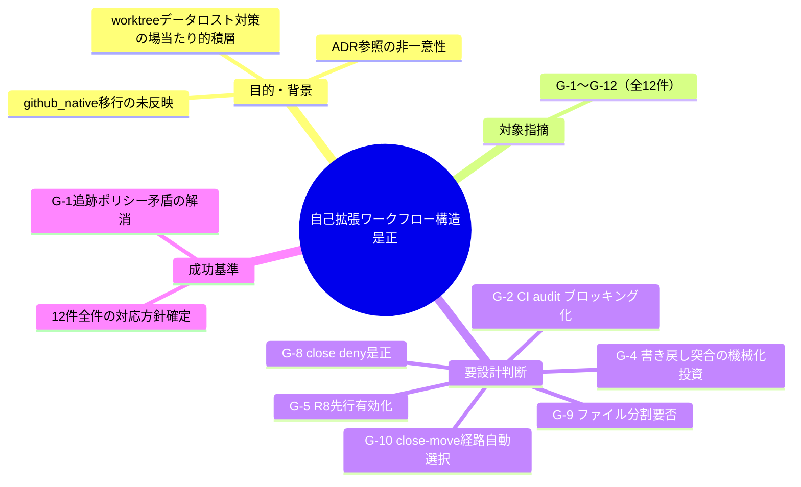
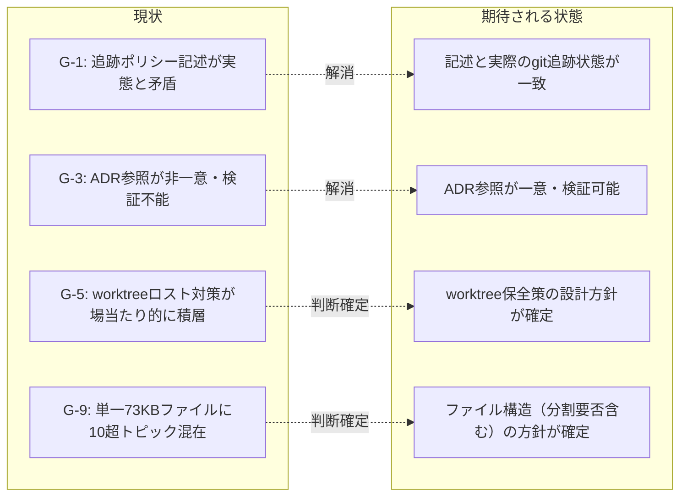

# 要求定義書: .agent-skill-chain: 自己拡張ワークフロー.md の構造是正

**プロジェクト名**: .agent-skill-chain: 自己拡張ワークフロー.md の構造是正
**作成日**: 2026年07月18日
**最終更新**: 2026年07月18日

> **重要**:
>
> - 要求定義書は、プロジェクトの全体像を把握するためのものです。詳細な技術仕様や実装方法は要件定義書以降で記載します。必要最低限の情報に収めることを心掛けてください。
> - **このドキュメントは常に更新**: 要求の変更や追加があった場合は、即座にこのドキュメントを更新してください。
> - **必須項目**: 以下の「必須」と明記した項目は空欄・抽象語のみで提出しないこと。

---

## 要求定義の全体像

**注意**: 本 issue は `project/自己拡張ワークフロー.md`（単独ファイル、約73KB）を対象とする構造是正である。対象指摘のうち6件（G-2, G-4, G-5, G-8, G-9, G-10）は「採用（要設計判断）」であり、02_設計フェーズで人間判断を要する論点として扱う。

---

## 1. 目的・背景

### 1.1 目的（必須）

自己拡張ワークフロー.md の記述矛盾・非一意参照・場当たり的積層を是正し、実効性を回復する

### 1.2 背景

fable による独立監査（`../../01_指摘一覧.md`）で `project/自己拡張ワークフロー.md`（領域G）に対して12件の指摘が検出され、`../../02_対応方針.md` でその全件が「採用」または「採用（要設計判断）」と判定された。要点は以下の通り。

| ID | 深刻度 | 対応方針判定 | 要約 |
|---|---|---|---|
| G-1 | high | 採用 | 「00〜04は git 追跡対象」との断言（行18・292・401・405）と、github_native 移行による非追跡化（行279）が正面矛盾。実測でも新規 issue は非追跡。2026-07-17 の 04_review.md 喪失事故と符合。 |
| G-2 | high | 採用（**要設計判断**） | 「機械強制の三層」が本リポでは enforce off・CI audit continue-on-error・#36 inert・#33 no-op で実質すべて非ブロッキング。ブロッキング化は workflow.db 非追跡問題の解消待ちで意図的先送り済みのため実施可否は人間判断要。 |
| G-3 | high | 採用 | ADR 参照（「02_設計 ADR-n」形式、約20箇所）が issue ごと独立採番で衝突（同一「ADR-4」が別決定を指す実例あり）。参照先が close/ deny 等で検証困難。 |
| G-4 | high | 採用（**要設計判断**） | 書き戻し漏れの予防策が「手順遵守」の明文自認のみで、機械的突合（gh issue list vs frontmatter grep）が未導入。導入は実装投資判断を要する。 |
| G-5 | high | 採用（**要設計判断**） | worktree データロスト事故（2026-07-15→2026-07-17再発）への対症療法が三重に積層。根本原因（hooks 未配線）解消は別途「本 issue スコープ外」と明記済み。**R8（非ブロッキング退避 hook）の先行有効化はロックアウト事故再来リスクとのトレードオフで大きな設計判断を伴う**。 |
| G-6 | medium | 採用 | §0.1 のブランチ命名規則（5種の type・`<type>/<YYYYMMDD_HHMMSS>-<固有名>`）と、文書内の記載例（行200・204・302）自体が規則違反。 |
| G-7 | medium | 採用 | 「本ファイル §268」という行番号参照が既に破損（現在の268行目は無関係な見出し）。見出しアンカー化が必要。 |
| G-8 | medium | 採用（**要設計判断**） | close/ deny を温存したまま回避手順（リンク補正等）が肥大化し、約1,060件のリンク切れが追跡 issue なしで放置。推奨案（Read のみ許可）の採否は settings.json 変更を伴い人間判断要。 |
| G-9 | medium | 採用（**要設計判断**） | 単一ファイル73KB・407行に10超の独立トピック（issue作成場所・GitHub起票ゲート・ブランチ/PR紐づけ・worktree必須化・deny ミラー・memo・追跡モード・close移動・リンク補正・deny方針・テスト隔離）が混載。**分割の要否・分割単位は相互参照断片化リスクを伴う大規模再構成であり大きな設計判断を伴う**。 |
| G-10 | medium | 採用（**要設計判断**） | 分岐C（github_native close移動）の追跡/非追跡混在ハンドリングが3経路に分裂し複雑。close-move-issue.sh への経路自動選択の寄せ込みは実装判断（現行スクリプトのworktree実行拒否ガードとの整合含む）を要する。 |
| G-11 | low | 採用 | リンクの表示テキストと href の不一致（複数箇所、行5・192・262・280・285ほか）。 |
| G-12 | medium | 採用 | §2.5 の書き戻し先（00_要求定義.md frontmatter）が github_native 移行後は非追跡ドラフトとして破棄されうる点が未整理。G-1 の具体事例。 |

- **現状の課題**:
  - github_native 移行という方針転換が文書の一部にしか反映されておらず、冒頭・末尾の追跡ポリシー記述と正面矛盾したまま最優先文書として運用されている（G-1・G-12）。
  - ADR 参照が一意でなく、参照先が close/ deny 等で検証不能な構造になっている（G-3）。
  - worktree データロスト事故のたびに対症療法を積層する運用が続き、根本原因が未解決のまま文書量だけが増大している（G-5）。
  - 単一ファイル73KB・10超トピック混載により、委譲先サブエージェントが前提節（§0 worktree必須、§0.3(d) DECISIONS転記等）を読み落とすリスクが構造的に存在する（G-9）。

- **必要性**:
  - 12件の指摘は fable の独立監査により指摘され、`02_対応方針.md` で全件「採用」判定済みであり、対応の要否自体は既に確定している。
  - うち6件（G-2, G-4, G-5, G-8, G-9, G-10）は対応方針が「要設計判断」であり、02_設計フェーズで具体的な設計案を提示し、人間（ユーザー）の判断を仰ぐ必要がある。特に G-9（ファイル分割要否）と G-5（R8先行有効化の是非）は文書構造・enforcement機構双方に影響する大きな設計判断である。

### 1.3 期待される効果（必須: 1 件以上）

- **効果 1**: 対象指摘12件（G-1〜G-12）それぞれについて、02_設計.md で対応方針（具体的な改訂内容、または要設計判断項目については採用/見送りの決定と理由）が確定した状態になる。
- **効果 2**: G-1（追跡ポリシー矛盾）が解消され、自己拡張ワークフロー.md の記述と実際の git 追跡状態（github_native 移行後の非追跡）が一致する。
- **効果 3**: G-3（ADR参照の非一意性）が解消され、文書内のADR参照が一意に検証可能な形式に統一される。

**現状と期待される状態の比較**:

---

## 2. 機能要件

### 2.1 既存機能の維持（該当する場合）

- `project/自己拡張ワークフロー.md` が担う既存の運用規約（issue作成場所、GitHub起票ゲート、ブランチ/PR紐づけ、worktree必須化・命名・削除保全、deny ミラー、memo運用、追跡モード、close移動、リンク補正、deny方針、テスト隔離）は、内容の是正・再編後も規約としての機能を維持する（規約の消失・骨抜きは不可）。

### 2.2 新規機能要件

- G-1・G-12: 追跡ポリシー記述の全面改訂（「追跡する」と書かれた箇所を全 grep し、github_native 移行後の実態に合わせる）。
- G-3: ADR 参照を一意 ID へ全面付け替え。
- G-6: 文書内の全ブランチ名記載例を §0.1 準拠形式に統一。
- G-7: 行番号ベース自己参照を見出しアンカー参照に置換。
- G-11: リンク表示テキストと href の不一致を解消。
- G-2・G-4・G-5・G-8・G-9・G-10: 02_設計フェーズで具体的な改訂案・設計選択肢を提示し、対応方針を確定する。

---

## 3. 非機能要件

### 3.1 パフォーマンス

該当なし（ドキュメント修正のみで実行時性能に影響しない）

### 3.2 セキュリティ

- close/ deny（G-8）の是正案を検討する場合、Read/Grep/Glob 権限の変更が settings.json のセキュリティ境界に影響するため、変更範囲を慎重に見極める。

### 3.3 互換性

- 既存の委譲済みサブエージェント・並行 worktree セッションが本ファイルを参照中に構造変更（特に G-9 のファイル分割）を行う場合、参照切れが生じないよう移行経路を設計時に検討する。

### 3.4 保守性

- 是正後の文書が、今後同種の事故（追跡ポリシー矛盾の再発、ADR参照の再衝突等）を構造的に防げる状態になっていること。

---

## 4. 制約条件

### 4.1 技術的制約

- 対象ファイルは `project/自己拡張ワークフロー.md` 単独（約73KB）。
- 本 issue の作業（実装・編集）は、実施段階で `.agent-skill-chain/project/` の worktree 運用規約に従い、`main` から新規ブランチを切った worktree 内で行う。
- 本ドキュメント作成タスク自体では git 操作（add/commit等）は行わない。親 issue のファイルは変更しない。

### 4.2 既存システムとの互換性

- 是正後も、他の90_issuesサブissue（enforcement機構実効性強化・起動契約コマンドワークフロー整合・運用スクリプトバグ修正・台帳記録整合強化）が参照する `project/自己拡張ワークフロー.md` の該当節が破綻しないよう整合を取る。

### 4.3 移行期間・スケジュール

- 該当なし（単一パッケージ内で完結する是正作業）

---

## 5. 除外要件

- 対象指摘12件（G-1〜G-12）以外の領域（A〜F等）の指摘対応は本 issue の対象外。
- 6件の要設計判断項目（G-2, G-4, G-5, G-8, G-9, G-10）について、02_設計フェーズで提示する設計案の実装可否そのものの最終決定はユーザー判断に委ね、進行役・サブエージェントの独断では確定しない。
- close/ deny 設定自体の変更実施（G-8, settings.json編集）は、採否判断が下るまでは本 issue のスコープに含めない。

---

## 6. 成功基準（必須: 1 件以上）

- 対象指摘12件（G-1〜G-12）それぞれについて `02_設計.md` で対応方針（具体的な改訂内容、または要設計判断項目の採用/見送り決定と理由）が確定していること。
- G-1（追跡ポリシー矛盾）が解消され、実際の git 追跡状態（`git check-ignore` 等の実測）と `自己拡張ワークフロー.md` の記述が一致していること。
- G-3（ADR参照非一意）が解消され、文書内のADR参照が一意に特定・検証可能な形式になっていること。
- G-6（ブランチ命名規則と記載例の矛盾）・G-7（行番号自己参照の破損）・G-11（リンク表示不一致）が解消されていること。
- G-2, G-4, G-5, G-8, G-9, G-10 の6件について、02_設計.md に設計選択肢とユーザー判断結果（採用/見送り）が明記されていること。

---

## 7. リスクと対策

### 7.1 技術的リスク

- **リスク**: G-9（ファイル分割）を採用した場合、分割によって既存の相対リンク・他ファイルからの参照が断片化し、新たなリンク切れを生む可能性がある。
  - **対策**: 分割案を採る場合は、分割前後でのリンク参照一覧を突合し、移行漏れがないか機械的に確認する。
- **リスク**: G-5（R8先行有効化）を採用した場合、hooks 配線の変更がenforce機構全体に波及し、過去に発生した「enforce onによる進行役ロックアウト事故」（`feedback_enforce-on-lockout-incident`）と類似のリスクを再発させる可能性がある。
  - **対策**: R8単体（非ブロッキング・退避のみ）の影響範囲を02_設計で明示し、既存のenforce off運用との整合を確認してから採否を判断する。

### 7.2 スケジュールリスク

- **リスク**: 6件の要設計判断項目は人間判断を要するため、判断待ちで後続フェーズ（02_設計確定・実装）が滞留する可能性がある。
  - **対策**: 設計判断が不要な6件（G-1, G-3, G-6, G-7, G-11, G-12）を先行して設計・実装し、要設計判断6件は並行して選択肢を整理してユーザーに判断を仰ぐ。

---

## 8. 参考資料

### プロジェクトドキュメント

- 親 issue の要求定義: [`../../00_要求定義.md`](../../00_要求定義.md)
- fable レビュー全指摘一覧（G-1〜G-12 の詳細記載箇所を含む）: [`../../01_指摘一覧.md`](../../01_指摘一覧.md)
- 対応方針（採用/見送り/要設計判断の判定根拠）: [`../../02_対応方針.md`](../../02_対応方針.md)
- 対象ファイル: `project/自己拡張ワークフロー.md`

### その他の参考資料

- なし

---

## 9. 次のステップ

この要求定義書の承認後、以下のドキュメントを作成します：

- **次**: [`01_要件定義.md`](./01_要件定義.md) - 要件定義フェーズ（G-1〜G-12 それぞれの受け入れ基準を BDD 形式で具体化）
