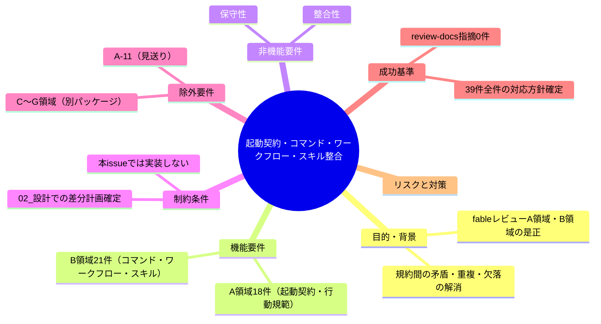
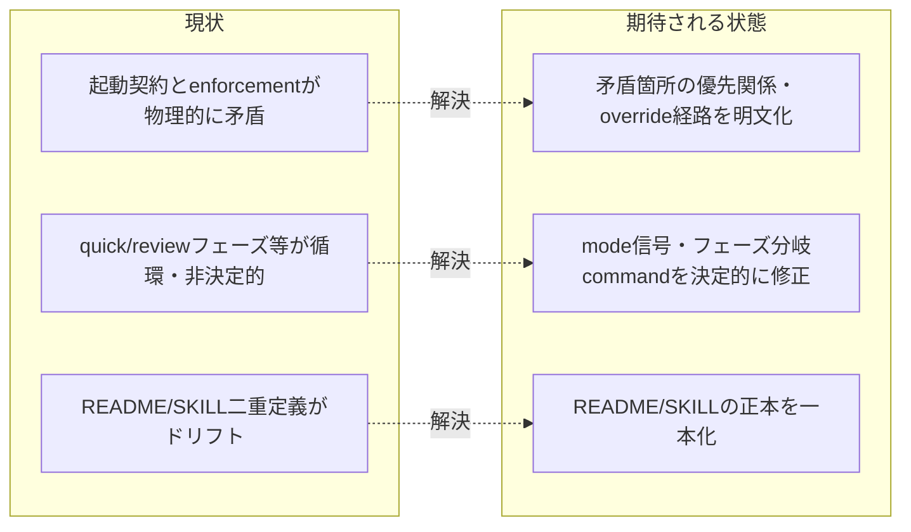

# 要求定義書: .agent-skill-chain: 起動契約・コマンド・ワークフロー・スキル整合

**プロジェクト名**: .agent-skill-chain: 起動契約・コマンド・ワークフロー・スキル整合
**作成日**: 2026年07月18日
**最終更新**: 2026年07月18日

> **重要**:
>
> - 要求定義書は、プロジェクトの全体像を把握するためのものです。詳細な技術仕様や実装方法は要件定義書以降で記載します。必要最低限の情報に収めることを心掛けてください。
> - **このドキュメントは常に更新**: 要求の変更や追加があった場合は、即座にこのドキュメントを更新してください。ドキュメントは「生きているドキュメント」として扱い、実装内容と常に同期させます。
> - **必須項目**: 以下の「必須」と明記した項目は空欄・抽象語のみ（例: 「{説明}」のまま）で提出しないこと。判定可能な形（目的は1文・成功基準は○/×で判定できる記載等）で記入すること。

---

## 要求定義の全体像

**注意**: 本 issue は親 issue（`.agent-skill-chain` フレームワーク fable レビュー）の 02_対応方針.md で「採用」または「採用（要設計判断）」と確定した指摘のうち、「起動契約・コマンド・ワークフロー・スキル整合」パッケージ（39件）を対象とする実装準備 issue である。この 00_要求定義.md 時点では設計・実装は未着手であり、次工程の 01_要件定義.md／02_設計.md で各指摘の具体的な対応方針（差分計画）を確定する。

---

## 1. 目的・背景

### 1.1 目的（必須）

起動契約・コマンド・ワークフロー・スキル規約群の矛盾・重複・欠落39件を是正し整合させる

### 1.2 背景

- **現状の課題**:
  - `.agent-skill-chain` フレームワークの起動契約層（boot/CORE.md, LOAD_POLICY.md）・行動規範層（AGENT_CONDUCT.md, RULES.md, CONCEPTS.md, IO_CONTRACT.md, PLATFORM_SAFETY_RESPONSE.md, META_LAYER.md, HEARTBEAT.md）・コマンド／ワークフロー層（commands/\*.md, workflow/\*.md）・スキル層（skills/\*\*/\*.md）・テンプレート（runtime/templates/\*.md）・enforcement/README.md の該当箇所に、fable による独立監査（領域A・領域B）で計39件の矛盾・重複・欠落・実行不能な規定が指摘されている。
  - 親 issue の `02_対応方針.md` にて、これら39件はいずれも「採用」または「採用（要設計判断）」と判定済みであり、見送りは A-11 のみ（本パッケージの対象外）。
  - 未是正のまま放置すると、進行役・サブエージェントが規約の解釈で割れ、デッドロック（例: quick モードの循環定義、review-docs 実装前 04_review 作成のジレンマ）や、無強制状態への滑り落ち（enforce off 等）が現実の運用リスクとして顕在化する。

- **必要性**:
  - 「採用（要設計判断）」指摘（A-4〜A-7, A-10, A-12, A-16, B-6, B-11, B-13, B-21 等）はトレードオフを伴うため、02_設計.md で具体的な対応方針を人間判断も踏まえて確定する必要がある。
  - 「採用」指摘は比較的軽微な文言修正・整合作業が中心だが、対象ファイルが多岐（起動契約・行動規範・コマンド・ワークフロー・スキル・テンプレート）にわたるため、パッケージとして一括で設計・実装計画を立てる必要がある。

- **対象指摘一覧（領域A: 18件、A-11は見送りのため対象外）**

  | ID | 深刻度 | 方針 | 要約 |
  | --- | --- | --- | --- |
  | A-1 | high | 採用 | 進行役の外部書き込み carve-out と enforcement の Bash 全面ブロックが物理的に矛盾する。 |
  | A-2 | high | 採用 | 「最終保証は CI audit」という宣言が、DB系チェック常時SKIP・CI非ブロッキング運用により構造的に空洞化している。 |
  | A-3 | high | 採用 | `enforce off` による enforcement 自己無効化の手順が規約自身に文書化されており、禁止は advisory のみで実効性がない。 |
  | A-4 | high | 採用（要設計判断） | quick モードの mode 信号（00 frontmatter）が quick の「00を作らない」定義と循環し、実質発動不能になっている。 |
  | A-5 | high | 採用（要設計判断） | 「例外は認めない」絶対制約により、委譲不可環境でユーザーの明示指示すら委譲強制を上書きできずデッドロックしうる。 |
  | A-6 | high | 採用（要設計判断） | 「正本1か所・重複禁止」原則に反し、タイムスタンプ規則・close移動説明・quick免除条件等が複数ファイルに重複記載されている。 |
  | A-7 | high | 採用（要設計判断） | full モード時の必読ファイル連鎖が自らの監視指標（参照文書≤8）を恒常的に超過し、読了義務とコンテキスト経済が自己矛盾する。 |
  | A-8 | medium | 採用 | PLATFORM_SAFETY_RESPONSE の4原則と run_command の「進行役エスカレーション実行」の優先関係が未定義で矛盾する。 |
  | A-9 | medium | 採用 | AGENT_CONDUCT「そのまま転記」と run_command「リンクのみで足りる」が正面矛盾する（A-6の具体ドリフト実例）。 |
  | A-10 | medium | 採用（要設計判断） | run_command.md（skillファイル）に policy が集積し、META_LAYER の責務境界（skillにruleを書かない）を自ら破っている。 |
  | A-12 | medium | 採用（要設計判断） | META_LAYER Rule 3「enforcement を伴わないルール追加禁止」に反し、advisory ルールが体系的に量産されている。 |
  | A-13 | medium | 採用 | #25（メイン直接作業検知）の48時間許容窓ヒューリスティックはバイパス容易かつ誤検知源である。 |
  | A-14 | medium | 採用 | IO_CONTRACT の猶予監査基準（実質的変更かtypoかの意味判定）が機械チェック不能である。 |
  | A-15 | medium | 採用 | PLATFORM_SAFETY_RESPONSE (d)「独立検証」の実行手段が進行役に与えられていない。 |
  | A-16 | medium | 採用（要設計判断） | scribe 経路防御（nonce・realpath・hash chain）の複雑性が自認する保証水準に見合っていない。 |
  | A-17 | low | 採用 | HEARTBEAT 読了の規範強度が「推奨」「必ず」等3箇所で不一致。 |
  | A-18 | low | 採用 | 用語規約「issueとタスクは置き換え可能」がenforcementゲート判定単位を曖昧化している。 |
  | A-19 | low | 採用 | PHASES の実装計画フェーズで起動commandが「design-featureまたはimplement-featureの入口」と非決定的。 |

  （A-11「CORE禁止リストのRead/Grep/Glob文言が多義的」は親issueの独立検証で**見送り**と確定済みのため、本パッケージの対象外）

- **対象指摘一覧（領域B: 21件、全件）**

  | ID | 深刻度 | 方針 | 要約 |
  | --- | --- | --- | --- |
  | B-1 | high | 採用 | 「各フェーズ完了時のverify-and-close必須」と「04_reviewは実装後のみ作成可」がPHASES/run_command/verify-and-close間で正面衝突する。 |
  | B-2 | high | 採用 | README.mdとSKILL.mdの二重定義がドリフトしており、review系でDoDレベルの相違が実在する。 |
  | B-3 | high | 採用 | create-pr-review-issueが「03完了後（実装前）」に位置づけられているが、PRレビューコメントは実装・PR作成後にしか存在せず時系列が成立しない。 |
  | B-4 | medium | 採用 | 「chainを飛ばすな」というrun_commandの原則とSKILL_MANDATORYのOptional指定が矛盾する。 |
  | B-5 | medium | 採用 | 実装計画フェーズのcommand「implement-featureの入口」が03生成手段を欠き非決定的。 |
  | B-6 | medium | 採用（要設計判断） | 一般issue作成のcommandがPHASE_COMMAND_MAPに明示されていない。 |
  | B-7 | medium | 採用 | create-pr-review-issueのアクター境界（サブ→進行役→別サブ）がrun_commandの委譲モデルと不整合。 |
  | B-8 | medium | 採用 | create-pr-review-issueの監査step適用条件がPHASESのDoDと食い違う（起票0件時の扱い）。 |
  | B-9 | medium | 採用 | experience_surfaceの値語彙（yes:/no: vs あり/なし）が不統一で、壊れた条件式表記が複数ファイルへ伝播している。 |
  | B-10 | medium | 採用 | "no:" 値の検証責務がdesign-feature側にのみ定義され、define-boundariesのSKILL/READMEに手順が欠落している。 |
  | B-11 | medium | 採用（要設計判断） | review-docs等の「指摘0件まで反復」ループに上限・非収束時のエスカレーション経路が無い。 |
  | B-12 | medium | 採用 | review-docsの「00-03への記載推奨」がPHASESの「memoのみに証跡」と矛盾する。 |
  | B-13 | medium | 採用（要設計判断） | 「書記に依頼」の実行主体（chain内自己実行か別委譲か）が曖昧。 |
  | B-14 | medium | 採用 | テンプレートのフォールバック先パス表記が正本パスと同一文字列で解決不能。 |
  | B-15 | medium | 採用 | 04_reviewテンプレートに、SKILLが必須とする「二観点リスト」の受け皿セクションが無い。 |
  | B-16 | medium | 採用 | サブ独断起票禁止と各commandの「サブissueを作成した場合」DoDとの接続（誰がどのcommandで作成するか）が未定義。 |
  | B-17 | low | 採用 | verify-and-closeのRequired Inputsに、本command自身が初めて作成する04が含まれている。 |
  | B-18 | low | 採用 | write-bdd READMEに実在しないstale参照「delegate_to_sub」が残っている。 |
  | B-19 | low | 採用 | logging/READMEの記録先表記「（memo/workflow.db）」がSKILLの正本表記「workflow.dbのみ」と不一致。 |
  | B-20 | low | 採用 | TEMPLATESに登場する孤児成果物（05・00_システム理解・99_PR）の生成経路（担当command）が未定義。 |
  | B-21 | medium | 採用（要設計判断） | 04テンプレート12章・多重ゲート・書記n回実行等、手続き総量が便益に比して過大。 |

### 1.3 期待される効果（必須: 1 件以上）

- **効果 1**: 対象39件それぞれについて、02_設計.md で具体的な対応方針（差分計画）が確定し、実装計画（03_実装計画.md）に落とし込める状態になる。
- **効果 2**: 実装完了後、対象ファイル群（起動契約・行動規範・コマンド・ワークフロー・スキル・テンプレート）の記述間で、規約の重複・矛盾・非決定的分岐・実行不能な監査基準が解消され、review-docsで指摘0件となる。

**現状と期待される状態の比較**（必要に応じて）:

---

## 2. 機能要件

### 2.1 既存機能の維持（該当する場合）

対象ファイル群が担う既存の起動契約・行動規範・コマンド定義・ワークフロー・スキル手順としての機能は維持する（矛盾・重複の是正であり、規約の存在意義・大枠の運用フローを変更するものではない）。

### 2.2 新規機能要件

- 対象39件それぞれについて、02_設計.md で「差分計画（修正対象ファイル・修正内容・優先関係の明文化 等）」を確定する。
- 「採用（要設計判断）」に分類された指摘（A-4, A-5, A-6, A-7, A-10, A-12, A-16, B-6, B-11, B-13, B-21 の11件）は、02_設計.md でトレードオフを整理したうえで対応方針を確定する（必要に応じて人間判断を仰ぐ）。
- 「採用」に分類された指摘（28件）は、比較的軽微な文言修正・整合作業として実装計画に含める。

---

## 3. 非機能要件

### 3.1 パフォーマンス

該当なし（規約ドキュメントの整合性修正であり実行時性能に影響しない）

### 3.2 セキュリティ

- A-1（外部書き込みcarve-outとBash全面ブロックの矛盾）、A-3（enforce off自己無効化の実行主体未定義）は、対応方針の確定次第でenforcement機構の安全性に直接影響するため、02_設計.mdで慎重に検討する。

### 3.3 互換性

- 既存の運用（進行役・サブエージェントの委譲フロー、既存issueディレクトリの構造）を破壊しない形で修正すること。特にB-1・B-3等、フェーズ・command間の時系列整合を扱う指摘は、既存の運用中issueに影響しないよう移行方針を検討する。

### 3.4 保守性

- 「正本1か所・重複禁止」原則（A-6, A-9関連）に沿って、修正後は同一ルールの重複記載を可能な限り解消する。

---

## 4. 制約条件

### 4.1 技術的制約

- 本 00_要求定義.md 作成時点では実装は行わない。対応方針の確定は 02_設計.md、実装は別途 03_実装計画.md／implement-feature で行う。
- 本パッケージが対象とするファイルは、他パッケージ（C〜G領域等）の担当ファイルと重複しないよう、`.agent-skill-chain/source/` 配下の起動契約・行動規範・コマンド・ワークフロー・スキル・該当テンプレートに限定する。`enforcement/README.md` は他パッケージ（領域C）の所有ファイルであり、本パッケージでは編集せず言及のみに留める（A-2, A-13, A-16は所有ファイル側〈CORE/run_command/RULES等〉の記述整合のみを差分化し、enforcement実装本体は領域Cへ申し送る）。
- git操作（add/commit等）は本タスク（サブissueディレクトリ作成）では一切行わない。

### 4.2 既存システムとの互換性

- 親issue（`.agent-skill-chain` フレームワーク fable レビュー）の `00_要求定義.md`・`01_指摘一覧.md`・`02_対応方針.md` は変更しない（参照のみ）。

### 4.3 移行期間・スケジュール

該当なし（本パッケージ単体としてのスケジュール制約は特に無い。他パッケージとの並行実装時はファイル競合に留意する）

---

## 5. 除外要件

- A-11（CORE禁止リストのRead/Grep/Glob文言の多義性）は親issueの独立検証で「見送り」と確定済みのため対象外。
- 領域C（enforcement機構）、領域D（台帳・記録・仕様・ポリシー）、領域E（運用スクリプト）、領域F（プロジェクト固有上書き）、領域G（自己拡張ワークフロー）の指摘は別パッケージの対象であり、本issueでは扱わない。`enforcement/README.md`自体（A-2, A-13, A-16を含む）の編集も領域Cパッケージの対象であり、本issueでは一切編集しない（言及のみ）。
- GitHub Issue化そのもの・実装（implement-feature以降）は本00_要求定義.md作成タスクの対象外。

---

## 6. 成功基準（必須: 1 件以上）

- 対象指摘39件（A-1〜10, 12〜19, B-1〜21）それぞれについて、02_設計.md で対応方針（差分計画）が確定していること。
- 「採用（要設計判断）」指摘11件（A-4, A-5, A-6, A-7, A-10, A-12, A-16, B-6, B-11, B-13, B-21）について、トレードオフの整理と選択した方針の理由が02_設計.mdに明記されていること。
- 実装（implement-feature）完了後、対象ファイルにおける規約間の矛盾・重複・非決定的分岐が解消され、review-docsで指摘0件になっていること。
- 実装後、対象ファイル群に本パッケージが新規に持ち込む矛盾・重複が無いこと（review-code / review-architectureで検知される指摘が0件）。

---

## 7. リスクと対策

### 7.1 技術的リスク

- **リスク**: 「採用（要設計判断）」指摘（特にA-1, A-3, A-5等、enforcement機構やCOREの絶対制約に関わるもの）は、修正が既存の安全機構やロックアウト対策と衝突し、新たなデッドロックを生む可能性がある。
  - **対策**: 02_設計.mdで各指摘の対応方針決定時に、既存のenforcement/README.mdやAGENT_CONDUCT.mdとの整合を必ず確認し、必要に応じて人間（ユーザー）の判断を仰ぐ。
- **リスク**: 対象ファイル数が多い（30ファイル超）ため、他パッケージ（特にenforcement/README.mdを扱うパッケージ）との編集競合が起きる可能性がある。
  - **対策**: enforcement/README.mdは領域Cパッケージの所有ファイルであり、本パッケージでは一切編集せず言及のみに留めることを02_設計.mdで明記する。

### 7.2 スケジュールリスク

- **リスク**: 「採用（要設計判断）」11件は設計フェーズで人間判断待ちが発生し、実装着手が遅延する可能性がある。
  - **対策**: 「採用」指摘（28件、比較的軽微な文言修正）を先行して実装計画に組み込み、「採用（要設計判断）」分は設計確定後に順次追加できるよう03_実装計画.mdを分割可能な構成にする。

---

## 8. 参考資料

### プロジェクトドキュメント

- 親issue要求定義: [`../../00_要求定義.md`](../../00_要求定義.md)
- 全指摘一覧（生データ全文転記）: [`../../01_指摘一覧.md`](../../01_指摘一覧.md)
- 対応方針（採用/見送り/採用（要設計判断）の判定と理由）: [`../../02_対応方針.md`](../../02_対応方針.md)

### その他の参考資料

- `.agent-skill-chain/project/自己拡張ワークフロー.md`（issue作成場所の上書き定義）

---

## 9. 次のステップ

この要求定義書の承認後、以下のドキュメントを作成します：

- **次**: `01_要件定義.md`（必要に応じて） - 要件定義フェーズ
