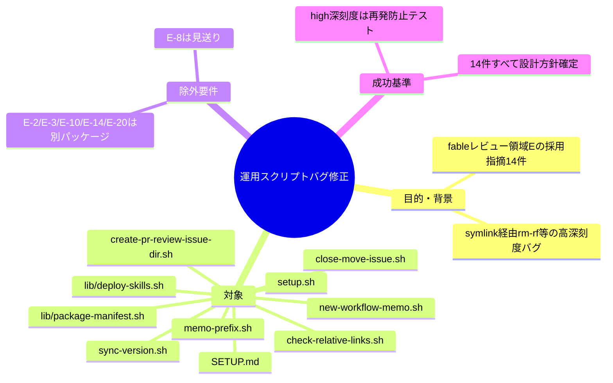
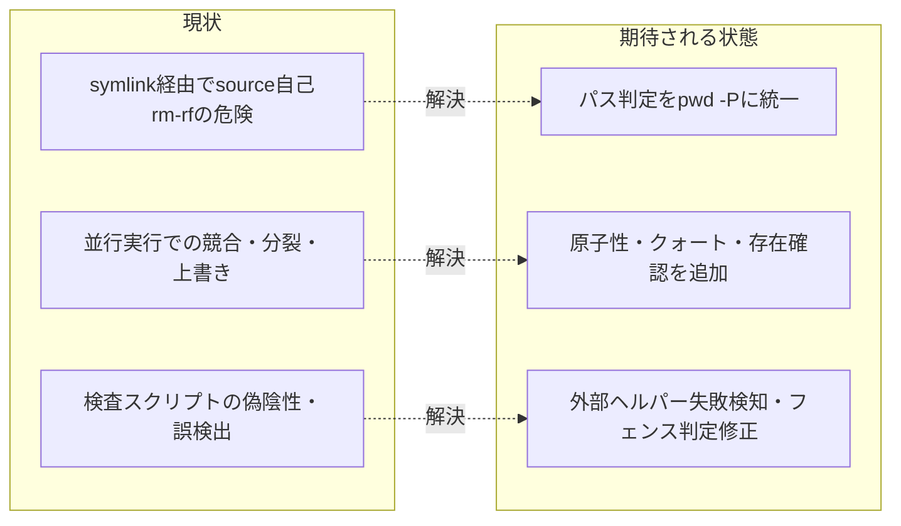

# 要求定義書: .agent-skill-chain: 運用スクリプトのバグ修正

**プロジェクト名**: .agent-skill-chain: 運用スクリプトのバグ修正
**作成日**: 2026年07月18日
**最終更新**: 2026年07月18日

> **重要**:
>
> - 要求定義書は、プロジェクトの全体像を把握するためのものです。詳細な技術仕様や実装方法は要件定義書以降で記載します。必要最低限の情報に収めることを心掛けてください。
> - **このドキュメントは常に更新**: 要求の変更や追加があった場合は、即座にこのドキュメントを更新してください。
> - **必須項目**: 以下の「必須」と明記した項目は空欄・抽象語のみで提出しないこと。

---

## 要求定義の全体像



**注意**: 本 issue は `../../00_要求定義.md`（fableレビュー起票の親 issue）で検出・採否判断済みの指摘のうち、「運用スクリプトのバグ修正」パッケージに割り当てられた14件を実装する準備として作成するサブ issue である。

---

## 1. 目的・背景

### 1.1 目的（必須）

運用スクリプト14件のバグ・堅牢性欠如を是正し、破壊的操作の安全性を確保する

### 1.2 背景

`../../01_指摘一覧.md`（領域E: 運用スクリプト）および `../../02_対応方針.md` で「採用」「採用（要設計判断）」と判定された指摘のうち、本パッケージが担当する14件の要点は以下のとおり。

| ID | 対象ファイル | 深刻度 | 対応方針 | 要約 |
|---|---|---|---|---|
| E-1 | scripts/setup.sh | high | 採用 | own判定はpwd -P（物理パス）だが削除直前の同一パス判定はpwd（論理パス）のため、symlink経由実行時に正本sourceをrm -rfしうる |
| E-4 | scripts/close-move-issue.sh | medium | 採用（要設計判断） | ファイル単位move中の失敗にロールバック・原子性がなく、issueが新旧に分裂しうる |
| E-5 | scripts/close-move-issue.sh | medium | 採用 | `${f#$issue_dir/}` が未クォートでglobメタ文字を含むパスで誤動作する |
| E-6 | scripts/create-pr-review-issue-dir.sh | medium | 採用 | hint検証`^[a-zA-Z0-9_-]+$`が自動生成される日本語ディレクトリ名を全拒否する自己矛盾 |
| E-7 | scripts/check-relative-links.sh | medium | 採用 | pythonヘルパー失敗を握りつぶし、リンク切れ検査が偽陰性（誤PASS）になる |
| E-9 | scripts/setup.sh | medium | 採用 | sqlite3の存在確認なしにDB初期化を実行し、不在環境で不可解に途中終了する |
| E-11 | scripts/new-workflow-memo.sh | low | 採用 | ファイル存在チェックと作成の間にTOCTOUがあり、同名衝突時に黙って上書きする |
| E-12 | scripts/memo-prefix.sh | low | 採用（要設計判断） | 「JSTのみから取得」と謳うが既存TZ環境変数を尊重する実装で、JST保証がない |
| E-13 | scripts/lib/deploy-skills.sh | low | 採用 | cpの実失敗を`2>/dev/null \|\| true`で握りつぶし、配備件数は無条件加算され成功報告される |
| E-15 | scripts/lib/package-manifest.sh | low | 採用 | バックアップ先の事前存在チェックがなく、同一秒の再実行で既存バックアップ内へ二重ネストする |
| E-16 | scripts/sync-version.sh | low | 採用（要設計判断） | クォート付きYAML version値（例: `"0.1.48"`）を正しく比較できず恒久不一致になりうる |
| E-17 | scripts/create-pr-review-issue-dir.sh | low | 採用（要設計判断） | 同秒並行実行でディレクトリ衝突・成果物混線、PR不明時のフォールバック表記が仕様書と不一致 |
| E-18 | SETUP.md | low | 採用 | チェックリストの記載テーブル名（execution_logs）が実テーブル名（workflow_log）と不一致、uninstallコマンド名も本文と不一致 |
| E-19 | scripts/check-relative-links.sh | low | 採用 | コードフェンス判定が```と~~~を区別せず単一フラグでトグルするため、混在時に以降のファイル全体で誤検出が連鎖する |

（E-8は`02_対応方針.md`で見送り判定のため対象外。E-2, E-3, E-10, E-14, E-20は別パッケージへ移管済み。）

### 1.3 期待される効果（必須: 1 件以上）

- **効果 1**: E-1（symlink経由のsetup.sh実行で正本sourceがrm -rfされうる高深刻度バグ）が修正され、同一パス判定がpwd -P（物理パス）に統一される。
- **効果 2**: close-move-issue.sh・create-pr-review-issue-dir.sh・new-workflow-memo.sh等、並行エージェント運用下で書き込み競合を起こしうるスクリプトの堅牢性が向上する。
- **効果 3**: check-relative-links.sh の偽陰性（誤PASS）バグが解消され、リンク切れ検査が本来の検査目的を果たす。

**現状と期待される状態の比較**:



---

## 2. 機能要件

### 2.1 既存機能の維持（該当する場合）

setup.sh・close-move-issue.sh・create-pr-review-issue-dir.sh・check-relative-links.sh・new-workflow-memo.sh・memo-prefix.sh・lib/deploy-skills.sh・lib/package-manifest.sh・sync-version.sh の既存の入出力仕様・呼び出しインターフェースは維持する（バグ修正であり機能追加ではない）。

### 2.2 新規機能要件

- 該当なし（本パッケージは新規機能の追加ではなく、既存スクリプトのバグ修正・堅牢性向上）。

---

## 3. 非機能要件

### 3.1 パフォーマンス

- 該当なし（本パッケージの修正はいずれも軽微な処理であり、性能への影響は想定しない）。

### 3.2 セキュリティ

- E-1（symlink経由のrm -rf）は破壊的操作の安全性に直結するため、修正後は同一パス判定がすべてpwd -P（または realpath）に統一されていること。

### 3.3 互換性

- 既存の呼び出し元（他スクリプト・CI・SETUP.md記載の利用手順）との互換性を維持する。E-6（hint検証緩和）・E-16（クォート値対応）はいずれも受理範囲の拡大・是正であり、既存の正常系入力を壊さないこと。

### 3.4 保守性

- 「採用（要設計判断）」判定の指摘（E-4, E-12, E-16, E-17）は、02_設計.md で対応方針（修正方式・許容するトレードオフ）を明文化してから実装に進む。

---

## 4. 制約条件

### 4.1 技術的制約

- 対象ファイルは `scripts/setup.sh`, `scripts/close-move-issue.sh`, `scripts/create-pr-review-issue-dir.sh`, `scripts/check-relative-links.sh`, `scripts/new-workflow-memo.sh`, `scripts/memo-prefix.sh`, `scripts/lib/deploy-skills.sh`, `scripts/lib/package-manifest.sh`, `scripts/sync-version.sh`, `SETUP.md` に限定する。
- 他パッケージ（例: enforcement機構実効性強化パッケージ）と対象ファイルが重複する場合は、実装着手前に進行役へ確認し、ファイル競合を回避する。
- 実装（implement-feature）着手時は、AGENTS.md の規約に従い `git worktree` で `main` から新規ブランチを切って行う。

### 4.2 既存システムとの互換性

- 各スクリプトの呼び出し元（setup.sh を呼ぶ init/upgrade フロー、close-move-issue.sh を呼ぶ close 運用、check-relative-links.sh を呼ぶ CI 等）との互換性を損なわないこと。

### 4.3 移行期間・スケジュール

- 該当なし（既存挙動の是正であり、移行期間は不要）。

---

## 5. 除外要件

- E-8（setup.sh の package.json パース）は `02_対応方針.md` で見送り判定のため対象外。
- E-2, E-3, E-10, E-14, E-20（entry_hash / write-workflow-log.sh 関連）は別パッケージへ移管済みのため対象外。
- 領域E以外（A〜D, F, G）の指摘は本パッケージの対象外。

---

## 6. 成功基準（必須: 1 件以上）

- 対象指摘14件（E-1, E-4, E-5, E-6, E-7, E-9, E-11, E-12, E-13, E-15, E-16, E-17, E-18, E-19）それぞれについて `02_設計.md` で対応方針が確定していること。
- E-1（symlink経由rm -rf）など high 深刻度項目は、再発防止のテストケース（symlink経由実行時に同一パス判定が正しく機能し、正本sourceが削除されないことを検証するテスト）が用意されていること。
- 「採用（要設計判断）」の4件（E-4, E-12, E-16, E-17）は、`02_設計.md` で採用したトレードオフ・修正方式の理由が明記されていること。
- 14件それぞれについて対象ファイルの該当行が特定され、修正差分の方針（何をどう変更するか）が `02_設計.md` または `03_実装計画.md` に記載されていること。

---

## 7. リスクと対策

### 7.1 技術的リスク

- **リスク**: 対象スクリプトが他パッケージ（enforcement機構実効性強化等）の対象ファイルと重複し、並行実装でコンフリクトが発生する。
  - **対策**: 実装着手前に `90_issues/` 配下の他サブ issue との対象ファイル重複を確認し、進行役に報告する。
- **リスク**: E-1 の修正（pwd -P への統一）が既存の呼び出しフローの前提を崩し、別の回帰を招く可能性がある。
  - **対策**: 修正後に symlink 経由・非 symlink 経由の両方で setup.sh の実行パスを検証するテストケースを用意する。

### 7.2 スケジュールリスク

- **リスク**: 該当なし（他パッケージからの依存はなく、単独で着手可能）。
  - **対策**: 該当なし

---

## 8. 参考資料

### プロジェクトドキュメント

- 親 issue（fableレビュー起票）: [`../../00_要求定義.md`](../../00_要求定義.md)
- 全指摘の詳細一覧: [`../../01_指摘一覧.md`](../../01_指摘一覧.md)
- 採用/見送り判定と理由: [`../../02_対応方針.md`](../../02_対応方針.md)

### その他の参考資料

- なし

---

## 9. 次のステップ

この要求定義書の承認後、以下のドキュメントを作成します：

- **次**: `01_要件定義.md` - 要件定義フェーズ（必要に応じて）
- **その次**: `02_設計.md` - 14件それぞれの対応方針の設計
