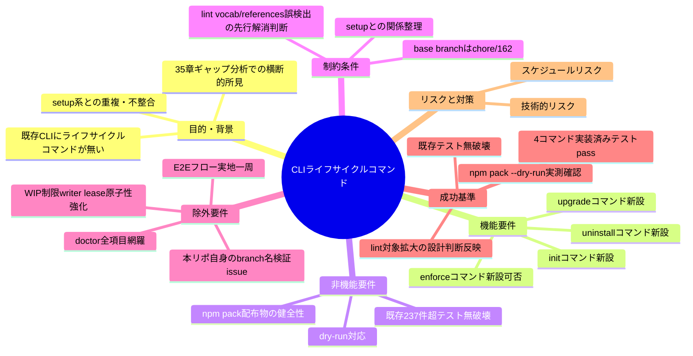
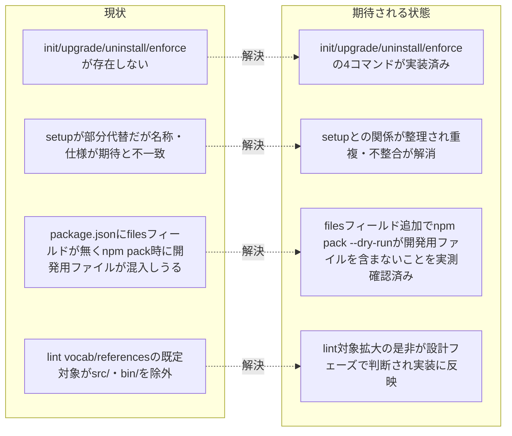

# 要求定義書: agent-skill-chain CLIライフサイクルコマンド（init/upgrade/uninstall/enforce）の新設

**プロジェクト名**: agent-skill-chain CLIライフサイクルコマンドの新設
**作成日**: 2026年07月20日
**最終更新**: 2026年07月20日

> 本ドキュメントは GitHub Issue #169（techbeansjp-free/AGENTS.md）に対応する requirement-discovery フェーズの成果物である。design-feature 以降のフェーズはスコープ外。

---

## 要求定義の全体像

**注意**: 本図は要求の全体像把握用であり、詳細は本文各節に記載する。

---

## 1. 目的・背景

### 1.1 目的（必須）

CLIに`init`/`upgrade`/`uninstall`/`enforce`のライフサイクルコマンドを新設する。

### 1.2 背景

- **現状の課題**:
  - `.agent-skill-chain/scripts/`配下の多くのスクリプト（`issue-start.sh`・`segment-start.sh`等）は、実体としてはCLI（`src/agents-md.ts`、ビルド後`bin/agents-md.js`）のサブコマンドへの薄いラッパーとして実装されている一方、消費者プロジェクトへの導入（init）・更新（upgrade）・撤去（uninstall）・強制モード切替（enforce）という基本ライフサイクルに対応するCLIサブコマンドが存在しない。
  - 実装チェックリスト（35章）とのギャップ分析（`memo/システム刷新/20260719_173313_実装チェックリスト_ギャップ一覧.md`、参照元は由来提示のみでその内容自体は本ドキュメントの以下の記述に転記済み）の横断的所見1で判明した事実として、現行CLIには`setup`系（`setup`/`setup github`/`setup labels`/`setup ruleset`）と`sync templates`/`checkpoint`/`cleanup`/`doctor`/`reconcile`のみが存在し、`init`/`upgrade`/`uninstall`/`enforce`は無い。
  - `setup`コマンドが`init`相当の機能を部分的に代替しているが、名称・引数仕様（dry-run等）が第23章の期待仕様と異なる。
  - このギャップに起因して、第21章（project policy CLI統合）・第23.2〜23.4章・第26.2章（doctor網羅性）・第30〜31章（README記載・クリーン環境検証）が軒並み未達である。

- **必要性**:
  - 消費者プロジェクトが本パッケージを採用・更新・撤去する一連のライフサイクルをCLIコマンドとして一貫させることで、手作業による導入・撤去のばらつき・事故（例：撤去時の未検査削除）を防ぐ。
  - 強制モード（enforce on/off）の存在・仕様を確定させることで、Tier1 PreToolUse hookの配線可否をCLIレベルで一元管理できるようにする。

### 1.3 期待される効果（必須: 1件以上）

- **効果1**: 消費者プロジェクトへの新規導入が`agent-skill-chain init`（dry-run対応）一つで完結し、導入手順書に頼らず再現可能になる（達成時: `init`実行後に`.agent-skill-chain/`一式・GitHubテンプレート・設定雛形が生成され、単体・結合テストで検証できる）。
- **効果2**: 既存導入プロジェクトの更新が`agent-skill-chain upgrade`で完結し、バージョン間差分の手動反映が不要になる。
- **効果3**: 導入一式の安全な撤去が`agent-skill-chain uninstall`で機械的に検査（writer lease不在・未commit差分なし等）された上で実行できる。
- **効果4**: 強制モードの切替（`enforce on`/`enforce off`）が、既存実装の有無に関わらず一貫した仕様で提供される。

**現状と期待される状態の比較**:

---

## 2. 機能要件

### 2.1 既存機能の維持（該当する場合）

- 既存CLIサブコマンド一覧（実測、`grep`によるソース調査で確認。ビルドが依存関係欠如で失敗するため`--help`実行は未実施だが、`src/agents-md.ts`・`src/commands/`の実装調査で代替確認済み）: `adr finalize` / `checkpoint` / `cleanup` / `doctor` / `gate *` / `issue resume` / `issue start` / `lease acquire|release|renew` / `lint adr|references|vocab` / `pr create` / `reconcile` / `report status` / `segment start` / `setup` / `setup github|labels|ruleset` / `sync templates` / `test run` / `verify ac-coverage|adr|artifacts|branch-name|doc-length|gate-report|template-sync|worktree-path`。これらは維持し、`init`等の新設コマンドと共存させる。
- `setup`コマンド（`src/commands/setup.ts`）の既存機能はその一部を`init`が吸収・再設計する対象であり、設計フェーズで吸収範囲・後方互換方針（`setup`を残すか非推奨化するか等）を確定する。

### 2.2 新規機能要件

- **initコマンド**: 新規消費者プロジェクトへ`.agent-skill-chain/`一式・GitHubテンプレート・設定雛形を導入する。dry-run対応必須。既存`setup`の一部機能を吸収・再設計する（吸収範囲・重複整理方針は設計フェーズで確定）。
- **upgradeコマンド**: 導入済みプロジェクトの`.agent-skill-chain/`一式・テンプレートを新バージョンへ更新する。
- **uninstallコマンド**: 導入済み一式を安全に撤去する（撤去前の検査項目は設計フェーズで確定するが、少なくとも消費者プロジェクトの独自データ・カスタマイズを不用意に破棄しない安全側動作を要する）。
- **enforceコマンド**: 強制モード（on/off）の切替。**現状調査の結論（本ドキュメント §4.2 参照）: `enforce`という名前のCLIサブコマンドは`src/commands/`・`src/agents-md.ts`のいずれにも存在しない（新設）。** ただし`.agent-skill-chain/project/自己拡張ワークフロー.md`（本リポジトリの自己拡張運用文書、由来提示のみ）が言及する「Tier1 PreToolUse hookの配線状態（enforce on/off）」という概念自体は既存の運用ドキュメント内で言及されており、hookの配線・非配線という状態は既に存在する。新設する`enforce`コマンドはこの既存概念（hook配線状態の切替）をCLIサブコマンドとして機械化するものであり、概念自体の新規定義ではなく、既存の手動運用を機械化する位置づけである。
- 上記に伴い、第21章（`.agent-skill-chain/project/`統合）・26.2章（doctor網羅性）に必要な最小限の追従を行う（本Issueのスコープに直接関係する範囲のみ。具体的には`init`/`upgrade`/`uninstall`の存在検査等、直接関係する最小項目のみdoctorへ追従し、doctor全14項目中5項目のみ検査という網羅性ギャップ全体の解消は別Issueとする）。
- **package.json `files`フィールド追加**: `npm pack`時に`src/*.ts`・`test/**/*.ts`・`tsconfig*.json`等の開発用ファイルが混入しないようにする。現状`package.json`に`files`フィールドは存在しないことを実測確認済み（本ドキュメント §4.1 参照）。
- **lint vocab / lint references のデフォルト対象見直し**: `src/lib/scan.ts`の`defaultLiveFileRoots()`は現状`AGENTS.md`・`docs/GLOSSARY.md`・`.agent-skill-chain/{standards,templates,config,schemas,scripts,ci}`のみを対象とし、`src/`・`bin/`は含まれないことを実測確認済み（本ドキュメント §4.3 参照）。デフォルト対象に`src/`・`bin/`を含めるか、除外を維持するかは、現時点で116件の禁止語誤検出・12件の§参照違反が実在するため、対象拡大前にそれらの実体解消を先に行うか、除外の理由を明文化するかを設計フェーズで判断する。

---

## 3. 非機能要件

### 3.1 パフォーマンス

- 特段の新規パフォーマンス要件はない。既存CLIコマンドと同等の実行時間であればよい。

### 3.2 セキュリティ

- `uninstall`は撤去対象・撤去範囲を明確にし、消費者プロジェクトの意図しないファイル削除（特に`git worktree remove`同様の無警告消失）を防ぐ安全側設計とする。
- `enforce`コマンドは、2026-07-15に発生した「enforce onがAgentツール名未対応でorchestratorを完全ロックアウトした事故」（由来: プロジェクト運用上の既知事故として記録されている）を再発させない設計であることを設計フェーズで確認する。

### 3.3 互換性

- 既存`setup`/`setup github`/`setup labels`/`setup ruleset`コマンドとの重複・矛盾を生じさせない。吸収するか共存させるかの方針を設計フェーズで確定する。
- 既存237件超のテストを破壊しない（`chore/162-agent-skill-chain-bootstrap`統合ブランチ上で全テストパス必須）。

### 3.4 保守性

- 各コマンドは`.agent-skill-chain/scripts/*.sh`が既存コマンド（`issue-start.sh`・`segment-start.sh`等）に対して行っているのと同様、CLIサブコマンドへの薄いラッパーとして一貫した構造を保つことが望ましい（具体的な実装方針は設計フェーズで確定）。

---

## 4. 制約条件

### 4.1 技術的制約（package.json filesフィールドの現状）

- **実測結果**: `/home/adachi/projects/AGENTS.md/.worktrees/20260720_085257-feature-169-cli-lifecycle/package.json`を確認した結果、`files`フィールドは存在しない（`grep -n "\"files\"" package.json`で該当なし）。
- したがって`npm pack --dry-run`を実行すると、`.gitignore`で明示的に除外されていない限り`src/*.ts`・`test/**/*.ts`・`tsconfig*.json`等の開発用ファイルが配布物に混入しうる状態にある。

### 4.2 技術的制約（enforceコマンドの現状調査結果）

- **調査方法**: `src/commands/`配下のファイル一覧（`adr.ts, checkpoint.ts, cleanup.ts, doctor.ts, gate.ts, issue.ts, lease.ts, lint.ts, pr.ts, reconcile.ts, report.ts, segment.ts, setup.ts, sync.ts, testing.ts, verify.ts`）、および`src/agents-md.ts`・`src/commands/`全体に対する`enforce`/`init`/`upgrade`/`uninstall`の文字列grepを実施。ビルド（`npm run build`）は`yaml`・`ajv`モジュール未解決（devの依存インストール不備、本Issueのスコープ外の環境問題）で失敗したため`node bin/agents-md.js --help`の実行はできなかったが、ソースコードの直接調査により代替確認した。
- **結論**: `enforce`という名前のコマンドファイル（`src/commands/enforce.ts`相当）は存在せず、`src/agents-md.ts`のコマンド登録にも`enforce`という文字列は出現しない。**`enforce`は既存CLIには存在せず、完全新設が必要**である。
- 一方、「enforce on/off」という**概念**（Tier1 PreToolUse hookの配線・非配線という状態）は、`.agent-skill-chain/project/自己拡張ワークフロー.md`等の運用ドキュメント内で既に言及され、本リポジトリの運用上「現状enforce off（hooks未配線）」という状態が存在すると記述されている。ただしこれはドキュメント上の運用概念であり、CLIサブコマンドとしての実装は存在しない。設計フェーズでは、この既存概念（hook配線状態）とCLIコマンド`enforce`が何を切り替えるのか（`.claude/settings.json`のPreToolUse hookエントリの配線/非配線か、それ以外の設定か）を具体的に確定する必要がある。

### 4.3 技術的制約（lint vocab/references の現状）

- **実測結果**: `src/lib/scan.ts`の`defaultLiveFileRoots()`は`AGENTS.md`・`docs/GLOSSARY.md`・`.agent-skill-chain/{standards,templates,config,schemas,scripts,ci}`のみをデフォルト走査対象とし、`src/`・`bin/`は対象外である（実装コメントに「検査対象は生きたファイル」「memo等の非追跡scratchは対象外」と明記あり）。
- Issue本文記載の通り、現時点で116件の禁止語誤検出・12件の§参照違反が実在する。デフォルト対象を広げる場合はこれらを先に解消するか、除外の妥当性を明文化するかを設計フェーズで判断する。

### 4.4 既存システムとの互換性

- base branchは`chore/162-agent-skill-chain-bootstrap`（統合ブランチ、mainではない）。本Issueの実装・設計はこのブランチの延長として行う。
- `.agent-skill-chain/scripts/*.sh`ラッパー群（`issue-start.sh`・`segment-start.sh`等）が採用している「ビルド済みCLIへの薄い委譲」パターンとの一貫性を保つ。

### 4.5 移行期間・スケジュール

- requirement-discovery → design-feature → implement-feature → verify-and-close のコマンドチェーンで対応する（Issue本文記載の進め方）。本ドキュメントはrequirement-discoveryフェーズの成果物のみを扱う。

---

## 5. 除外要件

- doctorの14項目中5項目のみ検査という網羅性ギャップ全体（第26.2章）。本Issueでは`init`/`upgrade`/`uninstall`の存在検査等、直接関係する最小項目のみ追従し、全項目網羅は別Issueとする。
- WIP制限・writer lease原子性強化（第13.2〜13.3章）。別Issue。
- このリポジトリ自身のbranch名がverify branch-nameに落ちる問題（`chore`がallowed_typesに無い）。別Issue。
- `segments.yaml`のvalidation出力に`pr`が含まれる自己矛盾。別Issue。
- E2Eフロー（Issue起票→4segment→マージ）の実地一周。別途Issue #164のフォローアップとして実施。

---

## 6. 成功基準（必須: 1件以上）

- `init`/`upgrade`/`uninstall`/`enforce`の4コマンドが実装され、それぞれの単体・結合テストがpassする。
- 既存237件超のテストが引き続き全てpassする（`chore/162-agent-skill-chain-bootstrap`統合ブランチ上で全テストパス必須。実行方法: `npm test`）。
- `package.json`の`files`フィールド追加により、`npm pack --dry-run`実行結果に開発用ファイル（`src/*.ts`・`test/**/*.ts`・`tsconfig*.json`等）が含まれないことを実測確認する。
- `lint vocab`・`lint references`のデフォルト対象の扱い（`src/`・`bin/`を含めるか除外を維持するか、含める場合は既存誤検出・違反の解消手順）について、設計フェーズでの判断結果が実装・テストに反映されている。

---

## 7. リスクと対策

### 7.1 技術的リスク

- **リスク**: `enforce`コマンドの誤設計により、2026-07-15に発生した「enforce onがAgentツール名未対応でorchestratorを完全ロックアウトした事故」（PreToolUse hookがAgentツール名に未対応で進行役をロックアウトした事故）を再発させる。
  - **対策**: 設計フェーズで、hookエントリ配線時のツール名網羅性・緊急解除手段（`!`付き`enforce off`等）の確保を設計要件に明記する。
- **リスク**: `init`が既存`setup`と重複・競合し、消費者プロジェクトで二重導入・設定不整合が起きる。
  - **対策**: 設計フェーズで`setup`との吸収・共存方針を明確に確定し、後方互換テストを実装計画に含める。
- **リスク**: lint vocab/referencesのデフォルト対象を`src/`・`bin/`へ拡大した場合、既存116件の禁止語誤検出・12件の§参照違反が一斉にCI/監査でFAILし、既存の開発フローを不必要に止める。
  - **対策**: 対象拡大前に誤検出・違反の実体解消、または除外理由の明文化のいずれかを設計フェーズで判断し、いきなり対象拡大しない。

### 7.2 スケジュールリスク

- **リスク**: `init`/`upgrade`/`uninstall`/`enforce`の4コマンドを同時に設計・実装する範囲が広く、既存237件超のテストとの整合を都度確認する工数が増大する。
  - **対策**: 設計フェーズ（`design-feature`）で各コマンドの実装順序・依存関係を明確化し、実装計画（`03_実装計画.md`）でタスク分解する。

---

## 8. 参考資料

### プロジェクトドキュメント

- GitHub Issue #169（techbeansjp-free/AGENTS.md）: 本要求定義の起点。目的・対象範囲・成功基準の原文はIssue本文に記載されており、本ドキュメントはその内容を完全に転記・具体化したものである。
- `AGENTS.md`（本リポジトリ憲法、当該ブランチ版）: 4セグメント・4ゲート、ディレクトリ構成、GitHub配布・マルチAI対応の正本。

### その他の参考資料

- `src/commands/`（`adr.ts, checkpoint.ts, cleanup.ts, doctor.ts, gate.ts, issue.ts, lease.ts, lint.ts, pr.ts, reconcile.ts, report.ts, segment.ts, setup.ts, sync.ts, testing.ts, verify.ts`）: 既存CLIコマンド実装の実体調査結果。
- `src/lib/scan.ts`: lint vocab/referencesのデフォルト走査対象実装。
- `package.json`: `files`フィールド不在の実測確認元。

---

## 9. 次のステップ

この要求定義書の承認後、以下のドキュメントを作成する：

- **次**: [`01_要件定義.md`](./01_要件定義.md) - 要件定義フェーズ（ユーザーストーリー・BDDシナリオ・受け入れ基準）
