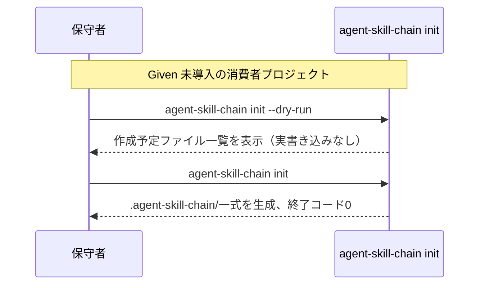

# 要件定義書: agent-skill-chain CLIライフサイクルコマンド（init/upgrade/uninstall/enforce）

**プロジェクト名**: agent-skill-chain CLIライフサイクルコマンドの新設
**作成日**: 2026年07月20日
**最終更新**: 2026年07月20日

> **重要**: このドキュメントは常に更新。実装内容と常に同期させる。

---

## 1. 概要

### 1.1 システム概要

本パッケージ（`agent-skill-chain`、CLIエントリポイント`bin/agents-md.js`）は、消費者プロジェクトへGitHub Flow標準語彙に基づく開発ワークフロー規律（4セグメント・4ゲート）を導入するCLI＋憲法（AGENTS.md）パッケージである。本要件は、消費者プロジェクトへの導入（init）・更新（upgrade）・撤去（uninstall）・強制モード切替（enforce）という基本ライフサイクルをCLIコマンドとして提供する部分を対象とする。

### 1.2 用語集

| 用語 | 説明 |
| --- | --- |
| 消費者プロジェクト | 本パッケージ（agent-skill-chain）を導入する対象リポジトリ。本パッケージ自身のリポジトリ（自己拡張）とは区別する。 |
| 導入一式 | `.agent-skill-chain/`配下のスクリプト・設定・テンプレート・スキーマ、および展開先の`.github/`一式など、`init`が生成する成果物全体。 |
| 強制モード（enforce） | Tier1 PreToolUse hookが`.claude/settings.json`に配線され、危険操作を即時reject（`exit 2`）する状態か否かを指す運用概念。`enforce on`で配線、`enforce off`で非配線とする。 |
| dry-run | 実際にファイルを書き込まず、実行結果（作成・更新・削除されるファイル一覧等）のみを表示するモード。 |

---

## 2. 機能要件

### 2.1 ユーザーストーリー

#### ストーリー1: 新規消費者プロジェクトへの導入

- **As a** 消費者プロジェクトの保守者
- **I want to** `agent-skill-chain init`を実行して`.agent-skill-chain/`一式・GitHubテンプレート・設定雛形を導入したい
- **So that** 手作業でのファイルコピー・設定なしに、本パッケージの開発ワークフロー規律を自プロジェクトへ再現可能に適用できる

**受け入れ基準**:

- `init`実行後、消費者プロジェクトに`.agent-skill-chain/`配下の標準構成（`standards/`・`templates/`・`config/`・`schemas/`・`scripts/`・`ci/`・`adapters/`）が生成されている。
- `init --dry-run`（またはそれに相当するオプション）実行時は、実ファイルを書き込まず、作成予定のファイル一覧が標準出力に表示される。
- 対象プロジェクトの既存`docs/`資産と衝突する場合、非破壊のため上書きせず、理由付きエラーで停止する（既存`setup.sh`が持つ衝突検知動作を`init`でも踏襲する）。

#### ストーリー2: 導入済みプロジェクトの更新

- **As a** 既に本パッケージを導入済みの消費者プロジェクトの保守者
- **I want to** `agent-skill-chain upgrade`を実行して`.agent-skill-chain/`一式・テンプレートを新バージョンへ更新したい
- **So that** バージョン間の差分を手動で追跡・反映する必要がなくなる

**受け入れ基準**:

- `upgrade`実行後、`.agent-skill-chain/`配下の正本アセット（`standards/`・`templates/`・`config/`・`schemas/`・`scripts/`・`ci/`・`adapters/`）がパッケージの現行バージョンの内容へ更新されている。
- 消費者プロジェクト固有のカスタマイズ（`.agent-skill-chain/project/`配下）は`upgrade`によって上書き・削除されない。
- `upgrade`実行前後でのバージョン差分（何が変わったか）が標準出力に要約表示される。

#### ストーリー3: 導入一式の安全な撤去

- **As a** 本パッケージの採用をやめる消費者プロジェクトの保守者
- **I want to** `agent-skill-chain uninstall`を実行して導入一式を安全に撤去したい
- **So that** 撤去漏れ・意図しない削除事故を機械的に防ぎながらクリーンに撤去できる

**受け入れ基準**:

- `uninstall`実行前に、撤去対象ファイル一覧を提示し、消費者プロジェクト固有のカスタマイズ（`.agent-skill-chain/project/`配下等）を含むかどうかを明示する。
- `uninstall`は未commit差分がある状態での無警告削除を行わない（既存`cleanup.sh`が持つ「writer lease不在・未commit/未push無し・PR完了済みを検査」という安全確認パターンを踏襲する）。
- `uninstall --dry-run`実行時は実削除を行わず、削除予定のファイル一覧のみを表示する。

#### ストーリー4: 強制モードの切替

- **As a** 消費者プロジェクトの保守者
- **I want to** `agent-skill-chain enforce on`/`agent-skill-chain enforce off`を実行して強制モードを切り替えたい
- **So that** Tier1 PreToolUse hookの配線状態を、手動での`.claude/settings.json`編集なしにCLIで一貫して管理できる

**受け入れ基準**:

- `enforce on`実行後、`.claude/settings.json`にPreToolUse hookエントリが配線される。
- `enforce off`実行後、当該hookエントリが解除される。
- `enforce on`が特定のツール名（例: Agentツール）を網羅せず進行役を意図せずロックアウトする既知の事故パターン（2026-07-15の事故）を再発させないよう、`enforce on`実行時に配線対象ツール名の網羅性を確認する。
- 緊急時に`enforce off`相当の解除ができる手段（例: `!`付きの緊急解除コマンド）が用意されている。

#### ストーリー5: npm配布物から開発用ファイルを除外する

- **As a** 本パッケージのメンテナー
- **I want to** `package.json`に`files`フィールドを追加したい
- **So that** `npm publish`時に`src/*.ts`・`test/**/*.ts`・`tsconfig*.json`等の開発用ファイルが配布物へ混入しないようにできる

**受け入れ基準**:

- `package.json`に`files`フィールドが追加され、配布対象（少なくとも`bin/`・`.agent-skill-chain/`・`AGENTS.md`・`README.md`・`LICENSE`等の実行時必須ファイル）のみを含む。
- `npm pack --dry-run`実行結果に`src/*.ts`・`test/**/*.ts`・`tsconfig*.json`が含まれないことを実測確認する。

#### ストーリー6: lint vocab/referencesの走査対象を判断する

- **As a** 本パッケージのメンテナー
- **I want to** `lint vocab`・`lint references`のデフォルト走査対象に`src/`・`bin/`を含めるべきかを設計フェーズで判断したい
- **So that** 既存116件の禁止語誤検出・12件の§参照違反を無秩序にCI/監査でFAILさせることなく、対象拡大の是非を明確な根拠に基づいて決定できる

**受け入れ基準**:

- 設計フェーズ（`02_設計.md`）に、`src/`・`bin/`を対象に含めるか除外を維持するかの判断結果と根拠が記載されている。
- 対象拡大を選択する場合、既存116件の禁止語誤検出・12件の§参照違反を先に解消する実装計画（`03_実装計画.md`）が記載されている。
- 除外維持を選択する場合、除外の理由（自明でない設計判断であることを踏まえた根拠）が`02_設計.md`に明記されている。

### 2.2 BDD ユースケース

#### ユースケース1: init（新規導入）

**シナリオ1: dry-runで導入内容を確認する**

```gherkin
Feature: init コマンド
  Scenario: dry-runで導入内容を確認する
    Given 本パッケージが未導入の消費者プロジェクトのルートディレクトリにいる
    When `agent-skill-chain init --dry-run` を実行する
    Then 実ファイルは一切作成されない
    And 作成予定のファイル一覧（.agent-skill-chain/ 配下・.github/ テンプレート・設定雛形）が標準出力に表示される
```

**シナリオ2: 実際に導入する**

```gherkin
Feature: init コマンド
  Scenario: 実際に導入する
    Given 本パッケージが未導入の消費者プロジェクトのルートディレクトリにいる
    When `agent-skill-chain init` を実行する
    Then .agent-skill-chain/ 配下に standards/・templates/・config/・schemas/・scripts/・ci/・adapters/ が生成される
    And 終了コードが 0 である
```

**シナリオ3: 既存docs/資産と衝突する場合**

```gherkin
Feature: init コマンド
  Scenario: 既存docs/資産と衝突する場合は非破壊で停止する
    Given 消費者プロジェクトの docs/ に本パッケージが生成しようとするファイルと同名のファイルが既に存在する
    When `agent-skill-chain init` を実行する
    Then 既存ファイルは上書きされない
    And 日本語の理由付きエラーメッセージとともに終了コードが 0 以外で停止する
```

**処理フロー**:



#### ユースケース2: upgrade（更新）

**シナリオ1: 導入済み一式を最新化する**

```gherkin
Feature: upgrade コマンド
  Scenario: 導入済み一式を最新化する
    Given 本パッケージの旧バージョンが導入済みの消費者プロジェクトにいる
    When `agent-skill-chain upgrade` を実行する
    Then .agent-skill-chain/ 配下の正本アセット（standards/・templates/・config/・schemas/・scripts/・ci/・adapters/）が現行バージョンの内容へ更新される
    And .agent-skill-chain/project/ 配下のプロジェクト固有カスタマイズは変更されない
```

**シナリオ2: バージョン差分を提示する**

```gherkin
Feature: upgrade コマンド
  Scenario: バージョン差分を提示する
    Given 本パッケージの旧バージョンが導入済みの消費者プロジェクトにいる
    When `agent-skill-chain upgrade` を実行する
    Then 更新前後の差分要約が標準出力に表示される
```

#### ユースケース3: uninstall（撤去）

**シナリオ1: dry-runで撤去内容を確認する**

```gherkin
Feature: uninstall コマンド
  Scenario: dry-runで撤去内容を確認する
    Given 本パッケージが導入済みの消費者プロジェクトにいる
    When `agent-skill-chain uninstall --dry-run` を実行する
    Then 実ファイルは一切削除されない
    And 削除予定のファイル一覧が標準出力に表示される
```

**シナリオ2: 未commit差分がある場合は安全側で停止する**

```gherkin
Feature: uninstall コマンド
  Scenario: 未commit差分がある場合は安全側で停止する
    Given .agent-skill-chain/ 配下に未commitの変更がある
    When `agent-skill-chain uninstall` を実行する
    Then 削除は実行されない
    And 未commit差分が存在する旨のエラーメッセージとともに終了コードが 0 以外で停止する
```

#### ユースケース4: enforce（強制モード切替）

**シナリオ1: enforce onでhookを配線する**

```gherkin
Feature: enforce コマンド
  Scenario: enforce onでPreToolUse hookを配線する
    Given .claude/settings.json にPreToolUse hookが未配線の消費者プロジェクトにいる
    When `agent-skill-chain enforce on` を実行する
    Then .claude/settings.json にPreToolUse hookエントリが追加される
    And 配線対象のツール名一覧（Agentツールを含む）が網羅的であることが確認できる
```

**シナリオ2: enforce offでhookを解除する**

```gherkin
Feature: enforce コマンド
  Scenario: enforce offでPreToolUse hookを解除する
    Given .claude/settings.json にPreToolUse hookが配線済みの消費者プロジェクトにいる
    When `agent-skill-chain enforce off` を実行する
    Then .claude/settings.json からPreToolUse hookエントリが解除される
```

#### ユースケース5: package.json files フィールド

**シナリオ1: npm pack --dry-runで開発用ファイルが含まれないことを確認する**

```gherkin
Feature: package.json files フィールド
  Scenario: npm pack --dry-runで開発用ファイルが含まれないことを確認する
    Given package.json に files フィールドが追加されている
    When `npm pack --dry-run` を実行する
    Then 出力ファイル一覧に src/*.ts が含まれない
    And 出力ファイル一覧に test/**/*.ts が含まれない
    And 出力ファイル一覧に tsconfig*.json が含まれない
```

### 2.3 ビジネスルール

- `init`/`upgrade`/`uninstall`はいずれも既存`setup`系コマンド（`setup`/`setup github`/`setup labels`/`setup ruleset`）と機能重複・矛盾を生じさせてはならない。重複部分は`init`が吸収するか、`setup`を薄いラッパーとして残すかを設計フェーズで確定する。
- `uninstall`は「writer lease不在・未commit/未push無し」の安全確認を経ずに実ファイル削除を行ってはならない（`cleanup.sh`が既存worktree削除で採用している安全確認パターンと同水準を要求する）。
- `enforce`コマンドは、既存の「enforce on/off」という運用概念（Tier1 PreToolUse hookの配線状態）を機械化するものであり、概念そのものの再定義はしない。

---

## 3. 非機能要件

### 3.1 パフォーマンス要件

- 各コマンドの実行時間は既存CLIコマンド（`setup`・`cleanup`等）と同等の範囲に収まること（特段の性能要件はない）。

### 3.2 セキュリティ要件

- `uninstall`・`enforce off`が誤って消費者プロジェクトの意図しないファイル・設定を破壊しないこと。
- `enforce on`が2026-07-15の事故（Agentツール名未対応による進行役ロックアウト）を再発させない設計であることを設計フェーズで確認すること。

### 3.3 ユーザビリティ要件

- 各コマンドは`--dry-run`相当のオプションを持ち、実行前に変更内容を確認できること。
- エラー発生時は日本語で理由を明示すること（既存`setup.sh`の衝突エラー方針を踏襲）。

### 3.4 可用性要件

- 特段の可用性要件はない（ローカルCLIコマンドであり常時稼働を要さない）。

---

## 4. 外部インターフェース要件

### 4.1 API要件

- CLIサブコマンドとして`init`・`upgrade`・`uninstall`・`enforce on`/`enforce off`を`src/agents-md.ts`のコマンド登録へ追加する。
- 各コマンドは`.agent-skill-chain/scripts/*.sh`ラッパーパターン（例: `issue-start.sh`が`agent-skill-chain issue start`へ委譲する構造）と一貫させ、対応するラッパースクリプトを設ける方針は設計フェーズで確定する。

### 4.2 データ形式要件

- `package.json`の`files`フィールドは npm 標準仕様（配列形式のglobパターン）に従う。

---

## 5. 制約事項

- base branchは`chore/162-agent-skill-chain-bootstrap`（統合ブランチ、mainではない）。
- 既存237件超のテストを破壊しないこと。
- `enforce`は既存CLIに存在しないため完全新設だが、「enforce on/off」という運用概念自体は既存ドキュメントで言及されており、概念の新規定義ではなく機械化である（詳細は`00_要求定義.md` §4.2参照）。
- lint vocab/referencesのデフォルト対象拡大は、既存116件の禁止語誤検出・12件の§参照違反の扱いを設計フェーズで判断してから実施すること。

---

## 6. 参考資料

### プロジェクトドキュメント

- [`00_要求定義.md`](./00_要求定義.md) - 要求定義

### その他の参考資料

- GitHub Issue #169（techbeansjp-free/AGENTS.md）

---

## 7. 前のステップ

この要件定義書は、以下のドキュメントを基に作成されている：

- **前**: [`00_要求定義.md`](./00_要求定義.md) - 要求定義フェーズ

---

## 8. 次のステップ

この要件定義書の承認後、以下のドキュメントを作成する（design-feature フェーズ、本Issueの本requirement-discoveryフェーズのスコープ外）：

- **次**: `02_設計.md` - 設計フェーズ
