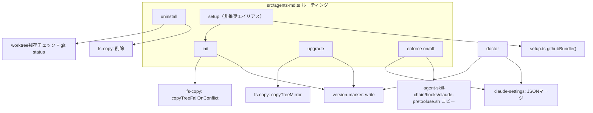
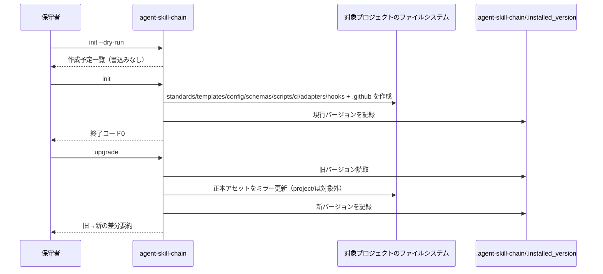
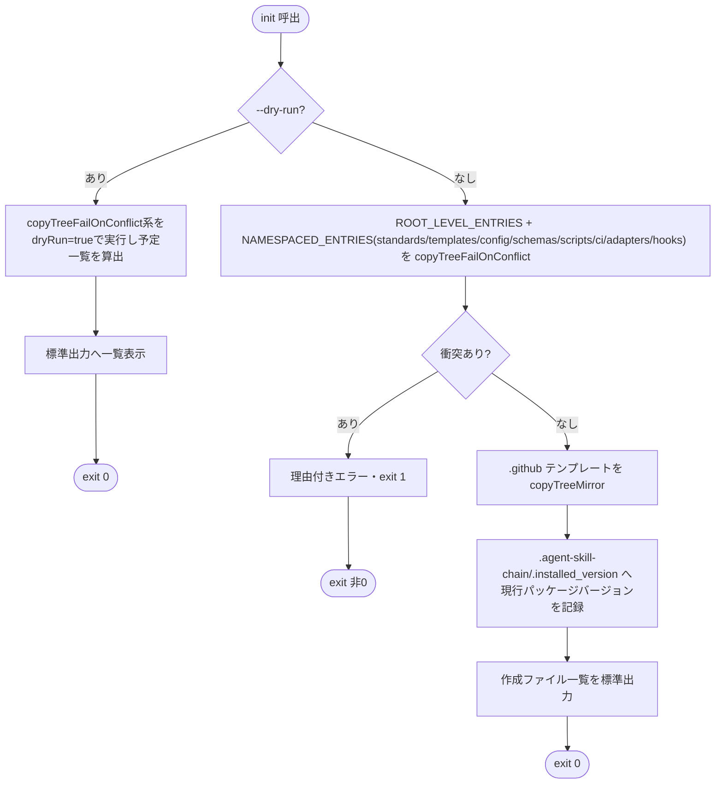
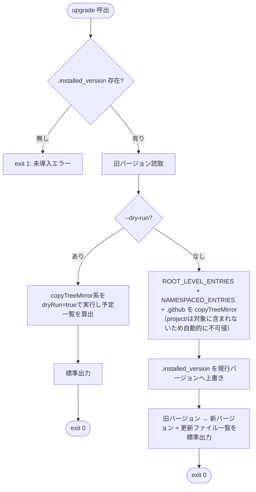
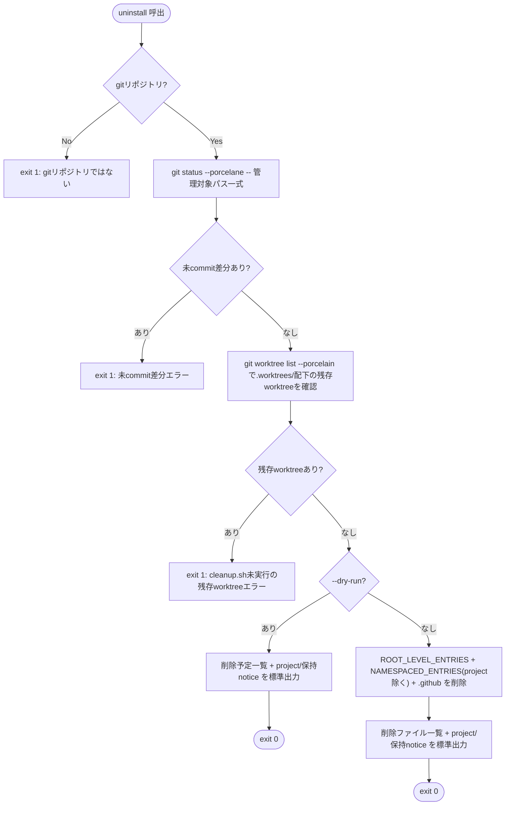
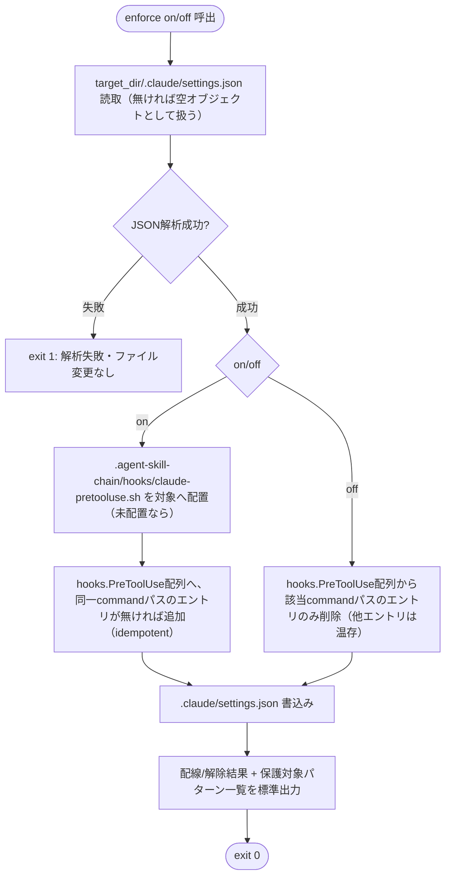

# 設計書: agent-skill-chain CLIライフサイクルコマンド（init/upgrade/uninstall/enforce）

**プロジェクト名**: agent-skill-chain CLIライフサイクルコマンドの新設
**作成日**: 2026年07月20日
**最終更新**: 2026年07月20日

> standardモード（`00_要求定義.md` frontmatter `mode: standard`）。本設計フェーズは`init`/`upgrade`/`uninstall`/`enforce`4コマンドの実装契約・`setup`との関係・`package.json` `files`・lint対象拡大可否を確定する。実体コード（`.ts`/`.sh`/`.json`）は変更しない。GitHub Issue #169対応。

---

## 1. 設計概要

### 1.1 設計方針

`.agent-skill-chain/scripts/*.sh`が既存CLIサブコマンドへの薄いラッパーとして実装しているパターンを踏襲し、`init`/`upgrade`/`uninstall`/`enforce`の4コマンドを`src/commands/`へ追加、対応する`.agent-skill-chain/scripts/{init,upgrade,uninstall,enforce}.sh`ラッパーを新設する。`init`は既存`setup`コマンドのローカルファイル操作部分（`gh` API呼び出しを伴わない部分）を吸収し、`setup`（bare）は非推奨エイリアスとして残す。`enforce`は本リポジトリ自身の運用文書（`.agent-skill-chain/project/自己拡張ワークフロー.md`）が言及する「Tier1 PreToolUse hook配線状態」という概念を、消費者プロジェクト向けに新規設計する（後述§2.5 ADR-3のとおり、本パッケージには配布可能なPreToolUse hookスクリプト資産が現時点で存在しないため、`enforce`の実装は当該資産の新設を伴う）。

### 1.2 設計原則（本プロジェクトで適用するもの）

- **UNIX哲学**: 各コマンドはちょうど1つの状態遷移（未導入→導入済み／旧版→新版／導入済み→未導入／hook非配線→配線 or その逆）だけを行う。既存`.sh`ラッパーパターンを維持する。
- **単一責務**: `init`=ローカルファイル生成、`setup github/labels/ruleset`=GitHub API連携、`enforce`=hook配線のみ、を分離する。
- **既定は常に安全側（AGENTS.md I8）**: `uninstall`は未commit差分・残存worktreeがあれば削除しない。`enforce on`はBashツールの特定コマンドパターンのみに反応し、非Bashツール（Agent等）は構造的に評価対象外とする。
- **明確な境界**: `init`/`upgrade`/`uninstall`はファイルシステム操作のみ、`enforce`は`.claude/settings.json`のJSONマージのみ、`doctor`拡張は読み取り専用検査のみ、と責務を分離する。

---

## 2. アーキテクチャ設計

### 2.1 責務・境界・参照関係

#### 2.1.1 責務一覧

| コンポーネント | 責務（1文） |
| --- | --- |
| `src/commands/init.ts`（新設） | 消費者プロジェクトへ`.agent-skill-chain/`一式・`.github/`テンプレートを非破壊で導入し、`--dry-run`と導入バージョン記録を提供する |
| `src/commands/upgrade.ts`（新設） | 導入済み正本アセット（`project/`を除く）を現行パッケージバージョンへミラー更新し、差分要約を表示する |
| `src/commands/uninstall.ts`（新設） | 安全確認（未commit差分・残存worktree）を経てから導入一式を削除し、`project/`配下は常に保持する |
| `src/commands/enforce.ts`（新設） | `.claude/settings.json`のPreToolUse hookエントリ（Bashツール限定・危険git操作パターンのみ）を配線/非配線する |
| `.agent-skill-chain/hooks/claude-pretooluse.sh`（新設アセット） | `enforce on`が配線するhook本体。`tool_name==Bash`のコマンド文字列のみを検査し、`git worktree remove`直接実行・命名規約違反ブランチ作成を`exit 2`で拒否する |
| `src/lib/claude-settings.ts`（新設lib） | `.claude/settings.json`の読み取り・PreToolUse hookエントリの追加/削除をJSONマージで行う（他設定を破壊しない） |
| `src/lib/version-marker.ts`（新設lib） | `.agent-skill-chain/.installed_version`（導入済みパッケージバージョンの記録）の読み書き |
| `src/commands/setup.ts`（既存・変更） | bare`setup`を非推奨警告付きの後方互換エイリアスとして維持（`init`+`setup github`相当の完全実行）。`setup github`/`setup labels`/`setup ruleset`は変更しない |
| `src/commands/doctor.ts`（既存・最小拡張） | `init`導入済みか（`.installed_version`存在）・`enforce`配線状態（情報表示のみ）の2項目を追加する |
| `package.json`（変更） | `files`フィールド追加により配布物を実行時必須ファイルのみへ限定する |
| `src/lib/scan.ts`（変更なし・設計判断のみ） | `defaultLiveFileRoots()`は現状維持（`src/`/`bin/`を含めない）。根拠は§2.5 ADR-5 |

#### 2.1.2 境界

- **入力**: 各コマンドは`[target_dir]`（省略時`process.cwd()`）と`--dry-run`（`init`/`upgrade`/`uninstall`）、`on`/`off`（`enforce`）を位置引数・フラグとして受け取る。認証情報は扱わない（`enforce`はローカルファイル操作のみ、GitHub API呼び出しを行わない）。
- **出力**: 成功時は標準出力へ実行結果（作成/更新/削除ファイル一覧、または dry-run 時は予定一覧）、終了コード0。失敗時は標準エラー出力へ日本語理由、終了コード1以上。
- **他責務との境界**: `init`は`.github/`テンプレートのローカルミラーのみを行い、GitHub API（ラベル・ruleset）には触れない（既存`setup github`/`setup labels`/`setup ruleset`の責務のまま）。`enforce`は`permissions.deny`等`.claude/settings.json`の他フィールドを一切変更しない（自身が追加したPreToolUse hookエントリの追加/削除のみ）。`uninstall`は`.agent-skill-chain/project/`配下を削除対象に含めない。

#### 2.1.3 参照関係

- `init`/`upgrade`/`uninstall` → `src/lib/paths.ts`（`ROOT_LEVEL_ENTRIES`/`NAMESPACED_ENTRIES`定義を共有ライブラリへ抽出）→ `src/lib/fs-copy.ts`（`copyTreeFailOnConflict`/`copyTreeMirror`に`dryRun`オプションを追加）。
- `init`/`upgrade` → `src/lib/version-marker.ts`（`.installed_version`書込み）。
- `upgrade`/`doctor` → `src/lib/version-marker.ts`（読み取り）。
- `enforce` → `src/lib/claude-settings.ts` → `.claude/settings.json`（対象プロジェクト側）。
- `enforce on` → `.agent-skill-chain/hooks/claude-pretooluse.sh`（配布アセット、`resolveAsset()`経由で解決）をコピー配置。
- `setup`（bare、非推奨） → 内部で`init`実行結果 + 既存`githubBundle()`を呼び出す（後方互換維持）。`setup github/labels/ruleset`は変更なし。
- 循環参照なし（`init`/`upgrade`/`uninstall`/`enforce` → lib → ファイルシステムの一方向）。

### 2.2 システムアーキテクチャ

- **採用パターン**: 既存CLIと同一の「Command関数（`src/commands/*.ts`）+ 薄い`.sh`ラッパー」パターン。新規パターン導入なし。
- **根拠**: AGENTS.md §保守性「各スクリプトはちょうど1つの状態遷移だけを行う」（UNIX哲学）と、01_要件定義§4.1「`.agent-skill-chain/scripts/*.sh`ラッパーパターンと一貫させる」に直接従う（evidence_source: existing_code = 既存23個の`.sh`ラッパー全て同一パターン）。

#### 2.2.1 アーキテクチャ図



### 2.3 コンポーネント構成

- **`src/commands/`層**: `init.ts`/`upgrade.ts`/`uninstall.ts`/`enforce.ts`を新設。既存`setup.ts`の`ROOT_LEVEL_ENTRIES`/`NAMESPACED_ENTRIES`定数を`src/lib/paths.ts`（または新設`src/lib/asset-manifest.ts`）へ移し、`init`/`upgrade`/`uninstall`/`setup`が共有する（重複定義の回避）。
- **`src/lib/`層**: `fs-copy.ts`に`dryRun: boolean`オプションを追加（既存2関数のシグネチャ拡張、戻り値の`CopyResult`に`planned: boolean`を追加）。新設`claude-settings.ts`（JSON読み書き・PreToolUse配列へのidempotentな追加/削除）。新設`version-marker.ts`（`.agent-skill-chain/.installed_version`の読み書き、1行の semver 文字列）。
- **配布アセット層**: 新設`.agent-skill-chain/hooks/claude-pretooluse.sh`（実行可能bashスクリプト、後述§3.4）。既存`adapters/`（役割実行変換専用、roles.yaml用途）とは責務が異なるため同居させず新規`hooks/`名前空間とする。

### 2.4 データフロー

発行するイベント（「起きた事実」）: `AssetsInstalled`（`init`成功）→`AssetsUpgraded`（`upgrade`成功）→`AssetsRemoved`（`uninstall`成功）／`EnforceEnabled`/`EnforceDisabled`（`enforce on/off`成功）。イベントバスは持たず、CLIの終了コードと標準出力メッセージがこの事実を表現する（他コマンドと同一パターン）。



### 2.5 横断設計判断（ADR）

#### ADR-1: `init`は`setup`のローカルファイル操作部分を吸収し、`setup`（bare）は非推奨エイリアスとして後方互換維持する

- **コンテキスト**: `setup`（bare）は現状「ROOT_LEVEL_ENTRIES/NAMESPACED_ENTRIESのローカルコピー」+「`githubBundle()`（sync templates + gh API によるlabels/ruleset適用）」を1回で実行する。`init`の受け入れ基準（`--dry-run`・非破壊衝突検知）はローカルファイル操作のみを対象とし、gh API呼び出しの成否は問わない。
- **検討した選択肢**: (A) `setup`を即削除し`init`へ完全置換（既存自動化・テストを破壊）。(B) `init`をローカルファイル操作専用として新設し、`setup`（bare）は非推奨警告付きで現行動作を維持、`setup github/labels/ruleset`は無変更。(C) `init`と`setup`を完全に独立実装し重複コードを許容する。
- **決定**: (B)。
- **根拠**: 01_要件定義§ビジネスルール「重複部分は`init`が吸収するか、`setup`を薄いラッパーとして残すかを設計フェーズで確定する」に対し、既存237件超のテスト（`test/integration/setup.test.ts`含む）を破壊しない後方互換性（00_要求定義§3.2）を優先する。`init`のBDD（dry-run・非破壊衝突検知）はgh API呼び出しを含まないため、gh認証が無い環境でも`init`単体は完結できる（オフライン導入の実現）。evidence_source: existing_code（`setup.ts`のROOT_LEVEL_ENTRIES/NAMESPACED_ENTRIESとgithubBundle()の分離が既に構造上可能）。
- **帰結**: `setup`実行時に「`setup`は非推奨です。`init`（+ 必要なら`setup github`）を使用してください」という警告をstderrへ出力したうえで、従来どおりの処理（ローカルコピー＋githubBundle）を実行し続ける。`setup github`/`setup labels`/`setup ruleset`はコード変更なし。

#### ADR-2: `enforce`が配線するPreToolUse hookは、`tool_name=="Bash"`のコマンド文字列のみに反応する狭い安全網とし、ツール名の一律allow/denyリストを持たない

- **コンテキスト**: 2026-07-15、旧世代の`enforcement`機構（本パッケージのゼロベース再設計前、`.agent-skill-chain/source/enforcement/`に存在していた仕組み）で、PreToolUse hookのツール名網羅性不足によりAgentツール呼び出しが拒否され、進行役が完全ロックアウトされた事故が発生している（`.agent-skill-chain/project/自己拡張ワークフロー.md`に記録あり）。新設する`enforce`が同じ事故を再発させない設計が01_要件定義§3.2の必須要件。加えて、本パッケージの新設計はAGENTS.md I5「権限はcredential/GitHub権限分離で担保し、ツール名の一律denyでは実装しない」を明言しており（`roles.yaml`冒頭コメントで再確認済み）、`enforce`を「全ツール呼び出しを対象とするallow/denyリスト」として設計すること自体がこの憲法方針と矛盾する。
- **検討した選択肢**: (A) 全ツール名を対象に、既知のツール名を網羅したallowlistで判定する（2026-07-15と同型のリスク: 新ツール追加のたびに追随漏れが起き得る）。(B) `tool_name`フィールドを`Bash`に固定したmatcherのみを設置し、Bashコマンド文字列内の危険パターン（`git worktree remove`直接実行・命名規約違反ブランチ作成）のみを正規表現で拒否する。Agent/Task等の非Bashツールはmatcherの時点で評価対象外となり、原理的に拒否され得ない。(C) hookを設置せず`enforce`を config フラグのみのトグル（実効性なし）にする。
- **決定**: (B)。
- **根拠**: (B)は「ツール名の完全な列挙」を要求しない構造的な安全設計であり、2026-07-15と同型の「新ツール名の追随漏れ」というバグクラス自体を発生させない（Agentツールはそもそも`tool_name=="Bash"`に一致しないため評価すらされない）。(A)は本質的に同じ脆弱性を再導入する。(C)は01_要件定義のBDD（`.claude/settings.json`へのhookエントリ配線・危険操作の拒否）を満たさない。evidence_source:既知の事故記録（自己拡張ワークフロー.md）+ AGENTS.md I5（ツール名一律deny不採用の明文規定）。
- **帰結**: `enforce`が保護する対象は「`git worktree remove`の直接実行（`cleanup.sh`/`agent-skill-chain cleanup`を経由しない削除）」と「命名規約に違反するブランチ作成」の2種類のみに限定する（旧世代のR1〜R9のような広範なルール集合は本Issueでは新設しない）。対象外の全てのBashコマンド・全ての非Bashツールは無条件で通過する（fail-open）。

#### ADR-3: `enforce`が配線するhookスクリプト本体（`.agent-skill-chain/hooks/claude-pretooluse.sh`）は本Issueで新設する配布アセットであり、既存の廃止済み`enforcement/`機構の復元ではない

- **コンテキスト**: 本パッケージのゼロベース再設計（`chore/162-agent-skill-chain-bootstrap`の起点）により、旧世代の`.agent-skill-chain/source/enforcement/`一式（PreToolUse.sh・audit.sh等）は配布物から失われている。現在の`.agent-skill-chain/{adapters,scripts,ci,...}`にはPreToolUse hookスクリプトが一切存在しない（実測: `grep -rl "PreToolUse" .agent-skill-chain/ src/ bin/`は0件）。01_要件定義のBDD（`.claude/settings.json`にPreToolUse hookエントリが追加される）を満たすには、配線対象となるスクリプト実体が必要である。
- **検討した選択肢**: (A) 旧`enforcement/`一式を丸ごと復元し配布アセット化する（R1〜R9全項目、audit.sh、settings.json雛形一式）。(B) ADR-2で確定した狭い安全網（2ルールのみ）を実装する新規の最小スクリプトを1本新設する。(C) `enforce`コマンドを設計するが、hookスクリプト自体の実装は別Issueへ先送りし、本Issueでは`.claude/settings.json`へのプレースホルダ的なエントリ配線のみ行う（スクリプト不在のためhookは常にno-opで通過）。
- **決定**: (B)。
- **根拠**: (A)は旧世代機構全体の複雑性（R1〜R9・audit.sh・grandfather allowlist等）を持ち込み、本Issueのスコープ（00_要求定義§5除外要件が定める「doctor全項目網羅」「WIP制限」等の除外方針）と釣り合わない過大な実装になる。(C)は01_要件定義のBDD「配線対象のツール名一覧が網羅的であることが確認できる」「危険操作が拒否される」という実効性要件を満たさず、`enforce on`が見かけ上成功するが何も保護しない誤った安心感を生む。(B)はADR-2の安全網を過不足なく実装し、実効性とスコープの両立を図る。evidence_source: 実測（PreToolUse文字列grep0件）+ 01_要件定義ユースケース4シナリオ1（配線対象ツール名の網羅性確認）。
- **帰結**: `.agent-skill-chain/hooks/claude-pretooluse.sh`を新設し、`init`/`upgrade`の`NAMESPACED_ENTRIES`（配布・コピー対象）へ追加する。AGENTS.md §ディレクトリ構成に`hooks/`エントリを追記する（既存の`adapters/`等と並ぶ新規名前空間の追加であり、4セグメント・4ゲートやCoordination Backendの定義変更を伴わないため、AGENTS.md冒頭が定める「セグメント自体の追加・変更」に該当せずADR＋schema_version更新は不要）。

#### ADR-4: 緊急解除手段は「Claude Code外の通常シェルからの直接実行」とし、CLI側に特別なバイパスコードを実装しない

- **コンテキスト**: 01_要件定義ユースケース4シナリオ2・00_要求定義§7.1が要求する「緊急時の`enforce off`相当の解除手段」を具体化する必要がある。2026-07-15の事故はPreToolUse hookがClaude CodeのBashツール呼び出し経路上でのみ発火する性質を悪用（誤用）していなかった＝単に網羅性不足だった。
- **検討した選択肢**: (A) `enforce off --emergency`のような特別フラグを実装し、hookチェックをコード上で迂回する経路を作る（迂回コード自体が新たな攻撃対象・バグ源になる）。(B) 何も実装せず、「PreToolUse hookはClaude Codeが発行するツール呼び出しのみを対象とし、人間がClaude Code外の通常ターミナルから直接`agent-skill-chain enforce off`（またはnode実行）を行う経路はhookの対象外である」という性質を文書化するのみに留める。
- **決定**: (B)。
- **根拠**: PreToolUse hookはClaude Code本体がツール呼び出しの実行前に介在する仕組みであり、人間が別プロセス（通常のターミナル・別マシンのSSH等）から直接コマンドを実行する経路には元々介在しない。ADR-2の狭いmatcher設計により`agent-skill-chain enforce off`というコマンド文字列自体も`git worktree remove`/ブランチ作成のいずれのパターンにも一致しないため、たとえClaude Code経由のBashツールで実行しても素通りする（自己参照的なロックアウトが構造的に起きない）。(A)のような迂回コードを追加すると、その迂回コード自体が悪用・誤用の新たな経路になり、かえって安全性を下げる。evidence_source: ADR-2のmatcher仕様（`enforce`自体のコマンド文字列が保護対象パターンと非交差）。
- **帰結**: 03_実装計画のテスト観点に「`agent-skill-chain enforce off`というコマンド文字列がhookのいずれの拒否パターンにも一致しないこと」を明記する。ドキュメント（実装時のUsage文字列・README）に緊急解除手順を明記する。

#### ADR-5: `lint vocab`/`lint references`のデフォルト走査対象は現状維持（`src/`/`bin/`を含めない）とし、拡大しない

- **コンテキスト**: 00_要求定義§4.3・01_要件定義ストーリー6が要求する設計判断。実測（本設計フェーズで`node bin/agents-md.js lint vocab src bin`・`lint references src bin`を実行）: `lint vocab`は192件（内訳: 禁止語`issue`187件・`orchestrator`1件・`バックエンド`2件・`排他制御`2件）、`lint references`は15件、いずれもゼロではない（Issue本文記載の116件/12件から増加している。差分は#164作業等でsrc/が増えたことによる自然増と推定され、問題自体は依然として実在する）。
- **検討した選択肢**: (A) `defaultLiveFileRoots()`へ`src/`/`bin/`を追加し、192+15件を先に解消してからCIへ反映する。(B) 現状維持（`src/`/`bin/`は対象外のまま）とし、除外理由を明文化する。(C) `src/`/`bin/`を追加するが、既存違反を除外リスト（COVERAGE_EXCEPTIONS.md相当の台帳）で一時的に許容する。
- **決定**: (B)。現状維持。
- **根拠**: `lint vocab`実装（`src/commands/lint.ts`）は`line.includes(banned)`による単純部分文字列一致であり、禁止語判定に文脈・単語境界・識別子/自然文の区別を持たない。実測187件の`issue`違反を内容確認したところ、その大半（例: `src/lib/local-state.ts`の`issueDir`・`issueId`等、`src/lib/worktree.ts`の`issueNumber`関連識別子）は、`docs/GLOSSARY.md`が定義する正しい用語「Issue」（GitHub Issue）をTypeScriptの命名規約（camelCase）で正しく参照している箇所であり、禁止対象である「issue（小文字、成果物の言い換えとしての誤用）」には該当しない誤検出である。この誤検出は`lint vocab`のスキャンロジック自体（自然文向けの単純部分一致）がソースコード識別子の意味論を区別できないという構造的制約に起因し、(A)を選ぶと187件中大多数を占める誤検出を「解消」するために正しい識別子命名を歪めることになりかねず、本末転倒である。(C)は誤検出を除外台帳で一時許容するが、判定ロジック自体を直さないまま台帳だけ肥大化させ、本質的な解決を先送りするだけである。一方`lint references`の15件は真正な違反（§形式のセクション参照、AGENTS.md自身が禁止する陳腐化しやすい参照）であり、量も小さいため、対象拡大とは独立に別Issueで解消可能な技術的負債として扱う。
- **帰結**: `defaultLiveFileRoots()`は変更しない。将来`src/`/`bin/`を対象化する場合は、(i) `lint vocab`のスキャンロジックを識別子/自然文を区別できる形へ改修すること、(ii) `lint references`の15件を先に解消すること、の2つを前提条件として別Issueに申し送る（03_実装計画には含めない）。

---

## 3. 機能設計

### 3.1 `init`

#### 3.1.1 概要

消費者プロジェクトへ`.agent-skill-chain/`一式（`standards/templates/config/schemas/scripts/ci/adapters/hooks`）・ROOT_LEVEL_ENTRIES（`AGENTS.md`/`CLAUDE.md`/`docs/GLOSSARY.md`）・`.github/`テンプレートミラーを非破壊で導入し、導入済みバージョンを記録する。

#### 3.1.2 CLIインターフェース

```
使い方: agent-skill-chain init [target_dir] [--dry-run]

target_dir: 導入先リポジトリのルートディレクトリ（省略時はカレントディレクトリ）。
--dry-run:  実ファイルを書き込まず、作成予定のファイル一覧のみを標準出力へ表示する。

出力:
  成功時: 終了コード0。作成したファイル一覧（またはdry-run時は作成予定一覧）を標準出力へ。
  失敗時（既存ファイルと内容衝突）: 終了コード1以上。衝突ファイルパスと理由を標準エラー出力へ。
```

#### 3.1.3 処理フロー



#### 3.1.4 入力・出力

- **入力**: `target_dir`（省略可）、`--dry-run`（省略可）。
- **出力**: 標準出力へ`created:`/`unchanged:`/`overwritten:`（`.github`ミラーのみ）ラベル付きファイル一覧。dry-run時は`planned created:`等のラベルで区別する。
- **エラーハンドリング**: 既存ファイルと内容が異なる場合（`copyTreeFailOnConflict`の既存動作）は日本語理由付きで停止し、他のファイルへの書込みも行わない（部分適用しない。dry-runで事前確認可能にすることで回避を促す）。

### 3.2 `upgrade`

#### 3.2.1 概要

`init`済みプロジェクトの正本アセット（`.agent-skill-chain/project/`を除く）を現行パッケージバージョンへミラー更新し、旧→新のバージョン差分要約を表示する。

#### 3.2.2 CLIインターフェース

```
使い方: agent-skill-chain upgrade [target_dir] [--dry-run]

target_dir: 更新先リポジトリのルートディレクトリ（省略時はカレントディレクトリ）。
--dry-run:  実ファイルを書き込まず、更新予定のファイル一覧のみを標準出力へ表示する。

出力:
  成功時: 終了コード0。更新前後のバージョン・更新ファイル一覧を標準出力へ。
  失敗時（未導入）: 終了コード1以上。「先にinitを実行してください」を標準エラー出力へ。
```

#### 3.2.3 処理フロー



#### 3.2.4 入力・出力

- **入力**: `target_dir`（省略可）、`--dry-run`（省略可）。
- **出力**: `<旧バージョン> -> <新バージョン>`の1行 + `overwritten:`/`created:`ファイル一覧。
- **`.agent-skill-chain/project/`の不可侵性**: `NAMESPACED_ENTRIES`定数に`project`を含めない（既存`setup.ts`と同じ定数を共有するため、実装ミスで`project`が混入するリスクを構造的に排除する）。

### 3.3 `uninstall`

#### 3.3.1 概要

安全確認（未commit差分なし・残存worktreeなし）を経てから、`init`/`upgrade`が管理する一式（`project/`を除く）を削除する。

#### 3.3.2 CLIインターフェース

```
使い方: agent-skill-chain uninstall [target_dir] [--dry-run]

target_dir: 撤去対象リポジトリのルートディレクトリ（省略時はカレントディレクトリ）。
--dry-run:  実削除を行わず、削除予定のファイル一覧と安全確認結果のみを標準出力へ表示する。

出力:
  成功時: 終了コード0。削除したファイル一覧を標準出力へ。
  失敗時（安全確認NG）: 終了コード1以上。未commit差分・残存worktree等の理由を標準エラー出力へ。
```

意図的に`--force`は提供しない（§2.5の設計方針どおり、安全確認の迂回経路をコードとして持たない。手動での`git rm`等はCLIの外側の操作として引き続き可能であり、それ自体が意図的な摩擦である）。

#### 3.3.3 処理フロー



#### 3.3.4 入力・出力

- **入力**: `target_dir`（省略可）、`--dry-run`（省略可）。
- **出力**: 削除ファイル一覧 + 固定文言「`.agent-skill-chain/project/` は保持されます（削除対象に含まれません）」。
- **安全確認の範囲（既知の限定・明記する設計判断）**: 個別Issueのwriter lease状態をGitHub API/ローカルstateから網羅的に走査する検査は実装コスト（全Issue分のAPI呼出）に見合わないため本Issueでは実施しない。代わりに「`git worktree list --porcelain`に`.worktrees/`配下の残存worktreeが無いこと」を代理指標として用いる（`cleanup.sh`が個別Issueのlease解放・未commit・未push検査を経てから初めてworktreeを削除する既存の保証を根拠にする）。将来、真に網羅的な検査が必要になった場合は別Issueで拡張する。

### 3.4 `enforce`

#### 3.4.1 概要

`.claude/settings.json`のPreToolUse hookエントリ（`.agent-skill-chain/hooks/claude-pretooluse.sh`）を配線（`on`）/非配線（`off`）する。

#### 3.4.2 CLIインターフェース

```
使い方: agent-skill-chain enforce <on|off> [target_dir]

on:  PreToolUse hookを配線する。
off: PreToolUse hookを解除する（既に非配線なら何もせず成功する）。
target_dir: 対象リポジトリのルートディレクトリ（省略時はカレントディレクトリ）。

出力:
  成功時: 終了コード0。配線/解除したエントリ・保護対象パターン一覧を標準出力へ。
  失敗時（.claude/settings.json のJSON解析失敗）: 終了コード1以上。理由を標準エラー出力へ（ファイルは変更しない）。
```

`enforce on`実行時、標準出力に以下を必ず明示する（2026-07-15事故の再発防止・01_要件定義シナリオ1「配線対象のツール名一覧が網羅的であることが確認できる」への対応）:

```
配線したhookはBashツールのコマンド文字列のみを検査します。
拒否対象: (1) git worktree remove の直接実行, (2) 命名規約に違反するブランチ作成。
Agent/Task等の非Bashツール呼び出しは本hookの対象外であり、拒否されません。
緊急時は Claude Code 外の通常シェルから `agent-skill-chain enforce off` を直接実行してください。
```

#### 3.4.3 処理フロー



#### 3.4.4 hookスクリプト仕様（`.agent-skill-chain/hooks/claude-pretooluse.sh`）

- **matcher**: `tool_name == "Bash"`のみ（ADR-2）。
- **拒否パターン1**: コマンド文字列が`git worktree remove`にマッチし、かつ同一コマンド文字列に`agent-skill-chain cleanup`/`cleanup.sh`が含まれない場合 → `exit 2`（拒否）、理由メッセージ「`git worktree remove`の直接実行は禁止されています。`agent-skill-chain cleanup <issue_id>`を使用してください」。
- **拒否パターン2**: コマンド文字列が`git branch <name>`（作成形）/`git checkout -b/-B <name>`/`git switch -c/-C <name>`にマッチし、`<name>`が`.agent-skill-chain/config/agent-skill-chain.yaml`の`branch.pattern`（`{type}/{issue_id}-{slug}`、`type`は`issue.allowed_types`）に適合しない場合 → `exit 2`（拒否）。
- **上記以外の全てのBashコマンド・全ての非Bashツール**: 無条件で通過（`exit 0`、fail-open）。
- **設定値の参照**: ブランチ命名パターンは`agent-skill-chain.yaml`から都度読み取る（値の二重管理をしない。GIT_CONVENTIONS.md §配置・命名規則の4層構造の「層2」を単一の正本として参照する）。

### 3.5 `setup`（既存・変更）

- bare`setup`実行時、処理開始前にstderrへ非推奨警告を1行出力したうえで、従来どおりの処理（ROOT_LEVEL_ENTRIES/NAMESPACED_ENTRIESコピー + `githubBundle()`）を実行する。戻り値・終了コードは変更しない（既存テストとの後方互換を維持）。
- `setup github`/`setup labels`/`setup ruleset`は変更しない。

### 3.6 `doctor`（既存・最小拡張）

- 追加検査項目（情報表示、失敗要因にはしない）:
  - `init導入済み`: `.agent-skill-chain/.installed_version`の存在有無を`OK`/`NG`で表示（`NG`でも終了コードは変えない。導入前のプロジェクトでdoctorを実行することは正常なユースケースのため）。
  - `enforceの配線状態`: `.claude/settings.json`に本パッケージのPreToolUse hookエントリが存在するかを`ON`/`OFF`で表示する（情報表示のみ、失敗判定に使わない。既定OFFは安全側でありNGではない）。

---

## 4. データ設計

新規永続データモデルは以下の1点のみ。

| データ | 形式 | 内容 |
| --- | --- | --- |
| `.agent-skill-chain/.installed_version` | プレーンテキスト1行 | `init`/`upgrade`実行時点のパッケージ`package.json` `version`文字列（例: `0.1.51`） |

その他は既存の`.claude/settings.json`（対象プロジェクト側、本パッケージのスキーマ管理外の外部ファイル）への部分的なJSONマージのみであり、新規スキーマ（`.agent-skill-chain/schemas/*.schema.yaml`）は追加しない。ER図・テーブル一覧: **非該当**（新規スキーマ管理データなし）。

---

## 5. API設計

### 5.1 API一覧

| インターフェース | 種別 | 説明 |
| --- | --- | --- |
| `init [target_dir] [--dry-run]` | CLIサブコマンド | ローカルファイル導入・非破壊・dry-run対応 |
| `upgrade [target_dir] [--dry-run]` | CLIサブコマンド | 正本アセットのミラー更新・差分要約 |
| `uninstall [target_dir] [--dry-run]` | CLIサブコマンド | 安全確認後の削除・`project/`保持 |
| `enforce <on\|off> [target_dir]` | CLIサブコマンド | PreToolUse hook配線/非配線 |
| `setup [target_dir]`（既存・非推奨警告追加） | CLIサブコマンド | 後方互換の一括実行（`init`+`githubBundle()`） |
| `doctor`（既存・拡張） | CLIサブコマンド | init導入済み・enforce配線状態の情報表示を追加 |

### 5.2 契約違反時の挙動

- 全コマンド共通: 未知のフラグ・引数過多は`isHelp`/`guard`パターンに従い使い方を表示し終了コード1。
- `enforce`: `on`/`off`以外の第一引数は使い方表示 + 終了コード1。
- `upgrade`: `.installed_version`不在は「先にinitを実行してください」で終了コード1（`upgrade`が`init`を暗黙実行することはない。明示的な2段階操作を保つ）。

---

## 6. テスト戦略

### 6.1 対象ごとのテスト割り当て

| 対象 | 単体 | 結合/API | E2E | クリティカル観点 | 未達理由/補足 |
| --- | --- | --- | --- | --- | --- |
| `init`（新規導入・dry-run・衝突検知） | ○ | ○ | × | dry-runで書込みが一切発生しない／衝突時に部分適用しない | E2Eは`npm pack`実体を要するため結合テストで代替 |
| `upgrade`（更新・project/不可侵・差分表示） | ○ | ○ | × | `project/`配下が一切変更されないこと／未導入時のエラー | — |
| `uninstall`（安全確認・削除・project/保持） | ○ | ○ | × | 未commit差分・残存worktree検知で削除しないこと／`project/`が削除対象に含まれないこと | — |
| `enforce on/off`（JSON マージ・idempotent） | ○ | ○ | × | 既存`.claude/settings.json`の他フィールドが変更されないこと／2回連続`on`がエントリを重複させないこと | — |
| `claude-pretooluse.sh`（hook本体） | × | ○ | × | `tool_name!=Bash`は評価されず通過／`git worktree remove`直接実行の拒否／`agent-skill-chain enforce off`自体が拒否パターンに一致しないこと（ADR-4） | 単体テストは無し（shellスクリプト単体はci層の結合テストで検証する既存方針に準拠） |
| `setup`（bare、非推奨警告） | × | ○ | × | 警告出力後も従来どおりの戻り値・生成物になること（既存`setup.test.ts`が回帰検証） | — |
| `package.json` `files`（npm pack） | × | ○ | × | `npm pack --dry-run`結果に`src/*.ts`/`test/**/*.ts`/`tsconfig*.json`が含まれないこと | 実行環境依存のためCI結合テストで確認 |
| `doctor`拡張 | ○ | × | × | init未導入時もNGで停止しないこと（情報表示のみ） | — |

### 6.2 監査・レビューでの確認（証跡）

§6.1の割当表と03_実装計画のタスク別テスト観点・BDDが対応していることをverify-and-closeで確認する。

---

## 7. UI/UX・体験設計

### 7.0 体験サーフェス判定

- **experience_surface**: `"yes"`（00_要求定義frontmatter転記: CLI利用者が標準出力・終了コード・生成物を直接体験する）。

### 7.1 体験の一貫性

- 全新設コマンドは既存コマンド（`setup`/`cleanup`/`doctor`）と同一の出力規約に従う: 成功時は標準出力へ結果（ファイル一覧・差分要約）、失敗時は標準エラー出力へ日本語理由 + 終了コード1以上。`-h`/`--help`で`使い方:`から始まるUsage文字列を表示する（`isHelp`/`printUsage`パターン）。

### 7.2 エラーメッセージ

- 全て日本語、理由を明示する（00_要求定義§3.4・既存`setup.ts`の衝突エラー方針を踏襲）。例:「導入先に既存の異なる内容のファイルがあるため展開を中断しました」（`init`が`copyTreeFailOnConflict`から継承）、「未commitの変更が`.agent-skill-chain/`配下に存在するため削除できません」（`uninstall`）。

### 7.3 dry-runの表示規約

- `init --dry-run`/`upgrade --dry-run`/`uninstall --dry-run`は共通して行頭に`planned `を付与し、実行時の出力（`created:`/`overwritten:`/`removed:`）と視覚的に区別する（例: `planned created: .agent-skill-chain/standards/GIT_CONVENTIONS.md`）。

### 7.4 `enforce on`の警告表示

- §3.4.2記載の固定文言を必ず表示する（保護対象パターンの網羅性・非Bashツールが対象外であること・緊急解除手段を明示し、2026-07-15のような「何が保護されているか分からないまま運用する」状態を防ぐ）。

---

## 8. セキュリティ設計

### 8.1 認証・認可

- `init`/`upgrade`/`uninstall`/`enforce`はいずれもGitHub API呼び出しを行わない（ローカルファイル操作のみ）。認証情報は扱わない。

### 8.2 データ保護

- `uninstall`は安全確認（未commit差分なし・残存worktreeなし）を経ない限り削除を実行しない（AGENTS.md I8「既定は常に安全側」）。`enforce`はADR-2/ADR-4により、ツール名網羅性に依存しない構造的安全設計と、コード上のバイパス経路を持たない緊急解除方針を採用する。

---

## 9. 非機能要件への対応

### 9.1 パフォーマンス

- 全コマンドはファイルシステム操作またはJSON読み書きのみで、既存コマンド（`setup`/`cleanup`）と同等の実行時間に収まる。

### 9.2 互換性

- `setup`/`setup github`/`setup labels`/`setup ruleset`の既存動作・戻り値・生成物は変更しない（ADR-1）。既存237件超のテストは無破壊（新規テストは追加のみ）。

---

## 10. 参考資料

- 対象ブランチ`feature/169-cli-lifecycle-commands`（base: `chore/162-agent-skill-chain-bootstrap`）: `src/commands/setup.ts`・`src/commands/cleanup.ts`・`src/commands/doctor.ts`・`src/lib/{paths,fs-copy,scan}.ts`・`package.json`・`AGENTS.md`。
- `.agent-skill-chain/project/自己拡張ワークフロー.md`（本リポジトリ固有の運用文書、由来提示のみ）: 2026-07-15ロックアウト事故の記録、既存`enforce on/off`概念の言及元。
- GitHub Issue #169（techbeansjp-free/AGENTS.md）。

---

## 11. 前のステップ

- `00_要求定義.md` / `01_要件定義.md`（requirement-discoveryフェーズ）。

---

## 12. 次のステップ

- `03_実装計画.md`（本設計に基づくタスク分解・BDD）。実装は後続のimplement-featureフェーズ（別委譲、本フェーズのスコープ外）。
