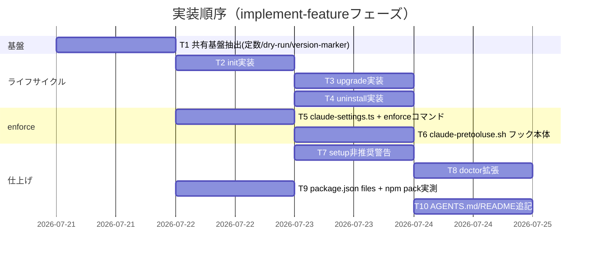

# 実装計画書: agent-skill-chain CLIライフサイクルコマンド（init/upgrade/uninstall/enforce）

**プロジェクト名**: agent-skill-chain CLIライフサイクルコマンドの新設
**作成日**: 2026年07月20日
**最終更新**: 2026年07月20日

> 本ファイルは後続implement-featureフェーズ（別委譲）のためのタスク分解・テスト仕様。本設計フェーズでは実体コード（`.ts`/`.sh`/`.json`）を変更しない。

---

## 1. 実装概要

### 1.1 実装方針

02_設計のADR-1〜5に従い、(1) 共有基盤（定数・dry-run対応fs-copy・version-marker）を先に抽出、(2) `init`/`upgrade`/`uninstall`を共有基盤の上に実装、(3) `enforce`とhook本体を独立に実装、(4) `setup`非推奨化・`doctor`拡張・`package.json` `files`を最後に反映する。依存順は「共有基盤 → init → upgrade/uninstall（並行可）→ enforce → setup/doctor/package.json（並行可）」。既存237件超のテストを常に無破壊に保つ（各タスク完了時に`npm test`全体を実行して確認する）。

### 1.2 実装順序



---

## 2. タスク分解

### 2.1 タスク1: 共有基盤の抽出（定数共有・fs-copyのdry-run対応・version-marker新設）

#### 2.1.1 概要

`setup.ts`が持つ`ROOT_LEVEL_ENTRIES`/`NAMESPACED_ENTRIES`を`src/lib/paths.ts`（または新設`src/lib/asset-manifest.ts`）へ移し、`NAMESPACED_ENTRIES`へ`hooks`を追加する。`src/lib/fs-copy.ts`の`copyTreeFailOnConflict`/`copyTreeMirror`に`dryRun`オプションを追加する。`src/lib/version-marker.ts`（`.installed_version`読み書き）を新設する。

#### 2.1.2 実装内容

- `ROOT_LEVEL_ENTRIES`/`NAMESPACED_ENTRIES`定数を共有モジュールへ移動し、`setup.ts`はそこから import する（重複定義の解消）。`NAMESPACED_ENTRIES`に`'hooks'`を追加。
- `copyTreeFailOnConflict(src, dest, { dryRun }?)`/`copyTreeMirror(src, dest, { dryRun }?)`: `dryRun: true`時はファイルシステムへ一切書き込まず、実行した場合と同じ`CopyResult[]`（`action`はそのまま、意味は「予定」）を返す。
- `src/lib/version-marker.ts`: `readInstalledVersion(root): string | undefined` / `writeInstalledVersion(root, version): void`（`.agent-skill-chain/.installed_version`、1行のsemver文字列）。

#### 2.1.3 テスト観点

##### 単体（必須1件以上）
- `dryRun: true`で`copyTreeFailOnConflict`/`copyTreeMirror`を呼んでも対象ディレクトリにファイルが作成されないこと。
- `dryRun: true`でも衝突検知（`copyTreeFailOnConflict`）は従来どおり例外を投げること（dry-runは「書込みをしない」だけで「検査をしない」わけではない）。
- `writeInstalledVersion`→`readInstalledVersion`のラウンドトリップ。
- `.installed_version`不在時`readInstalledVersion`が`undefined`を返すこと。

##### 結合/API
- **該当なし**（本タスクはlib層のみ、結合検証は後続タスクのCLIコマンドテストで行う）。

#### 2.1.4 単体テスト仕様（BDD）

```gherkin
Feature: fs-copyのdry-run対応
  Scenario: dry-runは書込みを行わない
    Given 空のdestディレクトリ
    When copyTreeFailOnConflict(src, dest, { dryRun: true }) を呼ぶ
    Then destディレクトリにファイルは作成されない
    And 戻り値のCopyResult一覧は実行時と同じ内容を返す
```

#### 2.1.5 依存関係
- なし（基盤タスク）。T2〜T6が本タスクへ依存。

#### 2.1.6 見積もり
- **工数**: 1日 / **優先度**: 高

---

### 2.2 タスク2: `init`コマンド実装

#### 2.2.1 概要

02_設計§3.1に従い、ローカルファイル導入・`--dry-run`・非破壊衝突検知・`.installed_version`書込みを行う`src/commands/init.ts`を新設し、CLIルーティング（`src/agents-md.ts`）へ`init`を登録、`.agent-skill-chain/scripts/init.sh`ラッパーを新設する。

#### 2.2.2 実装内容

- `init(args: string[]): Promise<number>`: `isHelp`/`guard`パターンに従う。`--dry-run`フラグ解析。`ROOT_LEVEL_ENTRIES`+`NAMESPACED_ENTRIES`（`hooks`含む）を`copyTreeFailOnConflict`、`.github`を`copyTreeMirror`で導入。非dry-run成功時のみ`writeInstalledVersion`。
- `.agent-skill-chain/scripts/init.sh`: 既存`setup.sh`と同一パターンの薄いラッパー。

#### 2.2.3 テスト観点

##### 単体（必須1件以上）
- `--dry-run`時、戻り値0かつファイル未作成。
- 非dry-run時、`standards/templates/config/schemas/scripts/ci/adapters/hooks`・ROOT_LEVEL_ENTRIES・`.github`が実体化し、`.installed_version`に現行`package.json` versionが記録される。
- 既存ファイルと内容衝突時、エラーで停止し他ファイルも未作成（部分適用しない）。

##### 結合/API（必須1件以上）
- `bin/agents-md.js init <tmpdir>`をsubprocess実行し、実ファイルが実体化すること（`test/integration/setup.test.ts`と同様のパターン）。

##### E2E/受け入れ
- **該当なし**（`npm pack`実体を伴うE2Eは00_要求定義§5除外要件によりスコープ外）。

#### 2.2.4 単体テスト仕様（BDD）

```gherkin
Feature: init コマンド
  Scenario: dry-runで導入内容を確認する
    Given 本パッケージが未導入の空target_dir
    When agent-skill-chain init --dry-run を実行する
    Then 実ファイルは一切作成されない
    And 作成予定のファイル一覧が標準出力に表示される
  Scenario: 既存docs資産と衝突する場合は非破壊で停止する
    Given target_dirのdocs/GLOSSARY.mdに本パッケージ生成物と異なる内容の同名ファイルが存在する
    When agent-skill-chain init を実行する
    Then 既存ファイルは上書きされない
    And 終了コードが0以外で日本語の理由付きエラーが標準エラー出力に表示される
```

#### 2.2.5 依存関係
- T1（共有基盤）。

#### 2.2.6 見積もり
- **工数**: 1日 / **優先度**: 高

---

### 2.3 タスク3: `upgrade`コマンド実装

#### 2.3.1 概要

02_設計§3.2に従い、`.installed_version`存在チェック・正本アセットのミラー更新（`project/`不可侵）・差分要約表示・`--dry-run`を行う`src/commands/upgrade.ts`を新設する。

#### 2.3.2 実装内容

- `upgrade(args: string[]): Promise<number>`: `.installed_version`不在→エラー終了。存在→旧バージョン読取→（dry-runでなければ）`ROOT_LEVEL_ENTRIES`+`NAMESPACED_ENTRIES`+`.github`を`copyTreeMirror`→新バージョン書込み→差分要約表示。
- `.agent-skill-chain/scripts/upgrade.sh`ラッパー新設。

#### 2.3.3 テスト観点

##### 単体（必須1件以上）
- `.installed_version`不在時、エラーメッセージ「先にinitを実行してください」を含み終了コード非0。
- `.agent-skill-chain/project/`配下に配置したダミーファイルが`upgrade`実行後も変更されていないこと（不可侵性の直接検証）。

##### 結合/API（必須1件以上）
- `init`実行後、正本アセットの一部ファイルをローカルで手動改変し、`upgrade`実行後にパッケージ同梱版の内容へ上書きされること（ミラー更新の確認）。

#### 2.3.4 単体テスト仕様（BDD）

```gherkin
Feature: upgrade コマンド
  Scenario: project配下のカスタマイズは変更されない
    Given init済みのtarget_dirで .agent-skill-chain/project/RULES.md にカスタム内容を配置済み
    When agent-skill-chain upgrade を実行する
    Then .agent-skill-chain/project/RULES.md の内容は変更されない
    And 標準アセット（例: standards/GIT_CONVENTIONS.md）はパッケージ同梱版の内容へ更新される
```

#### 2.3.5 依存関係
- T2（`init`が作る`.installed_version`を前提に検証する）。

#### 2.3.6 見積もり
- **工数**: 1日 / **優先度**: 高

---

### 2.4 タスク4: `uninstall`コマンド実装

#### 2.4.1 概要

02_設計§3.3に従い、gitリポジトリ検査・未commit差分検査・残存worktree検査を経てから削除する`src/commands/uninstall.ts`を新設する。`--force`は提供しない。

#### 2.4.2 実装内容

- `uninstall(args: string[]): Promise<number>`: (1) `repoRoot()`検査、(2) 管理対象パス（ROOT_LEVEL_ENTRIES+NAMESPACED_ENTRIES(`project`除く)+`.github`）に対する`git status --porcelain`で未commit差分検査、(3) `git worktree list --porcelain`で`.worktrees/`配下の残存worktree検査、(4) `--dry-run`なら予定一覧表示、そうでなければ削除実行 + `project/`保持の固定notice表示。
- `.agent-skill-chain/scripts/uninstall.sh`ラッパー新設。

#### 2.4.3 テスト観点

##### 単体（必須1件以上）
- 未commit差分がある場合、削除が実行されず終了コード非0。
- 残存worktreeがある場合、削除が実行されず終了コード非0。
- 安全確認を通過した場合、`.agent-skill-chain/project/`が削除対象に含まれず実際に残ること。

##### 結合/API（必須1件以上）
- `init`実行→commit→`uninstall`実行で実際にファイルが削除され、`.agent-skill-chain/project/`配下のダミーファイルのみが残ること。

#### 2.4.4 単体テスト仕様（BDD）

```gherkin
Feature: uninstall コマンド
  Scenario: 未commit差分がある場合は安全側で停止する
    Given .agent-skill-chain/ 配下に未commitの変更がある
    When agent-skill-chain uninstall を実行する
    Then 削除は実行されない
    And 未commit差分が存在する旨のエラーメッセージとともに終了コードが0以外で停止する
  Scenario: project配下は削除されない
    Given init済みでcommit済みのtarget_dir、.agent-skill-chain/project/RULES.mdが存在する
    When agent-skill-chain uninstall を実行する
    Then standards/等の配布アセットは削除される
    And .agent-skill-chain/project/RULES.md は削除されず残る
```

#### 2.4.5 依存関係
- T2（`init`で作られた導入一式を前提に検証する）。

#### 2.4.6 見積もり
- **工数**: 1日 / **優先度**: 高

---

### 2.5 タスク5: `claude-settings.ts` + `enforce`コマンド実装

#### 2.5.1 概要

02_設計§3.4・ADR-2/ADR-4に従い、`.claude/settings.json`のPreToolUse hookエントリをidempotentにマージ/削除する`src/lib/claude-settings.ts`と、それを呼ぶ`src/commands/enforce.ts`を新設する。

#### 2.5.2 実装内容

- `src/lib/claude-settings.ts`: `readSettings(path)`（無ければ`{}`）/`addPreToolUseHook(settings, commandPath)`（同一commandPathが既存なら変更なし）/`removePreToolUseHook(settings, commandPath)`（該当エントリのみ除去、他は温存）/`writeSettings(path, settings)`。JSON解析失敗時は例外を投げ、呼び出し側（`enforce.ts`）がファイル変更せずエラー終了する。
- `src/commands/enforce.ts`: `enforce(args)`→`on`/`off`分岐。`on`は`.agent-skill-chain/hooks/claude-pretooluse.sh`を`resolveAsset()`経由で対象へコピー配置してから`addPreToolUseHook`、`off`は`removePreToolUseHook`。固定警告文言（02_設計§3.4.2）を`on`実行後に標準出力へ表示。
- CLIルーティングへ`enforce on`/`enforce off`を2トークンハンドラとして登録。
- `.agent-skill-chain/scripts/enforce.sh`ラッパー新設（`agent-skill-chain enforce "$@"`）。

#### 2.5.3 テスト観点

##### 単体（必須1件以上）
- `addPreToolUseHook`を2回連続適用してもエントリが重複しないこと（idempotent）。
- `removePreToolUseHook`が対象外の既存hooks/settingsフィールドを変更しないこと。
- 不正JSONの`.claude/settings.json`に対し例外を投げ、ファイルへの書込みが発生しないこと。

##### 結合/API（必須1件以上）
- `enforce on`→`.claude/settings.json`に`hooks.PreToolUse`エントリが追加されること。`enforce off`→当該エントリのみ除去されること。他に手動で追加した無関係のJSONフィールドが両操作を通じて温存されること。

#### 2.5.4 単体テスト仕様（BDD）

```gherkin
Feature: enforce コマンド
  Scenario: enforce onは既存設定を破壊しない
    Given .claude/settings.json に無関係な既存フィールド(例: permissions.deny)が設定済み
    When agent-skill-chain enforce on を実行する
    Then hooks.PreToolUse に本パッケージのエントリが追加される
    And 既存の permissions.deny フィールドは変更されない
  Scenario: enforce offは冪等である
    Given hookが未配線の.claude/settings.json
    When agent-skill-chain enforce off を実行する
    Then エラーにならず終了コード0で完了する
```

#### 2.5.5 依存関係
- T1（共有基盤の`resolveAsset`等既存libを利用。新規依存は無いが実装順としてT1後を推奨）。

#### 2.5.6 見積もり
- **工数**: 1日 / **優先度**: 高

---

### 2.6 タスク6: `claude-pretooluse.sh`フック本体実装

#### 2.6.1 概要

02_設計§3.4.4・ADR-2/ADR-4に従い、`tool_name=="Bash"`のみを対象に、`git worktree remove`直接実行とブランチ命名規約違反の2パターンのみを`exit 2`で拒否するhookスクリプトを新設する。

#### 2.6.2 実装内容

- 標準入力（Claude CodeのPreToolUse hook契約: JSON、`tool_name`/`tool_input.command`等を含む）を読み、`tool_name != "Bash"`なら即`exit 0`（fail-open）。
- `tool_input.command`が`git worktree remove`にマッチし`cleanup`という文字列を含まない場合→stderrへ理由 + `exit 2`。
- `tool_input.command`が`git branch <name>`（作成形）/`git checkout -b|-B <name>`/`git switch -c|-C <name>`にマッチし、`<name>`が`agent-skill-chain.yaml`の`branch.pattern`に適合しない場合→stderrへ理由 + `exit 2`。
- 上記以外→`exit 0`。

#### 2.6.3 テスト観点

##### 単体
- **該当なし**（shellスクリプト単体テストは無し。既存`.sh`ラッパー群と同じ「結合テストで検証する」既存方針に準拠）。

##### 結合/API（必須1件以上）
- `tool_name`が`Agent`/`Task`等の非Bashである入力→常に`exit 0`（ADR-2の核心・2026-07-15型事故の再発防止検証）。
- `tool_name=Bash`・`command="git worktree remove <path>"`（`cleanup`を含まない）→`exit 2`。
- `tool_name=Bash`・`command="agent-skill-chain cleanup ISSUE-1"`→`exit 0`（cleanup経由は許可）。
- `tool_name=Bash`・`command="git checkout -b bad-name"`（命名規約違反）→`exit 2`。
- `tool_name=Bash`・`command="agent-skill-chain enforce off"`→`exit 0`（ADR-4: 緊急解除コマンド自体が拒否パターンに非交差であることの直接検証）。

#### 2.6.4 単体テスト仕様（BDD）

```gherkin
Feature: claude-pretooluse.sh フック
  Scenario: 非Bashツールは常に通過する
    Given tool_name が "Agent" のPreToolUse入力
    When claude-pretooluse.sh を実行する
    Then exit code は 0 である
  Scenario: cleanupを経由しないgit worktree removeは拒否される
    Given tool_name が "Bash"、command が "git worktree remove .worktrees/foo" のPreToolUse入力
    When claude-pretooluse.sh を実行する
    Then exit code は 2 である
  Scenario: enforce off自体は拒否されない
    Given tool_name が "Bash"、command が "agent-skill-chain enforce off" のPreToolUse入力
    When claude-pretooluse.sh を実行する
    Then exit code は 0 である
```

#### 2.6.5 依存関係
- T5（`enforce on`が配置するスクリプトパス・命名規約と整合させる）。

#### 2.6.6 見積もり
- **工数**: 1日 / **優先度**: 高

---

### 2.7 タスク7: `setup`（bare）非推奨警告の追加

#### 2.7.1 概要

ADR-1に従い、bare`setup`実行時に非推奨警告をstderrへ出力する（処理内容・戻り値は変更しない）。

#### 2.7.2 実装内容

- `setup(args)`の先頭で`process.stderr.write('警告: setup は非推奨です。init（+ 必要なら setup github）を使用してください。\n')`を追加。`isHelp`分岐より後、実処理より前に配置し、`-h`実行時は警告を出さない。

#### 2.7.3 テスト観点

##### 単体
- **該当なし**（振る舞い変更なし、出力追加のみ）。

##### 結合/API（必須1件以上）
- 既存`test/integration/setup.test.ts`が引き続き全てpassすること（戻り値・生成物は無変更）。加えて、stderrに警告文言が含まれることを新規アサーションで確認する。

#### 2.7.4 単体テスト仕様（BDD）

```gherkin
Feature: setup(bare)の非推奨警告
  Scenario: setup実行時に非推奨警告が表示される
    Given 空のtarget_dir
    When agent-skill-chain setup を実行する
    Then 標準エラー出力に非推奨警告が含まれる
    And 従来どおりAGENTS.md等が生成され終了コード0になる
```

#### 2.7.5 依存関係
- T2（`init`の存在を前提に警告文言で言及する）。

#### 2.7.6 見積もり
- **工数**: 0.5日 / **優先度**: 中

---

### 2.8 タスク8: `doctor`拡張

#### 2.8.1 概要

02_設計§3.6に従い、`init`導入済み・`enforce`配線状態の2項目を情報表示として追加する（失敗要因にはしない）。

#### 2.8.2 実装内容

- `doctor.ts`の`checks`配列へ、`.installed_version`存在チェック・`.claude/settings.json`のhookエントリ存在チェックを追加。いずれも`ok: true`固定またはラベルのみ変える形にし、既存の「failedなら終了コード1」ロジックに影響させない（実装詳細: 別配列`infoChecks`として分離するか、`ok`を常にtrueにして`reason`欄で状態を表現する）。

#### 2.8.3 テスト観点

##### 単体（必須1件以上）
- 未導入プロジェクトで`doctor`実行時、終了コードが0のまま（既存必須チェックが全てOKの場合）であること（init未導入は失敗要因にならない）。
- `enforce on`実行後、`doctor`出力に配線済みである旨が表示されること。

#### 2.8.4 単体テスト仕様（BDD）

```gherkin
Feature: doctorのライフサイクル情報表示
  Scenario: 未導入でもdoctorは失敗しない
    Given initを実行していないtarget_dir
    When agent-skill-chain doctor を実行する
    Then 出力に「init未導入」相当の情報行が含まれる
    And 他の必須チェックが全てOKなら終了コードは0のままである
```

#### 2.8.5 依存関係
- T2, T5（表示対象の存在チェック先が両タスクの成果物）。

#### 2.8.6 見積もり
- **工数**: 0.5日 / **優先度**: 中

---

### 2.9 タスク9: `package.json` `files`フィールド追加 + `npm pack`実測確認

#### 2.9.1 概要

00_要求定義§4.1・01_要件定義ストーリー5に従い、配布物を実行時必須ファイルのみへ限定する。

#### 2.9.2 実装内容

- `package.json`へ以下を追加する:

```json
"files": [
  "bin/",
  ".agent-skill-chain/",
  "AGENTS.md",
  "CLAUDE.md",
  "docs/GLOSSARY.md"
]
```

- `README.md`/`LICENSE`/`package.json`はnpmの既定動作により`files`未記載でも常に同梱されるため追記不要（確認済み事項として実装メモに残す）。
- 追加後`npm pack --dry-run`を実行し、`src/*.ts`・`test/**/*.ts`・`tsconfig*.json`・`CONTRIBUTING.md`・`docs/adr/`・`docs/maintainer/`が含まれないことを実測確認する。

#### 2.9.3 テスト観点

##### 結合/API（必須1件以上）
- `npm pack --dry-run`の出力ファイル一覧に`src/`・`test/`・`tsconfig`を含む行が1件も無いこと（文字列検索で確認）。
- `bin/agents-md.js`・`.agent-skill-chain/config/agent-skill-chain.yaml`・`AGENTS.md`が含まれること（配布必須ファイルの欠落が無いことの確認）。

#### 2.9.4 単体テスト仕様（BDD）

```gherkin
Feature: package.json files フィールド
  Scenario: npm pack --dry-runで開発用ファイルが含まれないことを確認する
    Given package.json に files フィールドが追加されている
    When npm pack --dry-run を実行する
    Then 出力ファイル一覧に src/*.ts が含まれない
    And 出力ファイル一覧に test/**/*.ts が含まれない
    And 出力ファイル一覧に tsconfig*.json が含まれない
    And 出力ファイル一覧に bin/agents-md.js が含まれる
```

#### 2.9.5 依存関係
- T1（`hooks`ディレクトリが`.agent-skill-chain/`配下に追加されている前提。`.agent-skill-chain/`を丸ごと`files`に含めるため、実装順としてはT1以降で確認するのが安全）。

#### 2.9.6 見積もり
- **工数**: 0.5日 / **優先度**: 高

---

### 2.10 タスク10: `AGENTS.md`/`README.md`追記

#### 2.10.1 概要

ADR-3に従い、`AGENTS.md` §ディレクトリ構成へ`.agent-skill-chain/hooks/`エントリを追記する。`README.md`に`init`/`upgrade`/`uninstall`/`enforce`の存在を追記する。

#### 2.10.2 実装内容

- `AGENTS.md`のディレクトリ構成コードブロックに`hooks/`（1行）を追加。既存150行上限（`verify-doc-length.sh`検査対象）を超えないことを確認する。
- `README.md`のコマンド一覧・クイックスタートに新設4コマンドを追記する。

#### 2.10.3 テスト観点

##### 結合/API（必須1件以上）
- `agent-skill-chain verify doc-length`（既存コマンド）がAGENTS.mdに対し引き続きpassすること。

#### 2.10.4 依存関係
- T6（hooksディレクトリの実体確定後）。

#### 2.10.5 見積もり
- **工数**: 0.5日 / **優先度**: 低

---

## テスト観点（全体）

全体観点: (1) dry-runが実ファイルシステムへ一切書き込まないこと、(2) `uninstall`/`enforce`が既定で安全側に倒れること（未commit差分・残存worktree・JSON解析失敗はすべて非破壊エラー終了）、(3) `.agent-skill-chain/project/`の不可侵性（`upgrade`/`uninstall`双方）、(4) `enforce`のhookが非Bashツールを構造的に評価対象外とすること（ADR-2の核心）、(5) 既存237件超のテストの無破壊。各タスク§2.x.3に具体ケースを記載。

---

## 単体テスト

`fs-copy`のdry-run対応・`version-marker`・`claude-settings`・`enforce`コマンド分岐・`doctor`拡張をnode:test（既存test基盤・tsx）でカバーする。各タスク§2.x.4にBDDを記載。

---

## BDD

各タスク§2.x.4のGiven/When/ThenをBDD_FORMATに準拠する正としBDDとする。01_要件定義§2.2の全ユースケース（init/upgrade/uninstall/enforce/files フィールド）はT2〜T9のBDDで担保する。ストーリー6（lint対象拡大の判断）は02_設計ADR-5で確定済みであり、実装タスクを伴わない（コード変更なし）。

---

## 3. 実装スケジュール

### 3.1 マイルストーン

| マイルストーン | 期日 | 成果物 |
| --- | --- | --- |
| M1 基盤確定 | T1完了 | dry-run対応fs-copy・version-marker |
| M2 ライフサイクル3コマンド | T2/T3/T4完了 | init/upgrade/uninstall |
| M3 enforce一式 | T5/T6完了 | claude-settings.ts・enforceコマンド・hook本体 |
| M4 仕上げ | T7/T8/T9/T10完了 | setup非推奨警告・doctor拡張・files フィールド・ドキュメント追記 |

### 3.2 実装フェーズ

#### フェーズ1: 基盤
- **タスク**: T1

#### フェーズ2: ライフサイクル + enforce（並行可）
- **タスク**: T2→T3/T4、T5→T6

#### フェーズ3: 仕上げ
- **タスク**: T7, T8, T9, T10

---

## 4. テスト計画

- クリティカル（`.agent-skill-chain/project/`不可侵性・`enforce`のfail-open構造・`uninstall`の安全確認）を厚くテストする。
- 各タスク完了ごとに`npm test`全体を実行し、既存237件超のテストが無破壊であることを確認する。
- `npm pack --dry-run`はCI環境依存のため、隔離した一時ディレクトリ（`mktemp -d`相当）でのローカル実行と併せて確認する（本リポジトリのテストtmp隔離規約に従う）。

---

## 5. リスク管理

### 5.1 実装リスク

- **リスク**: `enforce`のhookマッチャーが将来のツール名追加で再び網羅性不足を起こす。
  - **対策**: ADR-2の設計（`tool_name=="Bash"`固定・ツール名列挙をしない）を実装でも厳守し、テスト（2.6.3）で非Bashツールの通過を明示的に検証する。
- **リスク**: `upgrade`のミラー更新が誤って`.agent-skill-chain/project/`を巻き込む。
  - **対策**: `NAMESPACED_ENTRIES`定数に`project`を含めないことをT1で確定し、T3のテスト（project不可侵性）で直接検証する。
- **リスク**: `uninstall`の安全確認が不十分で作業中のIssueを巻き込んで削除する。
  - **対策**: 02_設計§3.3.4に明記した限定（worktree残存を代理指標とする）を実装計画上も明示し、真に網羅的な検査は別Issueへ申し送る（本Issueでスコープを広げない）。
- **リスク**: `package.json` `files`追加により、実行時に必要なファイルが誤って配布物から欠落する。
  - **対策**: T9で`npm pack --dry-run`実測確認を必須テストとし、`bin/agents-md.js`・`.agent-skill-chain/config/agent-skill-chain.yaml`・`AGENTS.md`の同梱を明示的にアサートする。

---

## 6. 参考資料

- 02_設計.md（ADR-1〜5）。
- GitHub Issue #169。

---

## 7. 前のステップ

- 02_設計.md（設計フェーズ）。

---

## 8. 次のステップ

- 実装フェーズ（implement-feature・別委譲）。1 Issue = 1 ブランチのため90_issues.md分割は行わない（サブIssue作成なし）。
