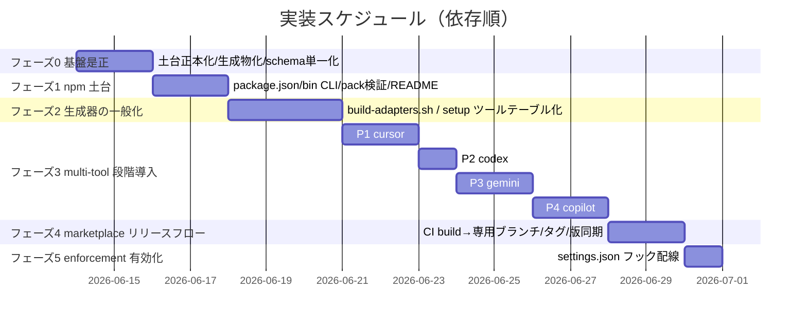
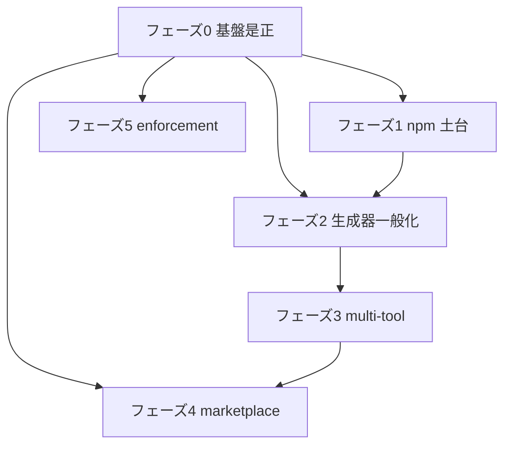

# 実装計画書: 配布とパッケージ構成の再設計

**プロジェクト名**: 配布とパッケージ構成の再設計（npm 主軸 + Claude marketplace 併設）
**作成日**: 2026 年 06 月 14 日
**最終更新**: 2026 年 06 月 14 日

> **重要**: **このドキュメントは常に更新**: 実装計画の変更、進捗状況の更新、バグの記録などがあった場合は、即座にこのドキュメントを更新してください。ドキュメントは「生きているドキュメント」として扱い、実装内容と常に同期させます。
> **必須項目**: 「必須」と明記した欄は空欄・抽象語のみで提出しないこと。テスト観点・BDD 仕様は具体ケースを 1 件以上記載すること。
>
> **本書の事実/判断の区別**: 「実ファイルで確認した現状」を【事実】、「本計画での設計判断・将来案」を【判断】とする。02_設計 §5.2 の未決事項のうち本決定で確定した事項は **決定事項**（後述）に記す。
>
> **用語**: [.agents/CONCEPTS.md §用語規約](../../../../../.agents/CONCEPTS.md#用語規約) を参照。

---

## 0. 決定事項（02_設計 §5.2 の未決事項への回答）

本実装計画はユーザー決定を前提に立案する。

- **配布モデル**: 「npm 主軸 + Claude marketplace 併設」のハイブリッド（02_設計 §5.1 推奨案を採用）【判断】。
- **対象ツール**: claude / cursor / gemini / copilot / codex（段階導入。フェーズ3 参照）【判断】。
- **手書き土台**: B-2 を採用。`.agents/platforms/claude/plugin.json` を正本とし build がコピー生成する（既に実装着手済み）【事実】。
- **DB スキーマ正本**: `schema.sql` 切り出し方式を採用（`.agents/ledger/schema.sql` 単一正本。setup.sh / write-workflow-log.sh は参照側）（既に実装着手済み）【事実】。
- **npm スコープ／レジストリ**: **確定**（ユーザー決定）。パッケージ名 `@techbeansjp-free/agents-md`、レジストリ public（npmjs.com）、`publishConfig.access=public`【事実】。
- **LICENSE**: MIT で確定。リポルートに `LICENSE`（MIT）を追加済み。著作権者は **`TechBeans Inc.`（法人・確定）**（`Copyright (c) 2026 TechBeans Inc.`。ユーザー決定）【事実】。
- **marketplace リリース（案A）の確定既定**（フェーズ4 実装で確定。§9 #2 への回答。案A ユーザー承認済み）【事実】:
  - **トリガ**: タグ push `v*`（例 `v0.1.0`）。
  - **リリースブランチ**: `release/marketplace`（生成物 `.adapters/claude`＋cursor と `marketplace.json` を CI が commit）。`main` には生成物を置かない（`/.adapters/` は gitignore のまま）。
  - **CI**: [.github/workflows/release.yml](../../../../../.github/workflows/release.yml)。**(A) npm publish ジョブ**（version 一致検証 → 配布物リーク検査 → `NPM_TOKEN` ゲート → `npm publish --access public`）と **(B) marketplace ジョブ**（version 一致検証 → build → 再生成 diff ゼロ → `release/marketplace` へ push）の 2 系統。実 push/publish は CI 上のみ。`NPM_TOKEN` 未設定時は publish step を skip（発火しない）。
- **version 同期方式**: 「正本＝`package.json`、`plugin.json` は従属」とし、`.agents/scripts/sync-version.sh`（`--check`/`--write`）で検証/注入する【判断】。build は plugin.json を**そのままコピー**するため、注入ロジックを build に持ち込まず「同一入力→同一出力」の決定性を維持する。`self-enforce.yml` に `--check` ゲートを追加済み。

---

## 1. 実装概要

### 1.1 実装方針（必須）

正本（src）／生成物（build）／消費者ランタイム（runtime）の三層 git 境界（02_設計 §3.2）を確立したうえで、npm 主軸 + Claude marketplace 併設のハイブリッド配布を、依存順（フェーズ0 基盤是正 → 1 npm 土台 → 2 生成器一般化 → 3 multi-tool 段階導入 → 4 marketplace リリースフロー → 5 enforcement 有効化）で実装する。各フェーズは前フェーズの不変条件（特に「`.adapters/` は 100% 生成物」「DB スキーマ正本単一」）に依存する。

### 1.2 実装順序（必須: 1 件以上）



**現状の進捗（着手済み・本バッチ）**【事実】:

- 着手済み: `.agents/platforms/claude/plugin.json`（手書き正本の外出し）、`.agents/ledger/schema.sql`（DB スキーマ単一正本）、`build-plugin-claude.sh` 改修（plugin.json コピー生成・`.adapters/claude` 100% 生成物化）、`setup.sh` 改修（`.agents-project` コピー削除・schema.sql 読込・`.cursor` 生成）、`.gitignore` 改修（`/.cursor/` 追加・`/.adapters/` 無視）。これらは未コミット（`git status`: M setup.sh / M write-workflow-log.sh / M .gitignore、`??` schema.sql / platforms/claude / build スクリプト / .claude-plugin / docs/maintainer / .agents-project）。
- 本バッチで作成: `package.json`、`bin/agents-md.js`（フェーズ1 の一部）。

---

## 2. タスク分解

**用語**: [.agents/CONCEPTS.md §用語規約](../../../../../.agents/CONCEPTS.md#用語規約) を参照。

**必須**: 各タスクには **「テスト観点」（2.x.3）** と **「単体テスト仕様（BDD）」（2.x.4）** を必ず記載する。観点の定義は **02_設計 §6** および **[RULES のテスト戦略・TEST_BDD_FORMAT](../../../../../.agents/RULES.md#テスト戦略必須要件)** を参照し、本書ではタスクごとの具体ケースのみ記載する。本プロジェクトの「単体テスト対象」は主に bash スクリプトと CLI であり、検証は `git status` / `git check-ignore` / `npm pack --dry-run` / クリーン clone での build/setup 実行（スクリプト E2E）で行う（02_設計 §6.1）。

---

### 2.1 タスク 1: フェーズ0 基盤是正（src/build/runtime 境界の確立）

#### 2.1.1 概要（必須）

正本・生成物・ランタイムの三層境界を確立し、欠陥1〜5（02_設計 §3.3）を是正して、後続フェーズの不変条件を成立させる。

#### 2.1.2 実装内容（必須: 1 件以上）

- **(1) 手書き土台の正本化**【着手済み・事実】: 手書きの plugin.json を `.agents/platforms/claude/plugin.json` に置く（正本）。README 相当の保守文書は `docs/maintainer/adapters.md`。
- **(2) `.adapters/` 100% 生成物化**【着手済み・事実】: `build-plugin-claude.sh` が `.adapters/claude/.claude-plugin/plugin.json` を正本からコピー生成し、`.claude-plugin/` を含む生成部を毎回 `rm -rf` → 再生成する。
- **(3) build スクリプト改修**【着手済み・事実】: plugin.json 前提チェックを正本側 `.agents/platforms/claude/plugin.json` に変更（旧: `.adapters/claude/.claude-plugin/plugin.json` を前提に巻き添え無視で失敗）。
- **(4) setup.sh の `.agents-project` リーク削除**【着手済み・事実】: 旧 `setup.sh:64-66` の `.agents-project` コピーを削除し、SETUP.md（「setup は `.agents-project` を作らない」）と一致させる（欠陥4）。
- **(5) DB スキーマ schema.sql 単一化**【着手済み・事実】: `.agents/ledger/schema.sql` を正本とし、`setup.sh` の `init_workflow_db` は `sqlite3 "$db" < schema.sql` で流すだけ（インライン SQL 撤去）。`write-workflow-log.sh` も schema.sql 参照へ寄せる。`schema.md` は人間向け説明、`schema.sql` が SQL 正本（欠陥5）。
- **(6) `.gitignore` 改修**【着手済み・事実】: `/.cursor/`（欠陥3）・`workflow.db*`・`/.adapters/`・`/.claude/` を無視、`.workflow/templates/` のみ negation で追跡。
- **(7) 未コミット正本のコミット**【未実施・判断】: marketplace.json / build スクリプト / `.agents/platforms/claude/` / `.agents/ledger/schema.sql` / `.agents-project/自己拡張ワークフロー.md` / `docs/maintainer/`（adapters.md・本ワークフロー）を git に追跡コミットする。

#### 2.1.3 テスト観点（必須）

**参照**: [02_設計 §6.1](./02_設計.md)、[RULES のテスト戦略](../../../../../.agents/RULES.md#テスト戦略必須要件)。以下は本タスクの具体ケース。

##### 単体（本タスクの具体ケース・必須 1 件以上）

- `schema.sql` を `sqlite3 :memory:` に流すと `workflow_log` テーブルが CHECK 制約込みで作成される（構文・制約の妥当性）。
- `git check-ignore .cursor/x` が真、`git check-ignore .agents/platforms/claude/plugin.json` が偽（正本は追跡・生成物は無視）。

##### 結合/API（本タスクの具体ケース・該当時は必須 1 件以上）

- クリーン clone（`.adapters/` 不在）で `bash .agents/scripts/build-plugin-claude.sh` が成功し `.adapters/claude/.claude-plugin/plugin.json` が生成される（欠陥1/2 の回帰確認）。
- `bash .agents/scripts/setup.sh /tmp/dest` 実行後、`/tmp/dest/.agents-project` が存在しない（欠陥4）。

##### E2E/受け入れ（本タスクの具体ケース・未達時は理由記載）

- 新規 clone → build → `git diff --exit-code`（生成物を一時追跡した場合）で差分ゼロ（再現性。SC-4/シナリオ7-4）。

##### バリデーション（該当する場合の具体ケース）

- `setup.sh` の `init_workflow_db` が流す SQL 文字列が `schema.sql` と同一であること（インライン SQL 残存が無い）。

#### 2.1.4 単体テスト仕様（BDD）（必須）

```gherkin
Feature: フェーズ0 基盤是正
  Scenario: クリーン clone から Claude プラグインを build できる
    Given 新規 clone 直後で .adapters/ が存在しない
    When bash .agents/scripts/build-plugin-claude.sh を実行する
    Then .adapters/claude/.claude-plugin/plugin.json が正本からコピー生成される
    And build-plugin-claude.sh が土台欠落エラーを出さず終了コード 0 で完了する

  Scenario: setup がリポ固有物をリークしない
    Given 空の採用先ディレクトリ /tmp/dest がある
    When bash .agents/scripts/setup.sh /tmp/dest を実行する
    Then /tmp/dest/.agents と /tmp/dest/AGENTS.md が配備される
    And /tmp/dest/.agents-project と docs/maintainer と workflow.db は配備されない
```

**テストコード例（インラインコメントで Given/When/Then を明記）**

```bash
# Given: クリーン clone を模した一時作業ツリー（.adapters/ なし）
tmp=$(mktemp -d); git archive HEAD | tar -x -C "$tmp"
# When: build を実行する
( cd "$tmp" && bash .agents/scripts/build-plugin-claude.sh )
# Then: 生成された plugin.json が存在し、土台欠落エラーが出ていない
test -f "$tmp/.adapters/claude/.claude-plugin/plugin.json"
```

#### 2.1.5 依存関係

- 後続フェーズ全ての前提（特にフェーズ2 の生成器一般化、フェーズ4 の marketplace は「.adapters=100%生成物」に依存）。



#### 2.1.6 見積もり

- **工数**: 2 日（大半着手済み。残: (7) コミット・schema 同期の最終確認）
- **優先度**: 高

---

### 2.2 タスク 2: フェーズ1 npm 土台

#### 2.2.1 概要（必須）

npm 主軸の配布導線を成立させる（version 付与・`npx agents-md init`・配布物のリーク防止）。

#### 2.2.2 実装内容（必須: 1 件以上）

- **(1) `package.json` 新規作成**【本バッチ・事実】: name=`@techbeansjp-free/agents-md`（仮）、version=0.1.0、`type:module`、`bin.agents-md=bin/agents-md.js`、`files` で配布対象を限定、`engines.node>=18`、`scripts.build:claude`、`publishConfig.access=public`。
- **(2) bin CLI 新規作成**【本バッチ・事実】: `bin/agents-md.js`（ESM・実行権限付与）。`init`/`upgrade`（setup.sh 実行）、`doctor`（CORE.md・AGENTS.md・PreToolUse.sh・bash・sqlite3 確認）、`version`、`help`。パッケージ root を `dirname(fileURLToPath(import.meta.url))/..` で解決し `spawnSync("bash", [setupPath, projectRoot], {stdio:"inherit"})`。
- **(3) `npm pack --dry-run` 検証**【本バッチ・事実】: 配布物に `.agents/`・AGENTS.md・CLAUDE.md・`.workflow/templates/`・bin・README のみが含まれ、`.agents-project/`・`docs/maintainer/`・`workflow.db`・`.adapters/` が含まれないことを確認。
- **(4) README に導入手順追記**【未実施・判断】: 「npm 主軸（`npx @techbeansjp-free/agents-md init`）」を主導線、「Claude marketplace」を副導線として併記。版ピン留め・upgrade・doctor の使い方も記載。既存 §「セットアップ」を npm 導線へ更新。

#### 2.2.3 テスト観点（必須）

##### 単体（本タスクの具体ケース・必須 1 件以上）

- `node bin/agents-md.js version` が package.json の version（0.1.0）を出力し終了コード 0。
- `node bin/agents-md.js help` が使い方を出力し終了コード 0。不明コマンドは help を出して終了コード 1。

##### 結合/API（本タスクの具体ケース・該当時は必須 1 件以上）

- `npm pack --dry-run` の tarball ファイル一覧に `.agents-project|docs/maintainer|workflow.db|.adapters/` が現れない（リーク防止。SC-3/シナリオ5-1）。
- `node bin/agents-md.js init /tmp/dest` が setup.sh を起動し、配備が成功する（CLI→setup の結線）。

##### E2E/受け入れ（本タスクの具体ケース・未達時は理由記載）

- 実 publish は未決（スコープ/レジストリ確定後）。本フェーズは publish 前の `--dry-run` までで受け入れ。

##### バリデーション（該当する場合の具体ケース）

- setup.sh 不在時に doctor/init がわかりやすいエラーを返す。bash 不在時に init が ENOENT を検知して案内する。

#### 2.2.4 単体テスト仕様（BDD）（必須）

```gherkin
Feature: npm 土台
  Scenario: version サブコマンド
    Given package.json の version が 0.1.0 である
    When node bin/agents-md.js version を実行する
    Then 標準出力に 0.1.0 が表示され終了コードが 0 である

  Scenario: 配布物のリーク防止
    Given package.json の files が配布対象を限定している
    When npm pack --dry-run を実行する
    Then tarball に .agents-project / docs/maintainer / workflow.db / .adapters/ が含まれない
```

**テストコード例（インラインコメントで Given/When/Then を明記）**

```bash
# Given: package.json の files で配布対象を限定済み
# When: dry-run でパッケージ内容を列挙する
out=$(npm pack --dry-run 2>&1)
# Then: リポ固有物がひとつも含まれない
echo "$out" | grep -qiE 'agents-project|docs/maintainer|workflow\.db|\.adapters/' && exit 1 || exit 0
```

#### 2.2.5 依存関係

- フェーズ0（特に schema.sql・setup.sh 改修）に依存。CLI は setup.sh を呼ぶため。

#### 2.2.6 見積もり

- **工数**: 2 日（package.json・CLI・pack 検証は本バッチで完了。残: README）
- **優先度**: 高

---

### 2.3 タスク 3: フェーズ2 生成器の一般化

#### 2.3.1 概要（必須）

Claude 専用 build を multi-tool 対応の共通生成器へ一般化し、setup.sh のツール配備をテーブル駆動にする。

#### 2.3.2 実装内容（必須: 1 件以上）

- **(1) `build-adapters.sh` 新設**【判断】: `build-plugin-claude.sh` を `build-adapters.sh`（共通配備関数 ＋ ツール別ハンドラ）へ一般化。共通関数: skills 配備（`{domain}__{capability}`）・commands・agents・`.agents` 同梱・GENERATED.md。ツール別: hooks 形式・`.claude-plugin/plugin.json` 等。
- **(2) `setup.sh` のツールテーブル化**【判断】: ツールごとの「配備先パス・スキル機構・フック有無」をテーブル（連想配列または case 関数）に集約し、`sync_skills` をテーブルから駆動。現状ハードコードの `.claude`/`.cursor` ブロックを置換。
- **(3) 互換ラッパ維持**【判断】: `build-plugin-claude.sh` は `build-adapters.sh claude` を呼ぶ薄いラッパとして残す（既存 npm `scripts.build:claude` と marketplace の手順を壊さない）。

#### 2.3.3 テスト観点（必須）

##### 単体（本タスクの具体ケース・必須 1 件以上）

- `build-adapters.sh claude` の出力が一般化前の `build-plugin-claude.sh` 出力とファイル単位で一致（リファクタの振る舞い不変。`diff -r`）。
- 互換ラッパ `build-plugin-claude.sh` が `build-adapters.sh claude` と同一結果を生む。

##### 結合/API（本タスクの具体ケース・該当時は必須 1 件以上）

- `setup.sh` のツールテーブルに claude+cursor を指定し、`.claude/skills` と `.cursor/skills` 両方に `domain__capability` 形式で配備される（シナリオ2-3）。

##### E2E/受け入れ（本タスクの具体ケース・未達時は理由記載）

- クリーン clone → `build-adapters.sh claude` → 差分ゼロ（再現性維持）。

##### バリデーション（該当する場合の具体ケース）

- 未知ツール名を渡すと build-adapters.sh がエラーで終了コード非ゼロ。

#### 2.3.4 単体テスト仕様（BDD）（必須）

```gherkin
Feature: 生成器の一般化
  Scenario: 一般化後も Claude 生成物が不変である
    Given 一般化前の build-plugin-claude.sh の出力を保存してある
    When build-adapters.sh claude を実行する
    Then 出力ディレクトリが一般化前と diff ゼロである
```

```bash
# Given: 旧出力を baseline/ に退避済み
# When: 一般化後の生成器で claude を生成する
bash .agents/scripts/build-adapters.sh claude
# Then: baseline と差分が無い（振る舞い不変）
diff -r baseline/.adapters/claude .adapters/claude
```

#### 2.3.5 依存関係

- フェーズ0・1 に依存。フェーズ3 の各ツール追加の基盤となる。

#### 2.3.6 見積もり

- **工数**: 3 日
- **優先度**: 中

---

### 2.4 タスク 4: フェーズ3 multi-tool 段階導入

#### 2.4.1 概要（必須）

claude を基準に、cursor → codex → gemini → copilot の順で配備対象を段階追加する。各ツールの「配置パス・skill 機構・フック有無」は要確認事実として明記し、確証が取れるまで最小配備に留める。

#### 2.4.2 実装内容（必須: 1 件以上）

段階導入（依存順）。各サブステップで build-adapters.sh / setup.sh のツールテーブルにエントリを足す。

- **P1: cursor を `.adapters/cursor` へ昇格**【判断】: 現状 setup は `.cursor/skills` を生成する【事実: setup.sh:116-130】が build 生成物（`.adapters/cursor`）は未整備。cursor 向け生成部を build-adapters.sh に追加。
  - **要確認**: Cursor の skill/rules 配置パス（`.cursor/rules` か `.cursor/skills` か）、フック機構の有無（runtime reject 可否）。【要確認: 未裏取り】
- **P2: codex（AGENTS.md 直読・最小）**【判断】: codex は `AGENTS.md` を直接読む前提の最小サポート。専用生成物は最小（または無し）で、AGENTS.md の配備のみ。
  - **要確認**: codex が参照する正本ファイル名・配置（リポルートの AGENTS.md で足りるか）、フック不在ゆえ enforcement は CI 側で補完。【要確認: 未裏取り】
- **P3: gemini**【判断】: gemini 向け配置・skill 機構を確認のうえ生成部追加。
  - **要確認**: 設定ファイル名/配置（例 `GEMINI.md` 等）、skill 相当機構の有無、フック有無。【要確認: 未裏取り】
- **P4: copilot**【判断】: copilot 向け配置・指示ファイルを確認のうえ生成部追加。
  - **要確認**: instructions ファイルの配置（例 `.github/copilot-instructions.md` 等）、skill 機構の有無、フック有無。【要確認: 未裏取り】
- **(共通) runtime reject 不可ツールの enforcement 補完**【判断】: フックで実行時拒否できないツール（codex/gemini/copilot のうちフック非対応のもの）は、CI（`audit.sh` 相当）で規約違反を検出・enforce する経路を用意する。

#### 2.4.3 テスト観点（必須）

##### 単体（本タスクの具体ケース・必須 1 件以上）

- ツールテーブルに cursor を有効化すると `.adapters/cursor` に skills が `domain__capability` で生成される。
- codex を有効化すると AGENTS.md が配備され、不要な専用生成物が作られない（最小配備）。

##### 結合/API（本タスクの具体ケース・該当時は必須 1 件以上）

- claude+cursor+codex を同時に setup し、3 系統すべてが同一正本 `.agents/` から派生する（シナリオ6-1）。
- フック非対応ツールに対し、CI audit が規約違反コミットを検出して失敗する（enforcement 補完）。

##### E2E/受け入れ（本タスクの具体ケース・未達時は理由記載）

- 各ツールの実機での skill 認識・フック発火確認は「要確認」事実の裏取り後に実施（現時点では未達。理由: 配置パス・機構が未確認のため）。

##### バリデーション（該当する場合の具体ケース）

- 同名 capability が異 domain にあっても `domain__capability` で衝突しない（シナリオ2-3）。

#### 2.4.4 単体テスト仕様（BDD）（必須）

```gherkin
Feature: multi-tool 段階導入
  Scenario: cursor を昇格して生成物を作る
    Given build-adapters.sh のツールテーブルに cursor が登録されている
    When build-adapters.sh cursor を実行する
    Then .adapters/cursor 配下に skills が domain__capability 形式で生成される

  Scenario: フック非対応ツールを CI で enforce する
    Given codex 採用先がフックで実行時拒否できない
    When 規約違反を含むコミットに対し CI audit を実行する
    Then audit が違反を検出し終了コード非ゼロで失敗する
```

```bash
# Given: ツールテーブルに cursor 登録済み
# When: cursor アダプタを生成する
bash .agents/scripts/build-adapters.sh cursor
# Then: domain__capability 形式のディレクトリが生成される
ls .adapters/cursor/skills | grep -q '__'
```

#### 2.4.5 依存関係

- フェーズ2（生成器一般化・テーブル化）に依存。P1→P2→P3→P4 の順で前ステップに依存。

#### 2.4.6 見積もり

- **工数**: 7 日（P1 2 / P2 1 / P3 2 / P4 2）
- **優先度**: 中（cursor は高、codex/gemini/copilot は要確認待ち）

---

### 2.5 タスク 5: フェーズ4 marketplace リリースフロー

#### 2.5.1 概要（必須）

`.adapters` を常時 gitignore のまま保ちつつ、リリース時に CI が build し専用ブランチ/タグへ生成物を commit、marketplace.json はそれを指す（案A）。plugin version と npm version を同期する。

#### 2.5.2 実装内容（必須: 1 件以上）

- **(1) リリース CI（案A）**【判断】: タグ push をトリガに CI が `build-adapters.sh claude` → 生成物（`.adapters/claude`）を **専用リリースブランチ/タグ**へ commit。メインブランチでは `.adapters/` は gitignore のまま（正本リポはクリーン維持）。
- **(2) marketplace.json の参照先**【判断】: marketplace の `source` が「リリースブランチ/タグの `.adapters/claude`」を指すよう運用を定義（現状 `source: "./.adapters/claude"`【事実】を、案A のリリース成果物に解決させる）。
- **(3) version 同期**【判断】: `package.json` の version と `.agents/platforms/claude/plugin.json` の version を同期（リリース時に CI が一致を検証、または plugin.json を package.json から生成/注入）。
- **(4) 差分ゼロ検証**【判断】: CI が「正本から再生成した `.adapters/claude`」とリリース成果物の diff ゼロを検証（再現性。シナリオ7-4）。

#### 2.5.3 テスト観点（必須）

##### 単体（本タスクの具体ケース・必須 1 件以上）

- `package.json.version` と `plugin.json.version` が一致する（不一致なら CI fail）。

##### 結合/API（本タスクの具体ケース・該当時は必須 1 件以上）

- リリース CI がタグから生成物をリリースブランチへ commit し、marketplace.json の source がそれを解決できる（シナリオ4-1）。
- 再生成 diff がゼロでない場合に CI が失敗する。

##### E2E/受け入れ（本タスクの具体ケース・未達時は理由記載）

- 実 marketplace install のスモークは、リリースブランチ運用確定後に実施。

##### バリデーション（該当する場合の具体ケース）

- メインブランチに `.adapters/` 生成物がコミットされていない（正本リポのクリーンさ。`git ls-files .adapters` が空）。

#### 2.5.4 単体テスト仕様（BDD）（必須）

```gherkin
Feature: marketplace リリースフロー
  Scenario: 版の同期検証
    Given package.json と plugin.json に version がある
    When CI のリリース前検証を実行する
    Then 両 version が一致しない場合は失敗する
```

```bash
# Given: 2 ファイルの version を読む
pv=$(node -p "require('./package.json').version")
gv=$(node -p "require('./.agents/platforms/claude/plugin.json').version")
# When/Then: 一致しなければ失敗
test "$pv" = "$gv"
```

#### 2.5.5 依存関係

- フェーズ0（.adapters=100%生成物）・フェーズ3（生成対象確定）に依存。

#### 2.5.6 見積もり

- **工数**: 2 日
- **優先度**: 中

---

### 2.6 タスク 6: フェーズ5 enforcement 有効化

#### 2.6.1 概要（必須）

本リポでの通常機能開発のドッグフーディング時に enforcement フックを有効化する。`.claude/settings.json` へフックを配線し `AGENT_ROLE=orchestrator` を設定する。

#### 2.6.2 実装内容（必須: 1 件以上）

- **(1) `.claude/settings.json` のフック配線**【判断】: PreToolUse/PostToolUse を `.claude/hooks/`（setup 生成物）に結線。`AGENT_ROLE=orchestrator` を env で設定。
- **(2) on/off 運用**【判断】: 本リポでは通常機能開発のドッグフーディング時に on にする（常時 on にはしない。自己拡張ワークフローのノイズ回避）。

#### 2.6.3 テスト観点（必須）

##### 単体（本タスクの具体ケース・必須 1 件以上）

- settings.json の JSON が妥当で、hooks の command パスが実在する `.claude/hooks/PreToolUse.sh` を指す。

##### 結合/API（本タスクの具体ケース・該当時は必須 1 件以上）

- AGENT_ROLE=orchestrator 設定下で PreToolUse フックが発火し、保護パスへの書込みが拒否される（enforcement の実効）。

##### E2E/受け入れ（本タスクの具体ケース・未達時は理由記載）

- 実 Claude セッションでの拒否動作確認はドッグフーディング時に実施。

##### バリデーション（該当する場合の具体ケース）

- settings.json が無効 JSON の場合に Claude 起動時エラーになることを事前に防ぐ（`node -e JSON.parse` で検証）。

#### 2.6.4 単体テスト仕様（BDD）（必須）

```gherkin
Feature: enforcement 有効化
  Scenario: フック配線の妥当性
    Given .claude/settings.json にフックが配線されている
    When 設定を検証する
    Then JSON が妥当で hooks の command が実在パスを指す
```

```bash
# Given/When: settings.json をパースし hook スクリプトの存在を確認
# Then: パース成功かつ PreToolUse.sh が存在する
node -e "JSON.parse(require('fs').readFileSync('.claude/settings.json','utf8'))"
test -f .claude/hooks/PreToolUse.sh
```

#### 2.6.5 依存関係

- フェーズ0（setup 生成物）に依存。最後に有効化（他フェーズ作業中のノイズ回避）。

#### 2.6.6 見積もり

- **工数**: 1 日
- **優先度**: 低（ドッグフーディング運用判断）

---

## テスト観点

本実装計画全体のテスト観点（02_設計 §6.1 の割当に対応）:

- **スクリプト E2E（クリーン clone → build/setup）**: フェーズ0（build 成功・リーク無）/フェーズ2（差分ゼロ）/フェーズ3（multi-tool 派生）。
- **gitignore 境界**: `git check-ignore` で src 追跡・生成物無視を検証（フェーズ0）。
- **配布物検証**: `npm pack --dry-run` でリーク防止（フェーズ1）。
- **DB スキーマ単一化**: 3 経路（setup/write/schema.sql）の一致と CHECK 制約（フェーズ0）。
- **版同期・再現性**: package.json↔plugin.json version 一致、再生成 diff ゼロ（フェーズ4）。
- **enforcement 実効**: フック発火・保護パス拒否（フェーズ5）。

各タスクの §2.x.3 に具体ケースを記載済み。監査では本セクションの存在と各タスクの観点記載を検査する。

---

## 単体テスト

本プロジェクトの「単体」相当は bash スクリプト・CLI の振る舞い検証。方針: `mktemp -d` ＋ `git archive` でクリーン clone を再現し、build/setup を実行して終了コードと生成物を assert する。CLI は `node bin/agents-md.js <cmd>` の終了コードと標準出力を assert する。各タスクの §2.x.4 に BDD 仕様を記載済み。

---

## BDD

各タスク §2.x.4 の Given/When/Then を一次仕様とする。書式は [TEST_BDD_FORMAT.md](../../../../../.agents/TEST_BDD_FORMAT.md) に従い、テストコード例には `# Given:` `# When:` `# Then:` のインラインコメントを付す。受け入れ基準のトレースは 01_要件定義 のシナリオ（2-1〜7-5）と 00_要求定義 の成功基準（SC-1〜SC-6）に対応する（§受け入れ基準との対応）。

---

## 3. 実装スケジュール

### 3.1 マイルストーン

| マイルストーン | 期日 | 成果物 |
| -------------- | ---- | ------ |
| M0 基盤是正完了 | フェーズ0 終了時 | クリーン clone から build/setup が成功・欠陥3,4,5 解消・正本コミット |
| M1 npm 土台完了 | フェーズ1 終了時 | package.json・bin CLI・pack 検証・README 導入手順 |
| M2 生成器一般化 | フェーズ2 終了時 | build-adapters.sh・setup ツールテーブル・互換ラッパ |
| M3 multi-tool | フェーズ3 終了時 | cursor 昇格＋codex/gemini/copilot 段階導入（要確認事実の裏取り込み） |
| M4 marketplace | フェーズ4 終了時 | リリース CI・版同期・差分ゼロ検証 |
| M5 enforcement | フェーズ5 終了時 | settings.json フック配線（ドッグフーディング on） |

### 3.2 実装フェーズ

#### フェーズ 0〜5

- §1.2 の Gantt と §2 のタスク分解を参照。各フェーズの完了条件は §3.3。

### 3.3 フェーズ別 完了条件（○/× 判定可能）と受け入れ基準・リスク

| フェーズ | 完了条件（○/×） | 受け入れ基準との対応 | 主なリスク |
| --- | --- | --- | --- |
| 0 基盤是正 | クリーン clone で build/setup が終了コード 0 ／ `git check-ignore .cursor/x`=真 ／ setup 後に `.agents-project` 不在 ／ schema.sql 単一で 3 経路一致 ／ 正本がコミット済み | SC-1,3,4,5 ／ シナリオ2-1,4-1,7-4,7-5 | negation/gitignore の取りこぼしで生成物誤コミット。対策: `git ls-files .adapters` 空を CI で検証 |
| 1 npm 土台 | `node bin/agents-md.js version`=0.1.0 ／ `npm pack --dry-run` にリポ固有物が無い ／ README に npx 導線 ／ スコープ/レジストリ/LICENSE 確定・package.json publish メタデータ確定（§0） | SC-2,3 ／ シナリオ5-1 | （解消）スコープ/レジストリ確定済み（§9 #1）。publish は release.yml `npm-publish` に配線、`NPM_TOKEN` ゲートで保護 |
| 2 生成器一般化 | `build-adapters.sh claude` が旧出力と diff ゼロ ／ 互換ラッパが同一結果 | シナリオ1-2,6-1 | リファクタで Claude 生成物が変質。対策: baseline diff を必須化 |
| 3 multi-tool | cursor が `.adapters/cursor` に生成 ／ 3 系統が単一正本派生 ／ フック非対応ツールを CI audit が enforce | シナリオ2-2,2-3,6-1 | 各ツールの配置/機構が未確認。対策: 「要確認」を裏取りするまで最小配備に留める |
| 4 marketplace | version 一致検証 ／ リリース成果物の差分ゼロ ／ main に `.adapters` 未コミット ／ release.yml に npm publish 配線（タグ `v*`＋公開前検証＋`NPM_TOKEN` ゲート＋access public）／ marketplace 案A 確定記述 | SC-1,2 ／ シナリオ3-2,4-1,7-4 | リリースブランチ運用が複雑化。対策: 案A 単一方式に固定、手順を README/CI に明文化（確定済み） |
| 5 enforcement | settings.json が妥当 JSON でフックが実在パス ／ 保護パス書込みが拒否 | BR-1〜BR-6 の実効 | 常時 on でドッグフーディングがノイズ化。対策: 機能開発時のみ on |

---

## 4. テスト計画

テスト観点・レベル・BDD 形式の定義は 02_設計 §6 および RULES のテスト戦略・TEST_BDD_FORMAT を参照。本計画では各タスク §2.x.3 に具体ケース、§2.x.4 に BDD を記載。

### 4.1 テストの優先順位

- クリティカル: 「クリーン clone → build/setup 成功」「配布物のリーク防止」「再生成 diff ゼロ」を最優先（回帰に必ず含める）。
- 影響範囲広: build-adapters.sh の一般化（フェーズ2）は全 multi-tool に波及するため baseline diff を回帰必須。

---

## 5. リスク管理

### 5.1 実装リスク

- **リスク**: gitignore の生成物無視と手書き土台追跡の両立を誤り、生成物が誤コミット／土台が巻き添え無視される（欠陥1/2 の再発）。
  - **対策**: B-2（手書き土台を正本側に外出し済み）で `.adapters/`=100% 生成物の単純不変条件を維持。CI で `git ls-files .adapters` が空であることを検証。
- **リスク**: 各ツール（gemini/copilot/codex）の配置パス・skill 機構・フック有無が未確認のまま実装し、誤った生成物を配る。
  - **対策**: 「要確認」事実を裏取りするまで最小配備（codex は AGENTS.md 直読のみ）に留め、フック非対応ツールは CI audit で enforcement を補完。
- **リスク**: アップグレードが採用先のローカル改変（`.agents-project/` 等）を破壊する。
  - **対策**: 上書き対象/非対象を SETUP.md と実装で一致させ、setup は `.agents-project` を作成・上書きしない（フェーズ0 で是正済み）。
- **リスク**: npm version と plugin version の乖離でマーケットプレイスと npm の版が食い違う。
  - **対策**: フェーズ4 で CI が version 一致を検証（または plugin.json を package.json から注入）。

### 5.2 スケジュールリスク

- ~~**リスク**: npm スコープ/レジストリ・LICENSE 未確定で publish と marketplace 公開が滞留。~~ → **解消**: スコープ `@techbeansjp-free/agents-md`・public/npmjs・LICENSE（MIT / TechBeans Inc.）が確定（§0／§9 #1・#6）。publish は release.yml `npm-publish` ジョブに配線済み（`NPM_TOKEN` ゲート）。実 publish 発火はユーザーの `NPM_TOKEN` 設定＋`v*` タグ push に委ねる。

---

## 6. 参考資料

### プロジェクトドキュメント

- [`00_要求定義.md`](./00_要求定義.md) - 要求定義
- [`01_要件定義.md`](./01_要件定義.md) - 要件定義
- [`02_設計.md`](./02_設計.md) - 設計

### その他の参考資料（実ファイル）

- `package.json`・`bin/agents-md.js`（本バッチ作成）
- `.agents/scripts/setup.sh`・`.agents/scripts/build-plugin-claude.sh`・`.agents/scripts/write-workflow-log.sh`
- `.agents/ledger/schema.sql`・`.agents/ledger/schema.md`
- `.agents/platforms/claude/plugin.json`・`.claude-plugin/marketplace.json`・`docs/maintainer/adapters.md`
- `.gitignore`

---

## 7. 前のステップ

- **前**: [`02_設計.md`](./02_設計.md) - 設計フェーズ

---

## 8. 次のステップ

- 本実装計画の承認後、フェーズ0 の残（正本コミット・schema 同期最終確認）→ フェーズ1 の残（README 導入手順）→ フェーズ2 以降を実装フェーズ（execution）で進める。
- 複数 issue に分割する場合は [`90_issues.md`](./90_issues.md) を作成（フェーズ3 の各ツールは個別 issue 化が有力）。

---

## 9. 未決事項

| # | 未決事項 | 影響フェーズ | 確定方法 |
| --- | --- | --- | --- |
| 1 | ~~**npm スコープ名／レジストリ**~~ → **確定（クローズ）**: パッケージ名 `@techbeansjp-free/agents-md`、レジストリ public（npmjs.com）、`publishConfig.access=public`（ユーザー決定）。[release.yml](../../../../../.github/workflows/release.yml) の `npm-publish` ジョブに publish step を配線済み（`NPM_TOKEN` ゲート付き） | 1,4 | （確定済み。実 publish はユーザーの `NPM_TOKEN` 設定＋`v*` タグ push で発火） |
| 2 | ~~**marketplace ブランチ戦略**~~ → **確定（クローズ）**: 案A をユーザー承認。トリガ＝タグ `v*`、リリースブランチ＝`release/marketplace`、version 同期＝`sync-version.sh`（正本 package.json）。[release.yml](../../../../../.github/workflows/release.yml) で実装 | 4 | （確定済み・承認済み） |
| 3 | **gemini の要確認事実**（設定ファイル名/配置・skill 機構・フック有無） | 3-P3 | 公式仕様で裏取り。未裏取り間は最小配備 |
| 4 | **copilot の要確認事実**（instructions 配置・skill 機構・フック有無） | 3-P4 | 公式仕様で裏取り。未裏取り間は最小配備 |
| 5 | **codex の要確認事実**（参照する正本ファイル・配置。AGENTS.md 直読で足りるか） | 3-P2 | 公式仕様で裏取り。enforcement は CI 補完 |
| 6 | ~~**LICENSE/MIT 確定**~~ → **確定（クローズ）**: リポルートに `LICENSE`（MIT）追加済み。著作権者 `TechBeans Inc.`（法人・ユーザー決定。`Copyright (c) 2026 TechBeans Inc.`）。package.json `author` / plugin.json `author` も `TechBeans Inc.` に統一 | 1 | （確定済み） |
