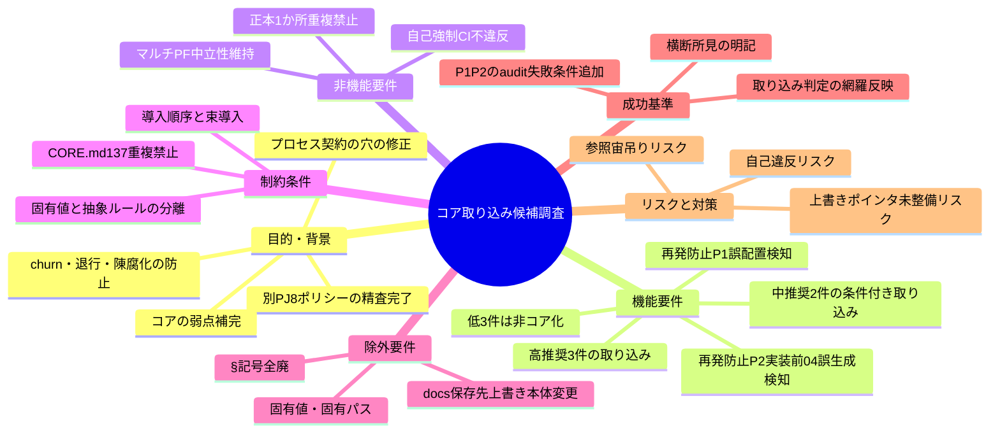
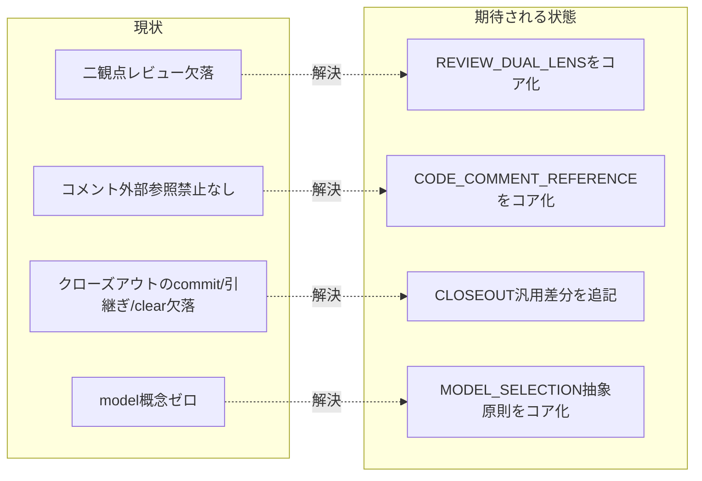

# 要求定義書: system-graph .agents-project ポリシーのコア取り込み

**プロジェクト名**: system-graph .agents-project ポリシーのコア取り込み
**作成日**: 2026 年 06 月 14 日
**最終更新**: 2026 年 06 月 14 日

> **重要**:
>
> - 要求定義書は、プロジェクトの全体像を把握するためのものです。詳細な技術仕様や実装方法は要件定義書以降で記載します。必要最低限の情報に収めることを心掛けてください。
> - **このドキュメントは常に更新**: 要求の変更や追加があった場合は、即座にこのドキュメントを更新してください。ドキュメントは「生きているドキュメント」として扱い、実装内容と常に同期させます。
> - **必須項目**: 以下の「必須」と明記した項目は空欄・抽象語のみ（例: 「{説明}」のまま）で提出しないこと。判定可能な形（目的は1文・成功基準は○/×で判定できる記載等）で記入すること。
>
> **用語**: [.agents/CONCEPTS.md §用語規約](../../../../../.agents/CONCEPTS.md#用語規約) を参照。

---

## 要求定義の全体像

**注意**:

- 上記の「プロジェクト名」は例です。実際のプロジェクト名に置き換えてください。
- マインドマップは全体像を把握するためのものです。主要なセクション名程度に留め、詳細は記載しないでください。

---

## 1. 目的・背景

### 1.1 目的（必須）

別 PJ の 8 ポリシーから、本リポジトリのコアに取り込むべき候補と方針を確定する。

### 1.2 背景

- **現状の課題**:
  - 別プロジェクト `system-graph/.agents-project/`（8 ポリシー）には、本リポジトリ AGENTS.md のコア（`.agents/`）に存在しない有用な実行契約が含まれているが、どれをコア化すべきかが未確定。
  - コアには「敵対的/肯定的レビュー」「不変条件 must-preserve」「退行/churn」「コードコメントの外部参照禁止」「不変クローズアウト工程の commit/引継ぎ/clear 境界」「model ティア選定」といった概念が欠落しており、品質ゲートに穴がある（adversarial/affirmative/不変条件/退行 は grep 0 件）。
  - 一方で、無批判に全ポリシーを取り込むと、コアの最大制約「CORE.md:137 正本1か所・重複禁止」やマルチプラットフォーム中立性、自己強制 CI と衝突し、コアが即自己違反する危険がある（特に § 記号の全面禁止）。

- **必要性**:
  - 取り込み可否・優先順位・取り込み先・抽象ルールと固有値の分離方針を 1 つの正本（本 issue）に固定し、後続の実装タスクが迷わず差分を入れられるようにする必要がある。
  - 8 件それぞれの取り込み判定の証跡（根拠）を省略せず残し、横断的結合（3 ポリシーの相互参照）を踏まえた束導入・導入順序を明記する必要がある。

#### 1.2.x 追加背景（再発防止スコープ＝プロセス契約の穴の修正）

本 issue の実行中に、オーケストレーターがコア（`.agents/`）のプロセス契約に存在する**構造的な穴**に起因して 2 件の契約違反を犯した。コア自体の改善である本 issue に、これらの再発防止策を同一 issue 内の**独立した要求グループ**として組み込む（system-graph 取り込みスコープとは目的が異なるため、後述の §2.2 / §6 / §7 で明確に区別する）。

- **誤り 1（issue 作成場所の取り違え）＋補足（構造的な穴）**:
  - 汎用標準（CLAUDE.md §issue 作成タスク受領時の標準フロー / `.agents/`）は単一 issue を `.workflow/<ts>_<title>/` に作るが、本リポジトリは `.agents-project/自己拡張ワークフロー.md` により `docs/maintainer/workflow/<ts>_<title>/` へ**最優先で上書き**する。
  - 穴 (i): **CLAUDE.md §issue 作成タスク受領時の標準フロー に、`.agents-project/` の上書きを参照すべき旨のポインタが無い**。読み手が汎用標準の作成先をそのまま採用しやすい。
  - 穴 (ii): `.workflow/<issue>/`（= `.gitignore` 対象領域）に issue ドキュメント（00〜04）が作られても、**それを検知する enforcement 失敗条件が存在しない**。誤配置された成果物が git から黙って消え、検知不能のまま開発記録を失う。
- **誤り 2（実装前の 04_review.md 誤生成）**:
  - PHASES.md §レビュー成果物の配置ルール / run_command §実装前のドキュメントレビュー は「実装前のレビューは memo に証跡を残し、04_review.md は実装完了後の verify-and-close でのみ作成する」と規定するが、オーケストレーターが実装前に verify-and-close を誤委譲し 04_review.md を作成した。
  - 穴: enforcement 失敗条件 #3 は「04 の欠落・未更新」を検知するが、**「実装前に 04 が存在する（implement-feature のログ・実装成果物が無いのに 04_review.md がある）」を直接検知する失敗条件が無い**。誤って先行作成された 04 を CI が検知できない。

### 1.3 期待される効果（必須: 1 件以上）

- **効果 1**: 取り込み候補 8 件すべてについて、取り込み可否・推奨度・取り込み先・抽象/固有の分離が判定可能な形で文書化され、後続の実装 issue が一意に起票できる（○/×: 8 件すべてに判定と取り込み先が記載されているか）。
- **効果 2**: コアの弱点（churn/退行/陳腐化の各防止が欠落）が、既存レビュー骨格・正本1か所原則と矛盾しない形で補完される方針が確定する（○/×: 既存重複部分が「追記差分にとどめる」と明記されているか）。
- **効果 3**: 自己強制 CI を破壊する取り込み（§ 全廃等）を非推奨として明示的に除外でき、コアの自己違反を未然に防ぐ（○/×: WORKFLOW_REFERENCE_POLICY が非推奨理由付きで除外されているか）。
- **効果 4（再発防止 P1）**: issue 作成場所の取り違えが、ポインタの明示と audit 失敗条件の追加により再発防止される（○/×: CLAUDE.md §issue 作成タスク受領時の標準フロー に `.agents-project/` 上書きへのポインタが記載され、かつ `.workflow/<issue>/` 配下に issue ドキュメントがあると audit が FAIL するか）。
- **効果 5（再発防止 P2）**: 実装前の 04_review.md 誤生成が、新しい audit 失敗条件により検知される（○/×: implement-feature のログ・実装成果物が無い issue に 04_review.md が存在すると audit が FAIL するか）。

**現状と期待される状態の比較**（必要に応じて）:

---

## 2. 機能要件

### 2.1 既存機能の維持（該当する場合）

- コアの既存レビュー骨格（指摘0反復・証跡必須、REVIEW_RULE.md / skills/review/\*）を維持する。
- 既存の verify 必須・指摘0反復・04_review・90_issues 起票分岐を維持する。
- 既存の深さ区分（RULES.md の quick / standard / full）を流用し、新規の深さ概念を導入しない。
- コアのマルチプラットフォーム中立性（platforms/）と § 記号の標準採用（28 ファイル）を維持する。

### 2.2 新規機能要件

取り込み判定（推奨度別）を以下に確定する。詳細な受け入れ基準・スコープは 01_要件定義.md に整理する。

- **【高】取り込み推奨**
  1. **REVIEW_DUAL_LENS_POLICY.md** — 全レビューに敵対的観点（反証/破壊、不確実なら要修正に倒す）＋肯定的観点（must-preserve 不変条件の同定で退行/churn 防止）の両方を必須化。両産物を証跡に残さないレビューは未完了。既存レビュー骨格に**直交的に追加**。深さは既存 quick/standard/full を流用。取り込み先: REVIEW_RULE.md 追記 or 新規 REVIEW_DUAL_LENS.md、skills/review/review-code・review-architecture の出力に両リスト要求。
  2. **CODE_COMMENT_REFERENCE_POLICY.md** — 実装コードのコメント/docstring に仕様ドキュメント名・章節番号・PR/issue/タスク番号を参照することを禁止（陳腐化防止）。他コードファイル/シンボル参照は許可（grep 追跡可）。「正本1か所・参照最小化」と強く整合。取り込み先: RULES.md 1 節追加 or spec/ai/02_AIコード生成ガイド or 新規 CODE_COMMENT_RULES.md。相互参照リンクはコア内対応へ張り替え。
  3. **IMPLEMENTATION_CLOSEOUT_POLICY.md** — implement-feature 完了検知で明示指示なしに起動する不変クローズアウト工程。**層分離必須**: 既存（verify 必須・指摘0反復・04_review・90_issues）はコアにあり重複 → **既存への追記差分にとどめる**。欠落で価値が高い差分: commit ステップ（抽象形: 1 サブissue=1 論理コミット/デフォルトブランチなら feature ブランチ/push はユーザー明示時のみ）、別セッション引継ぎ＋再開プロンプト、/clear 境界・safe-clear invariant（1 feature=1 コンテキスト）、fresh サブ分割＋収束保証（却下済み指摘＋理由の継承）、verify(ii) 実経路検証。固有（除外）: make check/Docker、docs/97_レビュー記録/、develop/main、Co-Authored-By トレーラ、FakeDriver。

- **【中】条件付き取り込み**
  4. **MODEL_SELECTION_POLICY.md** — サブ委譲時の model ティア（haiku/sonnet/top, top=fable→opus 動的解決）を判定。**抽象原則のみコア化**（適用条件=Claude ランタイム時のみ/解決不能環境はデフォルト、ティア明記義務、品質ゲート最上位固定、未収束エスカレーション）。具体対応表・fable 期限・コスト実測・降格判断は .agents-project に残す。取り込み先: 新規 MODEL_SELECTION_POLICY.md ＋ run_command.md Constraints に「ティア明記」1 項＋ LOAD_POLICY トリガー表に 1 行。「対象外環境」明記でマルチPF中立性との緊張を緩和。
  5. **ISSUE_CREATION_CONTEXT_POLICY.md** — 大規模一括起票時のコンテキスト肥大防止。汎用原理のみコア化（作業単位=1issue、issue-persist 境界、1issue=fresh サブ、仕様 inventory 一度だけ索引化＋スライス渡し、確定起票順序の正本化、親 /clear）。**前提の CLOSEOUT がコアに無いためセット導入が条件**。固有数値/タグ除去/書記レース検証は除外。

- **【低】コア化しない**
  6. **DOCS_RULES.md（system-graph 版）** — コア DOCS_RULES の保存先を 97_ に上書きするだけの固有ファイル。本体変更不要。ただし「保存先はプロジェクトで上書き可能」という拡張ポイントの存在をコア DOCS_RULES に 1 行明記する（汎用化できるのはこの拡張点明示のみ）。取り込むと 00_review と 97_ が二重定義で矛盾。
  7. **WORKFLOW_REFERENCE_POLICY.md** — (1) 特定 .workflow パス参照禁止＝コア無関係。(2)§(U+00A7) 全面禁止＝コアは逆に § を 28 ファイルで標準採用。入れると**コアが即自己違反**（self-enforcing CI で致命的）。全コア §→「N節」一括置換（28 ファイル＋audit.sh）は便益に対しコスト過大。**本タスクでは非推奨**。
  8. **README.md** — .agents-project の目録。コアの優先順位規定（CORE.md:130-131）と一致。目録形式は参考だがコア化対象でない。

### 2.3 再発防止スコープ（プロセス契約の穴の修正・新規要求グループ）

本グループは §2.1 / §2.2 の system-graph 取り込みスコープとは**別目的**（コアのプロセス契約の穴を塞ぐ自己改善）であり、同一 issue 内で整合させつつ明確に区別する。受け入れ基準・BDD は 01_要件定義.md §2.1 ストーリー 5・6 / §2.2 ユースケース 6 に整理する。

#### 防止策 P1: issue 作成場所の取り違え防止（誤り 1 ＋ 補足）

- **(a) 上書きポインタの明示**: CLAUDE.md §issue 作成タスク受領時の標準フロー（および必要に応じて `.agents/workflow/PHASES.md` の「一般的な issue 作成ステップ」）に、「**作成場所に `.agents-project/` の上書きがある場合はそれを最優先で参照する**」旨の明示ポインタを追加する。
- **(b) 誤配置検知の audit 失敗条件追加**: `.agents/enforcement/ci/audit.sh` に新しい失敗条件を追加する。「**`.workflow/<issue>/` 配下に 00_要求定義.md 等の issue ドキュメント（00〜04）が存在する（= `.gitignore` 対象領域に成果物が置かれた）場合は FAIL**」。本リポの自己拡張運用で誤配置を検知できるようにする。
- **(c) 読了強調と HEARTBEAT 追記案**: オーケストレーターが command 実行前に `.agents-project/` を読了することを強調する。HEARTBEAT に「**作成場所は `.agents-project/` の上書きを確認したか**」を 1 項追加する案を含める。

#### 防止策 P2: 実装前の 04_review.md 誤生成防止（誤り 2）

- **(a) 実装前 04 検知の audit 失敗条件追加**: `.agents/enforcement/ci/audit.sh` に新しい失敗条件を追加する。「**当該 issue に implement-feature のログ（または実装成果物）が無いのに 04_review.md が存在する場合は FAIL**（実装前レビュー成果物の誤生成）」。既存の失敗条件 #3（04 欠落・未更新）の逆方向（先行作成）を補完する。
- **(b) HEARTBEAT 追記案**: HEARTBEAT の「verify-and-close を飛ばしていないか」項に、「**実装完了後か。実装前なら memo に記録し 04 は作らない**」を明示追記する案を含める。
- **(c) run_command 相互参照の強化**: run_command §実装前のドキュメントレビュー への相互参照を強化し、「実装前は memo・04 は実装完了後の verify-and-close のみ」を再徹底する。

> **整合上の注意**: 上記 (b)（audit 失敗条件の追加）は `.agents/enforcement/README.md` の「audit.sh が実施する必須チェック」一覧（現状 #1〜#25）に新番号として追記する形で実装する。既存の正本1か所・重複禁止（CORE.md:137）に反しないよう、README の失敗条件表と audit.sh の双方を同期させる（重複定義ではなく単一の追加）。

---

## 3. 非機能要件

### 3.1 パフォーマンス

- 取り込み実装はコストの主因（コンテキスト肥大）を増やさないこと。CLOSEOUT/ISSUE_CREATION の取り込みは「工程ごと fresh サブ分割」「仕様 inventory の一度だけ索引化＋スライス渡し」を保持し、コンテキスト効率を悪化させないこと。

### 3.2 セキュリティ

- 高リスク操作（push、外部サービス書き込み等）は既存ルール同様ユーザー明示時のみとする。CLOSEOUT の commit ステップでも push はユーザー明示時のみとする方針を逸脱しない。

### 3.3 互換性

- マルチプラットフォーム中立性（platforms/）を壊さない。MODEL_SELECTION は「適用条件=Claude ランタイム時のみ、解決不能環境はデフォルト、対象外環境を明記」を必須とする。
- コアの § 記号標準採用（28 ファイル＋audit.sh ロジック）を壊さない。§ 全廃は本タスク非対象。

### 3.4 保守性

- 取り込み内容は「コア汎用の抽象ルール」と「.agents-project 固有の具体値」に**必ず分離**する。
- 正本1か所・重複禁止（CORE.md:137）を厳守し、既存重複部分は新規ファイルでなく**追記差分**にとどめる。

---

## 4. 制約条件

### 4.1 技術的制約

- **CORE.md:137「正本1か所・重複禁止」が最大の制約**。CLOSEOUT の既存重複部分（verify 必須・指摘0反復・04_review・90_issues）は追記差分にとどめ、新規重複ファイルを作らない。
- 3 ポリシー（MODEL/CLOSEOUT/REVIEW_DUAL）は相互参照で結合（MODEL §6→REVIEW_DUAL の実効性、REVIEW_DUAL §2.1(ii)→CLOSEOUT の verify 様式、CLOSEOUT §8.4→MODEL のモデル階層）。個別切り出しは参照が宙に浮くため、取り込むなら**束**（特に CLOSEOUT＋REVIEW_DUAL）で行う。

### 4.2 既存システムとの互換性

- ISSUE_CREATION_CONTEXT は CLOSEOUT を前提とするため、CLOSEOUT 汎用版を先に作りその姉妹として導入する。
- DOCS_RULES の保存先上書きは「拡張点を 1 行明記」のみ汎用化し、本体（00_review）の定義は変更しない。

### 4.3 移行期間・スケジュール

- 推奨導入順序: (1) CODE_COMMENT（独立・低リスク）→ (2) REVIEW_DUAL＋CLOSEOUT 汎用版（束）→ (3) MODEL_SELECTION →(4) ISSUE_CREATION（CLOSEOUT 後）。WORKFLOW_REF（§統一）/DOCS_RULES 拡張点は任意の別タスク。

### 4.4 再発防止スコープの制約（P1/P2）

- **正本1か所・重複禁止（CORE.md:137）厳守**: P1(b)/P2(a) の audit 失敗条件は `.agents/enforcement/README.md` の失敗条件表と `.agents/enforcement/ci/audit.sh` の双方に**単一の番号として同期追加**する。失敗条件の定義を 2 か所に別文言で重複させない。
- **HEARTBEAT 追記は「案」にとどめる**: P1(c)/P2(b) の HEARTBEAT 追記は本 issue では要求として確定するが、文言の最終確定は設計・実装フェーズで HEARTBEAT.md の既存項目と重複しないよう調整する。
- **本リポ自己拡張の正当な作成先は `docs/maintainer/workflow/`**（`.agents-project/自己拡張ワークフロー.md` 準拠）。P1(b) の audit は「`.workflow/<issue>/` 配下の issue ドキュメント存在」を FAIL とするが、`docs/maintainer/workflow/` 配下の追跡対象成果物は対象外（誤検知しないこと）。
- **既存の `.workflow/templates/` は対象外**: テンプレート群（`.workflow/templates/00_要求定義.md` 等）は追跡対象の正本であり、P1(b) の「issue ドキュメント存在」検知の対象から除外する。

---

## 5. 除外要件

- **§ 記号の全面禁止と全コア §→「N節」一括置換**（WORKFLOW_REFERENCE_POLICY 由来）。本タスク非対象（別タスク・コスト過大・自己違反リスク）。
- **.agents-project 固有の具体値**: 具体対応表・fable 期限・コスト実測・降格判断（MODEL）、固有数値/タグ除去/書記レース検証（ISSUE_CREATION）、make check/Docker・docs/97_レビュー記録/・develop/main・Co-Authored-By トレーラ・FakeDriver（CLOSEOUT）。これらはコア化しない。
- **DOCS_RULES（system-graph 版）本体のコアへの取り込み**（拡張点 1 行明記を除く）。
- **README.md / WORKFLOW_REFERENCE_POLICY の主要部 のコア化**。
- **（P1/P2 再発防止スコープの除外）** 既存の正本（`.workflow/templates/`・`docs/maintainer/workflow/` 配下）を P1(b) の誤配置 FAIL の対象に含めること。これらは正当な追跡対象であり対象外とする。
- **（P1/P2 再発防止スコープの除外）** HEARTBEAT への大規模な構造変更。P1(c)/P2(b) は既存項目への 1 行追記案にとどめ、HEARTBEAT.md の全面改訂は行わない。

---

## 6. 成功基準（必須: 1 件以上）

- 取り込み候補 8 件すべてについて、推奨度（高/中/低）・取り込み可否・取り込み先・抽象/固有の分離が 01 に判定可能な形で記載されている（○/×）。
- 横断的所見（3 ポリシーの相互参照結合、CORE.md:137 制約、推奨導入順序）が 00/01 に明記されている（○/×）。
- 高推奨 3 件（REVIEW_DUAL_LENS / CODE_COMMENT_REFERENCE / IMPLEMENTATION_CLOSEOUT）について、コアの欠落点と既存重複点が区別され、取り込む差分が特定されている（○/×）。
- 除外 3 件（DOCS_RULES 本体/WORKFLOW_REFERENCE/README）と、§ 全廃の非対象が理由付きで除外として記載されている（○/×）。

**再発防止スコープ（P1/P2）の成功基準**:

- **P1-1**: CLAUDE.md §issue 作成タスク受領時の標準フロー に「作成場所は `.agents-project/` の上書きを最優先で参照する」旨のポインタが記載されている（○/×）。
- **P1-2**: `.workflow/<issue>/` 配下に 00_要求定義.md 等の issue ドキュメントが存在すると audit.sh が FAIL する（`.workflow/templates/` は対象外）。`.agents/enforcement/README.md` の失敗条件表にも新番号として追加されている（○/×）。
- **P2-1**: implement-feature のログ・実装成果物が無い issue に 04_review.md が存在すると audit.sh が FAIL する。`.agents/enforcement/README.md` の失敗条件表にも新番号として追加されている（○/×）。
- **P1/P2-共通**: P1/P2 が §2.1/§2.2 の system-graph 取り込みスコープと**区別**された独立要求グループとして 00/01 に記載されている（○/×）。

---

## 7. リスクと対策

### 7.1 技術的リスク

- **リスク**: § 全廃や CLOSEOUT 全文取り込みにより、コアが自己強制 CI で即自己違反する／正本1か所原則を破る。
  - **対策**: § 全廃を本タスク非対象とし、CLOSEOUT は既存重複部分を追記差分に限定する。新規重複ファイルを作らない。
- **リスク**: 3 ポリシーを個別に切り出すと相互参照（MODEL↔REVIEW_DUAL↔CLOSEOUT）が宙に浮く。
  - **対策**: 束（特に CLOSEOUT＋REVIEW_DUAL）で取り込み、各々を抽象ルールと固有値に必ず分離する。

- **リスク（P1/P2）**: P1(b)/P2(a) の audit 失敗条件が、本リポの正当な作成先（`docs/maintainer/workflow/`）や正本テンプレート（`.workflow/templates/`）を誤検知し、正しい運用を FAIL させる。
  - **対策**: 検知対象を「`.workflow/<issue>/`（issue ランタイム領域）配下の issue ドキュメント」に限定し、`docs/maintainer/workflow/` 配下と `.workflow/templates/` を除外条件として明記する（§4.4・§5）。
- **リスク（P1/P2）**: 失敗条件を README と audit.sh で別文言に重複定義し、CORE.md:137 正本1か所原則に自己違反する。
  - **対策**: README の失敗条件表と audit.sh に**単一番号として同期追加**し、定義文言は README を正、audit.sh は実装とする（重複定義をしない）。

### 7.2 スケジュールリスク

- **リスク**: ISSUE_CREATION を CLOSEOUT 未導入のまま先行させると前提が欠け、運用が破綻する。
  - **対策**: 推奨導入順序（CODE_COMMENT → REVIEW_DUAL＋CLOSEOUT 束 → MODEL → ISSUE_CREATION）を厳守し、ISSUE_CREATION は CLOSEOUT 後にのみ着手する。
- **リスク（P1/P2）**: 再発防止スコープが取り込みスコープと混在し、実装 issue が分割しづらくなる。
  - **対策**: P1/P2 を独立要求グループとして区別（§2.3・01 ストーリー 5/6）し、取り込みスコープと別タスクとして起票できるようにする。

---

## 8. 参考資料

### プロジェクトドキュメント

- 既存プロジェクトの場合は、`00_システム理解.md` - システム理解を参照

### その他の参考資料

- 調査対象: `system-graph/.agents-project/` の 8 ファイル（REVIEW_DUAL_LENS_POLICY.md / CODE_COMMENT_REFERENCE_POLICY.md / IMPLEMENTATION_CLOSEOUT_POLICY.md / MODEL_SELECTION_POLICY.md / ISSUE_CREATION_CONTEXT_POLICY.md / DOCS_RULES.md / WORKFLOW_REFERENCE_POLICY.md / README.md）
- コア比較対象: 本リポジトリ `.agents/`（CORE.md:130-131, 137、CONCEPTS.md:58、REVIEW_RULE.md、skills/review/\*、RULES.md、run_command.md、LOAD_POLICY.md、DOCS_RULES.md、platforms/）
- 再発防止 P1/P2 の対象ファイル: `CLAUDE.md` §issue 作成タスク受領時の標準フロー、`.agents-project/自己拡張ワークフロー.md`、`.agents/workflow/PHASES.md`（§レビュー成果物の配置ルール・一般的な issue 作成ステップ）、`.agents/enforcement/README.md`（失敗条件 #1〜#25・audit.sh 必須チェック一覧）、`.agents/enforcement/ci/audit.sh`、`.agents/skills/agent/run_command.md`（§実装前のドキュメントレビュー）、`.agents/HEARTBEAT.md`

---

## 9. 次のステップ

この要求定義書の承認後、以下のドキュメントを作成します：

- **次**: [`01_要件定義.md`](./01_要件定義.md) - 要件定義フェーズ
