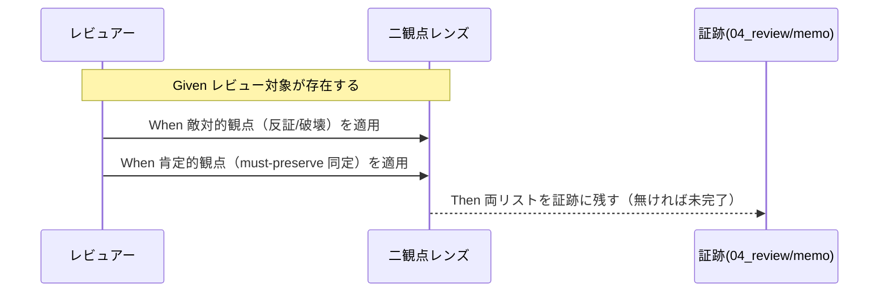
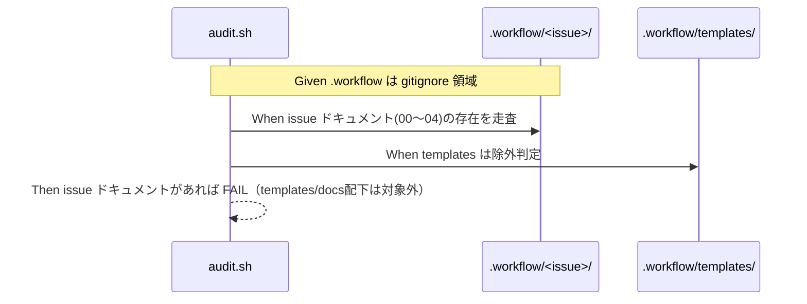

# 要件定義書: system-graph .agents-project ポリシーのコア取り込み

**プロジェクト名**: system-graph .agents-project ポリシーのコア取り込み
**作成日**: 2026 年 06 月 14 日
**最終更新**: 2026 年 06 月 14 日

> **重要**: **このドキュメントは常に更新**: 要件の変更や追加があった場合は、即座にこのドキュメントを更新してください。ドキュメントは「生きているドキュメント」として扱い、実装内容と常に同期させます。
>
> **用語**: [.agents/CONCEPTS.md §用語規約](../../../../../.agents/CONCEPTS.md#用語規約) を参照。

---

## 1. 概要

### 1.1 システム概要

別プロジェクト `system-graph/.agents-project/`（8 ポリシー）のうち、本リポジトリ AGENTS.md のコア（`.agents/`）に取り込むべきものを精査した調査結果を、取り込み候補ごとの受け入れ基準・スコープとして確定する。各候補は推奨度（高/中/低）で分類し、取り込み先・抽象ルールと固有値の分離・除外範囲を定める。本 issue 自体は「取り込み判定の正本」であり、後続の実装 issue が一意に起票できる状態を作る。

### 1.2 用語集

| 用語 | 説明 |
| -------- | ------ |
| コア | 本リポジトリ AGENTS.md の `.agents/`。実行契約の正本群。 |
| .agents-project | プロジェクト固有ルール。コアより優先（CORE.md:130-131）。 |
| must-preserve（不変条件） | レビューで維持すべき不変条件。退行/churn 防止のため肯定的観点で同定する。 |
| churn | 維持すべき不変条件を壊す不要な変更・揺り戻し。 |
| 退行 | 既存の正しい振る舞い・品質が低下すること。 |
| 二観点レビュー | 敵対的観点（反証/破壊）＋肯定的観点（must-preserve 同定）の両立。 |
| クローズアウト工程 | implement-feature 完了検知で起動する不変の完了処理（監査→as-built 同期→verify→commit→引継ぎ→/clear）。 |
| safe-clear invariant | 1 feature=1 コンテキストを保ち、安全に /clear できる境界。 |
| model ティア | サブ委譲時の model（haiku/sonnet/top, top=fable→opus 動的解決）。 |
| 抽象ルール/固有値 | コア化する汎用原則と、.agents-project に残す具体値の区別。 |
| 再発防止スコープ（P1/P2） | 本 issue 実行中に発生したプロセス契約違反の構造的原因（穴）を塞ぐ独立要求グループ。取り込みスコープとは別目的。 |
| 誤配置（P1） | 単一 issue を `.agents-project/` の上書き先（`docs/maintainer/workflow/`）でなく汎用標準の `.workflow/<ts>_<title>/`（gitignore 領域）に作ってしまうこと。 |
| 実装前 04 誤生成（P2） | implement-feature のログ・実装成果物が無い段階で 04_review.md を作成してしまうこと（PHASES §レビュー成果物の配置ルール違反）。 |
| issue ドキュメント | 00_要求定義.md / 01_要件定義.md / 02_設計.md / 03_実装計画.md / 04_review.md の総称。 |

---

## 2. 機能要件

### 2.1 ユーザーストーリー

#### ストーリー 1: 高推奨ポリシーをコアに取り込む

- **As a** コア（.agents/）の保守者
- **I want to** REVIEW_DUAL_LENS / CODE_COMMENT_REFERENCE / IMPLEMENTATION_CLOSEOUT の取り込み差分を確定したい
- **So that** churn/退行/陳腐化の各防止が、既存骨格と矛盾せずコアに補完される

**受け入れ基準**:

- REVIEW_DUAL_LENS の取り込み先（REVIEW_RULE.md 追記 or 新規 REVIEW_DUAL_LENS.md、skills/review/review-code・review-architecture の出力に両リスト要求）が明記されている。
- CODE_COMMENT_REFERENCE の取り込み先（RULES.md 1 節 or spec/ai/02_AIコード生成ガイド or 新規 CODE_COMMENT_RULES.md）と、許可（他コードファイル/シンボル参照）・禁止（仕様ドキュメント名・章節番号・PR/issue/タスク番号参照）の境界が明記されている。
- CLOSEOUT は既存重複部分を「追記差分にとどめる」とし、取り込む欠落差分（commit ステップ/別セッション引継ぎ/clear 境界・safe-clear invariant/fresh サブ分割＋収束保証/verify(ii) 実経路検証）と除外固有（make check/Docker、docs/97_、develop/main、Co-Authored-By、FakeDriver）が区別されている。

#### ストーリー 2: 中推奨ポリシーを条件付きでコア化する

- **As a** オーケストレーション設計者
- **I want to** MODEL_SELECTION と ISSUE_CREATION_CONTEXT の抽象原則のみをコア化したい
- **So that** マルチプラットフォーム中立性と CORE.md:137 を壊さずに、委譲品質とコンテキスト効率が改善される

**受け入れ基準**:

- MODEL_SELECTION は抽象原則（適用条件=Claude ランタイム時のみ/解決不能環境はデフォルト、ティア明記義務、品質ゲート最上位固定、未収束エスカレーション、対象外環境の明記）のみコア化と明記され、具体対応表・fable 期限・コスト実測・降格判断は .agents-project に残すと明記されている。
- ISSUE_CREATION_CONTEXT は「前提の CLOSEOUT がコアに無いためセット導入が条件」と明記され、汎用原理（作業単位=1issue、issue-persist 境界、1issue=fresh サブ、仕様 inventory 一度だけ索引化＋スライス渡し、起票順序の正本化、親 /clear）のみコア化と明記されている。

#### ストーリー 3: 低推奨ポリシーを理由付きで除外する

- **As a** コアの保守者
- **I want to** DOCS_RULES（system-graph 版）/WORKFLOW_REFERENCE/README をコア化対象外と明示したい
- **So that** 自己強制 CI の自己違反や二重定義の矛盾を未然に防ぐ

**受け入れ基準**:

- DOCS_RULES（system-graph 版）はコア本体変更不要とし、「保存先はプロジェクトで上書き可能」という拡張点を 1 行明記する以外はコア化しないと記載されている。00_review と 97_ の二重定義矛盾が除外理由として記載されている。
- WORKFLOW_REFERENCE は本タスク非推奨であり、§ 全廃がコアの即自己違反（self-enforcing CI で致命的）になることが除外理由として記載されている。
- README はコア化対象外（目録形式は参考のみ）と記載されている。

#### ストーリー 4: 横断的結合と導入順序を正本化する

- **As a** 後続実装 issue の起票者
- **I want to** 3 ポリシーの相互参照結合と推奨導入順序を 1 つの正本で参照したい
- **So that** 束導入・抽象/固有分離・着手順を迷わず守れる

**受け入れ基準**:

- 3 ポリシー（MODEL/CLOSEOUT/REVIEW_DUAL）の相互参照結合（MODEL §6→REVIEW_DUAL、REVIEW_DUAL §2.1(ii)→CLOSEOUT、CLOSEOUT §8.4→MODEL）が明記されている。
- 取り込むなら束（特に CLOSEOUT＋REVIEW_DUAL）で、各々を抽象ルールと固有値に必ず分離する方針が明記されている。
- 推奨導入順序（(1) CODE_COMMENT →(2) REVIEW_DUAL＋CLOSEOUT 束 →(3) MODEL →(4) ISSUE_CREATION）が明記されている。

#### ストーリー 5: issue 作成場所の取り違えを再発防止する（P1）

- **As a** コア（.agents/）の保守者・自己拡張運用者
- **I want to** issue 作成場所の上書きポインタの明示と、誤配置を検知する audit 失敗条件を確定したい
- **So that** `.agents-project/` の上書き（`docs/maintainer/workflow/`）を見落として `.workflow/`（gitignore 領域）に成果物を作る誤りが再発せず、誤配置が黙って git から消えない

**受け入れ基準**:

- **P1-a（ポインタ明示）**: CLAUDE.md §issue 作成タスク受領時の標準フロー に「**作成場所に `.agents-project/` の上書きがある場合はそれを最優先で参照する**」旨のポインタが記載されることが要求として明記されている。必要に応じて `.agents/workflow/PHASES.md` の「一般的な issue 作成ステップ」にも同趣旨を追記する旨が記載されている。
- **P1-b（誤配置 audit）**: `.agents/enforcement/ci/audit.sh` に「`.workflow/<issue>/` 配下に issue ドキュメント（00〜04）が存在する場合は FAIL」という新しい失敗条件を追加する旨が記載され、`.workflow/templates/` および `docs/maintainer/workflow/` 配下が**除外**であることが明記されている。
- **P1-c（読了強調・HEARTBEAT 案）**: command 実行前に `.agents-project/` を読了することの強調と、HEARTBEAT に「作成場所は `.agents-project/` の上書きを確認したか」を 1 項追加する**案**が記載されている。
- **整合**: 失敗条件は `.agents/enforcement/README.md` の失敗条件表（#1〜#25）に新番号として同期追加され、README と audit.sh で重複定義しない（CORE.md:137）方針が記載されている。

#### ストーリー 6: 実装前の 04_review.md 誤生成を再発防止する（P2）

- **As a** オーケストレーション設計者・コアの保守者
- **I want to** 実装前に 04_review.md が存在することを直接検知する audit 失敗条件を確定したい
- **So that** verify-and-close を実装前に誤委譲して 04_review.md を先行作成する誤りが、既存失敗条件 #3 では拾えない逆方向のケースとして検知される

**受け入れ基準**:

- **P2-a（実装前 04 audit）**: `.agents/enforcement/ci/audit.sh` に「当該 issue に implement-feature のログ（または実装成果物）が無いのに 04_review.md が存在する場合は FAIL」という新しい失敗条件を追加する旨が記載されている。
- **P2-b（HEARTBEAT 案）**: HEARTBEAT の「verify-and-close を飛ばしていないか」項に「**実装完了後か。実装前なら memo に記録し 04 は作らない**」を明示追記する**案**が記載されている。
- **P2-c（run_command 相互参照）**: run_command §実装前のドキュメントレビュー への相互参照を強化する旨が記載されている。
- **整合**: 失敗条件は既存 #3（04 欠落・未更新）の逆方向（先行作成）を補完するものであり、`.agents/enforcement/README.md` の失敗条件表に新番号として同期追加される旨が記載されている。

### 2.2 BDD ユースケース

#### ユースケース 1: 取り込み判定の網羅

8 候補それぞれに推奨度・可否・取り込み先・スコープ分離を確定する。

**シナリオ 1: 8 候補すべての判定網羅**

```gherkin
Feature: 取り込み判定の網羅
  Scenario: 8件すべてに判定が付与される
    Given system-graph/.agents-project/ の8ポリシーが調査対象である
    When コア取り込み判定を整理する
    Then 8件すべてに推奨度（高/中/低）が付与され
    And 各件に取り込み可否・取り込み先・抽象/固有の分離が記載されている
```

#### ユースケース 2: 高推奨ポリシーの差分特定

**シナリオ 2: REVIEW_DUAL_LENS の直交追加**

```gherkin
Feature: REVIEW_DUAL_LENS のコア化
  Scenario: 既存レビュー骨格に直交追加する
    Given コアには adversarial/affirmative/不変条件/退行 が grep 0件で欠落している
    And コアに既存レビュー骨格（指摘0反復・証跡必須、REVIEW_RULE.md/skills/review/*）が存在する
    When REVIEW_DUAL_LENS を取り込む
    Then 全レビューに敵対的観点＋肯定的観点（must-preserve 同定）の両方が必須化され
    And 両産物を証跡に残さないレビューは未完了と定義され
    And 深さは既存 quick/standard/full を流用する
```

**処理フロー**（必要に応じて）:



**シナリオ 3: CODE_COMMENT_REFERENCE の境界**

```gherkin
Feature: CODE_COMMENT_REFERENCE のコア化
  Scenario: 外部参照を禁止しコード参照を許可する
    Given コアにはコードコメントの外部参照禁止が無い
    When CODE_COMMENT_REFERENCE を取り込む
    Then コメント/docstring への仕様ドキュメント名・章節番号・PR/issue/タスク番号の参照を禁止し
    And 他コードファイル/シンボルの参照は許可（grep 追跡可）し
    And 相互参照リンク（closeout/workflow-ref）はコア内対応へ張り替える
```

**シナリオ 4: CLOSEOUT の層分離**

```gherkin
Feature: IMPLEMENTATION_CLOSEOUT のコア化
  Scenario: 既存重複は追記差分・欠落のみ取り込む
    Given 既存（verify必須・指摘0反復・04_review・90_issues）はコアに存在する
    When CLOSEOUT を取り込む
    Then 既存重複部分は追記差分にとどめ（CORE.md:137 正本1か所）
    And commit ステップ・別セッション引継ぎ・clear境界/safe-clear invariant・fresh サブ分割＋収束保証・verify(ii)実経路検証 のみを欠落差分として取り込み
    And make check/Docker・docs/97_・develop/main・Co-Authored-By・FakeDriver は固有として除外する
```

#### ユースケース 3: 中推奨の条件付き取り込み

**シナリオ 5: MODEL_SELECTION の抽象化と対象外環境明記**

```gherkin
Feature: MODEL_SELECTION のコア化
  Scenario: 抽象原則のみコア化しPF中立性を保つ
    Given コアは model 概念ゼロで run_command の委譲パケットにティア層が無い
    And コアはマルチプラットフォーム中立性（platforms/）を持つ
    When MODEL_SELECTION を取り込む
    Then 抽象原則（適用条件=Claudeランタイム時のみ/解決不能環境はデフォルト、ティア明記義務、品質ゲート最上位固定、エスカレーション）のみコア化し
    And 具体対応表・fable期限・コスト実測・降格判断は .agents-project に残し
    And 対象外環境を明記してPF中立性との緊張を緩和する
```

**シナリオ 6: ISSUE_CREATION のセット導入条件**

```gherkin
Feature: ISSUE_CREATION_CONTEXT のコア化
  Scenario: CLOSEOUT を前提にセット導入する
    Given ISSUE_CREATION の前提である CLOSEOUT がコアに無い
    When ISSUE_CREATION を取り込もうとする
    Then CLOSEOUT 汎用版を先に作りその姉妹として導入し
    And 汎用原理のみコア化し（固有数値/タグ除去/書記レース検証は除外）
    And 規模比例（単一/少数issueは軽量運用=CLAUDE.md標準フロー）を保つ
```

#### ユースケース 4: 低推奨の除外と自己違反防止

**シナリオ 7: WORKFLOW_REFERENCE の自己違反回避**

```gherkin
Feature: 自己違反の回避
  Scenario: § 全廃を本タスク非対象とする
    Given コアは § (U+00A7) を28ファイルで標準採用し audit.sh ロジックも依存する
    When WORKFLOW_REFERENCE_POLICY の § 全面禁止を評価する
    Then 取り込むとコアが self-enforcing CI で即自己違反すると判定し
    And 全コア §→「N節」一括置換は便益に対しコスト過大として本タスク非推奨とする
```

**シナリオ 8: DOCS_RULES 拡張点のみ汎用化**

```gherkin
Feature: DOCS_RULES の扱い
  Scenario: 拡張点のみ1行明記し本体は変更しない
    Given system-graph版 DOCS_RULES は保存先を docs/97_レビュー記録/ に上書きする固有ファイルである
    When コアへの取り込みを評価する
    Then 本体は変更不要とし
    And 「保存先はプロジェクトで上書き可能」という拡張点を1行明記するに留め
    And 取り込むと 00_review と 97_ が二重定義で矛盾するため本体は除外する
```

#### ユースケース 5: 横断的所見と導入順序

**シナリオ 9: 束導入と分離**

```gherkin
Feature: 横断的結合の取り扱い
  Scenario: 結合する3ポリシーは束で取り込み分離する
    Given MODEL/CLOSEOUT/REVIEW_DUAL は相互参照で結合している
    When これらを取り込む
    Then 個別切り出しで参照が宙に浮くことを避け、束（特にCLOSEOUT＋REVIEW_DUAL）で取り込み
    And 各々を「コア汎用の抽象ルール」と「.agents-project 固有の具体値」に必ず分離する
```

**シナリオ 10: 導入順序の遵守**

```gherkin
Feature: 導入順序
  Scenario: 推奨順で着手する
    Given 取り込み候補に依存関係（ISSUE_CREATION は CLOSEOUT 後）がある
    When 実装 issue を起票する
    Then (1)CODE_COMMENT →(2)REVIEW_DUAL＋CLOSEOUT束 →(3)MODEL →(4)ISSUE_CREATION の順とし
    And WORKFLOW_REF（§統一）/DOCS_RULES拡張点は任意の別タスクとする
```

#### ユースケース 6: 再発防止スコープ（P1/P2）の検証可能化

本 issue 実行中に発生した 2 件のプロセス契約違反を、検証可能な受け入れ基準・audit 失敗条件として確定する。

**シナリオ 11: 誤配置の audit 検知（P1-b）**

```gherkin
Feature: issue 作成場所の取り違え防止
  Scenario: gitignore 領域に issue ドキュメントがあると FAIL する
    Given 本リポは .agents-project/ により単一 issue を docs/maintainer/workflow/ へ上書きする
    And .workflow/<issue>/ は .gitignore 対象のランタイム領域である
    When .workflow/<issue>/ 配下に 00_要求定義.md 等の issue ドキュメントが存在する
    Then audit.sh は新しい失敗条件で FAIL を返し
    And .workflow/templates/ と docs/maintainer/workflow/ 配下は除外として誤検知しない
```

**処理フロー**（必要に応じて）:



**シナリオ 12: 上書きポインタの明示（P1-a）**

```gherkin
Feature: 上書きポインタの明示
  Scenario: CLAUDE.md に .agents-project 上書きへのポインタがある
    Given CLAUDE.md §issue 作成タスク受領時の標準フロー は汎用標準の作成先（.workflow/）を記載している
    When 作成場所の取り違え防止策を講じる
    Then 同セクションに「.agents-project/ の上書きがある場合はそれを最優先で参照する」旨のポインタが記載され
    And 必要に応じて PHASES.md の一般的な issue 作成ステップにも同趣旨が追記される
```

**シナリオ 13: 実装前 04 の audit 検知（P2-a）**

```gherkin
Feature: 実装前の 04_review.md 誤生成防止
  Scenario: implement ログが無いのに 04 があると FAIL する
    Given 既存失敗条件 #3 は 04 の欠落・未更新は検知するが先行作成は検知しない
    And 当該 issue に implement-feature のログ・実装成果物が無い
    When その issue 直下に 04_review.md が存在する
    Then audit.sh は新しい失敗条件で FAIL を返し
    And これは #3 の逆方向（先行作成）を補完する
```

**シナリオ 14: 失敗条件の単一同期追加（CORE.md:137 整合）**

```gherkin
Feature: 失敗条件の正本1か所
  Scenario: README と audit.sh に重複定義せず同期追加する
    Given コアは CORE.md:137 で正本1か所・重複禁止を最大制約とする
    When P1-b / P2-a の audit 失敗条件を追加する
    Then .agents/enforcement/README.md の失敗条件表に新番号として追記し
    And audit.sh はその実装として同期追加し
    And 定義文言を 2 か所に別文言で重複させない
```

### 2.3 ビジネスルール

- **正本1か所・重複禁止（CORE.md:137）を厳守**。既存にある工程は新規ファイルで重複させず追記差分にとどめる。
- **抽象ルールと固有値を必ず分離**。コア化するのは汎用原則のみ、具体値は .agents-project に残す。
- **自己強制 CI を破壊する取り込みは行わない**。特に § 全廃は本タスク非対象。
- **結合するポリシーは束で取り込む**（参照の宙吊りを避ける）。
- **依存順序を守る**（ISSUE_CREATION は CLOSEOUT 後）。
- **高リスク操作（push 等）はユーザー明示時のみ**（CLOSEOUT の commit ステップでも push は明示時のみ）。
- **（再発防止 P1）** 単一 issue の作成場所は `.agents-project/` の上書きを最優先で参照する。本リポでは `docs/maintainer/workflow/<ts>_<title>/`。`.workflow/<issue>/`（gitignore 領域）に issue ドキュメントを作らない。
- **（再発防止 P2）** 04_review.md は実装完了後の verify-and-close でのみ作成する。実装前のレビュー証跡は memo に残す。
- **（再発防止 P1/P2 共通）** 新規 audit 失敗条件は README の失敗条件表と audit.sh に単一番号として同期追加し、重複定義しない（CORE.md:137）。`.workflow/templates/`・`docs/maintainer/workflow/` 配下は誤配置検知の対象外とする。

---

## 3. 非機能要件

### 3.1 パフォーマンス要件

- 取り込み実装がコンテキスト肥大（コスト主因）を増やさないこと。fresh サブ分割・仕様 inventory の一度だけ索引化＋スライス渡しを保持する。

### 3.2 セキュリティ要件

- 外部サービス書き込み・push 等の高リスク操作は既存ルールどおりユーザー明示時のみ実行する方針を逸脱しない。

### 3.3 ユーザビリティ要件

- 後続の実装 issue が、本 issue を読むだけで取り込み先・スコープ・順序を一意に決定できること。
- 取り込み判定の証跡（根拠）を省略しないこと。

### 3.4 可用性要件

- 本 issue は「生きているドキュメント」として、取り込み方針の変更時に即更新する。

---

## 4. 外部インターフェース要件

### 4.1 API 要件

- 本 issue は文書成果物のため、API 要件は該当なし。取り込み先となるコアのインターフェース（run_command.md の委譲パケットに「ティア明記」1 項、LOAD_POLICY トリガー表に 1 行追加等）は各実装 issue で具体化する。

### 4.2 データ形式要件

- 成果物は Markdown。テンプレート（.workflow/templates/00_要求定義.md, 01_要件定義.md）の見出し・セクション構成・必須項目に従う。

---

## 5. 制約事項

- CORE.md:137「正本1か所・重複禁止」が最大制約。CLOSEOUT の既存重複部分は追記差分に限定。
- マルチプラットフォーム中立性（platforms/）を壊さない。MODEL_SELECTION は対象外環境を明記。
- コアの § 標準採用（28 ファイル＋audit.sh）を壊さない。§ 全廃は本タスク非対象。
- 3 ポリシー（MODEL/CLOSEOUT/REVIEW_DUAL）は相互参照結合のため束で取り込み、抽象/固有を分離。
- ISSUE_CREATION は CLOSEOUT を前提とするセット導入。
- **（再発防止 P1/P2）** audit 失敗条件の追加は CORE.md:137（正本1か所・重複禁止）を厳守し、README 失敗条件表（#1〜#25）への新番号追加と audit.sh 実装を同期させる（重複定義しない）。誤配置検知は `.workflow/<issue>/` 配下に限定し、`.workflow/templates/`・`docs/maintainer/workflow/` を除外する。
- **（再発防止 P1/P2）** HEARTBEAT への追記は既存項目への 1 行追記案にとどめ、全面改訂をしない。

---

## 6. 参考資料

### プロジェクトドキュメント

- [`00_要求定義.md`](./00_要求定義.md) - 要求定義

### その他の参考資料

- 調査対象 8 ファイル: `system-graph/.agents-project/`（REVIEW_DUAL_LENS_POLICY.md / CODE_COMMENT_REFERENCE_POLICY.md / IMPLEMENTATION_CLOSEOUT_POLICY.md / MODEL_SELECTION_POLICY.md / ISSUE_CREATION_CONTEXT_POLICY.md / DOCS_RULES.md / WORKFLOW_REFERENCE_POLICY.md / README.md）
- コア比較対象: 本リポジトリ `.agents/`（CORE.md:130-131/137、CONCEPTS.md:58、REVIEW_RULE.md、skills/review/\*、RULES.md（quick/standard/full）、run_command.md、LOAD_POLICY.md、DOCS_RULES.md、platforms/）
- 再発防止 P1/P2 の対象ファイル: `CLAUDE.md` §issue 作成タスク受領時の標準フロー、`.agents-project/自己拡張ワークフロー.md`、`.agents/workflow/PHASES.md`（§レビュー成果物の配置ルール・一般的な issue 作成ステップ）、`.agents/enforcement/README.md`（失敗条件 #1〜#25・audit.sh 必須チェック一覧）、`.agents/enforcement/ci/audit.sh`、`.agents/skills/agent/run_command.md`（§実装前のドキュメントレビュー）、`.agents/HEARTBEAT.md`

---

## 7. 前のステップ

この要件定義書は、以下のドキュメントを基に作成されています：

- **前**: [`00_要求定義.md`](./00_要求定義.md) - 要求定義フェーズ

---

## 8. 次のステップ

この要件定義書の承認後、以下のドキュメントを作成します：

- **次**: [`02_設計.md`](./02_設計.md) - 設計フェーズ
