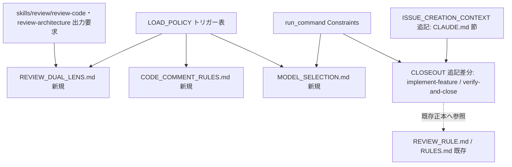
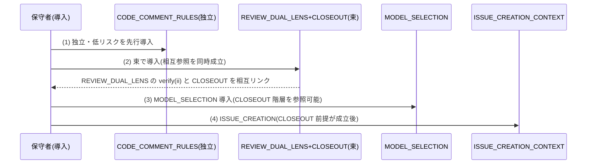
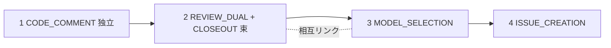
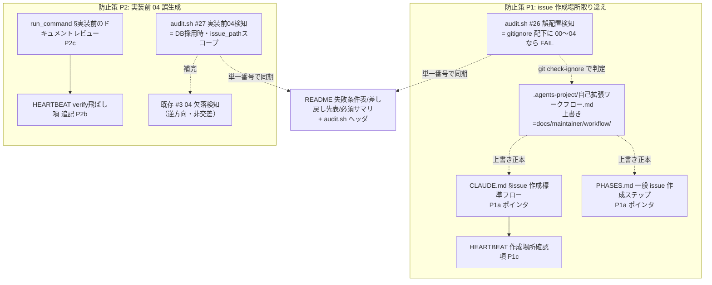
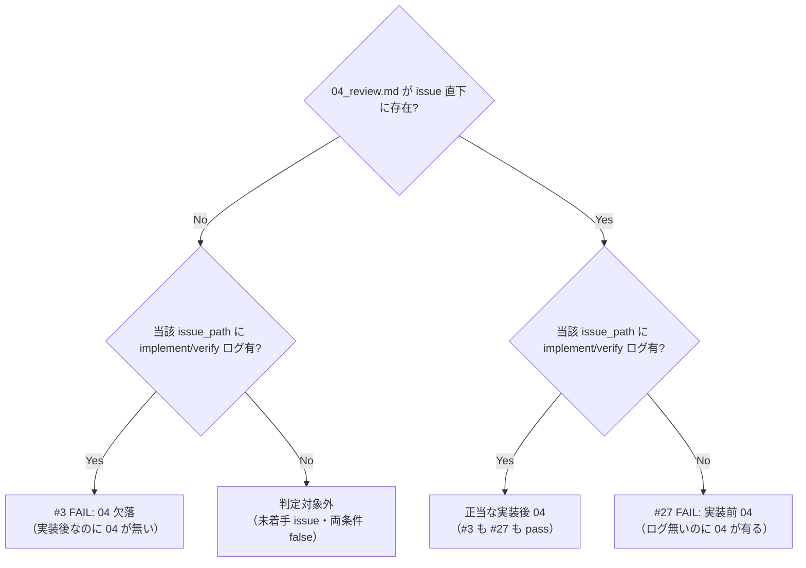

# 設計書: system-graph .agents-project ポリシーのコア取り込み

**プロジェクト名**: system-graph .agents-project ポリシーのコア取り込み
**作成日**: 2026 年 06 月 14 日
**最終更新**: 2026 年 06 月 14 日

> **重要**: **このドキュメントは常に更新**: 設計の変更や追加があった場合は、即座にこのドキュメントを更新してください。ドキュメントは「生きているドキュメント」として扱い、実装内容と常に同期させます。
>
> **用語**: [.agents/CONCEPTS.md §用語規約](../../../../../.agents/CONCEPTS.md#用語規約) を参照。

---

## 1. 設計概要

**必須**: 設計方針・原則は [.agents/spec/01\_設計原則.md](../../../../../.agents/spec/01_設計原則.md) を**先に参照**した上で、本プロジェクトに**適用するものを選び**記載すること。

### 1.1 設計方針

本設計は「コードの設計」ではなく **コア実行契約（`.agents/`）への文書ポリシー取り込みの設計**である。02_設計の各章は、取り込む 5 ポリシー（高 3・中 2）を「どのコアパスに・新規/追記のどちらで・どんな節構成と配線で入れるか」を一意に定め、後続実装 issue が迷わず差分を起票できる状態を作る。最上位制約は **CORE.md:137「正本1か所・重複禁止」** であり、既存にある工程は新規ファイルで重複させず**追記差分**にとどめる。

### 1.2 設計原則（本プロジェクトで適用するもの）

- **単一責務**: 1 ポリシー=1 コアファイル（または既存ファイルの 1 節）とし、配線（LOAD_POLICY トリガー・run_command Constraints・skills 出力要求）は本体に重複させず参照で繋ぐ。
- **明確な境界**: 「コアに置く抽象ルール」と「`.agents-project/` に残す具体値」の境界を対象ごとに明示し、採用先が上書き/拡張する拡張ポイントを設計する。
- **AIフレンドリー設計**: 小さなファイル・明確な責務・意図が分かる命名（REVIEW_DUAL_LENS.md / CODE_COMMENT_RULES.md 等）・既存ディレクトリ階層（`.agents/` 直下と `skills/review/`）に収め深いネストを避ける。
- **UNIX哲学**: 1 ファイルは 1 つのことをうまくやり、LOAD_POLICY / run_command / skills を pipe のように組み合わせて配線する（正本は本体・配線は索引）。

> **AIフレンドリー設計**: 本プロジェクトでは [01\_設計原則 §AIフレンドリー設計](../../../../../.agents/spec/01_設計原則.md#aiフレンドリー設計) を適用し、各ポリシーを小さな単一責務ファイルに分割し既存の浅い階層へ配置する。

---

## 2. アーキテクチャ設計

### 2.1 責務・境界・参照関係

[01\_設計原則 §明確な境界・§単一責務](../../../../../.agents/spec/01_設計原則.md) に従い、取り込み対象（=コンポーネント）の責務・境界・参照関係を明示する。

#### 2.1.1 責務一覧

| コンポーネント（取り込み対象） | 推奨度 | 配置方式 | 責務（1 文） |
| ------------------------------ | ------ | -------- | ------------ |
| REVIEW_DUAL_LENS（新規 `.agents/REVIEW_DUAL_LENS.md`） | 高 | 新規 | 全レビューに敵対的観点＋肯定的（must-preserve 同定）観点の両立を必須化し、両産物未記載のレビューを未完了と定義する。 |
| CODE_COMMENT_RULES（新規 `.agents/CODE_COMMENT_RULES.md`） | 高 | 新規 | コメント/docstring への外部参照（仕様名・章節番号・PR/issue/タスク番号）を禁止し、コードファイル/シンボル参照は許可する。 |
| IMPLEMENTATION_CLOSEOUT（既存 `commands/implement-feature.md`・`verify-and-close.md` への追記差分） | 高 | 追記 | implement-feature 完了検知で起動する不変クローズアウトの**欠落工程のみ**を補い、既存重複は正本を参照させる。 |
| MODEL_SELECTION（新規 `.agents/MODEL_SELECTION.md`） | 中 | 新規 | サブ委譲時の model ティア選定の**抽象原則のみ**を規定し、具体値は `.agents-project/` に委ねる。 |
| ISSUE_CREATION_CONTEXT（既存 `CLAUDE.md` §issue 作成フロー・新規節 or CLOSEOUT 姉妹節） | 中 | 追記（CLOSEOUT 後） | 大規模一括起票時のコンテキスト肥大防止の汎用原理のみを規定する。 |
| 配線レイヤ（LOAD_POLICY.md / run_command.md / skills/review/\*） | - | 追記 | 上記本体を「いつ読むか・委譲時に何を強制するか・どの出力を要求するか」で結線する索引。本体定義は持たない。 |

#### 2.1.2 境界

- **入力**: 00/01 で確定した取り込み判定（高 3・中 2・低 3）と、既存コア（CORE.md:137、REVIEW_RULE.md、RULES.md、run_command.md、LOAD_POLICY.md、skills/review/\*、platforms/）。
- **出力**: 新規 3 ファイル（REVIEW_DUAL_LENS.md / CODE_COMMENT_RULES.md / MODEL_SELECTION.md）＋既存への追記差分（implement-feature/verify-and-close、LOAD_POLICY トリガー表、run_command Constraints、skills/review 出力要求、CLAUDE.md issue 節）。本 02 は**配置・配線・分離・順序の設計**であり、本文確定は各実装 issue。
- **他責務との境界（本設計の範囲外）**: (a) WORKFLOW_REFERENCE 由来の **§ 全廃・一括置換は設計外**（低・別タスク、自己違反リスク）。(b) **DOCS_RULES 拡張点 1 行明記は設計外**（低・別タスク）。(c) 各ポリシー本文の逐語執筆と実 grep 規則の実装は 03 以降の実装 issue。

#### 2.1.3 参照関係

- 呼び出し方向（配線）: `LOAD_POLICY`（トリガー）→ 各ポリシー本体。`run_command`（委譲時 Constraints）→ MODEL_SELECTION / CLOSEOUT。`skills/review/*`（出力要求）→ REVIEW_DUAL_LENS。
- 本体間の束結合: `MODEL_SELECTION` →（実効性）→ `REVIEW_DUAL_LENS`、`REVIEW_DUAL_LENS`（verify(ii) 様式）→ `CLOSEOUT`、`CLOSEOUT`（モデル階層）→ `MODEL_SELECTION`。3 者は相互参照のため**束で導入**し、参照先が宙に浮かない順序で入れる（§2.4・§3.4）。
- 重複回避: CLOSEOUT の既存重複（verify 必須・指摘 0 反復・04_review・90_issues）は本体を持たず **REVIEW_RULE.md / run_command.md / RULES.md の既存正本へリンク**する。循環参照は本体定義としては持たず、相互リンク（索引）のみとする。

### 2.2 システムアーキテクチャ

**必須**: 設計判断は [.agents/spec/](../../../../../.agents/spec/)（[00_spec概要.md](../../../../../.agents/spec/00_spec概要.md)、[01\_設計原則.md](../../../../../.agents/spec/01_設計原則.md)、[06\_設計判断の優先順位.md](../../../../../.agents/spec/06_設計判断の優先順位.md)）を**先に**参照すること。

- **採用パターン**: 「正本（本体ファイル）＋索引（配線）」の**レイヤ分離パターン**。本体（実行契約）と配線（LOAD_POLICY トリガー・run_command Constraints・skills 出力要求）を分け、本体は 1 か所、配線は参照のみとする。
- **根拠**: CORE.md:137「正本1か所・重複禁止」と [06\_設計判断の優先順位] の「重複より参照」に従う。配線を本体から分離することで、既存重複（CLOSEOUT）を追記差分に閉じ込め、自己強制 CI 違反を回避できる。

#### 2.2.1 CQRS（Command/Query 分離）

本設計は文書ポリシーのため厳密な CQRS は非該当。準えると、**本体ファイル=Query（参照される正本の状態）**、**配線（LOAD_POLICY/run_command/skills 出力要求）=Command（いつ読み・何を強制するかの作用）**として責務を分離する。

#### 2.2.2 アーキテクチャ図（本プロジェクトの構成で記載）

### 2.3 コンポーネント構成

明確な境界と単一責務に従い、各対象を以下に配置する（[01\_設計原則 §明確な境界・§単一責務](../../../../../.agents/spec/01_設計原則.md)）。

- **新規本体（`.agents/` 直下）**: `REVIEW_DUAL_LENS.md`、`CODE_COMMENT_RULES.md`、`MODEL_SELECTION.md`。各 1 責務。
- **追記差分（既存）**: `commands/implement-feature.md`・`commands/verify-and-close.md`（CLOSEOUT 欠落工程）、`CLAUDE.md` §issue 作成フロー（ISSUE_CREATION 汎用原理）。
- **配線（既存・追記のみ）**: `boot/LOAD_POLICY.md` トリガー表、`skills/agent/run_command.md` Constraints、`skills/review/review-code/`・`skills/review/review-architecture/` の出力要求。

### 2.4 データフロー

ここでは「取り込み（導入）順序」と「レビュー時の二観点適用」のフローを示す。発行イベント相当の「起きた事実」は **PolicyAdded / WiringLinked** と捉える。

---

## 3. 機能設計

### 3.1 機能 1: 高推奨 3 件の配置設計

#### 3.1.1 概要

REVIEW_DUAL_LENS / CODE_COMMENT_REFERENCE / IMPLEMENTATION_CLOSEOUT を、新規/追記の別・コアパス・節構成・配線で具体化する。

#### 3.1.2 配置・節構成・配線

**(A) REVIEW_DUAL_LENS — 新規 `.agents/REVIEW_DUAL_LENS.md`**

- 節構成: `§1 目的（churn/退行防止）` / `§2 二観点（2.1 敵対的=反証・破壊、不確実なら要修正に倒す / 2.2 肯定的=must-preserve 不変条件の同定）` / `§3 証跡要求（両リスト未記載は未完了）` / `§4 深さ（既存 quick/standard/full を流用、新規深さ概念を導入しない）` / `§5 参照（REVIEW_RULE.md・CLOSEOUT verify(ii)・MODEL_SELECTION）`。
- 配線: LOAD_POLICY トリガー表に「レビュー実施時」行から REVIEW_DUAL_LENS を読む 1 行を追加。`skills/review/review-code` と `review-architecture` の出力に「敵対的観点リスト」「must-preserve リスト」両方を必須出力として追記。REVIEW_RULE.md は正本 RULES.md の補助のままとし、二観点は新規ファイルに**直交追加**（既存骨格を改変しない）。
- 汎用/固有境界: コア=二観点の必須化と証跡要求（抽象）。`.agents-project/`=プロジェクト固有のレビューチェック項目・深さ閾値の具体運用。拡張ポイント=採用先が「観点ごとの追加チェックリスト」を `.agents-project/` で**拡張**できる（コアは必須最小集合のみ規定）。

**(B) CODE_COMMENT_REFERENCE — 新規 `.agents/CODE_COMMENT_RULES.md`**

- 節構成: `§1 目的（陳腐化防止・正本1か所と整合）` / `§2 禁止（コメント/docstring への仕様ドキュメント名・章節番号・PR/issue/タスク番号の参照）` / `§3 許可（他コードファイル/シンボル参照=grep 追跡可）` / `§4 相互参照の張り替え（外部リンクはコア内対応へ）` / `§5 enforcement（CI grep 検出、§3.5 参照）`。
- 配線: LOAD_POLICY トリガー表に「実装・コメント記述時」1 行追加。RULES.md からは 1 行リンク（本体は新規ファイル、重複させない）。spec/ai のガイドがあればそこからも参照リンク。
- 汎用/固有境界: コア=参照の許可/禁止カテゴリ（抽象）。`.agents-project/`=禁止対象の具体パターン追加や言語別 docstring 慣習。拡張ポイント=採用先が grep パターンを `.agents-project/` で追補可能。

**(C) IMPLEMENTATION_CLOSEOUT — 既存への追記差分のみ（新規本体を作らない）**

- 既存重複（**追記しない・正本参照のみ**）: verify 必須・指摘 0 反復・04_review・90_issues は **REVIEW_RULE.md / run_command.md Constraints / RULES.md の既存正本へリンク**する。CORE.md:137 を厳守し新規重複ファイルを作らない。
- 取り込む**欠落差分**（`commands/implement-feature.md`・`commands/verify-and-close.md` に追記）: (i) commit ステップ（抽象形: 1 サブ issue=1 論理コミット／デフォルトブランチなら feature ブランチ／**push はユーザー明示時のみ**）、(ii) 別セッション引継ぎ＋再開プロンプト、(iii) /clear 境界・safe-clear invariant（1 feature=1 コンテキスト）、(iv) fresh サブ分割＋収束保証（却下済み指摘＋理由の継承）、(v) verify(ii) 実経路検証。
- 除外（固有・取り込まない）: make check/Docker、docs/97_レビュー記録/、develop/main、Co-Authored-By トレーラ、FakeDriver。
- 汎用/固有境界: コア=工程の抽象形（commit 粒度・引継ぎ・clear 境界）。`.agents-project/`=ブランチ名・CI コマンド・トレーラ等の具体値。

#### 3.1.3 入力・出力

- **入力**: 00/01 の高推奨判定、既存 REVIEW_RULE.md・RULES.md・run_command.md・skills/review/\*。
- **出力**: 新規 2 ファイル＋ CLOSEOUT 追記差分の配置・節構成・配線の確定（実装 issue が一意起票可能）。

#### 3.1.4 エラーハンドリング（設計上の失敗回避）

- CLOSEOUT で既存重複を本体化しようとした場合は設計違反（CORE.md:137）。レビュー時に「新規ファイルに既存工程を再記述していないか」を検査する。

### 3.2 機能 2: 中推奨 2 件の条件付き配置設計

#### 3.2.1 概要

MODEL_SELECTION と ISSUE_CREATION_CONTEXT を抽象原則のみで配置し、後者は CLOSEOUT 後のセット導入とする。

#### 3.2.2 配置・節構成・配線

**(D) MODEL_SELECTION — 新規 `.agents/MODEL_SELECTION.md`**

- 節構成: `§1 適用条件（Claude ランタイム時のみ。解決不能環境はデフォルト＝対象外環境を明記）` / `§2 ティア明記義務（委譲時にティアを明示）` / `§3 品質ゲート最上位固定` / `§4 未収束エスカレーション` / `§5 参照（REVIEW_DUAL_LENS の実効性・CLOSEOUT のモデル階層）`。
- 配線: 新規ファイル＋ `run_command.md` Constraints に「委譲時はティアを明記する」1 項を追加＋ LOAD_POLICY トリガー表に 1 行（「サブ委譲のモデル選定時」→ MODEL_SELECTION）。
- 汎用/固有境界: コア=抽象原則（適用条件・ティア明記義務・品質最上位・エスカレーション・対象外環境明記）。`.agents-project/`=具体対応表（haiku/sonnet/top, top=fable→opus）・fable 期限・コスト実測・降格判断。**対象外環境の明記でマルチ PF 中立性との緊張を緩和**。拡張ポイント=採用先がティア対応表を `.agents-project/` で定義（コアは表を持たない）。

**(E) ISSUE_CREATION_CONTEXT — 追記（CLOSEOUT 後のセット導入）**

- 配置: CLOSEOUT 汎用版の姉妹として、`CLAUDE.md` §issue 作成フロー近傍または CLOSEOUT 追記節に汎用原理を追記。**CLOSEOUT がコアに成立後にのみ導入**（前提依存）。
- 取り込む汎用原理: 作業単位=1 issue、issue-persist 境界、1 issue=fresh サブ、仕様 inventory 一度だけ索引化＋スライス渡し、確定起票順序の正本化、親 /clear。規模比例（単一/少数 issue は CLAUDE.md 標準フローの軽量運用を保つ）。
- 除外（固有）: 固有数値・タグ除去・書記レース検証。
- 汎用/固有境界: コア=コンテキスト効率の汎用原理。`.agents-project/`=具体数値・タグ運用。

#### 3.2.3 入力・出力

- **入力**: 00/01 の中推奨判定、run_command.md・LOAD_POLICY.md・platforms/、CLAUDE.md §issue 作成フロー。
- **出力**: MODEL_SELECTION 新規ファイル＋ 2 配線、ISSUE_CREATION 追記設計（CLOSEOUT 後）。

#### 3.2.4 エラーハンドリング

- MODEL_SELECTION に具体対応表を書くと PF 中立性違反 → 設計上「対応表はコア禁止」を明記。ISSUE_CREATION を CLOSEOUT 前に導入すると前提欠落 → 導入順序ガード（§3.4）で防ぐ。

### 3.3 機能 3: enforcement 連動の切り分け

#### 3.3.1 概要

機械強制可能な規則と困難な規則を切り分け、CI 反映要否を述べる。

#### 3.3.2 切り分け

- **機械強制可能（CI grep で検出）**: CODE_COMMENT_RULES の外部参照禁止（コメント中の章節番号・PR/issue/タスク番号パターンを grep 検出）。REVIEW_DUAL_LENS の両リスト存在（04_review に両見出しがあるかの構造チェック）。→ enforcement への反映を**推奨**（実装は別 issue、本 02 は要否のみ判定）。
- **機械強制困難**: /clear 境界・safe-clear invariant（実行コンテキストの状態に依存）、別セッション引継ぎの質、fresh サブの収束保証。→ 規約・監査観点（人手レビュー）で担保し、CI 強制は対象外と明記。
- **設計外（明記）**: § 一括移行・WORKFLOW_REFERENCE の §→「N節」置換は**低・別タスク**で設計外。DOCS_RULES 拡張点 1 行明記も**低・別タスク**で設計外。

### 3.4 機能 4: 束依存と導入順序の解決

#### 3.4.1 概要

MODEL/CLOSEOUT/REVIEW_DUAL の相互参照が宙に浮かない導入順序と相互リンクを定める。

#### 3.4.2 順序設計

推奨導入順序（00/01 と一致）: **(1) CODE_COMMENT（独立・低リスク）→ (2) REVIEW_DUAL＋CLOSEOUT 束 → (3) MODEL_SELECTION → (4) ISSUE_CREATION（CLOSEOUT 後）**。各ファイルの相互参照は導入時に相手の節アンカーへ相互リンクし、参照先未存在を作らない。束(2)は REVIEW_DUAL の verify(ii) と CLOSEOUT を同一 issue で同時成立させる。

---

## 4. データ設計

文書ポリシーの取り込みのためテーブル設計は非該当。代わりに**取り込み対象の属性表**を成果物の構造として示す。

### 4.1 データモデル（取り込み対象の属性）

| 対象 | 推奨度 | 配置 | コアパス | 配線先 |
| ---- | ------ | ---- | -------- | ------ |
| REVIEW_DUAL_LENS | 高 | 新規 | `.agents/REVIEW_DUAL_LENS.md` | LOAD_POLICY ＋ skills/review/\* 出力要求 |
| CODE_COMMENT_RULES | 高 | 新規 | `.agents/CODE_COMMENT_RULES.md` | LOAD_POLICY ＋ RULES.md リンク ＋ CI grep |
| IMPLEMENTATION_CLOSEOUT | 高 | 追記 | `commands/implement-feature.md`・`verify-and-close.md` | 既存正本へ参照（重複回避） |
| MODEL_SELECTION | 中 | 新規 | `.agents/MODEL_SELECTION.md` | run_command Constraints ＋ LOAD_POLICY |
| ISSUE_CREATION_CONTEXT | 中 | 追記 | `CLAUDE.md` §issue 節 / CLOSEOUT 姉妹 | CLOSEOUT 前提後に導入 |

### 4.2 データ構造

各新規ファイルは「§番号付き節＋末尾参照リンク」の共通構造。配線は既存ファイルへの最小行追加（トリガー 1 行・Constraints 1 項・出力要求 1 項）に限定する。

---

## 5. API 設計

外部 API は非該当。**内部インターフェース（配線契約）**を以下に定める。

### 5.1 インターフェース一覧

| インターフェース | 種別 | 説明 |
| ---------------- | ---- | ---- |
| LOAD_POLICY トリガー表 | 索引 | 「いつ各新規ポリシーを読むか」を 1 行ずつ追加（重複禁止・本表のみ更新） |
| run_command Constraints | 委譲契約 | 委譲時に「ティア明記」「CLOSEOUT 欠落工程の実行」を強制 |
| skills/review/\* 出力要求 | 出力契約 | 04_review に敵対的観点＋ must-preserve 両リストを必須出力 |

### 5.2 インターフェース詳細

- **LOAD_POLICY**: 追加行はトリガー（例「レビュー実施時」「実装・コメント記述時」「サブ委譲のモデル選定時」）→ 読むファイルの形。本表が唯一の正本（既存方針に従う）。
- **run_command Constraints**: 既存の Constraints 群に項を**追記**（MODEL ティア明記・CLOSEOUT 欠落工程）。本体定義は各ポリシーファイルに置き、Constraints は強制トリガーのみ。

---

## 6. テスト戦略

テスト戦略の**観点の定義**は [RULES.md のテスト戦略必須要件](../../../../../.agents/RULES.md#テスト戦略必須要件) を、**BDD 形式の定義**は [TEST_BDD_FORMAT.md](../../../../../.agents/TEST_BDD_FORMAT.md) を参照すること。本ドキュメントでは**対象ごとのテスト割当**のみ記載する。本 issue の成果物は文書（取り込み設計）であるため、単体テストは「規約適合の検証手段（CI grep・監査チェック）」に読み替える。

### 6.1 対象ごとのテスト割り当て

| 対象 | 単体(規約検証) | 結合/API(配線検証) | E2E(導入順序) | クリティカル観点 | バリデーション観点 | 未達理由/補足 |
| ---- | ---- | ---- | ---- | ---- | ---- | ---- |
| REVIEW_DUAL_LENS | ○ | ○ | × | 04_review に両リストが存在するか | 両リスト未記載で未完了判定されるか | E2E は導入後運用で確認 |
| CODE_COMMENT_RULES | ○ | ○ | × | CI grep が外部参照を検出するか | 許可（コード参照）を誤検出しないか | grep パターン精度は実装 issue |
| IMPLEMENTATION_CLOSEOUT | ○ | ○ | × | 既存重複が追記でなく本体化されていないか（CORE.md:137） | push がユーザー明示時のみか | 実経路 verify は手動観点含む |
| MODEL_SELECTION | ○ | ○ | × | 対象外環境でデフォルト動作するか | 具体対応表がコアに混入していないか | PF 中立性 |
| ISSUE_CREATION_CONTEXT | × | ○ | ○ | CLOSEOUT 前提成立後に導入されているか | 規模比例の軽量運用が保たれるか | 導入順序ガードに依存 |

### 6.2 監査・レビューでの確認（証跡）

証跡の確認観点は RULES §テスト戦略必須要件および workflow/PHASES.md の監査観点を参照。本 §6.1 の割当表と 03_実装計画のタスク別テスト観点・BDD が揃っていることを確認する。特に「(a) 新規ファイルに既存工程を重複記述していない（CORE.md:137）」「(b) 束導入順序で参照先が宙に浮かない」「(c) MODEL_SELECTION に具体対応表が混入しない」「(d) CI grep で機械強制可能な規則の反映要否が記録されている」を監査必須観点とする。

**03 へ渡す論点**: (1) CODE_COMMENT 外部参照の grep 正規表現の具体化と誤検出回避。(2) REVIEW_DUAL の 04_review 構造チェックの自動化方式。(3) CLOSEOUT 欠落工程の implement-feature/verify-and-close への具体差分文面と既存正本リンク先の確定。(4) MODEL_SELECTION の「対象外環境＝デフォルト」の判定基準。(5) ISSUE_CREATION 導入順序ガードの実装（CLOSEOUT 未導入時の警告/ブロック）。

---

## 7. UI 設計

UI は非該当。（コア実行契約の文書取り込みのため画面設計なし。）

---

## 8. セキュリティ設計

### 8.1 認証・認可

非該当。ただし**高リスク操作の取り扱い**を設計に反映する: CLOSEOUT の commit ステップにおける **push はユーザー明示時のみ**（RULES §高リスク操作）。設計上、push を自動化する文面をコアに置かない。

### 8.2 データ保護

非該当。固有値（トレーラ・CI コマンド等）はコアに持ち込まず `.agents-project/` に閉じることで、採用先の機密/固有情報がコアへ漏出しない境界を保つ。

---

## 9. 非機能要件への対応

### 9.1 パフォーマンス（コンテキスト効率）

CLOSEOUT/ISSUE_CREATION は「工程ごと fresh サブ分割」「仕様 inventory の一度だけ索引化＋スライス渡し」を保持し、コンテキスト肥大（コスト主因）を増やさない設計とする。新規ファイルは小さく単一責務に保ち、配線は最小行追加に限定する。

### 9.2 可用性（自己強制 CI 不違反・正本1か所）

§ 全廃を設計外とし、CLOSEOUT 既存重複を追記差分に限定することで、コアが自己強制 CI で即自己違反する事態を回避する。本設計は「生きているドキュメント」として、取り込み方針変更時に即更新する。

---

## 9.5 再発防止策（P1/P2）の設計

> **位置づけ**: 本節は §1〜§9 の system-graph 取り込みスコープ（高 3・中 2 の文書ポリシー取り込み）とは**別目的の独立要求グループ**（00 §2.3・01 ストーリー 5/6 / ユースケース 6）。本 issue 実行中に露見したコアのプロセス契約の**構造的な穴**（P1: issue 作成場所取り違え／P2: 実装前 04 誤生成）を塞ぐ自己改善である。最上位制約は §1 と同じく **CORE.md:137「正本1か所・重複禁止」**。本節は memo `20260614_174137_00-01再発防止スコープ追記レビュー.md` の **H-1・H-2 を解消**し、M-1〜M-3・L-2 を吸収する設計を確定する。
>
> **本節の出力境界**: 本 02 は**配置・配線・precondition・除外イディオム・番号採番・同期箇所**の設計であり、audit.sh / README / CLAUDE.md / HEARTBEAT / run_command の**逐語実装は 03 以降の実装 issue**。

### 9.5.1 責務・境界・参照関係

| コンポーネント | 防止策 | 配置方式 | 責務（1 文） |
| -------------- | ------ | -------- | ------------ |
| CLAUDE.md §issue 作成標準フロー ポインタ | P1(a) | 追記 | 単一 issue の作成場所は `.agents-project/` の上書きを**最優先で確認**すべき旨を明示し、汎用標準の作成先（`.workflow/`）をそのまま採用させない。 |
| PHASES.md 一般 issue 作成ステップ ポインタ | P1(a) | 追記 | 同趣旨を phase 手順側にも 1 行で配線（重複定義でなく相互参照）。 |
| audit.sh 新失敗条件 **#26**（誤配置検知） | P1(b)★H-1 | 追記 | issue ドキュメント(00〜04)が **git 追跡対象外（gitignore 配下）のパスに存在したら FAIL** という**汎用安全判定**で、一般消費者を誤 FAIL させずに本リポの誤配置のみ検知する。 |
| HEARTBEAT「作成場所確認」項 | P1(c) | 追記 | orchestrator が command 実行前に「作成場所は `.agents-project/` の上書きを確認したか」を自己診断する 1 項。 |
| audit.sh 新失敗条件 **#27**（実装前 04 検知） | P2(a)★H-2 | 追記 | **workflow.db 採用時のみ**・**issue_path スコープ限定**で「implement/verify ログが 1 件も無いのに 04_review.md が存在＝FAIL」を検知し、既存 #3（04 欠落）の**逆方向**を補完する。 |
| HEARTBEAT「verify-and-close 飛ばし」項 追記 | P2(b) | 追記 | 「実装完了後か。実装前なら memo に記録し 04 は作らない」を既存 5 項へ 1 行追記。 |
| run_command §実装前のドキュメントレビュー 相互参照 | P2(c) | 追記 | 「実装前は memo・04 は実装完了後の verify-and-close のみ」の相互参照を強化。 |
| README 失敗条件表＋差し戻し先表＋必須チェックサマリ＋audit.sh ヘッダ | P1/P2 整合 | 追記（同期） | #26/#27 を**全箇所に単一番号として同期追加**（CORE.md:137 正本1か所・重複禁止）。 |

**境界（本設計の範囲外）**: (a) 既存 #1〜#25 の判定ロジック改変はしない（#26/#27 は**新規追加**）。(b) HEARTBEAT の全面改訂はしない（既存項への 1 行追記・1 項追加のみ。00 §5・01 §5）。(c) §1〜§9 の取り込み 5 ポリシーとは対象ファイルが重ならない（L-1 で矛盾なしを確認済）。

**参照関係（Mermaid 1 点）**:

### 9.5.2 P1 設計（issue 作成場所取り違え防止）

#### (a) 上書きポインタの具体文面と差し込み位置

- **差し込み位置 1（CLAUDE.md）**: §issue 作成タスク受領時の標準フロー の冒頭「作成先（2パターン）」の**直前**に注記行を 1 行追加する。
  - **文面案**: 「**作成場所の上書き最優先**: `.agents-project/`（本リポでは `.agents-project/自己拡張ワークフロー.md`）に issue 作成場所の上書き定義がある場合は、下記の汎用標準より**それを最優先で参照**する。本リポジトリの単一 issue / サブ issue の正は `docs/maintainer/workflow/...`（`.workflow/` ではない）。」
  - **根拠**: 読み手が「作成先（2パターン）」の `.workflow/...` をそのまま採用する前に、上書きの存在を必ず通る位置に置く（穴 (i) を塞ぐ）。
- **差し込み位置 2（PHASES.md）**: 一般的な issue 作成ステップの該当箇所に、CLAUDE.md と同趣旨の 1 行ポインタを**相互参照**として追記（本体定義は CLAUDE.md / `.agents-project/` に置き、PHASES は索引）。重複定義を避けるため「作成場所は `.agents-project/` の上書きを最優先で確認（CLAUDE.md §issue 作成標準フロー参照）」とリンク形にとどめる。

#### (b) ★H-1 解消 — 誤配置検知の汎用安全判定（採用案: gitignore 判定）

**H-1 の問題**（memo H-1）: 「`.workflow/<issue>/` 配下に issue ドキュメントがあれば FAIL」という**無条件**判定を配布 audit.sh に入れると、一般消費者では `.workflow/<issue>/` が**正規の作成先**であるため**全消費者で誤 FAIL** する。本リポ（`docs/maintainer/workflow/` を正とする自己拡張）でのみ妥当な判定を、配布物に無条件で焼き込んではならない。

**採用案: 「issue ドキュメント(00〜04)が git 追跡対象外（gitignore 配下）のパスに存在したら FAIL」**

- **判定方法**: `WORKFLOW_DIR`（既定 `.workflow`）配下を走査し、`00_*.md`／`01_*.md`／`02_*.md`／`03_*.md`／`04_*.md` にマッチするファイル `f` について、`git check-ignore -q "$f"`（プロジェクトルートで実行）が **真（= gitignore 配下）なら FAIL**。
  - **一般消費者**: `.workflow/<issue>/` を gitignore していない（= issue を追跡する）運用なら `check-ignore` は偽 → **pass**。`.workflow/<issue>/` 全体を gitignore している消費者は「issue を追跡しない」設計を自ら選んでいるため、そもそも誤配置概念が無く、本検知は発火しない（実害なし）。
  - **本リポ**: ルート `.gitignore` に `/.workflow/*`（templates 除く）があるため、`.workflow/<issue>/00_要求定義.md` は `check-ignore` 真 → **FAIL**。`docs/maintainer/workflow/...` は追跡対象なので `check-ignore` 偽 → pass。これにより「正は `docs/maintainer/workflow/`」へ正しく誘導される。
  - **検証済み事実**: `git check-ignore` は `.workflow/foo/00_要求定義.md` を ignore と返し、`docs/maintainer/workflow/x/00_要求定義.md` と `.workflow/templates/00_要求定義.md` は返さない（exit 非真）。本設計の前提が実環境で成立することを確認済み。
- **`.workflow/templates/` の扱い**: ルート `.gitignore` の `!/.workflow/templates/` により templates は**追跡対象（= ignore されない）**。よって `check-ignore` は偽 → **自動的に非対象**。加えて既存 audit.sh の除外イディオム `[[ "$f" == *"/templates/"* ]] && continue`（section 4/5/7/9/20）を**踏襲して二重に保険**をかける（M-2 念押し）。
- **`docs/` の扱い**: 既定走査範囲は `WORKFLOW_DIR`（`.workflow`）のみで `docs/` は元から走査対象外（M-1）。よって「`docs/maintainer/workflow/` を除外」は**走査範囲外ゆえ自明**であり、明示的な除外分岐は不要。設計文面としては「走査は `.workflow/<issue>/` のみ。templates を除外。`docs/...` は走査範囲外で自動的に非対象」と精緻化して冗長記述を避ける（M-1 解消）。
- **誤検知回避まとめ**: (i) templates は ignore されないため pass ＋ 既存イディオムで二重除外、(ii) docs は走査外、(iii) 追跡している issue（正しい作成先）は ignore されないため pass。**FAIL するのは「gitignore 配下のパスに issue ドキュメントを置いた」＝定義上の誤配置のみ**。

**代替案との比較**:

| 案 | 判定軸 | 一般消費者での安全性 | 採否 |
| -- | ------ | -------------------- | ---- |
| 採用案: gitignore 判定 | `git check-ignore` が真なら FAIL | **高**（追跡運用なら pass。消費者の運用差を自動吸収） | **採用** |
| 代替案 1: `.agents-project` の上書き定義を読んで適用 | `.agents-project/` の作成場所表を parse し、その外＝FAIL | 低〜中（`.agents-project/` の文面形式に依存・パース脆弱・消費者は別形式で上書きしうる） | 不採用（脆弱・配布物が `.agents-project` 形式に密結合） |
| 代替案 2: 環境変数オプトイン（自己拡張時のみ有効化） | `AUDIT_SELF_EXTEND=1` の時だけ `.workflow` 配下 issue を FAIL | 中（明示的で安全だが、設定忘れで検知が無効化＝再発防止が効かない） | 不採用（検知の確実性が運用設定に依存） |

採用案は **git の追跡状態という客観的・汎用的な事実**で判定するため、`.agents-project` の文面形式や環境変数設定に依存せず、一般消費者で誤 FAIL せず、本リポでのみ正しく FAIL する。H-1 が要求した「適用範囲＝自己拡張運用に限定」を、**特別な条件分岐なしに git 追跡状態で自然に表現**できる点が優れる。

#### (c) HEARTBEAT 追記（P1(c)）

HEARTBEAT.md の Heartbeat Checklist に**新 1 項**（既存 2「phase は何か」付近、issue 着手時に通る位置）を追加する。

- **文面案（新項）**: 「**issue の作成場所を確認したか** — 単一/サブ issue を作る場合、`.agents-project/` に作成場所の上書き定義があれば**それを最優先で参照**したか。本リポの正は `docs/maintainer/workflow/...`（`.workflow/` 配下に作っていないか）。」

### 9.5.3 P2 設計（実装前 04_review 誤生成防止）

#### (a) ★H-2 解消 — 実装前 04 検知の precondition 確定

**H-2 の問題**（memo H-2）: 「implement ログ無し＋04 存在＝FAIL」を素朴に実装すると、(i) 過去にコミット済みで正当に完了した issue（DB リセット/別 clone でログが揃わない）、(ii) DB を採用しない過渡運用（memo 運用、README 許容）で**正当な実装後 04 を一律 FAIL** にする。また「実装成果物」の定義が「ログ or git 差分」の両論併記で**評価順が未定義**。

**確定 precondition（#27 の発火条件）**: 次を**すべて満たす**場合に限り FAIL とする。

- **(i) workflow.db 採用時のみ適用**: `command -v sqlite3` かつ `WORKFLOW_DIR/workflow.db` が存在し `workflow_log` テーブルがある場合のみ評価する。**DB 不採用環境（memo 運用）は SKIP**（既存 #3・#8・#9 と同じガード様式を踏襲）。これにより H-2 問題(ii) を解消。
- **(ii) 判定スコープは当該 issue ディレクトリ**: 04_review.md が存在する各 issue ディレクトリの**相対パス（issue_path）一致**で `workflow_log` を引く。全体集計ではなく `issue_path = '<当該 issue>'` でスコープし、他 issue のログ有無に影響されない（H-2 問題1 の「別 issue の状態で誤判定」を排除）。既存 section 9 の `issue_path_rel="${issue_dir#$PROJECT_ROOT/}"` ＋ SQL エスケープ `${...//\'/\'\'}` イディオムを踏襲。
- **(iii)「実装成果物あり」の定義**: **workflow.db の implement-feature ログの存在を主**とする。具体的には「当該 issue_path に `command IN ('implement-feature','verify-and-close')` のログが**1 件も無い**」を「実装前」と判定する。**git 差分は補助**（GIT_RANGE 依存で不安定なため**一次判定には用いない**。L-2 の用語「実装成果物」は「DB の implement-feature ログを一次、git 差分は補助」と定義を確定）。

**#27 の最終判定式**: 「(DB 採用) かつ (issue ディレクトリ直下に `04_review.md` 存在) かつ (当該 `issue_path` に implement-feature/verify-and-close ログが 0 件)」→ **FAIL**。

- これは「正当な実装後 04」を誤検知しない: 正当な 04 は verify-and-close で作られ、その時点で当該 issue_path に implement/verify ログが必ず 1 件以上ある（既存 #3 の順方向が保証）。よって**ログがある正当 04 は #27 では発火しない**。
- 過去コミット済み issue の DB リセットケースは「DB 不採用 or 当該 issue ログ皆無」だが、(i) で DB 不採用は SKIP、DB はあるがログ皆無は「監査対象の現行 DB が当該 issue を知らない」状態であり、本リポ運用では再生成 DB に当該 issue のログが入る前提のため実害が小さい。**受け入れ基準（01 シナリオ 13）に「DB 不採用環境では SKIP」「issue_path 一致でスコープ」を補う**ことを 03 へ申し送る。

#### 既存 #3 との非交差（図）

- **非交差の保証**: #3 が発火するのは「04 **無** ＋ ログ **有**」、#27 が発火するのは「04 **有** ＋ ログ **無**」。両条件の前段（04 の有無）が**排他**なので、**同一状況で #3 と #27 が同時発火することはない**（memo H-2 問題2 の「矛盾する差し戻し先」を構造的に排除）。差し戻し先も #3＝「verify-and-close を再実行し 04 を作成」、#27＝「04 を削除し memo へ移して実装後に再生成」と方向が逆で一意。

#### (b) 番号採番と全箇所同期（DoD）

- **採番**: 既存は #1〜#25（#22〜#24 は subagent-guard/runtime 専用で audit.sh 非実装）。新 audit.sh チェックは **#26（P1 誤配置）／#27（P2 実装前 04）** を採番する。
- **同期箇所（CORE.md:137 正本1か所・重複禁止のため、定義文言は README を正・audit.sh は実装とし、別文言で重複させない）**。以下を**すべて**同期更新することを DoD とする（M-3 解消）:
  1. `.agents/enforcement/README.md` **失敗条件表**（L157–183 の `| # | 失敗条件 | 説明 | 差し戻し先 |`）に #26・#27 行を追加。
  2. `.agents/enforcement/README.md` **差し戻し先固定表**（L189–212）に #26・#27 の修正対象・再実行手順を追加。
  3. `.agents/enforcement/README.md` **必須チェックサマリ**（L77 の「audit.sh が実施する必須チェック」`(1)…(25)`）に (26)(27) を追加。
  4. `.agents/enforcement/ci/audit.sh` **ヘッダコメント**（L6–28 の「必須チェック」一覧 ＋ L30–48 の「失敗とみなす条件」）に #26・#27 を追加。
  5. `.agents/enforcement/ci/audit.sh` **本体**に #26・#27 のチェック関数を追加（既存の `check_*` 関数様式・`EXIT_CODE=1`・`$ROLLBACK_MSG` 出力を踏襲）。
- **差し戻し先（新規）**: #26 →「issue ドキュメントを `.agents-project/` の上書き先（本リポは `docs/maintainer/workflow/`）へ移動し、`.workflow/<issue>/`（gitignore 配下）から除去。CLAUDE.md §issue 作成標準フローのポインタを確認」。#27 →「実装前なら 04_review.md を削除し memo にレビュー証跡を残す。実装完了後に verify-and-close を実行して 04 を再生成」。

#### (b/c) HEARTBEAT・run_command 追記

- **P2(b) HEARTBEAT**: 既存項 5「verify-and-close を飛ばしていないか」の小項目に 1 行追記する。
  - **文面案**: 「**実装完了後か** — 実装前の段階であれば 04_review.md は作らず memo にレビュー証跡を残す。04_review.md は実装完了後の verify-and-close でのみ作成する（PHASES §レビュー成果物の配置ルール・run_command §実装前のドキュメントレビュー）。」
- **P2(c) run_command 相互参照強化**: `.agents/skills/agent/run_command.md` の §実装前のドキュメントレビュー に、「実装前は memo に証跡を残し、04_review.md は**実装完了後の verify-and-close のみ**で作成する。誤って実装前に 04 を作ると audit #27 で FAIL する」を相互参照として追記（PHASES §レビュー成果物の配置ルール・enforcement #27 へリンク）。

### 9.5.4 enforcement 連動と機械強制の切り分け（P1/P2）

- **機械強制可能（audit.sh で実装）**: #26（git check-ignore による誤配置検知）・#27（DB・issue_path スコープによる実装前 04 検知）。いずれも客観事実（git 追跡状態・DB ログ）で判定でき、CI 強制に適する。
- **規約・自己診断で担保（CI 非強制）**: P1(a) ポインタの存在・P1(c)/P2(b) HEARTBEAT 自己診断・P2(c) run_command 相互参照は文書整備であり、CI で構造チェックする対象ではない（HEARTBEAT は orchestrator の実行時自己点検）。

### 9.5.6 ★N-1 解消 — 走査スコープの複数ディレクトリ対応（#26 維持・#27 の穴を塞ぐ）

> **位置づけ**: memo `20260614_175816_03再発防止タスクレビュー.md` の **N-1（Med）** を正式に設計へ反映する。前段レビューは「02/03 大筋修正不要」と判定したが、本節は N-1 の本質（走査基点の不一致）を**設計レベルで明確化**し、#27 が本リポ自身の自己拡張 issue を保護できるよう走査スコープを確定する。最上位制約は §9.5 と同じく **CORE.md:137「正本1か所・重複禁止」**。

#### (a) N-1 の本質（走査基点 `WORKFLOW_DIR` と本リポの実 issue 配置の不一致）

- **事実**: audit.sh の走査基点 `WORKFLOW_DIR` の既定は `.workflow`（audit.sh:54）。一方、本リポの自己拡張 issue は `.agents-project/自己拡張ワークフロー.md` の上書きにより **`docs/maintainer/workflow/` に置かれる**（00〜04 はすべて git 追跡対象）。
- **#26（誤配置検知）への影響＝無し（現状維持で正しい）**: #26 は「gitignore 配下（git 追跡対象外）のパスに issue ドキュメントがあれば FAIL」（§9.5.2(b)）。**誤って `.workflow/<issue>/`（gitignore 配下）に置かれた成果物を捕まえる**のが目的であり、`.workflow` を走査基点に含めるのは**本来の責務に合致**。走査範囲を後述のとおり `docs/maintainer/workflow/` まで広げても、そこは git 追跡対象なので `git check-ignore` は偽 → **pass**（誤検知しない）。よって #26 は走査範囲拡大でも安全。
- **#27（実装前 04 検知）への影響＝穴（本節で塞ぐ）**: #27 は「issue ディレクトリ直下に 04_review.md があり当該 issue にログ 0 件なら FAIL」（§9.5.3）。`.workflow` しか走査しないと、**誤り2（実装前 04 誤生成）が実際に起きうる当の場所＝本リポの `docs/maintainer/workflow/` 配下 issue に対して無力**。再発防止の対象そのものをカバーできていない。これが N-1 の核心。

#### (b) 採用方針 — 走査基点の複数ディレクトリ対応（既定リスト＋環境変数）

audit.sh の各走査（#1/#2b/#4/#5/#7/#26/#27/#20 等が `find "$PROJECT_ROOT/$WORKFLOW_DIR" ...` で回す）を、**単一の `WORKFLOW_DIR` ではなく走査ディレクトリの「リスト」**で回せるようにする。

- **走査ディレクトリリストの決定（後方互換を維持）**:
  - 環境変数 `WORKFLOW_DIRS`（コロン区切り）が指定されればそれを採用。
  - 未指定時の**既定リスト**は、従来どおり `WORKFLOW_DIR`（既定 `.workflow`）を**必ず含む**。加えて、プロジェクトの issue 実配置（`.agents-project` 上書きで定義される場所）として **`docs/maintainer/workflow` が実在すれば**それを既定リストに追加する（存在しなければ追加しない＝汎用消費者では `.workflow` のみ）。
  - 既存の単一変数 `WORKFLOW_DIR` も引き続き尊重する（明示指定で従来挙動に固定可能）。
- **後方互換（汎用消費者＝`.agents-project` 上書き無し）**: `docs/maintainer/workflow` が存在しない消費者では既定リストは `.workflow` のみとなり、**従来と完全に同一挙動**。issue を `.workflow/<issue>/` に置く汎用消費者で #26/#27 とも従来どおり機能する。`WORKFLOW_DIRS`/`WORKFLOW_DIR` 未設定時の既定は破壊的変更を起こさない。
- **#27 の保護範囲が本リポの実 issue に届く**: 既定リストに `docs/maintainer/workflow` が入ることで、本リポの自己拡張 issue（`docs/maintainer/workflow/<issue>/04_review.md`）に対しても #27 が「ログ 0 件＋04 存在＝実装前 04」を検知できる。誤り2 の発生当地を保護できる。
- **#26 が `docs/...` を誤 FAIL しないこと**: §9.5.2(b) の判定は `git check-ignore` 真のみ FAIL。`docs/maintainer/workflow/...` は git 追跡対象で `check-ignore` 偽 → pass。走査範囲を広げても #26 は誤検知しない（既述の事実）。`.workflow/templates/` の二重除外イディオムも維持。

#### (c) continue-on-error 運用下の前提（検知はするが CI ブロックはしない）

- **現状の前提**: `.github/workflows/self-enforce.yml`（L119–130）は本リポで audit.sh を **continue-on-error（非ブロッキング）** で実行する（`bash audit.sh . || echo "[audit] non-blocking: ..."`）。理由はコメントに「本リポの issue は docs/maintainer/workflow 配下で audit.sh は .workflow 前提のため」と明記されている。
- **本節の設計の前提として記述**: 上記 (b) で走査スコープを `docs/maintainer/workflow` まで広げると、本リポの実 issue に対して #27 が**検知（FAIL 出力）するようになる**が、**continue-on-error のままでは CI を赤くしない（ブロックしない）**。本節は「検知できる状態にする」ことを目的とし、**ブロッキング化（continue-on-error の解除）は別タスク（任意）として切り分ける**。走査スコープ拡大によって本リポ現行状態が自己 FAIL を出さない（完了済み issue は前方一致で pass・未着手 issue は 04 不在で非発火）ことは §9.5.5/§2bis.7 のテストで担保する。なお self-enforce のブロッキング化を将来行う場合は、走査スコープ拡大が前提となる（先に検知が届くようにしてからブロッキング化する順序）。

#### (d) 前方一致有効性の検証レベル（N-1 申し送りの DoD 文言精緻化）

- N-1 が指摘するとおり、本リポでは (1) CI が非ブロッキング、(2)（修正前は）#27 走査が `.workflow` 限定で docs 配下 issue に届かない、の二重理由で「現行 audit 全実行で新たな FAIL が出ない」が**自明に成立**してしまい、#27 の表記揺れ前方一致（§9.5.3(a)）の有効性を audit 全実行だけでは実証しきれない。
- よって **前方一致の有効性検証は audit 全実行ではなく、SQL レベル（§9.5.5 検証観点・§2bis.7 テスト(iv) の `sqlite3` 直接クエリ）で担保する**ことを設計上の要件として固定する。走査スコープを (b) で広げた後も、前方一致の正しさは SQL レベルテストで独立に確認する（audit 全実行の pass はスコープ設定に左右されるため一次根拠にしない）。

### 9.5.5 03 実装計画へ渡す検証観点

1. **#26 誤検知テスト（一般消費者ケース）**: `.workflow/<issue>/` を gitignore していない（issue を追跡する）擬似消費者リポで、`.workflow/<issue>/00_要求定義.md` を置いても **pass** すること（`git check-ignore` 偽 → 非 FAIL）。
2. **#26 検知テスト（自己拡張ケース）**: 本リポ相当（`/.workflow/*` gitignore）で `.workflow/<issue>/00_要求定義.md` を置くと **FAIL**、`docs/maintainer/workflow/<issue>/00_要求定義.md` と `.workflow/templates/00_要求定義.md` は **pass** すること。
3. **#27 非交差テスト（既存 #3 との排他）**: 「04 有＋ログ無」で #27 のみ FAIL・#3 非発火、「04 無＋ログ有」で #3 のみ FAIL・#27 非発火、「04 有＋ログ有」で両者 pass、を確認。
4. **#27 SKIP テスト（DB 不採用）**: workflow.db が無い／sqlite3 が無い環境で #27 が SKIP（誤 FAIL しない）こと。
5. **#27 issue_path スコープテスト**: 他 issue にログがあっても当該 issue にログが無ければ当該 issue のみ FAIL（他 issue のログで救済されない）こと。
6. **同期検証**: #26/#27 が README 失敗条件表・差し戻し先表・必須チェックサマリ・audit.sh ヘッダ・本体の**全箇所**に存在し、定義文言が README 正・audit.sh 実装で重複していない（CORE.md:137）こと。
7. **templates 除外二重保険テスト**: `.workflow/templates/` 配下の 00〜04 が #26 で**絶対に**拾われない（gitignore 非対象 ＋ `/templates/` 除外イディオム）こと。
8. **★N-1 走査スコープテスト（#27 が本リポ実 issue に届く）**: 既定リストに `docs/maintainer/workflow` が含まれ、`docs/maintainer/workflow/<issue>/04_review.md`＋ログ 0 件 の擬似 issue に対し #27 が **FAIL** すること（修正前は走査外で無力だった穴が塞がれる）。完了済み issue（前方一致でログあり）は **pass**。
9. **★N-1 後方互換テスト（汎用消費者）**: `docs/maintainer/workflow` が存在しない（`.agents-project` 上書き無し）擬似消費者で、走査ディレクトリリストが `.workflow` のみとなり #26/#27 が**従来どおり**動くこと（`WORKFLOW_DIRS`/`WORKFLOW_DIR` 未設定時の既定が破壊的変更を起こさない）。
10. **★N-1 前方一致の SQL レベル検証**: #27 の表記揺れ前方一致の有効性は audit 全実行（スコープ設定・continue-on-error に左右される）ではなく **`sqlite3` 直接クエリ**で確認すること（検証観点 4/§2bis.7(iv) と一体）。

---

## 10. 参考資料

### プロジェクトドキュメント

- [`01_要件定義.md`](./01_要件定義.md) - 要件定義
- [`00_要求定義.md`](./00_要求定義.md) - 要求定義

### その他の参考資料

- コア比較対象: `.agents/`（CORE.md:130-131/137、REVIEW_RULE.md、RULES.md、skills/agent/run_command.md、boot/LOAD_POLICY.md、skills/review/\*、platforms/）

---

## 11. 前のステップ

この設計書は、以下のドキュメントを基に作成されています：

- **前**: [`01_要件定義.md`](./01_要件定義.md) - 要件定義フェーズ

---

## 12. 次のステップ

この設計書の承認後、以下のドキュメントを作成します：

- **次**: [`03_実装計画.md`](./03_実装計画.md) - 実装計画フェーズ
