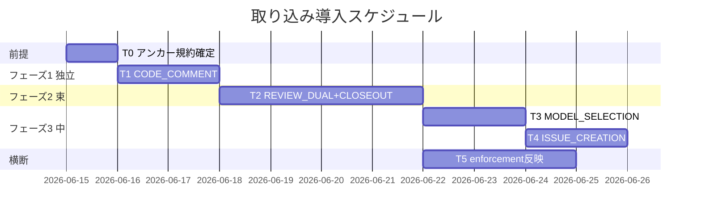
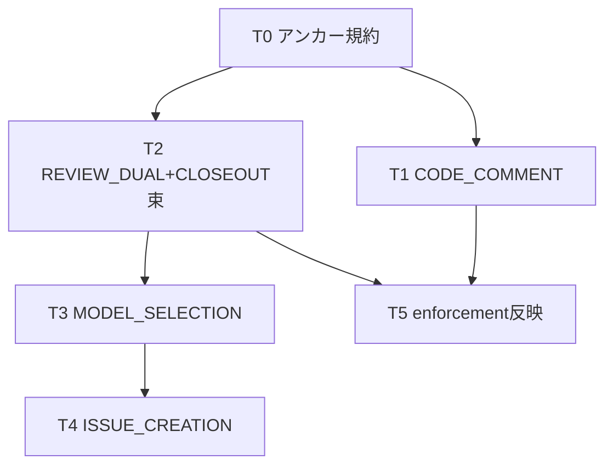
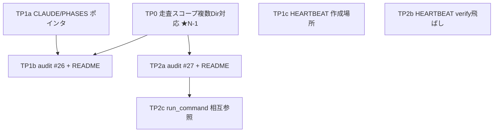

# 実装計画書: system-graph .agents-project ポリシーのコア取り込み

**プロジェクト名**: system-graph .agents-project ポリシーのコア取り込み
**作成日**: 2026 年 06 月 14 日
**最終更新**: 2026 年 06 月 14 日

> **重要**: **このドキュメントは常に更新**: 実装計画の変更、進捗状況の更新、バグの記録などがあった場合は、即座にこのドキュメントを更新してください。ドキュメントは「生きているドキュメント」として扱い、実装内容と常に同期させます。
> **必須項目**: 「必須」と明記した欄は空欄・抽象語のみで提出しないこと。テスト観点・BDD 仕様は具体ケースを 1 件以上記載すること。
>
> **用語**: [.agents/CONCEPTS.md §用語規約](../../../../../.agents/CONCEPTS.md#用語規約) を参照。

---

## 1. 実装概要

### 1.1 実装方針（必須）

02_設計の「本体（正本）＋索引（配線）」レイヤ分離パターンを実行可能なタスク列に落とす。新規 3 本（`.agents/REVIEW_DUAL_LENS.md` / `CODE_COMMENT_RULES.md` / `MODEL_SELECTION.md`）＋既存追記差分（implement-feature / verify-and-close / CLAUDE.md issue 節）＋配線（LOAD_POLICY トリガー表・run_command Constraints・skills/review/\* 出力要求）を、**CORE.md:137「正本1か所・重複禁止」**を最上位制約に、束依存の宙吊りを作らない導入順序で各 issue 化する。各タスクは「新規 or 追記」「対象パス」「追記節見出し」「配線行」を一意に持ち、04 の低 3 指摘（前方参照アンカー固定・ISSUE_CREATION 配置一意化・grep 規則具体化）を必ずタスクとして解消する。

### 1.2 実装順序（必須: 1 件以上）

02 §3.4 の推奨導入順序に一致させる。**(1) CODE_COMMENT（独立・低リスク）→ (2) REVIEW_DUAL＋CLOSEOUT 束 → (3) MODEL_SELECTION → (4) ISSUE_CREATION（CLOSEOUT 後）**。横断タスクとして (5) enforcement 反映、(0) 共通前提（アンカー規約）を置く。



> **注**: 本 issue 自体は「取り込み判定・設計の正本」であり、実コードはまだ変更しない。T1〜T5 は**後続実装 issue として起票するための計画**である（02 §2.1.2 出力境界）。

---

## 2. タスク分解

**用語**: [.agents/CONCEPTS.md §用語規約](../../../../../.agents/CONCEPTS.md#用語規約) を参照。

**必須**: 各タスクには **「テスト観点」（2.x.3）** と **「単体テスト仕様（BDD）」（2.x.4）** を必ず記載する。観点の定義は **02\_設計 §6** および **RULES のテスト戦略・[TEST_BDD_FORMAT.md](../../../../../.agents/TEST_BDD_FORMAT.md)** を参照。本書は**タスクごとの具体ケース**のみ記載する。

### 2.0 タスク 0: 前方参照アンカー規約の確定（04 指摘1の解消・全タスクの前提）

#### 2.0.1 概要（必須）

新規 3 本が相互参照する節アンカーの命名・固定規約を先に確定し、束導入時に参照先未存在（宙吊り）を作らない（04 指摘1）。

#### 2.0.2 実装内容（必須: 1 件以上）

- 各新規ファイルの節アンカー ID を固定文字列で命名規約化する。確定アンカー: `REVIEW_DUAL_LENS.md#2-2-肯定的観点`（must-preserve）・`#3-証跡要求`、`CLOSEOUT`側は追記節見出し `## クローズアウト（欠落工程の補完）` 配下の小見出し `### verify-実経路検証` を verify(ii) アンカーとする、`MODEL_SELECTION.md#5-参照`。02 §2.1.3 の「MODEL→REVIEW_DUAL→CLOSEOUT→MODEL」の 3 リンクを、この確定アンカーで張る。
- 相互リンクは**導入と同一 issue 内で双方向に同時固定**する（片側のみ先行コミットしない）。
- アンカー一覧表を本 03 §2.0.5 の依存図に残し、各実装 issue が参照する。

#### 2.0.3 テスト観点（必須）

**参照**: 観点の定義は [02\_設計 §6](./02_設計.md) および [RULES のテスト戦略](../../../../../.agents/RULES.md#テスト戦略必須要件) を参照。

##### 単体（本タスクの具体ケース・必須 1 件以上）
- 確定アンカー表の各リンク先見出しが、対応する新規ファイルの節見出しスラッグと文字一致する（リンク切れ 0 件）。

##### 結合/API（該当時）
- 該当なし（規約確定のみ。配線検証は T1〜T4 に従属）。

##### E2E/受け入れ（未達時は理由記載）
- 束 T2 導入後に `grep` で 3 相互リンクが双方向に存在し、参照先見出しが実在することを確認（E2E は T2 完了時に実施）。

##### バリデーション（該当時）
- 該当なし。

#### 2.0.4 単体テスト仕様（BDD）（必須）

```gherkin
Feature: 前方参照アンカーの固定
  Scenario: 相互リンク先が実在する
    Given REVIEW_DUAL_LENS / CLOSEOUT追記節 / MODEL_SELECTION が同一束で導入される
    When 3者の相互参照リンクを確定アンカーで張る
    Then 各リンクの参照先見出しが実ファイルに存在し
    And 片側のみ存在する宙吊りリンクが 0 件である
```

```bash
# Given: 新規/追記ファイルに節見出しが存在する
# When: 相互リンクのアンカー(#...)を抽出し参照先見出しと突合する
# Then: 全リンクの参照先が実在（リンク切れ 0）であること
grep -rEoh '\]\(([^)]*\.md)?#[^)]+\)' .agents/REVIEW_DUAL_LENS.md .agents/MODEL_SELECTION.md
```

#### 2.0.5 依存関係

- 後続: T1〜T4 すべての前提（特に T2 束の相互リンク固定）。



#### 2.0.6 見積もり

- **工数**: 0.5 日 / **優先度**: 高（前提）

---

### 2.1 タスク 1: CODE_COMMENT_RULES の新規導入（独立・低リスク先行）

#### 2.1.1 概要（必須）

コメント/docstring への外部参照を禁止しコード参照を許可する規約を新規本体で導入する（02 §3.1.2(B)）。

#### 2.1.2 実装内容（必須: 1 件以上）

- **新規作成**: `/.agents/CODE_COMMENT_RULES.md`。追記する節見出し: `## 1 目的（陳腐化防止・正本1か所と整合）` / `## 2 禁止（仕様ドキュメント名・章節番号・PR/issue/タスク番号の参照）` / `## 3 許可（他コードファイル/シンボル参照=grep 追跡可）` / `## 4 相互参照の張り替え（外部リンクはコア内対応へ）` / `## 5 enforcement（CI grep 検出。T5 参照）`。
- **配線（追記差分）**:
  - `/.agents/boot/LOAD_POLICY.md` トリガー表に 1 行追加: `| 実装・コメント記述時 | CODE_COMMENT_RULES.md |`。
  - `/.agents/RULES.md` から 1 行リンク（本体は新規ファイル、重複させない）。
- **汎用/固有境界**: コア=許可/禁止カテゴリ（抽象）。`.agents-project/`=言語別 docstring 慣習・追加 grep パターン（拡張ポイント）。

#### 2.1.3 テスト観点（必須）

**参照**: [02\_設計 §6](./02_設計.md) / [RULES テスト戦略](../../../../../.agents/RULES.md#テスト戦略必須要件)。

##### 単体（必須 1 件以上）
- 正常系: LOAD_POLICY トリガー表に「実装・コメント記述時 → CODE_COMMENT_RULES.md」行が 1 行だけ存在する。
- 境界: RULES.md 内に CODE_COMMENT の本文が再記述されておらず、リンク 1 行のみ（重複 0、CORE.md:137）。

##### 結合/API（該当時）
- LOAD_POLICY の当該トリガーで CODE_COMMENT_RULES.md が一意に解決される（読むファイルが 1 つ）。

##### E2E/受け入れ（未達時は理由記載）
- T5 の CI grep が、コメント中の章節番号/PR番号を検出し、コード参照を誤検出しない（E2E は T5 完了時）。

##### バリデーション（該当時）
- 禁止カテゴリ（仕様名・章節番号・PR/issue/タスク番号）と許可カテゴリ（コードファイル/シンボル）が排他に列挙されている。

#### 2.1.4 単体テスト仕様（BDD）（必須）

```gherkin
Feature: CODE_COMMENT_RULES の新規導入
  Scenario: 外部参照を禁止しコード参照を許可する正本が1か所に存在
    Given コアにコメント外部参照禁止の正本が無い
    When CODE_COMMENT_RULES.md を新規作成し LOAD_POLICY に1行配線する
    Then 本体が .agents/CODE_COMMENT_RULES.md の1か所に存在し
    And RULES.md は本文を再記述せずリンク1行のみを持つ
```

```bash
# Given: 新規本体とLOAD_POLICY配線が入った状態
# When: 本体の存在と RULES の重複有無を確認する
# Then: 本体1か所・RULESはリンクのみ
test -f .agents/CODE_COMMENT_RULES.md && grep -c 'CODE_COMMENT_RULES' .agents/RULES.md
```

#### 2.1.5 依存関係

- 依存: T0。後続: なし（独立）。T5 が本タスクの grep 規則を参照。

#### 2.1.6 見積もり

- **工数**: 1 日 / **優先度**: 高

---

### 2.2 タスク 2: REVIEW_DUAL_LENS 新規 ＋ IMPLEMENTATION_CLOSEOUT 追記（束・同時導入）

#### 2.2.1 概要（必須）

相互参照で結合する REVIEW_DUAL_LENS（新規）と CLOSEOUT（追記差分）を**同一 issue で束導入**し、verify(ii) とモデル階層の相互リンクを同時成立させる（02 §3.4・宙吊り回避）。

#### 2.2.2 実装内容（必須: 1 件以上）

- **(2a) 新規作成**: `/.agents/REVIEW_DUAL_LENS.md`。節見出し: `## 1 目的（churn/退行防止）` / `## 2 二観点` （小見出し `### 2.1 敵対的観点（反証・破壊、不確実なら要修正に倒す）` / `### 2.2 肯定的観点（must-preserve 不変条件の同定）`） / `## 3 証跡要求（両リスト未記載は未完了）` / `## 4 深さ（既存 quick/standard/full を流用）` / `## 5 参照（REVIEW_RULE.md・CLOSEOUT verify(ii)・MODEL_SELECTION §5）`。
- **(2b) 配線（追記差分）**:
  - `/.agents/boot/LOAD_POLICY.md` トリガー表に 1 行追加: `| レビュー実施時 | REVIEW_DUAL_LENS.md |`。
  - `/.agents/skills/review/review-code/SKILL.md` と `/.agents/skills/review/review-architecture/SKILL.md` の Outputs/Done に**出力要求を追記**: 「04_review に『敵対的観点リスト』『must-preserve リスト』を両方必須出力。両リスト未記載は未完了」。
  - REVIEW_RULE.md は改変せず直交追加（既存骨格を変えない）。
- **(2c) CLOSEOUT 追記差分**（新規本体を作らない・既存正本へ参照）:
  - 追記先: `/.agents/commands/implement-feature.md` と `/.agents/commands/verify-and-close.md`。追記節見出し例: `## クローズアウト（欠落工程の補完）`、配下に欠落工程 (i)〜(v) を小見出しで列挙。
  - 取り込む欠落工程: (i) commit ステップ（抽象形: 1 サブ issue=1 論理コミット／デフォルトブランチなら feature ブランチ／**push はユーザー明示時のみ**）、(ii) 別セッション引継ぎ＋再開プロンプト、(iii) /clear 境界・safe-clear invariant（1 feature=1 コンテキスト）、(iv) fresh サブ分割＋収束保証（却下済み指摘＋理由の継承）、(v) verify(ii) 実経路検証（小見出し `### verify-実経路検証` をアンカーに）。
  - 既存重複（verify 必須・指摘0反復・04_review・90_issues）は**追記せず**、REVIEW_RULE.md / run_command.md Constraints / RULES.md の既存正本へ**リンクのみ**（CORE.md:137）。
  - 除外（固有・取り込まない）: make check/Docker・docs/97_・develop/main・Co-Authored-By・FakeDriver。
- **(2d) 相互リンク同時固定**（T0 アンカー使用）: REVIEW_DUAL_LENS §5 → CLOSEOUT verify-実経路検証、CLOSEOUT → MODEL_SELECTION §5（T3 で相手側を張る前提で予約見出しを置く／または T3 と束ねる場合は同時固定）。

#### 2.2.3 テスト観点（必須）

##### 単体（必須 1 件以上）
- 正常系: REVIEW_DUAL_LENS に `### 2.1 敵対的観点` と `### 2.2 肯定的観点` の両見出しが存在する。
- 異常系: CLOSEOUT 追記節に「verify 必須」等の既存工程が**再記述されていない**（重複 0、CORE.md:137）。検出時は設計違反。

##### 結合/API（該当時）
- review-code/review-architecture の Done を満たすには 04_review に両リスト見出しが必要（出力契約の結線）。
- run_command Constraints の既存「レビュー成果物」項と矛盾しない（04 は実装後のみ作成、の不変を壊さない）。

##### E2E/受け入れ（未達時は理由記載）
- 束導入後に 3 相互リンク（MODEL/REVIEW_DUAL/CLOSEOUT）が双方向に存在し参照先実在（T0 受け入れと同一）。

##### バリデーション（該当時）
- 欠落工程 (i)〜(v) が追記され、除外固有値（develop/main 等）が混入していない。

#### 2.2.4 単体テスト仕様（BDD）（必須）

```gherkin
Feature: REVIEW_DUAL_LENS と CLOSEOUT の束導入
  Scenario: 二観点が必須化されCLOSEOUT既存重複が作られない
    Given レビュー骨格と implement/verify-and-close が既存に存在する
    When REVIEW_DUAL_LENS を新規作成しCLOSEOUT欠落工程のみ追記する
    Then 全レビュー出力に敵対的・must-preserve 両リストが必須となり
    And CLOSEOUT追記に verify必須等の既存工程が再記述されていない
```

```bash
# Given: 束導入後の状態
# When: 両リスト見出しの存在とCLOSEOUT重複の有無を確認
# Then: 両リスト見出しあり / 既存工程の再記述なし
grep -E '敵対的観点|must-preserve' .agents/REVIEW_DUAL_LENS.md
! grep -qE '指摘0反復|verify必須' .agents/commands/implement-feature.md
```

#### 2.2.5 依存関係

- 依存: T0。後続: T3（MODEL は CLOSEOUT のモデル階層を参照）、T5。

#### 2.2.6 見積もり

- **工数**: 2 日 / **優先度**: 高（束・宙吊り回避の要）

---

### 2.3 タスク 3: MODEL_SELECTION の新規導入（中・抽象原則のみ）

#### 2.3.1 概要（必須）

サブ委譲時の model ティア選定の**抽象原則のみ**を新規本体で導入し、PF 中立性を保つ（02 §3.2.2(D)）。

#### 2.3.2 実装内容（必須: 1 件以上）

- **新規作成**: `/.agents/MODEL_SELECTION.md`。節見出し: `## 1 適用条件（Claude ランタイム時のみ／解決不能環境はデフォルト＝対象外環境を明記）` / `## 2 ティア明記義務` / `## 3 品質ゲート最上位固定` / `## 4 未収束エスカレーション` / `## 5 参照（REVIEW_DUAL_LENS の実効性・CLOSEOUT のモデル階層）`。
- **配線（追記差分）**:
  - `/.agents/skills/agent/run_command.md` の `### Constraints` に **1 項追記**: 「**委譲時のティア明記**: サブ委譲時は MODEL_SELECTION のティアを明示する（Claude ランタイム時のみ／対象外環境はデフォルト）」。
  - `/.agents/boot/LOAD_POLICY.md` トリガー表に 1 行追加: `| サブ委譲のモデル選定時 | MODEL_SELECTION.md |`。
- **汎用/固有境界**: コア=抽象原則のみ。具体対応表（haiku/sonnet/top, top=fable→opus）・fable 期限・コスト実測・降格判断は `.agents-project/`（**対応表はコア禁止**）。
- **相互リンク**: T2 で予約した CLOSEOUT→MODEL のリンク先 `#5-参照` を本タスクで実在化（T0 アンカー）。

#### 2.3.3 テスト観点（必須）

##### 単体（必須 1 件以上）
- 正常系: MODEL_SELECTION に「適用条件＝Claude ランタイム時のみ／対象外環境はデフォルト」が明記される。
- 異常系: 具体対応表（haiku/sonnet/top の表）が本体に**混入していない**（PF 中立性、grep でモデル名表を検出 → 0 件）。

##### 結合/API（該当時）
- run_command Constraints の「ティア明記」項が委譲パケットで強制される（既存 Constraints 群と矛盾しない）。

##### E2E/受け入れ（未達時は理由記載）
- 対象外環境ではデフォルト動作にフォールバックする旨が読み取れる（実運用 E2E は導入後）。

##### バリデーション（該当時）
- 品質ゲート最上位固定・未収束エスカレーションが原則として記載される。

#### 2.3.4 単体テスト仕様（BDD）（必須）

```gherkin
Feature: MODEL_SELECTION の抽象化
  Scenario: 抽象原則のみコア化し対応表を排除する
    Given コアは model 概念ゼロでPF中立性を持つ
    When MODEL_SELECTION.md を抽象原則のみで作成する
    Then 適用条件と対象外環境のデフォルトが明記され
    And 具体ティア対応表が本体に存在しない
```

```bash
# Given: MODEL_SELECTION 導入後
# When: 適用条件の明記と対応表混入を確認
# Then: 適用条件あり / 対応表なし
grep -q '対象外環境' .agents/MODEL_SELECTION.md && ! grep -qE 'haiku.*sonnet.*(top|fable|opus)' .agents/MODEL_SELECTION.md
```

#### 2.3.5 依存関係

- 依存: T0、T2（CLOSEOUT モデル階層の参照先）。後続: なし。

#### 2.3.6 見積もり

- **工数**: 1 日 / **優先度**: 中

---

### 2.4 タスク 4: ISSUE_CREATION_CONTEXT の追記導入（CLOSEOUT 後・配置一意化）

#### 2.4.1 概要（必須）

大規模一括起票時のコンテキスト肥大防止の汎用原理のみを、CLOSEOUT 成立後に追記導入する（02 §3.2.2(E)）。

#### 2.4.2 実装内容（必須: 1 件以上）

- **配置先の一意化（04 指摘2の解消）**: 二択（CLAUDE.md 近傍 / CLOSEOUT 姉妹節）を**「CLOSEOUT 追記節の姉妹小見出し」に一意確定**する。追記先: `/.agents/commands/implement-feature.md` の `## クローズアウト` 節配下に `### issue 起票時のコンテキスト効率（ISSUE_CREATION）` を新設。CLAUDE.md §issue 作成フローからは**リンク 1 行のみ**（重複させない）。
- **取り込む汎用原理**: 作業単位=1 issue／issue-persist 境界／1 issue=fresh サブ／仕様 inventory 一度だけ索引化＋スライス渡し／確定起票順序の正本化／親 /clear。規模比例（単一/少数 issue は CLAUDE.md 標準フローの軽量運用を保つ）。
- **除外（固有）**: 固有数値・タグ除去・書記レース検証。
- **導入順序ガード**: CLOSEOUT（T2）未導入時は本タスクを起票・着手しない（前提依存）。

#### 2.4.3 テスト観点（必須）

##### 単体（必須 1 件以上）
- 正常系: ISSUE_CREATION 本文が CLOSEOUT 追記節配下の 1 か所に存在し、CLAUDE.md からはリンクのみ（重複 0）。
- 境界: 固有数値・タグ運用が本体に混入していない。

##### 結合/API（該当時）
- CLAUDE.md §issue 作成フローのリンク先がアンカー実在（リンク切れ 0）。

##### E2E/受け入れ（未達時は理由記載）
- CLOSEOUT 導入後にのみ参照可能（前提成立後に導入）の順序ガードが満たされる。

##### バリデーション（該当時）
- 規模比例の軽量運用（単一/少数 issue）が明記される。

#### 2.4.4 単体テスト仕様（BDD）（必須）

```gherkin
Feature: ISSUE_CREATION_CONTEXT のセット導入
  Scenario: CLOSEOUT 後に1か所へ配置一意化する
    Given CLOSEOUT がコアに成立済みである
    When ISSUE_CREATION 汎用原理を CLOSEOUT 姉妹節に追記する
    Then 本体が1か所に存在しCLAUDE.mdはリンクのみで
    And 固有数値・タグ運用が本体に混入していない
```

```bash
# Given: CLOSEOUT 導入済みの状態
# When: ISSUE_CREATION の配置一意性を確認
# Then: 本体1か所 / CLAUDE.md はリンクのみ
grep -c 'ISSUE_CREATION' .agents/commands/implement-feature.md
```

#### 2.4.5 依存関係

- 依存: T2（CLOSEOUT 前提・絶対）、T0。後続: なし。

#### 2.4.6 見積もり

- **工数**: 1 日 / **優先度**: 中（前提依存）

---

### 2.5 タスク 5: enforcement 反映（機械強制可能分の CI 化・04 指摘3の解消）

#### 2.5.1 概要（必須）

機械強制可能な 2 規則を `/.agents/enforcement/ci/audit.sh` に検出ロジックとして追加し、強制困難分は人手監査として明記する（02 §3.3.2・04 指摘3）。

#### 2.5.2 実装内容（必須: 1 件以上）

- **追加先**: `/.agents/enforcement/ci/audit.sh`（既存の `check_*` 関数群と `FAIL:` 出力パターンに倣う）。失敗条件番号は既存最大 #25 の次番（#26・#27）として `/.agents/enforcement/README.md` §失敗条件と差し戻し の表に 2 行追記する。
- **(5a) CODE_COMMENT 外部参照の grep 検出（新規 `check_code_comment_external_ref`）**:
  - 検出ロジック方針: コード行のコメント部分に対し、章節番号・PR/issue/タスク番号パターンを grep。具体正規表現案（誤検出回避込み）:
    - 章節番号: `(§|第)[0-9０-９]+[節章条]` および `(セクション|section)\s*[0-9]+(\.[0-9]+)*`（コード参照の `module.func` と区別するため「セクション/章節キーワード＋数字」に限定）。
    - PR/issue/タスク番号: `(PR|Issue|ISSUE|issue|チケット|task|タスク)\s*#?[0-9]+` および `#[0-9]{2,}`（裸の `#NN` は誤検出が多いためキーワード前置を優先、裸番号は WARN 止まり）。
    - 仕様ドキュメント名: `[A-Za-z0-9_]+\.(md|adoc)` をコメント内に検出（**コード import 行は除外**＝行頭が import/require/include でないコメント行のみ対象）。
  - 許可（誤検出しない）: コードファイル/シンボル参照（`foo.py` の import、`ClassName.method`）はコメント外・または import 行のため対象外。grep 対象は `//`,`#`,`/* */`,`"""` 等のコメント/docstring 行に限定。
  - 出力: 該当時 `FAIL: コメント外部参照禁止違反 (CODE_COMMENT_RULES §2): <file>:<line>`。差し戻し先 = CODE_COMMENT_RULES に従いコメント修正。
- **(5b) REVIEW_DUAL の両リスト構造チェック（新規 `check_review_dual_lists`）**:
  - 検出ロジック方針: 変更された `04_review.md`（または §9 設計・境界の確認を含む review 成果物）に対し、`grep -qE '敵対的観点'` と `grep -qE 'must-preserve|不変条件'` の**両方**がヒットするか確認。一方でも欠落なら FAIL。既存 `check_review_file_has_verify_log`（audit.sh:419）と同じ Git 差分範囲（`AUDIT_GIT_RANGE`/`HEAD~1..HEAD`）を流用。
  - 出力: 該当時 `FAIL: REVIEW_DUAL 両リスト欠落 (04_review must contain 敵対的観点 and must-preserve): <file>`。
- **(5c) 強制困難分の人手監査明記**: `/.agents/enforcement/README.md` に「**CI 強制対象外（人手監査）**: /clear 境界・safe-clear invariant、別セッション引継ぎの質、fresh サブの収束保証は実行コンテキスト依存のため CI で強制せず、PHASES 監査観点（人手レビュー）で担保する」を明記。
- **設計外（明記のみ・本タスクでは実装しない）**: § 一括移行・DOCS_RULES 拡張点 1 行明記は低・別タスク。

#### 2.5.3 テスト観点（必須）

##### 単体（必須 1 件以上）
- 正常系: コメントに「PR #123」を含むダミーファイルで `check_code_comment_external_ref` が FAIL を返す。
- 異常系（誤検出回避）: コメントに `obj.method()` やコード参照のみを含むファイルでは FAIL を**返さない**。
- 正常系: 04_review に両リスト見出しがあるとき `check_review_dual_lists` が PASS、片方欠落で FAIL。

##### 結合/API（該当時）
- audit.sh 全体実行で新規 check が既存 check（#1〜#25）を壊さない（既存 PASS が維持される）。

##### E2E/受け入れ（未達時は理由記載）
- self-enforcing CI（既存 audit.sh の §採用チェック等）が新規追加で FAIL しない＝**コア自身が自己違反しない**ことを実 audit 実行で確認。

##### バリデーション（該当時）
- README §失敗条件表に #26・#27 が追記され、差し戻し先が記載されている。

#### 2.5.4 単体テスト仕様（BDD）（必須）

```gherkin
Feature: enforcement への機械強制反映
  Scenario: コメント外部参照を検出しコード参照は誤検出しない
    Given コメントに "Issue #42" を含むファイルとコード参照のみのファイルがある
    When audit.sh の check_code_comment_external_ref を実行する
    Then 前者で FAIL を返し
    And 後者では FAIL を返さない
  Scenario: 04_review の両リスト欠落を検出する
    Given 04_review に敵対的観点のみ記載されている
    When check_review_dual_lists を実行する
    Then must-preserve 欠落で FAIL を返す
```

```bash
# Given: テスト用 04_review（敵対的観点のみ）
# When: 両リスト存在チェック相当の grep を実行
# Then: must-preserve 欠落で非0終了（FAIL 相当）
grep -qE 'must-preserve|不変条件' fixture_04_review.md || echo "FAIL"
```

#### 2.5.5 依存関係

- 依存: T1（CODE_COMMENT 規則の確定）、T2（REVIEW_DUAL の両リスト見出し定義）。後続: なし。

#### 2.5.6 見積もり

- **工数**: 1.5 日 / **優先度**: 中

---

## 2bis. 再発防止策 P1/P2 実装タスク（TP1a〜TP2c）

> **位置づけ**: 本タスク群は §1〜§5 の system-graph 取り込み（T0〜T5）とは**別目的の独立要求グループ**（02 §9.5 / 00 §2.3 / 01 ストーリー 5・6）。本 issue 実行中に露見したコアのプロセス契約の構造的な穴（P1: issue 作成場所取り違え／P2: 実装前 04 誤生成）を塞ぐ。最上位制約は同じく **CORE.md:137「正本1か所・重複禁止」**。設計正本は [02 §9.5](./02_設計.md)。
>
> **依存・順序（T0〜T5 との関係）**: P1/P2 は T0〜T5（取り込み5ポリシー）と**対象ファイルが重ならず独立に追加可能**（02 §9.5.1 境界(c)・memo L-1）。P1/P2 群内の順序は §2bis.4 を参照。T0 のアンカー規約には依存しない（新規相互参照リンクを張らないため）。
>
> **本タスク群が必ず解消する申し送り（memo `20260614_174926_02再発防止設計レビュー.md`）**: **H-1'**（#26 の git 不在フォールバック）→ TP1b の DoD、**H-2'**（#27 の issue_path 表記揺れによる誤 FAIL）→ TP2a の DoD、**M-1'**（DB リセット/部分 clone での誤 FAIL 受け入れ基準）→ TP2a の DoD・テスト計画。

> **本タスク群が必ず解消する申し送り（memo `20260614_175816_03再発防止タスクレビュー.md`）**: **N-1**（走査基点 `WORKFLOW_DIR` 既定 `.workflow` と本リポ実 issue 配置 `docs/maintainer/workflow/` の不一致＝#27 が本リポ自身の自己拡張 issue に届かない穴）→ **TP0** の DoD（走査スコープの複数ディレクトリ対応）。TP0 は TP1b（#26）／TP2a（#27）の**前提**であり、両 check が本リポの実 issue を走査できるようにする（02 §9.5.6）。

### 2bis.0 タスク TP0: audit.sh 走査スコープの複数ディレクトリ対応（★N-1 解消・TP1b/TP2a の前提）

#### 2bis.0.1 概要（必須）

audit.sh の各走査（`find "$PROJECT_ROOT/$WORKFLOW_DIR" ...` を用いる #1/#2b/#4/#5/#7/#26/#27/#20 等）を、単一の `WORKFLOW_DIR` ではなく**走査ディレクトリの「リスト」**で回せるようにし、本リポの実 issue 配置（`docs/maintainer/workflow/`）も走査対象に含める。これにより #27 が本リポ自身の自己拡張 issue を保護できる穴（N-1）を塞ぐ。後方互換を厳守し、汎用消費者では従来どおり `.workflow` のみを走査する（02 §9.5.6）。

#### 2bis.0.2 実装内容（必須: 1 件以上）

- **対象 / 追記**: `/.agents/enforcement/ci/audit.sh`。走査基点を**複数ディレクトリ対応**にする。
- **走査ディレクトリリストの決定（後方互換）**:
  1. 環境変数 `WORKFLOW_DIRS`（コロン区切り）が指定されればそれを採用。
  2. 未指定時の**既定リスト**は、従来の `WORKFLOW_DIR`（既定 `.workflow`）を**必ず含む**。加えて `docs/maintainer/workflow` が `$PROJECT_ROOT` 配下に**実在すれば**既定リストに追加する（実在しなければ追加しない）。
  3. 既存の単一変数 `WORKFLOW_DIR` の明示指定は引き続き尊重（従来挙動に固定可能）。
- **実装方式（既存イディオムを壊さない）**: `WORKFLOW_DIRS` を配列に展開する補助関数（例 `resolve_workflow_dirs()`）を 1 つ追加し、`find "$PROJECT_ROOT/$WORKFLOW_DIR"` を回す各 section を**リスト内の各ディレクトリでループ**するよう改める（最小差分。判定ロジック自体は不変、走査基点だけ複数化）。`SKIP: $WORKFLOW_DIR not found` 等の既存メッセージは「リスト中に走査可能ディレクトリが 1 つも無い場合のみ SKIP」に整える。
  - **重複・非実在ディレクトリの扱い**: リストから非実在ディレクトリは除外し、重複は 1 回のみ走査する（同一 issue を二重判定しない）。
- **#26 への影響（誤検知しない）**: 走査範囲に `docs/maintainer/workflow` を含めても、#26 は `git check-ignore` 真のみ FAIL であり `docs/...`（git 追跡対象）は pass（02 §9.5.6(b)）。`/templates/` 除外イディオムは維持。
- **#27 への影響（本リポ実 issue に届く）**: `docs/maintainer/workflow/<issue>/04_review.md`＋ログ 0 件 を #27 が検知できるようになる。前方一致（TP2a）と組み合わせ、完了済み issue は誤 FAIL しない。

#### 2bis.0.3 DoD（必須・★N-1 を明示）

- **★N-1**: 既定リストに `WORKFLOW_DIR`（`.workflow`）に加え `docs/maintainer/workflow`（実在時）が含まれ、#27 が本リポの `docs/maintainer/workflow/<issue>/` 配下の**実装前 issue（04 有・ログ 0 件）を検知できる**こと。
- **後方互換**: `docs/maintainer/workflow` が存在しない汎用消費者では走査リストが `.workflow` のみとなり、#26/#27 を含む全 section が**従来と同一挙動**であること（`WORKFLOW_DIRS`/`WORKFLOW_DIR` 未設定時の既定が破壊的変更を起こさない）。
- **既存 #1〜#25 回帰なし**: 走査基点の複数化で既存 check のロジックは変えない。現行 workflow.db・現行リポ状態で audit 全実行が新たな FAIL を出さない（完了済み issue は前方一致で pass・未着手 issue は 04 不在で非発火）。
- **continue-on-error 前提の明記**: 本タスクは「検知が本リポ実 issue に届く」状態にするまで。self-enforce の continue-on-error 解除（ブロッキング化）は別タスク（任意）で、本タスクのスコープ外（02 §9.5.6(c)）。
- **前方一致有効性は SQL レベルで担保**: #27 の表記揺れ前方一致の正しさは audit 全実行（スコープ設定・continue-on-error に左右される）でなく `sqlite3` 直接クエリで確認する（§2bis.7 (iv)・02 §9.5.6(d)）。

#### 2bis.0.4 単体テスト仕様（BDD）（必須）

```gherkin
Feature: 走査スコープの複数ディレクトリ対応（#27 が本リポ実 issue に届く・後方互換）
  Scenario: 本リポ実 issue を #27 が検知（N-1 解消）
    Given docs/maintainer/workflow/<issue>/04_review.md があり当該 issue にログ 0 件
    When audit を実行する（既定リスト = .workflow + docs/maintainer/workflow）
    Then #27 が当該 issue で FAIL を返す
  Scenario: 汎用消費者は従来どおり（後方互換）
    Given docs/maintainer/workflow が存在しない（.agents-project 上書き無し）
    When audit を実行する
    Then 走査リストは .workflow のみで #26/#27 が従来挙動になる（破壊的変更なし）
  Scenario: docs 配下の完了済み issue を誤 FAIL しない
    Given docs/maintainer/workflow/<完了issue>/04_review.md があり前方一致でログが拾える
    When audit を実行する
    Then #27 は pass（誤 FAIL なし）
```

```bash
# 後方互換: WORKFLOW_DIRS/WORKFLOW_DIR 未設定 + docs/maintainer/workflow 不在 → .workflow のみ走査
# 前方一致有効性は audit 全実行ではなく SQL レベルで確認（§2bis.7 (iv)）
sqlite3 .workflow/workflow.db \
  "SELECT 1 FROM workflow_log WHERE command IN ('implement-feature','verify-and-close') \
   AND (issue_path = 'docs/maintainer/workflow/20260614_124435_配布とパッケージ構成の再設計' \
        OR issue_path LIKE 'docs/maintainer/workflow/20260614_124435_配布とパッケージ構成の再設計/%') LIMIT 1;"
# 期待: 1 行返る（= ログあり → #27 pass、誤 FAIL なし）
```

#### 2bis.0.5 依存・見積もり

- 依存: なし（TP1b/TP2a の**前提**＝先に走査基点を複数化してから #26/#27 を追加するか、#26/#27 をリスト走査前提で実装する）。後続: TP1b・TP2a。**工数**: 0.5 日 / **優先度**: 高（N-1 解消の前提）

---

### 2bis.1 タスク TP1a: CLAUDE.md / PHASES.md へ「作成場所の上書き最優先参照」ポインタ追記（P1(a)）

#### 2bis.1.1 概要（必須）

単一 issue の作成場所は `.agents-project/` の上書き定義を**最優先で参照**すべき旨を、読み手が汎用標準（`.workflow/...`）を採用する前に必ず通る位置に追記する（02 §9.5.2(a)・穴(i) を塞ぐ）。本体定義は `.agents-project/` 側に置き、CLAUDE.md / PHASES.md は索引（相互参照）に留める（CORE.md:137）。

#### 2bis.1.2 実装内容（必須: 1 件以上）

- **対象1 / 追記**: `/CLAUDE.md` §issue 作成タスク受領時の標準フロー の冒頭「**作成先（2パターン）**」項の**直前**に注記 1 行を追加する。文面は 02 §9.5.2(a) 準拠:
  - 「**作成場所の上書き最優先**: `.agents-project/`（本リポでは `.agents-project/自己拡張ワークフロー.md`）に issue 作成場所の上書き定義がある場合は、下記の汎用標準より**それを最優先で参照**する。本リポジトリの単一 issue / サブ issue の正は `docs/maintainer/workflow/...`（`.workflow/` ではない）。」
- **対象2 / 追記**: `/.agents/workflow/PHASES.md` の一般的な issue 作成ステップ該当箇所に、同趣旨の 1 行ポインタを**相互参照**として追記（本体定義は CLAUDE.md / `.agents-project/`、PHASES は索引）。文面: 「作成場所は `.agents-project/` の上書きを最優先で確認（CLAUDE.md §issue 作成タスク受領時の標準フロー 参照）」。
- **重複禁止**: 上書き定義の本体（作成先パスの正本）は `.agents-project/自己拡張ワークフロー.md` にあり、CLAUDE.md / PHASES.md には**再記述せず参照のみ**（CORE.md:137）。

#### 2bis.1.3 DoD（必須）

- CLAUDE.md の「作成先（2パターン）」の直前に注記行が 1 行存在し、`.agents-project/` 最優先参照と「正は `docs/maintainer/workflow/`」が明記される。
- PHASES.md の issue 作成ステップに相互参照 1 行が存在し、本体定義の再記述（重複）が無い。
- リンク先（CLAUDE.md §見出し）が実在し、リンク切れ 0。

#### 2bis.1.4 テスト観点・テスト（必須 1 件以上）

```gherkin
Feature: 作成場所の上書き最優先ポインタ
  Scenario: 汎用標準の前に上書き参照を通す
    Given CLAUDE.md に「作成先（2パターン）」項がある
    When その直前に .agents-project 最優先参照の注記を追記する
    Then 読み手が .workflow を採用する前に上書きの存在を必ず通り
    And PHASES.md は本体を再記述せず相互参照1行のみを持つ
```

```bash
# Given: 追記後の状態
# When: 注記の存在と PHASES の重複有無を確認
# Then: CLAUDE.md に上書き注記あり / PHASES はリンクのみ
grep -q '作成場所の上書き最優先' CLAUDE.md \
  && grep -q '.agents-project.*最優先で確認' .agents/workflow/PHASES.md
```

#### 2bis.1.5 依存・見積もり

- 依存: なし（独立）。後続: なし。**工数**: 0.5 日 / **優先度**: 高

---

### 2bis.2 タスク TP1b: audit.sh 新 check #26（gitignore 配下の issue ドキュメント検知）＋ README 全箇所同期（P1(b)・★H-1' 解消）

#### 2bis.2.1 概要（必須）

issue ドキュメント(00〜04)が **git 追跡対象外（gitignore 配下）のパスに存在したら FAIL** という汎用安全判定を audit.sh に新規 check #26 として追加する。一般消費者（`.workflow/<issue>/` を追跡）は誤 FAIL せず、本リポ（`/.workflow/*` gitignore）の誤配置のみ検知する（02 §9.5.2(b)）。

#### 2bis.2.2 実装内容（必須: 1 件以上）

- **対象 / 追記**: `/.agents/enforcement/ci/audit.sh` 本体に新関数 `check_issue_doc_in_gitignored_path`（既存 `check_*` 関数様式・`EXIT_CODE=1`・`$ROLLBACK_MSG` 出力を踏襲）を追加し、末尾の呼び出し列に登録する。
- **走査・判定方法**: `WORKFLOW_DIR`（既定 `.workflow`）配下を `find ... -name "00_*.md" -o -name "01_*.md" -o -name "02_*.md" -o -name "03_*.md" -o -name "04_*.md"` で走査し、各ファイル `f` について `(cd "$PROJECT_ROOT" && git check-ignore -q "<相対パス>")` の **exit 0（= gitignore 配下）のときのみ FAIL**。
  - 出力: `FAIL: issue ドキュメントが git 追跡対象外（gitignore 配下）のパスに存在します（誤配置）: <file>` ＋ `$ROLLBACK_MSG`。
- **★H-1' 解消（本タスクの DoD に固定）**: 既存 git 依存チェック（section 10/18/19/25 の `[[ ! -d "$PROJECT_ROOT/.git" ]] && return 0`）と同様に、
  - **`.git` 不在 / 非 git ツリーは関数冒頭で SKIP（`return 0`）**。
  - `git check-ignore` の **exit 1（非 ignore＝正常な追跡対象）は FAIL にしない**。
  - `git check-ignore` の **exit 128（not a git repository 等のエラー）は FAIL にしない**（=「真なら FAIL」を `exit==0` だけで判定し、`exit≠0` を一律 ignore 扱いしない）。実装上は `if (cd "$PROJECT_ROOT" && git check-ignore -q "$rel"); then ... FAIL ... fi` のように **exit 0 のみが then 分岐**へ入る形にし、`set -e` 下でも非ゼロが致命化しないよう条件式中で評価する。
- **誤検知回避**: (i) `.workflow/templates/` は `!/.workflow/templates/` で gitignore 非対象 → exit 1 で pass、加えて既存除外イディオム `[[ "$f" == *"/templates/"* ]] && continue` を**踏襲して二重保険**（02 §9.5.2(b)・M-2）。(ii) `docs/maintainer/workflow/` は `WORKFLOW_DIR` 走査範囲外で自動的に非対象。
- **README 全箇所同期（DoD・02 §9.5.3(b) の 5 箇所）**:
  1. `/.agents/enforcement/README.md` **失敗条件表**（`| # | 失敗条件 | 説明 | 差し戻し先 |`）に **#26** 行を追加。説明=「issue ドキュメント(00〜04)が git 追跡対象外（gitignore 配下）のパスに存在＝誤配置」。差し戻し先=「`.agents-project/` の上書き先（本リポは `docs/maintainer/workflow/`）へ移動し、`.workflow/<issue>/`（gitignore 配下）から除去。CLAUDE.md §issue 作成標準フローのポインタを確認」。
  2. **差し戻し先固定表**に #26 の修正対象・再実行手順を追加。
  3. **必須チェックサマリ**（「audit.sh が実施する必須チェック」`(1)…(25)`）に **(26)** を追加。
  4. audit.sh **ヘッダコメント**（L6–28 の必須チェック一覧 ＋ L30–48 の失敗条件）に #26 を追加。**audit.sh ヘッダは番号＋短ラベルのみ**、詳細説明は README のみ（逐語コピー禁止、CORE.md:137・memo L-2'）。
  5. audit.sh **本体**に上記関数を実装（同期点5）。

#### 2bis.2.3 DoD（必須・★H-1' を明示）

- `.git` 不在/非 git ツリーで #26 が **SKIP**（誤 FAIL しない）。
- `git check-ignore` の **exit 1（非 ignore）・exit 128（非 git/エラー）を FAIL にしない**。FAIL は **exit 0 のみ**。
- 本リポで `.workflow/<issue>/00_*.md` が **FAIL**、`docs/maintainer/workflow/<issue>/00_*.md` と `.workflow/templates/00_*.md` は **pass**（誤検知なし）。
- README 失敗条件表・差し戻し先表・必須サマリ・audit.sh ヘッダ・本体の**全箇所**に #26 が存在し、定義文言が README 正・audit.sh 実装で重複しない。
- 既存 #1〜#25 が壊れない（audit.sh 全実行で既存 PASS 維持・self-enforcing CI 不違反）。

#### 2bis.2.4 単体テスト仕様（BDD）（必須）

```gherkin
Feature: gitignore 配下の issue ドキュメント誤配置検知（#26）
  Scenario: 自己拡張リポで .workflow 配下の issue を検知
    Given ルート .gitignore に /.workflow/* がある
    When .workflow/<issue>/00_要求定義.md を置いて audit を実行する
    Then #26 が FAIL を返し
    And docs/maintainer/workflow/<issue>/00_*.md と .workflow/templates/00_*.md は pass する
  Scenario: 一般消費者リポでは誤 FAIL しない
    Given .workflow/<issue>/ を gitignore していない（issue を追跡する）
    When .workflow/<issue>/00_要求定義.md を置いて audit を実行する
    Then git check-ignore が exit 1 となり #26 は pass する
  Scenario: 非 git ツリーでは SKIP する（H-1'）
    Given .git ディレクトリが存在しない
    When audit を実行する
    Then #26 は冒頭で SKIP し FAIL を返さない
```

```bash
# Given/When/Then: exit 0 のみ FAIL の判定挙動を確認（fixture 上）
# .git 不在 → return 0（SKIP）/ check-ignore exit 0 → FAIL / exit 1,128 → pass
git check-ignore -q ".workflow/foo/00_要求定義.md"; echo "ignore exit=$?"   # 期待: 0（本リポ）
git check-ignore -q "docs/maintainer/workflow/x/00_要求定義.md"; echo "exit=$?"  # 期待: 1（非 ignore→pass）
```

#### 2bis.2.5 依存・見積もり

- 依存: **TP0（走査スコープの複数ディレクトリ対応＝#26 がリスト走査で `docs/...` も対象にできる前提。02 §9.5.6・★N-1）**、TP1a（差し戻し先文面が CLAUDE.md ポインタを参照するため整合上望ましいが、コード上は独立に追加可能）。後続: なし。**工数**: 1 日 / **優先度**: 高

---

### 2bis.3 タスク TP1c: HEARTBEAT に「作成場所は .agents-project の上書きを確認したか」項追記（P1(c)）

#### 2bis.3.1 概要（必須）

orchestrator が issue 着手時に「作成場所は `.agents-project/` の上書きを確認したか」を自己診断する 1 項を HEARTBEAT に追加する（02 §9.5.2(c)）。

#### 2bis.3.2 実装内容（必須: 1 件以上）

- **対象 / 追記**: `/.agents/HEARTBEAT.md` の Heartbeat Checklist に**新 1 項**を、既存「phase は何か」付近（issue 着手時に通る位置）に追加する。文面案（02 §9.5.2(c) 準拠）:
  - 「**issue の作成場所を確認したか** — 単一/サブ issue を作る場合、`.agents-project/` に作成場所の上書き定義があれば**それを最優先で参照**したか。本リポの正は `docs/maintainer/workflow/...`（`.workflow/` 配下に作っていないか）。」
- 既存項の全面改訂はしない（1 項追加のみ・02 §9.5.1 境界(b)）。

#### 2bis.3.3 DoD・テスト（必須）

- HEARTBEAT Checklist に「作成場所を確認したか」項が 1 項追加され、`.agents-project/` 最優先・「正は `docs/maintainer/workflow/`」が明記される。既存項は不変。

```bash
grep -q '作成場所を確認したか' .agents/HEARTBEAT.md
```

#### 2bis.3.4 依存・見積もり

- 依存: なし（独立。TP1a と文面整合）。**工数**: 0.25 日 / **優先度**: 中

---

### 2bis.4 タスク TP2a: audit.sh 新 check #27（実装前 04 検知）＋ README 全箇所同期（P2(a)・★H-2'・M-1' 解消）

#### 2bis.4.1 概要（必須）

**workflow.db 採用時のみ**・**issue_path スコープ限定**で「当該 issue に implement-feature/verify-and-close ログが 1 件も無いのに 04_review.md が存在＝FAIL」を検知する新 check #27 を追加し、既存 #3（04 欠落）の**逆方向**を補完する（02 §9.5.3(a)）。既存 #3 と非交差（04 の有無が排他）。

#### 2bis.4.2 実装内容（必須: 1 件以上）

- **対象 / 追記**: `/.agents/enforcement/ci/audit.sh` 本体に新関数 `check_review_before_implement`（既存 section 9 の DB ガード様式・`issue_path_rel="${issue_dir#$PROJECT_ROOT/}"`・SQL エスケープ `${...//\'/\'\'}` を踏襲）を追加し呼び出し列に登録する。
- **発火条件（最終判定式）**: 「(i) DB 採用 = `command -v sqlite3` かつ `WORKFLOW_DIR/workflow.db` 存在 かつ `workflow_log` テーブルあり) **かつ** (ii) issue ディレクトリ直下に `04_review.md` 存在) **かつ** (iii) 当該 issue に `command IN ('implement-feature','verify-and-close')` のログが **0 件**)」→ **FAIL**。
  - 出力: `FAIL: 実装前に 04_review.md が作成されています（implement/verify ログ 0 件）: <issue_dir>` ＋ `$ROLLBACK_MSG`。
  - DB 不採用（sqlite3 無し／db 無し）は関数冒頭で **SKIP（return 0）**（既存 #3/#8/#9 ガード様式）→ H-2 問題(ii) 解消。
- **★H-2' 解消（本タスクの DoD に固定）**: 実 workflow.db の `issue_path` は同一 issue に対し**末尾スラッシュ有無・`/04_review.md` 等のファイル名付き・空文字列が混在**する（memo ES-5: `配布とパッケージ構成の再設計` が 3 表記）。完全一致 SQL で引くと**完了済み issue を誤 FAIL** する。よって **完全一致でなく正規化／前方一致で「ログがあれば pass」の安全側**に倒す:
  - **採用方式**: ディレクトリ相対パス `dir`（末尾スラッシュ無）に対し、
    `SELECT 1 FROM workflow_log WHERE command IN ('implement-feature','verify-and-close') AND (issue_path = '<dir>' OR issue_path = '<dir>/' OR issue_path LIKE '<dir>/%') LIMIT 1;`
    で「当該 issue に紐づく任意のログ 1 件以上」を判定する。`LIKE '<dir>/%'` が末尾スラッシュ付き・`/04_review.md` 等サフィックス付きを拾い、`= '<dir>/'` が末尾スラッシュのみを拾う。LIKE のワイルドカード（`%`/`_`）が `dir` に含まれる懸念は workflow パス（タイムスタンプ＋タイトル）では実害が無いが、必要なら `ESCAPE` を付す。
  - **安全側原則を判定式に明記**: 「ログが 1 件でも拾えれば pass（偽陰性＝見逃しを許容し、誤 FAIL を絶対に出さない）」を関数コメントに記す。
- **★M-1' 解消（受け入れ基準補足）**: 「DB に当該 issue のログが 1 件も無い＝実装前」という仮定が成り立たない環境（DB 再生成前・部分 clone）でも誤 FAIL しないことを、(i) DB 不採用 SKIP ＋ (ii) 上記前方一致で「ログがあれば pass」に倒すことで担保し、**01 シナリオ 13 へ「DB 不採用環境では SKIP」「issue_path 一致でスコープ」「DB リセット/部分 clone でも安全側」を 1 行補う**（02 §9.5.3(a) 末尾の申し送りを反映）。
- **既存 #3 との非交差**: #3=「04 無 ＋ ログ有」、#27=「04 有 ＋ ログ無」で前段（04 の有無）が排他のため同時発火しない（02 §9.5.3 非交差図）。本タスクで #3 のロジックは改変しない。
- **README 全箇所同期（DoD・5 箇所）**:
  1. 失敗条件表に **#27** 行（説明=「DB 採用かつ当該 issue に implement/verify ログ 0 件かつ 04_review.md 存在＝実装前 04」、差し戻し先=「実装前なら 04_review.md を削除し memo にレビュー証跡を残す。実装完了後に verify-and-close を実行して 04 を再生成」）。
  2. 差し戻し先固定表に #27。
  3. 必須チェックサマリに **(27)**。
  4. audit.sh ヘッダ（番号＋短ラベルのみ）に #27。
  5. audit.sh 本体に上記関数（同期点5）。

#### 2bis.4.3 DoD（必須・★H-2'・M-1' を明示）

- **★H-2'**: 実 DB の表記揺れ（末尾スラッシュ有無・`/04_review.md` 付き・空文字混在）でも、完了済み issue（例 `配布とパッケージ構成の再設計`）が #27 で **FAIL しない**こと（前方一致／正規化で「ログがあれば pass」）。
- **★M-1'**: DB 不採用 SKIP ＋ 前方一致により DB リセット/部分 clone でも誤 FAIL しない。01 シナリオ 13 に precondition（DB 不採用 SKIP・issue_path スコープ・安全側）が 1 行補われる。
- 既存 **#3 と非交差**（同一状況で同時発火しない・前段排他）。#3 ロジック不改変。
- DB 不採用（sqlite3/db 無し）で **SKIP**。
- README 5 箇所に #27 同期・定義文言の重複なし。
- 既存 #1〜#25 が壊れない（self-enforcing CI 不違反・**現行 workflow.db で audit 全実行が #27 で新たな FAIL を出さない**ことを実 audit で確認）。

#### 2bis.4.4 単体テスト仕様（BDD）（必須）

```gherkin
Feature: 実装前 04 検知（#27）と表記揺れ耐性
  Scenario: 実装前に 04 だけ作ると FAIL
    Given DB 採用環境で issue 直下に 04_review.md があり
    And 当該 issue_path に implement/verify ログが 0 件である
    When audit を実行する
    Then #27 が FAIL を返す
  Scenario: 完了済み issue を表記揺れで誤 FAIL しない（H-2'）
    Given DB の issue_path が末尾スラッシュ付き・/04_review.md 付きで記録された完了 issue がある
    When 前方一致で当該 issue のログを引く
    Then ログ 1 件以上が拾え #27 は pass する（誤 FAIL なし）
  Scenario: DB 不採用は SKIP（M-1'）
    Given sqlite3 または workflow.db が存在しない
    When audit を実行する
    Then #27 は冒頭で SKIP し FAIL を返さない
  Scenario: #3 との非交差
    Given 04 有＋ログ無 のとき
    Then #27 のみ FAIL し #3 は非発火（04 無＋ログ有 のとき #3 のみ FAIL）
```

```bash
# Given: 現行 workflow.db（表記揺れ混在）。When: 前方一致でログ取得。Then: 完了 issue は pass
sqlite3 .workflow/workflow.db \
  "SELECT 1 FROM workflow_log WHERE command IN ('implement-feature','verify-and-close') \
   AND (issue_path = 'docs/maintainer/workflow/20260614_124435_配布とパッケージ構成の再設計' \
        OR issue_path LIKE 'docs/maintainer/workflow/20260614_124435_配布とパッケージ構成の再設計/%') LIMIT 1;"
# 期待: 1 行返る（= ログあり → #27 pass、誤 FAIL なし）
```

#### 2bis.4.5 依存・見積もり

- 依存: **TP0（走査スコープの複数ディレクトリ対応＝#27 が本リポ実 issue `docs/maintainer/workflow/` を走査できる前提。02 §9.5.6・★N-1。TP0 無しでは #27 は `.workflow` 限定で本リポ実 issue に無力）**。既存 #3 様式を参照するのみ・ロジックは独立に追加可能。後続: なし。**工数**: 1.5 日 / **優先度**: 高（H-2' 実害回避の要）

---

### 2bis.5 タスク TP2b: HEARTBEAT「verify-and-close を飛ばしていないか」項へ追記（P2(b)）

#### 2bis.5.1 概要・実装内容（必須）

- **対象 / 追記**: `/.agents/HEARTBEAT.md` の既存項「verify-and-close を飛ばしていないか」の小項目に 1 行追記（既存項の全面改訂はしない・02 §9.5.1 境界(b)）。文面案（02 §9.5.3(b/c)）:
  - 「**実装完了後か** — 実装前の段階であれば 04_review.md は作らず memo にレビュー証跡を残す。04_review.md は実装完了後の verify-and-close でのみ作成する（PHASES §レビュー成果物の配置ルール・run_command §実装前のドキュメントレビュー）。」

#### 2bis.5.2 DoD・テスト

- 既存「verify-and-close を飛ばしていないか」項に「実装完了後か／実装前は memo に記録し 04 は作らない」が追記される。既存項は不変。

```bash
grep -q '実装前.*memo.*04.*作ら' .agents/HEARTBEAT.md || grep -q '実装完了後の verify-and-close でのみ作成' .agents/HEARTBEAT.md
```

#### 2bis.5.3 依存・見積もり

- 依存: なし（TP1c と同一ファイル＝HEARTBEAT のため、編集競合回避のため TP1c と同一コミットにまとめると安全）。**工数**: 0.25 日 / **優先度**: 中

---

### 2bis.6 タスク TP2c: run_command §実装前のドキュメントレビューへ相互参照追記（P2(c)）

#### 2bis.6.1 概要・実装内容（必須）

- **対象 / 追記**: `/.agents/skills/agent/run_command.md` の §実装前のドキュメントレビュー に、相互参照 1 段落を追記（02 §9.5.3(b/c)）:
  - 「実装前は memo に証跡を残し、04_review.md は**実装完了後の verify-and-close のみ**で作成する。誤って実装前に 04 を作ると audit #27 で FAIL する（PHASES §レビュー成果物の配置ルール・enforcement README #27 参照）。」
- 本体定義（実装前レビュー運用の正本）は PHASES / enforcement にあり、run_command は相互参照に留める（CORE.md:137）。

#### 2bis.6.2 DoD・テスト

- run_command §実装前のドキュメントレビュー に「04 は実装完了後の verify-and-close のみ／実装前 04 は #27 で FAIL」の相互参照が追記され、本体定義の再記述（重複）が無い。リンク先（PHASES・enforcement #27）が実在。

```bash
grep -q 'audit #27\|enforcement.*#27' .agents/skills/agent/run_command.md
```

#### 2bis.6.3 依存・見積もり

- 依存: TP2a（#27 採番の実在が前提。先に #27 を採番していれば参照整合）。**工数**: 0.25 日 / **優先度**: 中

---

### 2bis.7 P1/P2 テスト計画（02 §9.5.5 の検証観点を実テスト化）

| # | テスト | 期待 | 対応タスク・申し送り |
| - | ------ | ---- | -------------------- |
| (i) | 一般消費者ケース: `.workflow/<issue>/` を**追跡**する擬似リポで `.workflow/<issue>/00_*.md` を置き audit 実行 | #26 **pass**（`git check-ignore` exit 1） | TP1b |
| (ii) | 自己拡張ケース: 本リポ相当（`/.workflow/*` gitignore）で `.workflow/<issue>/00_*.md` を置く | #26 **FAIL**、`docs/maintainer/workflow/<issue>/00_*.md`・`.workflow/templates/00_*.md` は **pass** | TP1b |
| (iii) | git 不在 SKIP: `.git` 不在/非 git ツリーで audit 実行 | #26 **SKIP**（誤 FAIL なし）。check-ignore exit 128 も非 FAIL | TP1b ★**H-1'** |
| (iv) | 完了済み issue の #27 非誤検知: 現行 workflow.db（表記揺れ混在）で `配布とパッケージ構成の再設計` を判定 | 前方一致でログを拾い #27 **pass**（誤 FAIL なし） | TP2a ★**H-2'**・M-1' |
| (v) | #3 と #27 の非交差: 「04 有＋ログ無」「04 無＋ログ有」「04 有＋ログ有」 | 順に #27 のみ FAIL／#3 のみ FAIL／両者 pass。同時発火なし | TP2a |
| (vi) | README/audit.sh 同期検証 | #26/#27 が README 失敗条件表・差し戻し先表・必須サマリ・audit.sh ヘッダ・本体の**全箇所**に存在、定義文言は README 正・audit.sh 実装で重複なし（CORE.md:137） | TP1b・TP2a |
| (補) | #27 DB 不採用 SKIP | sqlite3/db 無しで #27 SKIP | TP2a ★M-1' |
| (補) | templates 二重保険 | `.workflow/templates/` 配下 00〜04 が #26 で絶対に拾われない（gitignore 非対象 ＋ `/templates/` 除外イディオム） | TP1b |
| (vii) | ★N-1 走査スコープ（#27 が本リポ実 issue に届く）: 既定リストに `docs/maintainer/workflow` を含め、`docs/maintainer/workflow/<issue>/04_review.md`＋ログ 0 件 の擬似実装前 issue を判定 | #27 が当該 issue で **FAIL**。完了済み issue（前方一致でログあり）は **pass** | TP0・TP2a ★**N-1** |
| (viii) | ★N-1 後方互換（汎用消費者）: `docs/maintainer/workflow` 不在・`WORKFLOW_DIRS`/`WORKFLOW_DIR` 未設定の擬似消費者で audit 実行 | 走査リストは `.workflow` のみで #26/#27 が**従来挙動**（破壊的変更なし） | TP0 ★**N-1** |
| (ix) | ★N-1 前方一致は SQL レベルで担保: #27 表記揺れ前方一致の有効性を audit 全実行でなく `sqlite3` 直接クエリで確認（スコープ設定・continue-on-error に左右されないため） | (iv) のクエリが 1 行返る（ログあり→#27 pass） | TP0・TP2a ★**N-1** |

- **回帰（全タスク共通 DoD）**: audit.sh 全実行で既存 **#1〜#25 を壊さない**（既存 PASS 維持）＝ **self-enforcing CI 不違反**。特に**現行 workflow.db・現行リポ状態**で #26/#27 を有効化しても**コア自身が自己 FAIL しない**ことを実 audit 実行で確認する（#27 は表記揺れ前方一致で完了済み issue を、#26 は `docs/...` を pass させる）。
- **★N-1 注記（前方一致有効性の検証レベル）**: 本リポでは self-enforce が audit.sh を **continue-on-error（非ブロッキング）** で回す（`.github/workflows/self-enforce.yml` L119–130）ため、TP0 で走査スコープを `docs/maintainer/workflow` まで広げても**検知（FAIL 出力）はするが CI はブロックしない**。よって「audit 全実行で新たな FAIL が出ない」は CI ブロッキングの根拠にはならず、#27 前方一致の有効性は**上表 (iv)/(ix) の SQL レベルクエリで担保する**（02 §9.5.6(d)）。continue-on-error の解除（ブロッキング化）は本 issue のスコープ外＝別タスク（任意）。

### 2bis.8 P1/P2 の依存・順序・ロールバック

#### 依存・順序



- **T0〜T5 との独立性**: P1/P2 は取り込み 5 ポリシー（T0〜T5）と対象ファイルが重ならず、**T0〜T5 と並行して独立に着手可能**（02 §9.5.1 境界(c)）。T0 のアンカー規約には依存しない（新規相互参照リンクを張らないため）。
- **群内順序**: **TP0（走査スコープ複数 Dir 対応）は TP1b/TP2a の前提**（先に走査基点を複数化してから #26/#27 を追加するか、#26/#27 をリスト走査前提で実装する。02 §9.5.6・★N-1）。TP0 と TP1b/TP2a は同一ファイル（audit.sh）のため**同一コミットにまとめて編集競合・採番宙吊りを回避**。TP1b は TP1a（差し戻し先文面が CLAUDE.md ポインタを参照）と整合させると望ましいが、コード上は独立追加可。TP2c は TP2a（#27 採番）成立後に張る。TP1c と TP2b は同一ファイル（HEARTBEAT）のため**同一コミットにまとめて編集競合を回避**。
- **README 同期は本体と同一コミット**: #26/#27 の audit.sh 本体・ヘッダと README 5 箇所を**同一コミット**にまとめる（片方だけ戻すと番号不整合/未配線になる）。

#### ロールバック方針

- **#26/#27 の CI 強制のみ無効化**: audit.sh 末尾の新規 check 関数**呼び出し行を外す**（または関数を `return 0` no-op 化）ことで、README の規約定義を残したまま CI 強制のみロールバック可能。
- **ポインタ/HEARTBEAT 追記**: 追記行を revert すれば原状復帰（本体定義は `.agents-project/`/PHASES にあり影響なし）。
- **README と本体の整合**: #26/#27 を完全撤回する場合は audit.sh 本体・ヘッダと README 5 箇所を**同一コミット単位で revert**（採番の宙吊りを防ぐ）。

---

## テスト観点

全タスク共通の監査必須観点（02 §6.2）: (a) 新規ファイルに既存工程を重複記述していない（CORE.md:137）／(b) 束導入で参照先が宙に浮かない（T0 アンカー固定）／(c) MODEL_SELECTION に具体対応表が混入しない（PF 中立性）／(d) CI grep で機械強制可能規則の反映が記録されている（T5）。各タスクの §2.x.3 に具体ケースを記載済み。各タスクの DoD は「正本1か所・配線は最小行追記・相互リンク実在・self-enforcing CI 不違反」を満たすこと。

---

## 単体テスト

本 issue の成果物は文書（取り込み計画）であり、単体テストは「規約適合の検証手段（CI grep・監査チェック）」に読み替える（02 §6 と同方針）。各実装 issue は §2.x.4 の BDD/grep 検証を DoD に含める。T5 のみ audit.sh への実コード追加を伴うため、関数単位（check_code_comment_external_ref / check_review_dual_lists）の正常系・誤検出回避ケースを実テストする。

---

## BDD

各タスク §2.x.4 の Gherkin を一覧とする。Given/When/Then・インラインコメントは [TEST_BDD_FORMAT.md](../../../../../.agents/TEST_BDD_FORMAT.md) に従う。主要シナリオ: 前方参照アンカー固定（T0）／CODE_COMMENT 正本1か所（T1）／二観点必須化＋CLOSEOUT 重複回避（T2）／MODEL 対応表排除（T3）／ISSUE_CREATION 配置一意化（T4）／enforcement 誤検出回避（T5）。

---

## 3. 実装スケジュール

### 3.1 マイルストーン

| マイルストーン | 期日 | 成果物 |
| -------------- | ---- | ------ |
| M1 前提・独立完了 | T0+T1 | アンカー規約・CODE_COMMENT_RULES.md |
| M2 束導入完了 | T2 | REVIEW_DUAL_LENS.md＋CLOSEOUT 追記＋相互リンク |
| M3 中推奨完了 | T3+T4 | MODEL_SELECTION.md＋ISSUE_CREATION 追記 |
| M4 enforcement 反映完了 | T5 | audit.sh 新規 2 check＋README 失敗条件 #26/#27 |

### 3.2 実装フェーズ

#### フェーズ 1: 独立先行（T0→T1）
- **タスク**: アンカー規約確定、CODE_COMMENT_RULES 新規導入。

#### フェーズ 2: 束導入（T2）
- **タスク**: REVIEW_DUAL_LENS 新規＋CLOSEOUT 追記＋相互リンク同時固定。

#### フェーズ 3: 中推奨＋横断（T3→T4、T5 は T2 後並行可）
- **タスク**: MODEL_SELECTION、ISSUE_CREATION、enforcement 反映。

---

## 4. テスト計画

テスト観点・レベル・BDD の定義は **02\_設計 §6** および **RULES のテスト戦略・TEST_BDD_FORMAT** を参照。各タスク §2.x.3 に具体ケース、§2.x.4 に BDD を記載済み。

### 4.1 テストの優先順位

- クリティカル: CORE.md:137 重複禁止（T2 CLOSEOUT 追記）、PF 中立性（T3 対応表排除）、誤検出回避（T5 CODE_COMMENT grep）を厚くテスト。
- 回帰: T5 で audit.sh 全実行を回帰に含め、既存 #1〜#25 が壊れないことを必ず確認（self-enforcing CI 不違反）。

---

## 5. リスク管理

### 5.1 実装リスク

- **リスク**: 束 T2 の相互リンクを片側のみ先行コミットし宙吊りが発生。
  - **対策**: T0 でアンカーを確定し、T2 内で双方向同時固定。MODEL 側（T3）リンクは予約見出しを先置きし T3 で実在化。
- **リスク**: CLOSEOUT 追記で既存工程を再記述し CORE.md:137 違反。
  - **対策**: §2.2.3 異常系テストと監査観点(a)で重複 grep 検出。既存正本へリンクのみ。
- **リスク**: T5 の grep が裸の `#NN` 等を誤検出し既存コアが自己違反。
  - **対策**: キーワード前置に限定、裸番号は WARN 止まり。audit.sh 全実行で self-enforcing CI 不違反を確認後に有効化。
- **リスク**: MODEL_SELECTION に対応表が混入し PF 中立性違反。
  - **対策**: §2.3.3 異常系（対応表 grep 0 件）を DoD に固定。

### 5.2 ロールバック方針

- 各タスクは独立 issue・独立コミットとし、**配線（LOAD_POLICY 行・run_command Constraints 項・skills 出力要求）と本体を同一コミット**にまとめる（片方だけ戻すと宙吊り/未配線になるため）。
- 束 T2 は 1 コミット（REVIEW_DUAL_LENS＋CLOSEOUT 追記＋相互リンク）で、失敗時はコミット単位で revert すれば相互参照ごと戻る。
- T5 audit.sh は新規 check 関数の呼び出し行を外す（または関数を no-op 化）ことで、本体規約を残したまま CI 強制のみロールバック可能。
- ISSUE_CREATION（T4）は CLOSEOUT（T2）に依存するため、T2 を revert する場合は T4 も先に revert する。

---

## 6. 参考資料

### プロジェクトドキュメント

- [`02_設計.md`](./02_設計.md) - 設計
- [`01_要件定義.md`](./01_要件定義.md) - 要件定義
- [`04_review.md`](./04_review.md) - 02 設計レビュー（低 3 指摘の申し送り元）

### その他の参考資料

- コア追記/新規先: `.agents/{RULES.md,REVIEW_RULE.md,CODE_COMMENT_RULES.md(新),REVIEW_DUAL_LENS.md(新),MODEL_SELECTION.md(新)}`、`.agents/boot/LOAD_POLICY.md`、`.agents/commands/{implement-feature.md,verify-and-close.md}`、`.agents/skills/agent/run_command.md`、`.agents/skills/review/{review-code,review-architecture}/SKILL.md`、`.agents/enforcement/{README.md,ci/audit.sh}`。
- 再発防止 P1/P2（§2bis TP1a〜TP2c）追記/追加先: `CLAUDE.md`、`.agents/workflow/PHASES.md`、`.agents/HEARTBEAT.md`、`.agents/skills/agent/run_command.md`、`.agents/enforcement/{README.md,ci/audit.sh}`（新 check #26/#27）。設計正本は [02 §9.5](./02_設計.md)。

---

## 7. 前のステップ

この実装計画書は、以下のドキュメントを基に作成されています：

- **前**: [`02_設計.md`](./02_設計.md) - 設計フェーズ

---

## 8. 次のステップ

この実装計画書の承認後、以下のいずれかのステップに進みます：

- **複数 issue に分割する場合**: [`90_issues.md`](./90_issues.md) - Issue 作成フェーズ（本計画は T0〜T5 の 6 タスクを後続実装 issue として起票することを想定）
- **1 つの issue の場合**: 実装フェーズ（execution）に直接進む

**用語**: [.agents/CONCEPTS.md §用語規約](../../../../../.agents/CONCEPTS.md#用語規約) を参照。
