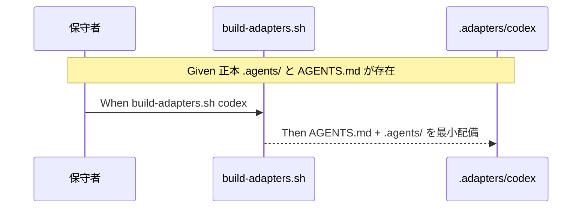

# 要件定義書: multi-tool 対応（gemini / copilot / codex）

**プロジェクト名**: multi-tool 対応（gemini / copilot / codex）
**作成日**: 2026 年 06 月 14 日
**最終更新**: 2026 年 06 月 14 日

> **重要**: **このドキュメントは常に更新**: 要件の変更や追加があった場合は、即座に更新してください。
>
> **用語**: [.agents/CONCEPTS.md §用語規約](../../../../../.agents/CONCEPTS.md#用語規約) を参照。
>
> **事実/判断/要確認の区別**: 00_要求定義 §1.2 の【事実1〜9】を本書でも参照する（出典 URL は 00 に集約）。

---

## 1. 概要

### 1.1 システム概要

正本 `.agents/`（および `AGENTS.md`）から、gemini / copilot / codex 向けアダプタを `build-adapters.sh` の拡張点（`SUPPORTED_TOOLS` 追加＋`adapter_<tool>()` 新設）で生成する。各ツールの配置/skill/フックは 00 §1.2 で出典付きに確定済み。codex は AGENTS.md 直読の最小サポートから段階導入する。enforcement は各ツールの `PreToolUse` 相当フック（runtime reject）または CI audit で補完する。

### 1.2 用語集

| 用語 | 説明 |
| ---- | ---- |
| アダプタ | 正本 `.agents/` から各ツール向けに生成した配備物。`.adapters/<tool>/` 配下【事実: `docs/maintainer/adapters.md`】 |
| 拡張点 | `build-adapters.sh` の `SUPPORTED_TOOLS` 追加＋`adapter_<tool>()` 新設【事実: `build-adapters.sh:19,103`】 |
| コンテキスト/指示ファイル | エージェントに渡す指示の正本ファイル（GEMINI.md / AGENTS.md / .github/copilot-instructions.md 等）【事実1・事実5・事実8】 |
| skill 相当機構 | 各ツールの再利用プロンプト機構。gemini=TOML カスタムコマンド、copilot=`.instructions.md`/prompt、codex=slash commands【事実3・事実5・事実8】 |
| PreToolUse フック | tool 実行前に走り、ブロック/拒否できるフック（gemini/copilot/codex で対応）【事実4・事実7・事実9】 |
| CI audit | フックを使わない経路で規約違反を検出する CI（`audit.sh` 相当）【判断・親 03 §2.4】 |
| 最小配備 | 専用生成物を作らず AGENTS.md（＋同梱 `.agents/`）配備のみに留めること（codex 初期）【事実8】 |

---

## 2. 機能要件

### 2.1 ユーザーストーリー

#### ストーリー 1: codex 採用先で AGENTS.md 直読の最小サポートを得る

- **As a** codex（OpenAI Codex CLI）を使う採用先プロジェクト
- **I want to** 正本 `AGENTS.md` を配備するだけで Codex に契約を読ませたい
- **So that** 専用生成物を増やさず単一正本で運用できる

**受け入れ基準**:

- `build-adapters.sh codex` が成功し、`.adapters/codex/` に `AGENTS.md`（＋同梱 `.agents/`）が出力される（SC-01・SC-02）。
- codex は AGENTS.md をネイティブ直読する前提で、不要な専用生成物が作られない【事実8】。

#### ストーリー 2: gemini 採用先で文脈ファイルとカスタムコマンドが配備される

- **As a** Gemini CLI を使う採用先プロジェクト
- **I want to** 文脈ファイル（GEMINI.md または AGENTS.md 参照設定）と skill 相当（TOML カスタムコマンド）を配備したい
- **So that** Gemini にプロジェクト契約と再利用コマンドを与えられる

**受け入れ基準**:

- `build-adapters.sh gemini` が成功し、文脈ファイルが配備される（`GEMINI.md` 配置、または `context.fileName` に AGENTS.md を含める設定）【事実1・事実2】。
- skill 相当が `.gemini/commands/*.toml` 形式（`{domain}__{capability}` 名前空間）で配備される、または未対応の場合は理由が設計に明記される【事実3】。

#### ストーリー 3: copilot 採用先で instructions が配備される

- **As a** GitHub Copilot を使う採用先プロジェクト
- **I want to** `.github/copilot-instructions.md`（または AGENTS.md ネイティブ参照）と `.instructions.md` を配備したい
- **So that** Copilot にリポジトリ契約とパス別指示を与えられる

**受け入れ基準**:

- `build-adapters.sh copilot` が成功し、`.github/copilot-instructions.md`（または AGENTS.md 参照）が配備される【事実5・事実6】。
- skill 相当は `.instructions.md`（frontmatter `applyTo`）で配備される、または未対応の場合は理由が設計に明記される【事実5】。

#### ストーリー 4: フック非対応経路でも enforcement が CI で補完される

- **As a** 保守者
- **I want to** フックで実行時拒否できない経路でも規約違反を検出したい
- **So that** どのツールでも enforcement の穴を残さない

**受け入れ基準**:

- 各ツールの `PreToolUse` 相当フック（gemini/copilot/codex で対応【事実4・事実7・事実9】）が runtime reject を構成する、またはフックを使わない経路では CI audit が違反を検出する（SC-03）。

#### ストーリー 5: 既存 claude/cursor が非破壊で 3 系統が単一正本派生

- **As a** 保守者
- **I want to** multi-tool 追加後も claude/cursor の生成が壊れないことを確認したい
- **So that** 既存利用者に回帰を起こさない

**受け入れ基準**:

- claude+cursor+codex の 3 系統が同一正本 `.agents/` から派生し、claude/cursor の再生成 diff がゼロ（SC-04）。

#### ストーリー 6: 各ツールの事実が出典付きで確定している

- **As a** 後続フェーズ（02/03）の実装者
- **I want to** 各ツールの配置/skill/フックを推測でなく事実で参照したい
- **So that** 誤った生成物を配らない

**受け入れ基準**:

- 00 §1.2 の表と出典リストに各ツールの配置/skill/フックが記載され、未確証は【要確認】で明示される（SC-05）。

### 2.2 BDD ユースケース

#### ユースケース 1: codex の AGENTS.md 直読・最小配備

codex を有効化すると AGENTS.md（＋同梱 .agents）が配備され、不要な専用生成物が作られない。

**シナリオ 1: codex アダプタ生成（最小）**

```gherkin
Feature: multi-tool 段階導入
  Scenario: codex を有効化すると AGENTS.md 直読の最小配備になる
    Given 正本 .agents/ と AGENTS.md が存在する
    And codex は AGENTS.md をネイティブ直読する（事実8）
    When build-adapters.sh codex を実行する
    Then .adapters/codex/ に AGENTS.md と同梱 .agents/ が出力される
    And codex 専用の余計な生成物は作られない（最小配備・SC-02）
```

**処理フロー**:



**シナリオ 2: codex フックによる runtime reject 経路の存在**

```gherkin
Feature: multi-tool 段階導入
  Scenario: codex のフックで実行時拒否を構成できる
    Given codex は PreToolUse フックで tool 実行を deny できる（事実9）
    When 規約違反となる tool 呼び出しが発生する
    Then PreToolUse フック（permissionDecision deny / exit 2）で拒否される、または CI audit が違反を検出する（SC-03）
```

#### ユースケース 2: gemini の文脈ファイル・skill 相当配備

**シナリオ 1: gemini アダプタ生成**

```gherkin
Feature: gemini 配備
  Scenario: gemini を有効化すると文脈ファイルが配備される
    Given Gemini CLI は GEMINI.md を階層読込し、context.fileName で AGENTS.md も読める（事実1, 事実2）
    When build-adapters.sh gemini を実行する
    Then 文脈ファイル（GEMINI.md 配置 または AGENTS.md 参照設定）が .adapters/gemini/ に配備される
    And skill 相当が .gemini/commands/*.toml 形式で配備される、または未対応の理由が設計に明記される（事実3）
```

#### ユースケース 3: copilot の instructions 配備

**シナリオ 1: copilot アダプタ生成**

```gherkin
Feature: copilot 配備
  Scenario: copilot を有効化すると instructions が配備される
    Given Copilot は .github/copilot-instructions.md と AGENTS.md をネイティブに読む（事実5, 事実6）
    When build-adapters.sh copilot を実行する
    Then .github/copilot-instructions.md（または AGENTS.md 参照）が .adapters/copilot/ に配備される
    And skill 相当が .instructions.md（applyTo frontmatter）で配備される、または未対応の理由が設計に明記される（事実5）
```

**シナリオ 2: copilot フックによる runtime reject**

```gherkin
Feature: copilot 配備
  Scenario: copilot のフックで実行時拒否を構成できる
    Given Copilot は preToolUse フックで tool を approve/deny できる（事実7）
    When 規約違反となる tool 呼び出しが発生する
    Then .github/hooks/*.json の preToolUse で拒否される、または CI audit が違反を検出する（SC-03）
```

#### ユースケース 4: 既存非破壊・単一正本派生

**シナリオ 1: 3 系統の単一正本派生**

```gherkin
Feature: multi-tool 段階導入
  Scenario: claude+cursor+codex が単一正本から派生し既存が非破壊
    Given 正本 .agents/ から claude/cursor が既に生成できる
    When build-adapters.sh claude cursor codex を実行する
    Then 3 系統すべてが同一正本 .agents/ から派生する
    And claude/cursor の再生成 diff はゼロ（SC-04）
```

### 2.3 ビジネスルール

- 正本は `.agents/`（および `AGENTS.md`）の 1 か所。`.adapters/<tool>/` は 100% 生成物で手編集しない【事実: `docs/maintainer/adapters.md`】。
- 拡張は `SUPPORTED_TOOLS` 追加＋`adapter_<tool>()` 新設のテーブル駆動に限定し、配備ロジック（`{domain}__{capability}`）を二重定義しない【事実: `build-adapters.sh:19,27`】。
- 確証が取れない仕様は【要確認】に留め、未確証間は最小配備に限定する【判断・親 03 §7】。
- 段階導入順は codex（最小）→ gemini → copilot とする（cursor は対応済みのため対象外）【判断・親 03 §2.4】。

---

## 3. 非機能要件

### 3.1 パフォーマンス要件

- ビルドは決定的（同一正本からの再生成で差分ゼロ）【事実: 親 03 §フェーズ2】。

### 3.2 セキュリティ要件

- フックによる runtime reject は各ツール公式仕様（exit code 2 / `permissionDecision: deny`）に準拠する【事実4・事実7・事実9】。
- フックの配置・trust 規約に従う（例: codex プロジェクト `.codex/` の trust）【事実9】。

### 3.3 ユーザビリティ要件

- `build-adapters.sh <tool>` 一発で各ツールのアダプタを生成できる（既存 UX を踏襲）【事実: `docs/maintainer/adapters.md` ビルド節】。

### 3.4 可用性要件

- multi-tool 追加が既存 claude/cursor の生成を阻害しない（非破壊・SC-04）。

---

## 4. 外部インターフェース要件

### 4.1 API 要件

- `build-adapters.sh [tools...]`（引数 > 環境変数 `TOOLS` > 全 `SUPPORTED_TOOLS`）の I/F を維持し、gemini/copilot/codex を引数として受理できるようにする【事実: `build-adapters.sh:218-241`】。
- 各ツールが参照する正本ファイル: codex/copilot は `AGENTS.md`（ネイティブ）、gemini は `GEMINI.md` または `context.fileName` 設定の AGENTS.md【事実2・事実6・事実8】。

### 4.2 データ形式要件

- gemini カスタムコマンド: TOML（`description`・`prompt` キー、`.gemini/commands/<ns>/<name>.toml`）【事実3】。
- copilot 指示: Markdown（`.github/copilot-instructions.md`）＋ `.instructions.md`（YAML frontmatter `applyTo`）【事実5】。
- codex: `AGENTS.md`（Markdown、32 KiB 上限）／フック `hooks.json`・`config.toml [hooks]`【事実8・事実9】。

---

## 5. 制約事項

- 正本一元化（`.agents/` → `build-adapters.sh` 生成）、`{domain}__{capability}` 配備、フック非対応経路は CI（audit）で補完、という親 issue の方針を踏襲する【事実: 親 02 §3.3・親 03 §2.4】。
- gemini/copilot は Agent Skills(SKILL.md) 形式の skill 機構を持たないため、skill 相当の配備（TOML / `.instructions.md`）への変換は 02_設計 で定義する【事実3・事実5】。
- 実 publish / marketplace 公開は対象外【事実: 親 03 §9 未決#1】。
- 詳細実装（生成物の正確な構造、フック本体、CI audit 配線）は後続フェーズ（02/03）に委ねる。

### 5.1 残した【要確認】

- **gemini の skill 相当の最終形**: `.agents/` の `{domain}__{capability}` を TOML カスタムコマンドへどう機械変換するか（命名規約・name 衝突回避）は 02_設計 で確定【要確認】。
- **gemini フックの設定ファイル経路**: PreToolUse フックの正確な設定キー・配置（`settings.json` か専用ファイルか）は実装時に再確認【要確認: 事実4 は機構の存在と exit 2 ブロックまで確証、配置詳細は実装時確認】。
- **copilot の CLI と coding agent の差**: `.github/hooks/*.json` は cloud agent/CLI 双方対応だが【事実7】、CLI 個人フック `~/.copilot/hooks/*.json` を配布物に含めるかは設計判断【要確認】。
- **codex の skill 厳密対応**: slash commands/prompt はあるが、Agent Skills(SKILL.md) 互換の skill 機構の有無は未確証【要確認: 事実8 は AGENTS.md 直読・slash commands まで確証】。

---

## 6. 参考資料

### プロジェクトドキュメント

- [`00_要求定義.md`](./00_要求定義.md) - 要求定義（§1.2 に各ツールの配置/skill/フックの事実＋出典）。
- 親 issue: [`docs/maintainer/workflow/20260614_124435_配布とパッケージ構成の再設計/`](../20260614_124435_配布とパッケージ構成の再設計/)（02 §3.1/§5・03 §2.4・§9 未決#3〜#5）。
- [`.agents/scripts/build-adapters.sh`](../../../../../.agents/scripts/build-adapters.sh)・[`.agents/platforms/SKILLS.md`](../../../../../.agents/platforms/SKILLS.md)・[`docs/maintainer/adapters.md`](../../adapters.md)。

### その他の参考資料（Web 出典）

- 00_要求定義 §1.2 の出典リスト（事実1〜9・agents.md 規格）を参照。

---

## 7. 前のステップ

この要件定義書は、以下を基に作成されています：

- **前**: [`00_要求定義.md`](./00_要求定義.md) - 要求定義フェーズ

---

## 8. 次のステップ

この要件定義書の承認後、以下を作成します：

- **次**: [`02_設計.md`](./02_設計.md) - 設計フェーズ
</content>
